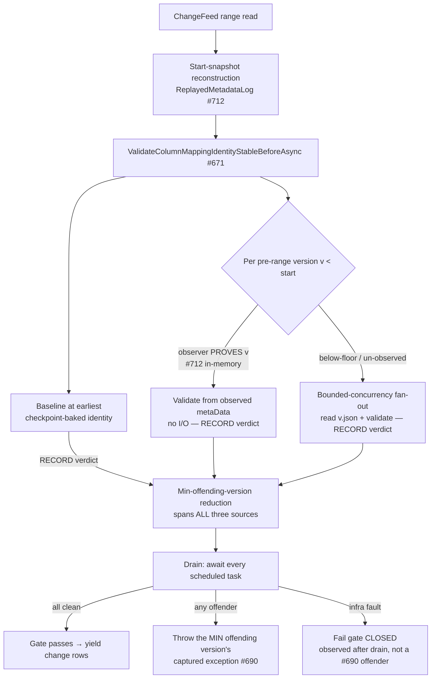
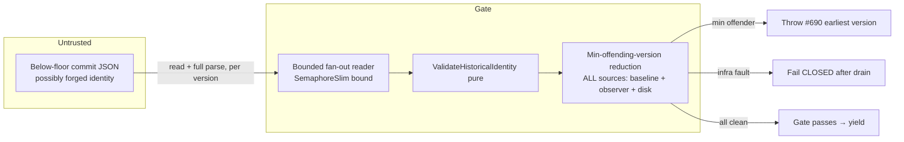

# CDF pre-range column-mapping identity scan — bounded-concurrency fan-out (deterministic, coverage-neutral)

> **Status:** Draft
> **Issue:** [#808](https://github.com/khaines/deltasharp/issues/808) — perf(cdf): bounded-concurrency fan-out for the below-floor pre-range column-mapping identity scan (redirect from #691)
> **Author:** design-doc skill (orchestrated)
> **Reviewers:** cloud-native-distributed-systems-architect, cloud-native-security-sme, cloud-native-site-reliability-engineer, performance-benchmarking-engineer, delta-storage-format-engineer, dotnet-framework-runtime-engineer
> **Last Updated:** 2026-08-14
> **Related:** #691 (parent perf issue, closed), #697 (listing half delivered), #782/`9af9c01` (double-read collapse), #671 (CDF pre-range identity gate), #690 (earliest-offending-version error contract), #712 (`ReplayedMetadataLog` proven-observation reuse), #653 (path-free identity errors)

---

## 1 · Overview

Reading a Change Data Feed range validates a **fail-closed security gate**: the table's column-mapping
**identity** (mode, per-column field id / physical name, partition columns) must be **immutable across all
retained history at or below the range start**, or the read fails closed rather than risk emitting mismapped
change rows (#671, #690). The gate lives in `DeltaLog.ValidateColumnMappingIdentityStableBeforeAsync`.

Most pre-range versions are proven for free by reusing the start-snapshot reconstruction's observed metadata
(`ReplayedMetadataLog`, #712) — an in-memory lookup, no I/O. But every **surviving pre-range commit the replay
never reached** — the classic case being commits **strictly below a compacting checkpoint floor** — is not in
the observer and must be **read from the object store**. Today that below-floor read is a **sequential
`foreach`** issuing one commit `GET` at a time. On a table with ~10,000 retained pre-range commits and
interval-10 checkpoints, the replay covers ≤10 and the gate still issues **~9,990 serialised GETs**; at
30–60 ms per object-store GET that is **5–10 minutes of pure serialised latency** before the first change row
is yielded. The GET *count* is intrinsic (coverage-neutral — see §5); the **serialisation** is the waste.

This design adds a **bounded-concurrency fan-out** (configurable; sane default) of exactly those below-floor
reads, **coverage-neutral by construction** and preserving the gate's two hard contracts:

1. **Deterministic "earliest offending version" error** (#690). Today the sequential in-ascending-order loop
   makes first-failure == earliest offender for free. Under concurrency, failures complete out of order, so the
   surfaced version must come from an explicit **min-offending-version reduction** — never first-failure-wins —
   so the reported version is identical regardless of GET-completion order or the concurrency bound.
2. **Fail-closed ordering.** The gate still completes **in full** before any change row is yielded; a partial or
   failed read fails the whole gate closed. Concurrency changes only *how fast* the reads happen, never
   *whether* the gate blocks the yield.

**Requirements traceability:** #808 acceptance criteria (§3.6). This is the surviving `O(retained-before-start)`
half re-scoped from #691 after #697 delivered the listing collapse and `9af9c01` collapsed the double read.

**Non-goals (explicitly rejected during #691/#697 review — not re-litigated here):** reusing the end-snapshot
reconstruction (cuts nothing — the below-floor commits are read by neither reconstruction); a listing-derived
presence signal (fail-open under a forged log); `metaData`-only parsing (a fail-closed→fail-open posture
change on a security gate); a cross-read identity cache (a stale entry in front of a fail-closed gate is a
fail-open surface — its own PR if ever). This design touches **only** the concurrency of the existing reads.

---

## 2 · Logical architecture

### 2.1 Where the fan-out sits



The change from today is **local**: the `foreach (long version in listing.Commits)` loop keeps its exact
membership predicate and per-version validation, but (a) the **disk-read branch** is executed as a bounded
fan-out, and (b) **every** validation source — the disk reads, the in-memory observer-proven versions, and the
baseline-at-`earliest` — **records** its verdict into a single **min-offending-version reduction** rather than
throwing inline. The gate surfaces a failure only **after the full drain**, so no offender's version depends on
GET-completion order.

### 2.2 The validation set is UNCHANGED (coverage-neutrality is structural)

The set of versions validated is **identical** to today, because the membership predicate is untouched:

```
{ v ∈ listing.Commits : v < rangeStartVersion }         // every pre-range commit, minus none
   ├── v proven by the start-snapshot observer (#712)   → validate from observed metaData (in-memory)  → RECORD verdict
   └── otherwise (below-floor / un-observed)            → READ v.json, validate  ← the ONLY branch fanned out → RECORD
   plus the baseline at `earliest` (checkpoint-baked identity) when earliest < rangeStartVersion → RECORD verdict
```

`ValidateHistoricalIdentity` is a **pure function** of `(version, metadata, endIdentity)` — no shared state, no
ordering dependence — so validating the same set in any order yields the same verdict per version. The design's
coverage-neutrality is therefore *structural*, not a tuning artifact: **same versions, same per-version verdict,
different read schedule.** (Pinned by AC-6 / §3.2: a recording backend proves the validated version **set** is
identical sequential-vs-concurrent, that each below-floor version is read **exactly once** (multiset, not just
set — guards the #782 double-read regression class), and that observer-covered versions still issue **zero**
GETs.)

> **The observer branch is not fanned out, but its verdict IS deferred.** Observer-proven versions are in-memory
> lookups with **no I/O**, so they are not scheduled concurrently; but their per-version verdict is **recorded
> into the same reduction, never thrown inline** (§2.3). This is the correction to the naive "validate in-memory,
> as today" reading: because the loop visits versions in ascending order and the observer-proven versions sit at
> or above the checkpoint floor while the fanned sub-floor strays sit *below* it, an inline throw on a *higher*
> observer version could pre-empt a still-in-flight *lower* stray's offense — a latency-dependent #690 break.
> Recording all sources into the reduction and throwing only after the drain removes that hazard by construction.

### 2.3 Deterministic min-offending-version reduction (the crux)

Under concurrency, per version there are two disjoint outcome classes. **Fail-closed offenses** — an **identity
mismatch** (`ColumnMappingIdentityNotImmutable`, an `Unsupported` protocol error), a **malformed commit**
(`DeltaProtocolException.Malformed` — unparseable JSON / schemaString / >1 `metaData`), or a **read-ceiling /
object-too-large** fault (`DeltaProtocolException.Inconsistent`) — are attributable to a specific version and
feed the min reduction. **Infra faults** — a transient `IOException` / `DeltaStorageException` / a foreign-token
`OperationCanceledException` — are **not** a #690 "offending version"; they are handled separately (below).
#690 pins that the surfaced offense **names the earliest offending version**. Today's in-order sequential throw
satisfies this incidentally; a naive fan-out that lets the first-completing failure propagate (e.g.
`Parallel.ForEachAsync`'s default first-exception-cancels behaviour) is **non-deterministic** — the reported
version would depend on GET latency, so two identical reads of a forged table could name different versions.
That is both a test-contract break (#690) and a subtle **information-consistency** weakness (§6).

**Contract.** The gate surfaces the failure of the **numerically smallest offending version across ALL three
validation sources** (baseline-at-`earliest`, observer-proven, disk-read) **and all fail-closed kinds**,
deterministically, independent of completion order and of the concurrency bound (including bound = 1).
Mechanically:

- Every validation site — the baseline, each observer-proven version, and each fan-out task — **catches its own**
  fail-closed exception (never lets it escape, so no sibling-cancelling `AggregateException` and no inline throw)
  and offers `(version, exception)` to a shared **min reduction**.
- The reduction keeps the offender with the **smallest version** as **one atomic unit**. Because `(version,
  exception)` is a *pair* (a `long` and an `Exception` reference), a compare-and-set on the `long` alone would
  tear (thread A publishes `min=5` then thread B lowers `min=3` while A's exception store wins → `(min=3,
  exception-for-5)`). The reduction therefore updates the pair atomically — either a `lock` around the
  compare-and-update (offenders are rare — a forged table only — and the happy path never enters it, so
  contention is nil), or an `Interlocked.CompareExchange` on a single reference to an immutable
  `sealed record Offender(long Version, Exception Ex)` in a min-CAS loop. Versions are unique, so ties are
  impossible.
- After the fan-out **drains** (every scheduled task awaited and its result observed — never abandoned), the gate
  re-throws the min offender's **captured exception**, preserving its original type and path-free message (#653).
  Otherwise the gate passes.
- **Ordering across kinds is by version only** — a malformed commit at v=5 outranks an identity mismatch at
  v=9. This is the honest generalisation of "earliest offending version": the earliest version that fails the
  gate *for any reason* is surfaced.

> **Infra faults fail the gate CLOSED without becoming a #690 offender.** A non-offense read fault (transient
> IO, storage-object vanished, an OCE bearing a token that is neither the caller's nor an internal one) must
> **not** be swallowed (that would fail *open*) and must **not** be mislabelled as an offending version at that
> version (that would corrupt #690). It is captured into a **separate** infra-fault slot; after the drain, the
> gate throws the min *offender* if one exists (an infra fault never masks a smaller genuine offense), otherwise
> it re-throws the infra fault (fail-closed, observed deterministically after all siblings complete). This keeps
> the reduction's version semantics clean while never yielding a change row on any fault.

> **Relationship to today's order (a deliberate #690 tightening).** Today the baseline validates `earliest`
> **before** the ascending loop, and `earliest` (the checkpoint floor) typically sits *above* the surviving
> sub-floor strays — so on a pathological log with an offending baseline at the floor AND an offending stray
> below it, today surfaces the *floor* version, not the numeric minimum. The reduction adopts the **true global
> minimum** across all sources. This is identical to today on every **single-offender** table (all existing
> #671/#690 tests — each names one version), and a well-defined, deterministic tightening on the multi-offender
> forged case. §8 states the exact bound = 1 equivalence this preserves and the one sub-case it deliberately
> refines.

### 2.4 Safe early-skip (pruning) — skip not-yet-started only, never cancel in-flight

Validating all ~10k versions even after an early offender is found is wasteful, but **in-flight** cancellation
is where determinism (and safety) breaks. Chosen rule: once an offender at version `X` is recorded, the
scheduler **skips launching** any **not-yet-started** task whose version is **strictly `> X`** — it never
cancels an already-running read. Versions `≤ X` that are not yet started, and all in-flight reads, **run to
completion**. Rationale:

- A version `> X` cannot lower the min, so never starting it changes cost, never the verdict. A skipped version
  is provably `> X ≥ final-min`, so it is neither an offender-of-record nor a masked smaller offense.
- **No in-flight read is cancelled** (the earlier draft cancelled `> X` in-flight reads via a shared linked
  CTS — rejected: a single `Cancel()` cancels *every* linked read, including versions `< X` that must complete,
  and it reintroduces a caller-vs-internal-token disambiguation hazard). By skipping only *not-yet-started*
  tasks, the **only** cancellation token in the whole gate is the **caller's** (§2.6) — there is no internal
  prune token, so a caller cancel can never be misclassified/swallowed.
- On a bounded fan-out with `B ≫ bound`, the overwhelming majority of tasks are queued (not yet started) when an
  early offender lands, so skip-not-yet-started captures essentially all of the short-circuit's saving without
  cancelling anything. The `>` is **strict** (a version `== X` is the offender itself, already recorded; a
  version `< X` must run). (Pinned by AC-3 / §3.5: an off-by-one `≥` would skip a smaller offender at `< X`.)

Skipping is a pure optimisation layered on §2.3; with skipping disabled the result is identical, only slower.
The correctness proof rests on §2.3, not on §2.4.

### 2.5 Concurrency primitive & bound

- **Primitive.** A bounded fan-out over the disk-read versions using an explicit `SemaphoreSlim(bound)` +
  `Task` list + `WhenAll`, chosen over `Parallel.ForEachAsync` because the loop body must **swallow** fail-closed
  exceptions into the reduction (§2.3) — `Parallel.ForEachAsync`'s built-in first-exception cancellation would
  both stop validating versions `< X` (which the min reduction requires) and surface a latency-ordered
  exception. The explicit form gives precise control over the drain, the not-yet-started skip, and the
  max-in-flight assertion tests need.
- **Producer-gated admission.** `await sem.WaitAsync(callerToken)` runs in the **scheduling loop before
  launching each task**, not inside the task body — so the number of *live* `Task` state machines is also
  bounded (else all `B ≈ 10k` tasks/closures allocate up front and the semaphore bounds only concurrent GETs,
  not the task graph). Each task body releases via `sem.Release()` in a `finally` on **every** path (success,
  offense-caught, infra-fault-caught, skip). Tasks are scheduled in **ascending** `listing.Commits` order so
  bound = 1 reproduces today's ascending read order exactly (§8). The captured loop version is a **per-iteration
  local** (no shared-closure capture).
- **Bound.** A new **configurable** concurrency limit, default **16** (issue range 16–32), surfaced as an
  internal `DeltaLog` construction parameter (`int preRangeScanConcurrency = DefaultPreRangeScanConcurrency`)
  alongside the existing `maxLogObjectBytes` / decode budgets (`DeltaLog.cs` ctor), threaded to the gate.
  **Bound = 1 restores today's sequential read set + order** (the kill-switch, §8). The bound is validated
  (`ArgumentOutOfRangeException.ThrowIfNegativeOrZero(preRangeScanConcurrency, nameof(...))`) at construction,
  mirroring the existing budget fail-fast.
- **Backpressure/fairness.** The semaphore bounds in-flight object-store GETs so the gate cannot exhaust the
  backend connection pool or amplify a slow-dependency stall into a fan-out storm (§6 DoS). The bound is a
  **ceiling**, not a target: a gate with 3 below-floor reads issues 3, never 16.

### 2.6 Cancellation, exceptions & lifetime

- **One token — the caller's.** Because pruning skips only *not-yet-started* tasks (§2.4) and never cancels an
  in-flight read, the gate introduces **no internal cancellation token**. The caller's `cancellationToken` is
  the only one: it is checked before admitting each task and flows into every read. A caller cancel fails the
  **whole** gate closed with `OperationCanceledException`, yields nothing (unchanged fail-closed behaviour), and
  — with no internal token to confuse it with — can never be swallowed. (This retires the earlier draft's
  fragile "distinguish prune-OCE from caller-OCE by token identity", which was unsound under a linked CTS since
  both cases carry the linked token.)
- **Drain guarantee.** The method awaits **every** admitted task (via `Task.WhenAll` over the task list inside a
  `try` whose `finally` also drains on the exception path) before returning or throwing, and **observes every
  task's result** — tasks never fault outward (fail-closed offenses and infra faults are both caught into their
  reduction/infra slot and the task completes normally or cancelled), so there is no
  `TaskScheduler.UnobservedTaskException`. No read is left running past the gate — no orphaned GET, no post-gate
  exception escaping into a later yield. This preserves "the gate completes before any change row is yielded"
  under concurrency (§3.4, AC-4).
- **Resource hygiene.** `sem.Release()` is in a `finally` on every task path (no semaphore leak on offense,
  infra fault, or skip); the `SemaphoreSlim` (and any state) is disposed after the drain completes, never
  before (disposing while a task still holds it throws `ObjectDisposedException`). A subsequent gate on the same
  `DeltaLog` therefore always starts at full concurrency (pinned by the semaphore-replenishment oracle, §3.5).

### 2.7 API surface

Internal only. One new **optional** `DeltaLog` constructor parameter
(`int preRangeScanConcurrency = DefaultPreRangeScanConcurrency`, default 16) and the internal rewrite of the
disk-read branch of `ValidateColumnMappingIdentityStableBeforeAsync`. No public API change; no change to the
change-feed read's observable results on any conforming table.

### 2.8 Component boundaries

| Component | Responsibility | Change |
|---|---|---|
| `DeltaLog.ValidateColumnMappingIdentityStableBeforeAsync` | The #671 pre-range identity gate | Fan out the disk-read branch with a producer-gated bounded semaphore; **record** every source's verdict (baseline, observer, disk) into one min-version reduction (never inline throw); handle infra faults fail-closed; drain + observe every task before return |
| `DeltaLog` ctor | Reader configuration | Add validated `preRangeScanConcurrency` (default 16; 1 = sequential kill-switch) |
| `ReadCommitActionsAsync` | Read + parse one commit | **Unchanged** (already pure per-version; now called concurrently) |
| `ValidateHistoricalIdentity` / `BuildIdentity` | Pure per-version verdict | **Unchanged logic** — but its verdict is **recorded into the reduction, not thrown inline** (§2.2/§2.3) |
| `ReplayedMetadataLog` (#712) observer branch | Prove pre-range versions for free | **Unchanged** (in-memory, not fanned out); its offender verdict now records into the reduction |
| Telemetry (`DeltaStorageTelemetry`) | Gate cost visibility | Add a pre-range-scan duration + max-in-flight signal (§7), path-free |

---

## 3 · Functional test scenarios & correctness oracles

### 3.1 Happy path
- **Below-floor strays validated concurrently, gate passes.** A table with a compacting checkpoint and N
  surviving sub-floor commits, all sharing the end identity: the gate passes; a spy backend confirms exactly
  the N below-floor versions were read (observer-covered versions issue **zero** GETs), and the change rows are
  yielded only **after** the gate returns.

### 3.2 Coverage-neutrality (AC-6) — the set is invariant, each version read EXACTLY ONCE
- **Same validated set, sequential vs concurrent.** For a corpus (checkpoint-seeded deep retention, no
  checkpoint / full replay, mixed observer-covered + below-floor, floor-commit-aged-out baseline case), a
  recording backend asserts the **exact set of versions read+validated is identical** at bound = 1 and
  bound = 32, and identical to the pre-change implementation. No version added, none dropped.
- **Exactly-once (multiset, not just set).** The recording backend asserts **per-version read count == 1** for
  the below-floor set at bounds {1, 4, 32} — a *multiset* equality run in the **correctness** suite (not merely
  the §4 `GET count == B` perf gate). This catches a fan-out that double-reads a version (the #782 double-read
  regression class, in this exact code) which a set-only oracle would miss.
- **Observer reuse preserved.** Versions the #712 observer proves still issue **no** GET at any bound (the
  fan-out set is exactly the disk-read branch); the baseline-at-`earliest` reconstruction issues its reads once.

### 3.3 Deterministic earliest-offending-version (AC-3) — must fail under first-failure-wins, ACROSS branches
- **Two below-floor offenders, low always wins.** A forged table with a column-mapping identity mismatch at a
  **low** pre-range version `v_lo` and another at a **high** version `v_hi` (`v_lo < v_hi`), both below floor:
  the gate throws naming **`v_lo`** — at bound ∈ {1, 4, 32} and under **injected per-version latency skew** that
  makes `v_hi` complete first. A first-failure-wins implementation names `v_hi` under skew → this test fails it.
- **Cross-branch: observer-proven offender (high) vs disk offender (low).** An **observer-proven** offender at a
  **high** version `v_hi` (at/above the floor, validated in-memory) and a **below-floor disk** offender at a
  **low** version `v_lo` (`v_lo < v_hi`), with skew so the in-memory observer branch resolves *first*: the gate
  must still name **`v_lo`**, at bounds {1, 4, 32}. This fails any implementation that throws the observer
  verdict inline (§2.2 correction) instead of recording it into the reduction. Include the inverse
  (observer-proven low, disk high → names low).
- **Cross-branch: baseline offender (floor) vs lower sub-floor stray offender.** A forged **checkpoint-baked**
  identity at the floor `earliest` (baseline offender) AND a surviving **sub-floor stray** offender at
  `v < earliest`: the gate names the **numeric minimum** (`v`), deterministically at all bounds — pinning the
  §2.3 "true global-min across all sources" decision (and the deliberate refinement vs today's baseline-first
  order, §8).
- **Mixed failure kinds, min version wins across kinds.** A malformed commit at `v=5` and an identity mismatch
  at `v=9`: the surfaced error corresponds to **v=5** (malformed), deterministically, regardless of which read
  completes first. And the symmetric case (identity at v=5, malformed at v=9) surfaces v=5's identity error.
- **Determinism under repetition.** The same forged table read K times (and across bounds) always surfaces the
  identical version and exception type — a property/metamorphic assertion, not a single-shot check.

### 3.4 Fail-closed ordering, faults & lifetime (AC-4)
- **Gate blocks the yield.** With an offender present, **no** change row is observable before the throw (a
  yielded-row spy asserts zero rows emitted). The gate's fan-out is fully drained before the exception surfaces.
- **No orphaned reads after a failure/cancel.** After the gate throws (offender) or the caller cancels, assert
  **no** GET completes after the method returns (a backend that records completion timestamps vs the method's
  return) — the drain awaited every admitted task. Guards a post-gate GET leaking into a later yield.
- **Transient / infra fault → fail CLOSED, not swallowed, not a #690 offender.** Inject a transient `IOException`
  (or `DeltaStorageException`) on one below-floor read: assert the whole gate **fails closed** (throws, yields
  zero rows, the fault is **not** swallowed). And in a table that *also* has a genuine identity offender at a
  **lower** version, assert the gate still surfaces that **lower identity offender** (the infra fault neither
  masks nor pre-empts the min, and is not mislabelled as an offense at its own version).
- **Caller cancellation fails closed.** A caller `CancellationToken` cancelled mid-fan-out throws
  `OperationCanceledException` from the gate and yields nothing. (There is no internal prune token to
  misclassify it against — §2.6.)

### 3.5 Bounded concurrency respected (AC-2), skip-pruning & resource hygiene
- **Max in-flight == min(bound, belowFloorCount).** A gating backend (each GET blocks on a barrier and records
  concurrent-entry count) asserts the observed maximum simultaneous in-flight reads is **exactly**
  `min(bound, belowFloorCount)` for bounds {1, 4, 16} — an **equality** (a too-low max catches an accidentally
  serial fan-out; a too-high max catches an unbounded one).
- **Skip-pruning: `>` strict, verdict-invariant, lower offender never skipped.** With pruning ON and an offender
  at a **high** version completing **first** (arming the skip), a **lower** offender is the slowest remaining
  read: assert the gate names the **low** offender **and** the low offender's read **ran to completion** (was
  not skipped/cancelled), at bounds {1, 4, 32}. An off-by-one `≥` (skipping `< X`) or an in-flight cancellation
  would drop the low offender → this fails it. With pruning disabled the verdict is identical (only more reads
  complete).
- **Semaphore replenishment (no leak).** After a fan-out that **throws** mid-flight, and separately after a
  skip-pruned run, a **subsequent** gate on the same `DeltaLog` still reaches `max-in-flight ==
  min(bound, belowFloorCount)` (equivalently `CurrentCount == bound` post-return) — pinning `finally`-release on
  every task path (offense, infra fault, skip).

### 3.6 Determinism / purity
- `ValidateHistoricalIdentity` is pure; the reduction is an associative-commutative min over `(version,
  exception)` pairs → the gate verdict and surfaced version are a pure function of the log, independent of
  schedule. No wall-clock in the decision.

### 3.7 Acceptance-criteria mapping

| #808 AC | Scenario |
|---|---|
| Below-floor scan issues GETs with bounded concurrency (configurable; sane default) | §2.5; §3.1 |
| Concurrency bound respected under load (test asserts max in-flight) | §3.5 (AC-2) |
| "Names the earliest offending version" holds **deterministically** under concurrency, across all branches (fails under first-failure-wins) | §2.3; §3.3 (AC-3) |
| Fail-closed ordering + faults preserved: gate completes before any change row yielded | §2.6; §3.4 (AC-4) |
| Wall-clock improvement on a long retained history with a checkpoint | §4 benchmark |
| No change to the set of versions validated (coverage-neutrality + exactly-once pinned) | §2.2; §3.2 (AC-6) |

---

## 4 · Performance

- **Workload profile.** A CDF range read on a table with a long retained pre-range history behind a compacting
  checkpoint: `B` below-floor commits not covered by the #712 observer, each a ~30–60 ms object-store GET,
  issued **sequentially** today (`B` × latency serial). Observer-covered versions are already free.
- **Target.** Replace `B × latency` serial with `≈ ceil(B / bound) × latency` (plus validation, which is
  negligible/CPU-bound and overlaps). At `B = 9,990`, latency = 45 ms, bound = 16: **~7.5 min → ~28 s**
  wall-clock for the gate; bound = 32: **~14 s**. The **GET count is unchanged** (coverage-neutral) — this is a
  pure latency-hiding win, so the gate's object-store request volume and cost are identical. These figures are
  the **uniform-latency theoretical floor**; a real object store has straggler tails (a wave finishes at the
  **max** of its members), so production speedup is an **upper-bounded** fraction of the synthetic ratio.
- **Resource envelope.** Peak concurrent commit buffers rises from **1** to **≤ bound** (each ≤ the read
  ceiling `maxLogObjectBytes`), a bounded, configurable memory increase to call out (§6/§8); the live-task graph
  is likewise bounded by the producer-gated admission (§2.5), not `O(B)`. Allocation is otherwise per-version as
  today. No change to steady-state.
- **Regression gate (two arms, distinct instruments).**
  1. **Coverage-neutral (primary, cache-independent):** GET **count** == `B`, validated-version **set** and
     **per-version read count == 1** identical to sequential (AC-6, §3.2). Deterministic, noise-free — the
     authoritative gate.
  2. **Wall-clock speedup ratio with an EFFICIENCY FLOOR (corroborating):** on the **virtual-time** deterministic
     backend, assert the observed number of **admission waves == `ceil(B / bound)` ± 1** (equivalently, measured
     speedup ≥ `~0.7 × min(bound, B)`) — **monotone-up-to-bound is not sufficient** (it would pass a degenerate
     impl that returns 1.1× at every bound from an oversized critical section or a semaphore held too long). At
     **bound = 1** assert the wall-clock is within a **numerically stated margin of the measured noise floor**
     (established by an A/A virtual-time run); the fan-out's per-invocation `SemaphoreSlim`/task-list/reduction
     overhead is small but **nonzero**, so the margin is `noise-floor + <stated %>`, not exact equality.
- **Benchmark — TWO arms (the time model is split on purpose).**
  - **(a) Virtual-time ratio arm (fast, exact, no BenchmarkDotNet):** a deterministic scheduler
    (`TimeProvider`-driven fake clock) advances zero real wall-clock; the harness counts **admission waves** and
    asserts `waves == ceil(B / bound) ± 1` and the coverage-neutral invariants, across {`B` ∈ 100, 1k, 10k} ×
    {bound ∈ 1, 8, 16, 32}. This is the reproducible correctness-of-parallelism gate.
  - **(b) BenchmarkDotNet wall-clock arm (real time, small delay):** a **real** per-GET delay (~1–2 ms via
    `TimeProvider`) on reduced `B` / iteration budget (a 45 ms × 10k × BDN-iterations run is infeasible),
    reporting gate wall-clock and using **`MemoryDiagnoser` only for per-op allocation-rate / GC** regression —
    **not** for the peak claim.
  - **Peak-memory arm (separate, instrumented):** peak *simultaneously-held* buffer bytes is measured by a
    gating `IStorageBackend` that records `max concurrent in-flight reads × buffer size` (a live high-water
    probe), asserting `peak ≈ min(bound, B) × maxLogObjectBytes`. (`MemoryDiagnoser`'s cumulative allocated
    bytes are ~flat across bounds under coverage-neutrality, so it cannot surface the peak-retention envelope.)
  - **No-below-floor cell:** all observer-covered → the fan-out issues **zero** GETs and adds ~zero overhead.

---

## 5 · Security

- **This is a fail-closed security gate, not a cache.** The pre-range identity gate exists to refuse emitting
  **mismapped change rows** on a table whose column-mapping identity was tampered across history (#671, #690).
  The redesign must not weaken it in any of three ways, and by construction does not:
  1. **Coverage-neutral set.** The exact versions validated are unchanged (§2.2) — concurrency reschedules
     reads, it never removes one. An observer defect can still only cost an extra read, never shrink the set
     (the existing #712 invariant is untouched).
  2. **Fail-closed on every fault.** Any below-floor read that fails (malformed, read-ceiling, identity
     mismatch) fails the whole gate closed via the reduction; an **infra fault** (transient IO / storage /
     foreign-token OCE) fails the gate closed as an infra error observed after the drain (never swallowed, never
     mislabelled as a #690 offender — §2.3); a skip-pruned version is provably `> min` and never started, so it
     cannot mask a smaller offender; a *caller* cancel fails the whole gate closed (yields nothing).
  3. **No fail-open primitive introduced.** The rejected alternatives (listing-presence, `metaData`-only,
     cross-read cache — §1) are **not** used; the gate still reads and fully parses each below-floor commit's
     own JSON, exactly as today.
- **All validation sources feed one reduction.** Because the baseline-at-`earliest` and the observer-proven
  in-memory verdicts **record** into the same min reduction rather than throwing inline (§2.2/§2.3), no branch
  can pre-empt a smaller offense on another branch — closing the cross-branch #690 hazard the design review
  surfaced (a higher observer/baseline offender masking a lower in-flight sub-floor stray).
- **Data classification.** Commit JSON `metaData` (schema, field ids, physical names, partition columns) is
  table metadata (Confidential); the change rows the gate protects are tenant row data (Restricted). Errors are
  **path-free** (#653) — they name only a version, never a path or schema fragment.
- **Deterministic error = information-consistency.** The min-version reduction (§2.3) removes an
  observable that a naive fan-out would introduce: an attacker crafting a multi-offender forged log could
  otherwise influence *which* offending version the error names by racing GET latencies. Determinism closes
  that (small) side channel and keeps the #690 contract a stable, testable invariant.
- **Tenant isolation / secrets.** No new object-store credentials, paths, or cross-tenant surface; the fan-out
  runs within one already-authorised CDF read against one table root.

---

## 6 · Threat model



| STRIDE | Threat | Mitigation | Residual |
|---|---|---|---|
| **Tampering→mismapped-rows** | A forged pre-range commit swaps column-mapping identity below the checkpoint floor | Every below-floor commit's own JSON is read + validated (coverage-neutral set §2.2, exactly-once §3.2); mismatch → fail closed | None (unchanged from today) |
| **Repudiation / non-determinism** | Concurrency makes the surfaced offending version latency-dependent → #690 contract flaps, and an attacker can steer *which* version is named — including across the observer/baseline/disk branches | **Min-offending-version reduction spanning ALL sources** (§2.3): every branch records (never throws inline); the smallest offending version across all sources and fault kinds is surfaced deterministically at any bound | None |
| **Elevation (fail-open via swallowed fault)** | An infra fault (transient IO / foreign-token OCE) on a below-floor read is swallowed → an unvalidated version silently passes | Infra faults are captured and **re-thrown fail-closed after the drain**, never swallowed, never masking a smaller genuine offender (§2.3) | None |
| **DoS (fan-out amplification)** | Unbounded fan-out exhausts the backend connection pool / amplifies a slow-dependency stall | `SemaphoreSlim(bound)` ceiling + producer-gated admission (§2.5); bound configurable, default 16; a small gate issues only its few reads | Accepted (bounded, operator-tunable) |
| **DoS (memory)** | ≤ bound commit buffers + ≤ bound live tasks held concurrently (vs 1 today), each buffer ≤ read ceiling | Peak = bound × `maxLogObjectBytes`; task graph bounded by producer-gated admission (§2.5); both bounded/configurable; called out §4/§8 | Accepted (bounded) |
| **Elevation (fail-open via cancellation)** | A cancelled read silently passes a version that should have failed | Pruning **skips only not-yet-started** versions `> current-min` and **never cancels an in-flight read** (§2.4); the **only** cancellation token is the caller's, which fails the whole gate closed — so there is no internal token to misclassify a caller cancel against (retires the token-identity hazard) | None |
| **Tampering (observer defect)** | A #712 observer bug drops a version from the proven set | Observer miss falls back to a **disk read** (never a skip) — the existing #712 fail-closed invariant, preserved verbatim | None |

---

## 7 · Observability

- **Metrics.** Reuse `DeltaStorageTelemetry`. Add a bounded, path-free pre-range-scan signal: a **duration**
  histogram for the gate (`deltasharp.delta.cdf.pre_range_scan.duration`), a **below-floor read count**
  (versions fanned out), and the **observed max in-flight** (a low-cardinality gauge/counter, value-type only).
  No paths, no versions, no schema.
- **Logs.** No new log site required for the happy path (the gate is silent on success today). The existing
  fail-closed `DeltaProtocolException` messages are unchanged and **path-free** (#653), naming only the min
  offending version. If a debug log is added it renders only counts/bound (value-type-only), registered in the
  storage log-site roster.
- **Correlation.** The gate runs within the existing CDF-read `activity`/operation scope, so its duration and
  read count sit on the same trace as the range read.
- **Dashboards / alerting.** No new alert. A `pre_range_scan.duration` panel makes the previously-invisible
  serialised stall observable and lets an operator tune the bound; an unusually high below-floor read count on
  a table signals a checkpoint-cadence / retention issue worth a look, not an incident.

---

## 8 · Rollout & risk

- **Rollout.** Pure internal performance change; no CRD/operator/public-API change. Ships behind the existing
  CDF read path.
- **Kill-switch (non-optional, tested).** The concurrency bound is configurable and **`bound = 1` restores the
  sequential read set + ascending order** of today. This is the rollback lever and is **test-required** (a test
  asserts bound = 1 is identical in read set, per-version read count, and ascending order-of-read to the
  pre-change gate). Default = 16. **One deliberate refinement to state honestly:** for a *single-offender* table
  (every existing #671/#690 test, and every realistic forged table) the surfaced error is **identical** to
  today at every bound. Only for a *pathological multi-offender* forged log where an offending baseline/observer
  version at the floor coexists with a lower offending sub-floor stray does the redesign name the **numeric
  minimum** (a deterministic #690 tightening) rather than today's baseline-first order — §2.3. This is a
  strictly-safer, better-defined behaviour on an already-fail-closed path, not a regression.
- **Rollback.** Set the bound to 1 (or revert the change) → today's sequential gate. No data/metadata
  migration; no persisted state.
- **Risk register.** Top risk = a concurrency bug that (a) drops or double-reads a version — **structurally
  prevented** (§2.2 membership predicate untouched; pinned by AC-6 set + exactly-once multiset); or (b) surfaces
  a non-deterministic / wrong offending version across branches — prevented by the all-sources min reduction and
  pinned by AC-3 including the cross-branch and baseline cases under injected latency skew; or (c) leaks an
  orphaned read or swallows an infra fault past the gate — prevented by the drain + infra-fault-fail-closed
  guarantees and pinned by §3.4; or (d) leaks the semaphore — pinned by §3.5's replenishment oracle. Secondary
  risk = peak memory (bound × read ceiling) — bounded and documented.
- **Launch checklist.** Coverage-neutrality set **and exactly-once multiset** (AC-6) green at bounds {1, 32};
  deterministic-min (AC-3) green under latency skew and across bounds — including the **cross-branch**
  (observer-high vs disk-low, and inverse), **baseline-vs-sub-floor-stray**, and mixed-fault-kind cases;
  max-in-flight == min(bound, belowFloorCount) (AC-2) green; fail-closed ordering + no-orphaned-read +
  **transient-infra-fault-fails-closed** (AC-4) green; caller-cancel-fails-closed green; **skip-prune `>` strict
  + lower-offender-not-skipped** green; **semaphore-replenishment** green; bound = 1 sequential equivalence
  green; virtual-time `waves == ceil(B/bound) ± 1` + peak-memory `≈ min(bound,B) × maxLogObjectBytes` green with
  `GET count == B` unchanged; telemetry wired path-free.

---

## 9 · Open questions & decisions

1. **Reduction scope & determinism (RESOLVED — global min across ALL sources).** A latency-ordered first-failure
   throw breaks #690 and adds a side channel; and an inline throw on the observer/baseline branches can pre-empt
   a smaller in-flight disk offender. Decision: **every** validation source (baseline-at-`earliest`,
   observer-proven, disk-read) **records** its fail-closed verdict into one min reduction (never throws inline);
   the gate throws the **numerically smallest offending version across all sources and fault kinds** after the
   full drain. This is the true global minimum — identical to today on every single-offender table, a
   deliberate deterministic tightening on the multi-offender forged case (§8).
2. **Reduction atomicity (RESOLVED — pair updated atomically).** The `(version, exception)` offender is updated
   as **one unit** — a `lock` around the compare-and-update (offenders are rare, happy path never enters it, so
   contention is nil) or `Interlocked.CompareExchange` on an immutable `record Offender(long Version, Exception
   Ex)` in a min-CAS loop — never a CAS on the `long` with a separate exception store (which would tear and
   surface the wrong version's exception).
3. **Infra vs offense faults (RESOLVED — split).** Identity-mismatch / malformed / read-ceiling → the min
   reduction (attributed by version). Any other read fault (transient IO / storage / foreign-token OCE) →
   captured in a **separate infra slot**, re-thrown **fail-closed after the drain**, never swallowed, never
   attributed as a #690 offending version, never masking a smaller genuine offender.
4. **Pruning & cancellation (RESOLVED — skip not-yet-started only; caller is the sole token).** Pruning **skips
   launching** not-yet-started tasks with version **strictly `> current-min`**; it **never cancels an in-flight
   read**. Consequently the gate has **no internal cancellation token** — the caller's is the only one, so a
   caller cancel can never be misclassified/swallowed (retiring the earlier linked-CTS token-identity hazard).
   With skipping disabled the verdict is identical, only slower.
5. **Concurrency primitive (RESOLVED — explicit `SemaphoreSlim`, producer-gated + drain).** `Parallel.ForEachAsync`
   is rejected: its first-exception cancellation would stop validating versions `< X` and surface a
   latency-ordered exception. An explicit semaphore with **producer-gated `WaitAsync`** (bounds the task graph,
   not just GETs), `finally`-release on every path, `WhenAll` drain with every result observed, and dispose
   strictly after the drain.
6. **Concurrency primitive & memory (see 5).** Peak concurrent commit buffers = bound × `maxLogObjectBytes` and
   ≤ bound live tasks; both bounded/configurable; documented §4/§6/§8. No mitigation owed beyond the bound.
7. **Default bound (RESOLVED — 16, configurable 16–32 per #691).** 16 balances latency hiding against
   connection-pool pressure; operators can raise to 32; 1 is the sequential kill-switch. Open sub-item: whether
   the default should scale with a detected backend parallelism hint — deferred (a static default meets the
   #808 target; a hint is a follow-up).
8. **Perf gate rigor (RESOLVED — efficiency floor + split time model + instrumented peak).** The wall-clock arm
   asserts `waves == ceil(B/bound) ± 1` (an efficiency floor, not mere monotonicity) on a virtual-time backend;
   peak memory is measured by an instrumented high-water backend (not `MemoryDiagnoser`, which is cumulative and
   flat under coverage-neutrality); bound = 1 overhead is bounded numerically vs the measured noise floor (§4).

---

## 10 · References

- Issue [#808](https://github.com/khaines/deltasharp/issues/808) — this work (redirect from #691).
- Issue #691 — parent perf issue (closed); #697 delivered the listing collapse; `9af9c01` (PR #782) collapsed
  the pre-range double read.
- #671 — CDF pre-range column-mapping identity gate; #690 — earliest-offending-version error contract;
  #712 — `ReplayedMetadataLog` proven-observation reuse; #653 — path-free identity errors.
- `src/DeltaSharp.Storage/Delta/DeltaLog.cs` — `ValidateColumnMappingIdentityStableBeforeAsync`,
  `ValidateHistoricalIdentity`, `ReadCommitActionsAsync`, the `DeltaLog` ctor.
- Engineering references (DeltaSharp equivalents, cited as intended): architecture, distributed-engine,
  testing, performance, security, and observability best-practices/checklists.
