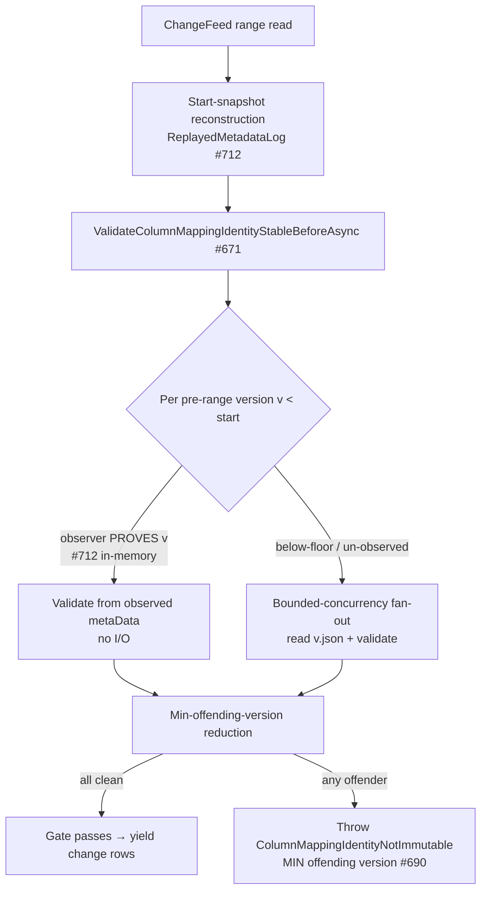
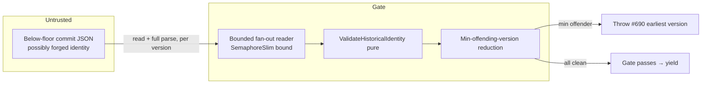

# CDF pre-range column-mapping identity scan — bounded-concurrency fan-out (deterministic, coverage-neutral)

> **Status:** Draft
> **Issue:** [#808](https://github.com/khaines/deltasharp/issues/808) — perf(cdf): bounded-concurrency fan-out for the below-floor pre-range column-mapping identity scan (redirect from #691)
> **Author:** design-doc skill (orchestrated)
> **Reviewers:** cloud-native-distributed-systems-architect, cloud-native-security-sme, cloud-native-site-reliability-engineer, performance-benchmarking-engineer, delta-storage-format-engineer, dotnet-framework-runtime-engineer
> **Last Updated:** 2026-08-14
> **Related:** #691 (parent perf issue, closed), #697 (listing half delivered), #782/`9af9c01` (double-read collapse), #671 (CDF pre-range identity gate), #690 (earliest-offending-version error contract), #712 (`ReplayedMetadataLog` proven-observation reuse), #653 (path-free identity errors)

---

## 1 · Overview

Reading a Change Data Feed range validates a **fail-closed security gate**: the table's column-mapping
**identity** (mode, per-column field id / physical name, partition columns) must be **immutable across all
retained history at or below the range start**, or the read fails closed rather than risk emitting mismapped
change rows (#671, #690). The gate lives in `DeltaLog.ValidateColumnMappingIdentityStableBeforeAsync`.

Most pre-range versions are proven for free by reusing the start-snapshot reconstruction's observed metadata
(`ReplayedMetadataLog`, #712) — an in-memory lookup, no I/O. But every **surviving pre-range commit the replay
never reached** — the classic case being commits **strictly below a compacting checkpoint floor** — is not in
the observer and must be **read from the object store**. Today that below-floor read is a **sequential
`foreach`** issuing one commit `GET` at a time. On a table with ~10,000 retained pre-range commits and
interval-10 checkpoints, the replay covers ≤10 and the gate still issues **~9,990 serialised GETs**; at
30–60 ms per object-store GET that is **5–10 minutes of pure serialised latency** before the first change row
is yielded. The GET *count* is intrinsic (coverage-neutral — see §5); the **serialisation** is the waste.

This design adds a **bounded-concurrency fan-out** (configurable; sane default) of exactly those below-floor
reads, **coverage-neutral by construction** and preserving the gate's two hard contracts:

1. **Deterministic "earliest offending version" error** (#690). Today the sequential in-ascending-order loop
   makes first-failure == earliest offender for free. Under concurrency, failures complete out of order, so the
   surfaced version must come from an explicit **min-offending-version reduction** — never first-failure-wins —
   so the reported version is identical regardless of GET-completion order or the concurrency bound.
2. **Fail-closed ordering.** The gate still completes **in full** before any change row is yielded; a partial or
   failed read fails the whole gate closed. Concurrency changes only *how fast* the reads happen, never
   *whether* the gate blocks the yield.

**Requirements traceability:** #808 acceptance criteria (§3.6). This is the surviving `O(retained-before-start)`
half re-scoped from #691 after #697 delivered the listing collapse and `9af9c01` collapsed the double read.

**Non-goals (explicitly rejected during #691/#697 review — not re-litigated here):** reusing the end-snapshot
reconstruction (cuts nothing — the below-floor commits are read by neither reconstruction); a listing-derived
presence signal (fail-open under a forged log); `metaData`-only parsing (a fail-closed→fail-open posture
change on a security gate); a cross-read identity cache (a stale entry in front of a fail-closed gate is a
fail-open surface — its own PR if ever). This design touches **only** the concurrency of the existing reads.

---

## 2 · Logical architecture

### 2.1 Where the fan-out sits



The change from today is **local**: the `foreach (long version in listing.Commits)` loop keeps its exact
membership predicate and validation, but the **disk-read branch** is executed as a bounded fan-out and all
failures (identity, malformed, read-ceiling) are funnelled through a **min-version reduction** instead of an
in-order throw.

### 2.2 The validation set is UNCHANGED (coverage-neutrality is structural)

The set of versions validated is **identical** to today, because the membership predicate is untouched:

```
{ v ∈ listing.Commits : v < rangeStartVersion }         // every pre-range commit, minus none
   ├── v proven by the start-snapshot observer (#712)   → validate from observed metaData (in-memory, as today)
   └── otherwise (below-floor / un-observed)            → READ v.json, validate  ← the ONLY branch this design fans out
   plus the baseline at `earliest` (checkpoint-baked identity) when earliest < rangeStartVersion
```

`ValidateHistoricalIdentity` is a **pure function** of `(version, metadata, endIdentity)` — no shared state, no
ordering dependence — so validating the same set in any order yields the same verdict per version. The design's
coverage-neutrality is therefore *structural*, not a tuning artifact: **same versions, same per-version verdict,
different read schedule.** (Pinned by AC-6 / §3.5: a counting backend proves the validated version **set** is
byte-identical sequential-vs-concurrent, and that the observer-covered versions still issue **zero** GETs.)

> **The observer branch is not fanned out.** Observer-proven versions are in-memory lookups; only the
> disk-read fallback (the below-floor strays — the whole cost of #808) is scheduled concurrently. This keeps
> the fan-out set exactly the I/O-bound versions and leaves the #712 reuse path untouched.

### 2.3 Deterministic min-offending-version reduction (the crux)

Under concurrency, three things can go wrong per version, **all fail-closed**: an **identity mismatch**
(`ColumnMappingIdentityNotImmutable`, an `Unsupported` protocol error), a **malformed commit**
(`DeltaProtocolException.Malformed` — unparseable JSON / schemaString / >1 `metaData`), or a **read-ceiling /
object-too-large** fault. #690 pins that the surfaced error **names the earliest offending version**. Today's
in-order sequential throw satisfies this incidentally; a naive fan-out that lets the first-completing failure
propagate (e.g. `Parallel.ForEachAsync`'s default first-exception-cancels behaviour) is **non-deterministic** —
the reported version would depend on GET latency, so two identical reads of a forged table could name different
versions. That is both a test-contract break (#690) and a subtle **information-consistency** weakness (§6).

**Contract.** The gate surfaces the failure of the **numerically smallest offending version** across *all*
failure kinds, deterministically, independent of completion order and of the concurrency bound (including
bound = 1). Mechanically:

- Each fan-out task **catches its own** fail-closed exception (never lets it escape the loop body, so no
  sibling-cancelling `AggregateException`). It records `(version, exception)` into a shared **min reduction**
  keyed on `version` (an atomic compare-and-set on a `long` current-min plus the captured exception for that
  min, guarded so the *smallest* version's exception is the one retained — ties are impossible since versions
  are unique).
- After the fan-out **drains** (all scheduled tasks awaited — never abandoned), if a min offender exists, the
  gate **re-throws that version's captured exception** (preserving its original type and path-free message,
  #653). Otherwise the gate passes.
- **Ordering across kinds is by version only** — a malformed commit at v=5 outranks an identity mismatch at
  v=9. This is the honest generalisation of "earliest offending version": the earliest version that fails the
  gate *for any reason* is what a sequential in-order scan would have surfaced first.

> **Why not short-circuit on first failure?** Because "first" under concurrency is latency-ordered, not
> version-ordered. Determinism requires the min over the offenders that a full in-order scan *could* reach.
> See §2.4 for the safe pruning that recovers most of the short-circuit's savings without breaking determinism.

### 2.4 Safe early-cancellation (pruning) — determinism-preserving

Validating all ~10k versions even after an early offender is found is wasteful, but naive cancellation is
non-deterministic. Safe rule: once an offender at version `X` is recorded, any **not-yet-started** task whose
version is `> X` can be **skipped**, and any **in-flight** read whose version is `> X` can be **cancelled** —
because no version `> X` can lower the min. Versions `< X` **must still complete** (one of them could be a
smaller offender). This is a monotone min with a `> current-min` prune:

- The reduction publishes the current min offender; the scheduler consults it before starting each task and
  a linked `CancellationTokenSource` cancels in-flight reads for versions strictly above it.
- A cancelled read is **not** an offender and **not** a pass — it is simply removed from consideration
  (its version is provably `> X`, so it cannot affect the surfaced min). Cancellation here is a **performance**
  signal, never a correctness one; distinguish it from **caller** cancellation (§2.6), which fails the whole
  read with `OperationCanceledException` as today.
- Determinism is preserved: the surfaced version is the global min offender over the versions `≤` it, which is
  invariant to which `> X` versions were pruned. (Pinned by AC-3 / §3.3: a forged table with offenders at both
  a low and a high version always reports the low one, at every bound and under injected latency skew.)

Pruning is an **optional optimisation** layered on the §2.3 contract; with pruning disabled the result is
identical, only slower. The correctness proof rests on §2.3, not on §2.4.

### 2.5 Concurrency primitive & bound

- **Primitive.** A bounded fan-out over the disk-read versions using a `SemaphoreSlim(bound)` gate (or
  `Parallel.ForEachAsync` with `MaxDegreeOfParallelism = bound` — but see §2.3: the loop body must **swallow**
  fail-closed exceptions into the reduction so the built-in first-exception cancellation never fires and
  determinism is preserved). The default primitive is an explicit `SemaphoreSlim` + `Task` list + `WhenAll`,
  which gives precise control over the drain, the `> min` prune, and the max-in-flight assertion tests need.
- **Bound.** A new **configurable** concurrency limit, default **16** (issue range 16–32), surfaced as an
  internal `DeltaLog` construction parameter alongside the existing `maxLogObjectBytes` / decode budgets
  (`DeltaLog.cs` ctor), threaded to the gate. **Bound = 1 restores today's exact sequential behaviour** (the
  kill-switch, §8). The bound is validated (`> 0`) at construction with an explicit `paramName`, mirroring the
  existing budget fail-fast.
- **Backpressure/fairness.** The semaphore bounds in-flight object-store GETs so the gate cannot exhaust the
  backend connection pool or amplify a slow-dependency stall into a fan-out storm (§6 DoS). The bound is a
  **ceiling**, not a target: a gate with 3 below-floor reads issues 3, never 16.

### 2.6 Cancellation, exceptions & lifetime

- **Caller cancellation** (`cancellationToken`) still fails the whole gate with `OperationCanceledException`
  promptly; it is checked before scheduling each task and is linked into every read. This is unchanged
  fail-closed behaviour (a cancelled CDF read yields nothing).
- **Internal prune cancellation** (§2.4) uses a **separate linked CTS** so a pruned read's
  `OperationCanceledException` is caught and discarded *only* when it originates from the prune token — a
  caller cancel is never swallowed. (An `OperationCanceledException` whose token is the caller's re-throws.)
- **Drain guarantee.** The method awaits **every** scheduled task (via `WhenAll` over the task list, or an
  explicit drain in `finally`) before returning or throwing, so no read is left running past the gate — no
  orphaned GET, no post-gate exception escaping to a later yield. This is what preserves "the gate completes
  before any change row is yielded" under concurrency (§3.4, AC-4).

### 2.7 API surface

Internal only. One new **optional** `DeltaLog` constructor parameter
(`int preRangeScanConcurrency = DefaultPreRangeScanConcurrency`, default 16) and the internal rewrite of the
disk-read branch of `ValidateColumnMappingIdentityStableBeforeAsync`. No public API change; no change to the
change-feed read's observable results on any conforming table.

### 2.8 Component boundaries

| Component | Responsibility | Change |
|---|---|---|
| `DeltaLog.ValidateColumnMappingIdentityStableBeforeAsync` | The #671 pre-range identity gate | Fan out the disk-read branch with a bounded semaphore; funnel all fail-closed faults through the min-version reduction; drain before return |
| `DeltaLog` ctor | Reader configuration | Add validated `preRangeScanConcurrency` (default 16; 1 = sequential kill-switch) |
| `ReadCommitActionsAsync` | Read + parse one commit | **Unchanged** (already pure per-version; now called concurrently) |
| `ValidateHistoricalIdentity` / `BuildIdentity` | Pure per-version verdict | **Unchanged** (pure → safe to call concurrently) |
| `ReplayedMetadataLog` (#712) observer branch | Prove pre-range versions for free | **Unchanged** (in-memory, not fanned out) |
| Telemetry (`DeltaStorageTelemetry`) | Gate cost visibility | Add a pre-range-scan duration + max-in-flight signal (§7), path-free |

---

## 3 · Functional test scenarios & correctness oracles

### 3.1 Happy path
- **Below-floor strays validated concurrently, gate passes.** A table with a compacting checkpoint and N
  surviving sub-floor commits, all sharing the end identity: the gate passes; a spy backend confirms exactly
  the N below-floor versions were read (observer-covered versions issue **zero** GETs), and the change rows are
  yielded only **after** the gate returns.

### 3.2 Coverage-neutrality (AC-6) — the set is invariant
- **Same validated set, sequential vs concurrent.** For a corpus (checkpoint-seeded deep retention, no
  checkpoint / full replay, mixed observer-covered + below-floor, floor-commit-aged-out baseline case), a
  counting/recording backend asserts the **exact set of versions read+validated is identical** at bound = 1 and
  bound = 32, and identical to the pre-change implementation. No version added, none dropped.
- **Observer reuse preserved.** Versions the #712 observer proves still issue **no** GET at any bound (the
  fan-out set is exactly the disk-read branch).

### 3.3 Deterministic earliest-offending-version (AC-3) — must fail under first-failure-wins
- **Two offenders, low always wins.** A forged table with a column-mapping identity mismatch at a **low**
  pre-range version `v_lo` and another at a **high** version `v_hi` (`v_lo < v_hi`), both below floor: the gate
  throws naming **`v_lo`** — at bound ∈ {1, 4, 32} and under **injected per-version latency skew** that makes
  `v_hi` complete first. A first-failure-wins implementation names `v_hi` under skew → this test fails it.
- **Mixed failure kinds, min version wins across kinds.** A malformed commit at `v=5` and an identity mismatch
  at `v=9`: the surfaced error corresponds to **v=5** (malformed), deterministically, regardless of which read
  completes first. And the symmetric case (identity at v=5, malformed at v=9) surfaces v=5's identity error.
- **Determinism under repetition.** The same forged table read K times (and across bounds) always surfaces the
  identical version and exception type — a property/metamorphic assertion, not a single-shot check.

### 3.4 Fail-closed ordering & lifetime (AC-4)
- **Gate blocks the yield.** With an offender present, **no** change row is observable before the throw (a
  yielded-row spy asserts zero rows emitted). The gate's fan-out is fully drained before the exception surfaces.
- **No orphaned reads after a failure/cancel.** After the gate throws (offender) or the caller cancels, assert
  **no** GET completes after the method returns (a backend that records completion timestamps vs the method's
  return) — the drain/`finally` awaited every scheduled or cancelled task. Guards a post-gate GET leaking into
  a later yield.
- **Caller cancellation still fails closed.** A caller `CancellationToken` cancelled mid-fan-out throws
  `OperationCanceledException` from the gate, yields nothing, and is **not** swallowed by the internal prune
  handler (distinct-token assertion).

### 3.5 Bounded concurrency respected (AC-2) & pruning
- **Max in-flight ≤ bound.** A gating backend (each GET blocks on a barrier and records concurrent-entry count)
  asserts the observed maximum simultaneous in-flight reads **never exceeds the bound**, for bounds {1, 4, 16},
  and equals `min(bound, belowFloorCount)`.
- **Prune cancels only `> min` (optional feature on).** With an offender at a low version and many higher
  versions, assert higher-version in-flight reads are cancelled (fewer total completed GETs than the full set)
  **while** the surfaced version is still the low offender — pruning changes cost, never the verdict. With
  pruning disabled, the verdict is identical (only more GETs complete).

### 3.6 Determinism / purity
- `ValidateHistoricalIdentity` is pure; the reduction is an associative-commutative min → the gate verdict and
  surfaced version are a pure function of the log, independent of schedule. No wall-clock in the decision.

### 3.7 Acceptance-criteria mapping

| #808 AC | Scenario |
|---|---|
| Below-floor scan issues GETs with bounded concurrency (configurable; sane default) | §2.5; §3.1 |
| Concurrency bound respected under load (test asserts max in-flight) | §3.5 (AC-2) |
| "Names the earliest offending version" holds **deterministically** under concurrency (fails under first-failure-wins) | §2.3; §3.3 (AC-3) |
| Fail-closed ordering preserved: gate completes before any change row yielded | §2.6; §3.4 (AC-4) |
| Wall-clock improvement on a long retained history with a checkpoint | §4 benchmark |
| No change to the set of versions validated (coverage-neutrality pinned) | §2.2; §3.2 (AC-6) |

---

## 4 · Performance

- **Workload profile.** A CDF range read on a table with a long retained pre-range history behind a compacting
  checkpoint: `B` below-floor commits not covered by the #712 observer, each a ~30–60 ms object-store GET,
  issued **sequentially** today (`B` × latency serial). Observer-covered versions are already free.
- **Target.** Replace `B × latency` serial with `≈ ceil(B / bound) × latency` (plus validation, which is
  negligible/CPU-bound and overlaps). At `B = 9,990`, latency = 45 ms, bound = 16: **~7.5 min → ~28 s**
  wall-clock for the gate; bound = 32: **~14 s**. The **GET count is unchanged** (coverage-neutral) — this is a
  pure latency-hiding win, so the gate's object-store request volume and cost are identical.
- **Resource envelope.** Peak concurrent commit buffers rises from **1** to **≤ bound** (each ≤ the read
  ceiling `maxLogObjectBytes`), a bounded, configurable memory increase to call out (§6/§8); allocation is
  otherwise per-version as today. No change to steady-state.
- **Regression gate.** For a checkpoint-seeded deep-retention forged-free table: (1) **coverage-neutral** —
  GET **count** and validated-version **set** identical to sequential (the cache-independent primary signal,
  AC-6); (2) **wall-clock** — gate duration on a latency-injecting backend drops from `~B×L` toward
  `~ceil(B/bound)×L`, gated as a **speedup ratio** vs the sequential baseline on the **same synthetic latency
  model** (deterministic injected per-GET delay, not wall-clock-of-a-real-store), so the benchmark is
  reproducible and not object-store-noise-bound. Report the ratio at bounds {1, 8, 16, 32}; assert monotone
  improvement up to the bound and **no** regression at bound = 1 (must equal sequential within a small margin).
- **Benchmark (BenchmarkDotNet + `MemoryDiagnoser`).** Harness the gate over a synthetic table with a
  configurable below-floor count and a **deterministic latency-injecting `IStorageBackend`** (fixed per-GET
  delay via `TimeProvider`/`Task.Delay` on a controlled scheduler). Cells: {`B` ∈ 100, 1k, 10k} × {bound ∈ 1,
  8, 16, 32}. Measure gate wall-clock (primary), allocated bytes (peak-concurrency memory), and assert
  `GET count == B` in every cell (coverage-neutrality). Include a **no-below-floor** cell (all observer-covered)
  proving the fan-out adds **zero** GETs and ~zero overhead.

---

## 5 · Security

- **This is a fail-closed security gate, not a cache.** The pre-range identity gate exists to refuse emitting
  **mismapped change rows** on a table whose column-mapping identity was tampered across history (#671, #690).
  The redesign must not weaken it in any of three ways, and by construction does not:
  1. **Coverage-neutral set.** The exact versions validated are unchanged (§2.2) — concurrency reschedules
     reads, it never removes one. An observer defect can still only cost an extra read, never shrink the set
     (the existing #712 invariant is untouched).
  2. **Fail-closed on every fault.** Any below-floor read that fails (malformed, read-ceiling, identity
     mismatch) fails the whole gate closed via the reduction; a cancelled *prune* read is provably `> min` and
     cannot mask a smaller offender; a *caller* cancel fails the read closed (yields nothing).
  3. **No fail-open primitive introduced.** The rejected alternatives (listing-presence, `metaData`-only,
     cross-read cache — §1) are **not** used; the gate still reads and fully parses each below-floor commit's
     own JSON, exactly as today.
- **Data classification.** Commit JSON `metaData` (schema, field ids, physical names, partition columns) is
  table metadata (Confidential); the change rows the gate protects are tenant row data (Restricted). Errors are
  **path-free** (#653) — they name only a version, never a path or schema fragment.
- **Deterministic error = information-consistency.** The min-version reduction (§2.3) removes an
  observable that a naive fan-out would introduce: an attacker crafting a multi-offender forged log could
  otherwise influence *which* offending version the error names by racing GET latencies. Determinism closes
  that (small) side channel and keeps the #690 contract a stable, testable invariant.
- **Tenant isolation / secrets.** No new object-store credentials, paths, or cross-tenant surface; the fan-out
  runs within one already-authorised CDF read against one table root.

---

## 6 · Threat model



| STRIDE | Threat | Mitigation | Residual |
|---|---|---|---|
| **Tampering→mismapped-rows** | A forged pre-range commit swaps column-mapping identity below the checkpoint floor | Every below-floor commit's own JSON is read + validated (coverage-neutral set §2.2); mismatch → fail closed | None (unchanged from today) |
| **Repudiation / non-determinism** | Concurrency makes the surfaced offending version latency-dependent → #690 contract flaps, and an attacker can steer *which* version is named | **Min-offending-version reduction** (§2.3): the smallest offending version across all fault kinds is surfaced deterministically at any bound | None |
| **DoS (fan-out amplification)** | Unbounded fan-out exhausts the backend connection pool / amplifies a slow-dependency stall | `SemaphoreSlim(bound)` ceiling (§2.5); bound is configurable and defaults to 16; a small gate issues only its few reads | Accepted (bounded, operator-tunable) |
| **DoS (memory)** | ≤ bound commit buffers held concurrently (vs 1 today), each ≤ read ceiling | Peak = bound × `maxLogObjectBytes`, both bounded/configurable; called out §4/§8 | Accepted (bounded) |
| **Elevation (fail-open via cancellation)** | A pruned/cancelled read silently passes a version that should have failed | Prune cancels **only** versions `> current-min-offender` (provably cannot be the min §2.4); caller cancel fails the whole gate closed; distinct linked tokens keep the two apart (§2.6) | None |
| **Tampering (observer defect)** | A #712 observer bug drops a version from the proven set | Observer miss falls back to a **disk read** (never a skip) — the existing #712 fail-closed invariant, preserved verbatim | None |

---

## 7 · Observability

- **Metrics.** Reuse `DeltaStorageTelemetry`. Add a bounded, path-free pre-range-scan signal: a **duration**
  histogram for the gate (`deltasharp.delta.cdf.pre_range_scan.duration`), a **below-floor read count**
  (versions fanned out), and the **observed max in-flight** (a low-cardinality gauge/counter, value-type only).
  No paths, no versions, no schema.
- **Logs.** No new log site required for the happy path (the gate is silent on success today). The existing
  fail-closed `DeltaProtocolException` messages are unchanged and **path-free** (#653), naming only the min
  offending version. If a debug log is added it renders only counts/bound (value-type-only), registered in the
  storage log-site roster.
- **Correlation.** The gate runs within the existing CDF-read `activity`/operation scope, so its duration and
  read count sit on the same trace as the range read.
- **Dashboards / alerting.** No new alert. A `pre_range_scan.duration` panel makes the previously-invisible
  serialised stall observable and lets an operator tune the bound; an unusually high below-floor read count on
  a table signals a checkpoint-cadence / retention issue worth a look, not an incident.

---

## 8 · Rollout & risk

- **Rollout.** Pure internal performance change; no CRD/operator/public-API change. Ships behind the existing
  CDF read path.
- **Kill-switch (non-optional, tested).** The concurrency bound is configurable and **`bound = 1` restores the
  exact sequential behaviour** of today — same order, same first-failure==earliest-offender path. This is the
  rollback lever and is **test-required** (a test asserts bound = 1 is byte-identical in read set, order-of-read,
  and surfaced error to the pre-change gate). Default = 16.
- **Rollback.** Set the bound to 1 (or revert the change) → today's sequential gate. No data/metadata
  migration; no persisted state.
- **Risk register.** Top risk = a concurrency bug that (a) drops a version from the validation set —
  **structurally prevented** (§2.2 membership predicate untouched; pinned by AC-6); or (b) surfaces a
  non-deterministic / wrong offending version — prevented by the min reduction and pinned by AC-3 under injected
  latency skew; or (c) leaks an orphaned read past the gate — prevented by the drain guarantee and pinned by
  §3.4. Secondary risk = peak memory (bound × read ceiling) — bounded and documented.
- **Launch checklist.** Coverage-neutrality (AC-6) green at bounds {1, 32}; deterministic-min (AC-3) green under
  latency skew and across bounds, including the mixed-fault-kind case; max-in-flight ≤ bound (AC-2) green;
  fail-closed ordering + no-orphaned-read (AC-4) green; caller-cancel-not-swallowed green; bound = 1 sequential
  equivalence green; benchmark shows the wall-clock speedup with `GET count == B` unchanged; telemetry wired
  path-free.

---

## 9 · Open questions & decisions

1. **Reduction vs short-circuit (RESOLVED — deterministic min).** A latency-ordered first-failure throw breaks
   #690 and adds a side channel. Decision: catch per-version fail-closed faults, reduce to the **minimum
   offending version across all fault kinds**, throw after drain. Short-circuit is recovered *safely* only as
   the `> current-min` prune (§2.4), which cannot change the verdict.
2. **Concurrency primitive (RESOLVED — explicit `SemaphoreSlim` + drain).** `Parallel.ForEachAsync` is viable
   only if the loop body swallows fail-closed exceptions into the reduction (else its first-exception
   cancellation reintroduces non-determinism); an explicit semaphore + task-list + `WhenAll`/`finally` drain is
   chosen for precise control over the prune, the drain guarantee, and the max-in-flight test hook.
3. **Default bound (RESOLVED — 16, configurable 16–32 per #691).** 16 balances latency hiding against
   connection-pool pressure; operators can raise to 32. Bound = 1 is the sequential kill-switch. Open sub-item:
   whether the default should scale with a detected backend parallelism hint — deferred (a static default is
   sufficient for the #808 target; a hint is a follow-up).
4. **Pruning on by default? (DECISION — on, behind the same correctness proof).** Pruning is a pure speed
   optimisation that provably cannot change the surfaced version (§2.4); enabled by default, with a test proving
   verdict-equivalence pruning-on vs pruning-off. Can be disabled for debugging without affecting correctness.
5. **Peak memory (ACKNOWLEDGED).** Peak concurrent commit buffers = bound × `maxLogObjectBytes`. Bounded and
   configurable; documented in §4/§6/§8. No mitigation owed beyond the bound; noted for capacity guidance.

---

## 10 · References

- Issue [#808](https://github.com/khaines/deltasharp/issues/808) — this work (redirect from #691).
- Issue #691 — parent perf issue (closed); #697 delivered the listing collapse; `9af9c01` (PR #782) collapsed
  the pre-range double read.
- #671 — CDF pre-range column-mapping identity gate; #690 — earliest-offending-version error contract;
  #712 — `ReplayedMetadataLog` proven-observation reuse; #653 — path-free identity errors.
- `src/DeltaSharp.Storage/Delta/DeltaLog.cs` — `ValidateColumnMappingIdentityStableBeforeAsync`,
  `ValidateHistoricalIdentity`, `ReadCommitActionsAsync`, the `DeltaLog` ctor.
- Engineering references (DeltaSharp equivalents, cited as intended): architecture, distributed-engine,
  testing, performance, security, and observability best-practices/checklists.
