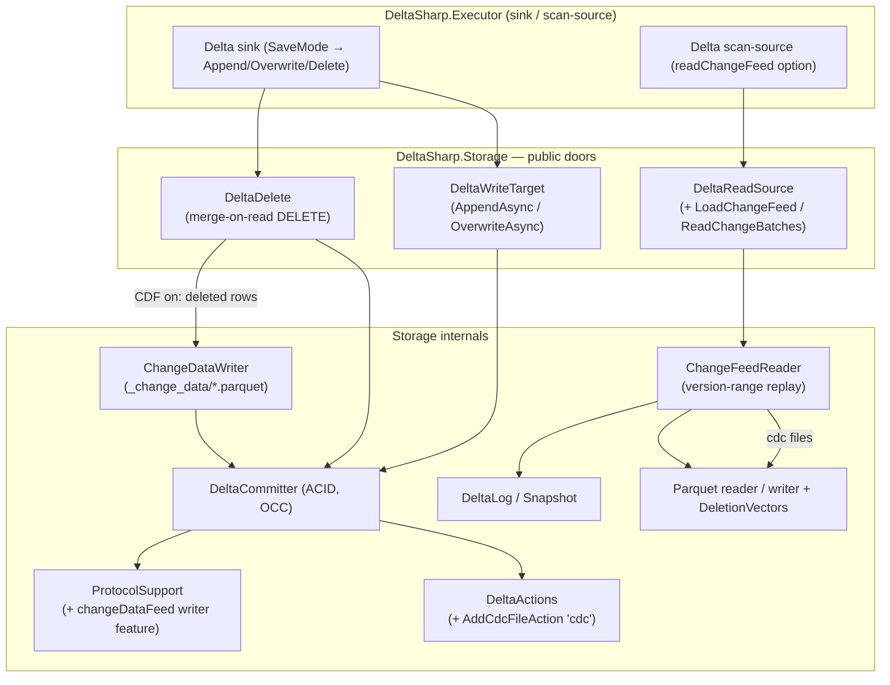
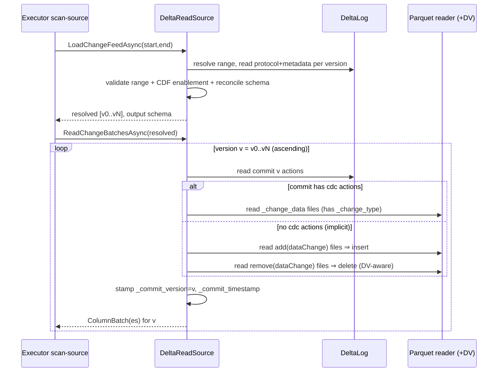
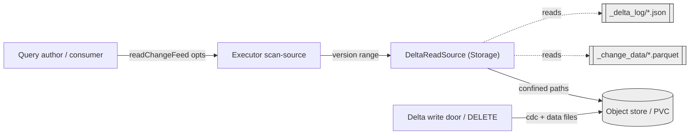

# Change Data Feed (CDF) — generation & reads

> **Status:** Draft (design). Created for **STORY-05.5.2: Change Data Feed generation and reads** ([#193](https://github.com/khaines/deltasharp/issues/193)), Feature #50 (FEAT-05.5), Epic EPIC-05, Milestone **M2**.
> **Issue:** [#193](https://github.com/khaines/deltasharp/issues/193) · **Depends on:** STORY-05.5.1 deletion vectors ([#192](https://github.com/khaines/deltasharp/issues/192), merged).
> **Author:** `design-doc` skill.
> **Reviewers (personas):** `delta-storage-format-engineer` (primary), `cloud-native-distributed-systems-architect`, `data-platform-connectors-engineer`, `query-execution-engine-engineer`, `reliability-test-chaos-engineer`, `performance-benchmarking-engineer`, `cloud-native-security-sme`, `cloud-native-site-reliability-engineer`.
> **Last updated:** 2026-07-22.
> **Related:** [ADR-0011 Delta protocol scope](../../adr/0011-delta-protocol-scope.md), [ADR-0002 columnar batch format](../../adr/0002-columnar-batch-format.md), [ADR-0014 multi-targeting](../../adr/0014-target-framework-aot.md), [storage-delta-architecture.md](storage-delta-architecture.md) §2.14 / §3.2 (CDF is already phased there), [read-door.md](read-door.md), [write-door.md](write-door.md).

---

## 1 · Overview

### 1.1 What this is

**Change Data Feed (CDF)** exposes the row-level changes a Delta table underwent between two versions as a queryable feed. Each change row carries the table's data columns plus three metadata columns — `_change_type` (`insert` / `update_preimage` / `update_postimage` / `delete`), `_commit_version`, and `_commit_timestamp` — so an incremental consumer can process only what changed since it last read, rather than re-scanning the whole table.

This story delivers two halves behind the existing storage doors:

- **Generation (write door).** When a table has CDF enabled (`delta.enableChangeDataFeed = true`, backed by the `changeDataFeed` writer feature), commits that change data at the row level materialize their changes so a later reader can recover them. In DeltaSharp today the operations that produce row changes are **append** (INSERT), **overwrite**, and **merge-on-read DELETE** (deletion-vector-based, STORY-05.5.1 / #192). Append and overwrite need **no** change files — their change data is *derived* at read time from the committed `add`/`remove` actions. DELETE, because it re-adds the same physical file with a new deletion vector, **must materialize explicit `cdc` change files** (see §2.5).
- **Reads (read door).** A new **change-feed read mode** on the storage read facade (`DeltaReadSource`) replays a **version range** `[start, end]` inclusive, yielding change rows in commit order with the three metadata columns stamped.

### 1.2 Why it matters

CDF is a headline Delta feature and a **Spark-parity** surface (`spark.read.format("delta").option("readChangeFeed", true)`). It is the storage-level prerequisite for **incremental / streaming consumers** (EPIC-12 Structured Streaming reads a Delta source's change feed) and for downstream CDC pipelines. ADR-0011 commits v1 to a broad Delta feature set that explicitly includes CDF, protocol-gated and fail-closed. Landing CDF moves the `DeltaSharp.Storage` layer materially closer to feature-complete Delta and unblocks the streaming milestone.

It also matters for **correctness under the merge-on-read model**: DeltaSharp deletes via deletion vectors rather than file rewrites, so a naïve "removed file ⇒ deleted rows" derivation would be *wrong* for a DV delete. CDF forces us to make the generation contract explicit and mechanically checkable (§3.3).

### 1.3 Requirements traceability

No `REQ-*` requirements are referenced; the story is acceptance-criteria-driven. The four acceptance criteria from #193 are mapped to test scenarios in **§3.4**. CDF appears in the storage architecture's feature-phasing table as **Phase P6 / FEAT-05.5 / #193** and in its advanced-feature gating table ([storage-delta-architecture.md](storage-delta-architecture.md) §2.14): *"Change Data Feed (#193) · `changeDataFeed` (writer; `delta.enableChangeDataFeed`) · Unsupported CDF read fails closed; the base table stays readable."* This document refines that entry into an implementable design and **must stay consistent with it**.

---

## 2 · Logical architecture

### 2.1 Where CDF sits in `DeltaSharp.Storage`

CDF adds one new action type, one writer-feature gate, a generation hook on the DELETE path, and a new read mode. It introduces **no** new assembly and **no** Engine→Storage edge; it reuses the Parquet reader/writer, the commit engine, and the snapshot/log machinery already in place.



### 2.2 The change-data model: implicit vs explicit

CDF distinguishes two ways a commit's row changes are recovered on read. This is the single most important semantic in the design.

| Commit shape | How change data is recovered | DeltaSharp operations |
|---|---|---|
| **Implicit (derived)** — commit has **no** `cdc` actions | For each data action with `dataChange = true`: an `add`'s rows are `insert`; a `remove`'s rows are `delete`. Read the referenced Parquet files at read time. | **Append** (add ⇒ insert); **Overwrite** (remove ⇒ delete, add ⇒ insert). |
| **Explicit (materialized)** — commit **has** `cdc` actions | Change data for that version is **exactly** the rows in the `cdc` files (each carries its own `_change_type`). The commit's `add`/`remove` actions still define table *state* but are **not** re-derived for CDF (no double counting). | **Merge-on-read DELETE** (materializes `delete` rows). Future **UPDATE/MERGE** (`update_preimage` + `update_postimage`). |
| **Non-data (skipped)** — actions with `dataChange = false` | Contribute **no** change data. | **OPTIMIZE**/compaction already commit `add`/`remove` with `dataChange = false`. |

**Rule of precedence (Delta parity):** for a given version, *if any `cdc` action exists, the implicit derivation is suppressed for that whole version.* This is what makes the DV-delete correct (§2.5): the same-path `remove(old DV)+add(new DV)` pair would otherwise mis-derive as a spurious delete-then-insert.

### 2.3 The `cdc` (AddCDCFile) action

The action model in `src/DeltaSharp.Storage/Delta/DeltaActions.cs` is a **closed sealed-record set** (`ProtocolAction`, `MetadataAction`, `AddFileAction`, `RemoveFileAction`, `TxnAction`, `CommitInfoAction`) so replay is a total, exhaustive match. CDF adds one subtype:

```csharp
/// <summary>
/// cdc — a Change Data Feed change file (Delta protocol "Add CDC File"). Its Parquet file lives under
/// _change_data/ and holds the table's data columns plus a _change_type column. A cdc file is NEVER part
/// of table state: dataChange is ALWAYS false and snapshot reconstruction ignores it entirely — it is
/// consumed only by an explicit change-feed read (§2.6). Present only when the changeDataFeed writer
/// feature is active.
/// </summary>
internal sealed record AddCdcFileAction(
    string Path,
    ImmutableSortedDictionary<string, string?> PartitionValues,
    long Size,
    ImmutableSortedDictionary<string, string> Tags) : DeltaAction;
```

- Serialization/deserialization: extend `DeltaLogActionWriter` / `DeltaLogActionReader` with the `cdc` key. `dataChange` is written as `false` verbatim (it has no independent value). Unknown top-level keys already round-trip via the forward-compat rule; the reader must now *recognize* `cdc` rather than ignore it.
- **Snapshot reconstruction is unchanged:** `Snapshot`/`DeltaLog` replay must continue to ignore `cdc` actions when building the active-file set (a `cdc` file is never an active data file — §3.3 INV C1). This is the key isolation property that keeps a normal read of a CDF-enabled table byte-identical whether or not CDF is enabled.

### 2.4 Data model — CDF output schema

A change-feed read returns the table's data schema **plus three appended metadata columns**, in this order (Spark parity):

| Column | Type | Source |
|---|---|---|
| *(all table data columns)* | table schema at the version | the data / `cdc` file |
| `_change_type` | `string` (non-null) | embedded in the `cdc` file; or synthesized (`insert`/`delete`) on the implicit path |
| `_commit_version` | `long` (non-null) | the table version being replayed |
| `_commit_timestamp` | `timestamp` | the commit's timestamp (see §2.8) |

`cdc` files on disk store **only** the data columns + `_change_type`; `_commit_version` and `_commit_timestamp` are **stamped at read time** from the commit being replayed (they are constant per version, so materializing them per row would waste space). Under **column mapping**, `cdc` file data columns use physical `col-<uuid>` names exactly like data files; the metadata columns are logical, engine-synthesized, and never column-mapped.

### 2.5 Generation — the write door

**Append / INSERT (`DeltaWriteTarget.AppendAsync`).** No change files. The committed `add` actions (`dataChange = true`) are the change data; a reader derives `insert` rows from them (§2.2). The only write-side obligation is **enablement** (§2.7): a first write to a table configured with `delta.enableChangeDataFeed = true` must publish a protocol that carries the `changeDataFeed` writer feature.

**Overwrite (`DeltaWriteTarget.OverwriteAsync`).** No change files. Static/dynamic overwrite already commits `remove(old, dataChange=true) + add(new, dataChange=true)` atomically; a reader derives `delete` (old rows) + `insert` (new rows). *Caveat (Spark parity nuance):* Spark can emit `cdc` for `replaceWhere`-style predicated overwrites to avoid surfacing unchanged rows; DeltaSharp's overwrite is whole-table/whole-partition, so the derived representation is faithful. Recorded as an open question (§9 Q3) should predicated overwrite land.

**Merge-on-read DELETE (`DeltaDelete`) — the materialization path.** This is the core generation work. `DeltaDelete` (`src/DeltaSharp.Storage/Delta/DeltaDelete.cs`) today builds one atomic commit per affected file: `remove(old add, prior DV) + add(same path, new DV)`, both `dataChange = true`, then inserts `DeltaCommitInfo.Delete()` at index 0 and commits via `DeltaCommitter.CommitAsync`. When CDF is enabled, that same loop additionally:

1. Collects the **newly-deleted rows** — the file-relative row positions the *new* DV masks that the *old* DV did not (the delta between the prior and new deletion vectors). These are already computed while building the new DV; CDF reuses that selection rather than re-scanning.
2. Writes those rows (full table schema, physical/column-mapped) to a **`_change_data/`** Parquet file via a new internal `ChangeDataWriter`, adding a synthesized `_change_type = 'delete'` column.
3. Appends an `AddCdcFileAction` for that file to the same `actions` list, so the `cdc` file is published **atomically** in the DELETE commit (never a separate commit).

Because the commit now carries `cdc` actions, the read-time precedence rule (§2.2) suppresses the implicit derivation for that version — so the same-path `remove+add(new DV)` pair does **not** mis-derive as delete+insert. Deletion metrics extend `DeltaCommitInfo.Delete()` to emit `operationMetrics` (`numDeletedRows`, `numChangeFilesAdded`), following the exact typed-token pattern `DeltaCommitInfo.Optimize(...)` already uses.

**UPDATE / MERGE.** DeltaSharp has **no** UPDATE or MERGE operation today (only DELETE, append, overwrite). Therefore `update_preimage` / `update_postimage` records cannot be produced by any current operation. This design **defines the contract** (an UPDATE/MERGE would materialize a preimage+postimage `cdc` pair on the same precedence rule) and leaves generation to the story that introduces those commands. Tracked as §9 Q1 with a follow-up issue.

### 2.6 Reads — the change-feed read door

CDF reads are a **distinct read mode** from snapshot reads. They live on the existing public read facade `DeltaReadSource` (`src/DeltaSharp.Storage/Reading/DeltaReadSource.cs`), whose XML doc currently lists *"CDF reads (#193)"* as out of scope — this story removes that exclusion. Two new members mirror the snapshot pair (`LoadSnapshotAsync` / `ReadBatchesAsync`):

- `LoadChangeFeedAsync(start, end, ct)` — resolves and **validates** the version range once (avoiding an analysis→execution TOCTOU exactly like snapshot pinning), returning the resolved `[startVersion, endVersion]` and the reconciled output schema (§2.8).
- `ReadChangeBatchesAsync(resolved, ct)` — streams `ColumnBatch`es of change rows (data columns + the three metadata columns) in **ascending commit order**.



**Range resolution & validation (AC2, AC3).** `start`/`end` may be given as versions or timestamps (`startingVersion`/`endingVersion`/`startingTimestamp`/`endingTimestamp`, Spark parity). `end` defaults to the latest committed version. The read **fails closed** with a clear, classified error when: `start > end`; `start < 0`; `end >` latest; or **CDF was not enabled for every version in `[start, end]`** (§2.7). Only changes within the inclusive range are returned, in commit order (AC2).

**Implicit-path DV awareness.** When deriving `insert`/`delete` from `add`/`remove` on the implicit path, the referenced data files may carry deletion vectors; the existing DV-aware scan is reused so only *live* physical rows are surfaced (a row already deleted by a prior DV must not reappear as an `insert`).

### 2.7 Protocol negotiation & enablement

CDF is a **writer-only** feature: normal reads of a CDF-enabled table need no reader feature (snapshot reconstruction ignores `cdc` actions — §2.3), so `ProtocolSupport.SupportedReaderFeatures` is **unchanged**. The writer side gains one feature:

- Add `ChangeDataFeedFeature.Feature = "changeDataFeed"` to `ProtocolSupport.SupportedWriterFeatures`. Today `EnsureWritable` explicitly names *"change-data-feed"* among features that **fail closed**; this story flips it to *supported* and makes the writer actually honor it.
- **Enablement seam.** The table property `delta.enableChangeDataFeed=true` lives in `MetadataAction.Configuration`. On CREATE/ALTER with that property set, the published `protocol` must include the `changeDataFeed` writer feature and be at the table-features writer version (7), mirroring how `appendOnly` / `invariants` / `typeWidening` enablement is threaded on the legacy→table-features upgrade (the `TypeWideningFeature.UpgradeProtocol` / #549 pattern).
- **Fail-closed reads (AC3).** A CDF **read** against a table (or version range) where CDF is not enabled throws a precise unsupported-range error naming the offending versions — consistent with the storage doc's EE-10 scenario and the "unsupported fails closed" posture.

**Conservative scope (stricter than Delta).** Delta permits "batch-derivable" CDF reads over versions where CDF was disabled *if* those commits are simple blind append/overwrite/whole-file-delete. DeltaSharp v1 instead **requires CDF enabled across the whole requested range** and fails closed otherwise. Rationale: DeltaSharp's DELETE is DV-based, so a disabled-CDF range that contains a delete cannot be faithfully derived; requiring enablement is the safe, correct default and matches the repo's stricter-than-Delta protocol philosophy. Relaxing to batch-derivable ranges is a future enhancement (§9 Q2).

### 2.8 Schema evolution & commit timestamp

**Schema evolution across a range (AC4).** When the table schema changed within `[start, end]`, each version's change data is read against **that version's** schema, then reconciled to a **single output schema** (default: the schema at `endVersion`, i.e. latest-in-range — Spark parity). Reconciliation reuses `DeltaReadSource`'s existing additive/widening read-compatibility: later-added **nullable** columns are null-filled for earlier versions, and type-widened columns are up-cast. A change that is **not** read-compatible over the range (a dropped column that still appears in the output, an incompatible retype) fails closed with the existing `DeltaReadSchemaEvolutionException`, rather than fabricating values. The precise reconciliation target (latest-in-range vs. a caller-supplied read schema) is confirmed in §9 Q4.

**`_commit_timestamp` source.** The metadata column derives from the commit's `commitInfo.timestamp` when present (already stamped deterministically via the injected `TimeProvider` in `DeltaCommitter`), falling back to the commit file's modification time — the same resolution policy time-travel-by-timestamp uses (and the subject of #500 for cross-engine parity). No new clock is introduced; **no** `DateTime.UtcNow`/`Guid.NewGuid` (BannedSymbols).

### 2.9 Public API surface

The storage seam surfaces only Engine types (`ColumnBatch` / `StructType`) across the boundary (ADR-0014); no Core/Executor type crosses it. New public members (final names TBD in review, `<!-- TBD -->`):

- `DeltaReadSource.LoadChangeFeedAsync(DeltaChangeFeedRange range, CancellationToken)` → `DeltaChangeFeedInfo(long StartVersion, long EndVersion, StructType Schema)`.
- `DeltaReadSource.ReadChangeBatchesAsync(DeltaChangeFeedInfo, CancellationToken)` → `IAsyncEnumerable<ColumnBatch>`.
- `DeltaChangeFeedRange` — a small value type carrying version XOR timestamp bounds (validated: not both).
- Metadata-column name constants (`_change_type`, `_commit_version`, `_commit_timestamp`).

The **Spark-facing** `option("readChangeFeed", true).option("startingVersion", …)` surface is wired by the Executor's Delta scan-source (EPIC-06 / #499 territory) onto these storage members; that mapping is out of scope here and referenced only. Public-API additions go through `PublicAPI.Unshipped.txt` and the API-governance gate.

### 2.10 Dependencies

| Depends on | Why |
|---|---|
| STORY-05.5.1 deletion vectors (#192, merged) | DELETE materializes `cdc` from the DV delta; the implicit path is DV-aware. |
| Parquet reader/writer, `ParquetTypeMapping` | Read/write `_change_data/` files; column-mapping physical names. |
| `DeltaCommitter` / OCC | Atomic publication of `cdc` with the DELETE commit. |
| `DeltaLog` / `Snapshot` / time-travel | Version-range replay, `_commit_timestamp` resolution. |
| Column mapping (name+id) | `cdc` data columns are column-mapped like data files. |
| ADR-0011, ADR-0002, ADR-0014 | Protocol scope, columnar batch, target-framework seam. |

No new third-party NuGet dependency is introduced.

### 2.11 Tenant / storage-backend considerations

`_change_data/` files are written and read through the same pluggable storage backend abstraction as data files (local FS today; S3/ADLS/GCS and PVCs behind the same contract). Path confinement (`#431`/#474 openat/`O_NOFOLLOW`) applies unchanged: `cdc` `path` values are resolved **relative to the table root** and confined exactly like `add.path`, so an attacker-controlled `cdc` path cannot escape the table directory. CDF adds no cross-tenant data flow: a change feed is scoped to a single table path, and the reader never lists directories to find change data — it follows only `cdc`/`add`/`remove` actions committed to that table's log (log-is-truth, INV C1/I12).

### 2.12 Interaction with existing features

- **Deletion vectors:** §2.5 (generation) and §2.6 (DV-aware implicit derivation). The DV delta *is* the delete change set.
- **OPTIMIZE / compaction:** commits with `dataChange = false` contribute no change data — compaction is invisible to CDF (correct; it changes no logical rows). No change needed; add a regression oracle (§3.3 INV C4).
- **VACUUM / retention:** `_change_data/` files must be retained as long as they are referenced by a `cdc` action within the CDF-readable window, and protected by VACUUM/orphan-cleanup exactly like data files — this is the concern already filed as **#489** (VACUUM must protect `.bin` DV and `_change_data` CDF files). This design **depends on** #489's protection landing with (or before) CDF generation; flagged §9 Q5.
- **Time travel:** orthogonal — time travel reads a single snapshot; CDF reads a range. They share range/version resolution and the `_commit_timestamp` policy.
- **Column mapping:** `cdc` data columns follow the table's physical naming; metadata columns are never mapped.

---

## 3 · Functional test scenarios & correctness-under-fault

> **Proof, not assertion** (governing rule from checklist 21). Every scenario names a **mechanical oracle** — a checkable predicate over `_delta_log`, `_change_data/` bytes, and produced `ColumnBatch`es — a captured **seed/fixture**, and a **reproduction** filter. A change-feed test whose oracle cannot classify a history is *insufficient coverage*, never green. Placement per `testing-conventions.md`: deterministic/unit-tier in `tests/DeltaSharp.Storage.Tests`; cross-engine/emulator work in the integration tier (checklist 04b, 900 s budget).

### 3.1 Happy-path scenarios

| ID | Scenario | Oracle (mechanical pass condition) | AC |
|----|----------|-----------------------------------|----|
| CDF-HP-01 | Append then CDF-read `[v,v]` | Change multiset == appended rows, each `_change_type=insert`, `_commit_version=v`; **no** `_change_data/` file was written | AC1 |
| CDF-HP-02 | DV DELETE then CDF-read `[v,v]` | Change multiset == exactly the newly-deleted rows, each `_change_type=delete`; a `cdc` file exists; the re-added file does **not** surface as `insert` | AC1 |
| CDF-HP-03 | Overwrite then CDF-read `[v,v]` | Old rows `delete` + new rows `insert`, derived (no `cdc` file) | AC1 |
| CDF-HP-04 | Multi-version range `[a,b]` (append, delete, append) | Union of per-version changes, **commit order** ascending, only versions in `[a,b]` present | AC2 |
| CDF-HP-05 | `_commit_timestamp` stamping | Each change row's `_commit_timestamp` == the commit's resolved timestamp (injected `TimeProvider`) | AC1 |
| CDF-HP-06 | Timestamp-bounded range | `startingTimestamp`/`endingTimestamp` resolve to the same versions as the equivalent version bounds | AC2 |

### 3.2 Edge / error scenarios

Contract: **fail deterministically, name the defect, publish no partial state, fail closed.**

| ID | Scenario | Oracle | AC |
|----|----------|--------|----|
| CDF-EE-01 | CDF read on a table with CDF **disabled** | Clear unsupported error naming the table; no rows produced (aligns with storage-doc EE-10) | AC3 |
| CDF-EE-02 | Range spans a version where CDF was **not yet enabled** | Unsupported-range error naming the offending version(s) | AC3 |
| CDF-EE-03 | Inverted / out-of-bounds range (`start>end`, `end>`latest, `start<0`) | Deterministic invalid-range error; nothing read | AC2 |
| CDF-EE-04 | Both a version bound and a timestamp bound supplied | `ArgumentException` (mirrors `LoadSnapshotAsync`'s XOR rule) | AC2 |
| CDF-EE-05 | Non-read-compatible schema change within the range (dropped/retyped column) | `DeltaReadSchemaEvolutionException`; never fabricates values | AC4 |
| CDF-EE-06 | Writer-feature fail-closed: write to a `changeDataFeed` table on a build without CDF | `DeltaProtocolException` naming the writer feature (regression that the gate is real) | AC3 |
| CDF-EE-07 | Corrupt / truncated `_change_data/` Parquet file | Deterministic storage error; zero partial rows (INV I11 parity) | AC1 |

### 3.3 Deterministic correctness oracles

New invariants layered on the storage invariant catalogue (I1–I12):

| # | Invariant | Statement |
|---|-----------|-----------|
| C1 | CDF isolation | A `cdc` action is **never** part of the active-file set; a normal snapshot read of a CDF-enabled table is byte-identical to the same table with CDF off. |
| C2 | Delete completeness | For a DV DELETE at version `v`, the `delete` change set == `(newDV \ oldDV)` physical rows of the affected files — no more, no fewer. |
| C3 | Precedence | If version `v` has any `cdc` action, the implicit add/remove derivation is suppressed for `v` (no double counting, no spurious insert from a DV re-add). |
| C4 | Compaction invisibility | An OPTIMIZE commit (`dataChange=false`) contributes **zero** change rows over any range that contains it. |
| C5 | Range fidelity | CDF-read`[a,b]` == concatenation of CDF-read`[a,a]` … `[b,b]` (order-preserving), and is disjoint from changes outside `[a,b]`. |
| C6 | Round-trip vs. snapshot | Replaying all `insert`/`delete`/`update_postimage` (minus preimages) from `[0,N]` reconstructs the multiset of `snapshot(N)` rows (a "CDF folds to snapshot" cross-check). |

**Oracles:** (a) **golden `_delta_log` + `_change_data` histories** with per-version expected change manifests (curated + generated; cross-engine goldens written by Spark/delta-rs for interop-in); (b) a **model-based state machine** extending oracle (c) of the storage doc — the model tracks, per committed version, the expected change multiset with `_change_type`, and the harness asserts real CDF-read == model over random *legal* command sequences (`Append`, `Overwrite`, `Delete(predicate)`, `Optimize`, `EnableCdf`); (c) the **CDF-folds-to-snapshot** differential (C6) as a strong end-to-end check. Every randomized case emits the standard `[deltasharp-seed]` reproduction line and records `{seed, schema, command-sequence, backend, expected change-manifest}`.

### 3.4 Acceptance-criteria mapping

| # | Acceptance criterion (#193) | Discharged by |
|---|------------------------------|---------------|
| AC1 | CDF-enabled inserts/deletes/updates expose correct change types & commit versions | CDF-HP-01/02/03/05; INV C2; **updates deferred** (no UPDATE op — §9 Q1) |
| AC2 | CDF read over a version range returns only in-range changes in commit order | CDF-HP-04/06; CDF-EE-03/04; INV C5 |
| AC3 | CDF disabled / historical range → clear unsupported-range error | CDF-EE-01/02/06; §2.7 |
| AC4 | Schema evolution during a CDF range follows documented compatibility rules | CDF-EE-05; §2.8 |

> **Note on AC1 "updates".** DeltaSharp exposes no UPDATE/MERGE operation yet, so no commit can currently produce `update_preimage`/`update_postimage`. AC1 is satisfied for the change types DeltaSharp can produce (insert, delete); the update contract is defined (§2.5) and its generation deferred to the UPDATE/MERGE story (§9 Q1, follow-up issue). This is an explicit, reviewed scope boundary, not a silent gap.

---

## 4 · Performance

> Scope: the CDF write hot path (materializing delete change files) and the CDF read hot path (version-range replay + metadata-column stamping). Figures are expressed as SLIs (shape and ratios to a measured noise floor); hardware constants are `<!-- TBD: calibrate on ref hardware -->`.

### 4.1 Workload profile

- **Generation** is incremental to DELETE: it writes one `_change_data/` file per affected data file, sized to the *deleted* row count (typically ≪ the data file). Append/overwrite add **zero** generation cost.
- **Read** is proportional to the number of changed rows in `[start, end]`, not table size — CDF's central value. Cost = replay of the commit range (log I/O, already bounded) + Parquet decode of `cdc`/`add`/`remove` files + constant-per-version metadata stamping.

### 4.2 Targets (SLIs)

- **Generation overhead:** a DV DELETE with CDF on writes `O(deletedRows)` extra bytes and one extra file per affected data file; end-to-end DELETE latency stays within a small constant factor of the DV-only DELETE (target ≤ ~1.2× for typical delete fractions) `<!-- TBD: calibrate -->`.
- **Metadata stamping:** `_commit_version`/`_commit_timestamp` are **constant per version**, materialized as constant/run-length `ColumnVector`s (not per-row scalars) so stamping is `O(1)` allocations per batch, not `O(rows)` (allocation budget §4.3).
- **Read throughput:** CDF-read of a small change set over a large table must **not** scan unchanged files — verified structurally (§4.6 gate: files opened == files referenced by in-range `cdc`/dataChange actions).

### 4.3 Memory & allocation budgets

- Metadata columns use constant/dictionary-backed `ColumnVector`s per batch (ADR-0002 selection-vector-aware); no per-row boxing of `_commit_version`/timestamp.
- The delete-row selection for `cdc` generation reuses the DV-delta buffer already computed by the DELETE; no second full-file scan.
- `ChangeDataWriter` streams row groups through the existing Parquet writer's buffers; no whole-file materialization beyond one row-group buffer.

### 4.4 Benchmark methodology & regression gates

- BenchmarkDotNet micro-benchmarks: (1) DELETE-with-CDF vs DELETE-only generation overhead; (2) CDF-read throughput vs. change-set size at fixed table size; (3) metadata-stamping allocations/batch. Gates (checklist 22): a **structural** gate asserting "files opened ≤ in-range changed files" (no full-table scan regression) and an **allocation** gate on stamping (`O(1)`/batch). No absolute numbers are committed until calibrated on the pinned reference environment.

---

## 5 · Security

### 5.1 Data classification

| Element | Classification | Handling |
|---|---|---|
| `_change_data/*.parquet` row values | **Same as table data** (may contain PII/restricted) | Same at-rest/in-transit protection as data files; retained/vacuumed under the same policy (§2.12, #489). |
| `_change_type` / `_commit_version` / `_commit_timestamp` | Metadata (low sensitivity) | Non-PII; timestamp is provenance. |
| `cdc.path` in the log | Attacker-controllable on a hostile log | Path-confined to the table root (§2.11); redact in fault messages (mirrors #516). |

**Privacy note (GDPR erasure).** CDF *retains a copy of deleted rows* in `_change_data/` until they age out of the CDF window and are VACUUMed. This is a deliberate, Delta-standard behavior but has erasure implications: a "right to be forgotten" delete is not fully physically erased until the change files are vacuumed. This must be documented for privacy/compliance (handoff to `privacy-compliance-grc-lead`) and is called out in §8 risk register.

### 5.2 Input validation & fail-closed

- Every `cdc`/`add`/`remove` path read during a CDF replay is confined to the table root before open (openat/`O_NOFOLLOW`, #474); a path escaping the root fails closed.
- Corrupt/truncated `cdc` Parquet fails deterministically with zero partial rows (§3.2 CDF-EE-07).
- Protocol gate (§2.7): an unimplemented CDF write feature fails closed at commit; a CDF read of a disabled range fails closed.

### 5.3 Tenant isolation

A change feed is confined to one table path; no directory listing is used to discover change data (log-is-truth). No executor credential or cross-tenant path is introduced. Reuses the storage adapter's per-table backend scoping.

---

## 6 · Threat model

### 6.1 Trust boundaries



Trust boundary: everything under the table root on the (untrusted-content) object store is attacker-influenceable if an adversary can write to storage; DeltaSharp treats the **committed log as truth** and confines every path.

### 6.2 STRIDE

| Threat | Vector | Mitigation | Residual |
|---|---|---|---|
| **Tampering** | Forged `cdc.path` pointing outside the table | Path confinement to table root (#474); log-is-truth | Low |
| **Information disclosure** | Change files leak deleted-row PII beyond erasure SLA | Same-as-data classification; VACUUM protection + documented erasure window (§5.1, #489) | Medium → privacy handoff |
| **Denial of service** | Huge/adversarial `cdc` file inflating a CDF read | Reuse `MaxRowGroupDecodedBytes` decode ceiling (#473); bounded per-batch buffers | Low |
| **Repudiation** | Which version produced a change | `_commit_version`/`_commit_timestamp` + commitInfo provenance | Low |
| **Spoofing / EoP** | — | No new identity/credential surface; reuses storage backend auth | Low |

---

## 7 · Observability

### 7.1 Logging

Bounded, structured logs (own EventId band, e.g. `DeltaChangeFeedLog` 4200–4299) at the two seams: **generation** (version, affected files, `numChangeFilesAdded`, `numDeletedRows`) and **read** (resolved `[start,end]`, versions replayed, cdc-vs-implicit per version, rows produced). Log **counts and versions**, never row values (PII) — a table path/version is evidence; a change row is never a log field or a metric tag.

### 7.2 Metrics

`deltasharp.delta.cdf.*` family: `changefiles_written` (gen), `change_rows_read` (read), `versions_replayed`, `read_range_span`, plus reuse of the commit-latency family for the DELETE commit that now carries `cdc`. `operationMetrics` in `commitInfo` (`numDeletedRows`, `numChangeFilesAdded`) gives `DESCRIBE HISTORY` parity.

### 7.3 Tracing

The CDF read is a single logical operation spanning `LoadChangeFeedAsync` → per-version replay → batch production; propagate the read correlation id across the version-range loop so a slow version is attributable. Generation is a child span of the DELETE commit span.

### 7.4 Alerting

No new SLO alerts at storage tier (CDF is opt-in and read-driven); a spike in CDF-read fail-closed errors (disabled/out-of-range) is a **client-error** signal, not a page. A rise in corrupt-`cdc` decode errors reuses the existing storage-corruption alert.

---

## 8 · Rollout & risk

### 8.1 Rollout strategy

CDF is **opt-in** and protocol-gated: absent `delta.enableChangeDataFeed`, nothing changes — no `cdc` files, no reader impact (INV C1 guarantees byte-identical normal reads). Land in increments behind the writer-feature gate:

1. **Action + protocol** — `AddCdcFileAction`, serializer round-trip, `changeDataFeed` writer feature + enablement; snapshot reconstruction ignores `cdc` (INV C1). *No behavior change yet.*
2. **Generation** — `ChangeDataWriter` + DELETE hook + delete `operationMetrics`.
3. **Read** — `DeltaReadSource` change-feed mode, range validation, implicit + explicit paths, schema reconciliation.
4. **Hardening** — model-based oracle, cross-engine goldens, fuzz.

Each increment is independently reviewable and testable; (1) can merge without (2)/(3).

### 8.2 Rollback

Purely additive and opt-in; rollback = disable the writer feature / revert the increment. Tables written with `cdc` files remain **correct to normal readers** even on a build without CDF read support (INV C1), so a rollback never corrupts or hides table data — it only removes the *ability to read the change feed*.

### 8.3 Risk register

| Risk | Severity | Mitigation |
|---|---|---|
| DV-delete change set computed wrong (double-count / miss) | High (silent wrong CDF) | INV C2/C3 model oracle + CDF-folds-to-snapshot (C6) |
| `_change_data` files vacuumed too early | High (data loss for consumers) | **Depends on #489**; block generation GA on VACUUM protection (§9 Q5) |
| Deleted-row retention vs. GDPR erasure | Medium | Documented erasure window; privacy handoff (§5.1) |
| Batch-derivable-without-CDF gap vs. Spark | Low (stricter, not wrong) | Documented deviation (§2.7, §9 Q2) |
| Updates unsupported (no UPDATE op) | Low (contract-only) | Deferred with follow-up issue (§9 Q1) |

### 8.4 Launch checklist

Builds/tests/`dotnet format` pass; checklists **17** (Delta storage format), **19** (data-source connectors), **03a** (.NET standards), **04b** (integration) satisfied (story DoD); INV C1–C6 green; #489 VACUUM protection landed or explicitly gated; `PublicAPI.Unshipped.txt` updated; storage-delta-architecture.md §2.14 cross-reference kept consistent.

---

## 9 · Open questions & decisions

- **Q1 — UPDATE/MERGE change generation.** No UPDATE/MERGE op exists, so `update_preimage`/`update_postimage` cannot be produced yet. **Decision:** define the contract here; **defer** generation to the UPDATE/MERGE story. *Action:* file a follow-up issue and link it. *(Deferral, not won't-fix.)*
- **Q2 — Batch-derivable CDF over disabled ranges.** DeltaSharp requires CDF enabled across the whole range (stricter than Delta). **Decision (proposed):** ship the strict rule in v1; relax later. Confirm with `delta-storage-format-engineer`.
- **Q3 — Predicated overwrite (`replaceWhere`).** If/when predicated overwrite lands, does it need `cdc` to avoid surfacing unchanged rows as delete+insert? Out of scope now; revisit with that feature.
- **Q4 — Schema reconciliation target.** Latest-in-range (proposed default, Spark parity) vs. a caller-supplied read schema. Confirm.
- **Q5 — VACUUM protection sequencing (#489).** CDF generation must not GA before `_change_data/` files are VACUUM-protected. Confirm #489 lands with or before increment (2).
- **Q6 — Public API shape.** Final names/shapes of `LoadChangeFeedAsync`/`ReadChangeBatchesAsync`/`DeltaChangeFeedRange` — settle in review with `developer-experience-api-engineer`. `<!-- TBD -->`

---

## 10 · References

- **Source issue:** [#193 — STORY-05.5.2: Change Data Feed generation and reads](https://github.com/khaines/deltasharp/issues/193). Parent feature [#50 (FEAT-05.5)](https://github.com/khaines/deltasharp/issues/50); dependency [#192 deletion vectors](https://github.com/khaines/deltasharp/issues/192).
- **Related issues:** [#489 VACUUM must protect DV/CDF files](https://github.com/khaines/deltasharp/issues/489), [#500 commitInfo.timestamp time-travel parity](https://github.com/khaines/deltasharp/issues/500), [#473 decode ceiling](https://github.com/khaines/deltasharp/issues/473), [#474 path confinement](https://github.com/khaines/deltasharp/issues/474), [#516 redact add.path](https://github.com/khaines/deltasharp/issues/516).
- **ADRs:** [ADR-0011 Delta protocol scope](../../adr/0011-delta-protocol-scope.md), [ADR-0002 columnar batch format](../../adr/0002-columnar-batch-format.md), [ADR-0014 target frameworks](../../adr/0014-target-framework-aot.md), [ADR-0006 scheduler/AQE/CBO](../../adr/0006-scheduler-aqe-cbo.md).
- **Design docs:** [storage-delta-architecture.md](storage-delta-architecture.md) (§2.10 log, §2.11 ACID, §2.12 time travel/schema/column-mapping, **§2.14 feature phasing + CDF gating**, §3.2 EE-10), [read-door.md](read-door.md), [write-door.md](write-door.md), [actions-and-row.md](actions-and-row.md), [observability-conventions.md](observability-conventions.md).
- **Code seams:** `src/DeltaSharp.Storage/Delta/DeltaActions.cs` (action model), `ProtocolSupport.cs` (writer-feature gate), `DeltaDelete.cs` (DV DELETE commit assembly), `DeltaCommitInfo.cs` (`Delete()`/`Optimize()` metrics), `DeltaCommitter.cs` (ACID commit + `TimeProvider`), `Writing/DeltaWriteTarget.cs` (write door), `Reading/DeltaReadSource.cs` (read door — CDF exclusion removed here).
- **Checklists:** 17 (Delta storage format), 19 (data-source connectors), 03a (.NET coding standards), 04b (integration testing), 04a (unit testing), 21 (distributed correctness), 22 (benchmark/regression gates), 05 (security), 07 (privacy), 14 (tenant isolation), 09a/09b/09c (logging/metrics/tracing).
- **Delta protocol:** Delta Lake protocol — "Add CDC File" (`cdc`) action, `delta.enableChangeDataFeed`, `changeDataFeed` writer feature, and the `_change_type`/`_commit_version`/`_commit_timestamp` change-feed schema.
