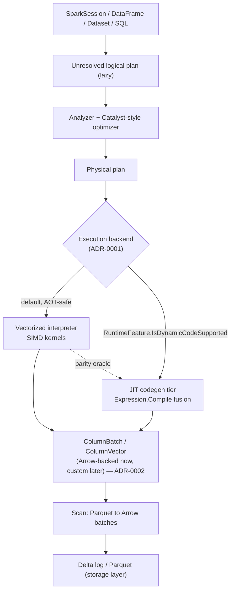
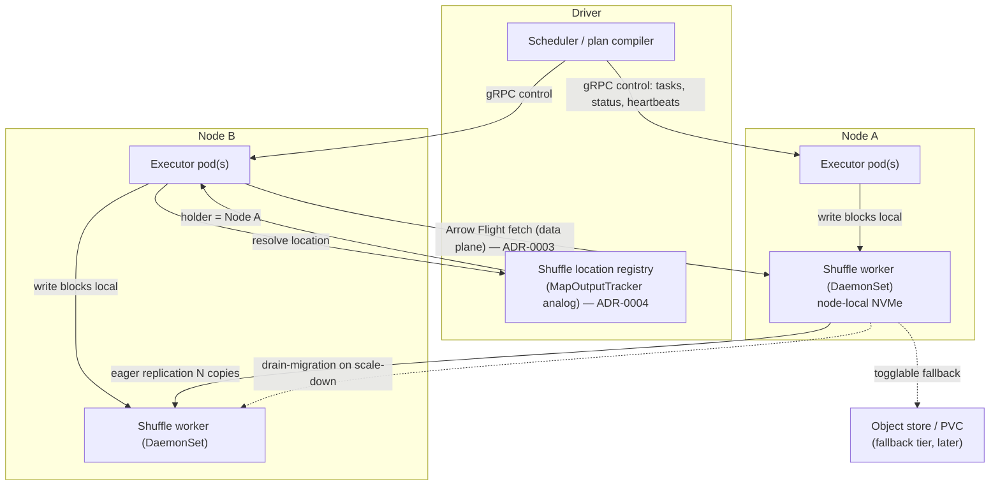

# DeltaSharp Engine Architecture Overview

This document stitches DeltaSharp's foundational engineering decisions into one
picture. It is a **summary that defers to the ADRs** in
[`docs/adr/`](../../adr/README.md) — if this overview and an ADR disagree, the ADR
wins. The high-level pillars (Spark parity, native Delta, Kubernetes-native) live
in `.github/copilot-instructions.md`.

## Decision ledger

| # | Fork | Decision | ADR |
|---|---|---|---|
| 1 | **Execution** | Pluggable backend: AOT-safe **vectorized interpreter** (default + reference) **+ optional JIT codegen tier** gated on `RuntimeFeature.IsDynamicCodeSupported`; intra-operator expression fusion first. Requires a **differential parity oracle** and AOT feature-gating. | [0001](../../adr/0001-execution-strategy.md) |
| 2 | **Columnar format** | **Arrow-compatible custom** (Velox model), Arrow-first: internal **mutable `ColumnBatch`/`ColumnVector`** (selection-vector-aware); Arrow at the edges. | [0002](../../adr/0002-columnar-batch-format.md) |
| 3 | **Transport** | **gRPC control plane + Arrow Flight data plane**, behind `IDataExchange`. | [0003](../../adr/0003-data-plane-transport.md) |
| 4 | **Shuffle** | **.NET-native remote shuffle service**: node-local workers + **shuffle location registry** + **dynamic resolution**; **drain-migration + configurable eager replication**; object-store fallback later; pull-first; Arrow-IPC blocks + map-side merge. | [0004](../../adr/0004-shuffle-architecture.md) |

**Unifying principle:** every decision is *an abstraction with swappable
implementations* — interpreter ↔ codegen; Arrow-backed ↔ custom vectors; Flight ↔
raw Pipelines; local workers ↔ object-store fallback. Start pragmatic and durable;
optimize behind the interface.

## Query path (single executor)

## Distributed runtime (driver + executors + shuffle service)

## Personas that own these areas

The `docs/persona/agents/` seats implement and review this architecture and
**reference these ADRs** (defer, don't redefine):

- `dotnet-runtime-performance-engineer` — codegen tier, AOT gating, GC/JIT/SIMD,
  off-heap memory (ADR-0001).
- `dotnet-vectorized-columnar-compute-engineer` — `ColumnVector` + SIMD kernels +
  selection vectors, the interpreter backend (ADR-0001/0002).
- `dotnet-distributed-execution-engineer` — gRPC host, `IDataExchange`/Arrow
  Flight, the native remote shuffle service: workers, location registry,
  drain-migration, replication, dynamic resolution (ADR-0003/0004).
- `dotnet-library-platform-engineer` — AOT feature-switch hygiene, multi-target
  packaging, analyzers (ADR-0001).
- Plus `query-execution-engine-engineer` (backend boundary),
  `delta-storage-format-engineer` (shuffle block format/merge),
  `reliability-test-chaos-engineer` (parity oracle, shuffle loss/migration tests),
  `compute-storage-finops-engineer` (replication-cost vs recompute-cost), and the
  architect/SRE (topology, spot/drain).

## Open decisions (tracked)

- **Memory model** for batches — off-heap (`NativeMemory`, 64-byte aligned) vs
  GC-heap + `ArrayPool` (leaning off-heap; Arrow's off-heap allocator is the early
  baseline).
- **Target framework(s) + AOT posture** — e.g., `net10.0`, multi-targeting, a
  NativeAOT executor image.
- **Codegen granularity** beyond intra-operator fusion (cross-stage fusion).
