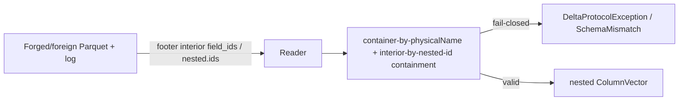

# Nested column mapping — array/map id-mode via `delta.columnMapping.nested.ids`

> **Status:** Draft — **round-1 (design; RFL PASS pending gate).** This design lifts the **#839** fail-closed
> gate for **id-mode `array<scalar>` / `map<scalar,scalar>`** by adopting Delta's
> `delta.columnMapping.nested.ids` wire format: the array/map **container binds by its rename-stable
> `physicalName`** (exactly as the **#676** struct container does) and each **interior `element`/`key`/`value`
> leaf binds by its `nested.ids` field_id within the container subtree** (the **#676** containment /
> identity-selection rule, extended one level down to the interior leaf). Scope stays **single-level**:
> `array<scalar>` / `map<scalar,scalar>` only — a nested-within-nested interior is **#585**, rejected *before*
> this gate.
>
> **C1 (the id model — preserved, not broken):** column mapping metadata still lives **only on
> `StructField`s**. `nested.ids` is a **`Map[String,Long]` stored on the *containing* array/map
> `StructField`'s metadata** — it is *not* a metadata slot on the interior `element`/`key`/`value` node (those
> remain metadata-free in `SchemaJson`). The containing `StructField` therefore *carries* the interior ids;
> C1 holds. The interior's Parquet `field_id` is *derived* from `nested.ids` at write time and stamped on the
> **leaf** (Parquet.Net 6.1.0 can stamp/read `field_id` on a `DataField` leaf), never on a group node.
>
> **Issue:** [#839](https://github.com/khaines/deltasharp/issues/839) <!-- issue-state:open --> — nested column
> mapping: array/map id-mode support (interior `field_id` / `nested.ids`) — **#676** follow-up.
> **Author:** delta-storage-format-engineer (orchestrated).
> **Reviewers:** delta-storage-format-engineer, cloud-native-distributed-systems-architect,
> reliability-test-chaos-engineer, cloud-native-security-sme, cloud-native-site-reliability-engineer,
> performance-benchmarking-engineer.
> **Last Updated:** 2026-08-21.
> **Related (merged):** [#676](https://github.com/khaines/deltasharp/issues/676) <!-- issue-state:open -->
> (nested struct/array/map column mapping — parent design; shipped via PR
> [#846](https://github.com/khaines/deltasharp/pull/846), tracking issue still open),
> [#830](https://github.com/khaines/deltasharp/issues/830) <!-- issue-state:closed --> (`ColumnPathKey`; PR
> [#835](https://github.com/khaines/deltasharp/pull/835)),
> [#829](https://github.com/khaines/deltasharp/issues/829) <!-- issue-state:closed --> (`BuildFieldIdMap`
> physical-path keying; PR [#836](https://github.com/khaines/deltasharp/pull/836)),
> [#828](https://github.com/khaines/deltasharp/issues/828) <!-- issue-state:closed --> (nested Parquet write;
> design PR [#834](https://github.com/khaines/deltasharp/pull/834), impl PR
> [#842](https://github.com/khaines/deltasharp/pull/842)).
> **Related (open):** [#585](https://github.com/khaines/deltasharp/issues/585) <!-- issue-state:open -->
> (nested-within-nested — the scope boundary this design rejects *first*),
> [#546](https://github.com/khaines/deltasharp/issues/546) <!-- issue-state:open --> (nested type widening —
> adjacent), [#840](https://github.com/khaines/deltasharp/issues/840) <!-- issue-state:open --> (nested
> rename/drop), [#675](https://github.com/khaines/deltasharp/issues/675) <!-- issue-state:open --> (nested
> CDF/column-mapping oracle), [#577](https://github.com/khaines/deltasharp/issues/577) <!-- issue-state:open -->
> (nested nullability enforcement).

---

## 1 · Overview

Delta **column mapping** decouples logical column names from the physical names/ids stored in Parquet. The
merged **#676** work extended DeltaSharp's mapping from leaf-only to **single-level nested**: a
`struct<scalars>` binds its container by `physicalName` and each scalar child leaf by its
`delta.columnMapping.id` within the container subtree (containment-scoped, identity-selected — #676 §2.5).
**#676 deliberately left `array<scalar>` / `map<scalar,scalar>` under *id mode* fail-closed** and filed
**#839**, because the array/map **interior** (`element`/`key`/`value`) is **not** a `StructField` and so — in
DeltaSharp's #676 model — carried no representable id.

This design closes **#839** by implementing Delta's `delta.columnMapping.nested.ids` for the two in-scope
shapes. `nested.ids` is the exact mechanism Apache Spark uses (in `DeltaColumnMapping.rewriteFieldIdsForIceberg`,
under IcebergCompatV2/Uniform) to give an array/map interior a representable id **without** attaching mapping
metadata to a non-`StructField` node: the id lives in a `Map[String,Long]` **on the containing
`StructField`**, keyed by the interior's physical-name path. That is precisely the shape DeltaSharp's C1
invariant permits, so #839 is implementable **without violating C1** (§2.4).

**Scope of the enabled surface (this PR):**

| Shape | name mode | id mode |
|---|---|---|
| `struct<scalars>` | ✅ (#676) | ✅ (#676, containment-scoped) |
| `array<scalar>` | ✅ (#676) | ✅ **enabled here** — container by `physicalName`, `element` leaf by `nested.ids` field_id |
| `map<scalar,scalar>` | ✅ (#676) | ✅ **enabled here** — container by `physicalName`, `key`/`value` leaves by `nested.ids` field_ids |
| nested-within-nested (`array<struct>`, `map<_,struct>`, `array<array>`, …) | ⛔ fail-closed, **#585** | ⛔ fail-closed, **#585** (rejected *before* the #839 gate) |

Why it matters: id-mode array/map is the last single-level nested gap left by #676. Column-mapped tables that
use IcebergCompatV2 / Uniform (a common Spark-parity shape) carry `nested.ids`; without this, DeltaSharp
fails closed on read even though the interior id **is** representable. Closing #839 makes those tables
readable (fail-closed remains for the *unrepresentable* variants — see the interop matrix, §2.6).

**Requirements traceability:** EPIC-05 column mapping (`storage-delta-architecture.md` §2.9 / §2.12.3);
direct follow-up of #676 §1 / §9.3.

**Scope boundary (explicit):** single-level `array<scalar>` and `map<scalar,scalar>` only. A nested-within-nested
interior (`array<struct>`, `map<string,struct>`, `array<array>`, `map<_,map>`, `struct<array>`, …) is
**deferred to #585** and rejected fail-closed **before** the #839 id-mode gate is reached
(`ColumnMapping.RejectNestedWithinNested`, `ColumnMapping.cs:445-500` — the nested-within-nested reject runs
first, then the id-mode array/map gate). Nested type widening (#546) and nested nullability enforcement
(#577) are adjacent and out of scope.

---

## 2 · Logical Architecture

### 2.1 Where array/map id-mode mapping lives

```mermaid
graph TD
  subgraph Assign[Assignment / write doors — ColumnMapping.cs / ParquetTypeMapping.cs]
    AFM[AssignFreshMapping — mint container id + interior nested.ids]
    VCS[ValidateColumnMappingSchema — parse+validate nested.ids]
    CNL[ParquetTypeMapping.CreateNestedLeaf — stamp interior leaf field_id + parquet.field.nested.ids]
  end
  subgraph IdRead[Id-mode read — ParquetFileReader.cs / NestedParquetColumnReader.cs]
    RFF[ResolveFileFields — array/map id-mode gate LIFTED for nested.ids-bearing fields]
    BFIM[BuildFieldIdMap — path-keyed leaf field_ids #829]
    RLM[ReadListAsync / ReadMapAsync — interior-leaf id binding within container]
  end
  Gate839[#839 id-mode array/map reject — ColumnMapping.cs:481-500]:::gone
  ForeignReject[foreign nested.ids reject — ColumnMapping.cs:502-513]:::gone
  Gate839 -.replace with: allow iff valid nested.ids present.-> VCS
  ForeignReject -.replace with: parse + validate nested.ids.-> VCS
  AFM --> VCS --> CNL
  RFF --> BFIM --> RLM
  classDef gone fill:#fdd,stroke:#900;
```

### 2.2 The `nested.ids` wire format (Delta-interop-exact)

`delta.columnMapping.nested.ids` is a **JSON object `Map[String,Long]`** stored on the **containing array/map
`StructField`'s metadata** (the same metadata object that carries that field's `delta.columnMapping.id` and
`delta.columnMapping.physicalName`). Its **keys are the interior's physical-name path**, joined with `.`, and
terminated by the interior selector; its **values are the interior `field_id`s**. For a field whose
`physicalName` is `P`:

| Field type | `nested.ids` value |
|---|---|
| `array<scalar>` | `{"P.element": <elementId>}` |
| `map<scalar,scalar>` | `{"P.key": <keyId>, "P.value": <valueId>}` |

This matches Apache Spark's `DeltaColumnMapping.rewriteFieldIdsForIceberg` exactly: `updateFieldId(nestedIds,
(path :+ "element").mkString("."))` with `path` seeded by `getPhysicalName(field)` — i.e. the key prefix is
the **container's physical name** (not its logical name), and the terminal segment is `element` / `key` /
`value`. **Interop rule:** DeltaSharp emits and consumes these keys verbatim; it never composes or parses a
dotted physical path for *binding* (binding is structured-segment, §2.5) — the dotted key is a
serialization-format string, validated against the field's declared shape (§2.3) and otherwise opaque.

On **write**, DeltaSharp copies `delta.columnMapping.nested.ids` → **`parquet.field.nested.ids`** on the
physical Parquet schema and stamps the interior **leaf** with `parquet.field.id = <that id>` (Parquet.Net
6.1.0 `DataField.FieldId`). This mirrors Delta Spark's write behavior: the interior leaf carries a real
Parquet `field_id`; the array/map **group node** carries none (Parquet.Net has no public group-node
`field_id` setter — the crux limitation, §2.6).

`SchemaJson` typed-metadata round-trip is a **satisfied prerequisite, not a new build**: #676 already
extended `SchemaJson` to typed metadata values, and `WriteMetadataValue`/`ReadMetadataValue`
(`SchemaJson.cs:300-332`, `:530-580`) already serialize and parse a **nested JSON object** value
(`MetadataValueKind.Nested` ↔ `JsonValueKind.Object` → `MetadataValue.Nested(ReadMetadataObject(...))`),
preserving dotted property keys and `Long` values verbatim. A round-trip regression test pins this (§3.10);
**no `SchemaJson` change is required** — if a future refactor regresses nested-object metadata, §3.10 fails
closed and the change is a prerequisite.

### 2.3 The invariant (C1): interior ids live on the *containing* `StructField`

Column mapping attaches `delta.columnMapping.{id,physicalName}` — and now `delta.columnMapping.nested.ids` —
**only to `StructField`s**. C1 (from #676 §2.2) is a hard property of `SchemaJson.WriteType`
(`SchemaJson.cs:160-179`): a `metadata` slot is emitted **only** in the `StructType`→`StructField` branch;
the `ArrayType.elementType` (`:140-148`) and `MapType.keyType`/`valueType` (`:149-158`) branches serialize the
raw inner **type** with **no metadata slot**.

`nested.ids` **does not weaken C1** — it *depends* on it:

- The array/map column is itself a `StructField` inside a `StructType`; its metadata object is the one C1
  permits. `nested.ids` is a **value in that permitted metadata object**.
- The interior `element`/`key`/`value` node still gets **no** `SchemaJson` metadata slot. Its id is
  *addressed by* the containing `StructField` (via the dotted key), not *stored on* the interior node.
- Therefore "mapping metadata lives on `StructField`s" holds literally: the containing `StructField` carries
  the interior ids. This is exactly Delta Spark's own model — `nested.ids` is a field-level property, and the
  interior Parquet `field_id` is a *derived* physical artifact, not log-level mapping metadata on a
  non-`StructField`.

**Assignment walk (id mode, extends #676's pre-order over `StructField`s):**
- **`StructType`** → for each child `StructField`, assign `(++maxColumnId, col-<uuid>)`, then recurse into
  the child's `DataType` (nested `StructType` recurses; the two nested shapes below terminate the struct walk
  but mint interior ids).
- **`array<scalar>` column** → the container `StructField` was assigned by its parent step. **Mint one more
  id** for the interior: `elementId = ++maxColumnId`; write `nested.ids = {"<containerPhysical>.element":
  elementId}` onto the container field's metadata.
- **`map<scalar,scalar>` column** → container assigned by parent; **mint two more ids** in `key`-then-`value`
  order: `keyId = ++maxColumnId`, `valueId = ++maxColumnId`; write `nested.ids =
  {"<containerPhysical>.key": keyId, "<containerPhysical>.value": valueId}`.
- **Scalar / nested-within-nested** → scalar terminates; nested-within-nested is rejected first (#585).

**`maxColumnId` accounting (mode-split — the key change from #676):** `maxColumnId` remains a monotonic
high-water mark, but under **id mode** an array/map now consumes **more than one** id because its interior ids
count:

| Shape | name mode Δ`maxColumnId` | id mode Δ`maxColumnId` |
|---|---|---|
| `array<scalar>` | **1** (container only) | **2** (container + `element`) |
| `map<scalar,scalar>` | **1** (container only) | **3** (container + `key` + `value`) |

Name mode is **unchanged** from #676 (no field_ids at all ⇒ no `nested.ids` ⇒ array/map contribute exactly
1). The `maxColumnId` ceiling check (`ColumnMapping.cs:568`, `id > maxColumnId`) is extended to interior ids:
every `nested.ids` value must be `<= maxColumnId`. As with #676, the validator asserts only the ceiling and
MUST keep accepting id **gaps** (a Spark-authored table consuming `nested.ids` values may have a counter that
exceeds the `StructField` count).

**Physical schema is a pure name substitution (unchanged from #676):** `ToPhysicalSchema` /
`MapWriteSchemaToPhysical` substitute physical names at every depth but leave type/nullability/order
byte-identical. In id mode the container field keeps `delta.columnMapping.id` **and** `nested.ids` (both
consumed at write to stamp leaf `field_id`s and `parquet.field.nested.ids`); in name mode both are stripped.

### 2.4 Component boundaries

| Component | File / anchor | Change |
|---|---|---|
| `ColumnMapping.AssignFreshMapping` / `Assign` | `ColumnMapping.cs` | in **id mode**, after minting the array/map container `(id, physicalName)`, mint interior ids (§2.3) and write `delta.columnMapping.nested.ids` onto the container `StructField`; advance `maxColumnId` per the id-mode Δ table. Name mode unchanged. |
| `ColumnMapping.ValidateColumnMappingSchema` id-mode array/map **gate** | `ColumnMapping.cs:481-500` | **LIFTED for the in-scope shapes:** an id-mode `array<scalar>`/`map<scalar,scalar>` is **accepted iff it carries a valid `nested.ids`** (§2.3). A nested-within-nested interior is rejected **before** this gate (#585). A **plain id-mode array/map with NO `nested.ids`** stays fail-closed (`UnsupportedFeature`, naming #839) — its interior has no representable id and its container id is on the group node DeltaSharp cannot read (§2.6). |
| `ColumnMapping.ValidateColumnMappingSchema` foreign-`nested.ids` **reject** | `ColumnMapping.cs:502-513` | **REPLACED by parse + validate** (§2.3): parse the JSON object; require keys to be exactly `<physicalName>.element` (array) or `<physicalName>.key`+`<physicalName>.value` (map) matching the field's actual shape; require values in `[1, maxColumnId]` (and the `[1, int.MaxValue]` footer bound); require no duplicate id (global uniqueness extended over interior ids); reject a `nested.ids` on a **non-array/map** field. A malformed/foreign-shape `nested.ids` fails closed (never silently ignored). |
| `SchemaJson` typed-metadata round-trip | `SchemaJson.cs:300-332`, `:530-580` | **prerequisite already satisfied** — nested-object metadata (`MetadataValueKind.Nested` ↔ `JsonValueKind.Object`) round-trips dotted keys + `Long` values. Pinned by §3.10; no change unless a refactor regresses it. |
| `ParquetTypeMapping.CreateNestedField` id-mode array/map **write reject** | `ParquetTypeMapping.cs:109-114` | **LIFTED** for the in-scope shapes: proceed to build the array/map physical field. Nested-within-nested and non-nullable-container rejects (`:116-124`, `:190-193`) stay. |
| `ParquetTypeMapping.CreateNestedLeaf` interior-leaf stamping | `ParquetTypeMapping.cs:222-246` | in id mode, stamp the interior **leaf**'s `field_id` = the matching `nested.ids` value (`element`→`P.element`, `key`→`P.key`, `value`→`P.value`), applying the existing `[1, int.MaxValue]` range guard; also emit `parquet.field.nested.ids` on the container. A write-door assertion requires **every** interior leaf of an id-mode array/map to be stamped + range-guarded (an unstamped interior leaf commits a permanently-unreadable file). Name/none mode still stamps **no** interior `field_id`. |
| `ParquetFileReader.ResolveFileFields` array/map id-mode reject | `ParquetFileReader.cs:418` (call), `:1535-1544` region | lift the id-mode array/map reject **for `nested.ids`-bearing fields**; carry the container's interior id map into the nested decoder alongside `byFieldId`. Preserve the surviving top-level scalar guard (`:1571-1578`). |
| `NestedParquetColumnReader.ReadListAsync` / `ReadMapAsync` | `NestedParquetColumnReader.cs` (dispatch `:217`) | **id-mode interior binding** (§2.5): resolve the container group by `physicalName`; look up each interior leaf's `nested.ids` field_id in path-keyed `BuildFieldIdMap` (#829); require the resolved `DataField` to be one of the **resolved container's own leaf children** (the #676 containment check, one level down); pass that id-selected leaf through `ExpectScalarLeaf`. The `:217` comment ("array/map under id mode are rejected upstream (#839), so they never reach here") is **removed** — that path now handles them. |
| `NestedParquetColumnReader.ValidateShape` map canonical-name guard | `NestedParquetColumnReader.cs:139-153` | unchanged (mode-independent, #676). In id mode it is **superseded** as the identity check by interior-id selection (`key`/`value` are distinguished by distinct `nested.ids`), but kept as defense-in-depth; it must still not *positionally* transpose a well-formed id-bound map. |
| `ColumnMapping.EvolveNameModeMapping` | `ColumnMapping.cs` | array/map interior ids are **immutable** across evolve; a container whose *type* changes retires its identities (never re-parents). Name-mode evolve unchanged (no interior ids). |

### 2.5 Resolution model (id mode — the containment-scoped interior binding)

The read model is the **#676 struct model, extended one level down to the interior leaf**. It is
**containment-scoped and identity-selected**, never a file-global positional bind:

1. **Resolve the container** group from the log `physicalName` (rename-stable) via the mode-independent
   duplicate-intolerant top-level `byName` (#676 §2.5 step 1): a duplicate top-level container physical name
   fails closed *before* binding. The container must resolve to a **group** node (array/map wrapper), not an
   id-bearing leaf. **The container is bound by `physicalName`, not by any `field_id`** — its declared
   `delta.columnMapping.id` is **structural-only, never footer-resolvable** (Parquet.Net cannot stamp/read a
   group-node `field_id`); a container id nonetheless *found* on some footer leaf fails closed.
2. **For each interior leaf**, read its id from the container's `nested.ids` (`P.element` for an array;
   `P.key`/`P.value` for a map), look that id up in the path-keyed `BuildFieldIdMap` (#829), and **require the
   resolved `DataField` to be one of the resolved container's own leaf children** (structured
   `PhysicalPathKey` parent-path equality against the container — the #676 containment check). An interior id
   that resolves to a leaf **outside** the container's own children (a top-level leaf, a sibling container's
   interior, a coincidentally-equal rep/def profile) **fails closed `SchemaMismatch`**. The id-selected leaf
   — and only it — is then passed through `ExpectScalarLeaf` (`ValidateLeafPhysicalType` including temporal
   annotation + `ValidateLeafStructuralLevels`), so a footer that swaps interior `field_id` stamps across
   **differently-typed** interiors fails closed as `SchemaMismatch`, not a mid-decode cast fault.
3. **Map key/value are separated by their distinct `nested.ids` ids** — id-selection, not position. This is
   strictly stronger than name mode's positional-plus-canonical-name binding: a `map<T,T>` with two `REQUIRED`
   same-typed interiors whose footer transposes key/value is caught because `P.key` and `P.value` resolve to
   **distinct** field_ids (the canonical-name guard remains as defense-in-depth).
4. **Array has exactly one interior** (`element`); its single id must resolve to the container's own list
   element leaf. Two interior ids aliasing to one leaf, or a required interior key absent from `nested.ids`,
   or the container `physicalName` group absent from the footer, all **fail closed**.

**Residual (id-authoritative, same as flat/#676 mode):** once the container is provenance-verified and the
id-selected interior leaf is type-validated, a forged footer that permutes `field_id` stamps across
**same-typed** map interiors inside the correct container (a `map<long,long>` with `key`/`value` ids swapped)
transposes their *values* — the nested-interior analogue of the accepted flat-mode id-anchor residual
(`ColumnMappingIdentity.cs:78-92`). Id is the identity anchor, so a metadata-consistent same-typed
permutation is out of the stated threat model (§6). Note the map **canonical-name guard** (§2.4) still
catches the *positional* form of this transposition for well-formed files; only a footer that **also** rewrites
the `nested.ids` stamps consistently across same-typed interiors is the accepted residual.

**Name mode is unchanged from #676** — no `field_id`, no `nested.ids`; the array/map interior resolves
structurally, with the mode-independent physical-path uniqueness guard and the map canonical-name guard.

### 2.6 The Parquet.Net group-node-id limitation → cross-engine interop matrix (the crux)

Parquet.Net 6.1.0 **cannot stamp or read a `field_id` on a group node** — `Field.SchemaElement` has no public
setter and `FieldId` is declared only on `DataField` (empirically confirmed in #676). This is the single fact
that shapes #839 interop. Delta Spark binds an id-mode array/map **container by the group-node `field_id`**
and the interior by `parquet.field.id` on the leaf (which it derives from `nested.ids` under IcebergCompatV2).
DeltaSharp can stamp/read the **interior leaf** id but **not** the container group-node id, so it binds the
container by `physicalName` instead. The consequences, stated honestly:

| Direction | name mode | id mode `array<scalar>` / `map<scalar,scalar>` |
|---|---|---|
| **DeltaSharp → DeltaSharp** | ✅ | ✅ **round-trips.** Writer stamps interior leaf `field_id` + emits `nested.ids`; reader binds container by `physicalName` + interior by `nested.ids` id within the container subtree. |
| **DeltaSharp → Spark** | ✅ (physical names only) | ⚠️ **documented caveat.** DeltaSharp stamps the interior leaf id and emits `nested.ids`, but **cannot** stamp the array/map **group-node `field_id`**. A strict Spark id-mode reader binds the container by that group-node id → **may not bind the container**. Mirrors #676's struct id-mode `⚠️` Spark caveat. Not silent on the DeltaSharp side (we emit everything representable); the gap is a Parquet.Net limitation, called out here and in §8. |
| **DeltaSharp → delta-rs** | ✅ (physical names) | ⚠️ same group-node caveat as Spark (delta-rs binds the container by the group-node `field_id` per the Delta protocol). |
| **Spark → DeltaSharp** (wrote `nested.ids`, IcebergCompatV2) | ✅ (physical names) | ✅ **reads.** Spark stamped the interior leaf `field_id` and wrote `nested.ids`; DeltaSharp binds interior by that leaf id + container by `physicalName`. The Spark group-node id is ignored (DeltaSharp never needs it — it binds the container by name). |
| **Spark → DeltaSharp** (**no** `nested.ids`, plain id mode) | ✅ (physical names) | ⛔ **fail-closed.** The interior has **no** leaf `field_id` (plain Delta id-mode binds the interior *positionally* and the container by the group-node id). DeltaSharp cannot bind the container by the group-node id (Parquet.Net leaf-only) and has **no representable interior id** to bind by — so it **fails closed, never mis-binds**. Under DeltaSharp's id-mode contract, positional interior binding is exactly the silent mis-attribution #676 forbade. `ValidateColumnMappingSchema` rejects an id-mode array/map **lacking** `nested.ids` (`UnsupportedFeature`, naming #839). |
| **delta-rs → DeltaSharp** | ✅ (physical names) | ✅ if it wrote `nested.ids` (IcebergCompatV2); ⛔ fail-closed without it (same as Spark). |

The two non-✅ id-mode cells are the honest crux: the outbound `⚠️` (DeltaSharp cannot write the container
group-node id) and the inbound `⛔` (a plain Spark id-mode array/map carries no interior leaf id and its
container id is on a group node DeltaSharp cannot read). Neither is a data-integrity residual — both are
**fail-closed or caveated interop limits**, not silent mis-reads.

### 2.7 Plan/data model

- Assignment stays `Assign(StructType, long startingMaxId) → (StructType, long maxColumnId)` — a pure
  function returning a fresh metadata-annotated tree; the only change is that an id-mode array/map container
  `StructField` now carries a `nested.ids` metadata value and the counter advances by 2 (array) or 3 (map).
- Resolution for the interior is the #676 containment/identity-selection lookup applied to the interior leaf
  (`BuildFieldIdMap` + container-subtree containment), keyed by the `nested.ids` id.
- The `nested.ids` map is parsed once at validation into a structured
  `(selector ∈ {element,key,value}) → id` table keyed off the container's physical name; **no component
  composes or parses a dotted physical path for binding** (the dotted key is validated then discarded in favor
  of structured selectors).

### 2.8 API surface

No public **type** change. The only externally-visible behavior change is that create/read of an **id-mode
`array<scalar>`/`map<scalar,scalar>`** column-mapped table **succeeds** (previously fail-closed naming #839),
and a Spark/IcebergCompatV2 table carrying `nested.ids` becomes readable. A plain Spark id-mode array/map
(no `nested.ids`) is **still** fail-closed — now with a message naming the `nested.ids` requirement, not a
blanket #839 reject.

### 2.9 Dependencies

| Dependency | State | Role |
|---|---|---|
| #676 nested struct/array/map column mapping | **merged** (PR #846; tracking issue open) | parent design — container-by-`physicalName` + containment/identity-selection model this extends to the interior |
| #829 `BuildFieldIdMap` physical-path keying + footer↔decoder bijection | **merged** (PR #836) | intra-file substrate for the interior leaf `field_id`; parentage layered on top per §2.5 |
| #830 `ColumnMappingIdentity` structured `ColumnPathKey` | **merged** (PR #835) | structured-segment addressing (no dotted-path parsing) |
| #828 nested Parquet **write** (`WriteAllPartsAsync`) | **merged** (design PR #834, impl PR #842) | the nested writer #839 extends to stamp interior `field_id` + `parquet.field.nested.ids` |
| `SchemaJson` typed metadata (nested-object values) | **merged** (#676) | serializes/parses `nested.ids` as a nested JSON object — verified prerequisite (§2.3, §3.10) |
| #585 nested-within-nested | **open** | scope boundary — rejected **before** the #839 gate |
| #546 nested type widening | **open** | adjacent, out of scope |
| #840 nested rename/drop | **open** | metadata-only nested rename/drop (array/map rename retains `nested.ids`) — deferred |
| #675 nested CDF/column-mapping oracle | **open** | consumes id-mode array/map read once #839 lands |

### 2.10 Tenant/storage-backend considerations

Pure metadata/schema transform, backend-independent; no new I/O (interior-id correlation reads the
already-open footer via `BuildFieldIdMap`). Nested columns remain **outside** the statistics/data-skipping
surface (`StatisticsPolicy` skips nested types); #839 emits **no** interior stat keys (regression-asserted,
§3.16).

---

## 3 · Functional Test Scenarios

Oracle (mode-split, extends #676's). **Id mode (array/map):** the log `nested.ids[<containerPhysical>.<sel>]`
per interior ≡ the footer interior-leaf `field_id`, **bijective over interior leaves** (the array/map
**group node** carries no footer id — that exclusion is asserted explicitly), **within** the container
resolved by `physicalName`. **Name mode:** unchanged from #676 — physical-name path only, **no `field_id`
anywhere**. Every same-typed-interior test (a `map<long,long>`) draws key vs value from **disjoint value
domains** (keys ∈ `[1000,1999]`, values ∈ `[2000,2999]`) so a positional/transposed mis-bind cannot pass on
equal values. Every fail-closed cell asserts the **exact exception type**. The **write→read round-trip uses
the real nested writer (#834/#842)** plus a **hand-authored `_delta_log`** with the crafted `nested.ids` /
footer.

**Happy path (round-trip identity ∧ mode-split bijection)**
1. `IdMode_ArrayScalar_CreateReadRoundTrip_ContainerByPhysicalName_ElementByNestedId` —
   `{id:long, tags:array<string>}`. `nested.ids = {"col-b.element": 3}`; `maxColumnId == 3` (id=1/col-a,
   tags container=2/col-b, tags.element=3). Interior leaf `field_id == 3`; container group carries **no**
   footer id. Read resolves values identically after a logical rename of `tags` (read-through, no rewrite).
2. `IdMode_MapScalarScalar_CreateReadRoundTrip_KeyValueByNestedIds` — `{id:long, props:map<string,long>}`.
   `nested.ids = {"col-c.key": 5, "col-c.value": 6}`; `maxColumnId == 6` (id=1, props container=4/col-c,
   key=5, value=6 — note the container id is minted before the interior ids per the pre-order walk). Both
   interior leaves stamped; group node id-free.
3. `NameMode_ArrayAndMap_Unchanged_NoNestedIds_NoFieldId` — the same schemas in **name** mode contribute
   **exactly 1** to `maxColumnId` each (`maxColumnId == 3` for `{id, tags, props}`); the committed
   `schemaString` carries **no** `nested.ids` object and **no** `field_id` on any footer leaf.
4. `IdMode_MaxColumnId_Accounting_ArrayIsPlus2_MapIsPlus3` — the mode-split Δ table (§2.3): asserts the
   counter advances by 2 for an array, 3 for a map, and that gaps from a Spark-authored `nested.ids` are
   accepted (a table whose `maxColumnId` exceeds its `StructField` count loads).

**Cross-engine interop (§2.6 — read side)**
5. `SparkAuthored_IdMode_ArrayWithNestedIds_ReadsCorrectly` — a hand-authored IcebergCompatV2-shaped log
   (`nested.ids` present) + footer with interior leaf `field_id`; DeltaSharp binds interior by leaf id +
   container by `physicalName`; the group-node id (if present) is ignored.
6. `SparkAuthored_IdMode_ArrayNoNestedIds_FailsClosed_NamingNestedIdsRequirement` — a plain id-mode array
   (no `nested.ids`, interior has no leaf `field_id`) → `UnsupportedFeature` at `ValidateColumnMappingSchema`
   (commit **and** load), message names the `nested.ids` requirement (not a blanket #839 reject); **never**
   binds the interior positionally.
7. `SparkAuthored_IdMode_MapNoNestedIds_FailsClosed` — the map dual of §3.6.

**Id-mode interior containment (the #676-parity closure — CRITICAL)**
8. `IdMode_InteriorId_ResolvesToTopLevelLeaf_FailsClosed` — a forged `nested.ids`/footer stamps the interior
   id on a top-level scalar leaf → containment reject `SchemaMismatch`.
9. `IdMode_ForgedNestedIds_RelocatesElementToSiblingContainersInterior_FailsClosed` — two arrays
   (`a:array<long>` / `b:array<long>`); the footer stamps `a`'s element id on `b`'s element leaf → the
   containment (container-subtree parent-path equality) reject fires; no cross-container capture.
10. `SchemaJson_NestedIdsObject_RoundTrips_DottedKeys_And_LongValues` — the `SchemaJson` prerequisite pin
    (§2.3): a `nested.ids` object with `{"col-b.element": 3}` / `{"col-c.key": 5, "col-c.value": 6}`
    serializes and re-parses byte-identically (dotted keys preserved, `Long` values preserved).
11. `IdMode_MapKeyValueSwappedAcrossDifferentlyTypedInteriors_FailsClosed_AsSchemaMismatch` —
    `map<string,long>` with the `key`/`value` `field_id` stamps swapped → the id-selected leaf is
    type-validated (`ExpectScalarLeaf`), so `string`↔`long` fails closed as `SchemaMismatch`, not a
    mid-decode cast fault.
12. `IdMode_MapKeyValueSwapped_SameTyped_DisjointWitness` — `map<long,long>`, `key ∈ [1000,1999]`,
    `value ∈ [2000,2999]`; a **positional** transposition is caught by the canonical-name guard **and** by
    distinct `nested.ids` id-selection; the fully-consistent same-typed `nested.ids` rewrite is the **accepted
    id-anchor residual** (§6) — this cell documents the residual boundary (asserts the positional form fails,
    the metadata-consistent form is the residual).
13. `IdMode_ContainerPhysicalNameGroupAbsentFromFooter_FailsClosed` and
    `IdMode_ContainerResolvesToNonGroupLeaf_FailsClosed` — container-binding negatives (§2.5 step 1).
14. `IdMode_ContainerDeclaredIdFoundOnFooterLeaf_FailsClosed` — the container id is structural-only and must
    **never** be footer-resolvable.

**Per-invariant fail-closed matrix over the interior (nested.ids validation — AC4)**
15. `NestedIds_KeyShapeMismatch_FailsClosed` — the shape × wrong-key matrix, each `DeltaProtocolException`:
    `{".element" on a map}`, `{".key"/".value" on an array}`, `{wrong physicalName prefix (a sibling's
    physical name)}`, `{missing required key (array with no ".element"; map missing ".key" or ".value")}`,
    `{extra/unknown key}`.
16. `NestedIds_OnNonArrayMapField_FailsClosed` — a `nested.ids` on a `struct` field, a scalar field, and a
    top-level non-nested field → `UnsupportedFeature`/`Inconsistent` (a `nested.ids` is only meaningful on an
    array/map).
17. `NestedIds_InteriorIdCollidesWithTopLevelId_FailsClosed` and
    `NestedIds_InteriorIdCollidesWithAnotherInteriorId_FailsClosed` — global id uniqueness extended over
    interior ids (an `element` id equal to a top-level struct-child id; two map interiors sharing an id).
18. `NestedIds_InteriorIdExceedsMaxColumnId_FailsClosed` (nested ceiling; the ceiling check now covers
    interior ids), `NestedIds_InteriorId_NonPositive_FailsClosed`, and
    `LogSide_InteriorId_AboveInt32Max_FailsClosed` (the log-side `> int.MaxValue` reject before the footer
    int32 stamp).
19. `IdMode_NestedWithinNested_RejectedBeforeGate_NamingNot839But585` — the scope-boundary ordering:
    `array<struct>`, `map<string,struct>`, `array<array>`, `map<_,map>`, `struct<array<struct>>` each →
    `UnsupportedFeature` **naming #585** (the nested-within-nested reject runs at `ColumnMapping.cs:445-500`
    **before** the #839 id-mode array/map gate), **no partial `maxColumnId` advance**.

**Write byte-invariance / write-door assertions (real nested writer #834/#842)**
20. `IdMode_ArrayWrite_ElementLeafCarriesNestedId_FieldId` and
    `IdMode_MapWrite_KeyValueLeavesCarryNestedIdFieldIds` — the writer stamps interior leaf `field_id` =
    `nested.ids` value and emits `parquet.field.nested.ids` on the container; the group node carries **no**
    `field_id`.
21. `IdMode_NestedWrite_UnstampedInteriorLeaf_FailsClosedAtWriteDoor` — the write-door "every id-mode interior
    leaf stamped + range-guarded" assertion (a positive-only test cannot distinguish "the door asserts" from
    "the path happens to stamp").
22. `NameMode_ArrayMapWrite_NoNestedIds_NoInteriorFieldId_ByteUnchanged` — measured against a committed golden
    fixture / explicit pre-post SHA-256 (name/none-mode array/map physical bytes unchanged from #676).

**Evolve / identity**
23. `IdMode_Evolve_AddArrayColumn_MintsContainerPlusElementId_MaxColumnIdStrictlyIncreases` and
    `IdMode_Evolve_ArrayInteriorIdImmutableAcrossRename` (the container renames; its `nested.ids` interior id
    is preserved, never re-minted).
24. `IdMode_Evolve_ContainerTypeChangesArrayToMap_RetiresInteriorIdentities_NotReParented` (under
    `overwriteSchema`).

**Regression / no-emission**
25. `NoInteriorStatistics_Emitted` and `NonNested_And_Struct_IdMode_Unchanged` — #839 emits no interior stat
    keys and leaves #676 struct id-mode behavior byte/behavior-unchanged.

**Seeded property harness (house convention; the conjunctive tamper oracle over the interior)**
26. Uses `tests/Shared/TestSeed.cs` (`Resolve`/`Combine`, `DELTASHARP_TEST_SEED`), fixed **200** iterations
    (house precedent `ChangeFeedCdcFuzzTests.cs:103`), the `[deltasharp-seed]` reproduction line, and a
    **minimization/shrink** step that lands a failing draw as a permanent minimized regression. Generator
    space: field count, scalar interior type, `array` vs `map`, per-interior **disjoint** value domains.
    **Enumerated interior tamper-operator set:** relocate an interior `field_id` to a sibling container's
    interior; swap `key`/`value` `field_id`s; delete a `nested.ids` key; set an interior id `= maxColumnId+1`;
    set an interior id equal to a top-level id; inject a `nested.ids` on a non-array/map field; set a
    key-shape mismatch (`.element` on a map); delete the container group; stamp the container id on a footer
    leaf. **Invariants asserted as a conjunction:** `round-trip identity` ∧ `mode-split log↔footer bijection
    (interior leaves only; container group id-free)` ∧ `thrown type ∈
    {DeltaProtocolException, DeltaStorageException}` for every tamper. This is the #676 conjunctive tamper
    oracle re-cast one level down onto the interior.

**Integration**
27. `Cdf_NestedArrayMap_IdMode_ResolvesOldFileAfterContainerRename` — the #675 nested oracle's concrete
    dependency: a CDF read of an old file after an id-mode array/map container rename resolves the interior by
    its immutable `nested.ids` id (unblocks #675 for array/map).

**Sequencing.** Read-path and validation cells are testable now with `ParquetSerializer`-authored fixtures.
The production write-path round-trip (§3.20–3.22) runs on the **merged** #834/#842 nested writer (no longer a
pending dependency, unlike in #676 where it was unmerged).

**Acceptance-criteria mapping (#839):** AC-assignment → §3.1–3.4; AC-nested.ids-validation (AC4) → §3.15–3.18;
AC-resolution/containment → §3.5, 3.8–3.14; AC-interop → §3.5–3.7, §2.6; AC-scope-boundary (#585 first) →
§3.19; AC-write → §3.20–3.22; AC-fail-closed → §3.6–3.19, 3.26.

---

## 4 · Performance

- **Workload:** schema-transform at commit and read-open — O(number of `StructField`s + interior leaves),
  typically tens of fields. No per-row cost; interior-id containment is O(interiors) path comparisons over
  the already-open footer. `nested.ids` is parsed once per array/map field at validation.
- **Targets:** assignment/resolution add < 1% to a create/read-open on a realistic nested schema; zero
  allocation per data row; the interior decode path is the existing #571/#584 nested decoder unchanged.
- **Memory:** one metadata-annotated schema copy per transform; the parsed `nested.ids` table is O(1)/O(2)
  entries per array/map field. Recursion depth ≤ 2 (single-level scope); parse/footer depth already capped
  (`SchemaJson.MaxDepth = 64`; `MaxFooterFieldIdMapDepth = 100`).
- **Regression gate:** a 50-`StructField` schema with array/map columns assign+resolve micro-benchmark stays
  within the schema-transform noise floor; the per-batch decode path is untouched.

---

## 5 · Security

- **Data classification:** `nested.ids` is non-sensitive schema metadata; no PII flows through the layer;
  fail-closed messages carry only sanitized nested **paths** (`DiagnosticText.Sanitize`), never decoded bytes
  or raw foreign interior names.
- **Input validation (the crux):** the footer `field_id` stamps and the log `nested.ids` are
  attacker-influenced. Every interior invariant is validated fail-closed: key-shape match to the field's
  declared type, `[1, maxColumnId]` and `[1, int.MaxValue]` range, global id uniqueness (interior vs
  top-level vs interior), `nested.ids`-only-on-array/map, and the **containment** check (an interior id must
  resolve to a leaf **inside** its declared container's subtree). The intra-file #829 bijection is a
  substrate, **not** the footer↔log parentage guarantee.
- **Fail-closed over fallback:** id mode never binds an interior **positionally** — a plain Spark id-mode
  array/map (no `nested.ids`, no interior leaf id) fails closed rather than guessing position; a `nested.ids`
  whose interior id is absent from the footer fails closed; the container's structural-only id never
  name/position-falls-back and fails closed if found on a footer leaf.
- **Supply-chain:** no new dependencies; interior leaf `field_id` stamping via the merged #834/#842 nested
  writer (`DataField.FieldId`); nested-object metadata via the merged #676 `SchemaJson`.

---

## 6 · Threat Model



| STRIDE | Surface | Threat | Mitigation |
|---|---|---|---|
| **Tampering** | interior `field_id` vs log container | forged footer stamps an interior id on a foreign leaf → cross-column mis-attribution | **containment + identity selection** (§2.5): interior id must resolve to the resolved container's own leaf child; else fail closed |
| **Tampering** | forged `nested.ids` relocating an interior to a sibling container | `a.element` id stamped on `b`'s element leaf | container-subtree parent-path equality reject (§3.9) |
| **Tampering** | `map<T,T>` key/value | positional transposition of same-typed `REQUIRED` interiors | distinct `nested.ids` id-selection + canonical `key`/`value` name guard (§2.5 step 3) |
| **Tampering** | plain Spark id-mode array/map (no `nested.ids`) | interior has no leaf id; container id on group node | **fail closed** — no positional interior bind, no group-node id read (§2.6 inbound `⛔`) |
| **Confusion** | key-shape mismatch in `nested.ids` (`.element` on a map) | wrong interior selector silently applied | key-shape validation against the field's declared type (§3.15) |
| **Confusion** | interior id colliding with a top-level id | interior binds to a top-level column's leaf | global id uniqueness extended over interior ids (§3.17) |
| **Spoofing** | container declared id found on a footer leaf | container mis-bound by a group-node-like id | container is `physicalName`-bound; a footer-resolvable container id fails closed (§3.14) |
| **Info disclosure** | read-exit relabel | raw foreign interior names in an exception | typed `DeltaStorageException` + sanitized path, before batch construction |
| **DoS** | deeply/widely nested schema | unbounded recursion | single-level scope → depth ≤ 2; parse/footer depth capped; nested-within-nested fail-closed (#585) |

**Residual:** (i) **id-anchor same-typed interior residual** — within a provenance-verified container, a
footer that **consistently** rewrites both the `nested.ids` stamps and the leaf `field_id`s across
**same-typed** map interiors transposes their values (the nested-interior analogue of DeltaSharp's flat-mode
id-anchor posture, `ColumnMappingIdentity.cs:78-92`; the *positional* form is still caught by the
canonical-name guard); (ii) the **cross-engine group-node-id gap** (§2.6) is an **interop** limitation
(fail-closed inbound for plain id-mode array/map, caveated outbound to Spark/delta-rs), not a data-integrity
residual. Neither is a silent cross-column capture — those are closed by containment + interior-id selection.
Nested-within-nested (#585) and nested widening (#546) are out of scope, fail-closed.

---

## 7 · Observability

- **Logging:** fail-closed rejections log via the sanitized `DeltaProtocolException`/`DeltaStorageException`
  path; add the **sanitized interior path** (e.g. `props.value`) to the violation message. No new happy-path
  log site.
- **Metrics:** none — schema transform, no runtime hot path.
- **Correlation:** violations surface under the existing table-path/version fields on the read/commit
  activity.

---

## 8 · Rollout & Risk

- **Rollout:** additive behind the existing `delta.columnMapping.mode` gate. Existing name-mode array/map,
  id-mode struct, `none`, and non-nested tables are byte/behavior-unchanged. The #839 id-mode array/map gate
  is **narrowed** from "reject all id-mode array/map" to "reject id-mode array/map **lacking a valid
  `nested.ids`**"; a plain Spark id-mode array/map (no `nested.ids`) remains fail-closed — its rejection
  message now names the `nested.ids` requirement.
- **Interop caveats (documented, not silent):**
  - **DeltaSharp → Spark/delta-rs (id mode):** DeltaSharp stamps the interior leaf `field_id` and emits
    `nested.ids`, but **cannot** stamp the array/map **group-node `field_id`** (Parquet.Net 6.1.0). A strict
    Spark id-mode reader that binds the container by the group-node id **may not bind the container**. This
    mirrors #676's struct id-mode Spark caveat. Name-mode DeltaSharp→Spark is fully interoperable.
  - **Spark/delta-rs → DeltaSharp (plain id mode, no `nested.ids`):** **fail-closed** (no representable
    interior id, container id on an unreadable group node). Only IcebergCompatV2-shaped Spark tables (with
    `nested.ids`) are readable in id mode. Name mode is fully interoperable.
- **Kill-switch:** the change re-narrows a fail-closed gate; a defect → widen the gate back to "reject all
  id-mode array/map" (revert). DeltaSharp-written id-mode array/map data stays self-describing (interior leaf
  `field_id` + `nested.ids`), so a revert only blocks *new* reads, never corrupts committed data.
- **Risk register:** (a) interior mis-attribution → data mis-attribution — mitigated by §2.5 containment +
  §3.8–3.14 + #829 bijection; (b) `maxColumnId` mis-accounting (interior ids not counted) → id reuse — the
  mode-split Δ table + §3.4/§3.17/§3.18; (c) cross-engine group-node-id gap — documented caveat, not silent
  (§2.6); (d) scope creep into nested-within-nested — §3.19 boundary test naming #585 (rejected before the
  gate).
- **Launch checklist:** unit + integration (§3) green on both TFMs; `dotnet format`; determinism ban; DCO;
  RFL PASS; **#585 (scope boundary), #546, #840, #675 verified open** and **#676/#828/#829/#830 verified
  merged/closed** before PASS; #675 nested array/map path unblocked.

---

## 9 · Open Questions & Decisions

1. **`nested.ids` wire format — RESOLVED: Delta-interop-exact (§2.2).** A `Map[String,Long]` on the
   containing `StructField`; keys are the interior physical-name path (`<containerPhysical>.element` /
   `.key` / `.value`); values are interior `field_id`s. Copied to `parquet.field.nested.ids` and stamped on
   the interior leaf on write. Matches Spark's `rewriteFieldIdsForIceberg`.
2. **C1 preservation — RESOLVED (§2.3).** `nested.ids` lives on the *containing* `StructField`, not on the
   interior node; the interior gets no `SchemaJson` metadata slot. C1 ("mapping metadata lives on
   `StructField`s") holds; the interior Parquet `field_id` is a *derived* physical artifact.
3. **Container vs interior binding — RESOLVED: container by `physicalName`, interior leaf by `nested.ids` id
   within the container subtree (§2.5).** The #676 struct model extended one level down; containment /
   identity selection, never positional.
4. **Cross-engine interop — RESOLVED: matrix in §2.6.** DeltaSharp→DeltaSharp round-trips; DeltaSharp→Spark
   is a `⚠️` group-node-id caveat; Spark→DeltaSharp is `✅` with `nested.ids` (IcebergCompatV2) and `⛔`
   fail-closed without it. Never a silent mis-read.
5. **`maxColumnId` accounting — RESOLVED (§2.3).** Mode-split: name mode array/map contribute 1; id mode
   array contributes 2 (container + `element`), map contributes 3 (container + `key` + `value`). Gaps from
   Spark-authored `nested.ids` are accepted.
6. **`SchemaJson` prerequisite — RESOLVED: already satisfied.** Nested-object typed metadata round-trips
   (#676); pinned by §3.10. No `SchemaJson` change unless a refactor regresses it.
7. **Scope boundary vs #585 — RESOLVED: `array<scalar>`/`map<scalar,scalar>` only.** A nested-within-nested
   interior is rejected **before** the #839 gate (`ColumnMapping.cs:445-500`), naming #585 (§3.19).
8. **Array `element` positional-safety exception — CONSIDERED, REJECTED.** An `array<scalar>` has exactly one
   interior, so positional binding *could* be unambiguous without `nested.ids`. We **still fail closed**
   without `nested.ids` because (a) it keeps the id-mode contract uniform (identity-selection, never
   positional — the #676 anti-pattern), (b) the container id is still on an unreadable group node, and (c) a
   uniform rule is auditable. Map already cannot be positionally safe in id mode.
9. **Nested rename/drop of an id-mode array/map — deferred to #840.** A container rename must preserve the
   `nested.ids` interior ids (they are rename-immutable); the segment-array addressing lands in #840.

---

## 10 · References

- Issue [#839](https://github.com/khaines/deltasharp/issues/839) <!-- issue-state:open -->; parent
  [#676](https://github.com/khaines/deltasharp/issues/676) <!-- issue-state:open --> (design
  `docs/engineering/design/nested-column-mapping.md`, shipped via PR
  [#846](https://github.com/khaines/deltasharp/pull/846)).
- Scope boundary [#585](https://github.com/khaines/deltasharp/issues/585) <!-- issue-state:open -->
  (nested-within-nested); adjacent [#546](https://github.com/khaines/deltasharp/issues/546)
  <!-- issue-state:open --> (nested widening),
  [#577](https://github.com/khaines/deltasharp/issues/577) <!-- issue-state:open --> (nested nullability).
- Follow-ups [#840](https://github.com/khaines/deltasharp/issues/840) <!-- issue-state:open --> (nested
  rename/drop), [#675](https://github.com/khaines/deltasharp/issues/675) <!-- issue-state:open --> (nested
  CDF/column-mapping oracle — unblocked for array/map by this design).
- Landed prerequisites: [#830](https://github.com/khaines/deltasharp/issues/830) <!-- issue-state:closed -->
  (`ColumnPathKey`, PR [#835](https://github.com/khaines/deltasharp/pull/835)),
  [#829](https://github.com/khaines/deltasharp/issues/829) <!-- issue-state:closed --> (`BuildFieldIdMap`
  path keying, PR [#836](https://github.com/khaines/deltasharp/pull/836)),
  [#828](https://github.com/khaines/deltasharp/issues/828) <!-- issue-state:closed --> (nested Parquet write,
  design PR [#834](https://github.com/khaines/deltasharp/pull/834), impl PR
  [#842](https://github.com/khaines/deltasharp/pull/842)).
- `docs/engineering/design/nested-column-mapping.md` (#676) — the parent design; §2.2 (C1), §2.5
  (containment/identity-selection), §2.6 interop matrix this extends.
- `docs/engineering/design/storage-delta-architecture.md` §2.9 / §2.12.3.
- Code anchors — `src/DeltaSharp.Storage/Delta/ColumnMapping.cs`: `NestedIdsKey` (`:130`),
  `ValidateColumnMappingSchema` (`:405`/`:424`), `RejectNestedWithinNested` + id-mode array/map gate
  (`:445-500`), foreign `nested.ids` reject to be replaced by parse+validate (`:502-513`),
  `ValidateMappedLevel` (`:449`), id-ceiling check (`:568`), `ReadMaxColumnId` (`:612`).
  `src/DeltaSharp.Abstractions/SchemaJson.cs`: `WriteType` metadata slot on `StructField` only (`:160-179`;
  array/map inner `:140-158`), `WriteMetadataValue` nested-object (`:328-329`), `ReadMetadataValue`
  nested-object (`:577-578`).
  `src/DeltaSharp.Storage/Parquet/ParquetFileReader.cs`: `BuildFieldIdMap` (`:453`/`:460`, path-keyed #829),
  `SchemaElement.FieldId` (`:503`), `ResolveFileFields` (`:418`; scalar guard `:1571-1578`).
  `src/DeltaSharp.Storage/Parquet/NestedParquetColumnReader.cs`: id-mode dispatch comment to be updated
  (`:217`), `ValidateShape` map key/value (`:139-153`).
  `src/DeltaSharp.Storage/Parquet/ParquetTypeMapping.cs`: `CreateField` (`:86`), `CreateNestedField`
  id-mode array/map reject to be lifted (`:109-114`), `CreateNestedLeaf` interior-leaf stamping (`:222-246`).
  `src/DeltaSharp.Storage/Delta/ColumnMappingIdentity.cs`: id-anchor residual (`:78-92`).
- Delta protocol source: `org.apache.spark.sql.delta.DeltaColumnMapping.rewriteFieldIdsForIceberg` —
  `updateFieldId(nestedIds, (path :+ "element").mkString("."))`, `path` seeded by `getPhysicalName(field)`;
  copies `delta.columnMapping.nested.ids` → `parquet.field.nested.ids` and stamps interior leaf
  `parquet.field.id`.
