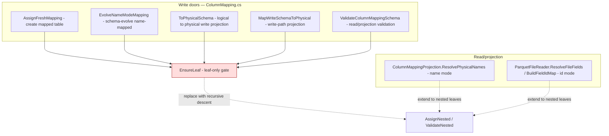
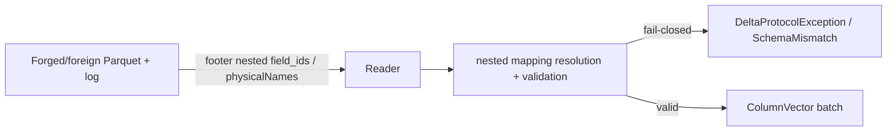

# Nested (struct/array/map) column mapping

> **Status:** Draft — **BLOCKED (round-1 RFL).** The opus-5 design council (PR #826) found #676 is blocked
> on **#713** (DeltaSharp cannot write nested Parquet), exposes a latent `BuildFieldIdMap` nested-name
> collision, and interacts with `ColumnMappingIdentity` (which relies on nested mapping being unsupported).
> This draft's synthetic-node id model (§2.2/§2.5/§9.2) is **incorrect** — Delta assigns ids to `StructField`s
> at every depth, never to array-`element`/map-`key`/`value`. Needs a re-scope to `struct<scalars>` and
> sequencing behind #713. See PR #826's review for the full findings and recommended path.
> **Issue:** [#676](https://github.com/khaines/deltasharp/issues/676) — Delta column mapping: nested
> (struct/array/map) column mapping — recursive leaf field-id/physical-name assignment + resolution
> **Author:** design-doc skill (orchestrated)
> **Reviewers:** cloud-native-distributed-systems-architect, delta-storage-format-engineer,
> reliability-test-chaos-engineer, cloud-native-security-sme, cloud-native-site-reliability-engineer,
> performance-benchmarking-engineer
> **Last Updated:** 2026-08-17
> **Related:** #191 (name-mode leaf mapping), #523/#573 (id-mode read), #572/#583 (id-mode write),
> #518/#678 (nested Array/Map footer serialization), #693 (DeltaSchemaJson→SchemaJson consolidation),
> #571/#584 (nested Parquet decode), #674 (column-mapping tamper-fuzz oracle), #675 (nested oracle —
> blocked on this). Prereqs #585/#546/#577 (deeper/edge nested support) noted as scope boundaries.

---

## 1 · Overview

Delta **column mapping** decouples a table's *logical* column names from the *physical* names/ids stored
in Parquet, so a rename or drop is a metadata-only commit (no file rewrite) and CDC/CDF reads of old
files still resolve correctly. DeltaSharp implements column mapping today **leaf-only**: every write door
and the read/projection path reject any nested (`struct`/`array`/`map`) field fail-closed via
`ColumnMapping.EnsureLeaf` (`ColumnMapping.cs`), which throws `DeltaProtocolException.Unsupported`
("nested column mapping is phased in this build … Only top-level (leaf) columns are supported").

This design lifts that restriction for **single-level** nested types: column mapping applies to the
**leaf fields of the schema tree** — Delta/Parquet assign a `field_id` + `physicalName` to every leaf,
including those inside a struct, an array element, or a map key/value. The work is **recursive descent**
over the type tree at assignment (write doors) and at resolution (read/projection, both `name` and `id`
mode), preserving every existing fail-closed invariant over the nested tree.

Why it matters: nested column mapping is a **production-feature gap** (not test debt) that blocks
column-mapped tables with complex-typed columns — a common Spark-parity shape — and is the direct
dependency of the nested CDF/column-mapping test oracle **#675**. Its prerequisites have all landed:
nested footer schema serialization (#518/#678), the shared serializer consolidation (#693), and
single-level nested Parquet decode (#571/#584).

**Requirements traceability:** EPIC-05 column mapping (`storage-delta-architecture.md` §2.9 / §2.12.3);
Spark-parity of `delta.columnMapping.mode ∈ {name, id}` for nested schemas.

**Scope boundary (explicit):** this design targets **single-level** nested — `struct` of scalars,
`array` of scalars, `map` of scalars (exactly the shapes `#571` decodes). **Nested-within-nested** column
mapping (a struct inside an array, etc.) is **deferred to depend on #585** (nested-within-nested decode,
"increment 3") and is tracked as a follow-up. Deeper/edge nested support (#546 widening, #577 nullability,
#605 bulk-consumer gating, #590 diagnostics parity) is adjacent and not required for single-level mapping.

---

## 2 · Logical Architecture

### 2.1 Where nested mapping lives



### 2.2 The invariant: mapping applies to leaves of the type tree

Column mapping assigns two pieces of metadata to **every leaf** of the schema tree:
`delta.columnMapping.id` (a JSON number, → Parquet `field_id`) and `delta.columnMapping.physicalName`
(`col-<uuid>`). Today `AssignFreshMapping` iterates only top-level `StructField`s and assigns one
`++nextId` + physical name each. Nested mapping generalizes this to a **pre-order recursive walk** of the
type tree:

- `StructType` → recurse into each `StructField` (each nested struct field is itself a leaf-or-branch).
- `ArrayType` → recurse into the **element** type (the element is an unnamed leaf-or-branch;
  Parquet/Delta assign it a field id + physical name via its synthetic `element` node).
- `MapType` → recurse into the **key** and **value** types (two synthetic leaves).
- Scalar → assign `(++maxColumnId, col-<uuid>)`.

`maxColumnId` is a single **monotonic high-water mark across the whole tree** (pre-order), matching Delta's
spec (`delta.columnMapping.maxColumnId` counts every mapped leaf, nested included).

### 2.3 Component boundaries

| Component | Responsibility | Change |
|---|---|---|
| `ColumnMapping.AssignFreshMapping` | mint id+physicalName for a fresh mapped table | replace top-level `EnsureLeaf` with recursive assignment; monotone `maxColumnId` over the tree |
| `ColumnMapping.EvolveNameModeMapping` | assign ids to *newly added* fields on schema-evolve | recursive: assign to new nested leaves; preserve existing nested leaf ids |
| `ColumnMapping.ToPhysicalSchema` / `MapWriteSchemaToPhysical` | project a logical write schema to physical | recursive relabel of nested leaves |
| `ColumnMapping.ValidateColumnMappingSchema` | read/projection validation (duplicate/missing id or physicalName, id range) | validate over the nested tree |
| `ColumnMappingProjection.ResolvePhysicalNames` | **name mode** logical→physical resolution for a projection | resolve nested-leaf physical names against the nested tree |
| `ParquetFileReader.ResolveFileFields` / `BuildFieldIdMap` | **id mode** resolve requested columns to file columns by `field_id` | build the field-id map over the footer's nested `SchemaElement` tree |
| `DeltaTableWriter.RenameColumnAsync` / `DropColumnAsync` | metadata-only nested-path rename/drop (name mode) | **in scope if tractable; else defer with a tracked issue** (see §9) |

### 2.4 Data flow — create a nested-mapped table (name mode)

```mermaid
sequenceDiagram
  participant W as Writer (create)
  participant CM as ColumnMapping.AssignFreshMapping
  participant LOG as _delta_log (metaData.schemaString)
  participant PQ as ParquetFileWriter
  W->>CM: logical schema {id: long, addr: struct of city:string, zip:long}
  CM->>CM: pre-order walk - id=1/col-a, addr=2/col-b, addr.city=3/col-c, addr.zip=4/col-d; maxColumnId=4
  CM-->>W: physical schema (nested physicalNames) + maxColumnId
  W->>LOG: commit metaData.schemaString (SchemaJson, nested metadata) + config maxColumnId
  W->>PQ: write physical schema; id mode also stamps field_id on each nested leaf
```

### 2.5 Plan/data model

- **Type tree walk** is a pure function `Assign(DataType, ref long maxId, IPhysicalNameSource) → DataType`
  producing a metadata-annotated copy; no mutation of the input (plan-node immutability).
- **Resolution** is the inverse: a physical→logical (read) or logical→physical (write) relabel walk over
  the paired logical/physical trees, keyed by nested position (struct field name / `element` / `key` /
  `value`), matching on the mapping metadata carried in `FieldMetadata` at each leaf.
- **Field-id map (id mode):** `BuildFieldIdMap` already correlates footer `SchemaElement.field_id` with
  decoded `DataField`s by physical name for the flat case; extend the correlation to the footer's nested
  element tree (the `element`/`key`/`value` synthetic nodes carry their own `field_id`).

### 2.6 API surface

No public API change: column mapping is configured via table properties
(`delta.columnMapping.mode`) and exercised through the existing write/read doors. The change is entirely
in the internal `DeltaSharp.Storage` mapping/resolution layer. The only externally-visible behavior change
is that a create/evolve/read of a **nested-typed** column-mapped table **succeeds** where it previously
failed closed with `DeltaProtocolException.Unsupported`.

### 2.7 Dependencies

| Dependency | State | Role |
|---|---|---|
| #518/#678 nested footer schema serialization | **landed** | footer schema string matches the log for nested types |
| #693 DeltaSchemaJson→SchemaJson consolidation | **landed** | one serializer; harness == production |
| #571/#584 nested Parquet decode | **landed** | struct/array/map of scalar decode into nested `ColumnVector` |
| typed nested field metadata (§2.12.3 / #330) | **landed** | `FieldMetadata` carries `delta.columnMapping.id`/`physicalName` on nested leaves |
| #585 nested-within-nested decode | **open** | **scope boundary** — deferred follow-up |

### 2.8 Tenant/storage-backend considerations

Mapping is a pure metadata/schema transform independent of the storage backend; it works identically on
object-store and PVC backends. No new I/O; the field-id correlation reads only the Parquet footer already
opened by the reader.

---

## 3 · Functional Test Scenarios

Oracle: a nested-mapped table round-trips (write → read) with the same logical values, and a **logical
rename/drop of a nested field never rewrites the file** yet still reads correctly (the point of mapping).

**Happy path**
1. **Create + read, name mode** — `struct<city:string, zip:long>`, `array<string>`, `map<string,long>`
   each get nested-leaf physical names; write physical Parquet; read back by logical schema → identical
   values. Assert `maxColumnId` counts every nested leaf (pre-order).
2. **Create + read, id mode** — same shapes; each nested leaf's `field_id` is stamped in the footer;
   read resolves nested leaves by `field_id` after a logical rename (read-through, no rewrite).
3. **Schema-evolve** — add a new nested field to an existing nested-mapped table; only the new leaf gets a
   fresh id/physicalName; existing nested-leaf ids are preserved; `maxColumnId` advances monotonically.

**Edge / error (fail-closed preserved over the nested tree)**
4. **Duplicate physicalName / duplicate field_id at a nested leaf** → `SchemaMismatch`/`Unsupported`,
   fail-closed (extends the #674 tamper-fuzz surface to nested leaves).
5. **Missing id or physicalName on a nested leaf** of a mapped tree → fail-closed.
6. **field_id out of `[1, int.MaxValue]`** at a nested leaf → fail-closed (mirrors the leaf-level guard).
7. **A nested leaf declared in the log absent from the footer's nested tree** (id mode) → fail-closed,
   never silently name-matched (mirrors `DeclaredIdAbsentFromFooter_FailsClosed`).
8. **Nested-within-nested** (a struct inside an array) → still fail-closed `Unsupported` with a message
   naming #585 (explicit scope boundary; not silently mis-mapped).

**Integration boundaries**
9. CDF/CDC read of an old file after a nested-field logical rename resolves via the mapping (the #675
   oracle's concrete dependency — this design unblocks it).
10. `none`/`name`/`id` mode parity: a `none`-mode nested table and a non-nested mapped table are byte- and
    behavior-unchanged (regression).

**Acceptance criteria mapping (from #676):** AC-assignment → §3.1–3.3; AC-resolution → §3.1,3.2,3.7;
AC-rename/drop → §3.9 (or deferred per §9); AC-fail-closed-invariants → §3.4–3.8.

---

## 4 · Performance

- **Workload:** schema-transform only, at commit and at read-open — O(number of schema leaves), typically
  tens of fields. No per-row cost; no extra I/O (field-id correlation reads the already-open footer).
- **Targets:** assignment/resolution add < 1% to a create/read-open on a realistic wide-nested schema;
  zero allocation per data row (the mapping walk runs once per schema, not per batch).
- **Memory:** one metadata-annotated schema copy per transform (bounded by schema size), no pooling needed.
- **Regression gate:** a micro-benchmark on a 50-leaf nested schema for assign + resolve stays within the
  existing schema-transform noise floor; the per-batch decode path is untouched (mapping resolves to the
  same physical `DataField`s the decoder already produces).

---

## 5 · Security

- **Data classification:** column-mapping metadata (`id`, `physicalName`) is table schema metadata (not
  user data); Parquet `field_id`s and physical names are non-sensitive. No PII flows through the mapping
  layer.
- **Input validation (the crux):** the footer schema and the Delta log `metaData.schemaString` are
  **attacker-influenced** (a forged/foreign file). Every fail-closed invariant that protects the flat case
  MUST extend to the nested tree: duplicate/missing id or physicalName, id-range, and — critically — the
  **physical↔logical relabel** must be validated over the nested tree so a forged nested mapping cannot
  cause a **silent mis-attribution of column data** (reading column B's bytes as column A). This is the
  same data-integrity threat the CDF pre-range identity gate guards at the table level; here it is at the
  nested-leaf level.
- **Fail-closed over fallback:** id-mode resolution must never silently fall back to name-matching a nested
  leaf whose declared id is absent from the footer (mirrors the flat `DeclaredIdAbsent…FailsClosed` tests).
- **Supply-chain:** no new dependencies; Parquet.Net field-id read/write already in use (#523).

---

## 6 · Threat Model



| STRIDE | Surface | Threat | Mitigation |
|---|---|---|---|
| **Tampering** | footer nested `field_id`/physicalName vs log | forged nested mapping → **column data mis-attribution** (read B as A) | validate the physical↔logical relabel over the nested tree; duplicate/missing/range fail-closed; extend #674 tamper-fuzz to nested leaves |
| **Spoofing** | id-mode nested leaf | declared id absent from footer → silent name fallback | fail-closed; never name-match an id-declared nested leaf |
| **Info disclosure** | error messages | leaking nested field bytes/paths in diagnostics | reuse `DiagnosticText.Sanitize`; no decoded bytes in messages (per #653/#663) |
| **DoS** | deeply/widely nested schema | unbounded recursion / allocation | single-level scope bounds depth to 1; schema size is metadata-bounded; nested-within-nested rejected fail-closed (defer #585) |

**Residual:** nested-within-nested mapping is out of scope (fail-closed, tracked #585). No data-integrity
residual for single-level once the relabel is validated over the tree.

---

## 7 · Observability

- **Logging:** the fail-closed rejections already log via the sanitized `DeltaProtocolException` path; add
  the nested field **path** (sanitized, e.g. `addr.zip`) to the mapping-violation message so an operator
  can locate the offending leaf. No new log site on the happy path (mapping is silent when valid).
- **Metrics:** none required — mapping is a schema transform with no runtime hot path; the existing
  commit/read activity spans already cover the operations.
- **Correlation:** mapping violations surface under the existing table-path/version fields on the read/
  commit activity.

---

## 8 · Rollout & Risk

- **Rollout:** pure additive capability behind the existing `delta.columnMapping.mode` gate — a table only
  exercises nested mapping if it declares a nested-typed column *and* enables mapping. Existing
  leaf-only, `none`, and non-nested tables are byte/behavior-unchanged (regression-gated).
- **Kill-switch:** the change is the removal of a fail-closed gate for the single-level nested case; if a
  defect is found, the gate can be reinstated (revert) with no data written under the new path being
  unreadable (physical names/ids are self-describing in the footer/log).
- **Risk register:** (a) mis-mapping a nested leaf → **data mis-attribution** — mitigated by §6 validation
  + oracle #675; (b) `maxColumnId` non-monotonicity on evolve → id reuse — mitigated by the single
  high-water counter + tests; (c) nested-within-nested accidentally allowed → mitigated by an explicit
  fail-closed boundary test (§3.8).
- **Launch checklist:** unit + integration (§3) green on both TFMs; `dotnet format`; determinism ban;
  DCO; RFL PASS; #675 unblocked; nested-within-nested follow-up filed.

---

## 9 · Open Questions & Decisions

1. **Rename/drop of nested fields (name mode).** Is metadata-only nested-path rename/drop
   (`DeltaTableWriter.RenameColumnAsync`/`DropColumnAsync`) in scope for this PR, or a fast follow-up?
   **Proposed:** include *drop* (structurally simpler — remove a nested leaf's mapping entry) and *rename*
   if the path-addressing is tractable; otherwise defer rename with a tracked issue. Decide during impl.
2. **`element`/`key`/`value` physical naming.** Confirm the synthetic array-element / map-key/value nodes
   receive their own `col-<uuid>` physical name + id (Spark assigns ids to these synthetic leaves).
   **Proposed:** yes — mirror Spark; verify against a reference fixture.
3. **Nested-within-nested boundary.** Confirmed **out of scope** (defer #585); file the follow-up before
   PASS (RFL deferrals require a verified-open issue).

---

## 10 · References

- Issue [#676](https://github.com/khaines/deltasharp/issues/676); blocks [#675](https://github.com/khaines/deltasharp/issues/675).
- `docs/engineering/design/storage-delta-architecture.md` §2.9 / §2.12.3 (column-mapping field-ids +
  phasing), §9.1 D-6 / §9.2 OQ-11 (typed field metadata / `SchemaJson` consolidation).
- Code anchors: `ColumnMapping.EnsureLeaf` / `AssignFreshMapping` / `ValidateColumnMappingSchema` /
  `ToPhysicalSchema` / `MapWriteSchemaToPhysical` (`src/DeltaSharp.Storage/Delta/ColumnMapping.cs`);
  `ColumnMappingProjection.ResolvePhysicalNames` (`ColumnMappingProjection.cs`);
  `ParquetFileReader.ResolveFileFields` / `BuildFieldIdMap` (`src/DeltaSharp.Storage/Parquet/ParquetFileReader.cs`).
- Related PRs: #573/#583 (id mode), #678 (#518), #693 (serializer consolidation), #584 (#571 nested decode),
  #674 (tamper-fuzz oracle).
