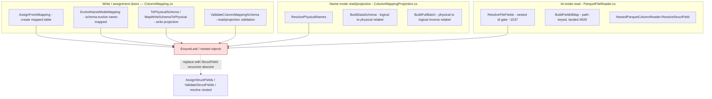
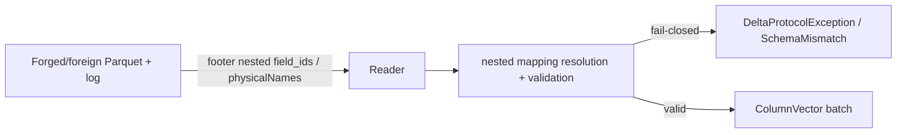

# Nested (struct/array/map) column mapping

> **Status:** Draft — **round-2 (revised).** The round-1 opus-5 design council (PR #826) surfaced three
> hard blockers and one modelling error; **all three blockers are now cleared** and the model is corrected:
> (1) DeltaSharp could not **write** nested Parquet — now **viable** on Parquet.Net 6.1.0 via the public
> `ParquetRowGroupWriter.WriteAllPartsAsync` primitive, designed in **#834** (RFL PASS); (2) the latent
> `BuildFieldIdMap` nested-name collision is **fixed and merged** (#829 → PR #836, footer↔leaf correlation
> keyed by physical *path*); (3) the `ColumnMappingIdentity` interaction is **fixed and merged** (#830 →
> PR #835, structured `ColumnPathKey`). The round-1 **id-model error is corrected here (C1):** column
> mapping assigns `delta.columnMapping.{id,physicalName}` to **`StructField`s at every depth** and **never**
> to array-`element`/map-`key`/map-`value` nodes (DeltaSharp's `SchemaJson` has **no metadata slot** for
> those nodes — `SchemaJson.cs` `WriteType`). Corollary: **`struct<…>` is the only recursive shape**;
> `array<scalar>` and `map<scalar>` need no inner assignment.
>
> **Issue:** [#676](https://github.com/khaines/deltasharp/issues/676) — Delta column mapping: nested
> (struct/array/map) column mapping — recursive `StructField` field-id/physical-name assignment + resolution.
> **Author:** design-doc skill (orchestrated).
> **Reviewers:** cloud-native-distributed-systems-architect, delta-storage-format-engineer,
> reliability-test-chaos-engineer, cloud-native-security-sme, cloud-native-site-reliability-engineer,
> performance-benchmarking-engineer.
> **Last Updated:** 2026-08-19.
> **Related:** #191 (name-mode leaf mapping), #523/#573 (id-mode read), #572/#583 (id-mode write),
> #518/#678 (nested Array/Map footer serialization), #693 (`DeltaSchemaJson`→`SchemaJson` consolidation),
> #571/#584 (nested Parquet decode), #674 (column-mapping tamper-fuzz oracle), #675 (nested oracle —
> blocked on this), **#828/#834 (nested Parquet write — dependency for the write-path round-trip)**,
> **#829/#836 & #830/#835 (landed prerequisites)**. Prereqs #585/#546/#577 (deeper/edge nested support)
> are scope boundaries.

---

## 1 · Overview

Delta **column mapping** decouples a table's *logical* column names from the *physical* names/ids stored
in Parquet, so a rename or drop is a metadata-only commit (no file rewrite) and CDC/CDF reads of old files
still resolve correctly. DeltaSharp implements column mapping today **leaf-only**: every write door and the
read/projection path reject any nested (`struct`/`array`/`map`) field fail-closed —
`ColumnMapping.EnsureLeaf` (`ColumnMapping.cs`), `ColumnMappingProjection.ResolvePhysicalNames`
(name-mode, `ColumnMappingProjection.cs:41`), and `ParquetFileReader.ResolveFileFields` (id-mode,
`ParquetFileReader.cs:~1537`) all throw `DeltaProtocolException.Unsupported` /
`DeltaStorageException.UnsupportedFeature` ("nested column mapping is phased in this build … Only
top-level (leaf) columns are supported").

This design lifts that restriction for **single-level** nested types by applying column mapping to the
schema's **`StructField`s at every depth**. The correct model (see §2.2) is:

- **`struct<scalars>`** — the container column *and each scalar child* are `StructField`s; each is assigned
  its own `(id, physicalName)`. This is **the only recursive shape.**
- **`array<scalar>`, `map<scalar,scalar>`** — only the **top-level column** is a `StructField`; it is
  assigned `(id, physicalName)`. The `element`/`key`/`value` nodes are **not** `StructField`s and carry
  **no** mapping metadata (DeltaSharp's `SchemaJson` has no slot for them — §2.2). They need **no** inner
  assignment; the container is remapped as a unit and its interior resolves structurally.

Why it matters: nested column mapping is a **production-feature gap** (not test debt) that blocks
column-mapped tables with complex-typed columns — a common Spark-parity shape — and is the direct
dependency of the nested CDF/column-mapping test oracle **#675**.

**Requirements traceability:** EPIC-05 column mapping (`storage-delta-architecture.md` §2.9 / §2.12.3);
Spark-parity of `delta.columnMapping.mode ∈ {name, id}` for nested schemas.

**Scope boundary (explicit):** single-level nested — `struct` of scalars, `array` of scalars,
`map` of scalars (exactly the shapes `#571` decodes and `#834` writes). **Nested-within-nested** column
mapping (a struct inside an array, a struct field that is itself a struct, etc.) is **deferred to #585**
and rejected fail-closed with a message naming #585. Deeper/edge nested support (#546 widening, #577
nullability, #605 bulk-consumer gating, #590 diagnostics parity) is adjacent and not required here.

---

## 2 · Logical Architecture

### 2.1 Where nested mapping lives



### 2.2 The invariant (CORRECTED — C1): mapping attaches to `StructField`s, never to element/key/value

Column mapping assigns two pieces of metadata — `delta.columnMapping.id` (a JSON number → Parquet
`field_id`) and `delta.columnMapping.physicalName` (`col-<uuid>`) — to **every `StructField`** in the
schema tree, and **only** to `StructField`s.

This is a hard property of DeltaSharp's schema serialization, not a convention: in `SchemaJson.WriteType`
(`src/DeltaSharp.Abstractions/SchemaJson.cs`) the `metadata` object is emitted **only** for a
`StructField` inside a `StructType` (the branch that writes `name`/`type`/`nullable`/`metadata`). The
`ArrayType.elementType`, `MapType.keyType`, and `MapType.valueType` branches call `WriteType` on the raw
inner **type** — there is **no metadata slot**, so an `id`/`physicalName` cannot be represented there.
DeltaSharp does **not** implement Delta's `delta.columnMapping.nested.ids` extension (which is how upstream
Spark assigns ids to non-`StructField` array/map inner nodes); adding it is out of scope.

Therefore the assignment walk is a **pre-order recursion over `StructField`s only**:

- **`StructType`** → for each child `StructField`, assign `(++maxColumnId, col-<uuid>)`, then recurse into
  the child's `DataType` (a nested `StructType` recurses further; an `ArrayType`/`MapType`/scalar does
  not — see below). *This is the only recursive case.*
- **`ArrayType` / `MapType`** column → the column is itself a `StructField` (already assigned by its
  parent `StructType` step). Its `element`/`key`/`value` are **not** `StructField`s → **no descent, no
  inner id/physicalName.**
- **Scalar** `StructField` → already assigned by its parent step; terminal.

**`maxColumnId`** is a single **monotonic high-water mark** advanced once per assigned `StructField`
(pre-order), matching `delta.columnMapping.maxColumnId`. Because ids are minted only for `StructField`s,
`maxColumnId` counts `StructField`s — **not** array/map inner nodes.

**Uniqueness scopes (H5 — corrected):**
- **`id`**: **globally unique** across the whole table tree (Delta requires a globally-unique
  `delta.columnMapping.id`; `ValidateColumnMappingSchema` already enforces global id uniqueness and the
  `maxColumnId` ceiling — extend the walk over nested `StructField`s).
- **`physicalName`**: unique **per struct level** (per set of sibling `StructField`s) — the physical Parquet
  path is `<parentPhysical>.<childPhysical>`, so uniqueness among siblings is sufficient and matches how
  the reader addresses a child within its parent group. (Global physicalName uniqueness is *not* required
  and *not* assumed.)
- **path-safety** (the `.`/control-char physical-name checks in `ValidateColumnMappingSchema`) currently
  guards top-level names; it must apply at **every struct level** so a nested `physicalName` cannot smuggle
  a path separator that would forge a different physical address.

### 2.3 Component boundaries

| Component | File | Change |
|---|---|---|
| `ColumnMapping.AssignFreshMapping` | `ColumnMapping.cs` | replace top-level `EnsureLeaf` with the §2.2 `StructField`-recursive assignment; single monotone `maxColumnId`; assign only `struct` children, never element/key/value |
| `ColumnMapping.EvolveNameModeMapping` | `ColumnMapping.cs` | recursive: mint ids/physicalNames for **newly-added** nested `StructField`s only; **preserve** every existing nested `StructField`'s id/physicalName (no reuse) |
| `ColumnMapping.ToPhysicalSchema` / `MapWriteSchemaToPhysical` | `ColumnMapping.cs` | recursive logical→physical relabel of a **struct's child** `StructField` names; carry array/map columns through as a unit |
| `ColumnMapping.ValidateColumnMappingSchema` | `ColumnMapping.cs` | validate id/physicalName presence, positivity, `maxColumnId` ceiling, **global id uniqueness** and **per-level physicalName uniqueness** over the nested `StructField` tree; per-level path-safety |
| `ColumnMappingProjection.ResolvePhysicalNames` | `ColumnMappingProjection.cs:41` | drop the nested reject; return the **top-level** physical name for every column (the interior is relabelled by `BuildDataSchema`, below) |
| `ColumnMappingProjection.BuildDataSchema` | `ColumnMappingProjection.cs:73` | **recursive** relabel: currently renames only the top-level field (carries `field.DataType` verbatim, leaving nested children with **logical** names). Must recurse into `struct` children, substituting each child's `physicalName`; array/map interior carried verbatim |
| `ColumnMappingProjection.BuildFullBatch` | `ColumnMappingProjection.cs:~123` | **inverse** relabel on read: map physical nested `StructField` names back to logical names when reconstructing the batch/schema |
| `ParquetFileReader.ResolveFileFields` | `ParquetFileReader.cs:~1537` | **lift the id-mode nested reject** for the single-level shapes; resolve per §2.5 (struct children by `field_id`; array/map column by id + structural descent) |
| `ParquetFileReader.BuildFieldIdMap` | `ParquetFileReader.cs:452` | **already** footer↔leaf path-keyed (#829, landed) — the substrate the nested id-mode resolution depends on. No further change beyond consuming it for nested leaves |
| `NestedParquetColumnReader.ResolveStructField` | `NestedParquetColumnReader.cs:~118` | make child resolution **duplicate-intolerant**: today it takes the **first** name match and `break`s (`ResolveStructField`) — a forged file with two identically-named children silently binds the first. Reject on duplicate resolved child name (fail-closed) |
| `DeltaTableWriter.RenameColumnAsync` / `DropColumnAsync` | write API | metadata-only nested-path rename/drop — **in scope if tractable; else defer with a tracked issue** (see §9) |

### 2.4 Data flow — create a nested-mapped table (name mode)

```mermaid
sequenceDiagram
  participant W as Writer (create)
  participant CM as ColumnMapping.AssignFreshMapping
  participant LOG as _delta_log (metaData.schemaString)
  participant PQ as ParquetFileWriter (#834 nested write)
  W->>CM: logical schema {id:long, addr:struct<city:string,zip:long>, tags:array<string>}
  CM->>CM: pre-order StructField walk - id=1/col-a, addr=2/col-b, addr.city=3/col-c, addr.zip=4/col-d, tags=5/col-e; maxColumnId=5
  Note over CM: array element gets NO id/physicalName (not a StructField)
  CM-->>W: physical schema (nested struct childs relabelled) + maxColumnId=5
  W->>LOG: commit metaData.schemaString (SchemaJson - metadata on StructFields only) + config maxColumnId
  W->>PQ: write physical schema; id mode stamps field_id on each StructField-owned leaf
```

### 2.5 Resolution model

**Name mode.** `ResolvePhysicalNames` returns the top-level physical name per column; `BuildDataSchema`
recursively substitutes each `struct` child's `physicalName` into the physical write schema; `BuildFullBatch`
performs the inverse on read. Array/map columns are relabelled only at the top-level `StructField`; their
`element`/`key`/`value` keep their canonical Parquet structure and resolve **structurally**
(`NestedParquetColumnReader`), not by physical name.

**Id mode.** Parquet `field_id`s live on **leaves** (Parquet.Net exposes no settable `field_id` on a
container/group node — verified against 6.1.0 in the #834 spike). The write door stamps each leaf's
`field_id` = the **id of the `StructField` that owns that leaf's logical identity**:

- **top-level scalar** — leaf = column; `field_id` = column id (today's behavior, unchanged).
- **`struct<scalars>`** — each scalar child is its own `StructField`; its leaf carries that child's
  `field_id`. Read resolves **each child leaf by `field_id`** via the path-keyed `BuildFieldIdMap` (#829),
  then reassembles the struct from its resolved children. The struct **container** has no `field_id` and is
  bound by its parent linkage + `physicalName` (not by an invented container id). **This is the fully
  id-correlated nested shape.**
- **`array<scalar>` / `map<scalar>`** — the interior nodes are not `StructField`s and carry no independent
  logical id. Id mode resolves the **top-level column** by its `field_id`, correlated to the footer
  container that encloses the id-stamped leaf, then reconstructs the container **structurally** (positional
  `element`/`key`/`value`) — **never** by an invented inner id. To keep this unambiguous and fail-closed:
  the column's id is stamped on the container's **primary** leaf only, and the reconstructed structural
  shape MUST match the requested type or the read fails closed. For `map<scalar>` the key/value are
  resolved positionally under the id-matched column (two leaves cannot share one `field_id`, so neither
  key nor value is bound by id — only the column is).

This split is a direct consequence of C1: only `struct<scalars>` has per-leaf `StructField` ids, so only it
gets per-leaf id correlation; `array`/`map` are id-correlated **at the column** and structural inside.

### 2.6 Plan/data model

- The assignment walk is a pure function `Assign(StructType, ref long maxId, IPhysicalNameSource) →
  StructType` producing a metadata-annotated **copy** (plan-node immutability; no input mutation).
- Resolution is the inverse relabel over the paired logical/physical trees, keyed by struct-field position;
  array/map interiors match structurally.
- The id-mode field map is `BuildFieldIdMap` (path-keyed, #829) consumed for `struct` child leaves; the
  fail-closed duplicate/orphan guards landed with #829/#836 (footer↔decoder bijection) protect the nested
  correlation from forged footers.

### 2.7 API surface

No public API change. Column mapping is configured via table properties (`delta.columnMapping.mode`) and
exercised through the existing write/read doors. The only externally-visible change is that a
create/evolve/read of a **nested-typed** column-mapped table **succeeds** where it previously failed closed.

### 2.8 Dependencies

| Dependency | State | Role |
|---|---|---|
| #829 `BuildFieldIdMap` physical-path keying + footer↔decoder bijection | **MERGED** (PR #836, `main`) | correlation substrate for id-mode struct-child leaves; forged-footer fail-closed |
| #830 `ColumnMappingIdentity` structured `ColumnPathKey` | **MERGED** (PR #835, `main`) | CDF immutability gate no longer relies on nested mapping being unsupported (H6) |
| #828 nested Parquet **write** (`WriteAllPartsAsync`) | **design PASS** (PR #834) | authors nested physical Parquet for the write→read round-trip; **implementation is the sequencing dependency** for the write-path tests |
| #518/#678 nested footer schema serialization | landed | footer schema string matches the log for nested types |
| #693 `DeltaSchemaJson`→`SchemaJson` consolidation | landed | one serializer; harness == production |
| #571/#584 nested Parquet decode | landed | struct/array/map-of-scalar decode into nested `ColumnVector` |
| #585 nested-within-nested decode | **open** | **scope boundary** — deferred follow-up |

**Sequencing note.** #676's *read/resolution* logic and *name-mode* round-trip can be tested with
`ParquetSerializer`-authored fixtures exactly as the existing nested-read tests do
(`tests/…/ParquetTestHelpers.cs`). The **production write-path** round-trip depends on the #828/#834
nested writer being **implemented**; until then the write-path scenarios (§3.1–3.3 write half) use the
serializer-authored fixtures and the production-writer assertions are gated behind #828 landing.

### 2.9 Tenant/storage-backend considerations

Mapping is a pure metadata/schema transform independent of the storage backend; it works identically on
object-store and PVC backends. No new I/O; the field-id correlation reads only the Parquet footer already
opened by the reader.

---

## 3 · Functional Test Scenarios

Oracle: a nested-mapped table round-trips (write → read) with the same logical values, and a **logical
rename/drop of a nested `struct` field never rewrites the file** yet still reads correctly (the point of
mapping). The oracle pairs the **log** side `(physicalName, id)` per `StructField` with the **footer** side
`(path, field_id)` per leaf and asserts the pairing is a bijection over `struct` leaves; array/map
containers pair at the column with structural interior.

**Happy path**
1. **Create + read, name mode** — `struct<city:string, zip:long>`, `array<string>`, `map<string,long>`.
   The struct's two children each get a per-level-unique physical name; the array/map columns get one
   top-level physical name and **no** inner metadata. Write → read by logical schema → identical values.
   Assert `maxColumnId == 5` for `{id, addr:struct<city,zip>, tags:array}` (counts `StructField`s only:
   id, addr, addr.city, addr.zip, tags — **not** the array element).
2. **Create + read, id mode** — same shapes. Each `struct` child leaf's `field_id` is stamped and read
   resolves it by `field_id` after a logical rename (read-through, no rewrite). Array/map resolve at the
   column by id + structural interior.
3. **Schema-evolve (name mode)** — add a new field to an existing nested `struct`; only the **new** child
   `StructField` gets a fresh id/physicalName; existing nested ids/physicalNames are preserved;
   `maxColumnId` advances monotonically (no reuse of a dropped id).

**Same-typed-sibling reversed-order oracle (mis-attribution defense)**
4. `struct<a:long, b:long>` where the file stores the two `long` leaves in **reversed physical order**.
   Name mode must bind by `physicalName` (not position) and id mode by `field_id` (not position) — a
   reversed footer must still read `a`→`a`, `b`→`b`, or fail closed. Same for `map<long,long>` key vs
   value ordering. (Catches positional mis-binding — the core mis-attribution threat at the nested level.)

**Per-door fail-closed matrix** (each door rejects, never silently mis-maps)
5. **Duplicate `physicalName` among sibling `struct` children** → `SchemaMismatch`/`Unsupported`
   (`ValidateColumnMappingSchema` + duplicate-intolerant `ResolveStructField`).
6. **Duplicate `field_id`** anywhere in the tree → fail-closed (`BuildFieldIdMap` dup guard, #829).
7. **Missing `id` or `physicalName` on a nested `StructField`** of a mapped tree → fail-closed.
8. **`field_id` outside `[1, int.MaxValue]`** at a nested leaf → fail-closed.
9. **A nested `struct` child declared in the log but absent from the footer** (id mode) → fail-closed,
   never silently name-matched (mirrors `DeclaredIdAbsentFromFooter_FailsClosed`).
10. **Foreign-written read path** — a footer whose nested structure disagrees with the log (extra/missing
    child, re-parented leaf) → rejected by the #829 footer↔decoder bijection + duplicate-intolerant child
    resolution; no cross-column substitution.
11. **Nested-within-nested** (a struct inside an array/struct) → fail-closed `Unsupported` naming **#585**
    (explicit scope boundary; never silently mis-mapped).

**Metadata-only no-rewrite + integration**
12. **Rename/drop a nested `struct` child (name mode) does not rewrite the file** — assert the Parquet file
    bytes/`AddFile` are unchanged and the read still resolves via the mapping (the whole point of mapping;
    the concrete dependency of oracle #675).
13. **`none`/`name`/`id` mode parity** — a `none`-mode nested table and a non-nested mapped table are byte-
    and behavior-unchanged (regression).

**Seeded property harness**
14. A seeded generator over `{struct<scalars>, array<scalar>, map<scalar,scalar>}` (single level, random
    sibling order, random rename/drop sequences) asserts round-trip identity or fail-closed for every draw
    — extends the #674 tamper-fuzz surface to nested `StructField`s.

**Acceptance criteria mapping (from #676):** AC-assignment → §3.1–3.3; AC-resolution → §3.1,3.2,3.4,3.9;
AC-rename/drop → §3.12 (or deferred per §9); AC-fail-closed-invariants → §3.4–3.11,3.14.

---

## 4 · Performance

- **Workload:** schema-transform only, at commit and at read-open — O(number of schema `StructField`s),
  typically tens of fields. No per-row cost; no extra I/O (field-id correlation reads the already-open
  footer).
- **Targets:** assignment/resolution add < 1% to a create/read-open on a realistic wide-nested schema;
  zero allocation per data row (the mapping walk runs once per schema, not per batch).
- **Memory:** one metadata-annotated schema copy per transform (bounded by schema size); a bounded-depth
  recursion (single-level nested → recursion depth ≤ 2; the deeper reject is a fail-closed constant).
- **Regression gate:** a micro-benchmark on a 50-`StructField` nested schema for assign + resolve stays
  within the schema-transform noise floor; the per-batch decode path is untouched.

---

## 5 · Security

- **Data classification:** column-mapping metadata (`id`, `physicalName`) is table schema metadata (not
  user data); Parquet `field_id`s and `col-<uuid>` names are non-sensitive. No PII flows through the layer;
  fail-closed messages carry only sanitized nested **paths** (`DiagnosticText.Sanitize`), never decoded
  bytes or raw foreign field names.
- **Input validation (the crux):** the footer schema and the log `metaData.schemaString` are
  **attacker-influenced** (a forged/foreign file). Every fail-closed invariant that protects the flat case
  MUST extend over the nested `StructField` tree: duplicate/missing id or physicalName, id range,
  `maxColumnId` ceiling, **global id uniqueness**, **per-level physicalName uniqueness**, per-level
  path-safety, and — critically — the physical↔logical relabel and the footer↔log pairing must be validated
  so a forged nested mapping cannot cause a **silent mis-attribution of column data** (reading column B's
  bytes as column A). The #829 footer↔decoder bijection and the duplicate-intolerant `ResolveStructField`
  (§2.3) are the enforcement points.
- **Fail-closed over fallback:** id-mode resolution must never silently fall back to name-matching a nested
  `struct` child whose declared id is absent from the footer (mirrors `DeclaredIdAbsent…FailsClosed`); the
  array/map structural descent must never bind a leaf whose reconstructed shape disagrees with the request.
- **Supply-chain:** no new dependencies; Parquet.Net field-id read/write already in use (#523); nested
  write via the public 6.1.0 `WriteAllPartsAsync` (#834), no vendored fork.

---

## 6 · Threat Model



| STRIDE | Surface | Threat | Mitigation |
|---|---|---|---|
| **Tampering** | footer nested `field_id`/physicalName vs log | forged nested mapping → **column data mis-attribution** (read B as A) | validate physical↔logical relabel + footer↔log pairing over the `StructField` tree; global-id + per-level-physicalName uniqueness; #829 bijection; duplicate-intolerant `ResolveStructField`; extend #674 tamper-fuzz to nested |
| **Spoofing** | id-mode nested `struct` child | declared id absent from footer → silent name fallback | fail-closed; never name-match an id-declared nested child |
| **Elevation/Confusion** | array/map structural descent | reconstructed shape ≠ requested → wrong interior read | shape must match requested type or fail closed (§2.5) |
| **Info disclosure** | error messages | leaking nested field bytes/paths | `DiagnosticText.Sanitize`; sanitized path only; no decoded bytes (#653/#663) |
| **DoS** | deeply/widely nested schema | unbounded recursion / allocation | single-level scope → recursion depth ≤ 2; deeper rejected fail-closed (#585); schema size is metadata-bounded |

**Residual:** nested-within-nested mapping is out of scope (fail-closed, tracked #585). No data-integrity
residual for single-level once the relabel + pairing are validated over the `StructField` tree.

---

## 7 · Observability

- **Logging:** the fail-closed rejections already log via the sanitized `DeltaProtocolException` /
  `DeltaStorageException` path; add the **sanitized nested path** (e.g. `addr.zip`) to the mapping-violation
  message so an operator can locate the offending `StructField`. No new log site on the happy path.
- **Metrics:** none required — mapping is a schema transform with no runtime hot path; existing
  commit/read activity spans cover the operations.
- **Correlation:** mapping violations surface under the existing table-path/version fields on the
  read/commit activity.

---

## 8 · Rollout & Risk

- **Rollout:** pure additive capability behind the existing `delta.columnMapping.mode` gate — a table
  exercises nested mapping only if it declares a nested-typed column *and* enables mapping. Existing
  leaf-only, `none`, and non-nested tables are byte/behavior-unchanged (regression-gated §3.13).
- **Kill-switch:** the change removes a fail-closed gate for the single-level nested case; if a defect is
  found, the gate is reinstated (revert). Data written under the new path stays readable — physical
  names/ids are self-describing in the footer/log.
- **Risk register:** (a) mis-mapping a nested `StructField` → **data mis-attribution** — mitigated by §6 +
  oracle #675 + #829 bijection; (b) `maxColumnId` non-monotonicity on evolve → id reuse — mitigated by the
  single high-water counter + §3.3; (c) nested-within-nested accidentally allowed → mitigated by the
  explicit fail-closed boundary test (§3.11); (d) array/map structural interior mis-bound → §2.5 shape
  match + §3.4.
- **Launch checklist:** unit + integration (§3) green on both TFMs; `dotnet format`; determinism ban; DCO;
  RFL PASS; #675 unblocked; nested-within-nested follow-up (#585) verified open.

---

## 9 · Open Questions & Decisions

1. **Rename/drop of nested `struct` fields (name mode).** Is metadata-only nested-path rename/drop
   (`DeltaTableWriter.RenameColumnAsync`/`DropColumnAsync`) in scope for this PR, or a fast follow-up?
   **Proposed:** include *drop* (structurally simpler — remove a child `StructField`'s mapping entry) and
   *rename* if the path-addressing is tractable; otherwise defer *rename* with a tracked issue. Decide
   during impl; §3.12 gates whichever lands.
2. **`element`/`key`/`value` ids — RESOLVED (C1).** These nodes get **no** `id`/`physicalName` (no
   `SchemaJson` metadata slot; `nested.ids` not implemented). Only `StructField`s are assigned. This
   supersedes the round-1 draft's synthetic-leaf model.
3. **Array/map id-mode interior — RESOLVED (§2.5).** The column is id-correlated; the interior is
   reconstructed structurally with a shape-match fail-closed guard. `map<scalar>` binds only the column by
   id (key/value positional). No invented inner id.
4. **Write-path sequencing.** Production write-path round-trip depends on #828/#834 nested-writer
   **implementation**; until then §3 write scenarios use `ParquetSerializer`-authored fixtures (as the
   nested-read tests do) and the production-writer assertions are gated on #828 landing.
5. **Nested-within-nested boundary.** Confirmed **out of scope** (defer #585); the follow-up must be
   verified open before PASS (RFL deferrals require a verified-open issue).

---

## 10 · References

- Issue [#676](https://github.com/khaines/deltasharp/issues/676); blocks [#675](https://github.com/khaines/deltasharp/issues/675).
- `docs/engineering/design/storage-delta-architecture.md` §2.9 / §2.12.3 (column-mapping field-ids +
  phasing), §9.1 D-6 / §9.2 OQ-11 (typed field metadata / `SchemaJson` consolidation).
- `docs/engineering/design/nested-parquet-write.md` (#834) — the nested Parquet write design this builds on.
- Code anchors — `src/DeltaSharp.Storage/Delta/ColumnMapping.cs`: `EnsureLeaf`, `AssignFreshMapping`,
  `EvolveNameModeMapping`, `ToPhysicalSchema` / `MapWriteSchemaToPhysical`, `ValidateColumnMappingSchema`.
  `src/DeltaSharp.Storage/Delta/ColumnMappingProjection.cs`: `ResolvePhysicalNames` (`:41`),
  `BuildDataSchema` (`:73`), `BuildFullBatch` (`:~123`).
  `src/DeltaSharp.Storage/Parquet/ParquetFileReader.cs`: `ResolveFileFields` (nested id gate `~1537`),
  `BuildFieldIdMap` (`:452`, path-keyed #829).
  `src/DeltaSharp.Storage/Parquet/NestedParquetColumnReader.cs`: `ResolveStructField` (`~118`).
  `src/DeltaSharp.Abstractions/SchemaJson.cs`: `WriteType` (metadata slot on `StructField` only — the C1
  basis).
- Landed prerequisites: PR #836 (#829), PR #835 (#830). Dependency design: PR #834 (#828).
- Related PRs: #573/#583 (id mode), #678 (#518), #693 (serializer consolidation), #584 (#571 nested
  decode), #674 (tamper-fuzz oracle).
