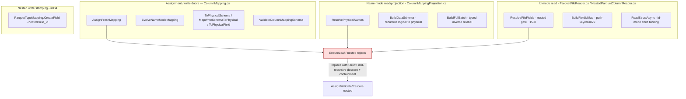
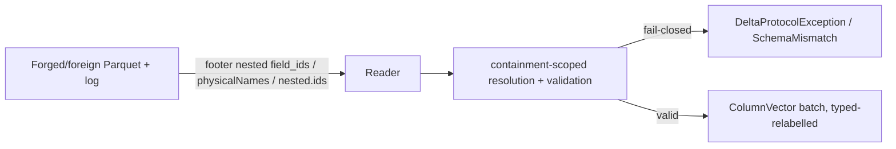

# Nested (struct/array/map) column mapping

> **Status:** Draft — **round-2 (revised).** The round-1 opus-5 council found the id-model correct (C1) but
> the id-mode resolution model unsound (silent cross-column mis-attribution) and several doors/scenarios
> missing. This revision **re-specifies id mode around containment**, **scopes id-mode nested support to
> `struct<scalars>`** (array/map under **id mode** fail closed with tracked follow-up **#839**), adds the
> name-mode duplicate guard, the typed inverse-relabel, the `nested.ids` rejection, the missing write/decode
> components, an interop matrix, and a rebuilt fail-closed oracle. **Blockers cleared:** nested Parquet
> **write** is viable on Parquet.Net 6.1.0 via public `WriteAllPartsAsync` (design **#834**, RFL PASS);
> `BuildFieldIdMap` physical-path keying is **merged** (#829 → PR #836); `ColumnMappingIdentity` structured
> `ColumnPathKey` is **merged** (#830 → PR #835).
>
> **C1 (the id model):** column mapping attaches `delta.columnMapping.{id,physicalName}` to **`StructField`s
> at every depth** and **never** to array-`element`/map-`key`/map-`value` — DeltaSharp's `SchemaJson.WriteType`
> (`src/DeltaSharp.Abstractions/SchemaJson.cs`) emits a `metadata` slot **only** for a `StructField` inside a
> `StructType`; DeltaSharp does **not** implement Delta's `delta.columnMapping.nested.ids`. Corollary:
> **`struct<…>` is the only recursive shape**; `array<scalar>`/`map<scalar>` receive a top-level id only.
>
> **Issue:** [#676](https://github.com/khaines/deltasharp/issues/676) — Delta column mapping: nested
> (struct/array/map) column mapping — recursive `StructField` field-id/physical-name assignment + resolution.
> **Author:** design-doc skill (orchestrated).
> **Reviewers:** cloud-native-distributed-systems-architect, delta-storage-format-engineer,
> reliability-test-chaos-engineer, cloud-native-security-sme, cloud-native-site-reliability-engineer,
> performance-benchmarking-engineer.
> **Last Updated:** 2026-08-19.
> **Related:** #191 (name-mode leaf mapping), #523/#573 (id-mode read), #572/#583 (id-mode write),
> #518/#678 (nested Array/Map footer serialization), #693 (`DeltaSchemaJson`→`SchemaJson` consolidation),
> #571/#584 (nested Parquet decode), #674 (column-mapping tamper-fuzz oracle), #675 (nested oracle —
> blocked on this), **#828/#834 (nested Parquet write — write-path sequencing dependency)**, **#829/#836 &
> #830/#835 (landed prerequisites)**, **#839 (array/map id-mode nested — deferred follow-up)**. Prereqs
> #585/#546/#577 (deeper/edge nested support) are scope boundaries.

---

## 1 · Overview

Delta **column mapping** decouples a table's *logical* column names from the *physical* names/ids stored in
Parquet, so a rename or drop is a metadata-only commit (no file rewrite) and CDC/CDF reads of old files
still resolve correctly. DeltaSharp implements column mapping today **leaf-only**: `ColumnMapping.EnsureLeaf`
(`ColumnMapping.cs`), `ColumnMappingProjection.ResolvePhysicalNames` (name mode, `ColumnMappingProjection.cs:41`),
and `ParquetFileReader.ResolveFileFields` (id mode, `ParquetFileReader.cs:1535-1544`) all reject nested
(`struct`/`array`/`map`) fields fail-closed.

This design lifts that restriction for **single-level** nested types by applying column mapping to the
schema's **`StructField`s at every depth** (C1). Concretely:

- **`struct<scalars>`** — the container column *and each scalar child* are `StructField`s; each is assigned
  its own `(id, physicalName)`. **This is the only recursive shape.** Fully supported in **name** and **id**
  mode.
- **`array<scalar>`, `map<scalar,scalar>`** — only the **top-level column** is a `StructField`; it is
  assigned `(id, physicalName)`. The `element`/`key`/`value` nodes are **not** `StructField`s and carry
  **no** mapping metadata (§2.2). Supported in **name** mode (container relabelled as a unit, interior
  resolved structurally). Under **id mode** they fail closed with a message naming **#839** (the interior
  carries no representable id, so id-correlation is impossible without inventing a non-Delta wire format —
  see §2.5 / §9).

**Scope of the enabled surface (this PR):**

| Shape | name mode | id mode |
|---|---|---|
| `struct<scalars>` | ✅ enabled | ✅ enabled (containment-scoped, §2.5) |
| `array<scalar>` | ✅ enabled | ⛔ fail-closed, tracked **#839** |
| `map<scalar,scalar>` | ✅ enabled | ⛔ fail-closed, tracked **#839** |
| nested-within-nested (`array<struct>`, `struct<struct>`, `map<_,struct>`, …) | ⛔ fail-closed, **#585** | ⛔ fail-closed, **#585** |

Why it matters: nested column mapping is a **production-feature gap** (not test debt) blocking column-mapped
tables with complex-typed columns — a common Spark-parity shape — and the direct dependency of the nested
CDF/column-mapping oracle **#675**.

**Requirements traceability:** EPIC-05 column mapping (`storage-delta-architecture.md` §2.9 / §2.12.3).

**Scope boundary (explicit):** single-level nested — `struct` of scalars, `array` of scalars, `map` of
scalars (the shapes `#571` decodes and `#834` writes). Nested-within-nested is **deferred to #585** and
rejected fail-closed naming #585. Deeper/edge nested support (#546, #577, #605, #590) is adjacent and not
required here.

---

## 2 · Logical Architecture

### 2.1 Where nested mapping lives



### 2.2 The invariant (C1): mapping attaches to `StructField`s, never to element/key/value

Column mapping assigns `delta.columnMapping.id` (a JSON number → Parquet leaf `field_id` in id mode) and
`delta.columnMapping.physicalName` (`col-<uuid>`) to **every `StructField`**, and **only** to `StructField`s.

This is a hard property of DeltaSharp's serialization: in `SchemaJson.WriteType`
(`src/DeltaSharp.Abstractions/SchemaJson.cs:160-179`) the `metadata` object is emitted **only** in the
`StructType`→`StructField` branch; the `ArrayType.elementType` (`:140-148`) and `MapType.keyType`/`valueType`
(`:150-158`) branches call `WriteType` on the raw inner **type** — **no metadata slot**. DeltaSharp does
**not** implement Delta's `delta.columnMapping.nested.ids` (grep: zero hits in `src/`).

> **This is DeltaSharp's *representable subset*, not a restatement of the Delta protocol.** Upstream Delta
> *does* assign ids to array/map inner nodes via `nested.ids` on the containing field. DeltaSharp does not,
> so its representable id-mode nested surface is `struct<scalars>` only — see the **interop matrix** (§2.5).

**Assignment walk (pre-order over `StructField`s only):**
- **`StructType`** → for each child `StructField`, assign `(++maxColumnId, col-<uuid>)`, then recurse into
  the child's `DataType`. *A nested `StructType` recurses; `ArrayType`/`MapType`/scalar terminate.* **Only
  recursive case.**
- **`ArrayType` / `MapType`** column → the column `StructField` was assigned by its parent step; its
  `element`/`key`/`value` are **not** `StructField`s → **no descent, no inner id/physicalName.**
- **Scalar** `StructField` → terminal.

**`maxColumnId`** is a monotonic high-water mark advanced once per assigned `StructField`. It counts
`StructField`s. Invariant: `maxColumnId >= max(assigned id)`; **equality holds only for
DeltaSharp-created tables** — a Spark-authored table also consumes `nested.ids` values, so its counter may
exceed the `StructField` count with **gaps**. The validator asserts only the ceiling and MUST keep
accepting id gaps.

**Physical schema is a pure name substitution (Balanced-4):** `ToPhysicalSchema`/`MapWriteSchemaToPhysical`
substitute physical names at every depth but leave **type, nullability, and field order byte-identical** to
the logical schema. Nested child mapping metadata is **stripped in name mode** and **reduced to
`delta.columnMapping.id` only in id mode** — exactly as `ToPhysicalField` (`ColumnMapping.cs:1021-1047`)
does at top level (so name/none-mode Parquet output stays byte-unchanged, #523 AC3; def/rep-level encoding
is unperturbed).

**Uniqueness / safety scopes:**
- **`id`**: **globally unique** across the tree (`ValidateColumnMappingSchema` already enforces global id
  uniqueness + the `maxColumnId` ceiling — `ColumnMapping.cs:471-495`; extend the walk over nested
  `StructField`s including a **nested** ceiling check).
- **`physicalName`**: unique **per struct level** (per sibling `StructField` set), **Ordinal** — the physical
  Parquet path is `<parentPhysical>.<childPhysical>`, so sibling uniqueness suffices. Ordinal (not
  OrdinalIgnoreCase) is chosen because physical names are `col-<uuid>` (collision-free by construction) and
  logical-name case-insensitive collisions are already handled separately by
  `EnsureNoCaseInsensitiveDuplicateColumns` (`ColumnMapping.cs:886-935`).
- **Physical addressing is segment-structured (Security-4).** The binding rule: *no component may compose or
  parse a dotted physical path* — all addressing uses structured segment keys (`PhysicalPathKey`
  `ParquetFileReader.cs:658-718`; `ColumnPathKey` `ColumnMappingIdentity.cs:143`). As defense-in-depth,
  `ValidateColumnMappingSchema` additionally **rejects an embedded `'.'` in a nested `physicalName`**
  (the existing `FindUnsafePathSegmentReason`, `ColumnMapping.cs:198-274`, rejects only the exact strings
  `"."`/`".."`, not an embedded dot — this design tightens it for nested physical names, where no legitimate
  `col-<uuid>` contains a dot).
- **Reject foreign `nested.ids` (C1 corollary, Security/Architect):** any field of a **mapped** schema that
  carries `delta.columnMapping.nested.ids` is rejected `Unsupported` at `ValidateColumnMappingSchema` — we
  cannot honor its semantics, so silently ignoring it could mis-read a Spark-authored array/map interior.
  Fail closed rather than misinterpret.

### 2.3 Component boundaries

| Component | File | Change |
|---|---|---|
| `ColumnMapping.AssignFreshMapping` | `ColumnMapping.cs` | replace `EnsureLeaf` with the §2.2 `StructField`-recursive assignment; single monotone `maxColumnId`; assign only struct children, never element/key/value; reject a zero-field mapped struct at the create door (mirrors the read-side reject) |
| `ColumnMapping.EvolveNameModeMapping` | `ColumnMapping.cs` | recursive: mint for **newly-added** nested `StructField`s only; **preserve** every existing nested id/physicalName (never re-mint, counter only increases); match existing children **per-parent-path**; a parent whose *type* changes (`struct`→`array` under `overwriteSchema`) **retires** its children's identities (not re-parented) |
| `ColumnMapping.ToPhysicalSchema` / `MapWriteSchemaToPhysical` / `ToPhysicalField` | `ColumnMapping.cs:716/749/1021` | recursive **name-only** relabel of struct children (type/nullability/order byte-identical); strip nested child metadata in name mode; keep `id` only in id mode |
| `ColumnMapping.ValidateColumnMappingSchema` | `ColumnMapping.cs:405` | validate id/physicalName presence, positivity, **nested** `maxColumnId` ceiling, **global id uniqueness**, **per-level Ordinal physicalName uniqueness**, per-level embedded-dot/control-char rejection, and **`nested.ids` presence reject** over the nested `StructField` tree |
| `ColumnMappingProjection.ResolvePhysicalNames` | `ColumnMappingProjection.cs:41` | drop the nested reject; return the **top-level** physical name per column (interior relabelled by `BuildDataSchema`) |
| `ColumnMappingProjection.BuildDataSchema` | `ColumnMappingProjection.cs:73` | **recursive** relabel: today renames only the top-level field, carrying `field.DataType` verbatim (`:88`) → recurse into struct children substituting each child's `physicalName`; array/map interior carried verbatim |
| `ColumnMappingProjection.BuildFullBatch` | `ColumnMappingProjection.cs:138-162` | **typed inverse relabel** (§2.5): validate logical↔physical tree congruence, then **re-type** each nested `StructColumnVector` to a `StructType` `Equals`-identical to the logical field's `DataType` (names *and* per-child metadata), reusing child vectors (zero copy); fail closed `DeltaStorageException.SchemaMismatch` (sanitized path) **before** constructing `ManagedColumnBatch` — never a bare `ArgumentException`, never a raw nested `SimpleString` in a message |
| `StructColumnVector` (new op) | `StructColumnVector.cs` | add a zero-copy **re-type** (rewrap children under a supplied logical `StructType`); today its ctor validates children against its own physical type (`:107`) and offers no re-wrap |
| `ParquetFileReader.ResolveFileFields` | `ParquetFileReader.cs:1535-1544` | lift the id-mode nested reject **for `struct<scalars>` only**; array/map under id mode → fail closed naming **#839**; preserve the existing top-level-scalar guard (`:1571-1578`: a scalar column whose id resolves to a `Path.Length>1`/array leaf still fails closed) |
| `ParquetFileReader` name-mode dup guard (new) | `ParquetFileReader.cs:1505`, `NestedParquetColumnReader.cs:1081` | **name/none mode currently has no duplicate guard** (`BuildFieldIdMap` runs only in id mode, `:415`; `byName` is last-wins `:1505`; `ResolveStructField` first-wins `:1084-1091`). Add a decoded-leaf **physical-path uniqueness** check in name/none mode and make top-level `byName` **and** `ResolveStructField` duplicate-intolerant (`SchemaMismatch`, sanitized) |
| `NestedParquetColumnReader.ReadStructAsync` / `ResolvedColumn` | `NestedParquetColumnReader.cs:252-277`, `ParquetFileReader.cs:1481` | **id-mode child binding is containment-scoped by `field_id`, NOT name-based `ResolveStructField`** (§2.5): resolve each child leaf by id within the container's subtree; carry `byFieldId` into the nested decoder (today `ForNested` carries only the container `Field`) |
| `ParquetTypeMapping.CreateField` | `ParquetTypeMapping.cs:119-147,161` | today **rejects all nested types** (scalar-only writer) and is where `field_id` + the `[1,int.MaxValue]` range guard are applied. Nested-leaf `field_id` stamping (= owning child `StructField`'s id) is #676 logic layered on the **#834** nested writer; a write-door assertion requires **every** mapped struct-leaf to be stamped + range-guarded (an unstamped leaf commits a permanently-unreadable file) |
| `ColumnMapping.BuildFieldIdMap` consumption | `ParquetFileReader.cs:452-560` | already footer↔leaf path-keyed with the S-1/S-2 bijection (#829, landed). Consumed for struct-child leaves **with the §2.5 containment check layered on top** — the bijection is *intra-file* (footer↔decoder) and does **not** by itself validate footer↔log parentage |
| `DeltaTableWriter.RenameColumnAsync` / `DropColumnAsync` | `DeltaTableWriter.cs:695/759` | today address a column by a flat `string` via `schema.TryGetField`. Nested-path rename/drop needs **segment-array** addressing (a dotted string re-introduces the `.`-in-name collision `ColumnPathKey`/#830 exists to prevent) — **in scope if tractable; else defer with a tracked issue** (§9) |

### 2.4 Data flow — create a nested-mapped table (name mode)

```mermaid
sequenceDiagram
  participant W as Writer (create)
  participant CM as ColumnMapping.AssignFreshMapping
  participant LOG as _delta_log (metaData.schemaString)
  participant PQ as ParquetFileWriter (#834 nested write)
  W->>CM: logical {id:long, addr:struct<city:string,zip:long>, tags:array<string>}
  CM->>CM: pre-order StructField walk - id=1/col-a, addr=2/col-b, addr.city=3/col-c, addr.zip=4/col-d, tags=5/col-e; maxColumnId=5
  Note over CM: array element gets NO id/physicalName (not a StructField)
  CM-->>W: physical schema (struct childs relabelled; array carried as a unit) + maxColumnId=5
  W->>LOG: commit schemaString (SchemaJson - metadata on StructFields only) + config maxColumnId
  W->>PQ: write physical schema; id mode stamps each struct-leaf's field_id (array/map id-mode is out - #839)
```

### 2.5 Resolution model

**Name mode.** `ResolvePhysicalNames` returns the top-level physical name per column; `BuildDataSchema`
recursively substitutes each struct child's `physicalName`; `BuildFullBatch` performs the **typed inverse
relabel** on read (re-type each `StructColumnVector` to the logical `StructType`, names + metadata
`Equals`-identical, so `ManagedColumnBatch`'s `column.Type.Equals(schema[i].DataType)` check
(`ManagedColumnBatch.cs:126`) holds; a residual mismatch fails closed as a typed `DeltaStorageException`).
`array`/`map` columns are relabelled only at the top-level `StructField`; their interior resolves
**structurally**: `map` key/value bind by their **canonical `key`/`value` name** within the `key_value`
group (Parquet.Net's `PqMapField.Key`/`.Value`, `NestedParquetColumnReader.cs:148-151`), **not**
positionally — a footer whose `key_value` children are not exactly `{key,value}` fails closed.
**Name/none mode also runs the new physical-path uniqueness guard** (§2.3) so a duplicate top-level
container name or duplicate leaf physical path fails closed instead of resolving by luck.

**Id mode (`struct<scalars>` only).** Parquet `field_id`s live on **leaves** (Parquet.Net 6.1.0 exposes no
public settable `field_id` on a container/group node — empirically confirmed: `Field.SchemaElement` is
get-only, `FieldId` is declared only on `DataField`). The write door stamps each **struct-child leaf**'s
`field_id` = that child `StructField`'s id. Read is **containment-scoped**, not a file-global lookup:

1. Resolve the **container** group from the log `physicalName` (rename-stable).
2. For each child, look up its `delta.columnMapping.id` in the path-keyed `BuildFieldIdMap` (#829) and
   **require the resolved leaf's parent physical path to equal the container's physical path** (structured
   `PhysicalPathKey` equality). A child id that resolves to a leaf **outside** the container (a top-level
   leaf, a sibling container's leaf, or a leaf of a coincidentally-equal rep/def profile) **fails closed
   `SchemaMismatch`** — the structural level guard (`ValidateLeafStructuralLevels`,
   `NestedParquetColumnReader.cs:1104-1131`) is *insufficient* for this and MUST NOT be relied on.
3. Two child ids aliasing to one leaf, or the container `physicalName` group being absent, fail closed.
4. The **container itself has no `field_id`** and is bound by its `physicalName` (its declared id is
   **structural-only, never footer-resolvable**) — this is a documented, container-scoped exception to the
   existing "declared id absent from footer ⇒ fail closed" rule (`ParquetFileReader.cs:1565-1579`); it does
   **not** name-fall-back because the children are bound by id within the resolved subtree.

**Id mode — array/map: OUT (`#839`).** The interior (`element`/`key`/`value`) carries no representable id
(C1: not a `StructField`; `nested.ids` unimplemented) and the Parquet group node cannot carry one. Binding
the column by an id stamped on an interior leaf would (a) invent a non-Delta wire format ("primary leaf")
that mis-attributes a `field_id` and diverges from Spark, and (b) re-open the cross-container capture the
containment rule closes. So **`array<scalar>`/`map<scalar>` under id mode fail closed naming #839**; they
remain fully supported in **name** mode.

**Cross-engine interop matrix (name mode fully interoperable; id mode DeltaSharp-representable subset):**

| Direction | name mode | id mode |
|---|---|---|
| DeltaSharp writes → DeltaSharp reads | ✅ struct/array/map | ✅ struct only (containment-scoped) |
| DeltaSharp writes → Spark reads | ✅ (physical names only) | ⚠️ struct leaves carry ids, but the struct **group node lacks a `field_id`** (Parquet.Net limit) — a strict Spark id-matching reader may not bind the container; documented caveat (§8) |
| Spark writes → DeltaSharp reads | ✅ (physical names) | ⚠️ Spark `array`/`map` id-mode columns carry their id on the **group node / `nested.ids`**, invisible to `BuildFieldIdMap` (leaf-only, `ParquetFileReader.cs:459-484`) → **fail closed** (never mis-bound); a mapped schema carrying `nested.ids` is rejected (§2.2) |

### 2.6 Plan/data model

- Assignment is `Assign(StructType, long startingMaxId) → (StructType, long maxColumnId)` — a function
  returning a fresh metadata-annotated `StructType`/`StructField` tree (plan-node immutability;
  `ColumnMapping.cs:614-618` already constructs fresh nodes) and the new high-water mark. (No `ref`
  in-out; the earlier "pure function with `ref`" phrasing is dropped.)
- Resolution is the inverse relabel over the paired logical/physical trees, keyed by struct-field position;
  array/map interiors match structurally (name mode) or fail closed (id mode).
- The id-mode field map is `BuildFieldIdMap` (path-keyed, #829) consumed for struct-child leaves **under the
  §2.5 containment check**; its intra-file bijection is a substrate, not the parentage guarantee.

### 2.7 API surface

No public **type** change; column mapping is configured via `delta.columnMapping.mode`. The only
externally-visible behavior change is that create/evolve/read of a **nested-typed** column-mapped table
**succeeds** (within §1's enabled surface). One internal API refinement: nested rename/drop (if in scope,
§9) addresses fields by a **segment array**, not a dotted string, to avoid the `.`-in-logical-name
collision; this is an internal write-door signature, not a public API break.

### 2.8 Dependencies

| Dependency | State | Role |
|---|---|---|
| #829 `BuildFieldIdMap` physical-path keying + footer↔decoder bijection | **MERGED** (PR #836) | intra-file substrate for id-mode struct-child leaves (parentage layered on top per §2.5) |
| #830 `ColumnMappingIdentity` structured `ColumnPathKey` | **MERGED** (PR #835) | CDF immutability gate; see the H6 discharge below |
| #828 nested Parquet **write** (`WriteAllPartsAsync`) | **design PASS** (PR #834, unmerged) | authors nested physical Parquet; **implementation is the write-path sequencing dependency**; nested-leaf `field_id` stamping is #676 logic on top of it |
| #518/#678 nested footer schema serialization | landed | footer schema string matches the log for nested types |
| #693 `DeltaSchemaJson`→`SchemaJson` consolidation | landed | one serializer; harness == production; footer `key_value_metadata` Spark schema JSON == log |
| #571/#584 nested Parquet decode | landed | struct/array/map-of-scalar decode into nested `ColumnVector` |
| #585 nested-within-nested decode | **open** | scope boundary (fail-closed) |
| #839 array/map id-mode nested | **to be filed (open before PASS)** | deferred id-mode array/map |

**H6 discharge (all seats).** `ColumnMappingIdentity` carries two `#676`-addressed obligations
(`ColumnMappingIdentity.cs:75-78` and `:112-118`: "#676 MUST extend this collection to descend array
element and map key/value structs before relaxing that upstream reject"). Under **C1** these are
**discharged**: `Collect` already recurses **direct** struct children (`:130-137`), covering struct-child
identities; array-`element`/map-`value` **structs** are a nested-within-nested shape deferred to **#585**
and stay fail-closed (§1), so no array/map interior descent is needed. This PR updates both in-code comments
to record the #585 linkage and adds a CDF nested-identity scenario (§3).

### 2.9 Tenant/storage-backend considerations

Pure metadata/schema transform, backend-independent; no new I/O (field-id correlation reads the already-open
footer). Nested columns remain **outside** the statistics/data-skipping surface: `StatisticsPolicy`
(`StatisticsPolicy.cs:20-22,88-96`) and the collector already skip nested types; this design emits **no**
nested stat keys and adds no per-child stats (regression-asserted, §3).

---

## 3 · Functional Test Scenarios

Oracle (mode-split, Balanced-5). **Name mode:** the log `physicalName` path per `StructField` ≡ the footer
physical path prefix ≡ the footer `key_value_metadata` Spark schema-JSON path; **no `field_id` anywhere**.
**Id mode (struct only):** additionally, the log `id` per struct-**leaf** `StructField` ≡ the footer leaf
`field_id`, **bijective over struct leaves only** (containers excluded — they carry no footer id — and that
exclusion is asserted explicitly). Every same-typed-sibling test draws per-leaf values from **disjoint value
domains** (e.g. `a ∈ [1000,1999]`, `b ∈ [2000,2999]`) so a positional mis-bind cannot pass on equal values.
Every fail-closed cell asserts the **exact exception type**.

**Happy path**
1. **Create + read, name mode** — `struct<city:string,zip:long>`, `array<string>`, `map<string,long>`.
   Round-trip identical values. `maxColumnId == 5` for `{id, addr:struct<city,zip>, tags:array}` (counts
   `StructField`s: id, addr, addr.city, addr.zip, tags — **not** the array element). Duals:
   `array<string>` and `map<string,long>` each contribute **exactly 1** to `maxColumnId`; the committed
   `schemaString` contains **no** `metadata` object under any `elementType`/`keyType`/`valueType`.
2. **Create + read, id mode, `struct<scalars>`** — each struct child leaf's `field_id` is stamped; read
   resolves each child **by `field_id` within the container subtree** after a logical rename (read-through,
   no rewrite); the container binds by `physicalName`.
3. **Schema-evolve (name mode)** — add a new struct child; only the new child gets a fresh id/physicalName;
   existing nested ids/physicalNames preserved; `maxColumnId` strictly increases; matching is per-parent-path.

**Type-agreement on the read exit (Balanced-3/Quality-F3/Security-5)**
4. `NameMode_NestedRead_BatchColumnType_EqualsLogicalSchemaFieldType_Exactly` — assert
   `batch.Column(i).Type.Equals(tableSchema[i].DataType)` including per-child **metadata**.
5. `NameMode_NestedRead_PartialRelabel_FailsClosedAsDeltaException_NotArgumentException` — a names-only
   relabel that leaves physical child metadata surfaces a typed `DeltaStorageException.SchemaMismatch`, and
   no nested `SimpleString`/raw foreign name appears in any message (`ParquetMessageHygiene`-style assert).

**Same-typed-sibling reversed-order (mis-attribution defense, witness-disjoint)**
6. `NameMode_StructSameTypedSiblings_FooterReversed_BindsByPhysicalName_WitnessDisjoint` (`struct<a:long,b:long>`).
7. `IdMode_StructSameTypedSiblings_FooterReversed_BindsByFieldId_WitnessDisjoint`.
8. `MapKeyValue_FooterEmitsValueBeforeKey_BindsByCanonicalName_OrFailsClosed_WitnessDisjoint` (name mode).

**Id-mode containment (Security-1/Quality-F1 — the CRITICAL closure)**
9. `IdMode_NestedChildId_ResolvesToTopLevelLeaf_FailsClosed`.
10. `IdMode_NestedChildId_ResolvesToLeafUnderDifferentContainer_FailsClosed` (two same-named children,
    `home/col-c` vs `work/col-c`; forged footer stamps the id on the wrong container's leaf).
11. `IdMode_ChildIdStampedOnLeafOfEqualRepDefProfile_FailsClosed` — **and** asserts the level guard alone
    does not cover it.
12. `IdMode_TopLevelScalarId_ResolvesToNestedLeaf_FailsClosed` — regression pin on the surviving
    `ParquetFileReader.cs:1571-1578` guard.
13. `IdMode_ArrayColumn_FailsClosed_NamingIssue839`, `IdMode_MapColumn_FailsClosed_NamingIssue839`.

**Per-door fail-closed matrix**
14. Duplicate `physicalName` among sibling struct children → `SchemaMismatch`/`Unsupported`
    (`ValidateColumnMappingSchema` + duplicate-intolerant `ResolveStructField`).
15. `NameMode_DuplicateTopLevelContainerName_FailsClosed` and
    `NameMode_DuplicateLeafPhysicalPathAnywhere_FailsClosed` (the new name-mode dup guard).
16. Duplicate `field_id` anywhere → fail closed (`BuildFieldIdMap` dup guard, #829).
17. Missing `id` **or** `physicalName` on a nested `StructField` → fail closed (two distinct cells).
18. `NestedStruct_ParentMapped_ChildUnmapped_FailsClosed` (partial-recursion drift).
19. `LogSide_NestedChildId_AboveInt32Max_FailsClosed` and `FooterSide_NestedLeafFieldId_NonPositive_FailsClosed`
    (footer `field_id` is int32; the log side is where `> int.MaxValue` is representable).
20. `NestedChildId_ExceedsMaxColumnId_FailsClosed` (nested ceiling; today the ceiling check is top-level only).
21. `NestedChildPhysicalNameContainingDot_FailsClosed`, `NestedChildPhysicalNameContainingControlChar_FailsClosed`;
    and the accepted dual `NestedChildPhysicalNameEqualToTopLevelPhysicalName_IsAccepted_AndDoesNotMisCorrelate`.
22. `MappedSchemaCarryingNestedIds_FailsClosed` (the `delta.columnMapping.nested.ids` reject).
23. `Foreign-written read path` — a footer whose nested structure disagrees with the log (extra/missing
    child, re-parented leaf) → rejected by the containment check + #829 bijection + duplicate-intolerant
    child resolution; no cross-column substitution.
24. **Nested-within-nested at the *assignment/validation* door** (not only at read): the shape set
    `{array<struct>, struct<struct>, map<string,struct>, array<array>, map<string,map>}` × doors
    `{AssignFreshMapping, ValidateColumnMappingSchema (raw/foreign metaData), ResolveFileFields}` each
    → `UnsupportedFeature` **naming #585**, with **no partial `maxColumnId` advance** before the reject.
    Plus a mapped **zero-field struct** create reject (mirrors `NestedParquetColumnReader.cs:115-121`).

**Null/empty container round-trip (Balanced-7 — nested-write fidelity)**
25. Null struct row, struct with all-null children, empty `array`, all-null `array` column, empty `map`,
    `map` with null values, zero-row nested column — round-trip identity in both write halves; a relabel
    that alters a child's nullability corrupts these and must be caught.

**Evolve / identity**
26. `Evolve_DropNestedChildThenReAddSameLogicalName_MintsFreshIdAndPhysicalName_MaxColumnIdStrictlyIncreases_OldFileDataDoesNotSurface`.
27. `Cdf_NestedChildIdentityChangedBetweenRetainedVersions_FailsClosed` and
    `Cdf_NestedChildLogicalRename_IdAndPhysicalPreserved_IsAccepted` (the H6 CDF-identity door).

**Write byte-invariance**
28. `NameMode_NestedStructWrite_NoFieldIdOnAnyFooterLeaf`; `IdMode_NestedStructWrite_EveryStructChildLeafCarriesItsOwnFieldId`.
29. `NoneModeNested` + `NonNestedMapped` byte/behavior-unchanged, measured against a **committed golden
    fixture or an explicit pre/post SHA-256** (not an unbaselined "byte-unchanged"). Regression-assert **no
    nested statistics keys** are emitted.

**Metadata-only no-rewrite (conjunctive assertion)**
30. Rename/drop a nested struct child (name mode) — assert **all of**: exactly one `metaData` action and
    zero `add`/`remove` in the commit ∧ SHA-256 of every data-file byte identical pre/post ∧ each `AddFile`'s
    `(path,size,modificationTime,stats,partitionValues)` identical ∧ `maxColumnId` unchanged ∧ the post-read
    returns the same values under the new logical name. Addressing is a **segment array**. If rename defers
    (§9), the AC map states AC-rename/drop is unmet by this PR and cites the verified-open follow-up.

**Seeded property harness (house convention — Quality-F8)**
31. Uses `tests/Shared/TestSeed.cs` (`Resolve`/`Combine(baseSeed, scope)`, `DELTASHARP_TEST_SEED`), a fixed
    iteration count, and the `[deltasharp-seed]` reproduction line (as `ChangeFeedCdcFuzzTests.cs:80-187`).
    Generator space: field count, sibling count, scalar type set, per-leaf **disjoint** value domains;
    enumerated tamper-operator set; invariants asserted as a **conjunction** (round-trip identity ∧ mode-split
    log↔footer bijection ∧ thrown type ∈ {`DeltaProtocolException`,`DeltaStorageException`}); a
    minimization/shrink step lands a failing draw as a permanent minimized regression, not a bare seed.

**Integration**
32. CDF/CDC read of an old file after a nested-struct logical rename resolves via the mapping (the #675
    oracle's concrete dependency — this design unblocks it).

**Sequencing.** Read/name-mode and the id-mode struct resolution are testable now with
`ParquetSerializer`-authored fixtures (as the existing nested-read tests). The **production write-path**
round-trip (§3.25/§3.28 write halves) is gated on **#828/#834** landing; until then those halves use
serializer-authored fixtures and the production-writer assertions are marked pending #828.

**Acceptance-criteria mapping (#676):** AC-assignment → §3.1–3.3; AC-resolution → §3.1,3.2,3.4–3.13;
AC-rename/drop → §3.30 (or deferred per §9); AC-fail-closed → §3.9–3.24,3.31.

---

## 4 · Performance

- **Workload:** schema-transform at commit and read-open — O(number of `StructField`s), typically tens of
  fields. No per-row cost; the id-mode containment check is O(children) path comparisons over the
  already-open footer; the inverse relabel **re-types** vectors without copying child buffers (§2.5).
- **Targets:** assignment/resolution add < 1% to a create/read-open on a realistic wide-nested schema; zero
  allocation per data row.
- **Memory:** one metadata-annotated schema copy per transform (bounded by schema size); recursion depth ≤ 2
  (single-level scope), and parse/footer depth are already capped (`SchemaJson.MaxDepth = 64`;
  `MaxFooterFieldIdMapDepth = 100`, `ParquetFileReader.cs:456`).
- **Regression gate:** a 50-`StructField` nested-schema assign+resolve micro-benchmark stays within the
  schema-transform noise floor; the per-batch decode path is untouched.

---

## 5 · Security

- **Data classification:** column-mapping metadata is non-sensitive schema metadata; no PII flows through the
  layer; fail-closed messages carry only sanitized nested **paths** (`DiagnosticText.Sanitize`), never
  decoded bytes or raw foreign nested field names (§2.3 `BuildFullBatch` congruence check runs **before**
  `ManagedColumnBatch`, whose `SimpleString` echo (`ManagedColumnBatch.cs:126`) would otherwise leak nested
  names).
- **Input validation (the crux):** the footer schema and the log `metaData.schemaString` are
  attacker-influenced. Every flat-case fail-closed invariant extends over the nested `StructField` tree —
  duplicate/missing id or physicalName, id range, **nested** `maxColumnId` ceiling, global id uniqueness,
  per-level Ordinal physicalName uniqueness, per-level embedded-dot/control-char rejection, `nested.ids`
  reject. The **id-mode containment check** (§2.5) is the primary mis-attribution guard: a child id must
  resolve to a leaf **inside** its declared container's subtree (structured-path equality), closing the
  round-1 cross-column capture (a child id stamped on a top-level or sibling-container leaf). The
  intra-file #829 bijection is a substrate, **not** the footer↔log parentage guarantee.
- **Name mode** gains a **physical-path uniqueness guard** (previously absent) so duplicate container/leaf
  names fail closed rather than resolving by luck.
- **Fail-closed over fallback:** id mode never name-matches a struct child whose declared id is absent from
  the footer; the container's structural-only id never triggers name fallback (children bound by id within
  the subtree); array/map under id mode fail closed (#839) rather than bind via an invented interior id.
- **Supply-chain:** no new dependencies; nested write via public 6.1.0 `WriteAllPartsAsync` (#834).

---

## 6 · Threat Model



| STRIDE | Surface | Threat | Mitigation |
|---|---|---|---|
| **Tampering** | id-mode child `field_id` vs log container | forged footer stamps a child id on a foreign leaf → **cross-column mis-attribution** | **containment check** (§2.5): child leaf's parent physical path must equal the container's; else fail closed; not the intra-file #829 bijection alone |
| **Tampering** | name-mode duplicate container/leaf name | ambiguous resolution binds by luck | new name/none-mode physical-path uniqueness guard + duplicate-intolerant `byName`/`ResolveStructField` |
| **Tampering** | `delta.columnMapping.nested.ids` on a mapped schema | foreign array/map interior ids silently ignored → wrong interior read | reject `Unsupported` at validation (§2.2) |
| **Spoofing** | id-mode struct child | declared id absent from footer → silent name fallback | fail closed; container's structural-only id never name-falls-back |
| **Confusion** | array/map id mode | invented "primary leaf" id → wire divergence + capture | **out of scope (#839)**, fail closed |
| **Info disclosure** | read-exit relabel | raw nested `SimpleString`/foreign names in `ArgumentException` | congruence check + typed `DeltaStorageException` **before** `ManagedColumnBatch`; sanitized path only |
| **DoS** | deeply/widely nested schema | unbounded recursion | single-level scope → depth ≤ 2; parse/footer depth capped; nested-within-nested fail-closed (#585) |

**Residual:** array/map id-mode (#839) and nested-within-nested (#585) are out of scope, fail-closed. The
cross-engine id-mode container-group-id gap (§2.5 matrix) is an **interop** limitation (fail-closed inbound,
caveated outbound), not a data-integrity residual. For the enabled surface, no silent mis-attribution
residual once containment + the name-mode dup guard + the typed relabel are in place. The pre-existing
flat-mode rename-equivalence residual (`ColumnMappingIdentity.cs:80-92`) is unchanged.

---

## 7 · Observability

- **Logging:** fail-closed rejections log via the sanitized `DeltaProtocolException`/`DeltaStorageException`
  path; add the **sanitized nested path** (e.g. `addr.zip`) to the violation message. No new happy-path log
  site.
- **Metrics:** none — schema transform, no runtime hot path.
- **Correlation:** violations surface under the existing table-path/version fields on the read/commit
  activity.

---

## 8 · Rollout & Risk

- **Rollout:** additive behind the existing `delta.columnMapping.mode` gate; existing leaf-only, `none`, and
  non-nested tables are byte/behavior-unchanged (§3.29). id-mode array/map stays fail-closed (#839).
- **Kill-switch:** the change removes a fail-closed gate for the enabled nested cases; a defect → reinstate
  the gate (revert). Data written stays readable (physical names/ids self-describing).
- **Risk register:** (a) id-mode struct-child mis-attribution → **data mis-attribution** — mitigated by the
  §2.5 containment check + §3.9–3.13 + #829 bijection; (b) `maxColumnId` non-monotonicity on evolve → id
  reuse — single high-water counter + §3.3/§3.26; (c) name-mode ambiguous duplicate → new dup guard +
  §3.15; (d) read-exit `ArgumentException`/name leak → typed relabel + §3.4/3.5; (e) **cross-engine id-mode
  interop** — DeltaSharp id-mode struct files lack a container-group `field_id`, and Spark id-mode array/map
  are fail-closed inbound: documented caveat, **not** silent (§2.5 matrix); (f) nested-within-nested / array
  id-mode accidentally allowed → §3.13/§3.24 boundary tests naming #839/#585.
- **Launch checklist:** unit + integration (§3) green on both TFMs; `dotnet format`; determinism ban; DCO;
  RFL PASS; #675 unblocked; **#839 and the nested-within-nested #585 follow-ups verified open** before PASS.

---

## 9 · Open Questions & Decisions

1. **Rename/drop of nested struct fields (name mode).** Include *drop* (remove a child's mapping entry) and
   *rename* if segment-array path-addressing is tractable; otherwise defer *rename* with a tracked issue.
   Addressing MUST be a **segment array**, never a dotted string (§2.7). §3.30 gates whichever lands; the AC
   map records any deferral against a verified-open issue.
2. **`element`/`key`/`value` ids — RESOLVED (C1).** No id/physicalName (no `SchemaJson` slot; `nested.ids`
   unimplemented). Only `StructField`s are assigned.
3. **Array/map id mode — RESOLVED: out of scope (#839).** No representable interior id and no container
   group id; binding via an invented "primary leaf" id was rejected by the council (wire divergence +
   capture). Fail closed under id mode; full support in name mode. **File #839 before PASS.**
4. **Id-mode struct container binding — RESOLVED: containment (§2.5).** Container by `physicalName`; children
   by `field_id` within the container subtree with structured-path equality; container id structural-only.
5. **Write-path sequencing.** Production write-path round-trip depends on **#828/#834** implementation;
   nested-leaf `field_id` stamping is #676 logic on the #834 writer (§2.3 `ParquetTypeMapping.CreateField`).
   Until then §3 write halves use serializer-authored fixtures.
6. **Nested-within-nested — RESOLVED: out of scope (#585), fail-closed at the assignment door (§3.24).** File
   verified-open before PASS.

---

## 10 · References

- Issue [#676](https://github.com/khaines/deltasharp/issues/676); blocks [#675](https://github.com/khaines/deltasharp/issues/675).
- `docs/engineering/design/storage-delta-architecture.md` §2.9 / §2.12.3.
- Nested Parquet write design: **PR #834** (`khaines/feat-828-nested-parquet-write`, unmerged — not a `main`
  path).
- Code anchors — `src/DeltaSharp.Storage/Delta/ColumnMapping.cs`: `EnsureLeaf`, `AssignFreshMapping`,
  `EvolveNameModeMapping`, `ToPhysicalSchema`/`MapWriteSchemaToPhysical`/`ToPhysicalField` (`:1021-1047`),
  `ValidateColumnMappingSchema` (`:405`), `FindUnsafePathSegmentReason` (`:198-274`),
  `EnsureNoCaseInsensitiveDuplicateColumns` (`:886-935`).
  `src/DeltaSharp.Storage/Delta/ColumnMappingProjection.cs`: `ResolvePhysicalNames` (`:41`),
  `BuildDataSchema` (`:73`, verbatim type at `:88`), `BuildFullBatch` (`:138-162`).
  `src/DeltaSharp.Storage/Parquet/ParquetFileReader.cs`: `ResolveFileFields` (nested id gate `:1535-1544`;
  surviving scalar guard `:1571-1578`; `byName` `:1505`), `BuildFieldIdMap` (`:452-560`, path-keyed #829),
  `PhysicalPathKey` (`:658-718`).
  `src/DeltaSharp.Storage/Parquet/NestedParquetColumnReader.cs`: `ResolveStructField` (def `:1081-1101`,
  first-match-and-`break` `:1084-1091`; validate call `:124`; **decode** call `:257`), `ReadStructAsync`
  (`:252-277`), `ValidateLeafStructuralLevels` (`:1104-1131`), map key/value (`:148-151`), zero-field-struct
  reject (`:115-121`).
  `src/DeltaSharp.Engine/Columnar/ManagedColumnBatch.cs`: type-equality check (`:126`).
  `src/DeltaSharp.Storage/Delta/ColumnMappingIdentity.cs`: `#676` obligations (`:75-78`, `:112-118`),
  `Collect` struct recursion (`:130-137`), `ColumnPathKey` (`:143`).
  `src/DeltaSharp.Storage/Parquet/ParquetTypeMapping.cs`: nested reject + `field_id`/range stamp (`:119-147`),
  scalar-only (`:161`).
  `src/DeltaSharp.Abstractions/SchemaJson.cs`: `WriteType` metadata slot on `StructField` only (`:160-179`;
  array/map inner at `:140-158`) — the C1 basis. `StructType.cs`: `StructField.Equals` (Name/Nullable/
  DataType/**Metadata**, `:44-49`).
- Landed prerequisites: PR #836 (#829), PR #835 (#830). Dependency design: PR #834 (#828).
- Related PRs: #573/#583 (id mode), #678 (#518), #693 (serializer consolidation), #584 (#571 nested decode),
  #674 (tamper-fuzz oracle).
