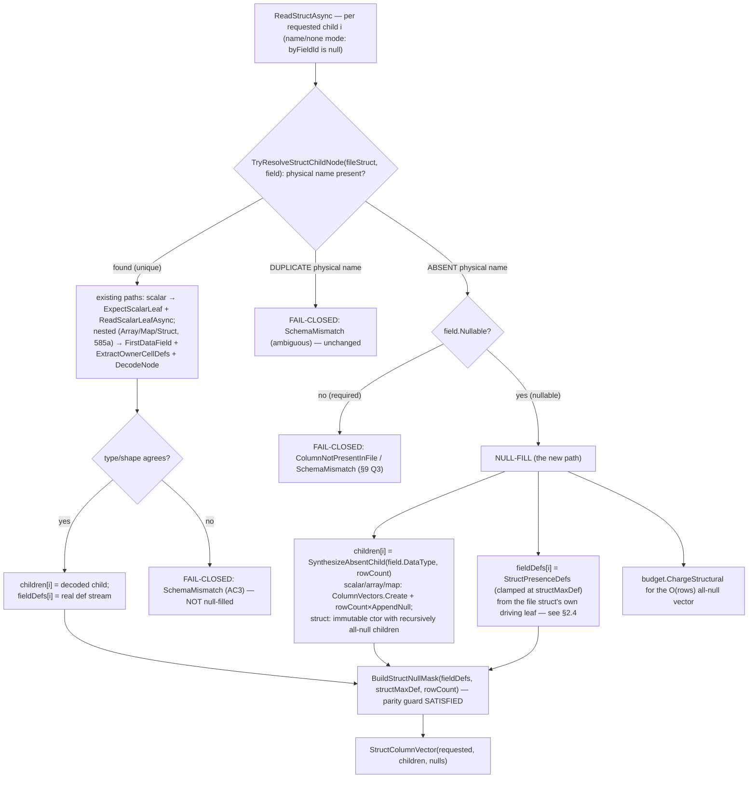

# Nested Parquet reader: null-fill an absent (dropped-then-re-added) nested struct child

> **Status:** Draft.
> **Issue:** [#857](https://github.com/khaines/deltasharp/issues/857) <!-- issue-state:open --> — Nested
> Parquet reader: null-fill an absent (dropped-then-re-added) nested struct child instead of fail-closing
> ([#676](https://github.com/khaines/deltasharp/issues/676) <!-- issue-state:open --> /
> [#840](https://github.com/khaines/deltasharp/issues/840) <!-- issue-state:closed --> follow-up).
> **Author:** delta-storage-format-engineer (orchestrated).
> **Reviewers:** delta-storage-format-engineer, dotnet-vectorized-columnar-compute-engineer,
> reliability-test-chaos-engineer, cloud-native-security-sme, cloud-native-site-reliability-engineer.
> **Last Updated:** 2026-08-25.
> **Related:** [#676](https://github.com/khaines/deltasharp/issues/676) <!-- issue-state:open --> (parent
> nested column-mapping design — recursive `(id, physicalName)` per `StructField`);
> [#840](https://github.com/khaines/deltasharp/issues/840) <!-- issue-state:closed --> (nested rename/drop,
> merged via PR [#852](https://github.com/khaines/deltasharp/pull/852)) — its §3.4 **deferred** this reader
> concern here and its §9.1 recorded the deferral; 585a nested-within-nested recursive decode
> ([#585](https://github.com/khaines/deltasharp/issues/585) <!-- issue-state:closed -->, merged via PR
> [#856](https://github.com/khaines/deltasharp/pull/856)) — the recursive `DecodeNode` this design null-fills
> a nested-typed child through; [#570](https://github.com/khaines/deltasharp/issues/570)
> <!-- issue-state:closed --> (nested `ColumnVector` model — the all-null vectors this design synthesizes);
> [#813](https://github.com/khaines/deltasharp/issues/813) <!-- issue-state:closed --> (required-nested-leaf
> null reject — the fail-closed counterpart this design must NOT relax);
> [#839](https://github.com/khaines/deltasharp/issues/839) <!-- issue-state:closed --> (array/map id-mode —
> the id-mode interior this design leaves out of scope). Read-side null-fill precedent: #497 (top-level
> evolved-column null-fill), #190 (additive schema evolution), #513 (`ColumnNotPresentInFile` kind).

---

## 1 · Overview

Delta **column mapping** decouples a table's *logical* column names from the *physical* names/ids stored in
Parquet. Under that decoupling a **drop** followed by a **re-add of the same logical name** is NOT a reversal:
per #676/#840 (`DeltaTableWriter.AddColumn`/`ColumnMapping`) a re-added child mints a **fresh**
`delta.columnMapping.{id,physicalName}` and strictly increases `maxColumnId` — the dropped id is never reused
(the soundness anchor asserted metadata-only in
`tests/DeltaSharp.Storage.Tests/Delta/NestedRenameDropTests.cs:242`,
`NestedStructChildDrop_ThenReAddSameLogicalName_MintsFreshId_MaxColumnIdStrictlyIncreases_OldDataDoesNotSurface`).
Because the re-added child's `physicalName` **differs** from the dropped child's, **data files written before the
re-add contain no physical column for it**. Reading the re-added logical column against those older files must
therefore return **NULLS** for the pre-re-add rows — the physical column is genuinely *absent*, exactly as an
additively-added **top-level** column is absent from files that predate it.

DeltaSharp already null-fills that top-level case. The scalar read path resolves an absent-but-nullable
requested column to an **Absent slot** (`ParquetFileReader.ResolveFileFields`,
`ParquetFileReader.cs:1527`; the decision at `ParquetFileReader.cs:1729`:
`if (nullFillMissingColumns && requestedField.Nullable) { … ResolvedColumn.Missing(); }`) and materializes it
as an all-null vector (`ParquetFileReader.cs:2058`: *"The requested column is absent from this (older,
narrower) file: materialize it as an all-null column (evolved-column read null-fill, #497)."*). The read
orchestration opens this gate with `nullFillMissingColumns: true` and, when the absent column is instead
**non-nullable**, translates the fail-closed `ColumnNotPresentInFile` into a schema-evolution error rather than
fabricating a value (`DeltaReadSource.cs:386`/`:406`/`:443`).

The **nested** reader does not yet do this. `NestedParquetColumnReader.ReadStructAsync`
(`NestedParquetColumnReader.cs:334`) resolves each requested struct child by physical name through
`ResolveStructChildNode` (`NestedParquetColumnReader.cs:1485`), which is **"duplicate-intolerant,
missing-intolerant"**: when a requested child's physical name is absent from the file struct it **throws**
`DeltaStorageException.SchemaMismatch("Struct column '…' is missing requested field '…' in the file.")`
(`NestedParquetColumnReader.cs:1506`). So a perfectly legal drop→re-add of a nested `struct` child
**fail-closes on read** instead of null-filling — the exact gap #840 §3.4 flagged and §9.1 deferred here.

**This design** makes the nested reader the faithful analogue of the flat reader: a **name-mode** nested
`struct` child whose physical name is **genuinely absent** from a data file, and which is declared **nullable**,
is **null-filled** (all-null child vector for the full requested type — scalar *or* nested subtree) rather than
throwing. Everything else stays **fail-closed**: a **present** child whose type/shape disagrees is still a
`SchemaMismatch` (never coerced); a **duplicate** physical name is still ambiguous and throws; an absent
**non-nullable** child cannot be null-filled and fails closed; **id-mode** interior binding is untouched
(deferred, #839).

**Requirements traceability:** EPIC-05 column mapping / schema evolution; parent #676 (nested `(id,
physicalName)` per `StructField`); #840 §3.4 (the deferred read-back) and §9.1 (the recorded deferral); 585a
(#585, recursive `DecodeNode` — a nested-typed child can now be null-filled as a whole subtree); #497 (the
top-level null-fill precedent this mirrors); #813 (the required-leaf null reject this must not weaken).

**Scope (this issue).** Name mode only; a single absent **struct child** within a **present** file struct; the
absent child's type may be **scalar or nested** (struct/array/map). Out of scope, each fail-closed with a
tracked follow-up: id-mode absent child (§9 Q2 → #839), an absent **non-nullable** child (§9 Q3, fail-closed as
a higher-layer schema-evolution question), and an absent **whole top-level nested column** (§9 Q4 — unchanged;
`ParquetFileReader.cs:1676` still fail-closes that distinct case).

---

## 2 · Logical Architecture

### 2.1 Where the change lands

The behavior change is contained in `NestedParquetColumnReader`: the decode-path child-resolution step in
`ReadStructAsync` (`NestedParquetColumnReader.cs:334`–`:460`), a small non-throwing variant of its resolver,
and the parallel **pre-decode** shape-validation step in `ValidateNode` (reached from
`ParquetFileReader` via `ValidateShape` before any row group is decoded). `ValidateNode` calls the *same*
resolver, so it is updated in lockstep: a **required** absent child fails closed there fast (before decode);
a **nullable** absent child has nothing in the file to validate, so validation is deferred to the decode-path
null-fill. Nothing above the struct boundary changes: the top-level scalar/nested resolution
(`ParquetFileReader.ResolveFileFields`), the row-group decode driver, `DeltaReadSource`, and the
projection/deletion-vector layers are all untouched. This is a **read-path relaxation** — a case that used to
`throw` now returns data.



**Component boundaries.**

| Component | File:line | Responsibility | Change |
|---|---|---|---|
| `ReadStructAsync` | `NestedParquetColumnReader.cs:334` | decode one struct's children; assemble `children[]`, `fieldDefs[]`; build null mask | **modified** — route an absent nullable child to the null-fill branch |
| `ResolveStructChildNode` | `NestedParquetColumnReader.cs:1485` | bind one child by physical name; duplicate-intolerant, missing-intolerant | **split** into a non-throwing `TryResolveStructChildNode` (absent → `false`) + a thin throwing wrapper; the **duplicate** throw stays inside the resolver |
| `BuildStructNullMask` | `NestedParquetColumnReader.cs:467` | cross-field null-mask parity guard | **unchanged code**; consumes the synthesized `fieldDefs[i]` (§2.4) |
| `ExtractOwnerCellDefs` | `NestedParquetColumnReader.cs:929` | owner-cell def extraction (clamped at `structMaxDef`) under a repeated ancestor | **reused** to derive `StructPresenceDefs` |
| `NestedDecodeBudget` | `NestedParquetColumnReader.cs:1321` | shared row-group eager-decode ceiling | **reused** — the synthesized all-null vector is charged O(rows) |
| `ColumnVectors.Create` | `ColumnVectors.cs:26` | build an empty mutable vector for any `DataType` (scalar + nested) | **reused** — `+ rowCount×AppendNull()` = all-null scalar/array/map child; a struct child uses the immutable `StructColumnVector` ctor with recursively all-null children (§2.5) |
| `ValidateNode` (via `ValidateShape`) | `NestedParquetColumnReader.cs` | pre-decode shape validation; calls the same resolver | **modified** — a required absent child fails closed fast (before decode); a nullable absent child is deferred to the decode-path null-fill |

### 2.2 The invariant this design must not violate

`ReadStructAsync` populates two parallel arrays per requested child: `children[i]` (the decoded
`ColumnVector`) and `fieldDefs[i]` (the child's per-owner-cell **definition-level stream**, or `null` for a
required field). After the loop, `BuildStructNullMask(fieldDefs, structMaxDef, rowCount, columnName)`
(`NestedParquetColumnReader.cs:467`) derives the optional struct's per-row null mask **and** enforces a
**cross-field parity guard**: for a nullable struct (`structMaxDef > 0`) it picks the first non-null
`fieldDefs` entry as the driver, computes `structNull = drivingDef[r] < structMaxDef` per row, and requires
**every** field to agree: `(fieldDef[r] < structMaxDef) != structNull` throws `CorruptData` (a crafted stream
where one field says "struct present" while another says "struct null" would otherwise decode a phantom value
under a null struct).

The invariant a synthesized absent child MUST preserve:

> **INV-PARITY.** For every row `r`, the absent child's `fieldDefs[i][r]` must report the *same struct
> presence* as every present sibling: `>= structMaxDef` where the struct is present, `< structMaxDef` where the
> struct is null. Its **value** is null at every row regardless (absent physical column ⇒ no value), which is
> correct for both present-struct rows (child is null because it is absent) and null-struct rows (the whole
> struct cell is masked null).

INV-PARITY is what §2.4 delivers. It is the crux of this design.

### 2.3 The null-fill decision — where absent diverges from mismatch (AC3)

The resolver `ResolveStructChildNode` distinguishes three outcomes today:

1. **Exactly one** file field with the requested physical name → return it (present).
2. **More than one** → `SchemaMismatch` (ambiguous duplicate; `NestedParquetColumnReader.cs:1495`).
3. **None** → `SchemaMismatch("… is missing requested field …")` (`NestedParquetColumnReader.cs:1506`).

Only outcome **3** — a **genuinely absent physical name** — becomes eligible for null-fill. This design
replaces the resolver with a non-throwing `TryResolveStructChildNode(fileStruct, field, columnName, out Field?
childNode)`:

- outcome **1** → `out childNode = match; return true;`
- outcome **2** → **still throws** (ambiguity is not absence; duplicate-child guard stays intact);
- outcome **3** → `out childNode = null; return false;` (absent — the *caller* decides).

`ReadStructAsync` then decides at the call site (name/none mode, `byFieldId is null`):

```
if (!TryResolveStructChildNode(fileStruct, field, columnName, out Field? childNode))
{
    // ABSENT physical name.
    if (!field.Nullable)
        throw DeltaStorageException.ColumnNotPresentInFile(childContext);   // §9 Q3 — required, fail-closed
    // nullable + absent → NULL-FILL (§2.4/§2.5)
    children[i]  = SynthesizeAbsentChild(field.DataType, rowCount, budget, childContext);
    fieldDefs[i] = StructPresenceDefs(...);   // §2.4
    continue;
}
// PRESENT: unchanged routing — scalar leaf or 585a nested recurse; a type/shape disagreement here
// still throws SchemaMismatch (AC3), never null-fills.
```

This placement is load-bearing for **AC3**: the null-fill branch is reached **only** when the physical name is
absent — *before* any `ExpectScalarLeaf`/`ValidateShape`/`DecodeNode` runs. A **present** child with a
disagreeing physical type or container shape flows into the existing routing and fails closed exactly as
today; a genuine absence and a genuine mismatch are never conflated.

### 2.4 How `fieldDefs` are synthesized (the crux)

An absent child has **no** definition stream in the file, yet INV-PARITY requires one that mirrors the struct's
presence. The presence pattern is a property of the **struct**, not of any one child, so it can be read from
**any** physical leaf under the struct. The design derives a single **`StructPresenceDefs`** — one value per
owner cell, clamped at `structMaxDef` — from the **file struct's own driving leaf** and clones it into each
absent child's `fieldDefs[i]`:

```
int[]? StructPresenceDefs(fileStruct, structMaxDef, structMaxRep, parentMaxDef, parentMaxRep, rowCount, budget):
    if (structMaxDef == 0)                       // REQUIRED struct: no null mask exists
        return null;                             //   → required-field semantics; BuildStructNullMask early-returns null
    DataField driving = FirstDataField(fileStruct);              // first physical leaf UNDER the struct (a present sibling)
    (_, def, rep, numValues) = ReadScalarLeafAsync(rowGroup, driving, FirstScalarType(...), presentFloor:0, budget);
    if (structMaxRep == 0)                        // TOP-LEVEL struct: one value per row
        return ClampAt(def, structMaxDef, rowCount);             //   def[r] → min(def[r], structMaxDef)
    else                                          // UNDER A REPEATED ANCESTOR: one value per owner cell
        return ExtractOwnerCellDefs(def, rep, numValues, structMaxDef, parentMaxDef, parentMaxRep, rowCount, ctx);
```

Why this is exactly correct for both null-mask paths:

- **Top-level struct** (`structMaxRep == 0`). Present siblings store their **raw** `scalarDef` into
  `fieldDefs[i]` (`NestedParquetColumnReader.cs:439`). The parity guard compares `fieldDef[r] < structMaxDef`.
  A present sibling's raw def is `structMaxDef` (struct present, field null) or `structMaxDef+1` (field
  present) or `< structMaxDef` (struct null). `StructPresenceDefs` clamps the driving leaf's def to
  `min(def[r], structMaxDef)`: on a present-struct row it yields exactly `structMaxDef` (`< structMaxDef` is
  **false** = struct present ✓); on a null-struct row it yields `< structMaxDef` (**true** = struct null ✓).
  Parity holds against every sibling.
- **Under a repeated ancestor** (`structMaxRep > 0`, `underRepeatedAncestor`). Present siblings run through
  `ExtractOwnerCellDefs` (`NestedParquetColumnReader.cs:432`), which already **clamps at `structMaxDef`**
  (`owned[owner] = Math.Min(d, structMaxDef)`, `NestedParquetColumnReader.cs:953`). `StructPresenceDefs` uses
  the **same** `ExtractOwnerCellDefs` call, so the absent child's stream is byte-for-byte the shape a present
  sibling would produce for the struct's presence. Parity holds by construction.

**Projection-independence.** Deriving presence from the file struct's own leaf (rather than "borrow a present
requested sibling's `fieldDefs`") makes null-fill correct even when the absent child is the **only** projected
field. In that case there is no requested sibling to drive `BuildStructNullMask`; without `StructPresenceDefs`
the mask would default to "all present" and a genuinely null struct row would be mis-reported. Reading one leaf
under the struct recovers the true presence regardless of projection. (When ≥1 present sibling is also
projected, the design MAY reuse that sibling's already-computed clamped stream as an optimization; the
canonical rule is the file-struct driving leaf so correctness never depends on projection shape.)

**Degenerate guard.** `FirstDataField(fileStruct)` throws `CorruptData` for a zero-leaf struct
(`NestedParquetColumnReader.cs:1519`-ish, "no reachable scalar leaf"). A struct present in the file always has
≥1 physical leaf, so this only fires on a corrupt/empty footer — fail-closed, correct.

**Required-struct shortcut.** When `structMaxDef == 0` the struct is required, `BuildStructNullMask`
early-returns `null` (`NestedParquetColumnReader.cs:470`), and no presence stream is consulted. The design sets
`fieldDefs[i] = null` (required-field semantics) and reads **no** extra leaf. The comment on `fieldDefs`
(`NestedParquetColumnReader.cs:368`, *"null if required"*) and the `BuildStructNullMask` inner note (*"a field
inside a nullable struct always carries a definition stream"*) are **amended** to add: *"…or a synthesized
absent child (null-filled): under a required struct it is `null` (required-field semantics); under a nullable
struct it carries a `StructPresenceDefs` clone so INV-PARITY holds."*

### 2.5 Synthesizing the all-null child value (scalar AND nested)

`SynthesizeAbsentChild(DataType type, int rowCount, budget, ctx)` builds an all-null vector for **any**
requested child type via the existing factory (`ColumnVectors.Create`, `ColumnVectors.cs:26`) plus `rowCount`
null commits:

```
MutableColumnVector v = ColumnVectors.Create(type, Math.Max(rowCount, 1));
for (int r = 0; r < rowCount; r++) v.AppendNull();
return v;
```

- **Scalar child** (`long`, `string`, `decimal`, …) → an all-null fixed/variable-width vector — the direct
  analogue of the flat path's `for (…) vector.AppendNull();` (`ParquetFileReader.cs:2064`).
- **Nested child** (`struct` / `array` / `map`, now decodable via 585a's recursive `DecodeNode`). An absent
  physical column means the **entire subtree** is absent, so **every** cell is null, and **no interior leaf is
  touched or read**. An **array**/**map** builds directly through `ColumnVectors.Create` + `rowCount`×
  `AppendNull()`: a null list/map has no elements/entries, so `AppendNull` commits a null cell with no interior
  values. A **struct**, however, cannot be committed via a standalone `AppendNull()` — `StructColumnVector`
  requires every field child already populated (each struct row carries one cell per child, even a null-struct
  row: `StructColumnVector.AppendNull` throws on length-0 children). So a struct is built via its **immutable
  constructor with recursively all-null children** (`BuildAllNullSubtree`): each child lane is itself an
  all-null subtree, and a `bool[rowCount]` all-true null mask marks every owner cell null. This still reads no
  file leaf and stays O(rows) per level (the recursion is over the *declared* subtree shape, bounded by
  `MaxNestedReadDepth`, not over any file data). The interior children of an all-null nested vector need no
  values because every owner cell is null.

Crucially, a **nested absent child never recurses into `DecodeNode`/`ReadScalarLeafAsync`** for its interior —
there is no physical column to decode — so it neither reads nor charges any file **leaf** beyond the single
`StructPresenceDefs` driving leaf (§2.4). The *file-read* cost is therefore **O(rows)** (independent of the
absent subtree's leaf count); the transient **allocation** is O(rows × subtree-width) — the immutable
`StructColumnVector` ctor requires every declared child lane populated at `Length == rowCount` — and is
charged in full (§2.6). `BuildAllNullSubtree`/`AbsentCellWidth` recurse over the **declared** subtree shape and
fail closed (`UnsupportedFeature`) past `MaxNestedReadDepth`, matching the sibling `DecodeNode`/`ValidateNode`
guards, so a programmatically-constructed deep requested type cannot recurse unbounded into a `StackOverflow`.

**Presence-stream memoization.** The struct's presence pattern is a property of the **struct**, not of any one
absent child, so `StructPresenceDefs` is computed **at most once per `ReadStructAsync`** and the resulting
(read-only) stream is shared by every absent child of that struct. Without this, a wide drop-then-re-add (N
absent children in one struct) would re-decode **and re-charge the budget for** the same driving leaf N times —
which both wastes I/O and can spuriously exhaust the shared decode ceiling, failing *valid* data closed.

### 2.6 Budget charging for the synthesized vector

The synthesized vector is transient reconstruction state and MUST be charged against the shared
`NestedDecodeBudget` ceiling like every other nested allocation, so a projection of many wide absent children
cannot escape the ceiling. The design charges O(rows) per synthesized child:

- **Scalar absent child:** `budget.ChargeStructural(rowCount, perCellBytes, ctx)` where `perCellBytes` is an
  **upper bound** on the all-null slot: the value lane's element width + one validity byte. For a variable-width
  string/binary the managed backing store speculatively allocates BOTH a data lane (8 bytes/cell) AND an offset
  lane (`sizeof(int)`/cell) up-front even though an all-null vector writes no payload, so **both** lanes are
  counted (`ScalarLaneWidth` returns `8 + sizeof(int)` for string/binary) — otherwise the ceiling would be
  under-charged for a wide absent string projection.
- **Nested absent child:** charge the per-row null-mask/validity width **summed over the requested subtree**
  (each `Struct`/`List`/`Map` level contributes its own per-row validity slot; a `List`/`Map` adds a per-row
  offset). The subtree depth is bounded by `MaxNestedReadDepth = 64` (`NestedParquetColumnReader.cs:97`) — and
  `AbsentCellWidth` **enforces** it (fail-closed `UnsupportedFeature` past the bound), not merely relies on the
  upstream schema-parse cap — so the charge is O(rows × depth) = O(rows) with a small constant. Because every
  interior cell is null, **no** per-value payload term is charged.

The `StructPresenceDefs` driving-leaf read is charged by the existing `ReadScalarLeafAsync` path (it is a
normal present leaf), and — per the memoization above — **once** per struct regardless of how many children are
absent. No new uncharged allocation is introduced.

---

## 3 · Functional Test Scenarios

**Oracle & harness.** Name mode only. Tests author the nested data files with the **merged real nested writer**
(#834) and pair them with a **hand-authored `_delta_log`** (the existing nested-read fixture idiom in
`tests/DeltaSharp.Storage.Tests/`), then read through `DeltaReadSource`/`NestedParquetColumnReader`. Same-typed
siblings draw values from **disjoint domains** so a positional mis-bind cannot pass on equal values. Every
fail-closed case asserts the **exact exception kind** (`SchemaMismatch` / `ColumnNotPresentInFile` /
`CorruptData`) and a **sanitized** message (no raw physical/logical name). The seeded property harness reuses
`tests/Shared/TestSeed.cs` at the house-precedent **200** iterations.

### 3.1 · AC1 — absent nullable nested struct child null-fills (not fail-closed)

1. `NestedStructChild_NameMode_AbsentPhysicalName_NullFills` — a `struct<a:long, b:string>` column written to a
   file that physically contains **only** `a` (the `b` physical name is absent from the footer). Read the
   struct requesting both `a` and `b`. **Assert:** no exception; `a` reads its real values; **`b` reads all
   NULL** across every row; the struct's own presence is correct (present-struct rows are present, null-struct
   rows null). Directly mirrors the top-level absent-column null-fill (`ParquetFileReader.cs:2058`).
2. `NestedStructChild_AbsentPhysicalName_StructNullMaskCorrect_UnderNullableStruct` — the same, with a
   **nullable** struct whose rows mix *null struct*, *present struct with present `a`*, and *present struct
   with null `a`*. **Assert:** the synthesized `StructPresenceDefs` (§2.4) drives `BuildStructNullMask` to the
   correct per-row mask **and** the parity guard does **not** trip; `b` is null on every present-struct row and
   the whole cell is null on every null-struct row.
3. `NestedStructChild_AbsentIsOnlyProjectedField_StructNullMaskStillCorrect` — projection requests **only** the
   absent child `b`. **Assert:** the mask is still correct (projection-independence, §2.4) — a genuinely null
   struct row reads null, a present-struct row reads null-`b`; proves presence is read from the file struct's
   own driving leaf, not a requested sibling.

### 3.2 · AC2 — drop → re-add (same logical name) → data read-back

4. `NestedStructChildDrop_ThenReAdd_OldFileRows_ReadBackNull_NewRows_ReadValues` — the end-to-end #840 §3.4
   scenario as a **real read**: (v0) write `struct<city:string, zip:long>` with real `zip` values; (v1) drop
   `address.zip`; (v2) re-add `address.zip` (fresh id + physicalName, `maxColumnId` strictly increases) as a
   metadata-only commit; (v3) append a **new** data file that physically carries the re-added `zip`'s new
   physical name with values. Read the v2/v3 table. **Assert:** rows from the **old (v0) file** read
   `address.zip` as **NULL** (its old physical name is not the re-added one; the new physical name is absent
   from the old file → null-fill), while rows from the **new file** read the **new values** — the pre/post
   split AC2 demands.
5. `NestedStructChildReAdd_ReadsNewValues_DoesNotResurrectDroppedData` — asserts the null-filled old rows carry
   NULL, **not** the dropped column's stale bytes (the tampering-guard read-back companion to §3.4's
   metadata-only assertion; ties to §6 Tampering).

### 3.3 · AC3 — genuine shape/type mismatch stays FAIL-CLOSED

6. `NestedStructChild_PresentButTypeMismatch_FailsClosed` — the child physical name **is present** but its
   physical type disagrees (file `zip` is `int32`, requested `string`). **Assert:** `SchemaMismatch` (via
   `ExpectScalarLeaf`), **not** null-fill — the child is present, so the absent branch is never taken.
7. `NestedStructChild_PresentButShapeMismatch_FailsClosed` — the child physical name is present but the file
   shape disagrees (file `child` is a scalar, requested `struct<…>`, or vice-versa). **Assert:**
   `SchemaMismatch` (via `ValidateShape`/`ExpectStruct`), **not** null-fill.
8. `NestedStructChild_DuplicatePhysicalName_FailsClosed` — two file fields share the requested physical name.
   **Assert:** `SchemaMismatch` ("more than one file field named …"; `NestedParquetColumnReader.cs:1495`) — the
   duplicate-child guard is intact; a duplicate is **ambiguous**, never treated as absent.
9. `NestedStructChild_CraftedDefStreamDisagreesOnStructPresence_FailsClosed` — a crafted file where a **present**
   sibling's def stream disagrees with the struct presence at a row. **Assert:** `BuildStructNullMask`'s parity
   guard still throws `CorruptData` — the synthesized absent child's presence stream does not mask a genuine
   crafted-Dremel disagreement among **present** fields.

### 3.4 · nested-typed absent child null-fill (scalar AND nested, §2.5)

10. `NestedStructChild_AbsentNestedStructChild_NullFillsWholeSubtree` — the absent child is itself a
    `struct<x:int, y:string>` (585a). **Assert:** the child reads as an all-null `StructColumnVector` (every
    row null, no interior leaf read), and no `DecodeNode` recursion into its interior occurs.
11. `NestedStructChild_AbsentArrayChild_NullFills` and `NestedStructChild_AbsentMapChild_NullFills` — the absent
    child is `array<int>` / `map<string,long>`. **Assert:** all-null `ListColumnVector`/`MapColumnVector`; the
    subtree is never decoded.

### 3.5 · required (non-nullable) absent child — fail-closed (§9 Q3)

12. `NestedStructChild_AbsentButNonNullable_FailsClosed` — the absent child is declared **non-nullable**.
    **Assert:** `ColumnNotPresentInFile` (a required lane cannot carry null) — the flat analogue's fail-closed
    posture (`ParquetFileReader.cs:1729` requires `requestedField.Nullable`; `DeltaReadSource.cs:406` maps it to
    a schema-evolution error). Adding a required column to a table with existing rows is a higher-layer
    schema-evolution violation, so an absent required child at read time is a genuine incompatibility, not a
    null-fill.

### 3.6 · repeated-ancestor path (`underRepeatedAncestor`) and budget

13. `NestedStructChild_AbsentUnderRepeatedAncestor_NullFills_ParityHolds` — an absent nullable scalar child of a
    struct nested **under a repeated ancestor** (`array<struct<a:long, b:string>>` where `b` is physically
    absent, `structMaxRep > 0`). **Assert:** the synthesized `StructPresenceDefs` is built via
    `ExtractOwnerCellDefs` (clamped at `structMaxDef`), one cell per present owner element; `b` reads null per
    element; the parity guard holds; owner-cell counts reconcile.
13b. `ExtractOwnerCellDefs_NullStructOwnerCell_UnderRepeatedAncestor_ReportsAbsent` — the parity crux under a
    repeated ancestor: a present list element whose **struct is null** (`parentMaxDef ≤ d < structMaxDef`) must
    report `def < structMaxDef` so `BuildStructNullMask` marks that owner cell null, byte-identically to a
    present sibling. **Assert:** the clamp preserves the null-struct owner cell as absent (kills a regression
    that over-reports presence under a repeated ancestor). A direct unit test of `ExtractOwnerCellDefs`.
13c. `NestedAbsentChild_EmptyRowGroup_NullFillComposesWithoutThrowing` — a zero-row file
    (`rowCount == 0`): `SynthesizeAbsentChild`'s `Math.Max(rowCount, 1)` capacity + 0-iteration append loop and
    the length-0 `StructColumnVector` composition must not throw; any produced batch exposes the absent child at
    length 0.
13d. `NestedAbsentChild_Budget_ChargedAndBounded` — a wide projection of many absent children; a crafted tiny
    ceiling fails closed (`CorruptData`) while the default ceiling admits it. Also exercises presence-stream
    memoization (the driving leaf is charged once, not once per absent child).
14. `NestedAbsentChild_Budget_ChargedAndBounded` — a wide projection of many absent children over a large row
    group. **Assert:** each synthesized vector is charged O(rows) against `NestedDecodeBudget`; a crafted
    row-count/ceiling that would overflow fails closed with `CorruptData` (ceiling breach), never OOMs; a normal
    row group stays well under the default ceiling.

### 3.7 · AC4 — upgrade #840 §3.4 to a real read-back

15. **Upgrade `NestedStructChildDrop_ThenReAddSameLogicalName_MintsFreshId_MaxColumnIdStrictlyIncreases_OldDataDoesNotSurface`**
    (`tests/DeltaSharp.Storage.Tests/Delta/NestedRenameDropTests.cs:242`). Today it asserts identity metadata
    only, with the comment (`:296`) *"a read null-fill of a newly-added NESTED child is a separate #676 reader
    concern, so this is asserted at the metadata level rather than via a read-through."* This design **closes**
    that concern: extend the test (or add a paired `…_OldFileReadsBackNull` test beside it) to **read the old
    v0 data file through the v2 schema** and assert `address.zip` reads **NULL** for the old rows — the
    metadata-level identity assertion plus a real read-back. Remove/replace the deferral comment with a
    reference to #857.

**AC → scenario coverage.** AC1 → §3.1 (1,2,3); AC2 → §3.2 (4,5); AC3 → §3.3 (6,7,8,9); AC4 → §3.7 (15).
Nested-typed null-fill → §3.4 (10,11); required fail-closed → §3.5 (12); repeated-ancestor + budget → §3.6
(13,14).

---

## 4 · Performance

The null-fill path is **minimal and bounded**:

- **Synthesized value vector:** O(rows) all-null cells for a scalar child; O(rows × subtree-depth) for a nested
  child (depth ≤ `MaxNestedReadDepth = 64`), because every interior cell is null and no interior leaf is read.
  This is strictly **cheaper** than decoding a present child (no page decode, no decompression, no per-value
  conversion).
- **`StructPresenceDefs`:** one extra driving-leaf read **per struct that has ≥1 absent nullable child** — and
  only when the struct is nullable (`structMaxDef > 0`). When a present sibling is also projected, its clamped
  stream MAY be reused instead (§2.4), eliminating even that read. The presence array is O(rows).
- **Allocation & budget:** every synthesized vector is charged O(rows) against the shared `NestedDecodeBudget`
  ceiling (§2.6), so a wide absent-child projection cannot exceed the row-group decode budget and cannot OOM on
  a crafted row count. No new unbounded allocation exists.
- **No pruning/statistics interaction:** an absent nested child carries no column-chunk statistics, exactly as
  an absent top-level column does (`ParquetFileReader.cs:2664`), so file pruning is unaffected. There is no
  change to row-group sizing, encodings, or footer handling.

No benchmark gate is added; the change removes a throw and substitutes cheaper-than-decode work.

---

## 5 · Security

- **No fabricated values, no coercion.** Null-fill produces only NULLs for a genuinely absent physical column;
  it never invents a value and never coerces a present-but-mismatched column. A present child with a
  disagreeing type/shape still fails closed (`SchemaMismatch`), so a foreign/hostile footer cannot smuggle a
  type-confused value in through the absent path (§2.3, AC3).
- **Message hygiene (#683).** The absent/fail-closed messages sanitize every logical/physical name via
  `DiagnosticText.Sanitize` (as the existing resolver messages already do,
  `NestedParquetColumnReader.cs:1495`/`:1506`); attacker-authored `metaData.schemaString` names remain pure
  diagnostic labels.
- **Bounded decode.** The synthesized vector and the single presence-leaf read are charged against the shared
  `NestedDecodeBudget`; a crafted row count cannot drive an unbounded allocation (§2.6, §6 DoS).
- **Fail-closed default preserved.** The relaxation is gated on **three** conjuncts — name/none mode
  (`byFieldId is null`) **∧** genuinely absent physical name **∧** requested child nullable. Any other
  combination retains today's throw.

---

## 6 · Threat Model (STRIDE)

Trust boundary: a **foreign/untrusted Parquet file + `_delta_log`** decoded by the nested reader. The central
concern is that relaxing a throw to a null-fill must not let a **type-confused or stale physical column
resurface**.

| Category | Threat | Vector | Mitigation |
|---|---|---|---|
| **Spoofing** | a foreign file presents a differently-typed column under the re-added child's physical name | present-but-mismatch masquerades as the re-added child | The null-fill branch fires **only** on a *genuinely absent* physical name (`TryResolveStructChildNode` → `false`); a **present** name always routes to `ExpectScalarLeaf`/`ValidateShape` and fails closed on type/shape mismatch (§2.3, AC3). Absence and mismatch are never conflated. |
| **Tampering** | a crafted footer keeps the **dropped** child's old physical column so the re-added logical name reads stale data | drop→re-add aliasing | Re-add mints a **fresh** `physicalName` (#840 §3.4), so the re-added logical name resolves by the **new** physical name, which is absent from old files → null-fill. The old physical column, if still present, is **not requested** (its logical name is gone) and is never bound. Stale data cannot resurface (§3.2 scenario 5). |
| **Tampering** | crafted per-field def streams disagree on struct presence to decode a phantom value | hand-authored Dremel levels | `BuildStructNullMask`'s cross-field parity guard is **unchanged** and still throws `CorruptData` when present fields disagree; the synthesized absent child's presence stream is a **clamped clone** of the struct's own presence, so it cannot mask a genuine disagreement among present fields (§3.3 scenario 9). |
| **Repudiation** | — | n/a (read path; no state mutation) | Reads are side-effect-free; existing read observability applies (§7). |
| **Information disclosure** | null-fill leaks another column's bytes | reading an absent column | An absent physical column is **never decoded**; only NULLs are produced. No byte of any other column is read into the absent child (§2.5). |
| **Denial of service** | a crafted row count / wide absent projection forces an unbounded all-null allocation | large `rowCount` × many absent children | Every synthesized vector and the presence-leaf read are charged O(rows) against `NestedDecodeBudget`; a ceiling breach fails closed with `CorruptData` before allocation (§2.6, §3.6 scenario 14). Subtree depth is bounded by `MaxNestedReadDepth = 64`. |
| **Elevation of privilege** | an absent **required** child is null-filled, weakening the required-lane guard (#813) | non-nullable absent child | The absent branch null-fills **only** when the child is nullable; an absent **non-nullable** child fails closed (`ColumnNotPresentInFile`, §3.5). The #813 required-nested-leaf null reject (`RejectNullInRequiredNestedLeaf`) is untouched — a **present** required leaf carrying null still throws. |

---

## 7 · Observability

- **No new success telemetry.** A null-filled absent child is an ordinary read outcome (as top-level
  null-fill already is); it emits nothing new. Existing read-path counters/spans (`DeltaReadSource`) cover the
  read.
- **Fail-closed classification is stable and matchable.** The three fail-closed kinds are the existing,
  kind-typed ones the higher layers already match on: `SchemaMismatch` (type/shape/duplicate),
  `ColumnNotPresentInFile` (absent required — #513, matched by `DeltaReadSource.IsNarrowSchemaEvolutionInput`,
  `DeltaReadSource.cs:443`, and surfaced as `DeltaReadSchemaEvolutionException`), and `CorruptData` (parity /
  budget breach). No new error kind is introduced, so alerting/dashboards keyed on `StorageErrorKind` need no
  change.
- **Diagnostics.** All messages are `DiagnosticText.Sanitize`d (§5); a required-absent read surfaces the same
  actionable schema-evolution message as the flat path (`DeltaReadSchemaEvolutionException`), naming only the
  file path the reader already exposes and the bounded kind, never attacker-authored schema names.

---

## 8 · Rollout & Risk

- **Behavior change (read path):** a case that previously **threw**
  `SchemaMismatch("… is missing requested field …")` now **returns NULLs** (for an absent *nullable* nested
  struct child). This is **backward-compatible for previously-throwing reads**: any read that succeeds today is
  unchanged (a present child still decodes identically; a present mismatch still throws; a duplicate still
  throws); only reads that previously **failed** now succeed with null-fill. No table on disk changes; no
  migration.
- **Behind the existing nested read.** The change lives entirely inside `NestedParquetColumnReader`, reached
  only when a nested column is read (the merged #676/#585a surface). Flat reads are untouched.
- **Risk (a) — over-relaxation** (an absent path masking a genuine mismatch): mitigated by gating null-fill on
  a *genuinely absent* physical name **before** any type/shape validation, and by keeping the duplicate guard
  and all `ExpectScalarLeaf`/`ValidateShape` checks on the present path (§2.3, AC3; §3.3).
- **Risk (b) — null-mask corruption** (a synthesized presence stream mis-driving `BuildStructNullMask`):
  mitigated by deriving presence from the file struct's own driving leaf with the **same** clamping the present
  paths use (§2.4), and by leaving the parity guard code unchanged (§3.1, §3.3).
- **Risk (c) — required-lane weakening** (#813): mitigated by null-filling only nullable children and leaving
  `RejectNullInRequiredNestedLeaf` untouched (§3.5, §6 EoP).
- **Risk (d) — budget escape** (wide absent projection): mitigated by charging every synthesized vector O(rows)
  (§2.6, §3.6).
- **Rollback:** revert to the throwing `ResolveStructChildNode`; no persisted state depends on the new
  behavior.

---

## 9 · Open Questions & Decisions

1. **Synthesized `fieldDefs` for the parity guard — RESOLVED (§2.4).** An absent nullable child's `fieldDefs[i]`
   is a **clamped clone of the struct's own presence stream** (`StructPresenceDefs`), read from the file
   struct's own driving leaf and clamped at `structMaxDef` (top-level: `min(def, structMaxDef)`; under a
   repeated ancestor: `ExtractOwnerCellDefs`, which already clamps). This satisfies INV-PARITY against every
   present sibling in **both** null-mask paths and is projection-independent (correct even when the absent child
   is the only projected field). Under a **required** struct (`structMaxDef == 0`) it is `null` (required-field
   semantics; `BuildStructNullMask` early-returns) and no extra leaf is read. The `fieldDefs` "null if
   required" comment and the `BuildStructNullMask` "always carries a def stream" note are amended to cover the
   synthesized-absent case.
2. **Id-mode absent child — RESOLVED: out of scope, fail-closed, tracked (#839).** The null-fill fires only in
   name/none mode (`byFieldId is null`). An id-mode struct child is bound by `ResolveStructFieldById`; an absent
   id there stays fail-closed (unchanged), consistent with #840's name-mode-only door and #839's id-mode
   interior work. Id-mode write is fail-closed everywhere, so an id-mode drop→re-add read-back is not yet
   reachable; when #839 lands, id-mode absent-child null-fill is a straightforward follow-up applying the same
   §2.4 synthesis keyed by id.
3. **Absent NON-nullable (required) re-added child — RESOLVED: fail-closed.** A required column added to a table
   with existing rows is a schema-evolution question the write/metadata layer disallows (a required lane cannot
   carry the null the older rows would need). At read time an absent required child therefore signals a genuine
   incompatibility: fail closed with `ColumnNotPresentInFile` (mirroring the flat gate
   `nullFillMissingColumns && requestedField.Nullable`, `ParquetFileReader.cs:1729`; surfaced as
   `DeltaReadSchemaEvolutionException` via `DeltaReadSource.cs:406`). Only an **absent nullable** child
   null-fills (§3.5).
4. **Absent WHOLE top-level nested column — RESOLVED: unchanged, out of scope.** #857 addresses an absent
   **child** within a **present** file struct. An absent *whole* top-level nested column remains fail-closed at
   `ParquetFileReader.cs:1676` (*"A nested column absent from the file is not null-filled in this increment"*).
   Extending top-level nested null-fill (build an all-null nested container from the requested type) is a
   natural but **separate** increment; flag as a follow-up if a top-level nested column is ever dropped→re-added
   and read. This design does not change that site.
5. **RESOLVED (R2) — reuse across absent children via memoization.** §2.4 mandates the driving-leaf read for
   correctness (projection-independence). The implementation computes `StructPresenceDefs` **once per
   `ReadStructAsync`** and shares the (read-only) stream across every absent child of the struct, so a wide
   drop-then-re-add does not re-decode or re-charge the same driving leaf N times (which could otherwise
   spuriously exhaust the decode budget and fail valid data closed). Reuse of a *present projected sibling's*
   already-clamped stream remains an optional further micro-optimization, not required for correctness.
6. **RESOLVED (R2) — nested absent child budget granularity.** §2.6 charges a conservative per-cell **upper
   bound** summed over the requested subtree (`AbsentCellWidth`), including — for variable-width string/binary —
   BOTH the speculative data lane and the offset lane the backing store allocates up-front, so the ceiling is
   never under-charged. `AbsentCellWidth`/`BuildAllNullSubtree` **enforce** `MaxNestedReadDepth` (fail-closed
   `UnsupportedFeature` past the bound), matching the sibling `DecodeNode`/`ValidateNode` guards rather than
   relying solely on the upstream schema-parse cap.

---

## 10 · References

- Issue [#857](https://github.com/khaines/deltasharp/issues/857) <!-- issue-state:open --> (this design).
- Deferred-from: [#840](https://github.com/khaines/deltasharp/issues/840) <!-- issue-state:closed --> nested
  rename/drop (merged via PR [#852](https://github.com/khaines/deltasharp/pull/852)), §3.4 (the drop→re-add
  identity test that deferred this read-back) and §9.1 (the recorded deferral);
  `docs/engineering/design/nested-rename-drop.md`.
- Parent design: `docs/engineering/design/nested-column-mapping.md`
  ([#676](https://github.com/khaines/deltasharp/issues/676) <!-- issue-state:open -->) — recursive
  `(id, physicalName)` per `StructField`, containment-scoped resolution.
- 585a recursive nested decode: `docs/engineering/design/nested-within-nested.md`
  ([#585](https://github.com/khaines/deltasharp/issues/585) <!-- issue-state:closed -->, merged via PR
  [#856](https://github.com/khaines/deltasharp/pull/856)) — the recursive `DecodeNode` a nested-typed absent
  child is null-filled through.
- Nested `ColumnVector` model: [#570](https://github.com/khaines/deltasharp/issues/570)
  <!-- issue-state:closed --> — `StructColumnVector`/`ListColumnVector`/`MapColumnVector`, the all-null vectors
  synthesized here.
- Required-nested-leaf null reject: [#813](https://github.com/khaines/deltasharp/issues/813)
  <!-- issue-state:closed --> — the fail-closed guard (`RejectNullInRequiredNestedLeaf`) this design must not
  relax (§6 EoP, §9 Q3).
- Array/map id-mode: [#839](https://github.com/khaines/deltasharp/issues/839) <!-- issue-state:closed --> — the
  id-mode interior left out of scope (§9 Q2).
- Nested CDF/column-mapping oracle: [#675](https://github.com/khaines/deltasharp/issues/675)
  <!-- issue-state:open --> — downstream consumer of nested null-fill read-through.
- Source sites: `src/DeltaSharp.Storage/Parquet/NestedParquetColumnReader.cs`
  (`ReadStructAsync` :334, `BuildStructNullMask` :467, `ExtractOwnerCellDefs` :929,
  `RejectNullInRequiredNestedLeaf` :1152, `NestedDecodeBudget` :1321, `ResolveStructChildNode` :1485/:1506,
  `MaxNestedReadDepth` :97); `src/DeltaSharp.Storage/Parquet/ParquetFileReader.cs`
  (`ResolveFileFields` :1527, top-level nested-absent fail-close :1676, scalar null-fill decision :1729,
  scalar all-null materialization :2058); `src/DeltaSharp.Storage/Reading/DeltaReadSource.cs`
  (null-fill orchestration :386/:406, `IsNarrowSchemaEvolutionInput` :443);
  `src/DeltaSharp.Engine/Columnar/ColumnVectors.cs` (`Create` :26);
  `src/DeltaSharp.Engine/Columnar/StructColumnVector.cs` (`AppendNull` :321);
  test to upgrade: `tests/DeltaSharp.Storage.Tests/Delta/NestedRenameDropTests.cs:242` (AC4).
- Read-side null-fill precedent: #497 (top-level evolved-column null-fill), #190 (additive schema evolution),
  #513 (`ColumnNotPresentInFile` kind), #683 (message hygiene).
