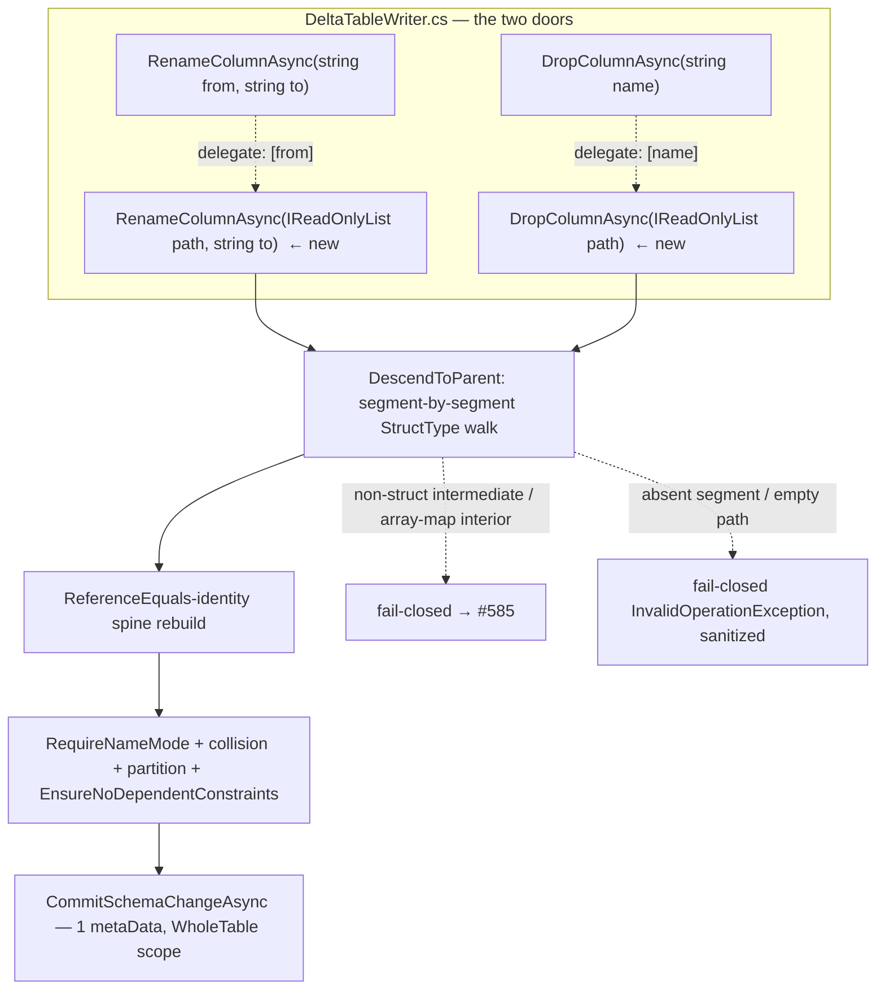
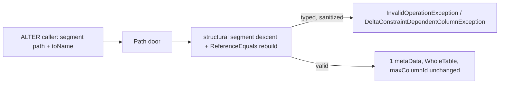

# Nested column mapping: metadata-only rename/drop of nested struct fields (segment-array addressing)

> **Status:** Draft — **round-1 (design only; no production code).** This design implements the rename/drop
> door that the merged parent design [#676](https://github.com/khaines/deltasharp/issues/676)
> <!-- issue-state:open --> **pre-specified** but deferred: metadata-only rename/drop of a **nested
> `struct<scalars>` child** addressed by a **segment array** (never a dotted string). It honors the parent's
> C1 invariant (§2.2), containment-scoped resolution model (§2.5), and the §3.32 conjunctive no-rewrite
> assertion verbatim (reproduced here as §3.1, the centerpiece). Nested Parquet **write** and the structured
> `ColumnPathKey` addressing this design depends on are **merged**: nested write via PR #834's
> `WriteAllPartsAsync` (issue #828 <!-- issue-state:closed --> closed), `ColumnMappingIdentity` structured
> `ColumnPathKey` ([#830](https://github.com/khaines/deltasharp/issues/830) <!-- issue-state:closed -->,
> closed via PR #835), and `BuildFieldIdMap` physical-path keying (#829 closed via PR #836).
>
> **Scope (this issue):** metadata-only rename/drop of a **nested struct child** in **name mode only** —
> the same `RequireNameMode` gate as the flat path. Addressing is an ordered **segment array** of logical
> field names from the top-level column down to the target child (e.g. `["address","zip"]`); a dotted string
> is **never** parsed or composed anywhere (§2.4). Array/map interior rename/drop and nested-within-nested
> rename are **out of scope**, fail-closed with tracked follow-ups
> [#585](https://github.com/khaines/deltasharp/issues/585) <!-- issue-state:open --> (nested-within-nested)
> and [#839](https://github.com/khaines/deltasharp/issues/839) <!-- issue-state:open --> (array/map id-mode).
>
> **Issue:** [#840](https://github.com/khaines/deltasharp/issues/840) <!-- issue-state:open --> — nested
> column mapping: metadata-only rename/drop of nested struct fields, segment-array addressing.
> **Author:** delta-storage-format-engineer (design skill).
> **Reviewers:** cloud-native-distributed-systems-architect, delta-storage-format-engineer,
> reliability-test-chaos-engineer, cloud-native-security-sme, cloud-native-site-reliability-engineer,
> performance-benchmarking-engineer.
> **Last Updated:** 2026-08-21.
> **Related:** #676 (parent nested column-mapping design — enabled the nested surface this door mutates),
> #191 (flat name-mode rename/drop), #616 (dangling-CHECK guard), #600/#618 (nested constraint reference
> resolution), #683 (message-hygiene amplification), #830/#829 (structured path addressing — merged),
> #834/#828 (nested Parquet write — merged), [#675](https://github.com/khaines/deltasharp/issues/675)
> <!-- issue-state:open --> (nested CDF/column-mapping oracle — reads through this door's renamed mapping),
> #585/#839 (deferred follow-ups). Prereqs #546/#577 (deeper nested support) are scope boundaries.

---

## 1 · Overview

Delta **column mapping** decouples a table's *logical* column names from the *physical* names/ids stored in
Parquet, so a **rename** or **drop** is a metadata-only commit — one `metaData` action, no data file
rewritten, no `add`/`remove` — and old-file reads still resolve because the field's stable
`delta.columnMapping.{id,physicalName}` are preserved. DeltaSharp already ships this for **top-level** columns:
`DeltaTableWriter.RenameColumnAsync`/`DropColumnAsync` (`DeltaTableWriter.cs:695`/`759`) address a column by a
**flat `string`** via `StructType.TryGetField`, rebuild the schema with `ReferenceEquals`-identity
substitution, guard partition columns and dependent CHECKs, and commit a lone `metaData` under
`DeltaReadScope.WholeTable`.

The parent design #676 lifted column mapping onto **`StructField`s at every depth** (C1, §2.2), so a
`struct<city:string,zip:long>` column's children each carry their own `(id, physicalName)`. What #676
**deferred to this issue** is the *write door* that renames or drops one of those nested children — because the
flat door can only reach a top-level name, and a nested target needs a **path**. The obvious "path" — a dotted
string `"addr.zip"` — is **forbidden**: it re-introduces exactly the `.`-in-logical-name collision that the
structured `ColumnPathKey`/#830 exists to prevent (a logical field literally named `a.b` is
indistinguishable from a path into `a`→`b`). This design therefore specifies **segment-array addressing**: an
ordered `IReadOnlyList<string>` of logical field names, descended segment-by-segment through the logical
`StructType`, with `ReferenceEquals`-identity rebuild up the ancestor spine.

**Scope of the enabled surface (this issue):**

| Target | rename | drop |
|---|---|---|
| top-level column (`string` overload, delegates to a 1-segment path) | ✅ (unchanged behavior) | ✅ (unchanged behavior) |
| nested `struct<scalars>` child (segment-array overload, name mode) | ✅ **new** | ✅ **new** |
| `array` element / `map` key/value (C1: not a `StructField`) | ⛔ fail-closed → **#585** | ⛔ fail-closed → **#585** |
| whole top-level `array`/`map` **column** (a `StructField`) | ✅ (1-segment, unchanged) | ✅ (1-segment, unchanged) |
| nested-within-nested (`struct<struct<…>>`, `array<struct>`, …) | ⛔ fail-closed → **#585** | ⛔ fail-closed → **#585** |
| **id mode** (any target) | ⛔ fail-closed (`RequireNameMode`) | ⛔ fail-closed (`RequireNameMode`) |

Why it matters: a column-mapped table with a `struct<scalars>` column (a common Spark-parity shape, now
writable/readable after #676/#834) cannot yet be **evolved** — a rename or drop of a nested field falls back to
a full rewrite or is impossible. This door closes that gap **metadata-only** and is the write-side prerequisite
of the nested CDF/column-mapping oracle #675 (which reads an old file *through* a nested rename's preserved
mapping, §3).

**Requirements traceability:** EPIC-05 column mapping (`storage-delta-architecture.md` §2.9 / §2.12.3);
parent design #676 §2.5 (resolution), §2.7 (segment-array API refinement), §3.32 (the conjunctive assertion),
§9.1 (RESOLVED: deferred to this issue).

**Scope boundary (explicit):** single-level nested — a `struct<scalars>` **child**. Descending into an
array/map interior, or into a nested-within-nested struct, is **fail-closed naming #585**. Id-mode nested
rename/drop is fail-closed via the same `RequireNameMode` gate as the flat path (id-mode *write* is deferred
everywhere, `storage-delta-architecture.md` §2.12.3; id-mode nested *read* is supported per #676 but that does
not grant *write*). This is design-only: no production code changes land in this doc's PR.

---

## 2 · Logical Architecture

### 2.1 Where nested rename/drop lives



The two new overloads are **internal** (like the flat pair) and share a single descent+rebuild helper; the flat
overloads are retained and **delegate** to a single-segment path (`["name"]`), so top-level behavior is
byte-identical and there is exactly one code path.

### 2.2 The invariant this door must not violate (C1, from #676 §2.2)

Column mapping attaches `delta.columnMapping.id`/`delta.columnMapping.physicalName` to **`StructField`s only**,
**never** to an array-`element`/map-`key`/map-`value`. This is a hard property of `SchemaJson.WriteType`
(`src/DeltaSharp.Abstractions/SchemaJson.cs`): a `metadata` slot is emitted only in the
`StructType`→`StructField` branch; the array/map inner **type** branches emit none. Corollary for this door:

- A rename/drop **target** must be a `StructField` — i.e. a **struct child** (or a top-level column). There is
  no addressable identity on an array element or a map key/value, so a path segment that would descend into an
  array/map interior is **fail-closed naming #585** (that interior is not a rename/drop target; the whole
  array/map *column* is a `StructField` and remains renamable/droppable as a 1-segment path).
- Every **intermediate** segment on the descent must resolve to a `StructType` child (a `StructField` whose
  `DataType` is a `StructType`). A non-struct intermediate (scalar, array, map) is an error: you cannot address
  a child of a non-struct.

### 2.3 Component boundaries

| Component | File | Change |
|---|---|---|
| `DeltaTableWriter.RenameColumnAsync(IReadOnlyList<string>, string, …)` | `DeltaTableWriter.cs` (new; sits by `:695`) | segment-array rename door: descend to the target `StructField`, rebuild the spine substituting only its `Name` (id/physicalName/DataType/Nullable/Metadata **verbatim**), gate, commit one `metaData` |
| `DeltaTableWriter.DropColumnAsync(IReadOnlyList<string>, …)` | `DeltaTableWriter.cs` (new; sits by `:759`) | segment-array drop door: descend to the target's **parent**, rebuild the spine omitting exactly the target child, gate, commit one `metaData` |
| `DeltaTableWriter.RenameColumnAsync(string, string, …)` / `DropColumnAsync(string, …)` | `DeltaTableWriter.cs:695`/`759` | **retained**; body reduces to `return <PathOverload>(new[] { name }, …)` so top-level behavior is delegated (one code path, no duplicated logic) |
| `DescendAndRebuild` (new private helper) | `DeltaTableWriter.cs` | segment-by-segment logical `StructType` descent with `ReferenceEquals`-identity spine rebuild (§2.4); returns the rebuilt top-level `StructType` (and, for rename, the target's preserved metadata); the **sole** place addressing happens; contains no dotted-string parse/compose |
| `RequireNameMode` | `DeltaTableWriter.cs:893` | **unchanged**; both new doors call it first (id-mode nested rename/drop is fail-closed, §1) |
| `EnsureNoDependentConstraints` | `DeltaTableWriter.cs:1010` | **reasoning extended** to nested paths (§2.6) — the method body is unchanged because the enforcer already resolves a nested `s.f` CHECK reference against the post-ALTER schema (`DeltaSinkFactory.cs:279-347`); this design documents that a broken nested dependency surfaces as `UnresolvedStructField`→`DELTA_CONSTRAINT_DEPENDENT_COLUMN_CHANGE` and asserts it (§3) |
| `CommitSchemaChangeAsync` | `DeltaTableWriter.cs:1040` | **unchanged**; commits the rebuilt schema as one `metaData` (merged from `snapshot.Metadata`) under `DeltaReadScope.WholeTable`; `DeltaWriteSchemaEligibility.EnsureCommittable` runs on the post-ALTER schema as for the flat path |
| `DiagnosticText.Sanitize` | (existing) | reused on **every** echoed path segment (§2.5) — never echo a raw segment (the #683 amplification concern) |

**No public type change.** Both overloads are `internal` and reached via the same ALTER surface as the flat
pair; the segment array is an internal write-door signature, not a public API break (#676 §2.7).

### 2.4 Segment-array addressing (the descent + rebuild)

A **path** is an ordered `IReadOnlyList<string>` of **logical** field names, top-level column first, target
last: `["address","zip"]` addresses the `zip` child of the top-level `address` struct column. The descent is
purely structural over the logical `StructType`; **no dotted string is ever parsed or composed** — this is the
mitigation for the `.`-in-logical-name collision (§5).

**Descent (shared by rename and drop):**

1. **Empty path** → fail-closed `InvalidOperationException` (nothing to address).
2. Start at the top-level `StructType schema = snapshot.Schema`. For each segment `s[k]` for
   `k = 0 … n-2` (every segment except the last):
   - `current.TryGetField(s[k], out field)` (case-sensitive ordinal, same lookup as the flat door). Absent →
     fail-closed `InvalidOperationException` with the **sanitized** partial path (F2).
   - `field.DataType` **must** be a `StructType` (an intermediate must be a struct). If it is a scalar → error
     (F3, cannot address a child of a scalar). If it is an `ArrayType`/`MapType` → **fail-closed naming #585**
     (F4, descending into an array/map interior is out of scope; C1 §2.2).
   - **Explicit single-hop descent gate (F4b).** The *only* legal struct intermediate is the **top-level
     column** (`k == 0`). Under the single-level scope (§1), a rename/drop of a single-level nested child is a
     **length-2** path, so descent takes **exactly one** struct hop and after it you must be **at** the target
     child. A struct intermediate at `k ≥ 1` — a **second** struct hop, i.e. a `struct<struct<…>>`
     intermediate — is **fail-closed naming #585**. This gate is what catches the `StructType` intermediate
     that is covered by **neither F3 (scalar) nor F4 (`ArrayType`/`MapType`)**: a `struct<struct<…>>`
     intermediate is a `StructType`, so absent this explicit gate it would slip past both. Descend:
     `current = (StructType)field.DataType`.

   > **Defense-in-depth attribution (F4b).** *Today*, no loaded mapped snapshot can even **present** a struct
   > child below the top level: the parent's **load-time C1 gate** `RejectNestedWithinNested`
   > (`ColumnMapping.cs:1332`, `DeltaProtocolException.Unsupported`), invoked via `ValidateColumnMappingSchema`
   > at the load door (`ColumnMapping.cs:414`), rejects any `struct<struct<…>>` schema **before** it can be
   > loaded — so this door's single-hop gate is currently **defense-in-depth** (belt-and-suspenders), not the
   > sole guard. **#585 will relax `RejectNestedWithinNested`** to admit nested-within-nested schemas; at that
   > point a struct-within-struct intermediate becomes loadable and **this door's own single-hop gate becomes
   > load-bearing** (it is then the guard that keeps this single-level door from silently descending a second
   > hop). Cross-reference **#585**.
3. The **last** segment `s[n-1]` names the target `StructField` in `current` (its immediate parent struct):
   `current.TryGetField(s[n-1], out target)`. Absent → fail-closed `InvalidOperationException`, sanitized path.
   For **rename**, the target may be any `StructField` (scalar or a whole nested struct/array/map column — a
   rename only changes its logical `Name`). For **drop**, likewise (drop removes the whole subtree from the
   logical schema).

**Rebuild (`ReferenceEquals`-identity, plan-node immutability):** having found `target` (and, for the ancestor
chain, each intermediate `field` instance), rebuild the immutable tree from the leaf up:

- **Rename:** substitute the target with `new StructField(toName, target.DataType, target.Nullable,
  target.Metadata)` — **`DataType`, `Nullable`, and `Metadata` (which carries `id`+`physicalName`) copied
  verbatim; only `Name` changes**. Then rebuild each ancestor `StructType` up the spine: for the immediate
  parent, `new StructType(children with target ↦ renamed)`; for each grandparent, substitute the *old parent
  `StructField`* with a `new StructField(parent.Name, rebuiltParentStruct, parent.Nullable, parent.Metadata)`
  — again preserving the parent's own id/physicalName/name. Siblings are carried by **reference** (untouched).
- **Drop:** the immediate parent `StructType` is rebuilt **omitting** exactly `target`
  (`ReferenceEquals`-selected, so no name re-match); the ancestor spine is rebuilt as for rename (each ancestor
  parent re-wrapped around its rebuilt child struct, own metadata preserved).

The `ReferenceEquals` idiom is identical to the flat door's (`DeltaTableWriter.cs:721-730`,`769-777`):
`TryGetField`/enumeration return the **same** `StructField` instance for the matched child, so identity
comparison uniquely selects the target with **no name re-match** — critical when siblings could share a
case-insensitive-equal or otherwise ambiguous name.

```mermaid
sequenceDiagram
  participant C as Caller (ALTER)
  participant D as DeltaTableWriter (path door)
  participant S as Snapshot (logical schema)
  participant CM as CommitSchemaChangeAsync
  C->>D: RenameColumnAsync(["address","zip"], "postal_code")
  D->>S: LoadSnapshotAsync + RequireNameMode
  D->>D: descend: schema."address"(StructType) -> zip(StructField, scalar)
  Note over D: id/physicalName of zip preserved verbatim; only Name changes
  D->>D: rebuild spine: new StructType(address' with zip↦postal_code), new StructField(address, address', …)
  D->>D: sibling-collision + partition guard + EnsureNoDependentConstraints
  D->>CM: rebuilt StructType
  CM->>S: commit 1 metaData (WholeTable), maxColumnId unchanged, zero add/remove
```

### 2.5 Fail-closed matrix

Every reject throws a **typed** `InvalidOperationException` (schema/addressing violations, matching the flat
door) or `DeltaStorageException`/`DeltaProtocolException` (protocol/commit violations), with a **sanitized**
path — **never** a raw echoed segment. Each echoed component runs through `DiagnosticText.Sanitize` (bounds
length + neutralizes control chars), because segment arrays are attacker-influenced when the ALTER text is
user-supplied, and a raw oversized/lookalike segment is a log-flood amplifier (the flat door's #683 concern;
note `toName` appears multiple times in a rename message, so the amplification factor is > 1×).

| # | Condition | Door | Result | Message shape (sanitized) |
|---|---|---|---|---|
| F1 | **Empty path** (`Count == 0`) | both | `InvalidOperationException` | "Cannot rename/drop: an empty column path addresses no field." |
| F2 | **Non-existent segment** at any level (intermediate or last) | both | `InvalidOperationException` | names the sanitized **partial** path resolved so far + the missing segment |
| F3 | **Intermediate segment resolves to a scalar** (cannot address a child of a scalar) | both | `InvalidOperationException` | "segment '…' is not a struct; cannot descend" |
| F4 | **Intermediate segment resolves to an `ArrayType`/`MapType`** (array/map interior) | both | `InvalidOperationException` **naming #585** | "rename/drop of an array element / map key/value is not supported (#585)" |
| F4b | **Intermediate segment beyond the top-level column resolves to a `StructType`** (a *second* struct hop — a `struct<struct<…>>` intermediate; caught by **neither** F3 nor F4) | both | `InvalidOperationException` **naming #585** | "nested-within-nested rename/drop is not supported (#585); only a single-level nested child is addressable" |
| F5 | **Not name mode** (`RequireNameMode`) | both | `InvalidOperationException` | existing `RequireNameMode` message (mode named) |
| F6a | **Rename collides** with an existing sibling at the **same parent struct level** — **case-sensitive ordinal** (`schema.IndexOf(toName) >= 0`; `StructType.IndexOf` is ordinal, `StructType.cs:146`), with the **same-name carve-out** (renaming a field to its own `Name` under `StringComparison.Ordinal` is a **no-op**, not a collision — §2.6; matches the flat door `DeltaTableWriter.cs:711`) | rename | `InvalidOperationException` **at the door** | "a field named '…' already exists at this level" |
| F6b | **Rename produces a case-insensitive sibling collision** (`struct<city,CITY>`) at the **same parent struct level** — there is **no inline OrdinalIgnoreCase check at the door**; enforced at **commit** by the recursive per-level `ColumnMapping.EnsureNoCaseInsensitiveDuplicateColumns` (`ColumnMapping.cs:1077`, throwing at `:1093`) invoked from `DeltaCommitter` (`DeltaCommitter.cs:377`) | rename | `DeltaProtocolException.Inconsistent` **at commit** | "Schema column '…' collides case-insensitively with '…'" (the committer's message, sanitized) |
| F7 | **Target is a top-level partition column** (flat guard, retained) | drop | `InvalidOperationException` | existing partition-column message; **rename** updates `metaData.partitionColumns` for a top-level partition column (§2.6) |
| F8 | **Path targets a nested child of a partition column** | both | `InvalidOperationException` | guard stated for completeness: partition columns cannot be nested struct children today (partition columns are scalar top-level), so a path of length > 1 can never hit a partition column; the guard rejects the impossible case defensively — **no test (defensively unreachable, cf. F9)** |
| F9 | **Ambiguity** (a segment matching two siblings) | both | cannot occur — the `StructType` ctor rejects duplicate **ordinal** names (`StructType.cs:98-105`, throwing **`SchemaValidationException`**, *not* `InvalidOperationException`); a case-insensitive sibling pair is caught by **F6b** on rename (at commit) and by the load gate `EnsureNoCaseInsensitiveDuplicateColumns` (`ColumnMapping.cs:1077`, via `ValidateColumnMappingSchema` `ColumnMapping.cs:414`) on read | typed (`SchemaValidationException`/`DeltaProtocolException.Inconsistent`), sanitized |
| F10 | **Dependent CHECK** references the renamed/dropped nested field (§2.6) | both | `DeltaConstraintDependentColumnException` (`DELTA_CONSTRAINT_DEPENDENT_COLUMN_CHANGE`) | enforcer names the offending column + dependent CHECKs |

No fail-closed message echoes a raw segment; each is `DiagnosticText.Sanitize`d (§5, §7).

### 2.6 Rename / drop semantics

**Rename (metadata-only, read-through).** The renamed child keeps its `delta.columnMapping.id` and
`delta.columnMapping.physicalName` **verbatim** — only its logical `Name` changes. By #676 §2.5, a nested
struct child resolves **by `field_id` within the container subtree** (id mode) or by its `physicalName` at its
struct level (name mode); both are rename-stable, and the container binds by its own rename-stable
`physicalName`. Therefore **every existing data file resolves unchanged** under the new logical name — **zero
rewrite**. The commit is exactly **one `metaData`** (merged schema), **zero `add`/`remove`**, and
`delta.columnMapping.maxColumnId` is **unchanged** (no identity is minted). A rename collision is rejected
fail-closed against sibling names at the **same parent struct level** by **two distinct enforcers at two
distinct stages**: **(F6a)** the **case-sensitive ordinal** door check (`schema.IndexOf(toName) >= 0`;
`StructType.IndexOf` is ordinal, `StructType.cs:146`) throws `InvalidOperationException` **at the door**; and
**(F6b)** the **case-insensitive** sibling collision is enforced at **commit** — **not** at the door (there is
**no inline OrdinalIgnoreCase check** in the door) — by the recursive per-level
`ColumnMapping.EnsureNoCaseInsensitiveDuplicateColumns` (`ColumnMapping.cs:1077`) invoked from `DeltaCommitter`
(`DeltaCommitter.cs:377`), throwing `DeltaProtocolException.Inconsistent` (this realizes the parent design
#676 §2.2/§2.3 recursive case-insensitive collision contract; the parent doc **ends at §2.9** and has no
§2.12). So `struct<city,CITY>` cannot be produced by a rename — the committer's per-level check rejects it.

**Rename-to-same-name is a no-op (carve-out, matching the flat door).** As the flat door does
(`DeltaTableWriter.cs:711`:
`if (!string.Equals(fromName, toName, StringComparison.Ordinal) && schema.IndexOf(toName) >= 0)`), the nested
door **skips the sibling-collision gate (F6a) when the target's last-segment `Name` equals `toName` under
`StringComparison.Ordinal`**. Renaming a nested child to its own name — e.g. `["address","zip"] → "zip"` — is
therefore a **no-op**, never a false-reject: the collision gate is skipped and the metaData is re-committed
unchanged (still exactly one `metaData`, zero `add`/`remove`, `maxColumnId` unchanged). Without this carve-out
the nested spec would false-reject `["address","zip"] → "zip"` (the target `zip` already "exists" at its
level), diverging from the flat-door DDL semantics; with it, the nested door matches the flat door exactly.

*Top-level partition-column parity (retained from the flat door):* if a **length-1** path renames a top-level
partition column, `metaData.partitionColumns` (which holds **logical** names) is updated to the new logical
name; `physicalName`/`id` and `add.partitionValues` (keyed by physical name) are unchanged, so existing files
still resolve — still metadata-only. A nested child is never a partition column (F8), so paths of length > 1
never touch `partitionColumns`.

**Drop (metadata-only).** The target `StructField` is removed from its **parent** struct in the logical
schema. The physical column stays **unreferenced** in existing data files (no rewrite);
`delta.columnMapping.maxColumnId` is **unchanged** — a dropped id is **never reused** (a subsequent re-add
mints a **fresh** id + `physicalName` and strictly increases `maxColumnId`, §3.4). **Old snapshots (time
travel)** still expose the dropped child and its data per their version, because the drop only edits the
current logical schema. The commit is exactly **one `metaData`**, **zero `add`/`remove`**.

**Constraint dependency (both doors, extending `EnsureNoDependentConstraints` reasoning to nested paths).**
The flat door already refuses fail-closed if a surviving named CHECK depends on the changed column (#616,
Delta's `DELTA_CONSTRAINT_DEPENDENT_COLUMN_CHANGE`). For a **nested** rename/drop, the dependency is a CHECK
whose predicate references the field by its **dotted logical reference** in *user SQL text* (e.g.
`CHECK (address.zip > 0)`). Crucially this matching is a **read-only dependency check that is entirely
separate from the writer's segment-array addressing**: `EnsureNoDependentConstraints` passes the **post-ALTER**
`StructType` to the enforcer, which parses each CHECK's SQL and *resolves* it against that schema
(`ConstraintExpressionFrontend.ParseResolveWithInput`, `DeltaSinkFactory.cs:295`). If the nested rename/drop
removed the field the CHECK reads, resolution throws `UnresolvedStructField` (#600/#618), which the enforcer
reclassifies — normalizing the nested reference `address.zip` to its **top-level** column `address` — into
`DELTA_CONSTRAINT_DEPENDENT_COLUMN_CHANGE` (`DeltaSinkFactory.cs:296-347`). So:

- The **writer** never parses or composes a dotted path; it addresses by segment array only (§2.4).
- The **constraint predicate** is user SQL whose dotted field reference is matched by the **analyzer** during
  a read-only resolution of the post-ALTER schema — a wholly different mechanism, on a different (user-authored,
  not writer-authored) string. No dotted addressing leaks into the writer.
- The check is threaded exactly as the flat door does: `EnsureNoDependentConstraints(snapshot, rebuiltSchema,
  constraintEnforcer, "ALTER TABLE RENAME/DROP COLUMN")`, requiring an `IWriteConstraintEnforcer` when the
  table has active constraints (else fail-closed rather than risk a dangling-CHECK brick).

### 2.7 Plan/data model

- The transform is `Rebuild(StructType schema, IReadOnlyList<string> path, Op op[, string toName]) →
  StructType` — a pure function returning a **fresh** metadata-annotated tree (plan-node immutability; every
  ancestor `StructType`/`StructField` on the spine is a new instance, siblings carried by reference). No
  mutation, no `ref` in-out.
- `maxColumnId` is **read-only** for both ops (never advanced): a rename preserves identity; a drop retires a
  logical name but never reuses its id.
- The commit action set is `{ metaData }` — one action, `DeltaReadScope.WholeTable` (a schema change needs a
  fresh snapshot; any concurrent commit aborts the ALTER, unchanged from the flat door).

### 2.8 Dependencies

| Dependency | State | Role |
|---|---|---|
| #676 nested column mapping (`StructField`-recursive assignment + containment resolution) | **merged** (parent design; PR #846/#847) | enables the nested `struct<scalars>` surface this door mutates; supplies C1 (§2.2) and the read-through resolution model (§2.5/§2.6) |
| #830 `ColumnMappingIdentity` structured `ColumnPathKey` | **merged** (PR #835) | the structured-path addressing whose existence is *why* dotted-string addressing is forbidden here (§5) |
| #829 `BuildFieldIdMap` physical-path keying | **merged** (PR #836) | id-mode read-through substrate for a renamed nested child (a renamed child still resolves by id-within-container) |
| #834/#828 nested Parquet **write** (`WriteAllPartsAsync`) | **merged** | authors the nested physical Parquet whose files must remain byte-identical across a rename/drop (§3.1 SHA-256 assertion); the write-facade cannot encode nested batches, so §3 round-trips pair the merged real nested writer with hand-authored `_delta_log` (§3, §8) |
| #616 dangling-CHECK guard (`EnsureNoDependentConstraints`) | **merged** | the constraint dependency door extended in reasoning to nested paths (§2.6) |
| #600/#618 nested constraint reference resolution | **merged** | the analyzer path that surfaces a broken nested CHECK dependency as `UnresolvedStructField`→`DELTA_CONSTRAINT_DEPENDENT_COLUMN_CHANGE` (§2.6) |
| #585 nested-within-nested rename/drop | **open** | scope boundary (fail-closed; array/map interior F4, struct-within-struct F4b) |
| #839 array/map id-mode nested | **open** | scope boundary (this door is name-mode only; array/map interior rename is C1-forbidden regardless) |
| #675 nested CDF/column-mapping oracle | **open** | downstream consumer — reads an old file through this door's preserved nested-rename mapping (§3.5) |

### 2.9 Tenant/storage-backend considerations

Pure metadata/schema transform, **backend-independent** — no data file is read, written, or deleted; the ALTER
stages **no files** (`CommitSchemaChangeAsync` builds only a `metaData` action). The commit is a single
put-if-absent on the next `_delta_log/<N>.json` under `DeltaReadScope.WholeTable`, so it inherits the parent
storage doc's atomic-commit model (`storage-delta-architecture.md` §2.13.2) unchanged: no atomic directory
rename is needed, and the operation is identical across S3/ADLS/GCS/PVC. Nested columns remain **outside** the
statistics/data-skipping surface (#676 §2.9), so a nested rename/drop emits no stat-key changes.

---

## 3 · Functional Test Scenarios

Oracle. **Name mode only** (id-mode nested rename/drop is fail-closed via `RequireNameMode`). For every
metadata-only case, the **conjunctive no-rewrite oracle** (§3.1) is the ground truth: log `physicalName` path
per `StructField` ≡ footer physical path prefix, **no `field_id` anywhere** (name mode), and every data file
byte-identical pre/post. Every fail-closed cell asserts the **exact exception type** and a **sanitized** path
(no raw segment in any message). Same-typed-sibling cases draw per-child values from **disjoint domains** so a
positional mis-bind cannot pass on equal values.

**Harness & files.** New test file `NestedRenameDropTests.cs` (unit + integration) beside the existing
column-mapping writer tests (`tests/DeltaSharp.Storage.Tests/Delta/`), plus the message-hygiene assertions in
the shared `ParquetMessageHygiene`-style helper. Because the write-**facade** cannot encode nested batches, the
metadata-only round-trips **author the nested data files with the merged real nested writer (#834)** and pair
them with a **hand-authored `_delta_log`** (`ParquetSerializer`/committer fixtures, as the existing nested-read
tests), then exercise `RenameColumnAsync`/`DropColumnAsync` against that committed table. The seeded property
harness reuses `tests/Shared/TestSeed.cs` (`Resolve`/`Combine`, `DELTASHARP_TEST_SEED`, the `[deltasharp-seed]`
reproduction line) at the house-precedent **200** iterations.

**The centerpiece — metadata-only no-rewrite (reproduces #676 §3.32 verbatim)**
1. `NestedStructChildRename_NameMode_IsMetadataOnly_NoRewrite` and its drop dual
   `NestedStructChildDrop_NameMode_IsMetadataOnly_NoRewrite` — rename/drop a nested `struct` child addressed by
   a **segment array** (`["address","zip"]`), asserting **all of**:
   - **exactly one `metaData` action** in the commit **∧ zero `add`/`remove`**;
   - **SHA-256 of every data-file byte is identical pre/post**;
   - each `AddFile`'s **`(path, size, modificationTime, stats, partitionValues)` is identical** pre/post;
   - **`maxColumnId` unchanged**;
   - the **post-read returns the same values** under the new logical name (rename) / the surviving fields'
     values are unchanged and the dropped field is absent from the logical schema (drop).

**Read-through (identity preservation is the soundness anchor)**
2. `NestedStructChildRename_OldFileReadsThroughById_ZeroRewrite` — after renaming
   `address.zip`→`address.postal_code`, an **old** data file written before the rename reads the same values
   under the new logical name, resolving by the preserved `physicalName` (name mode) / `field_id`-within-
   container (id-mode read of a name-mode-renamed field is not applicable, but the id preservation is asserted
   on the committed `metaData` schema); assert the renamed child's `delta.columnMapping.{id,physicalName}` are
   **byte-identical** to their pre-rename values.
3. `NestedStructChildRename_PreservesIdAndPhysicalName_OnlyLogicalNameChanges` — direct assertion on the
   committed `metaData.schemaString`: the target field's `id` and `physicalName` are verbatim, `Name` changed.

**Drop then re-add mints a fresh identity (no old data surfaces — cf. #676 §3.28)**
4. `NestedStructChildDrop_ThenReAddSameLogicalName_MintsFreshIdAndPhysicalName_MaxColumnIdStrictlyIncreases_OldFileDataDoesNotSurface`
   — drop `address.zip`, then add a new `address.zip` (same logical name): the re-added child gets a **fresh**
   `id` + `physicalName`, `maxColumnId` **strictly increases**, and a read of the old file does **not** surface
   the dropped column's data under the re-added name (the re-add's physicalName differs, so old files carry no
   value for it — null/absent). Mirrors #676 §3.28.

**CDF tie-in (#675)**
5. `Cdf_ReadOldFileAfterNestedStructRename_ResolvesViaMapping` — a CDF/CDC read of an old file after a
   nested-struct logical rename resolves via the preserved mapping (the concrete #675 dependency this door
   unblocks); companion `Cdf_NestedChildLogicalRename_IdAndPhysicalPreserved_IsAccepted` (the H6 CDF-identity
   door: rename preserves id+physicalName, so CDF identity is stable) and
   `Cdf_NestedChildDroppedBetweenRetainedVersions_OldVersionStillExposesIt` (time travel).

**Segment-array addressing correctness**
6. `TopLevelOverload_DelegatesToSingleSegmentPath_BehaviorByteIdentical` — the retained flat `string` overloads
   produce a commit identical to the length-1 path overload (same `metaData`, same schema).
7. `SegmentArrayNeverComposesDottedString` — an audit/contract test: a top-level column literally named `a.b`
   (a legal logical name with an embedded dot) can be renamed/dropped as a **1-segment** path `["a.b"]`, and a
   nested child under it is addressed as `["a.b","child"]` — proving a dotted string is never split (a dotted
   `"a.b.child"` would be indistinguishable and is never accepted).
8. `NestedStructChildRename_SiblingsCarriedByReference_SpineRebuiltFresh` — `ReferenceEquals` identity: only
   the target field and its ancestor spine are new instances; untouched siblings are reference-identical.

**Fail-closed matrix — vacuity-guarded (the #675 lesson applied).** Five **constructible** cells — **F1**
(empty path), **F2** (absent segment), **F3** (scalar intermediate), **F6a** (case-sensitive collision), and
**F7** (top-level partition column) — all throw the **same** `InvalidOperationException`. (**F8** — a path into
a *nested child of* a partition column — throws the same type but is **defensively unreachable** today, like
**F9**: a partition column is a scalar top-level field, so a length > 1 path can never target one; F8 carries
**no fixture and no test**, and is excluded from the isolation rules below.) Asserting only the exception
**type** + "path
sanitized" does **not** prove the **target** guard fired: an earlier door — e.g. F2 (absent-segment) or F5
(`RequireNameMode`, which runs **first**) — could catch a mis-authored fixture and pass the assertion
**vacuously**. Therefore **every shared-`InvalidOperationException` cell additionally asserts its DISTINCT §2.5
message SHAPE** (not merely the type), and each fixture is constructed so **only the target guard can fire**.
The **guard ordering inside each door** is fixed and load-bearing: **(1)** `RequireNameMode` (F5) runs
**first** → **(2)** empty-path (F1) → **(3)** segment descent (F2 absent-segment → F3 scalar-intermediate → F4
array/map-intermediate → F4b struct-within-struct) → **(4)** door-time sibling collision (F6a) and partition
guards (F7/F8) → **(5)** commit-time case-insensitive collision (F6b) and dependent-CHECK (F10). (F8 in step
(4) is defensively unreachable — see above.) Per-cell
fixture construction that **isolates** each guard:

- **F1 (empty path)** and **F3 (scalar intermediate)** fixtures are on a **name-mode** table, so F5
  (`RequireNameMode`, which runs first) does **not** pre-empt the target guard.
- **F2 (absent segment)** fixture places a **present** intermediate before the missing segment (so F3/F4/F4b
  cannot fire first) and asserts the message names the **sanitized partial path** resolved so far.
- **F3 / F4 / F4b (typed intermediate)** fixtures make **every** intermediate **exist** (a real scalar / array
  / map / struct child), so F2 (absent-segment) does **not** pre-empt; each asserts its **distinct** message
  shape ("not a struct; cannot descend" vs "array element / map key/value … #585" vs "nested-within-nested …
  #585").
- **F6a (case-sensitive collision)** fixture uses a target whose last-segment `Name` **differs** from `toName`
  (else the same-name carve-out, §2.6, makes it a no-op) and a sibling that **ordinally equals** `toName`.
- **F7 (top-level partition column)** fixture is name-mode with the guard's exact precondition present (a
  length-1 path targeting a partition column). **F8** has no fixture (defensively unreachable, see above).

This is the **#675** vacuity lesson (a same-typed exception shared across cells makes type-only assertions
vacuous) applied to this door.

**Fail-closed matrix (each asserts the exact exception type, its DISTINCT §2.5 message shape, and a sanitized path)**
9. `EmptyPath_FailsClosed` (F1) — name-mode fixture (so F5 does not pre-empt); asserts the F1 message shape.
10. `NonExistentSegment_AtIntermediate_FailsClosed` and `NonExistentSegment_AtTarget_FailsClosed` (F2) — the
    message names the sanitized **partial** path resolved so far; the intermediate before the missing segment
    **exists** so F3/F4/F4b cannot pre-empt.
11. `IntermediateSegmentIsScalar_FailsClosed` (F3) — the intermediate **exists** as a scalar (so F2 does not
    pre-empt); asserts the "not a struct; cannot descend" message shape.
12. `IntermediateSegmentIsArray_FailsClosed_Naming585` and `IntermediateSegmentIsMap_FailsClosed_Naming585`
    (F4) — descending into an array/map interior fails closed naming **#585** (intermediate **exists**, so F2
    does not pre-empt). **Companion `StructWithinStructIntermediate_FailsClosed_Naming585` (F4b)** — a
    **second** struct hop (`struct<struct<…>>` intermediate). **Note: this cell is unconstructible today via a
    loaded snapshot** — the parent's **load-time C1 gate** `RejectNestedWithinNested` (`ColumnMapping.cs:1332`,
    `DeltaProtocolException.Unsupported`, via `ValidateColumnMappingSchema` at the load door,
    `ColumnMapping.cs:414`) rejects the `struct<struct<…>>` schema **before** it can be loaded, pre-empting
    this door's gate. So the test targets **the door's single-hop gate directly** with a **hand-built**
    `StructType` (bypassing the load door) to assert the F4b message shape, **and** carries a companion
    **`pending #585`** integration cell that will exercise the loaded-snapshot path once #585 relaxes
    `RejectNestedWithinNested` (at which point the door's gate becomes load-bearing, §2.4).
13. `IdMode_NestedRename_FailsClosed_RequireNameMode` and `IdMode_NestedDrop_FailsClosed_RequireNameMode`
    (F5) — same gate as the flat path; asserts the `RequireNameMode` message shape.
14. `Rename_CollidesWithSibling_CaseSensitive_FailsClosed` (F6a) — asserts `InvalidOperationException` **at the
    door** with the "already exists at this level" message shape (target's last-segment `Name` differs from
    `toName`, so the same-name carve-out does not apply). `Rename_CollidesWithSibling_OrdinalIgnoreCase_FailsClosed`
    (F6b) — asserts `DeltaProtocolException.Inconsistent` **at commit** (from
    `ColumnMapping.EnsureNoCaseInsensitiveDuplicateColumns` via `DeltaCommitter.cs:377`, **not**
    `InvalidOperationException`), rejecting `struct<city,CITY>` by rename. The two cells assert **distinct
    exception types** at **distinct stages** (door vs commit), so a mis-authored fixture cannot pass one guard
    while claiming the other. Companion `Rename_ToSameName_IsNoOp_CollisionSkipped` — renaming a nested child
    to its own last-segment `Name` under `StringComparison.Ordinal` (`["address","zip"] → "zip"`) **skips F6a**
    and commits a **no-op** metaData (one `metaData`, zero `add`/`remove`, `maxColumnId` unchanged), matching
    the flat door (`DeltaTableWriter.cs:711`).
15. `Drop_TopLevelPartitionColumn_FailsClosed` (F7, retained flat guard) and
    `Rename_TopLevelPartitionColumn_UpdatesPartitionColumnsLogicalName_MetadataOnly` (top-level parity).
16. `DependentCheckOnNestedField_Rename_FailsClosed_AsDependentColumnChange` and its drop dual (F10) — a
    surviving `CHECK (address.zip > 0)` after renaming/dropping `address.zip` fails closed as
    `DeltaConstraintDependentColumnException` (`DELTA_CONSTRAINT_DEPENDENT_COLUMN_CHANGE`), proving the nested
    dependency is caught by the read-only analyzer resolution (§2.6) — **and** an
    `EnsureNoDependentConstraints_NoEnforcerButActiveConstraints_FailsClosed` cell (the enforcer-required
    guard).

**Message hygiene (#683)**
17. `NestedRenameDrop_FailClosedMessages_AreSanitized_NoRawSegment` — no raw path segment (oversized /
    control-char / lookalike) appears in any fail-closed message; each is `DiagnosticText.Sanitize`d, and the
    rename message's multiple `toName` occurrences are all sanitized (amplification pin). **Companion
    `NestedRenameDrop_DiagnosticRender_IsBoundaryPreserving_NonCollapsing`** (with §3.7) — a fail-closed
    message for a path containing a **dot-in-name** segment (a field literally named `a.b`, §3.7) renders each
    segment in its **own** `["…"]` bracket (or a JSON-array form), so `["a.b"].["zip"]` is **not** collapsed to
    an ambiguous `a.b.zip`; the test asserts the render is **non-collapsing / unambiguous** (a path into
    `a`→`b`→`zip` and a path `["a.b","zip"]` render **distinguishably**), not merely that each segment is
    `Sanitize`d (§7).

**Concurrency**
18. `NestedRename_ConcurrentCommit_AbortsUnderWholeTableScope` — a concurrent commit between snapshot load and
    ALTER commit aborts the rename (`DeltaReadScope.WholeTable`), unchanged from the flat door.

**Seeded property harness**
19. `NestedRenameDrop_Property_MetadataOnlyInvariant` — random `struct<scalars>` shapes (field count, sibling
    count, scalar types, **disjoint** per-child value domains). The harness draws from **two** generators and
    asserts the **matching** branch (the prior harness generated **only reachable** paths, so its "conjunction
    **or** typed fail-closed" left the fail-closed disjunct **never exercised** — vacuous; drawing from both
    generators closes that):
    - a **reachable-path generator** (a random valid segment path) → assert the §3.1 conjunction (1 `metaData`
      ∧ 0 `add`/`remove` ∧ every-file SHA-256 identical ∧ `maxColumnId` unchanged ∧ round-trip identity);
    - an **enumerated malformed-path tamper-operator set** (the write-door analog of the parent §3.33 tamper
      set) → assert the **SPECIFIC typed fail-closed** for each operator, not a generic "or fail-closed":
      **empty path** (F1, `InvalidOperationException`); **non-existent segment** — *intermediate* **and**
      *last* (F2, `InvalidOperationException`); **scalar intermediate** (F3, `InvalidOperationException`);
      **array/map intermediate** (F4, `InvalidOperationException` naming #585); **struct-within-struct
      intermediate** (F4b, `InvalidOperationException` naming #585 — **hand-built** to bypass the load gate,
      per §3.12); **sibling collision** — *case-sensitive* (F6a, `InvalidOperationException` **at the door**)
      **and** *case-insensitive* (F6b, `DeltaProtocolException.Inconsistent` **at commit**); **dependent-CHECK
      reference** (F10, `DeltaConstraintDependentColumnException`); **rename-to-same-name** (the no-op
      carve-out, §2.6 — asserts the §3.1 **conjunction**, *not* a fail-closed).
    A shrunk failing draw lands as a permanent minimized regression (not a bare seed). Reuses
    `tests/Shared/TestSeed.cs` (`Resolve`/`Combine`, `DELTASHARP_TEST_SEED`, the `[deltasharp-seed]`
    reproduction line) at the house-precedent **200** iterations.

**Acceptance-criteria mapping (#840):** AC-segment-array-addressing → §3.6–3.8; AC-rename-read-through →
§3.1–3.3, 3.5; AC-drop-no-reuse → §3.4; AC-fail-closed → §3.9–3.17; AC-constraint-dependency → §3.16;
AC-name-mode-only → §3.13.

---

## 4 · Performance

- **Workload:** a schema transform at commit time — O(depth × sibling-count) `StructField` rebuilds, i.e. tens
  of nodes for a realistic nested schema; **no per-row cost, no data I/O, zero data-file rewrite**. The descent
  is O(path length ≤ 2 under single-level scope); the spine rebuild allocates one fresh `StructField`/
  `StructType` per ancestor (siblings carried by reference).
- **Targets:** a nested rename/drop adds < 1% to a metadata-only commit versus the flat door; zero allocation
  proportional to row/file count; the commit payload is a single `metaData` action (identical size class to
  the flat ALTER).
- **Memory:** one metadata-annotated schema copy per transform (bounded by schema size); recursion depth ≤ 2
  (single-level scope), well under `SchemaJson.MaxDepth = 64`.
- **Regression gate:** a nested-schema rename/drop micro-benchmark stays within the flat-ALTER noise floor; a
  large-table (many `AddFile`s) rename/drop stays constant-time in file count (the whole point — no per-file
  work). Assert the commit touches **zero** data objects (list/get/put counts on the backend adapter unchanged
  except the single `<N>.json` put).

---

## 5 · Security

- **The segment array *is* the injection mitigation.** A dotted-string address (`"address.zip"`) is ambiguous
  with a legal logical field literally named `address.zip` — the exact `.`-in-logical-name collision that the
  structured `ColumnPathKey`/#830 was built to close. This door **never** parses or composes a dotted string
  **for addressing** (§2.4); addressing is an ordered `IReadOnlyList<string>` descended structurally. The
  **only** dotted-ish form anywhere is a **one-way, sanitized, boundary-preserving diagnostic render** (§7)
  that is **never re-parsed** into an address. A caller cannot smuggle a
  path traversal or a wrong-field mutation through a crafted name, because each segment is matched by exact
  ordinal `TryGetField` at exactly one struct level, and the target is `ReferenceEquals`-selected.
- **Sanitized diagnostics (the crux).** Segment arrays are attacker-influenced when the ALTER text is
  user-supplied. **Every** echoed component (partial path, missing segment, `toName`) runs through
  `DiagnosticText.Sanitize` (length-bounded, control-char-neutralized) — never a raw segment. The flat door's
  #683 amplification concern applies: a rename message repeats `toName`, so an unbounded raw segment would be a
  > 1× flood; sanitization caps it (§3.17).
- **Metadata-only ⇒ no data-file tampering surface.** The operation reads no data file, writes no data file,
  and deletes nothing; it stages zero files and commits a single `metaData`. There is no partial-upload,
  no orphan, and no opportunity to introduce a mis-typed or mis-named data file — the corruption backstops of
  the write path are simply not on this path.
- **Id-preservation-on-rename is what keeps read-through sound.** Because the renamed child's
  `delta.columnMapping.{id,physicalName}` are preserved verbatim (§2.6), an old file resolves to the same
  physical leaf; the logical rename cannot silently re-point the logical name at a *different* physical column
  (which would be a data mis-attribution). A drop retires a logical name without reusing its id, so a
  subsequent re-add cannot alias the dropped column's old data (§3.4).
- **Fail-closed over fallback:** every addressing/typing violation (§2.5) throws a typed exception; there is no
  "best-effort" descent, no partial commit, and no dotted-string fallback. Array/map interior and
  nested-within-nested targets fail closed naming #585 rather than guessing an addressable identity that C1
  says does not exist.
- **Supply-chain:** no new dependencies; the nested data files are authored by the already-merged #834 writer.

---

## 6 · Threat Model



| STRIDE | Surface | Threat | Mitigation |
|---|---|---|---|
| **Tampering** | dotted-string address | a crafted logical name `a.b` collides with a path into `a`→`b` → wrong-field mutation | **segment-array addressing** (§2.4); no dotted parse/compose **for addressing** anywhere (the only dotted-ish form is the one-way, boundary-preserving §7 diagnostic render, never re-parsed); ordinal `TryGetField` per level + `ReferenceEquals` target selection |
| **Tampering** | rename re-points a logical name at a different physical column | data mis-attribution on read | **id/physicalName preserved verbatim** on rename (§2.6); a rename only changes `Name`; §3.3 asserts identity byte-equality |
| **Tampering** | drop-then-re-add aliases old physical column | dropped column's stale data resurfaces under a re-added name | `maxColumnId` never reused; re-add mints a **fresh** id+physicalName (§3.4) |
| **Elevation** | descend into an array/map interior or nested-within-nested | mutate a non-addressable node (C1 says it has no identity) | **fail-closed naming #585** (F4 array/map interior, F4b struct-within-struct); intermediate must resolve to a `StructType` **and** only the top-level column may be a struct intermediate |
| **Spoofing** | id-mode nested rename/drop | write an id-mode table (unsupported everywhere) | `RequireNameMode` gate (F5) — same as the flat path |
| **Info disclosure** | fail-closed messages | raw oversized/control-char/lookalike segment echoed → log flood / injection | **`DiagnosticText.Sanitize`** on every echoed component (§5, §3.17); the #683 amplification cap |
| **Tampering** | dangling CHECK after nested rename/drop | a surviving `CHECK (address.zip > 0)` brick / silent enforce on a missing field | `EnsureNoDependentConstraints` — analyzer resolves the CHECK against the post-ALTER schema, `UnresolvedStructField`→`DELTA_CONSTRAINT_DEPENDENT_COLUMN_CHANGE` (F10, §2.6) |
| **DoS** | deeply/widely nested path | unbounded descent/rebuild | single-level scope → depth ≤ 2 (nested-within-nested fail-closed #585); `SchemaJson.MaxDepth = 64` caps parse |
| **Tampering** | concurrent commit races the ALTER | committing against a stale schema | `DeltaReadScope.WholeTable` — any concurrent commit aborts the ALTER (§3.18) |

**Residual:** array/map interior and nested-within-nested rename/drop are out of scope, fail-closed (#585).
The parent-doc **nested-analogue** id-anchor residuals (#676 §6 (i)/(ii) — the nested analogue of DeltaSharp's
flat-mode posture, `ColumnMappingIdentity.cs:78-92`) are inherited unchanged and are not re-opened by this
door (a rename preserves the anchor; a drop retires it). No new data-integrity residual is introduced — the
operation is metadata-only.

---

## 7 · Observability

- **Logging:** fail-closed rejections surface via the existing sanitized
  `InvalidOperationException`/`DeltaProtocolException`/`DeltaConstraintDependentColumnException`/`DeltaStorageException`
  path (`DeltaProtocolException` carries the commit-time F6b case-insensitive collision and the load-time F4b
  nested-within-nested reject — see §2.5); the
  message carries the sanitized nested path rendered in an **unambiguous, boundary-preserving** per-segment
  bracket-quote form — `["address"].["zip"]` (each segment individually `DiagnosticText.Sanitize`d **inside**
  its own `["…"]` bracket), **never** a boundary-collapsing dotted string. This is load-bearing because a
  legal segment can itself contain a `.` (§3.7, a field literally named `a.b`): a naïve dotted render
  `a.b.zip` would **collapse** the boundary between the segment `a.b` and a child `zip`, becoming
  indistinguishable from a path into `a`→`b`→`zip` — exactly the ambiguity §5/§6 forbid. The bracket-quote
  form (equivalently a JSON-array render `["a.b","zip"]`) **preserves every segment boundary** and is a
  **one-way diagnostic render of a sanitized segment array, never re-parsed as an address**. This is the only
  place a dotted-ish rendering appears, and it does not contradict §5/§6's "never composes/parses a dotted
  string **for addressing**". No new happy-path log site (the ALTER already logs its `metaData` commit at the
  committer).
- **Metrics:** none — schema transform, no runtime hot path; the commit is one `metaData` action counted by
  the existing commit metrics.
- **Correlation:** violations and the successful commit surface under the existing table-path/version fields on
  the commit activity; a nested rename/drop is distinguishable in the log by its single-`metaData`,
  zero-`add`/`remove`, unchanged-`maxColumnId` shape (an SRE recovery signature, §3.1).

---

## 8 · Rollout & Risk

- **Rollout:** additive behind the existing `RequireNameMode` gate and the enabled nested surface (#676);
  top-level rename/drop is byte/behavior-unchanged (the flat overloads delegate to a length-1 path, §3.6).
  Id-mode and array/map-interior/nested-within-nested targets stay fail-closed (#585/#839). No protocol bump —
  a nested rename/drop is a plain `metaData` commit on an already-column-mapped table.
- **Kill-switch:** the change **adds** a capability (nested rename/drop); a defect → reject the segment-array
  overloads (the flat door and all previously-written data remain readable, since physical names/ids are
  self-describing). No data is rewritten, so there is nothing to roll back beyond the `metaData` commit (which
  a subsequent inverse rename or time-travel read fully undoes/exposes).
- **Sequencing / write-facade caveat:** the write-**facade** cannot encode nested batches, so §3's
  metadata-only round-trips author nested data files with the **merged real nested writer (#834)** and pair
  them with a hand-authored `_delta_log`; the ALTER itself needs no writer (it stages no files). This is a
  **test-harness** constraint, not a runtime one.
- **Risk register:** (a) a dotted-string address sneaking in → **wrong-field mutation** — mitigated by the
  segment-array-only contract + §3.7 audit test; (b) rename losing id/physicalName → **read-through breakage /
  mis-attribution** — mitigated by verbatim-metadata rebuild + §3.1/3.3; (c) drop reusing an id → **stale-data
  resurface** — mitigated by never advancing/reusing `maxColumnId` + §3.4; (d) a nested dangling CHECK →
  **brick** — mitigated by the extended `EnsureNoDependentConstraints` reasoning + §3.16; (e) accidental
  array/map-interior or nested-within-nested support → §3.12 boundary tests naming #585.
- **Launch checklist:** unit + integration (§3) green on both TFMs; `dotnet format`; determinism ban; DCO; RFL
  PASS; #675 unblocked (nested-rename read-through fixture green); **#585 and #839 verified open** as the
  fail-closed follow-up boundaries before PASS.

---

## 9 · Open Questions & Decisions

1. **Array/map interior rename/drop — RESOLVED: out of scope (#585/#839), fail-closed (F4).** An array
   `element` / map `key`/`value` is **not** a `StructField` (C1, §2.2), so it carries no addressable
   `id`/`physicalName`; there is nothing to rename or drop metadata-only. A path segment that would descend
   into an array/map interior fails closed naming **#585**. The whole top-level array/map *column* remains
   renamable/droppable as a 1-segment path (it **is** a `StructField`).
2. **Nested-within-nested rename (`struct<struct<…>>`, `array<struct>`, …) — RESOLVED: out of scope (#585),
   fail-closed (F4b for a `struct<struct<…>>` intermediate; F4 for an array/map intermediate).** The
   single-level scope allows exactly one struct hop (top-level column → its scalar/
   container children). A **second** struct hop is deferred to **#585** and rejected by the explicit single-hop
   descent gate (F4b, §2.4); an intermediate that is itself an array/map container fails closed (F4). Today the
   parent's load-time C1 gate `RejectNestedWithinNested` (`ColumnMapping.cs:1332`) pre-empts a loaded
   `struct<struct<…>>`, so the F4b gate is defense-in-depth; when **#585** relaxes that load gate, the F4b gate
   becomes load-bearing (§2.4).
3. **Id-mode nested rename/drop — RESOLVED: name-mode only (F5, same `RequireNameMode` gate as the flat
   path).** Id-mode nested struct is *readable* per #676, but **writing** an id-mode table is fail-closed
   everywhere (`storage-delta-architecture.md` §2.12.3: the centralized `DeltaCommitter` id-write gate +
   per-write-path `EnsureWriteSupported`). A metadata-only rename/drop is a *write* (it commits a `metaData`),
   so it is gated to **name mode** exactly like the flat door — no special-casing. When id-mode write lands, id
   preservation on rename is already the correct semantics (a renamed child keeps its `field_id`), so this door
   generalizes without change.
4. **Dotted-string addressing — RESOLVED: forbidden (§2.4/§5).** A dotted string re-introduces the
   `.`-in-logical-name collision #830 exists to prevent; the door addresses by segment array only. The
   constraint dependency check *does* match a dotted reference, but that is **user SQL text resolved read-only
   by the analyzer** against the post-ALTER schema (§2.6) — a distinct mechanism that never touches the
   writer's addressing.
5. **Top-level partition-column rename parity — RESOLVED (§2.6).** A length-1 rename of a top-level partition
   column updates `metaData.partitionColumns` (logical names) as the flat door does; a nested child is never a
   partition column (F8), so paths of length > 1 never touch it.

---

## 10 · References

- Issue [#840](https://github.com/khaines/deltasharp/issues/840) <!-- issue-state:open -->; unblocks
  [#675](https://github.com/khaines/deltasharp/issues/675) <!-- issue-state:open -->.
- Parent design: `docs/engineering/design/nested-column-mapping.md`
  ([#676](https://github.com/khaines/deltasharp/issues/676) <!-- issue-state:open -->) — C1 (§2.2), resolution
  model (§2.5), segment-array API refinement (§2.7), the §3.32 conjunctive assertion, §9.1 (deferred to this
  issue).
- `docs/engineering/design/storage-delta-architecture.md` §2.9 / §2.12.3 (column mapping; id-mode write
  fail-closed; rename/drop as metadata-only) and §2.13 (atomic-commit model).
- Deferred follow-ups: [#585](https://github.com/khaines/deltasharp/issues/585) <!-- issue-state:open -->
  (nested-within-nested), [#839](https://github.com/khaines/deltasharp/issues/839) <!-- issue-state:open -->
  (array/map id-mode nested).
- Merged prerequisites: [#830](https://github.com/khaines/deltasharp/issues/830) <!-- issue-state:closed -->
  (structured `ColumnPathKey`, PR #835), #829 (path-keyed `BuildFieldIdMap`, PR #836), #828/#834 (nested
  Parquet write), #616 (dangling-CHECK guard), #600/#618 (nested constraint resolution).
- Code anchors — `src/DeltaSharp.Storage/Delta/DeltaTableWriter.cs`: `RenameColumnAsync`/`DropColumnAsync`
  flat overloads (`:695`/`:759`, the `ReferenceEquals`-rebuild idiom `:721-730`/`:769-777`), `RequireNameMode`
  (`:893`), `EnsureNoDependentConstraints` (`:1010`), `CommitSchemaChangeAsync` (`:1040`).
  `src/DeltaSharp.Abstractions/StructType.cs`: `TryGetField` (`:133`), `IndexOf` (`:146`, ordinal),
  duplicate-name ctor reject (`:98-105`, throwing **`SchemaValidationException`** — *not*
  `InvalidOperationException`), `StructField.Equals` (Name/Nullable/DataType/**Metadata**).
  `src/DeltaSharp.Storage/Delta/ColumnMapping.cs`: `RejectNestedWithinNested` (`:1332`,
  `DeltaProtocolException.Unsupported`, via `ValidateColumnMappingSchema` `:414` at the load door),
  `EnsureNoCaseInsensitiveDuplicateColumns` (`:1077`, recursive per level, throwing
  `DeltaProtocolException.Inconsistent` at `:1093`).
  `src/DeltaSharp.Storage/Delta/DeltaCommitter.cs`: commit-time case-insensitive dup enforcement
  (`:377`, calls `ColumnMapping.EnsureNoCaseInsensitiveDuplicateColumns`).
  `src/DeltaSharp.Executor/Storage/DeltaSinkFactory.cs`: constraint dependency reclassification
  (`ParseResolveWithInput` `:295`, `UnresolvedStructField`→`DELTA_CONSTRAINT_DEPENDENT_COLUMN_CHANGE`
  `:296-347`, throwing `DeltaConstraintDependentColumnException`).
  `src/DeltaSharp.Abstractions/SchemaJson.cs`: `WriteType` metadata slot on `StructField` only (the C1 basis).
  `src/DeltaSharp.Storage/Delta/ColumnMappingIdentity.cs`: structured `ColumnPathKey` (`:143`).
