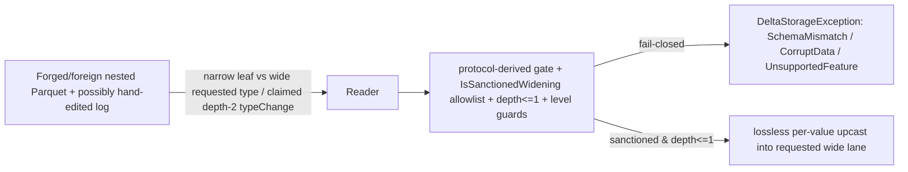

# Nested type widening — array-element / map key-value / struct-field promotion (depth ≤ 1) (#546)

> **Status:** Draft.
>
> **Issue:** [#546](https://github.com/khaines/deltasharp/issues/546) <!-- issue-state:open --> — the
> nested-widening follow-up to [#535](https://github.com/khaines/deltasharp/issues/535) <!-- issue-state:closed -->
> (cross-family SCALAR type widening as a read-promoted widening: promote on read, fail-closed on append). #535
> DEFERRED widening a type nested inside an array element or map key/value; #546 wires per-leaf type-widening
> promotion through BOTH the read and write paths for the single-level nested shapes
> [#571](https://github.com/khaines/deltasharp/issues/571) <!-- issue-state:closed --> decodes
> (`struct<scalar>`, `array<scalar>`, `map<scalar,scalar>` — depth ≤ 1).
>
> **Author:** delta-storage-format-engineer (orchestrated).
> **Reviewers:** delta-storage-format-engineer, dotnet-vectorized-columnar-compute-engineer,
> reliability-test-chaos-engineer, cloud-native-security-sme, cloud-native-site-reliability-engineer.
> **Last Updated:** 2026-08-26.
> **Related:** [#535](https://github.com/khaines/deltasharp/issues/535) <!-- issue-state:closed --> (cross-family
> scalar read-promotion — the allowlist #546 reuses per leaf),
> [#571](https://github.com/khaines/deltasharp/issues/571) <!-- issue-state:closed --> (single-level nested
> decode — the read foundation #546 promotes through),
> [#533](https://github.com/khaines/deltasharp/issues/533) <!-- issue-state:closed --> (`date→timestamp_ntz`
> widening — one of the per-leaf promotions), #856 / [#585](https://github.com/khaines/deltasharp/issues/585)
> <!-- issue-state:closed --> (**585a** — the recursive nested decode now on `main`, which #546's read-promotion
> must compose with), [#860](https://github.com/khaines/deltasharp/issues/860) <!-- issue-state:open --> (**585b**
> — the depth > 1 widening follow-up this design's depth ≤ 1 gate defers to),
> [#676](https://github.com/khaines/deltasharp/issues/676) <!-- issue-state:open --> (nested column mapping /
> id mode — an adjacent nested surface; id-mode nested widening is scoped OUT here, §9),
> [#570](https://github.com/khaines/deltasharp/issues/570) <!-- issue-state:closed --> (the nested
> `ColumnVector`s the promoted values land in).

---

## 1 · Overview

DeltaSharp already promotes a **flat** (top-level scalar) column on read when a Parquet file's physical type is a
Delta-sanctioned **narrower** widening of the table's current type: `ParquetFileReader.ValidateFileField`
accepts the pair and `ReadPromotedColumnAsync` reads the narrow values into the requested wide vector (#535). On
the write side, `DeltaSchemaEnforcer` **applies** the schema-evolution subset of those widenings to the table
schema and records each in the field's `delta.typeChanges` metadata so pre-widening files are read-promoted.

That machinery stopped at the **container boundary**. #535 explicitly deferred widening a type nested inside an
**array element** or **map key/value**: the enforcer left `allowWidenApply: false` for collection interiors
(fail-closed), and the nested reader (`NestedParquetColumnReader`, #571) required an **exact** physical-type
match at every leaf. #546 closes that gap for the **single-level** nested shapes #571 decodes —
`struct<scalar>`, `array<scalar>`, `map<scalar,scalar>` — by wiring the **same** per-scalar promotion the flat
path uses through both paths, at each nested leaf:

- **Write (metadata, `DeltaSchemaEnforcer`).** A schema-evolution-eligible scalar widening of an array element /
  map key / map value at a top-level collection column is **applied** exactly like a scalar column, and recorded
  in the **enclosing** field's `delta.typeChanges` carrying the Delta `fieldPath` (`"element"` / `"key"` /
  `"value"`, per Delta PROTOCOL.md **"Type Change Metadata"**). A struct field's own scalar widening is applied
  and recorded on the **inner** field with **no** `fieldPath` (via the existing struct recursion). The full
  change history is preserved, oldest first.
- **Read (promotion, `NestedParquetColumnReader`).** A read-side `allowTypeWideningPromotion` gate (derived from
  `TypeWideningFeature.Supports(snapshot.Protocol)`, exactly as the flat path derives it) is threaded into every
  nested leaf. When the gate is open and a leaf's **physical** type is a Delta-sanctioned narrower widening of
  the requested scalar, the reader dispatches to a **promoted read** that reads the narrow values and promotes
  each into the requested wide lane — reusing the flat path's `TypeWidening.IsSanctionedWidening` allowlist
  (including the integral→decimal fit guard). When the gate is closed, an **exact** physical match is still
  required (fail-closed).

**Fail-closed parity with the scalar path is the invariant.** Cross-family nested widening (#535) is
read-promotable but is **not** schema-evolution-eligible, so it is **not** auto-applied on append — it fails
closed as `TypeWideningUnsupported`, exactly like the flat path. And — the crux of composing with 585a — a
widening of a leaf **nested within another nested type** (`array<struct<…>>`, `map<*,struct<…>>`, `array<array<…>>`,
depth ≥ 2) stays **fail-closed on both paths** even though 585a can now *decode* that shape. Applied widening is
gated to scalar leaves at **container depth ≤ 1** (a top-level column, or a direct child of a single top-level
container — the exact shapes #571 promotes). Lifting the depth bound is 585b
([#860](https://github.com/khaines/deltasharp/issues/860) <!-- issue-state:open -->).

**In scope:** per-leaf read-promotion + write-apply for `struct<scalar>`, `array<scalar>`,
`map<scalar,scalar>` under name/none mode; `delta.typeChanges` `fieldPath` emission; depth ≤ 1 gate; fail-closed
parity. **Out of scope:** depth > 1 widening (585b/#860); id-mode (column-mapping `nested.ids`) nested widening
(#676/#839, §9); any change to the flat path or the sanctioned-widening allowlist itself.

---

## 2 · Logical Architecture

### 2.1 The two allowlists, applied per leaf (unchanged semantics)

#546 reuses — verbatim, per nested leaf — the two `TypeWidening` predicates the flat path already uses. Nothing
about **which** pairs are sanctioned changes; only the **positions** at which they are recognized extend to
single-level nested leaves.

| Predicate | Membership | Used on | Nested position (#546) |
|---|---|---|---|
| `TypeWidening.IsSanctionedWidening(from, to)` | Full Delta-`isTypeChangeSupported` set: same-family integral upcast (`byte→short→int→long`), `float→double`, grow-only `decimal(p,s)→decimal(p',s')`, cross-family `integral→double` / `integral→decimal` (#535, **with the integral→decimal fit guard**), `date→timestamp_ntz` (#533) | **Read** promotion gate (leaf physical vs requested) | Every nested leaf, at any depth for *validation*, but the **promoted read** only fires at depth ≤ 1 (§2.4) |
| `TypeWidening.IsSchemaEvolutionWidening(from, to)` | The **applied** subset: same-family integral / `float→double` / grow-only decimal, **plus** `date→timestamp_ntz` — but **NOT** the cross-family (#535) cases | **Write** apply (table type vs write type) | Array element / map key-value / struct field, **only at depth ≤ 1** |

The membership gap between the two is the fail-closed seam: a cross-family nested widening (`array<int>` into
`array<double>`) is `IsSanctionedWidening` (read-promotable) but not `IsSchemaEvolutionWidening`, so append
fails closed as `TypeWideningUnsupported` — identical to the flat cross-family rule.

### 2.2 The container-depth model (write and read, in one number)

Both paths gate applied/promoted widening on a single **leaf container depth**: the number of containers
enclosing the scalar leaf.

| Depth | Shape example | Scalar leaf position | Widening |
|---|---|---|---|
| 0 | `bigint` column | top-level scalar column (flat path) | applied/promoted (#535, unchanged) |
| 1 | `array<int>`, `map<int,int>`, `struct<a:int>` | direct child of one top-level container | **applied/promoted (#546)** |
| ≥ 2 | `array<struct<a:int>>`, `array<array<int>>`, `map<*,struct<…>>`, `struct<struct<a:int>>` | nested within another nested type | **fail-closed** (585b/#860) |

- **Write (`DeltaSchemaEnforcer`).** `MergeStruct` carries a `fieldDepth` (0 at root, +1 per struct recursion);
  `MergeType`/`MergeCollectionElement` carry the leaf's `depth`/`elementDepth`. The scalar arm applies a widening
  only when `depth <= 1 && typeWideningEnabled && IsSchemaEvolutionWidening(...)`. A depth ≥ 2 scalar falls
  through to the reject block (`TypeWideningUnsupported` if sanctioned, `IncompatibleType` otherwise).
- **Read (`NestedParquetColumnReader`).** 585a already threads a `depth` counter (0 at the top-level container)
  through `ValidateNode`/`DecodeNode`. #546 composes the read gate with that counter so a **promoted read**
  fires only for a scalar leaf at container depth ≤ 1 (§2.4).

**Read/write parity is what makes depth ≤ 1 safe.** Because the enforcer never *applies* a depth ≥ 2 widening,
a well-formed table never commits a depth ≥ 2 `delta.typeChanges`, so the reader never encounters a depth ≥ 2
physical/requested mismatch it must promote — requested == physical there. The read-side depth bound is
therefore **defense in depth**: it fail-closes a *hostile or hand-edited* log that claims a depth ≥ 2 widening,
rather than silently promoting a shape 585a can now decode but #546 does not yet support end-to-end.

### 2.3 The `delta.typeChanges` `fieldPath` (Delta PROTOCOL.md "Type Change Metadata")

A type change is recorded on the **enclosing** `StructField`'s `delta.typeChanges` array. Each entry is
`{ "fromType": <old>, "toType": <new> }`, plus a `"fieldPath"` naming the changed leaf **relative to that field**
when the leaf is inside a collection:

| Widened leaf | `fieldPath` | Recorded on |
|---|---|---|
| Array element (`array<int>`→`array<long>`) | `"element"` | the array field |
| Map key (`map<int,_>`→`map<long,_>`) | `"key"` | the map field |
| Map value (`map<_,int>`→`map<_,long>`) | `"value"` | the map field |
| Struct field's own scalar (`struct<a:int>`→`struct<a:long>`) | *(none)* | the **inner** field `a` (via recursion) |

History is **append-only, oldest first** (a leaf widened twice — `int→long` then `long→decimal` — records both
entries in order). #546 threads `fieldPath` through `AppendTypeChange`; a `null` `fieldPath` reproduces the
existing struct-field-own-change JSON byte-for-byte (no regression to already-shipped scalar/struct widenings).

### 2.4 The crux — expressing the promoted read against 585a's recursive reader

The reference implementation (`3035d91`, written **before** 585a) threaded a **plain** `bool
allowTypeWideningPromotion` to every leaf, because that reader only ever decoded single-level shapes — every leaf
it reached was depth ≤ 1 **by construction**, so a plain bool sufficed. 585a
(#856 / [#585](https://github.com/khaines/deltasharp/issues/585) <!-- issue-state:closed -->) rewrote
`NestedParquetColumnReader` into a recursive `DecodeNode` / `ValidateNode` that reconstructs **arbitrary** depth.
A plain, depth-agnostic bool would therefore now (incorrectly) promote a depth ≥ 2 leaf. #546's read-promotion is
consequently expressed as a **depth-composed gate**, mapping the reference's two touch-points onto the current
structure:

**Reference → current mapping.**

| Reference (pre-585a) | Current (585a) | #546 change |
|---|---|---|
| `ValidateShape(fileField, requestedType, columnName, allowTypeWideningPromotion)` | `ValidateShape(fileField, requestedType, columnName)` → `ValidateNode(…, depth)` → `ValidateChild(…, depth)` | Add `bool allowTypeWideningPromotion`; thread through `ValidateNode`/`ValidateChild`. At the scalar leaf compute `promoteLeaf = allowTypeWideningPromotion && depth <= 1` and pass to `ExpectScalarLeaf` → `ValidateLeafPhysicalType`. |
| `ValidateLeafPhysicalType(leaf, requested, context, allowTypeWideningPromotion)` — up-front `TryToDataType + !Equals + IsSanctionedWidening` early return | `ValidateLeafPhysicalType(leaf, requested, context)` — exact-match `switch` only | Port the reference's **widening early-return** verbatim, guarded by `promoteLeaf` (not the plain bool). Gate closed ⇒ the exact-match `switch` still runs (fail-closed). `ValidateLeafStructuralLevels` is **unchanged** — a promoted leaf keeps identical Dremel levels, so rep/def guards still apply. |
| `ReadScalarLeafAsync(…, allowTypeWideningPromotion, …)` dispatches to `ReadPromotedLeafAsync` when `TryToDataType + !Equals + IsSanctionedWidening` | `ReadScalarLeafAsync(rowGroup, leaf, scalarType, presentFloor, budget, ct)` — exact-match `switch` only | Add the `promoteLeaf` gate + the dispatch check; port `ReadPromotedLeafAsync` verbatim, re-signatured for the current `ReadLeafAsync<T>(…, budget, …)` (585a uses `NestedDecodeBudget`, not `ParquetDecodeLimits`). |
| `ReadPromotedLeafAsync(…)` — integral upcast / `float→double` / grow-only-decimal rescale / cross-family `integral→double` & `integral→decimal` / `date→timestamp_ntz` | *(does not exist)* | Add it, unchanged in logic; every arm targets the requested (wide) lane the child vector already allocates. |

**Where `promoteLeaf` is computed.** 585a already threads `depth`. The gate is `allowTypeWideningPromotion`
threaded (like `budget`/`byFieldId`) through `ValidateNode`/`ValidateChild` and `DecodeNode` /
`ReadStructAsync` / `ReadListAsync` / `ReadMapAsync`. At each **scalar-leaf** site the reader forms
`promoteLeaf` from the local depth:

- **Validate path.** `ValidateChild` is invoked with `depth + 1` (the leaf's own depth), so
  `promoteLeaf = allowTypeWideningPromotion && depth <= 1`.
- **Decode path.** `ReadStructAsync` / `ReadListAsync` / `ReadMapAsync` hold the **container** `depth`; a scalar
  child sits at `depth + 1`, so `promoteLeaf = allowTypeWideningPromotion && depth == 0` (equivalently, a scalar
  child of a **top-level** container). This is exactly the enforcer's `depth <= 1` leaf rule.

**Id-mode exclusion (name/none only).** The id-mode branches (`byFieldId is not null`, #676/#839) bind interior
leaves by `nested.ids` field-id and are always single-level scalar. The reference predates id-mode nested and has
**no** id-mode widening test; #546 keeps `promoteLeaf` **false** on the id-mode branches (exact match), so
id-mode nested widening stays fail-closed and out of scope — see §9 (open question O1).

**`ParquetFileReader` wiring (mechanically trivial).** Both nested call sites already sit inside methods that
carry the `bool allowTypeWideningPromotion` local (`ResolveFileFields` for `ValidateShape`; `ReadRowGroupAsync`
for `ReadAsync`) — the flat path derives and threads it today. #546 only **passes that existing local** to the
two nested calls:

```csharp
// ResolveFileFields (was: ValidateShape(nestedField, requestedField.DataType, name))
NestedParquetColumnReader.ValidateShape(nestedField, requestedField.DataType, name, allowTypeWideningPromotion);

// ReadRowGroupAsync (was: ReadAsync(..., resolved.NestedFieldId, resolved.InteriorIds, decodeToken))
columns[c] = await NestedParquetColumnReader.ReadAsync(
    rowGroup, nestedField, requested[c].DataType, rowCount, requested[c].Name, nestedBudget,
    resolved.NestedFieldId, resolved.InteriorIds, allowTypeWideningPromotion, decodeToken).ConfigureAwait(false);
```

### 2.5 Data flow — promoted read of `array<int>` under an `array<long>` table (feature enabled)

```mermaid
sequenceDiagram
  participant Scan as DeltaReadSource / ChangeFeedReader
  participant PFR as ParquetFileReader
  participant V as NestedParquetColumnReader.ValidateShape → ValidateNode/ValidateChild
  participant D as DecodeNode → ReadListAsync
  participant Leaf as ReadScalarLeafAsync
  participant Prom as ReadPromotedLeafAsync
  participant Vec as #570 ListColumnVector<Int64>
  Scan->>PFR: allowTypeWideningPromotion = TypeWideningFeature.Supports(snapshot.Protocol)
  PFR->>V: ValidateShape(list node, array<long>, name, allow=true)
  V->>V: array arm, depth 0 → ValidateChild(item, long, depth 1)
  V->>V: promoteLeaf = allow && depth<=1 = true; leaf physical = INT32
  V->>V: ValidateLeafPhysicalType: !Equals(int,long) && IsSanctionedWidening(int,long) → ACCEPT (no exact-match needed)
  V->>V: ValidateLeafStructuralLevels(maxRep=1, maxDef) → OK (levels unchanged by widening)
  PFR->>D: ReadAsync(list node, array<long>, allow=true, depth 0)
  D->>Leaf: scalar element, promoteLeaf = allow && containerDepth==0 = true
  Leaf->>Leaf: TryToDataType(leaf)=int; !Equals(int,long) && IsSanctionedWidening(int,long)
  Leaf->>Prom: ReadPromotedLeafAsync(leaf, physical=int, requested=long, presentFloor=listMaxDef, budget)
  Prom->>Prom: ReadLeafAsync<int>(…, append=(v,x)=>v.AppendValue((long)x)) — narrow read, upcast per value
  Prom->>Vec: element child is the requested Int64 lane; nulls preserved via def-level pass
  Vec-->>PFR: ListColumnVector<Int64> (old array<int> file, read as array<long>)
```

When the gate is **closed** (`allow=false`, feature not in the protocol): `promoteLeaf=false`, so
`ValidateLeafPhysicalType` runs its exact-match `switch` (INT32 ≠ requested INT64 → `SchemaMismatch`) and the
read fails closed before any batch — never a silent promotion. The `date→timestamp_ntz` promotion is the one
case with a physical/requested class difference that is **not** a widening a native micros/LTZ timestamp
satisfies: `IsSanctionedWidening(timestamp, timestamp_ntz)` is **false**, so a micros/LTZ leaf requested as
`timestamp_ntz` takes the identity micros read (both accepted by the `TimestampType or TimestampNtzType` arm),
never a promotion.

### 2.6 Write flow — `DeltaSchemaEnforcer` changes

The enforcer replaces the pre-#546 `bool allowWidenApply` (a coarse "top-level scalar only" flag) with the
container-depth model:

1. `MergeStruct` gains `int fieldDepth` (0 at root; `depth + 1` on each nested-struct recursion via the
   `MergeType` struct arm).
2. `MergeField` gains `int depth` and a `List<NestedTypeChange> nestedChanges` accumulator. After `MergeType`,
   a scalar-own change records with `fieldPath: null` (unchanged); collected nested changes each record with
   their `fieldPath` on **this** field.
3. `MergeType` replaces `allowWidenApply` with `int depth` + `List<NestedTypeChange>? nestedChanges`. The array
   and map arms route their element/key/value through a new `MergeCollectionElement(elementDepth: depth + 1,
   fieldPath, nestedChanges)`. The scalar arm applies iff `depth <= 1 && typeWideningEnabled &&
   IsSchemaEvolutionWidening`.
4. `MergeCollectionElement`: a **scalar** leaf at `elementDepth <= 1` that is schema-evolution-eligible is
   applied and pushes a `NestedTypeChange(fieldPath, from, to)`; a sanctioned-but-not-applied pair fails closed
   `TypeWideningUnsupported`; an unrelated change fails closed `IncompatibleType`. A **nested** (struct/array/map)
   leaf recurses back through `MergeType` with `nestedChanges: null` — additive-column evolution and nullability
   checks still run, but its scalar arm rejects a depth ≥ 2 widening fail-closed.
5. `AppendTypeChange` gains `string? fieldPath`, appended as a `"fieldPath"` entry only when non-null.
6. `NestedTypeChange` is a `readonly record struct (string FieldPath, DataType From, DataType To)`.

> **Merge-adaptation note.** The reference `3035d91` predates the current `DiagnosticText.DescribeType`
> hardening: its reject factories took `SimpleString`; the current `DeltaSchemaMismatchException.{TypeWidening
> Unsupported,IncompatibleType}` take **`DataType`** (rendered by the factory). The port keeps the **current**
> `DataType` signatures — the only intentional divergence from the reference diff.

### 2.7 Component boundaries

| Component | #546 responsibility | Not its job |
|---|---|---|
| `DeltaSchemaEnforcer` | Apply depth ≤ 1 nested widening; emit `delta.typeChanges` + `fieldPath`; fail-closed parity | Reading files; choosing the read gate |
| `TypeWidening` | The two allowlists + integral→decimal fit guard (unchanged) | Positional/depth logic |
| `TypeWideningFeature` | `Supports(protocol)` → the read gate (unchanged) | — |
| `ParquetFileReader` | Thread the existing `allowTypeWideningPromotion` into the two nested calls | Per-leaf promotion mechanics |
| `NestedParquetColumnReader` | Depth-composed `promoteLeaf`; `ValidateLeafPhysicalType` widening branch; `ReadPromotedLeafAsync` | The allowlist; the write path |
| #570 nested `ColumnVector`s | Hold promoted (wide-lane) values | — |

### 2.8 Dependencies

585a (#856, on `main`) — the recursive decode #546 composes with. #571 (single-level nested decode — the shapes
#546 promotes). #535 (the read-promotion + fail-closed-on-append scalar precedent). #533 (`date→timestamp_ntz`).
#570 (nested vectors). #860 / **585b** is the *downstream* dependent (lifts the depth bound), not a prerequisite.

### 2.9 Tenant / storage-backend considerations

Purely a schema/decode concern above the object-store boundary — backend-agnostic (S3/ADLS/GCS/PVC identical).
The promoted read touches the **same** column chunks an exact read would; no extra object-store operations, no new
footer reads, no change to commit/checkpoint I/O. `delta.typeChanges` metadata rides in the existing `metaData`
action JSON — no new log file kinds or listing behavior.

---

## 3 · Functional Test Scenarios

The reference commit `3035d91` lands **+22 net** tests (25 new, replacing one #571 lock-down test that asserted
array-element widening was *never* applied). The AC → scenario map below carries each forward.

### 3.1 Acceptance criteria

- **AC1** — Array-element scalar widening at a top-level `array<scalar>` is **applied** on append (feature
  enabled) and recorded as `delta.typeChanges` with `fieldPath="element"`.
- **AC2** — Map key and/or value scalar widening is applied with `fieldPath="key"` / `"value"` (both recordable
  in one merge).
- **AC3** — A struct field's own scalar widening is applied and recorded on the **inner** field with **no**
  `fieldPath` (via recursion) — unchanged from the pre-#546 struct path.
- **AC4** — Grow-only decimal rescale nested widening is applied (element path).
- **AC5** — Nested type-change history is preserved, oldest first.
- **AC6** — Cross-family nested widening (#535, e.g. `array<int>`→`array<double>`) is read-promotable but **NOT**
  auto-applied on append: fail-closed `TypeWideningUnsupported`.
- **AC7** — Nested-within-nested (depth ≥ 2) widening (`array<struct<…>>`, `map<*,struct<…>>`) stays fail-closed
  on **write** (`TypeWideningUnsupported`) and would fail-closed on read (defers to 585b/#860).
- **AC8** — Read-promotion at each nested leaf (array element / map key / map value / struct field): `int→long`,
  cross-family `int→double`, `float→double`, `int→decimal` that fits — **nulls preserved** through promotion.
- **AC9** — `int→decimal` that does **not** fit fails closed (the integral→decimal fit guard).
- **AC10** — Gate closed (feature not in protocol) ⇒ exact physical match required; a narrower nested leaf is
  **not** silently promoted (fail-closed).
- **AC11** — Nested narrowing / lossy (`long→double`) fails closed **even with** the gate open.
- **AC12** — End-to-end: a real `array<int>` file under a `typeWidening`-enabled table widens to `array<long>`,
  commits `delta.typeChanges` with `fieldPath="element"` surviving the Delta-log JSON round-trip, and
  read-promotes the old file.
- **AC13** — `date→timestamp_ntz` nested promotion (#533); a native micros/LTZ timestamp requested as
  `timestamp_ntz` takes the identity read (NOT a sanctioned widening).

### 3.2 AC → reference test map

| AC | `DeltaSchemaEnforcerTests` (write/metadata) | `NestedParquetReadTests` (read) | `DeltaSchemaEvolutionWriterTests` (e2e) |
|---|---|---|---|
| AC1 | `Reconcile_ArrayElementWidening_WhenEnabled_IsAppliedWithElementPath` | `Array_ElementWidening_IntToLong_WhenEnabled_Promotes_AndPreservesNulls` | — |
| AC2 | `Reconcile_MapValueWidening_…_IsAppliedWithValuePath`; `Reconcile_MapKeyWidening_…_IsAppliedWithKeyPath`; `Reconcile_MapKeyAndValueWidening_…_RecordsBothPaths` | `Map_ValueWidening_IntToLong_…_Promotes_AndPreservesNulls`; `Map_KeyWidening_IntToLong_…_Promotes` | — |
| AC3 | `Reconcile_StructFieldWidening_WhenEnabled_IsAppliedOnInnerField_NoFieldPath` | `Struct_FieldWidening_IntToLong_…_Promotes_AndPreservesNulls`; `Struct_ReadsFields_WithNullFieldAndNullStructRow` | — |
| AC4 | `Reconcile_ArrayElementDecimalGrowOnlyWidening_…_IsAppliedWithElementPath` | — | — |
| AC5 | `Reconcile_ArrayElementWidening_PreservesPriorNestedTypeChangeHistory_OldestFirst` | — | — |
| AC6 | `Reconcile_ArrayElementCrossFamilyWidening_WhenEnabled_IsDeferred_NotApplied` | `Array_ElementWidening_IntToDouble_CrossFamily_WhenEnabled_Promotes`; `Array_ElementWidening_FloatToDouble_…_Promotes` | — |
| AC7 | `Reconcile_WideningInsideArrayOfStruct_IsNotApplied_EvenWhenEnabled`; `Reconcile_WideningInsideMapValueStruct_IsNotApplied_EvenWhenEnabled`; `Reconcile_WideningInsideArrayElement_IsNotApplied_EvenWhenEnabled` (gate-off baseline) | *(depth ≥ 2 read stays exact-match; defers to 585b)* | — |
| AC8 | — | `Array_ElementWidening_IntToDecimal_Fits_WhenEnabled_Promotes` (+ the AC1–AC3 promote tests) | — |
| AC9 | — | `Array_ElementWidening_IntToDecimal_DoesNotFit_FailsClosed` | — |
| AC10 | — | `Array_ElementWidening_WhenGateClosed_FailsClosed_NotSilentlyPromoted`; `Struct_FieldWidening_WhenGateClosed_FailsClosed` | — |
| AC11 | — | `Array_ElementNarrowing_WhenEnabled_FailsClosed`; `Array_ElementWidening_LongToDouble_IsLossy_FailsClosedEvenWithGate` | — |
| AC12 | — | — | `Append_WidenArrayElement_WhenFeatureEnabled_CommitsElementFieldPath_AndPromotesOnRead` |
| AC13 | *(covered by the flat #533 suite; nested arm exercised via the promote-dispatch allowlist)* | *(add a nested `date→timestamp_ntz` promote + a micros-identity case — see O2)* | — |

### 3.3 New-since-reference coverage to add (585a interaction)

The reference could not test depth ≥ 2 **read** (585a did not exist). #546 must add, on top of `3035d91`:

- **Depth ≥ 2 read fail-closed:** `array<struct<a:int>>` file vs `array<struct<a:long>>` request with the gate
  **open** → the depth-2 leaf is **not** promoted (`SchemaMismatch`, exact-match), proving `promoteLeaf` is
  depth-composed, not a plain bool. (Pairs with the write-side AC7.)
- **Depth ≤ 1 unaffected regression:** the 585a recursive-decode tests for `array<struct<…>>` etc. must still
  pass byte-identically with the gate **closed** (default), proving #546 adds no decode regression.

---

## 4 · Performance

- **Read.** A promoted nested leaf reads the **narrow** physical values (fewer bytes off the wire than the wide
  logical type) and applies a per-value branchless upcast into the pre-allocated wide `MutableColumnVector` — the
  exact per-element cost of the flat `ReadPromotedColumnAsync`, now per nested leaf. No extra column chunk, page,
  or footer read. Identity (non-promoted) reads are byte-for-byte unchanged (the `promoteLeaf` check is a bool +
  a `TryToDataType` on the already-resolved leaf, short-circuited when the gate is closed).
- **`NestedDecodeBudget`.** The child vector allocates at the **requested (wide)** width, identical to a
  post-widen file — no new allocation ceiling behavior; the eager-decode charge is unchanged.
- **Write.** `DeltaSchemaEnforcer` runs once per commit on the schema tree (not per row); the added depth
  threading and `nestedChanges` list are O(fields) and allocate only when a nested widening actually applies.
- **Benchmark plan.** (1) Scan a large `array<int>` table widened to `array<long>` vs a natively-`array<long>`
  table — assert promoted-read throughput within noise of the identity read. (2) Micro-bench the gate-closed
  path — assert zero regression vs pre-#546 nested decode. (3) Commit-path: enforcer latency for a wide nested
  schema, gate on vs off.

---

## 5 · Security

The read gate is derived **solely** from the table's committed protocol (`TypeWideningFeature.Supports`), never
from a file footer or a request option — a file cannot self-declare that it should be promoted. Promotion is
admitted **only** for pairs in the fixed `IsSanctionedWidening` allowlist (every arm a **lossless** widening),
and every arm targets the requested wide lane the vector already sized, so no value can overflow its
destination. The integral→decimal fit guard (inside `IsSanctionedWidening`) proves the decimal's integer-digit
capacity covers the source's Parquet-physical range **before** any read, so `AppendDecimal` never truncates.
`ValidateLeafStructuralLevels` still runs for promoted leaves (promotion never relaxes Dremel-level guards).
Fail-closed messages route through the existing `DiagnosticText.Sanitize`/`DescribeType` path (#683/#705) —
no foreign nested names or control chars leak.

---

## 6 · Threat Model



| STRIDE | Surface | Threat | Mitigation |
|---|---|---|---|
| **Spoofing** | file footer claims a leaf should be promoted | a file self-authorizes a widening | Gate derives from the **committed protocol** only (`TypeWideningFeature.Supports`), never the footer/request |
| **Tampering** | narrower nested leaf vs wide requested type | **lossy/narrowing** value silently promoted (`long→double`, decimal-that-doesn't-fit, narrowing) | `IsSanctionedWidening` admits only lossless pairs; the integral→decimal **fit guard** rejects non-fitting decimals; narrowing/lossy pairs are not in the allowlist → fail-closed (AC9/AC11) |
| **Tampering** | hand-edited log claims a **depth ≥ 2** `delta.typeChanges` | silent promotion of a nested-within-nested leaf 585a can now decode | Read `promoteLeaf` is **depth-composed** (`depth <= 1`); a depth ≥ 2 mismatch takes the exact-match `switch` → `SchemaMismatch`. Enforcer never *applies* depth ≥ 2, so no legitimate table reaches this. |
| **Tampering** | cross-family widening pushed onto **append** | append silently mutates value semantics (`int→double` in a collection) | Write uses `IsSchemaEvolutionWidening` (excludes cross-family); cross-family append fails closed `TypeWideningUnsupported`, read-only-promotable (AC6) |
| **Tampering** | crafted def/rep on a promoted leaf | present-vs-null mis-classification at a widened leaf | `ValidateLeafStructuralLevels` + the def-level present-floor pass run **unchanged** for promoted leaves; promotion only substitutes the value converter |
| **Info disclosure** | gate closed but file narrower | reader leaks that a widening "would have" applied | Gate-closed path is the plain exact-match `switch` → generic `SchemaMismatch` naming only sanitized types (AC10) |
| **Elevation** | id-mode nested widening | promotion through the unvetted `nested.ids` binding surface (#676/#839) | `promoteLeaf` kept **false** on id-mode branches (§2.4) — exact match, out of scope (O1) |
| **DoS** | maliciously deep schema | recursion / allocation fan-out | 585a's `MaxNestedReadDepth` bound (checked before descent) + `NestedDecodeBudget` are **unchanged**; #546 adds no descent |

**Key invariant (STRIDE headline):** a widening must **never** silently apply a lossy/narrowing promotion, nor a
cross-family promotion **on append** — read and write both fail closed, at exact parity with the scalar path.

**Residual:** depth > 1 widening is deferred to 585b/#860 (fail-closed until then). Id-mode nested widening is
out of scope (#676/#839). Advisory nested-leaf nullability (#570) is unchanged.

---

## 7 · Observability

- **Logging.** Fail-closed rejections surface via the existing sanitized `DeltaSchemaMismatchException` (write)
  / `DeltaStorageException` (read) path, naming the sanitized nested path (`orders.element`, `attrs.key`) and
  bounded `DescribeType` types. No new happy-path log site — a promoted read is silent, like the flat path.
- **Metrics.** None new (read is a hot path). Applied nested widenings are already observable as the committed
  `delta.typeChanges` in the `metaData` action.
- **Correlation.** Rejections carry the existing table-path/version fields on the read/commit activity.

---

## 8 · Rollout & Risk

- **Feature-gated.** Both apply (write) and promote (read) are gated on the table protocol's `typeWidening`
  feature. A table without it sees **zero** behavior change (gate closed ⇒ exact match, as today).
- **Backward compatible.** A `null` `fieldPath` reproduces the existing struct/scalar `delta.typeChanges` JSON
  byte-for-byte; already-shipped scalar/struct widenings are untouched. New `fieldPath` entries are additive and
  ignored by readers that don't promote nested leaves.
- **Closes a latent gap.** The pre-#546 enforcer's `allowWidenApply: false` for collection interiors meant a
  nested widening was correctly deferred; but 585a's decode + a hypothetical hand-applied nested widening could
  otherwise have produced an unreadable table. The depth ≤ 1 gate + read/write parity make the applied set
  exactly the readable set.
- **Sequencing.** #546 ships on `main` after 585a (already merged). 585b/#860 lifts the depth bound afterward,
  reusing #546's `fieldPath` emission (extended to the nested `fieldPath` chain) and the promoted-read dispatch
  (extended past depth 1).
- **Rollback.** Revert is clean: the gate defaults closed for non-`typeWidening` tables, and the enforcer change
  is confined to the depth/`nestedChanges` threading.

---

## 9 · Open Questions & Decisions

- **D1 (decided) — express the read gate as depth-composed, not a plain bool.** Port the reference's
  `allowTypeWideningPromotion` but form `promoteLeaf = allowTypeWideningPromotion && depth <= 1` at each leaf,
  reusing 585a's `depth` counter (§2.4). Gives read/write parity and defense-in-depth against a hand-edited
  depth ≥ 2 typeChange. **Alternative rejected:** a plain depth-agnostic bool would silently promote depth ≥ 2
  leaves 585a can now decode — breaking the #546 = "depth ≤ 1" contract.
- **D2 (decided) — keep the two allowlists and the fit guard byte-identical.** #546 changes only the *positions*
  at which `IsSanctionedWidening`/`IsSchemaEvolutionWidening` are consulted, never their membership.
- **O1 (open) — id-mode nested widening.** #546 keeps `promoteLeaf=false` on the `byFieldId` branches (name/none
  only), matching the reference's tested scope. Should a `typeWidening` + column-mapping-id-mode table
  read-promote its single-level nested leaves too? It is a natural, safe extension (id-mode interiors are
  depth ≤ 1), but it touches the #676/#839 binding surface and has no reference coverage. **Recommendation:**
  defer to a #676/#839-aware follow-up; call it out for the security-SME seat.
- **O2 (open) — nested `date→timestamp_ntz` test coverage.** The promote-dispatch allowlist covers it, but the
  reference's +22 does not include an explicit nested `date→timestamp_ntz` promote test or the micros-identity
  companion (AC13). **Recommendation:** add both to lock the #533 arm at nested leaves.
- **O3 (open) — depth ≥ 2 read regression guard.** Add the §3.3 fail-closed test (`array<struct<a:int>>` vs
  `array<struct<a:long>>`, gate open → `SchemaMismatch`) so a future reviewer can't accidentally re-widen the
  gate to a plain bool. **Recommendation:** required for merge.
- **O4 (resolved) — factory signature divergence.** Keep the current `DataType`-taking reject factories
  (`DescribeType`), not the reference's `SimpleString` (§2.6 merge-adaptation note).

---

## 10 · References

- Issue [#546](https://github.com/khaines/deltasharp/issues/546) <!-- issue-state:open --> — this work.
- Reference implementation: commit `3035d91` on `khaines/feat-546-nested-widening` (the behavioral spec;
  `DeltaSchemaEnforcer` +metadata/fieldPath/depth, `NestedParquetColumnReader` +read-promotion,
  `ParquetFileReader` +gate threading, +22 tests) — written pre-585a; §2.4 maps it onto the recursive reader.
- [#535](https://github.com/khaines/deltasharp/issues/535) <!-- issue-state:closed --> — cross-family scalar
  read-promotion (the allowlist + fail-closed-on-append precedent #546 mirrors per leaf).
- [#571](https://github.com/khaines/deltasharp/issues/571) <!-- issue-state:closed --> — single-level nested
  decode (the read foundation #546 promotes through).
- [#533](https://github.com/khaines/deltasharp/issues/533) <!-- issue-state:closed --> — `date→timestamp_ntz`
  widening.
- 585a — recursive nested decode, PR #856 / design
  [#585](https://github.com/khaines/deltasharp/issues/585) <!-- issue-state:closed --> — the reader structure
  #546 composes with; see [`nested-within-nested.md`](nested-within-nested.md).
- [#860](https://github.com/khaines/deltasharp/issues/860) <!-- issue-state:open --> — **585b**, depth > 1
  widening (this design's depth ≤ 1 gate defers to it).
- [#676](https://github.com/khaines/deltasharp/issues/676) <!-- issue-state:open --> — nested column mapping /
  id mode (O1, out of scope).
- [#570](https://github.com/khaines/deltasharp/issues/570) <!-- issue-state:closed --> — nested `ColumnVector`s.
- Delta PROTOCOL.md — **"Type Widening"** and **"Type Change Metadata"** (`fieldPath` semantics).
- [`read-door.md`](read-door.md), [`nested-within-nested.md`](nested-within-nested.md) — structural models.
