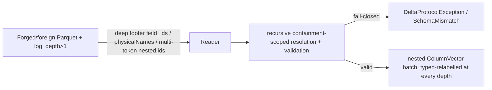

# Nested-within-nested column mapping (depth&gt;1) — recursive id/name assignment + resolution

> **Status:** Draft — **BUILD-READY** off `origin/main` @ `b0397b0` (this worktree,
> branch `khaines/design-866-nested-colmap`). Design-only: **no production code lands in this doc's PR.**
>
> **What this composes (does NOT fork):** this design **removes the `depth == 1` ceiling** from four already-shipped
> machineries and reuses their conventions verbatim — it invents no new substrate:
>
> - **#676** (single-level nested column mapping — the foundation): the `StructField`-recursive
>   `(id, physicalName)` assignment/resolution and the **C1 invariant** (ids live on `StructField`s, never on
>   array-`element`/map-`key`/map-`value`). See
>   [`nested-column-mapping.md`](nested-column-mapping.md).
> - **#839** (array/map id mode via `delta.columnMapping.nested.ids`): interior scalar ids on the *containing*
>   `StructField`, containment-scoped id-mode resolution. See
>   [`nested-array-map-id-mode.md`](nested-array-map-id-mode.md). **MERGED.**
> - **#840** (metadata-only nested rename/drop via **segment-array** addressing — never a dotted string). See
>   [`nested-rename-drop.md`](nested-rename-drop.md). **MERGED.**
> - **585a/873/585b** (nested-within-nested decode + recursive WRITE + depth&gt;1 widening — the depth&gt;1
>   *shredder/reassembly* machinery). See [`nested-within-nested.md`](nested-within-nested.md). **MERGED.**
>
> **The one-line job:** #676 fail-closes any *container inside a container*
> (`array<struct>`, `struct<struct>`, `map<*,struct>`, `array<array>`, …) at the column-mapping
> assignment/validation/resolution/write doors via `ColumnMapping.RejectNestedWithinNested`
> (`src/DeltaSharp.Storage/Delta/ColumnMapping.cs:1627`). **585a/873** already lifted the *decode* and *name/none
> WRITE* rejects for those shapes and **explicitly re-pointed the id-mode nested-within-nested WRITE reject to
> this issue** (`ParquetTypeMapping.cs:241-252`). This design lifts the remaining **column-mapping** ceiling —
> recursive id/name **assignment**, name-mode + id-mode **resolution** for leaves at **depth&gt;1**, depth&gt;1
> **rename/drop**, and the fail-closed invariants over the whole depth&gt;1 tree.
>
> **C1 (unchanged, the id model, extended one axis):** column mapping attaches `delta.columnMapping.{id,physicalName}`
> to **`StructField`s at every depth** and interior array/map scalar ids to
> **`delta.columnMapping.nested.ids` on the *nearest enclosing* `StructField`** (#839). At depth&gt;1 the two
> mechanisms **compose**: a `struct` anywhere resets the recursion (its children are `StructField`s → direct
> ids); an array/map chain with no intervening struct accumulates a **multi-token dotted-path `nested.ids`**
> (`P.element.element`, `P.value.key`, …) on the nearest `StructField` ancestor (§2.2). This is a strict
> superset of #676+#839; **it violates neither C1 nor the wire format** (it is exactly Delta Spark's
> `rewriteFieldIdsForIceberg` recursion — §2.2).
>
> **Issue:** [#866](https://github.com/khaines/deltasharp/issues/866) <!-- issue-state:open -->
> (#676 depth&gt;1 deferral; the `RejectNestedWithinNested` message currently mis-cites the **closed** #585).
> **Author:** catalog-metastore-engineer (orchestrated).
> **Reviewers:** delta-storage-format-engineer, cloud-native-distributed-systems-architect,
> reliability-test-chaos-engineer, cloud-native-security-sme, cloud-native-site-reliability-engineer,
> performance-benchmarking-engineer.
> **Last Updated:** 2026-08-28.
> **Related:** [#676](https://github.com/khaines/deltasharp/issues/676) <!-- issue-state:closed -->
> (foundation), [#839](https://github.com/khaines/deltasharp/issues/839) <!-- issue-state:closed -->
> (`nested.ids`), [#840](https://github.com/khaines/deltasharp/issues/840) <!-- issue-state:closed -->
> (rename/drop), [#585](https://github.com/khaines/deltasharp/issues/585) <!-- issue-state:closed -->
> (585a decode), [#873](https://github.com/khaines/deltasharp/issues/873) <!-- issue-state:closed -->
> (nested-within-nested WRITE — re-pointed id-mode write here), [#860](https://github.com/khaines/deltasharp/issues/860) <!-- issue-state:closed -->
> (585b widening), [#546](https://github.com/khaines/deltasharp/issues/546) <!-- issue-state:closed -->
> (nested widening), [#571](https://github.com/khaines/deltasharp/issues/571) <!-- issue-state:closed -->
> (single-level decode), [#570](https://github.com/khaines/deltasharp/issues/570) <!-- issue-state:closed -->
> (nested `ColumnVector`s), [#675](https://github.com/khaines/deltasharp/issues/675) <!-- issue-state:closed -->
> (nested CDF/column-mapping oracle).

---

## 1 · Overview

Delta **column mapping** decouples a table's *logical* column names from the *physical* names/ids stored in
Parquet, so a rename/drop is a metadata-only commit and CDF reads of old files still resolve. **#676** lifted
DeltaSharp's mapping from leaf-only to **single-level nested** — a `struct<scalars>`, an `array<scalar>`, a
`map<scalar,scalar>` (id-mode array/map added by **#839** via `nested.ids`; metadata-only nested rename/drop
added by **#840**). Every one of those designs draws the line at exactly **one** level of nesting: a struct
child / array element / map key-value that is **itself** a container
(`array<struct>`, `struct<struct>`, `map<*,struct>`, `array<array>`, `map<*,array>`, …) is **fail-closed** at
the column-mapping assignment/validation/resolution/write doors by `ColumnMapping.RejectNestedWithinNested`
(`ColumnMapping.cs:1627`), whose message still cites the **closed** #585 (a dangling deferral — the reason
this issue exists).

This design lifts that ceiling for **depth&gt;1** leaves. All four prerequisite machineries have **shipped**,
so #866 is a **removal of a depth bound in composed code**, not a new build:

| Machinery reused | Issue | State | What #866 removes the ceiling from |
|---|---|---|---|
| `StructField`-recursive `(id, physicalName)` assign/resolve + C1 | #676 | merged | the depth ceiling in `AssignMappedType`/`EvolveMappedType`/`ValidateMappedLevel`/`ToPhysicalType` |
| `nested.ids` interior scalar ids on the containing `StructField` | #839 | **closed/merged** | the single-token selector ceiling (`.element`/`.key`/`.value`) → **multi-token dotted paths** |
| segment-array rename/drop | #840 | **closed/merged** | the single-hop `F4b` descent ceiling (struct-in-struct chains) |
| nested-within-nested decode / recursive WRITE / widening | 585a/873/585b | merged | the id-mode nested-within-nested **WRITE** reject #873 re-pointed here |

**Scope of the enabled surface (this issue):**

| Shape | name mode | id mode |
|---|---|---|
| `struct<struct<…>>` (struct-in-struct, any depth) | ✅ enabled (866a) | ✅ enabled (866b) |
| `array<struct<…>>`, `map<*,struct<…>>` (struct inside array/map) | ✅ enabled (866a) | ✅ enabled (866b, `nested.ids` + struct-child ids) |
| `array<array<…>>`, `array<map<…>>`, `map<*,array<…>>`, `map<*,map<…>>` (no intervening struct) | ✅ enabled (866a) | ✅ enabled (866b, **multi-token** `nested.ids`) |
| `map` **key** that is a container | ✅ enabled where readable/writable (`RejectNestedMapKey`, `ParquetTypeMapping.cs:261`, still fail-closed per #873 D5) | ⛔ fail-closed (Parquet map-key container constraint, #873 D5) |
| rename/drop of a depth&gt;1 **struct** child (segment array) | ✅ enabled (866c) | ⛔ fail-closed (`RequireNameMode`, id-mode write deferred everywhere) |
| rename/drop of an array/map **interior** (element/key/value) at any depth | ⛔ fail-closed (C1: not a `StructField`, no logical-name hop) | ⛔ fail-closed |

Why it matters: nested-within-nested column mapping is a **production-feature gap** blocking column-mapped
tables with genuinely complex-typed columns (`array<struct<…>>` is the single most common Spark/Iceberg
shape). It is the last depth restriction left standing after #676/#839/#840/585a/873/585b, and the reason
`RejectNestedWithinNested` still cites a closed issue.

**Requirements traceability:** EPIC-05 column mapping (`storage-delta-architecture.md` §2.9 / §2.12.3);
direct follow-up of #676 §1 / §9.8 and the #873 §2.10.8 write deferral.

**Placement rationale (separate doc, not an edit to `nested-column-mapping.md`).** The foundation doc is
**round-4 final** and deliberately scoped to *single-level* nested ("Status: Draft — round-4 (final)"; its §1
scope boundary explicitly defers nested-within-nested). Its follow-ups each earned their **own** design doc —
`nested-array-map-id-mode.md` (#839) and `nested-rename-drop.md` (#840) — rather than expanding the frozen
foundation. #866 is the **third** #676 follow-up (the depth axis), is **size:XL** (§8 decomposition), and
**composes four docs** whose anchors it must cross-reference without restating. A separate
`nested-within-nested-column-mapping.md` keeps the frozen foundation stable, matches the established
one-doc-per-follow-up convention, and gives the XL decomposition (§8) a home. The foundation doc's §1 scope
table and §9.8 gain a one-line "depth&gt;1 tracked by #866" cross-reference in 866a's PR (a doc edit, not a
re-scope).

---

## 2 · Logical Architecture

### 2.1 Where depth&gt;1 mapping lives

```mermaid
graph TD
  subgraph Assign[Assignment / validation / write doors — ColumnMapping.cs]
    VML["ValidateMappedLevel (:459) — reject at :485-494"]
    AMT["AssignMappedType (:926) — reject at :946-965"]
    EMT["EvolveMappedType (:1130) — reject at :1150-1164"]
    TPT["ToPhysicalType (:1540) — reject at :1558-1578"]
    RNW["RejectNestedWithinNested (:1627)"]
  end
  subgraph NameRead[Name-mode read/projection — ColumnMappingProjection.cs]
    BDS["BuildPhysicalDataType (:95) — struct-only recursion today"]
    ASC["AssertStructCongruent (:219) — struct-only recursion today"]
    VN["NestedParquetColumnReader.ValidateNode (585a) — ALREADY recursive"]
  end
  subgraph IdRead[Id-mode read — ParquetFileReader.cs / NestedParquetColumnReader.cs]
    RFF["ResolveFileFields (:1587-1670) — depth==1 containment"]
    RSFB["ResolveStructFieldById (:2036) — scalar interior only"]
    RILB["ResolveInteriorLeafById (:2164) — scalar interior only"]
    BFIM["BuildFieldIdMap (:460) — ALREADY depth-agnostic"]
    DEC["ReadStruct/List/MapAsync → DecodeNode (:514,:704,:920) — HARDCODES byFieldId:null,interiorIds:null"]
  end
  subgraph Write[Id-mode nested write — ParquetTypeMapping.cs]
    CNF["CreateNestedField (:110) — id-mode NWN re-pointed to #866 (:241-252)"]
  end
  VML --> RNW
  AMT --> RNW
  EMT --> RNW
  TPT --> RNW
  RNW -. "#866: recurse instead of reject (struct resets; array/map accumulate multi-token nested.ids)" .-> Recurse[depth-lifted descent]
  BDS -. "#866b: recurse array/map struct interior" .-> Recurse
  RSFB -. "#866b: recurse nested child sub-container" .-> Recurse
  RILB -. "#866b: recurse nested interior" .-> Recurse
  DEC -. "#866b R8/M6: thread byFieldId + descended interiorIds (else deep leaves bind positionally)" .-> Recurse
  CNF -. "#866b: id-mode NWN write stamping" .-> Recurse
  classDef done fill:#dfd,stroke:#090;
  class VN,BFIM done
```



Two anchors are already depth-agnostic and need **no** change (green): `BuildFieldIdMap`
(`ParquetFileReader.cs:460`) path-keys **every** footer leaf at any depth via `EnumerateFooterLeafPaths`; and
the 585a shape validator `ValidateNode` (`NestedParquetColumnReader.cs:136`) already recurses to
`MaxNestedReadDepth`. **The 585a decode reassembler (`ReadStructAsync`/`ReadListAsync`/`ReadMapAsync`→`DecodeNode`)
recurses too — but it HARDCODES `byFieldId: null, interiorIds: null` at every recursion boundary** (`:514`,
`:704`, `:920`), safe today only because id-mode nested-within-nested is rejected upstream. #866b (R8) threads
column-mapping identity through that recursion so deep leaves bind by `field_id`; this is the one decode-side
lift, not merely resolver threading (red-team M6).

### 2.2 The composed identity model at depth&gt;1 (C1 + `nested.ids`, extended)

C1 (from #676 §2.2, unchanged): `delta.columnMapping.{id,physicalName}` attaches **only** to `StructField`s;
DeltaSharp does not put a `SchemaJson` metadata slot on an array-`element`/map-`key`/map-`value`
(`SchemaJson.WriteType`, `SchemaJson.cs:160-179` — the metadata slot fires **only** in the
`StructType`→`StructField` branch, **at any depth**). #839 added `delta.columnMapping.nested.ids`
(a `Map[String,Long]` on the **containing** array/map `StructField`) for the interior scalar ids.

At depth&gt;1 the two mechanisms compose by a single rule:

> **The "nearest enclosing `StructField`" rule.** A `StructField` at any depth carries its own `id`+`physicalName`.
> Its `nested.ids` map (if it is an array/map, or *contains* an array/map chain with no intervening struct)
> carries every interior id reachable from it **without crossing another `StructField`**, keyed by the interior's
> **physical-path suffix** joined by `.` (the `physicalName` prefix + `element`/`key`/`value` segments). A
> `struct` encountered in the descent **resets** the recursion: the struct's children are `StructField`s and own
> their ids (and their own `nested.ids`).

This is **exactly** Apache Spark's `DeltaColumnMapping.rewriteFieldIdsForIceberg` recursion (the same design
`nested-array-map-id-mode.md` §2.2 pins for the single-level case), extended past the first hop. Worked
examples (physical name of the top container = `P`; ✱ = stamped on a Parquet **leaf**; ⌂ = **structural-only**
group-node id DeltaSharp cannot stamp, Parquet.Net 6.1.0 leaf-only — §2.6, `nested-array-map-id-mode.md` §2.6):

| Logical shape | `StructField` direct ids (C1) | `nested.ids` on nearest `StructField` |
|---|---|---|
| `struct<s: struct<a:int,b:string>>` | `s`, `s.a`✱, `s.b`✱ | — (pure struct recursion; no array/map) |
| `array<struct<a:int,b:string>>` (container `arr`) | `arr`, element-struct `a`✱, `b`✱ | `{P.element: ⌂}` (element-struct group; optional, interop-only) |
| `map<string, struct<a:int>>` (container `m`) | `m`, value-struct `a`✱ | `{P.key: keyLeaf✱, P.value: ⌂}` |
| `array<array<int>>` (container `aa`) | `aa` | `{P.element: ⌂, P.element.element: intLeaf✱}` **← multi-token** |
| `array<map<string,int>>` (container `am`) | `am` | `{P.element: ⌂, P.element.key: ✱, P.element.value: ✱}` **← multi-token** |
| `map<string, array<int>>` (container `ma`) | `ma` | `{P.key: ✱, P.value: ⌂, P.value.element: ✱}` **← multi-token** |

**The single new wire-format axis is the multi-token `nested.ids` key** (`P.element.element`,
`P.value.key`, …) that appears **only** when two or more array/map hops nest with **no** intervening struct.
The struct-bearing shapes (`array<struct>`, `struct<struct>`, `map<*,struct>`) need **no** multi-token keys —
the struct resets the recursion, so they are pure #676 recursion + at most a single-token element/value
`nested.ids` entry (which #839 already emits). Structural-only ⌂ ids (the array/map **group** node) are never
footer-resolvable (Parquet.Net leaf-only, §2.6); the reader binds those groups **structurally/by containment**,
exactly as #839 binds the single-level array/map container group.

**`maxColumnId` accounting (monotonic, mode-split — extends #839's §2.3 table).** `maxColumnId` remains a
monotonic high-water mark advanced once per assigned id. Every `StructField` id (any depth) and every
`nested.ids` interior id (any depth, in **pre-order**: container, then interior selector, then deeper) consumes
exactly one increment. Name mode mints **no** `nested.ids` ⇒ each array/map hop contributes only its container
`StructField`. The ceiling check (`id <= maxColumnId`, `ColumnMapping.cs`) extends over **every** interior id
at every depth; the validator asserts only the ceiling and MUST keep accepting **gaps** (a Spark-authored table
consumes `nested.ids` values and may have a counter exceeding the `StructField` count).

**Physical schema is a pure name substitution (unchanged from #676/#839):** `ToPhysicalSchema` substitutes
physical names at every depth, byte-identical type/nullability/order. In id mode the container keeps `id` +
`nested.ids` (both consumed at write to stamp leaf `field_id`s + `parquet.field.nested.ids`); name mode strips
both.

### 2.3 Data flow — assign + id-mode read of `array<struct<a:int,b:string>>`

```mermaid
sequenceDiagram
  participant W as Writer (create, id mode)
  participant CM as ColumnMapping.AssignMappedType
  participant LOG as _delta_log (metaData.schemaString)
  participant PT as ParquetTypeMapping.CreateNestedField
  participant R as Reader (ResolveFileFields → NestedParquetColumnReader)
  W->>CM: logical arr: array<struct<a:int,b:string>>
  CM->>CM: mint arr=1/col-a; element-struct id=2 (nested.ids P.element ⌂); struct a=3/col-c ✱, b=4/col-d ✱; maxColumnId=4
  Note over CM: struct RESETS recursion — a,b are StructFields with direct ids (C1), NOT nested.ids
  CM-->>W: physical schema + nested.ids {P.element: 2} + maxColumnId=4
  W->>LOG: commit schemaString (a,b metadata on StructFields; nested.ids on arr) + config maxColumnId
  W->>PT: write physical; stamp field_id on leaf a=3, b=4; element-struct GROUP carries no field_id (⌂)
  R->>R: resolve container arr by physicalName (structural, group node); build byFieldId (BuildFieldIdMap, depth-agnostic)
  R->>R: descend element-struct STRUCTURALLY (array has one element); bind a by id 3, b by id 4 within element-struct's own leaves (containment)
  R->>R: ExpectScalarLeaf(a:int), ExpectScalarLeaf(b:string) — id-selected leaves only
  R-->>W: StructColumnVector rebuilt; values by disjoint witness domains
```

### 2.4 Component boundaries — the (gate → depth-lift vs retain) enumeration

Every site below is grounded at `origin/main` @ `b0397b0`. **Lift** = recurse/descend instead of reject;
**Retain** = the fail-closed reject stays (genuinely unsupported at any depth).

| # | Gate | File:line | Function | #866 action | Increment |
|---|---|---|---|---|---|
| **G1** | Validation door reject | `ColumnMapping.cs:485-494` | `ValidateMappedLevel` | **LIFT for name mode**; **RETAIN `RejectNestedWithinNested` for id mode** (mode-gated) — recurse validation over the depth&gt;1 tree (id/physicalName presence, ceiling, uniqueness, `nested.ids` containment at every node) only when id mode is lifted (866b) | 866a (name) / 866b (id) |
| **G2** | Assignment door reject | `ColumnMapping.cs:946-965` | `AssignMappedType` | **LIFT for name mode** — the struct arm already recurses via `AssignMappedField`; array/map arms descend structurally (name mode mints **no** `nested.ids`). **RETAIN the id-mode arm** (`RejectNestedWithinNested`) until 866b, which lifts it and mints **multi-token** `nested.ids` (built strictly under `if (mode == ColumnMappingMode.Id)`, `:955,969`) | 866a (name) / 866b (id) |
| **G3** | Evolve door reject | `ColumnMapping.cs:1150-1164` | `EvolveMappedType` | **LIFT for name mode** (recurse preserving existing ids/physicalNames; mint only newly-added `StructField`s). **RETAIN the id-mode arm** until 866b (which also preserves/mints `nested.ids`); retire on type change | 866a (name) / 866b (id) |
| **G4** | Write physical-schema reject | `ColumnMapping.cs:1558-1578` | `ToPhysicalType` | **LIFT** — recurse name-only relabel of struct interiors at any depth (mode-independent name substitution) | 866a |
| **G5** | The reject helper itself | `ColumnMapping.cs:1627` | `RejectNestedWithinNested` | **UPDATE + narrow** — message/comment cite **#866** not the closed #585; the helper is **retained** as the map-key-container / bounded-depth guard **and** as the **id-mode depth&gt;1 guard until 866b** (the by-construction fail-closed anchor, §8). The #585→#866 sweep spans **three** files (§3.27, m2) | 866a |
| **R1** | id-mode nested container resolution | `ParquetFileReader.cs:1587-1670` | `ResolveFileFields` | **LIFT** — recurse containment: a struct child / array-map interior that is itself a container descends into the resolved sub-container and binds its own interiors | 866b |
| **R2** | id-mode struct-child binding | `NestedParquetColumnReader.cs:2036,2088` | `ResolveStructFieldById`, `ValidateStructShapeById` | **LIFT + DataType-aware `TryResolve` (M4 + M5)** — `ResolveStructFieldById` branches on the child's `DataType`: a **scalar** child binds by direct leaf id (absent-but-valid nullable → null-fill); a **container** child (struct/array/map) is **located structurally by its stable `physicalName`** (reusing `TryResolveStructChildNode` `:1784`) then **recurses** (keeping `byFieldId`). **Container presence = its group node is structurally located, NOT whether any requested descendant leaf resolves** — a located container reads its structure + per-leaf null-fills; only a structurally-absent nullable container null-fills its subtree (§2.5). `ValidateStructShapeById` becomes likewise DataType-aware | 866b |
| **R3** | id-mode array/map interior binding | `NestedParquetColumnReader.cs:2192,2212` | `ValidateArrayShapeById`, `ValidateMapShapeById` | **LIFT + DataType-branch (M2 + M5)** — branch on the requested element/value kind: a **container** element/value is **positionally present whenever its enclosing array/map is present** (canonical `element`/`key`/`value`), binds structurally (verify its `P.element`/`P.value` **group** id is absent from footer leaves) and recurses; only a **scalar** interior goes through `ResolveInteriorLeafById` (#839). Fixes the `array<struct>` fail-close (§1's most common shape) | 866b |
| **R4** | interior-leaf collection | `NestedParquetColumnReader.cs:2131,2142` | `ListInteriorLeaves`, `MapInteriorLeaves` | **LIFT + `TryResolve`** — a nested interior (`Item`/`Value` is a group, structurally present with its enclosing container) descends into its sub-container; a scalar interior binds by id with absent-but-valid nullable → null-fill (§2.5) | 866b |
| **R5** | `nested.ids` selector parse | `ColumnMapping.cs:621` (`ValidateNestedIds`, `:638-661`) | `ValidateNestedIds` | **LIFT + leaf/group discrimination (M2)** — accept **multi-token** dotted keys (`P.element.element`, `P.value.key`) computed from the **full** declared depth&gt;1 shape; mark each key **leaf** (footer-resolvable) vs **group** (structural-only, e.g. `P.element` of an `array<struct>`); single-token scalar stays #839 | 866b |
| **R6** | name-mode physical relabel + id-mode read schema | `DeltaReadSource.cs:186`, `ColumnMappingProjection.cs:64,95,219` | `BuildDataSchema`→`BuildPhysicalDataType`, `AssertStructCongruent` | **LIFT** — recurse array/map struct interiors to substitute interior struct-child physical names (today struct-only recursion, `:97` early-returns on non-struct; array/map carried verbatim). This is the **read** schema in **both** name and id mode (`BuildDataSchema`, `DeltaReadSource.cs:186`, mode-independent — relabels to physicalName + keeps the `id` metadata); R6's lift is what **puts the stable physicalName on a nested container's group node**, on which the round-4 structural-location mechanism (§2.5) depends | 866a (name) / 866b consumes at depth for id |
| **R7** | name-mode decode validator | `NestedParquetColumnReader.cs:136` | `ValidateNode` (585a) | **RETAIN (reuse)** — already recursive to any depth; no change (green in §2.1) | — |
| **R8** | **id thread-through the decode recursion (red-team M6)** | `NestedParquetColumnReader.cs:514-517,704-707,920-929` | `ReadStructAsync`/`ReadListAsync`/`ReadMapAsync` → `DecodeNode` | **LIFT** — the shipped decode **hardcodes `byFieldId: null, interiorIds: null`** when recursing into a nested child (`:514`, `:704`, `:920`), SAFE **only because** id-mode nested-within-nested is rejected upstream (the very gate 866b lifts, comments `:508-512`,`:700-703`,`:914-917`). 866b MUST thread **`byFieldId` verbatim**; and thread `interiorIds` **StructField-aware (C1)** — `Descend(selector)` **only within a single array/map container's `nested.ids` scope**, but at a **`StructField` boundary RE-SEED** a fresh `NestedInteriorIds` from each child `StructField`'s **own** `nested.ids` (`ReadStructAsync` iterates the metadata-bearing children at `:425`), **never** inheriting the parent's `interiorIds`. Update the "safe because rejected upstream" comments | 866b |
| **W1** | id-mode nested-within-nested WRITE reject | `ParquetTypeMapping.cs:141-145,206-207,241-252` | `CreateNestedField`/`RejectNestedWithinNestedId` | **LIFT** — stamp interior leaf `field_id`s at any depth (name/none already recurses per #873); the message already cites **#866** | 866b |
| **W2** | map-**key**-container reject | `ParquetTypeMapping.cs:261` | `RejectNestedMapKey` | **RETAIN** — a Parquet map key that is a container is fail-closed at every depth (#873 D5; a structural Parquet constraint, not a depth ceiling) | — |
| **RD1** | rename/drop single-hop descent | `DeltaTableWriter.cs` (#840 `F4b`) | `DescendAndRebuild` | **LIFT for `struct<struct<…>>`** — allow a second+ struct hop (arbitrary struct depth); **RETAIN `F4`** (array/map interior descent stays fail-closed — no logical-name hop) | 866c |
| **RD2** | rename/drop id-mode gate | `DeltaTableWriter.cs:1112` | `RequireNameMode` | **RETAIN** — id-mode nested write deferred everywhere (`storage-delta-architecture.md` §2.12.3); both rename/drop doors call it first (`:730`, `:804`) | — |

**BuildFieldIdMap (`ParquetFileReader.cs:460`) needs no change** — it already enumerates every footer leaf at
any depth and enforces the `MaxFooterFieldIdMapDepth` cap + path bijection. This is the substrate the R1–R4
containment checks layer parentage onto (as #676/#839 already do one level down).

### 2.5 Resolution model (name + id mode, at depth&gt;1)

**Name mode (866a).** `ResolvePhysicalNames` returns the top-level physical name; `BuildDataSchema` →
`BuildPhysicalDataType` (`ColumnMappingProjection.cs:95`) recursively substitutes physical names. Today it
recurses **struct** children only and carries array/map interiors **verbatim** (`:97` early-return). **R6**
extends it: an `array<struct<…>>` / `map<*,struct<…>>` interior descends so each interior struct-child
physical name is substituted (name-mode files bind by physical **name**, so the interior struct must be
relabelled or the decoder won't match). Array/array and array/map-of-scalar interiors carry no `StructField`
so they stay structural (verbatim). The 585a decode (`ValidateNode`/`DecodeContainer`) already reassembles the
depth&gt;1 shape; `BuildFullBatch`'s **typed inverse relabel** (`AssertStructCongruent`, `:219`) is likewise
extended (R6) to re-type array/map struct interiors to the logical `StructType` (names + per-child metadata
`Equals`-identical), so `ManagedColumnBatch`'s `column.Type.Equals(schema[i].DataType)` check holds; a residual
mismatch fails closed as a typed `DeltaStorageException.SchemaMismatch` (sanitized), never a bare
`ArgumentException` and never a raw nested `SimpleString`.

**Id mode (866b) — the #676/#839 containment model applied recursively.** Binding is
**containment-scoped and identity-selected at every level**, never a file-global positional bind:

1. **Resolve the top container** group by log `physicalName` (rename-stable) via the mode-independent
   duplicate-intolerant top-level `byName` (#676 §2.5 step 1). The container is a **group** node bound by name;
   its declared `delta.columnMapping.id` is **structural-only, never footer-resolvable**, and a container id
   found stamped on a footer leaf fails closed (unchanged from #839).
2. **Descend one level, branching UNIFORMLY on the *requested* interior `DataType` at EVERY interior resolution
   point (M2 + red-team M4).** The branch is the **same rule** whether the interior is a **struct child**, an
   **array element**, or a **map key/value** — a **scalar** interior binds by footer `field_id`; a **container**
   interior (struct/array/map) binds **STRUCTURALLY**, **recurses** (keeping `byFieldId` so *its* scalar
   descendants bind by id), and its **own group id is NEVER a presence signal**:
   - **scalar interior** (a scalar struct child, an `array<scalar>` element, a `map` scalar key/value) → look up
     its `delta.columnMapping.id` (struct child) or single-token `nested.ids` id (array/map interior) in
     `BuildFieldIdMap` (#829); require the resolved leaf to be within the resolved sub-container's own subtree
     (`IsDirectLeafChild`, #676). **Absent-but-valid** (a legitimate current id, absent from *this* file's
     footer) → **null-fill** if the leaf is nullable, else `ColumnNotPresentInFile`; **id present but out of
     containment** → `SchemaMismatch`. This is the **only** kind whose id-absence is a meaningful
     "added-after-write" signal.
   - **container interior** (a struct child that is `struct`/`array`/`map`; an `array<struct>`/`array<array>`
     element; a `map<*,struct>`/`map<*,array>` value) → **bind STRUCTURALLY** — locate the child/element/value
     **group** node within the provenance-verified parent (a struct child by physical name; an array's single
     element; a map's canonical `value`) — and **recurse** into it, keeping `byFieldId`. Its own **group id is
     structural-only**: verify it is **ABSENT from footer leaf `field_id`s** (the depth analogue of the
     container-id-on-leaf reject at `ParquetFileReader.cs:1631`); a group id **found on a leaf** is forged →
     `SchemaMismatch`. **Its group-id absence must NEVER trigger null-fill** — a group id is expected-absent
     **by construction** (Parquet.Net 6.1.0 stamps ids on leaves only, §2.6). **Container presence is decided by
     the STRUCTURAL LOCATION of its own group node** (below), **not** by its own id **and not by whether any
     currently-requested descendant leaf resolves** (M5). `map` **key** is scalar-only; a **container** map key
     is unsupported (`RejectNestedMapKey`, `ParquetTypeMapping.cs:261`) and fail-closed at write, so id mode
     never resolves one. Multi-token `nested.ids` entries (`P.element.element`, `P.value.key`, …) bind the **deep
     scalar leaves** reachable without an intervening struct; each is a *scalar* interior by the rule above
     (id-anchored, null-fillable when nullable-absent, containment-checked).

   > **The uniform rule closes the round-2/round-3 collisions: a structurally-PRESENT nested container must never
   > be null-filled (red-team M4 + M5).** Round-2 specified the container→structural branch at the
   > **array-element / map-value** level but **not** at **struct-child** resolution (`ResolveStructFieldById`,
   > `NestedParquetColumnReader.cs:2036`, which returns a single **scalar** leaf via `ExpectScalarLeaf`), and
   > keyed null-fill on the interior's **own** id being absent. For a **container** struct child (e.g. `b` in
   > `array<struct<a:int, b:struct<c:long>>>`) the group id is **always** absent (leaves-only stamping), so a
   > naive own-id-absence null-fill would **drop present `b.c`** (M4). Round-3 then keyed container presence on
   > **descendant leaves** — also wrong (M5): `array<struct<a>>`→`array<struct<b>>` reading an old file has
   > **all** currently-requested descendant leaves (`b`) absent, so "all descendant leaves absent → null-fill
   > subtree" would **drop the whole array's per-row lengths**, reading `null` instead of `[{b:null}, …]` —
   > silent data loss again. The fix keys container presence on the **structural location of the container's own
   > group node** (a struct field by its stable `physicalName`; an array/map interior positionally): a **located**
   > container **always** reads its structure + recurses (leaves by id, per-leaf null-fill), and only a
   > **structurally-absent** nullable container null-fills its subtree. `ResolveStructFieldById` becomes
   > **DataType-aware**: a **scalar** child → leaf-id `TryResolve` (null-fill if nullable-absent); a **container**
   > child → structural-locate (physicalName) + recurse. **585a decode is correct given a structural binding** —
   > name-mode decode already reconstructs a present nested container positionally, recursing with
   > `byFieldId: null` (`NestedParquetColumnReader.cs:484`); the id-mode analogue recurses with `byFieldId`
   > **retained** so deep scalar leaves bind by id. The bug is purely in the id-mode **resolution** layer's
   > bind-vs-null-fill decision, **not** in decode (confirmed §9.7).

   > **`P.element` is semantically overloaded — the resolver disambiguates by declared element kind (M2).** The
   > same key `P.element` is a **footer-resolvable SCALAR LEAF id** for `array<scalar>` but a **structural-only
   > GROUP id** for `array<struct>`/`array<array>`. `ValidateArrayShapeById`
   > (`NestedParquetColumnReader.cs:2192`) **today** unconditionally routes `P.element` through
   > `ResolveInteriorLeafById` (`:2164`) → `ExpectScalarLeaf`, which fails closed ("interior id absent from
   > footer field ids") for **every** `array<struct>` — §1's most common shape. #866 branches on the requested
   > element `DataType`: **scalar** → `ResolveInteriorLeafById`; **container** → structural descent +
   > group-id-absent verification. The same applies to a `map` **value** that is a container (`P.value` group
   > id). `ValidateNestedIds` (`ColumnMapping.cs:638-661`) — today hard-coded to require exactly `P.element` for
   > any array — is extended (R5) to compute the expected key set from the **full** declared depth&gt;1 shape and
   > to **mark each key leaf-vs-group** so a group `P.element` is validated for range/uniqueness but **not**
   > required to resolve to a footer leaf.
3. **The id-selected leaf — and only it — passes `ExpectScalarLeaf`** (`ValidateLeafPhysicalType` incl.
   temporal annotation + `ValidateLeafStructuralLevels`), so a footer that swaps `field_id` stamps across
   **differently-typed** siblings/interiors at any depth fails closed as `SchemaMismatch`, not a mid-decode
   cast fault. The per-container level thresholds
   (`MaxRepetitionLevel`/`MaxDefinitionLevel`) are taken from the **resolved** (provenance-verified)
   sub-container, exactly as 585a's `ValidateNode` keys each container's guards off that node's own levels.

**Absent-after-add null-fill (id mode) — evolution tolerance, container presence by STRUCTURAL LOCATION (red-team M3 + M4 + M5).** A
`struct<…>` / `array<struct<…>>` evolved by **adding a nullable child** mints that child a fresh id, but a data
file written **before** the add has **no** footer `field_id` for it — and column mapping's whole purpose is to
read such historical files. **Verified in the worktree (§9.7):** name mode already null-fills an absent nested
child (`ReadStructAsync`/`SynthesizeAbsentChild`/`BuildAllNullSubtree`, **#857**,
`NestedParquetColumnReader.cs:447-480`, `:1855-1920`) and top-level id mode already null-fills an absent id-mode
column (`ResolveFileFields:1727`, #497), **but the nested id-mode resolvers do NOT** — `ResolveStructFieldById`
(`:2036`) and `ResolveInteriorLeafById` (`:2164`) throw `SchemaMismatch` **unconditionally** on an absent id.
This is a **shared** #676/#839 gap, not new to depth&gt;1. 866b converts both to a **`TryResolve → DataField?`**
pattern — **but container presence is decided by the container's own STRUCTURAL LOCATION, not by its
descendant leaves** (the round-3 descendant-leaf rule was itself wrong — M5, below).

**Container presence is decided by the STRUCTURAL LOCATION of its own group node (M5 — corrects M4's
descendant-leaf rule).** "The container exists in the file" and "a currently-requested descendant leaf exists in
the file" are **different**: a container can be fully present (real per-row lengths / repetition / definition
structure) while **every** leaf the *current* schema requests was added after the file was written
(`array<struct<a:int>>` evolved to `array<struct<b:int>>`, reading an old file that physically holds the array
+ leaf `a`). Keying presence on requested descendant leaves would null-fill the **whole array** — dropping its
real per-row lengths — and read every row as `null` instead of `[{b:null}, {b:null}, …]`: **silent data loss**.
So container presence is the **structural location of the container's own group node**, exactly as name mode
locates it:

- a **struct FIELD that is a container** (`b: struct<…>`, `rows: array<…>`, a map-valued field) is located by
  its **stable column-mapping `physicalName`** — physical names do **not** change on a logical rename (the whole
  point of column mapping), so this is rename-tolerant. This reuses name mode's `TryResolveStructChildNode`
  (`NestedParquetColumnReader.cs:447,1784`), which matches a file field by name; in **id mode** the requested
  (physical) schema field's `Name` **is** the physicalName (§below), so the same structural match applies.
- an **array ELEMENT / map KEY / map VALUE** group is **canonical/positional** (`element` / `key` / `value`) —
  it is structurally present **whenever its enclosing array/map is present** (there is no separate name to
  resolve).

**Resolution then splits on structural presence, NOT on descendant leaves:**

- **container group node LOCATED (present)** → read its **structure** (per-row lengths / rep / def) and
  **recurse**, binding descendant **scalar leaves by id** and null-filling **only** the individual leaves that
  are themselves absent-and-nullable (recursively, each by the scalar rule). This reads the array lengths
  correctly and null-fills the new leaves per element. **NEVER null-fill a structurally-present container.**
- **container group node ABSENT** (the struct field's physicalName is not in the file, or the enclosing
  array/map is itself absent) AND the container is **nullable** → **null-fill the whole subtree**
  (`SynthesizeAbsentChild`/`BuildAllNullSubtree`, `:1855`, which reads no leaf → O(rows)).
- **container group node ABSENT** AND the container is **required** → `ColumnNotPresentInFile`.

**How the struct-field container's stable physical name is obtained in id mode.** Column mapping stamps
`delta.columnMapping.physicalName` (`ColumnMapping.PhysicalNameKey`, `ColumnMapping.cs:123`) on every
`StructField` at assignment (`AssignMappedField`→`WithMapping`, `:908`); that physicalName **doubles as the
Parquet column name** at every node depth (`ColumnMapping.cs:204`, `:299-300`), so a Parquet.Net **group** node
carries the container's physicalName even though it carries no `field_id`. The id-mode **read** schema is
built by `ColumnMappingProjection.BuildDataSchema`→`BuildPhysicalDataType` (`DeltaReadSource.cs:186`,
`ColumnMappingProjection.cs:64,95`) — **not** the write-only `ToPhysicalSchema` (`ColumnMapping.cs:1180`, called
only from `DeltaWriteTarget.cs`) — which is **mode-independent**: it relabels each field to its physicalName
**and** preserves the `delta.columnMapping.id` metadata. So a requested nested field's `Name` is its
physicalName (structural location works by name) **and** it carries `delta.columnMapping.id` in metadata (its
scalar-leaf descendants still bind by id). **R6's lift of `BuildPhysicalDataType`** (which today early-returns
on a non-struct, `:97`, leaving array/map interiors unrelabelled) is precisely what puts the stable physicalName
on a **nested container's group node** — the round-4 structural-location mechanism depends on R6.
A logical rename changes the logical name only, never the physicalName — so locating the container by
physicalName is rename-tolerant, and the leaves remain id-bound (rename/reorder-tolerant): this is now a
**closer** analogue of name-mode #857 (container by stable name, leaves by id) than the round-3 rule was.

Disposition table (container presence keyed on **structural location**; leaf null-fill applied only **within** a
present container — so **no fail-closed hole opens and no present column is dropped**):

| Interior kind | Signal | Disposition |
|---|---|---|
| **scalar leaf** | own leaf id **absent** from footer + **nullable** | **null-fill** that leaf (added-after-write, #857 posture) |
| **scalar leaf** | own leaf id **absent** from footer + **required** | fail closed `ColumnNotPresentInFile` (a required lane cannot carry nulls) |
| **scalar leaf** | id **present** but resolves **outside** the container's subtree | fail closed `SchemaMismatch` (containment / mis-attribution) |
| **container** (struct/array/map) | group node **LOCATED** (struct field by physicalName; array element / map key-value positionally, its enclosing container present) | **read structure (lengths/rep/def) + recurse** — bind descendant scalar leaves by id, null-fill only absent+nullable leaves recursively **threading the INV-PARITY `StructPresenceDefs`→`fieldDefs` stream (B2)**; **NEVER null-fill a present container** (even if ALL currently-requested leaves are new — M5) |
| **container** | group node **ABSENT** (struct-field physicalName not in file, or enclosing array/map absent) + **nullable** | null-fill whole subtree (`BuildAllNullSubtree`) **threading the INV-PARITY presence stream so a null-filled sibling under a repeated ancestor keeps per-row parity (B2, §3.8r)** |
| **container** | group node **ABSENT** + **required** | fail closed `ColumnNotPresentInFile` |
| **any** | a **group** id (`P.element`/`P.value`/a container's own id) found **on a footer leaf** | fail closed `SchemaMismatch` (a group id is structural-only, §3.17a — no conflict: group ids are never a presence signal) |

**Re-audit — every container disposition keys presence on STRUCTURAL LOCATION, never on requested leaves.**
Struct-child-is-struct/array/map, array-element-is-struct/array/map, map-value-is-struct/array/map, and deep
chains (`array<array<…>>`, `map<*,struct<array<…>>>`, depth-4) all follow the one rule: **locate the container
group node** (struct field by physicalName; array/map interior positionally within its located enclosing
container), and only **within a located container** do descendant scalar leaves null-fill individually. A
container whose group node is located but **all** its currently-requested leaves are new reads its structure and
per-leaf null-fills — it is **never** whole-subtree dropped (the M5 case). The `map` key stays scalar/fail-closed;
the group-id-on-leaf reject (§3.17a) is orthogonal (it checks a group id appearing **on** a leaf, never uses
group presence/absence as a signal). Because `ResolveStructFieldById`/`ResolveInteriorLeafById` are the
**shared** resolvers used at single-level (#676/#839) **and** recursively at depth&gt;1, this fix closes the
pre-existing **single-level** id-mode gap as a natural consequence — §3 pins a single-level companion regression
cell (§3.8g).

**Id thread-through the decode recursion (red-team M6 — the resolver parses ids; the DECODER must consume them
at depth).** R1–R5 (`ResolveFileFields` + `ValidateNestedIds`) parse and scope the ids, but the 585a **decode
reassembler** is what actually binds leaves — and the shipped decode **strips column-mapping identity at every
recursion boundary**: `ReadStructAsync` (`NestedParquetColumnReader.cs:514-517`), `ReadListAsync` (`:704-707`),
and `ReadMapAsync` (`:920-929`) all recurse `DecodeNode(..., byFieldId: null, interiorIds: null, …)`, which the
in-code comments (`:508-512`, `:700-703`, `:914-917`) note is safe **only because id-mode nested-within-nested
is rejected upstream** — the gate 866b lifts. So 866b (**R8**) MUST thread identity through the recursion, or an
`array<array<int>>` inner leaf would bind **positionally**, not by `field_id`, and R5's multi-token parse would
be dead code:

- **`byFieldId`** (the one file-global path-keyed footer map, `BuildFieldIdMap`) is threaded **verbatim** into
  every `DecodeNode` recursion — every descendant leaf looks up its own `StructField` id (struct child) or
  interior `nested.ids` id in the same map, containment-checked at its level.
- **`interiorIds`** (`NestedInteriorIds`, `NestedParquetColumnReader.cs:2107`) is threaded **StructField-aware,
  in exactly two cases** — because per **C1 (§2.2)** `nested.ids` live on `StructField`s and **a struct RESETS
  the id accumulation** (each struct child is a `StructField` that owns its OWN `delta.columnMapping.id` or OWN
  `nested.ids`):
  1. **Within a single array/map container's `nested.ids` scope** — an array element that is itself array/map, a
     map value that is array/map, and deep **no-intervening-struct** chains (`array<array<int>>`,
     `array<map<…>>`, `map<*,array<…>>`) → carry the **same** `NestedInteriorIds` and `Descend(selector)` into
     the child (selector = the canonical `element`/`key`/`value` token). The outer array's ids descended on
     `element` yield the inner array's `{element: innerElemId}`. **`Descend` is scoped to a single container's
     `nested.ids` and applies ONLY here.**
  2. **At a `StructField` boundary** — recursing **from any container into a struct**, and **from a struct into
     each of its children** → **do NOT descend the parent's `interiorIds`** (the parent has no `nested.ids`
     entry for a struct child's internals — C1 reset). Instead **`ReadStructAsync` RE-SEEDS a fresh scope from
     each child `StructField`'s OWN metadata** (it already iterates the metadata-bearing `StructField`s at
     `:425`): a **scalar** child binds by its own `delta.columnMapping.id` (`ResolveStructFieldById`, `:431`);
     a **container** child (its type contains array/map interiors) builds a **fresh** `NestedInteriorIds` from
     **that child `StructField`'s OWN `nested.ids`**, then recurses per case 1.

  So: `Descend` never crosses a `StructField` boundary; a `StructField` boundary **always** re-seeds to the
  child's own id metadata and **never** inherits the parent's `interiorIds`. This is the exact dual of the C1
  assignment walk (§2.2) — a struct resets, an array/map chain accumulates — so the read mechanism and the id
  model agree. The **hand-off structure** is `ResolvedColumn.ForNested(containerField, byFieldId, interiorIds)`
  at the top (`ResolveFileFields`); then within an array/map scope `byFieldId` + `interiorIds.Descend(selector)`,
  and at a struct boundary `byFieldId` + a `NestedInteriorIds` **re-seeded from the child StructField's own
  `nested.ids`** (or none, for a scalar child). The "safe because rejected upstream" comments are updated when
  866b removes the gate.

**INV-PARITY presence stream on the id-mode null-fill (storage B2).** The name-mode `ReadStructAsync` threads a
per-owner-cell **presence stream** for an absent nullable child — `StructPresenceDefs` → `absentPresenceDefs` →
`fieldDefs[i]` (`NestedParquetColumnReader.cs:470-483`, `:1826-1860`) — so `BuildStructNullMask`'s cross-field
parity guard (INV-PARITY) sees the **same** struct presence a present sibling reports. The current id-mode
struct branch (`:431-444`) reads a scalar leaf and `continue`s **before** that synthesis. 866b's id-mode
null-fill — **both** the structurally-absent-container whole-subtree fill (`BuildAllNullSubtree`) **and** the
per-leaf-absent fill inside a **present** container — MUST thread the **same** `StructPresenceDefs`→`fieldDefs`
stream as name mode, so a null-filled child/leaf that is a **sibling of present fields under a repeated
ancestor** (`array<struct<present:int, absent:int>>`) does not misfire the parity guard (§3.8r asserts this).

**Residual (id-authoritative, same as #676/#839).** Once every ancestor group is provenance-verified and each
id-selected leaf is type-validated, a forged footer that permutes `field_id` stamps across **same-typed**
siblings/interiors inside the correct sub-container transposes their *values* — the depth&gt;1 analogue of the
accepted flat/#676/#839 id-anchor residual (`ColumnMappingIdentity.cs:78-92`). Witness-disjoint value domains
(§3 oracle) make a positional mis-bind detectable in tests; the metadata-consistent same-typed permutation
stays out of the stated threat model (§6).

### 2.6 The Parquet.Net group-node-id limitation at depth&gt;1

Parquet.Net 6.1.0 cannot stamp/read a `field_id` on a **group** node (verified in #676/#839). At depth&gt;1
this means **every** interior array/map/struct **group** id (the ⌂ ids in §2.2) is structural-only. DeltaSharp
binds those groups by containment/position; only the **leaves** carry footer `field_id`s. The cross-engine
consequence is the **same** as #839 §2.6, now at every depth:

| Direction | name mode | id mode depth&gt;1 |
|---|---|---|
| **DeltaSharp → DeltaSharp** | ✅ | ✅ round-trips (leaves by id within containment; groups by name/structure) |
| **DeltaSharp → Spark / delta-rs** | ✅ (physical names) | ⚠️ **documented unilateral divergence** — DeltaSharp stamps interior **leaf** ids faithfully but **cannot** stamp the array/map/struct **group-node** `field_id`s Spark binds containers by; a strict id-matching engine may not bind the containers. Strict **subset** of the wire format, never a mis-encoding (§8) |
| **Spark → DeltaSharp** (wrote `nested.ids`, IcebergCompatV2) | ✅ | ✅ reads (leaf ids + `nested.ids`; group-node ids ignored — DeltaSharp binds groups by name/structure) |
| **Spark → DeltaSharp** (plain id mode, **no** `nested.ids`) | ✅ (physical names) | ⛔ **fail-closed** — interior leaves carry no representable id; never mis-bound (`ValidateColumnMappingSchema` rejects an id-mode array/map lacking `nested.ids`, unchanged from #839) |

Neither non-✅ cell is a data-integrity residual — both are **fail-closed or caveated interop limits**, the
identical posture #839 shipped, extended by depth.

### 2.7 Plan/data model

- Assignment stays a pure function `Assign(StructType, long startingMaxId, ColumnMappingMode) → (StructType, long)`
  returning a fresh metadata-annotated tree (plan-node immutability); the only new behavior is deeper recursion
  and multi-token `nested.ids` accumulation on the nearest `StructField` ancestor.
- Resolution is the #676/#839 containment/identity-selection lookup applied **recursively** — `BuildFieldIdMap`
  (path-keyed, depth-agnostic) + `IsDirectLeafChild`/interior containment at each level, keyed by direct
  `StructField` id (struct) or `nested.ids` id (array/map scalar interior), **branching on the requested
  interior `DataType`** (container → structural location + descent; scalar → footer-`field_id` lookup, M2). The
  interior resolvers become **`TryResolve → DataField?`**: a **scalar** child whose valid-current id is absent
  from *this* file's footer null-fills when nullable; a **container** child null-fills its subtree **only when
  its own group node is structurally absent** (located by stable `physicalName`, M5) — a structurally-present
  container reads its structure + per-leaf null-fills, so evolution (added-after-write, including
  all-children-replaced) reads through without dropping structure. A single behavior with single-level (the
  shared resolver, §9.7).
- `nested.ids` parses once at validation into a structured `(dotted-suffix) → id` table keyed off the nearest
  container's physical name; **each value's `MetadataValueKind` is checked `Long`** before use (unchanged
  #839, Finding 3); **no component composes or parses a dotted physical path for binding** — the dotted key is
  validated against the declared shape then discarded for structured segment descent.

### 2.8 API surface

No public **type** change. Externally-visible behavior: create/evolve/read of a **depth&gt;1** nested-typed
column-mapped table **succeeds** (within §1's enabled surface); depth&gt;1 struct rename/drop uses the #840
**segment-array** overload (an internal write-door signature, already `internal`). Id-mode nested-within-nested
WRITE (previously fail-closed → #866) succeeds.

### 2.9 Dependencies

| Dependency | State | Role |
|---|---|---|
| #676 nested struct/array/map column mapping | **merged** | parent — `StructField` recursion + C1 + containment model this extends past depth 1 |
| #839 array/map id-mode via `nested.ids` | **merged** (closed) | interior scalar id mechanism; #866 extends its selector to **multi-token** dotted keys |
| #840 nested rename/drop (segment-array) | **merged** (closed) | rename/drop descent; #866c lifts its single-hop `F4b` ceiling for struct chains |
| 585a nested-within-nested decode | **merged** | recursive reassembly the name-mode read reuses (`ValidateNode`/`DecodeContainer`) |
| 873 nested-within-nested WRITE | **merged** | recursive shredder for name/none; **re-pointed id-mode NWN write to #866** (`ParquetTypeMapping.cs:241-252`) |
| 585b depth&gt;1 widening | **merged** | adjacent depth&gt;1 descent (shared recursion-depth bound); not required, coordinate on shared anchors |
| #829 `BuildFieldIdMap` path-keying + footer↔decoder bijection | **merged** | depth-agnostic footer-leaf substrate (no change) |
| #830 `ColumnMappingIdentity` structured `ColumnPathKey` | **merged** | structured-segment addressing (no dotted-path parsing) |
| #675 nested CDF/column-mapping oracle | **closed** | consumes depth&gt;1 read once #866 lands |

**Prerequisite/gating analysis (the critical finding).** The issue text and #676 wrote these prerequisites as
**open** (#839 "filed, open"; #840 "filed, open"). **They are now CLOSED/merged** (verified live:
`gh issue view 839/840 → CLOSED`). **Therefore #866 is *not* gated on any unmerged prerequisite** — every
acceptance criterion is buildable now:

- **AC-assignment (866a):** buildable — extends merged #676/#839 assignment recursion.
- **AC-resolution name mode (866a):** buildable — extends merged #676 projection + 585a decode.
- **AC-resolution id mode (866b):** buildable — extends merged #839 `nested.ids` (multi-token) + merged #829
  `BuildFieldIdMap`; id-mode NWN write already re-pointed here by merged #873.
- **AC-rename/drop (866c):** buildable — lifts merged #840's single-hop gate.

The **only** residual fail-closed surfaces are *structural*, not prerequisite-gated: (i) the array/map **group-node**
id gap (Parquet.Net 6.1.0 leaf-only, §2.6 — a permanent library limit, caveated interop not a data residual);
(ii) a Parquet **map key** that is a container (`RejectNestedMapKey`, #873 D5 — a Parquet format constraint);
(iii) plain Spark id-mode array/map with **no** `nested.ids` (fail-closed by #839, unchanged). No #866 AC is
gated on any of these.

### 2.10 Tenant/storage-backend considerations

Pure metadata/schema transform, backend-independent; no new I/O (id correlation reads the already-open footer
via `BuildFieldIdMap`). Nested columns remain **outside** the statistics/data-skipping surface
(`StatisticsPolicy` skips nested types); #866 emits **no** nested/interior stat keys at any depth
(regression-asserted, §3). Recursion depth is capped by `MaxNestedReadDepth` / `MaxFooterFieldIdMapDepth` /
`SchemaJson.MaxDepth` (DoS guard, §6).

---

## 3 · Functional Test Scenarios

**Deterministic oracle (mode-split, depth&gt;1 — modeled on `nested-within-nested.md` §3.3 rigor).**
A full **write→read→resolve round-trip** over the depth&gt;1 tree in **both** modes:

- **Name mode:** the log `physicalName` path per `StructField` at every depth ≡ the footer physical-path
  prefix ≡ the footer `key_value_metadata` Spark schema-JSON path; **no `field_id` anywhere**. The 585a decode
  reassembles the depth&gt;1 vectors; the inverse relabel re-types every struct interior to the logical
  `StructType`.
- **Id mode:** additionally, the log `id` per **leaf** `StructField` **and** each multi-token `nested.ids`
  scalar interior ≡ the footer leaf `field_id`, **bijective over leaves only** (every group node — struct/
  array/map — excluded and that exclusion asserted). Every same-typed-sibling/interior test draws per-leaf
  values from **disjoint witness domains** so a positional mis-bind cannot pass on equal values. Every
  fail-closed cell asserts the **exact exception type**.

**Shape matrix S** (the depth&gt;1 surface, reused across scenarios):
`S = {struct<struct<a:int,b:string>>, array<struct<a:int,b:string>>, map<string,struct<a:int>>,
array<array<int>>, array<map<string,int>>, map<string,array<int>>, struct<a: array<int>>, map<string,map<string,int>>,
array<struct<a:int,b:struct<c:long>>> (depth-3, the M4 present-nested-struct shape)}`.

**Happy path — assignment (AC-assignment; name-mode counts land in 866a, `nested.ids`/⌂ counts in 866b)**
1. **`AssignDepth2_MintsIdsForLeavesAtDepthGt1_MonotonicMaxColumnId`** — for each shape in `S`, assert every
   leaf/interior gets a fresh `(id, physicalName)`/`nested.ids` id; `maxColumnId` counts them in pre-order and
   strictly increases; **no gap in DeltaSharp-minted ids**; `RejectNestedWithinNested` does **not** fire (G2/G5
   lifted for the mode under test). Mode-split dual for `array<struct<a,b>>`: **name mode** → `maxColumnId == 3`
   (`arr`, `a`, `b`; no `nested.ids`); **id mode** → `maxColumnId == 4` (`arr`, element ⌂, `a`, `b`).
2. **`AssignDepth2_StructResetsRecursion_ArrayMapAccumulateMultiTokenNestedIds`** (id mode, 866b) —
   `array<array<int>>` emits `nested.ids = {P.element: ⌂, P.element.element: leafId}` (multi-token);
   `array<struct<a,b>>` emits at most a single-token `{P.element: ⌂}` (struct reset → `a,b` are direct
   `StructField` ids, **no** multi-token key). Asserts §2.2's rule literally.
3. **`Evolve_AddNestedLeafAtDepth2_PreservesExistingIds_MaxColumnIdStrictlyIncreases`** — add a struct child at
   depth 2; only the new leaf gets a fresh id; existing ids/physicalNames/`nested.ids` preserved (never
   re-minted); matching is per-parent-path (G3).

**Happy path — name-mode resolution (AC-resolution)**
4. **`NameMode_ReadDepth2_RoundTripIdentity`** — for each shape in `S`, write (via #873 recursive writer) then
   read; values identical; `BuildPhysicalDataType` substitutes interior struct-child physical names (R6).
5. **`NameMode_ArrayOfStruct_BatchColumnType_EqualsLogicalSchema_Exactly`** — the read-exit
   `batch.Column(i).Type.Equals(tableSchema[i].DataType)` holds incl. per-child metadata at depth 2 (R6 inverse
   relabel). Companion `NameMode_Depth2_ReorderedInteriorStructChildren_FailsClosed_NotSilentlyRelabelled`
   (`array<struct<a:long,b:long>>` reversed → ordered-congruence rejects) and
   `NameMode_Depth2_PartialRelabel_FailsClosedAsDeltaException_NotArgumentException`.

**Happy path — id-mode resolution (AC-resolution, id mode via `nested.ids` at each interior level)**
6. **`IdMode_ReadDepth2_ResolvesLeavesByFieldIdWithinContainment_RoundTrip`** — for each shape in `S`, each
   depth&gt;1 leaf resolves by `field_id` within its resolved sub-container after a logical rename (read-through,
   no rewrite); struct children by direct id (R2), array/map scalar interiors by `nested.ids` (R3), deep
   array/array leaves by **multi-token** `nested.ids` (R5).
7. **`IdMode_ArrayArray_MultiTokenNestedIds_ResolvesDeepLeaf`** — `array<array<int>>`: the `P.element.element`
   id resolves the inner element leaf within the outer→inner containment chain.
8. **`IdMode_Depth2_StructChildIdResolvesToLeafOutsideSubContainer_FailsClosed`** and
   **`IdMode_Depth2_InteriorIdResolvesToSiblingContainerLeaf_FailsClosed`** — the recursive containment check
   (R1/R2/R4) rejects a forged footer that stamps a deep id on a foreign sub-container's leaf.

**Id-mode container-element resolution + evolution null-fill (M2 + red-team M3/M4/M5 — all 866b)**
- 8a. **`IdMode_ArrayOfStruct_ElementGroupIdStructural_BindsStructChildrenByDirectId`** — §1's most common shape:
  `array<struct<a:int,b:string>>` resolves (NOT fail-closed). The `P.element` **group** id is structural-only
  (bound structurally + verified absent from footer leaves); `a`,`b` bind by **direct** `StructField` id within
  the element-struct's containment (M2 DataType-branch in `ValidateArrayShapeById`). Regression witness that the
  pre-#866 unconditional `ResolveInteriorLeafById` fail-close is gone.
- 8b. **`IdMode_MapOfStruct_ValueGroupIdStructural_BindsValueStructChildrenByDirectId`** — `map<string,struct<a>>`:
  `P.key` scalar leaf by `nested.ids`; `P.value` **group** id structural-only; value-struct `a` by direct id.
  Companion `IdMode_MapKeyContainer_FailsClosed` (a container map key stays fail-closed, `RejectNestedMapKey`).
- 8c. **`IdMode_ReadOldFileAfterDepth2Add_NullFillsAbsentNullableChild`** — write `array<struct<a:int>>` (id
  mode), evolve by adding **nullable** `b:int` (fresh id), then read the **old** data file (no `b` `field_id`):
  the `TryResolve` path **null-fills** `b` (all-null column), values of `a` intact — NOT `SchemaMismatch`. The
  `struct<s:struct<a>>` add-`b` variant asserts the same at struct-in-struct depth.
- 8d. **`NameMode_ReadOldFileAfterDepth2Add_NullFillsAbsentNullableChild`** — the name-mode depth&gt;1 companion
  (#857 extended to depth&gt;1): the added nullable child null-fills via `TryResolveStructChildNode`.
- 8e. **`IdMode_ReadOldFileAfterDepth2Add_RequiredAbsentChild_FailsClosed`** — a **required** added child absent
  from the old file fails closed `ColumnNotPresentInFile` (a required lane cannot carry nulls — #857 posture),
  proving null-fill is nullable-only.
- 8f. **`IdMode_Depth2_AbsentIdThatIsAlsoInvalid_StillFailsClosed`** — the no-hole cell: an id **present** in the
  footer but resolving **outside** the container's subtree (containment violation), and a **group** id found on
  a footer leaf, both still fail closed `SchemaMismatch` — null-fill applies **only** to a valid-current-id /
  absent-from-footer / nullable child, never masking a genuine mapping defect.
- 8g. **`IdMode_SingleLevel_ReadOldFileAfterNullableAdd_NullFills_CompanionRegression`** — the shared-resolver
  fix (`ResolveStructFieldById`/`ResolveInteriorLeafById`) closes the pre-existing **single-level** #676/#839
  gap (`struct<a:int>` id mode + nullable `b` add → old file null-fills, not the current unconditional
  `SchemaMismatch` at `NestedParquetColumnReader.cs:2036`). Pins the fix at both depths (§9.7).

**Present nested container never dropped — the M4 + M5 collision cells (all 866b)**
- 8h. **`IdMode_Depth3_ArrayStructStruct_PresentNestedStruct_ReadsCorrectly`** (M4) — the miss's **positive**
  case: `array<struct<a:int, b:struct<c:long>>>` in id mode with `b` **structurally present** (its group node
  located; `c`'s leaf id in the footer) reads back `a` **and** `b.c` correctly — `b` is bound **structurally**
  (its group id is expected-absent and must NOT trigger null-fill) and recursed, `c` bound by direct id.
  Witness that a naive own-id-absence null-fill (which would DROP present `b.c` → silent data loss) is not
  taken. Disjoint witness domains on `a`,`c`.
- 8i. **`IdMode_Depth3_StructurallyAbsentNullableNestedStruct_NullFills`** (M4/M5 corrected) — same shape, `b`
  **genuinely added-after-write**: `b`'s **group node is structurally ABSENT** from the old file (its
  physicalName is not a field of the element struct in the footer) + `b` nullable → `b` null-fills the whole
  subtree (`BuildAllNullSubtree`), `a` intact. **Precondition is the container's group node being structurally
  absent — NOT merely that all requested descendant leaves are absent (M5).** The whole-subtree null-fill threads
  the INV-PARITY presence stream (B2, §3.8r).
- 8j. **`IdMode_Depth3_RequiredNestedStructStructurallyAbsent_FailsClosed`** — same shape with `b` **required**
  and its group node structurally absent → `ColumnNotPresentInFile` (a required container cannot null-fill).
- 8k. **`IdMode_Depth3_PartiallyPresentNestedStruct_NullFillsOnlyAbsentNullableLeaf`** — `b`'s group node
  located (present) but a **second** nullable leaf `b.d` added-after-write has its leaf id absent → `b` reads its
  structure, `b.c` reads, only `b.d` null-fills (recursive per-leaf rule) — proves null-fill is per-descendant
  within a **present** container, never whole-container.
- 8l. **`IdMode_Depth2_Array_AllChildrenReplaced_RetainsArrayLengths`** (M5 — the exact red-team case) —
  `array<struct<a:int>>` **evolved** to `array<struct<b:int>>` (drop `a`, add `b`); read an **old** file that
  physically holds the array + leaf `a` with **non-trivial per-row lengths** (incl. an **empty** row and a
  **multi-element** row). The array container is located by its stable `physicalName` (present), so its
  **per-row lengths/rep are read from the file** and `b` is null-filled **per element** → reads back
  `[[], [{b:null},{b:null}], [{b:null}], …]` with the **same lengths**, `a` dropped. **Asserts array
  lengths/rep preserved — NOT a null array** (the M5 data-loss regression pin). Every currently-requested
  descendant leaf (`b`) is absent, yet the container is **present**.
- 8m. **`IdMode_StructField_Container_AllChildrenReplaced_StructPresent_NullFillsLeaves`** — struct-field
  companion: `struct<s: struct<a:int>>` evolved to `struct<s: struct<b:int>>`, old file holds `s` + `s.a`; `s`
  located by `physicalName` (present) → reads `s`'s presence/null structure, `b` null-filled per row (`s` is
  **not** null-filled whole even though `b` is its only requested child and is absent). The per-leaf null-fill
  threads the INV-PARITY presence stream (B2, §3.8r).
- 8n. **`IdMode_Container_StructurallyAbsent_NullFillsSubtree`** — the genuine-absence companion: a nullable
  container struct field whose **group node** is entirely absent from the file (its physicalName is not present)
  → whole-subtree null-fill (`BuildAllNullSubtree`); the required variant → `ColumnNotPresentInFile`. Pins that
  whole-subtree null-fill fires **only** on structural absence.

**Id threads through the DECODE recursion — bound by `field_id`, not positionally (red-team M6, R8 — all 866b)**
- 8o. **`IdMode_Depth2_ArrayArray_InnerElementResolvedById_NotPositionally`** — `array<array<int>>` in id mode
  with a **forged/reordered footer** (inner `element` leaf written at a reordered/renamed physical position but
  carrying its correct `nested.ids` `field_id`) reads the inner values correctly **by `field_id`**. This cell
  **FAILS if ids are dropped at the recursion boundary** (`DecodeNode(interiorIds: null)`, the current `:704`)
  — i.e. it fails if the inner leaf binds positionally. Disjoint witness domains distinguish id-binding from
  positional binding.
- 8p. **`IdMode_Depth3_ArrayStructStruct_DeepLeafResolvedById_NotPositionally`** — deep struct chain
  `array<struct<b: struct<c:long>>>`: `c` binds by its `StructField` id threaded via `byFieldId` through the
  `ReadListAsync`→`ReadStructAsync`→`ReadStructAsync` recursion (proves `byFieldId` is threaded, not nulled at
  `:514`/`:704`); a reordered sibling with a disjoint witness domain proves non-positional binding.
- 8q. **`IdMode_MapValueArray_IdThreadsThroughMapValueIntoInnerArray`** — `map<string, array<long>>`: the id
  threads through the **map value** into the inner array (`ReadMapAsync`→`ReadListAsync`), so the inner `long`
  element binds by its multi-token `nested.ids` id (`P.value.element`), not positionally (proves the `:920` map
  recursion threads `byFieldId` + descended `interiorIds`).
- 8r. **`IdMode_NullFilledSibling_UnderRepeatedAncestor_ParityHolds`** (storage B2, INV-PARITY) —
  `array<struct<present:int, absent:int>>` in id mode where `absent` is added-after-write (null-filled): the
  null-filled sibling threads the **same** per-owner-cell `StructPresenceDefs`→`fieldDefs` presence stream as
  name mode (`:470-483`), so `BuildStructNullMask`'s cross-field parity guard sees the correct struct presence
  per row and does **not** misfire — asserts per-row parity across the present and null-filled siblings under the
  repeated (array) ancestor, incl. empty and multi-element rows.
- 8s. **`IdMode_Depth2_StructArray_InnerElementResolvedById_NotPositionally`** (red-team M6 — the StructField
  re-seed blind spot) — `struct<b: array<int>>` in id mode with a **forged/reordered footer** (inner `element`
  leaf at a reordered/renamed physical position but carrying its correct `field_id` from **`b`'s own**
  `nested.ids`): the inner element binds **by `field_id`**, not positionally. This cell **FAILS if
  `ReadStructAsync` `Descend`s the parent struct's (empty) `interiorIds` for `b` instead of RE-SEEDing a fresh
  `NestedInteriorIds` from `b`'s own `nested.ids`** (§2.5 case 2, the C1 struct reset). Disjoint witness domain
  on the inner `int`. Companion **`IdMode_Depth2_StructMap_InnerKeyValueResolvedById_NotPositionally`**
  (`struct<b: map<string,long>>`) proves the same re-seed for a map-valued struct child.

**Fail-closed invariants over the depth&gt;1 tree (AC-fail-closed)**
9. **`Depth2_DuplicateFieldIdAnywhereInTree_FailsClosed`** (`BuildFieldIdMap` dup guard, any depth).
10. **`Depth2_MissingIdOrPhysicalNameOnNestedStructField_FailsClosed`** (two cells).
11. **`Depth2_NestedChildId_AboveInt32Max_FailsClosed` / `FooterSide_DeepLeafFieldId_NonPositive_FailsClosed`**.
12. **`Depth2_InteriorIdExceedsMaxColumnId_FailsClosed`** (ceiling extended to every interior id at every depth).
13. **`Depth2_DuplicatePhysicalNameAmongSiblingStructChildren_FailsClosed`** at `ValidateColumnMappingSchema`
    (`DeltaProtocolException.Inconsistent`) **and** at the duplicate-intolerant `ResolveStructFieldById`
    (`SchemaMismatch`) — two cells, each asserting its exact type.
14. **`Depth2_MultiTokenNestedIds_Containment` matrix** — a multi-token `nested.ids` key whose (a) selector
    chain does not match the container's declared shape, (b) value is non-`Long`, (c) value duplicates another
    id, (d) key references a path crossing a `StructField` boundary (which must instead carry a direct id) —
    each fails closed as a typed exception before any decode (R5).
15. **`Depth2_NestedChildPhysicalNameContainingDot_FailsClosed`** and control-char variant, at every depth.
16. **`Depth2_MappedSchemaCarryingForeignGroupNodeNestedIds_FailsClosed`** — a `nested.ids` entry for a
    struct-child path (which must be a direct `StructField` id) is rejected (the §2.2 rule is enforced, not
    silently accepted).
17. **`Depth2_ForeignReadPath_NestedStructureDisagreesWithLog_FailsClosed`** (`SchemaMismatch`) — a footer whose
    depth&gt;1 structure disagrees with the log (extra/missing/re-parented deep leaf) → rejected by the recursive
    containment + #829 bijection; no cross-column substitution.
- 17a. **`IdMode_Depth2_StructuralGroupIdStampedOnLeaf_FailsClosed`** (red-team m3) — a forged footer that stamps
    a **structural-only interior group id** (`P.element` of an `array<struct>`, or `P.value` of a
    `map<*,struct>`, or a nested container's own declared id) onto a **footer leaf** fails closed `SchemaMismatch`
    — the depth analogue of the container-id-on-leaf reject at `ParquetFileReader.cs:1631`, now enforced at every
    interior group level (§2.5 step 2).

**Rename/drop depth&gt;1 (AC-rename/drop — metadata-only, conjunctive)**
18. **`RenameDropDepth2StructChild_MetadataOnly_NoRewrite`** — rename/drop a struct child at depth ≥ 2
    (`struct<s: struct<a,b>>`, path `["s","a"]`); assert **all of**: exactly one `metaData` and zero
    `add`/`remove` ∧ SHA-256 of every data-file byte identical pre/post ∧ each `AddFile`'s
    `(path,size,modificationTime,stats,partitionValues)` identical ∧ `maxColumnId` unchanged ∧ post-read returns
    the same values under the new logical name. Addressing is a **segment array** (RD1 lifts #840 `F4b`).
19. **`RenameDropDepth2_ArrayMapInterior_FailsClosed`** — a path that would descend into an array/map interior
    (`element`/`key`/`value`) at any depth fails closed (RD1 retains `F4`: C1 — not a `StructField`, no logical
    name hop). Includes the `array<struct>` leaf case (`a` in `array<struct<a,b>>` is a `StructField` but has no
    logical-name hop through the array element → fail-closed, tracked as the documented boundary in §9).
20. **`RenameDropDepth2_IdMode_FailsClosed`** (`RequireNameMode`, RD2 retained).

**Cross-engine interop (AC-fail-closed, Spark/delta-rs)**
21. **`Interop_SparkWroteDepth2NestedIds_DeltaSharpReads`** (IcebergCompatV2 `array<struct>` / `array<array>`
    fixtures) and **`Interop_SparkPlainIdModeDepth2_NoNestedIds_FailsClosed`** (§2.6 inbound ⛔).
22. **`Interop_DeltaSharpWroteDepth2_GroupNodeIdAbsent_Documented`** — asserts DeltaSharp stamps interior leaf
    ids but no group-node id (the §2.6 outbound ⚠️ subset), pinned against a golden footer.

**Write byte-invariance / regression**
23. **`IdMode_Depth2Write_EveryDeepLeafCarriesItsOwnFieldId`** and
    **`IdMode_Depth2Write_UnstampedDeepLeaf_FailsClosedAtWriteDoor`** (W1); `NameMode_Depth2Write_NoFieldIdOnAnyLeaf`.
24. **`NoneModeDepth2` + `SingleLevelMapped` byte/behavior-unchanged** against a committed golden/SHA-256;
    regression-assert **no** nested/interior statistics keys at any depth.

**Seeded property harness (house convention)**
25. Uses `tests/Shared/TestSeed.cs` (`Resolve`/`Combine`, `DELTASHARP_TEST_SEED`), fixed 200 iterations, the
    `[deltasharp-seed]` reproduction line. Generator space: nesting depth (2..`MaxNestedReadDepth`), shape
    alphabet `S`, per-leaf **disjoint** value domains. **Tamper-operator set** (extends #676 §3.33 by depth):
    swap two same-typed deep siblings' `field_id`; relocate a deep leaf's id to a sibling sub-container; delete a
    multi-token `nested.ids` entry; set a deep id `= maxColumnId + 1`; inject a `nested.ids` key crossing a
    `StructField` boundary; inject an embedded dot into a deep `physicalName`; reverse footer sibling order at
    depth 2; delete an interior group. Invariants asserted as a **conjunction** (round-trip identity ∧ mode-split
    log↔footer leaf bijection ∧ thrown type ∈ {`DeltaProtocolException`,`DeltaStorageException`}); a
    minimization/shrink lands a failing draw as a permanent minimized regression.

**Integration**
26. **`Cdf_ReadOldFileAfterDepth2NestedRename_ResolvesViaMapping`** — the #675 oracle's depth&gt;1 extension.

**`RejectNestedWithinNested` / retained-reject message (AC — cite #866 not the closed #585, all three files)**
27. **`RetainedRejects_MessageCite866_Not585_AcrossThreeFiles`** — the retained fail-closed surfaces name
    **#866**, and a source-grep test asserts **no live `#585` citation remains** across the **three** files that
    still cite the closed #585: `ColumnMapping.cs` (`RejectNestedWithinNested` `:1627` + comments), 
    `ParquetTypeMapping.cs` (`:379` `CreateStructChildLeaf`, `:423` `CreateNestedLeaf`), and
    `DeltaTableWriter.cs` (`:920` `F4b` second-hop, `:933` `F4` array/map-interior rename/drop). Genuinely-lifted
    rejects lose the citation; **retained** rejects (map-key container `W2`; the `F4` array/map-interior
    rename/drop reject at `:933`, which stays fail-closed after #866; the id-mode depth&gt;1 guard `G5` between
    866a and 866b) are **re-pointed to #866**. The AC and this grep span all three files, not `ColumnMapping.cs`
    alone.

**Sequencing.** All read/name-mode and id-mode struct resolution are testable now with `ParquetSerializer`- or
#873-authored depth-2 fixtures. The production write-path round-trip halves ride the **merged** #873 recursive
writer; there is **no** unmerged write-path dependency (unlike #676, which was gated on #834).

**Acceptance-criteria → cell map.**

| Acceptance criterion (#866) | §3 cells |
|---|---|
| Recursive `(id,physicalName)` assignment for depth&gt;1 leaves; monotonic `maxColumnId`; `RejectNestedWithinNested` lifted | §3.1, §3.2, §3.3, §3.27 |
| Name-mode + id-mode resolution of depth&gt;1 leaves (id mode via `nested.ids` at each interior level, **threaded through the decode recursion so deep leaves bind by `field_id` not positionally — R8/M6; `Descend` within an array/map scope but RE-SEED from the child's own `nested.ids` at a `StructField` boundary, C1**; `array<struct>`/`map<*,struct>` container-element resolution; present nested container never dropped — presence by structural location, incl. all-children-replaced retaining array lengths; absent-after-add null-fill only on structural absence, **INV-PARITY presence stream threaded — B2**) | §3.4–§3.8, §3.8a–§3.8s |
| Metadata-only rename/drop of a depth&gt;1 nested field | §3.18 (§3.19–§3.20 boundaries) |
| Fail-closed invariants (duplicate/missing/range/relabel + `nested.ids` containment + structural-group-id-on-leaf + null-fill no-hole + required-container-absent) over the depth&gt;1 tree; cross-engine interop | §3.9–§3.17, §3.17a, §3.8e–§3.8f, §3.8j, §3.21–§3.22, §3.25 |
| Update `RejectNestedWithinNested` / retained-reject messages to reference #866 not the closed #585 (three files) | §3.27 |

---

## 4 · Performance

- **Workload:** schema-transform at commit and read-open — O(number of nodes in the schema tree), typically
  tens of nodes, bounded by `MaxNestedReadDepth`. No per-row cost; the recursive id-mode containment check is
  O(leaves) path comparisons over the already-open footer; the inverse relabel re-types vectors without copying
  child buffers (§2.5). The 585a decode per-row cost is unchanged — the R8 id thread-through replaces a
  positional/name match with an O(1) `field_id` dict lookup per leaf (no extra passes, no per-row allocation).
- **Targets:** assignment/resolution add &lt; 1% to a create/read-open on a realistic depth-2 wide-nested
  schema; zero allocation per data row.
- **Memory:** one metadata-annotated schema copy per transform (bounded by schema size); recursion depth ≤
  `MaxNestedReadDepth` (64) with the DoS bound checked before any descent.
- **Regression gate:** a 50-node depth-2 nested-schema assign+resolve micro-benchmark stays within the
  schema-transform noise floor; the per-batch 585a decode reassembly is unchanged except for the O(1)-per-leaf
  R8 id-threading (asserted by a decode-throughput regression pin).

---

## 5 · Security

- **Data classification:** column-mapping metadata is non-sensitive schema metadata; fail-closed messages carry
  only sanitized nested **paths** (`DiagnosticText.Sanitize`), never decoded bytes or raw foreign nested field
  names (the §2.5 congruence check runs **before** `ManagedColumnBatch`, whose `SimpleString` echo would
  otherwise leak deep nested names).
- **Input validation (the crux, extended by depth):** the footer schema and the log `metaData.schemaString`
  are attacker-influenced at every depth. Every #676/#839 fail-closed invariant now extends over the **whole
  depth&gt;1 tree** — duplicate/missing id or physicalName, id range, the `maxColumnId` ceiling over every
  interior id, global id uniqueness, per-level Ordinal physicalName uniqueness, per-level embedded-dot/control
  reject, and **`nested.ids` containment** (multi-token keys validated against the declared shape; a key
  crossing a `StructField` boundary rejected). The **recursive containment check** (§2.5) is the primary
  mis-attribution guard: a deep leaf id must resolve to a leaf **inside** its declared ancestor chain
  (structured-path equality at each level), closing cross-sub-container capture. The intra-file #829 bijection
  is a substrate, not the footer↔log parentage guarantee.
- **Fail-closed over fallback (with a bounded, KIND-keyed evolution exception):** id mode never **name**-matches
  a deep leaf whose declared id is absent from the footer; every group node's structural-only id never triggers
  name fallback and fails closed if found on a footer leaf; plain id-mode array/map without `nested.ids`,
  map-key containers, and (Parquet.Net-limited) group-node id matching all fail closed rather than mis-bind. The
  **one** admitted absence path is the **added-after-write null-fill** (§2.5), and it is **keyed on structural
  presence** so it neither opens a fail-closed hole nor drops present data: a **scalar** leaf null-fills only
  when its *valid-current* id is absent **and** it is nullable; a **container** null-fills only when its **own
  group node is structurally ABSENT** from the file (a struct field by its stable `physicalName`, an array/map
  interior with its enclosing container) **and** it is nullable — a **structurally-present** container is
  **always** bound structurally + recursed (structure read, leaves null-filled per element), never dropped, even
  when every currently-requested leaf is new. A containment violation or a group-id-on-leaf still
  `SchemaMismatch`; a required structurally-absent interior still fails closed. This is the #857/#497 evolution
  posture extended to nested id mode, not a loosening of the mis-attribution guard (§3.8c–§3.8n prove the no-hole
  *and* no-data-loss boundaries).
- **DoS:** recursion depth is capped (`MaxNestedReadDepth`, `MaxFooterFieldIdMapDepth`, `SchemaJson.MaxDepth`),
  checked **before** any descent or allocation (585a §2.6 bound reused).
- **Supply-chain:** no new dependencies; depth&gt;1 write via the merged #873 recursive shredder.

---

## 6 · Threat Model



| STRIDE | Surface | Threat | Mitigation |
|---|---|---|---|
| **Tampering** | deep leaf `field_id` vs log ancestor chain | forged footer stamps a deep id on a foreign sub-container leaf → cross-column mis-attribution | **recursive containment + identity selection** (§2.5): leaf selected from the resolved sub-container's own subtree at each level; else fail closed (§3.8, §3.17) |
| **Tampering** | multi-token `nested.ids` | a key crossing a `StructField` boundary, or a selector chain not matching the declared shape | R5 validation against declared depth&gt;1 shape; typed reject before decode (§3.14, §3.16) |
| **Tampering** | duplicate deep physical name / field_id | ambiguous deep resolution / dup id | recursive per-level Ordinal uniqueness + `BuildFieldIdMap` dup guard at any depth (§3.9, §3.13) |
| **Confusion** | reordered same-typed deep struct children | count-only congruence relabels transposed children | ordered per-child congruence recursion (§2.5, §3.5) |
| **Spoofing** | id-mode deep leaf | declared id absent from footer → silent name fallback | fail closed; group-node structural-only id never name-falls-back (§3.8) |
| **Confusion** | array/map group-node id (Parquet.Net leaf-only) | invented group id → wire divergence | groups bound structurally/by-name; a group id found on a footer leaf fails closed (§2.6, §3.22) |
| **Info disclosure** | deep read-exit relabel | raw nested `SimpleString`/foreign names in an exception | typed `DeltaStorageException` + sanitized path **before** `ManagedColumnBatch` (§2.5, §3.5) |
| **Data loss (integrity)** | id-mode container interior + null-fill | a null-fill keyed on the container's own group-id (M4) or on its requested descendant leaves (M5) **silently drops a physically-present nested container** (`b.c` present but `b` dropped; or a whole array whose every requested leaf is new — per-row lengths lost) → wrong read | container presence keyed on **structural location** of its group node (struct field by stable `physicalName`; array/map interior positionally): a located container **always** reads structure + recurses, never null-filled; only a structurally-absent nullable container null-fills (§2.5, §3.8h–§3.8n) |
| **DoS** | deeply/widely nested schema | unbounded recursion / allocation | depth caps checked before descent (585a bound reused) |

**Residual:** the array/map/struct **group-node** id gap (§2.6) is an **interop** limitation (fail-closed
inbound, caveated outbound), not a data-integrity residual. The depth&gt;1 same-typed-sibling id-anchor residual
(§2.5) is the nested analogue of DeltaSharp's flat/#676/#839 posture, out of the stated threat model. Map-key
containers and plain-id-mode-no-`nested.ids` stay fail-closed. None is a *silent cross-column capture* — those
are closed by recursive containment + identity selection + the map canonical-name / congruence guards.

---

## 7 · Observability

- **Logging:** fail-closed rejections log via the sanitized `DeltaProtocolException`/`DeltaStorageException`
  path; the violation message carries the **sanitized deep nested path** (e.g. `arr.element.a`). No new
  happy-path log site.
- **Metrics:** none — schema transform, no runtime hot path (the per-row 585a decode path is unchanged).
- **Correlation:** violations surface under the existing table-path/version fields on the read/commit activity.

---

## 8 · Rollout & Risk

**XL decomposition (the mandated cut — this issue is size:XL; the implement skill rejects XL).** Ship as three
independently reviewable increments in dependency order:

| Increment | Size | Scope | Gates lifted (§2.4) | Depends on | Fail-closed until it lands |
|---|---|---|---|---|---|
| **866a — name-mode recursion skeleton + structural gate lifts + #585→#866 sweep** | **L** | Lift the **name-mode** recursion at the assign/validate/evolve/physical doors (G1/G2/G3 **name-mode arms**, G4, R6); **RETAIN `RejectNestedWithinNested` for ID MODE** at G1/G2/G3/G5 (mode-gated). Re-point every retained/stale closed-#585 citation to #866 across `ColumnMapping.cs`, `ParquetTypeMapping.cs` (`:379`,`:423`), `DeltaTableWriter.cs` (`:920`,`:933`). **No `nested.ids` work** (it is minted only in id mode) | G1–G3 (name), G4, G5, R6 | merged #676/#839/585a | **id-mode depth&gt;1 create/evolve/read/write all fail-closed** at the assign/validate door (G1/G2/G3 id-mode arms retained) |
| **866b — id-mode depth&gt;1 (assignment + resolution + write), ATOMIC** | **L** | Lift `RejectNestedWithinNested` for **id mode** at G1/G2/G3; **multi-token `nested.ids` assignment** (`AssignMappedType`/`EvolveMappedType`, minted under `if (mode == Id)` `:955,969`); **multi-token `nested.ids` parse** (`ValidateNestedIds`, R5) with leaf-vs-group `P.element` discrimination; **DataType-branching** resolution (R1–R4, M2) + **id-mode null-fill** (`TryResolve`, §2.5 — also closes the single-level gap); id-mode NWN **write** stamping (W1) | G1–G3 (id), R1–R5, W1 | **866a** (name-mode recursion skeleton + structural gate lifts + message sweep) | until it lands **no id-mode depth&gt;1 schema is committable** (G1/G2/G3 id-mode arms retained by 866a) — a loadable-but-unreadable id-mode table is impossible **by construction** |
| **866c — depth&gt;1 struct rename/drop** | **M** | lift #840 `F4b` single-hop ceiling for `struct<struct<…>>` chains; retain `F4` (array/map interior) + `RequireNameMode` (RD2, `DeltaTableWriter.cs:1112`) | RD1 | **866a** (schema must load depth&gt;1) | depth&gt;1 struct rename/drop fail-closed until 866c; **name-mode-gated** so it needs no id-mode machinery |

**Order: 866a → 866b, 866a → 866c** (866b and 866c are independent of each other; both need 866a). Each is a
size:L/M work item the implement skill accepts.

**Fail-closed between increments — true by construction, not by test coverage (M1).** `nested.ids` is minted
**only** in id mode — `AssignMappedType` builds it strictly under `if (mode == ColumnMappingMode.Id)`
(`ColumnMapping.cs:955,969`); name mode mints none. 866a therefore lifts the depth&gt;1 recursion **only for
name mode** and **retains `RejectNestedWithinNested` in the id-mode arms** of the assignment/validate/evolve
doors (G1/G2/G3). The single door that can accept a depth&gt;1 **id-mode** schema is thus lifted **only in
866b**, and 866b lands id-mode assignment **and** read (R1–R5, null-fill) **and** write (W1) as **one atomic
unit**. Consequently, between 866a and 866b, an id-mode `CREATE`/`ALTER ADD COLUMN` on a depth&gt;1 shape
**fails closed at the assign/validate door** — so the earlier "loadable-but-unreadable id-mode table" hazard
(an id-mode column whose `nested.ids` is write-fail-closed at `ParquetTypeMapping.cs:246` and read-fail-closed
at R1–R5) is **impossible by construction**. 866c is name-mode-gated (`RequireNameMode`, `DeltaTableWriter.cs:1112`),
so it composes on 866a with no id-mode dependency.

- **Rollout:** additive behind the existing `delta.columnMapping.mode` gate; single-level, `none`, and
  non-nested tables are byte/behavior-unchanged (§3.24). The Parquet.Net group-node-id interop caveat (§2.6) is
  documented, not silent.
- **Kill-switch:** each increment removes fail-closed gates for its shapes; a defect → reinstate the gate
  (revert the increment). Data written stays readable (physical names / leaf ids self-describing).
- **Risk register:** (a) deep id-mode mis-attribution → **data mis-attribution** — mitigated by the recursive
  §2.5 containment + §3.8/§3.17 + #829 bijection; (b) `maxColumnId` non-monotonicity on deep evolve → id reuse
  — single high-water counter + §3.3; (c) multi-token `nested.ids` mis-parse / `P.element` leaf-vs-group
  confusion → wrong deep interior or `array<struct>` fail-close — R5 leaf/group discrimination + §3.8a/§3.14
  (M2); (d) deep read-exit `ArgumentException`/name leak → typed relabel + §3.5; (e) cross-engine group-node
  interop — documented caveat, not silent (§2.6, §3.22); (f) rename/drop descending an array/map interior →
  §3.19 boundary; (g) **added-after-write id-mode child throws instead of null-filling → historical data
  permanently unreadable** (a *shared* #676/#839 gap) — mitigated by the 866b `TryResolve`/null-fill with the
  structural-presence disposition table (§2.5) + §3.8c–§3.8g; (h) null-fill masking a genuine mapping defect →
  the no-hole cells §3.8e–§3.8f pin that only a valid-current-id/absent/nullable **scalar** leaf null-fills;
  (i) **a naive own-id-absence null-fill silently DROPS a physically-present nested container** (`b.c` in
  `array<struct<a,b:struct<c>>>`) → silent data loss (M4); (j) **keying container presence on requested
  descendant leaves silently DROPS a present container whose every requested leaf is new** (`array<struct<a>>`→
  `array<struct<b>>` reading an old file → whole array null-filled, per-row lengths lost) → silent data loss
  (M5, *worse*: real structural data discarded). (i) and (j) are both mitigated by keying container presence on
  the **structural location of the container's own group node** (struct field by stable `physicalName`; array/map
  interior positionally): a located container **always** reads its structure + per-leaf null-fills, only a
  structurally-absent nullable container null-fills its subtree (§2.5 disposition table + §3.8h–§3.8n).
  (k) **the 585a decode reassembler strips column-mapping identity at every recursion boundary** (`byFieldId:
  null, interiorIds: null` at `:514`/`:704`/`:920`), so a deep leaf would bind **positionally**, not by
  `field_id` — reorder-intolerant silent id-mode violation, and R5's multi-token parse dead — mitigated by R8
  threading `byFieldId` verbatim + descended `interiorIds` through `DecodeNode` (§2.5, §3.8o–§3.8q, red-team M6).
  (l) **an id-mode nested null-fill that skips the INV-PARITY presence stream** misfires
  `BuildStructNullMask`'s cross-field parity guard for a null-filled sibling of present fields under a repeated
  ancestor — mitigated by threading `StructPresenceDefs`→`fieldDefs` identically to name mode (§2.5, §3.8r,
  storage B2).
- **Launch checklist:** unit + integration (§3) green on both TFMs; `dotnet format`; determinism ban; DCO; RFL
  PASS; the closed-#585→#866 message sweep verified across **all three** files (`ColumnMapping.cs`,
  `ParquetTypeMapping.cs`, `DeltaTableWriter.cs`, §3.27); the id-mode null-fill no-hole cells (§3.8e–§3.8f), the
  **present-nested-container-not-dropped** cells (§3.8h M4, §3.8l/§3.8m M5 — array lengths / struct structure
  retained when all requested leaves are new), the **id-not-positional deep-binding** cells (§3.8o–§3.8q plus the struct-with-array/map-child re-seed §3.8s, R8/M6)
  and the **INV-PARITY** cell (§3.8r, B2), and the single-level companion (§3.8g) green; **#839, #840, #873
  confirmed closed/merged** (they are) and **#866 open** before PASS.

---

## 9 · Open Questions & Decisions

1. **Element/value **group** `nested.ids` entry (`P.element`/`P.value` ⌂) — RESOLVED: emit as a structural-only
   GROUP id (storage M2).** For `array<struct<…>>` / `map<*,struct<…>>` the element/value **group** id is
   structural-only (Parquet.Net can't stamp it). This is **not** an optional interop nicety — it is the enabling
   decision for §1's most common shape: the resolver **must** disambiguate a **leaf** `P.element`
   (`array<scalar>`, footer-resolvable) from a **group** `P.element` (`array<struct>`/`array<array>`,
   structural-only) by the declared element kind (§2.5 step 2, R3/R5), or `ValidateArrayShapeById`
   (`NestedParquetColumnReader.cs:2192`) fails closed on every `array<struct>`. Emitting the group id both
   matches Spark's `rewriteFieldIdsForIceberg` output and gives the `maxColumnId` accounting (§2.2) a stable
   slot; the reader binds it structurally and **verifies it is absent from footer leaves**. `ValidateNestedIds`
   (`ColumnMapping.cs:638-661`) — today hard-coded to require exactly `P.element` for any array — is extended to
   compute the expected **multi-token** key set from the full declared depth&gt;1 shape and to mark each key
   leaf-vs-group. A remaining detail is the exact key string Spark emits for a `map` value that is an array
   (`P.value.element` vs a legacy `P.value.list.element`), pinned by a fixture per shape in `S`.
   <!-- TBD: golden Spark fixture confirming the exact multi-token key strings for array<map>, map<*,array>, array<array>. -->
2. **`array<struct<a,b>>` leaf rename/drop — permanently out of segment-array scope?** The struct leaves `a,b`
   are `StructField`s (renamable in principle) but segment-array addressing has **no logical-name hop** for the
   array element, so they are unaddressable by the #840 mechanism. **RESOLVED: out of scope (§3.19), fail-closed
   `F4`.** A future issue would need an indexed/interior addressing scheme (e.g. `["arr","(element)","a"]`); not
   in #866. Track as a #866 follow-up if demanded.
3. **Multi-token `nested.ids` key canonicalization.** Delta Spark joins the physical-path suffix with `.`
   (`P.element.element`). DeltaSharp must parse these **only** for validation and never for binding (structured
   segment descent). The exact selector grammar for deeply-mixed chains (`array<map<*,array<int>>>`) is pinned by
   §2.2's rule; a fixture per shape in `S` locks it. <!-- TBD: confirm Spark's exact key for a map value that is an array — P.value.element vs P.value.list.element (legacy vs 3-level). -->
4. **Coordinate with 585b (#860, merged) on the shared recursion-depth bound.** Both descend depth&gt;1 trees;
   the `MaxNestedReadDepth` / `MaxFooterFieldIdMapDepth` caps are shared. No conflict expected (585b widens
   leaves; #866 maps them), but the 866b reader edits touch the same `ValidateNode`/`ResolveStructFieldById`
   region — sequence 866b after any in-flight 585b follow-up to avoid a merge collision. **RESOLVED: both
   merged; coordinate on anchors, no runtime dependency.**
5. **Group-node id gap — accept permanently?** Parquet.Net 6.1.0 is leaf-only; the outbound ⚠️ (DeltaSharp
   can't stamp array/map/struct group-node ids) is a **library** limit, identical to #839. **RESOLVED: accept +
   document** (§2.6, §8); revisit only if Parquet.Net exposes a group-node `field_id` setter.
6. **Prerequisite states — RESOLVED.** #839 and #840 are **CLOSED/merged** (verified live), so no #866 AC is
   gated on an unmerged prerequisite (§2.9). The issue text's "filed, open" framing is stale.
7. **Id-mode nested absent-after-add null-fill — RESOLVED (866b), container presence keyed on STRUCTURAL
   LOCATION to avoid silently dropping a present nested container (red-team M3 + M4 + M5), and a pre-existing
   single-level gap it also closes.** Verified in the worktree: **single-level id-mode nested does NOT null-fill**
   an absent-by-id child — `ResolveStructFieldById` (`NestedParquetColumnReader.cs:2036`) and
   `ResolveInteriorLeafById` (`:2164`) throw `SchemaMismatch` on an absent id, whereas **top-level** id mode
   (`ResolveFileFields:1727`, #497) and **name-mode nested** (#857, `:447-480` / `:1855-1920`) both null-fill
   (name-mode locates a nested child by **physical name** via `TryResolveStructChildNode` `:1784`, then recurses
   with `byFieldId: null`, `:484`). So a `struct<…>`/`array<struct<…>>` evolved by adding a nullable child, read
   from an **old** file, is currently **permanently unreadable under id mode** — a **shared** #676/#839 gap, not
   new to depth&gt;1.
   **Two silent-data-loss traps found and closed:** **(M4)** a naive null-fill keyed on the interior's **own**
   id-absence fires on a **container** child's group id — always absent (Parquet.Net stamps leaves only) — and
   drops the physically-present `b.c` in `array<struct<a,b:struct<c>>>`. **(M5)** keying container presence on
   **requested descendant leaves** drops a container whose group node is present but whose every *currently
   requested* leaf is new: `array<struct<a:int>>`→`array<struct<b:int>>` reading an old file has all requested
   descendants (`b`) absent, so a descendant-leaf rule null-fills the **whole array**, discarding its real
   per-row lengths and reading `null` instead of `[{b:null}, …]` — real structural data lost.
   **The fix keys container presence on the STRUCTURAL LOCATION of the container's own group node**, exactly as
   name mode: a **struct-field** container is located by its stable `delta.columnMapping.physicalName`
   (`ColumnMapping.PhysicalNameKey`, `ColumnMapping.cs:123`, stamped at `AssignMappedField`→`WithMapping` `:908`;
   the physicalName **is** the Parquet group-node name, `:204`,`:299-300`, and the id-mode read schema
   `BuildDataSchema`→`BuildPhysicalDataType` (`DeltaReadSource.cs:186`, `ColumnMappingProjection.cs:64,95` — the
   mode-independent read relabel, **not** the write-only `ToPhysicalSchema`) carries it as the field `Name`
   while keeping `delta.columnMapping.id` for leaves) — so location is rename-tolerant and leaves stay id-bound;
   an **array element / map key-value** is canonical/positional (present with its enclosing container). A
   **located** container **always** reads its structure (lengths/rep/def) + recurses (scalar leaves by id,
   per-leaf null-fill); only a **structurally-absent** nullable container null-fills its subtree (required →
   `ColumnNotPresentInFile`). This is now a **closer** analogue of name-mode #857 than the round-3
   descendant-leaf rule. **585a decode is confirmed correct given a
   structural binding** — decode reassembly is name/positional; the resolution-layer bug was the bind-vs-null-fill
   decision. **But (red-team M6) the shipped id-mode decode recursion is NOT yet correct at depth:** it hardcodes
   `byFieldId: null, interiorIds: null` when recursing into a nested child (`:514`, `:704`, `:920`) — safe today
   only because id-mode nested-within-nested is rejected upstream — so 866b MUST thread `byFieldId` + the
   descended `interiorIds` through the recursion (R8, §9.8) or deep leaves bind positionally, not by id.
   §3.8c–§3.8n pin the positive present-nested-struct read (§3.8h, M4), the array-lengths-retained
   all-children-replaced case (§3.8l, the M5 pin) and its struct-field companion (§3.8m), the structural-absence
   whole-subtree null-fill (§3.8i/§3.8n), the required-absent fail-close (§3.8j), the partial per-leaf null-fill
   (§3.8k, threading the INV-PARITY presence stream, B2), the no-hole cells (§3.8e–§3.8f), and the single-level
   companion (§3.8g). **Companion note:** because the fix lands in the shared single-level resolver, reviewers
   should confirm the single-level null-fill is asserted (§3.8g), not merely inherited.
8. **Id thread-through the decode recursion — RESOLVED (866b, R8/R7-LIFT; red-team M6).** The §2.4 R7 "no
   change" claim was **wrong**: the 585a decode reassembler is recursive but **strips column-mapping identity at
   every recursion boundary** — `ReadStructAsync` (`NestedParquetColumnReader.cs:514-517`), `ReadListAsync`
   (`:704-707`), `ReadMapAsync` (`:920-929`) all recurse `DecodeNode(..., byFieldId: null, interiorIds: null, …)`.
   The in-code comments (`:508-512`, `:700-703`, `:914-917`) state this nulling is safe **only because** an
   id-mode nested-within-nested shape is rejected **upstream** before decode recurses — exactly the gate 866b
   lifts. Left unfixed, `array<array<int>>` in id mode would parse the multi-token `nested.ids` (R5) then recurse
   into the inner array with `interiorIds: null`, and the inner `int` leaf would bind **positionally/by name**,
   not by its Iceberg `field_id` — a silent id-mode violation (reorder-intolerant) and R5's multi-token parse
   would be **dead code**. **Fix (866b):** thread the **whole-file `byFieldId` verbatim** and the `interiorIds`
   **StructField-aware (C1)** through the recursion. **Id hand-off (which structure carries the ids):** the
   top-level resolution (`ResolveFileFields`) already carries `byFieldId` + a `NestedInteriorIds` on
   `ResolvedColumn.ForNested`; 866b (a) threads `byFieldId` unchanged into every `DecodeNode` recursion (children
   bind their own `StructField` id / interior `nested.ids` id against the one file-global path-keyed map), and (b)
   extends **`NestedInteriorIds`** (`NestedParquetColumnReader.cs:2107`) to hold the **full multi-token**
   `nested.ids` and threads it in **exactly two cases**, matching the C1 assignment walk (§2.2):
   - **within a single array/map container's `nested.ids` scope** (array/map element/value that is itself
     array/map; deep no-intervening-struct chains) → `Descend(selector)` returns the sub-slice for that
     container's own interior (the outer array's ids descended on `element` yield `{element: innerElemId}`);
   - **at a `StructField` boundary** (into a struct, and from a struct into each child) → **do NOT descend** the
     parent's `interiorIds` (the parent has **no** `nested.ids` entry for a struct child's internals — the C1
     reset); `ReadStructAsync` **re-seeds** a fresh `NestedInteriorIds` from **each child `StructField`'s OWN**
     `nested.ids` (iterating the metadata-bearing children at `:425`), a scalar child binding by its own
     `delta.columnMapping.id`. `Descend` **never** crosses a `StructField` boundary. (An earlier round-5 phrasing
     said "`Descend(selector)` at each recursion" uniformly — literally wrong at a struct boundary, where
     `Descend("b")` on a parent struct with no `b` internals would yield empty and drop the inner element to
     positional binding; the re-seed is the corrected mechanism and matches C1.)
   The "safe because rejected upstream" comments MUST be updated when 866b removes that gate.
   **§3.8o–§3.8q** pin id-not-positional binding for **array-scoped** chains (`array<array>`, `array<struct<struct>>`,
   `map`-value-array) but **NOT** a struct-with-array/map child — **§3.8s** closes that blind spot
   (`struct<b: array<int>>` / `struct<b: map<…>>`: the inner element/key-value binds by `b`'s **own** `nested.ids`
   id via the re-seed, not positionally).

---

## 10 · References

- Issue [#866](https://github.com/khaines/deltasharp/issues/866) <!-- issue-state:open -->;
  composes [#676](https://github.com/khaines/deltasharp/issues/676) <!-- issue-state:closed -->,
  [#839](https://github.com/khaines/deltasharp/issues/839) <!-- issue-state:closed -->,
  [#840](https://github.com/khaines/deltasharp/issues/840) <!-- issue-state:closed -->,
  [#585](https://github.com/khaines/deltasharp/issues/585) <!-- issue-state:closed -->,
  [#873](https://github.com/khaines/deltasharp/issues/873) <!-- issue-state:closed -->,
  [#860](https://github.com/khaines/deltasharp/issues/860) <!-- issue-state:closed -->;
  unblocks [#675](https://github.com/khaines/deltasharp/issues/675) <!-- issue-state:closed -->.
- Composed designs: `docs/engineering/design/nested-column-mapping.md` (#676 foundation, C1),
  `nested-array-map-id-mode.md` (#839 `nested.ids`), `nested-rename-drop.md` (#840 segment-array),
  `nested-within-nested.md` (585a decode / 873 write / 585b widening).
- `docs/engineering/design/storage-delta-architecture.md` §2.9 / §2.12.3.
- Code anchors — `src/DeltaSharp.Storage/Delta/ColumnMapping.cs`: `RejectNestedWithinNested` (`:1627`, message
  cites the closed #585 — updated to #866 by 866a), call sites `ValidateMappedLevel` (`:459`, reject `:485-494`),
  `AssignMappedType` (`:926`, reject `:946-965`), `EvolveMappedType` (`:1130`, reject `:1150-1164`),
  `ToPhysicalType` (`:1540`, reject `:1558-1578`); `AssignMappedField` (`:908`), `BuildNestedIds` (`:985`),
  `ValidateNestedIds` (`:621`), `NestedIdsKey`/selectors (`:133-141`).
  `src/DeltaSharp.Storage/Delta/ColumnMappingProjection.cs`: `BuildPhysicalDataType` (`:95`, struct-only
  recursion), `AssertStructCongruent` (`:219`), `BuildFullBatch` (`:159`).
  `src/DeltaSharp.Storage/Parquet/ParquetFileReader.cs`: `ResolveFileFields` nested id-mode (`:1587-1670`),
  `BuildFieldIdMap` (`:460`, depth-agnostic), `PhysicalPathKey`.
  `src/DeltaSharp.Storage/Parquet/NestedParquetColumnReader.cs`: `ValidateShape`/`ValidateNode` (585a, `:123`/`:136`,
  already recursive), `ResolveStructFieldById` (`:2036`), `IsDirectLeafChild` (`:2070`), `ValidateStructShapeById`
  (`:2088`), `NestedInteriorIds` (`:2107`), `ListInteriorLeaves`/`MapInteriorLeaves` (`:2131`/`:2142`),
  `ResolveInteriorLeafById` (`:2164`), `ValidateArrayShapeById` (`:2192`), `ValidateMapShapeById` (`:2212`).
  `src/DeltaSharp.Storage/Parquet/ParquetTypeMapping.cs`: `CreateNestedField` (`:110`), id-mode NWN write
  re-pointed to #866 (`:141-145`, `:206-207`, `:241-252`), `RejectNestedMapKey` (`:261`, retained), recursive
  name/none builder (`:273+`).
  `src/DeltaSharp.Abstractions/SchemaJson.cs`: `WriteType` metadata slot on `StructField` at any depth
  (`:160-179`) — the C1 basis; nested-object metadata round-trip (`:300-332`, `:530-580`) — the `nested.ids`
  substrate.
- Landed prerequisites: PR #836 (#829), PR #835 (#830), PR #846 (#676), PR #856 (585a), the #839/#840 impl PRs,
  PR #864 (585b), PR #878 (873 write).
