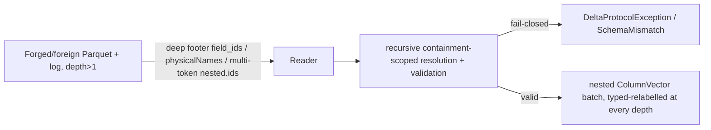

# Nested-within-nested column mapping (depth&gt;1) — recursive id/name assignment + resolution

> **Status:** Draft — **BUILD-READY** off `origin/main` @ `b0397b0` (this worktree,
> branch `khaines/design-866-nested-colmap`). Design-only: **no production code lands in this doc's PR.**
>
> **What this composes (does NOT fork):** this design **removes the `depth == 1` ceiling** from four already-shipped
> machineries and reuses their conventions verbatim — it invents no new substrate:
>
> - **#676** (single-level nested column mapping — the foundation): the `StructField`-recursive
>   `(id, physicalName)` assignment/resolution and the **C1 invariant** (ids live on `StructField`s, never on
>   array-`element`/map-`key`/map-`value`). See
>   [`nested-column-mapping.md`](nested-column-mapping.md).
> - **#839** (array/map id mode via `delta.columnMapping.nested.ids`): interior scalar ids on the *containing*
>   `StructField`, containment-scoped id-mode resolution. See
>   [`nested-array-map-id-mode.md`](nested-array-map-id-mode.md). **MERGED.**
> - **#840** (metadata-only nested rename/drop via **segment-array** addressing — never a dotted string). See
>   [`nested-rename-drop.md`](nested-rename-drop.md). **MERGED.**
> - **585a/873/585b** (nested-within-nested decode + recursive WRITE + depth&gt;1 widening — the depth&gt;1
>   *shredder/reassembly* machinery). See [`nested-within-nested.md`](nested-within-nested.md). **MERGED.**
>
> **The one-line job:** #676 fail-closes any *container inside a container*
> (`array<struct>`, `struct<struct>`, `map<*,struct>`, `array<array>`, …) at the column-mapping
> assignment/validation/resolution/write doors via `ColumnMapping.RejectNestedWithinNested`
> (`src/DeltaSharp.Storage/Delta/ColumnMapping.cs:1627`). **585a/873** already lifted the *decode* and *name/none
> WRITE* rejects for those shapes and **explicitly re-pointed the id-mode nested-within-nested WRITE reject to
> this issue** (`ParquetTypeMapping.cs:241-252`). This design lifts the remaining **column-mapping** ceiling —
> recursive id/name **assignment**, name-mode + id-mode **resolution** for leaves at **depth&gt;1**, depth&gt;1
> **rename/drop**, and the fail-closed invariants over the whole depth&gt;1 tree.
>
> **C1 (unchanged, the id model, extended one axis):** column mapping attaches `delta.columnMapping.{id,physicalName}`
> to **`StructField`s at every depth** and interior array/map scalar ids to
> **`delta.columnMapping.nested.ids` on the *nearest enclosing* `StructField`** (#839). At depth&gt;1 the two
> mechanisms **compose**: a `struct` anywhere resets the recursion (its children are `StructField`s → direct
> ids); an array/map chain with no intervening struct accumulates a **multi-token dotted-path `nested.ids`**
> (`P.element.element`, `P.value.key`, …) on the nearest `StructField` ancestor (§2.2). This is a strict
> superset of #676+#839; **it violates neither C1 nor the wire format** (it is exactly Delta Spark's
> `rewriteFieldIdsForIceberg` recursion — §2.2).
>
> **Issue:** [#866](https://github.com/khaines/deltasharp/issues/866) <!-- issue-state:open -->
> (#676 depth&gt;1 deferral; the `RejectNestedWithinNested` message currently mis-cites the **closed** #585).
> **Author:** catalog-metastore-engineer (orchestrated).
> **Reviewers:** delta-storage-format-engineer, cloud-native-distributed-systems-architect,
> reliability-test-chaos-engineer, cloud-native-security-sme, cloud-native-site-reliability-engineer,
> performance-benchmarking-engineer.
> **Last Updated:** 2026-08-28.
> **Related:** [#676](https://github.com/khaines/deltasharp/issues/676) <!-- issue-state:closed -->
> (foundation), [#839](https://github.com/khaines/deltasharp/issues/839) <!-- issue-state:closed -->
> (`nested.ids`), [#840](https://github.com/khaines/deltasharp/issues/840) <!-- issue-state:closed -->
> (rename/drop), [#585](https://github.com/khaines/deltasharp/issues/585) <!-- issue-state:closed -->
> (585a decode), [#873](https://github.com/khaines/deltasharp/issues/873) <!-- issue-state:closed -->
> (nested-within-nested WRITE — re-pointed id-mode write here), [#860](https://github.com/khaines/deltasharp/issues/860) <!-- issue-state:closed -->
> (585b widening), [#546](https://github.com/khaines/deltasharp/issues/546) <!-- issue-state:closed -->
> (nested widening), [#571](https://github.com/khaines/deltasharp/issues/571) <!-- issue-state:closed -->
> (single-level decode), [#570](https://github.com/khaines/deltasharp/issues/570) <!-- issue-state:closed -->
> (nested `ColumnVector`s), [#675](https://github.com/khaines/deltasharp/issues/675) <!-- issue-state:closed -->
> (nested CDF/column-mapping oracle).

---

## 1 · Overview

Delta **column mapping** decouples a table's *logical* column names from the *physical* names/ids stored in
Parquet, so a rename/drop is a metadata-only commit and CDF reads of old files still resolve. **#676** lifted
DeltaSharp's mapping from leaf-only to **single-level nested** — a `struct<scalars>`, an `array<scalar>`, a
`map<scalar,scalar>` (id-mode array/map added by **#839** via `nested.ids`; metadata-only nested rename/drop
added by **#840**). Every one of those designs draws the line at exactly **one** level of nesting: a struct
child / array element / map key-value that is **itself** a container
(`array<struct>`, `struct<struct>`, `map<*,struct>`, `array<array>`, `map<*,array>`, …) is **fail-closed** at
the column-mapping assignment/validation/resolution/write doors by `ColumnMapping.RejectNestedWithinNested`
(`ColumnMapping.cs:1627`), whose message still cites the **closed** #585 (a dangling deferral — the reason
this issue exists).

This design lifts that ceiling for **depth&gt;1** leaves. All four prerequisite machineries have **shipped**,
so #866 is a **removal of a depth bound in composed code**, not a new build:

| Machinery reused | Issue | State | What #866 removes the ceiling from |
|---|---|---|---|
| `StructField`-recursive `(id, physicalName)` assign/resolve + C1 | #676 | merged | the depth ceiling in `AssignMappedType`/`EvolveMappedType`/`ValidateMappedLevel`/`ToPhysicalType` |
| `nested.ids` interior scalar ids on the containing `StructField` | #839 | **closed/merged** | the single-token selector ceiling (`.element`/`.key`/`.value`) → **multi-token dotted paths** |
| segment-array rename/drop | #840 | **closed/merged** | the single-hop `F4b` descent ceiling (struct-in-struct chains) |
| nested-within-nested decode / recursive WRITE / widening | 585a/873/585b | merged | the id-mode nested-within-nested **WRITE** reject #873 re-pointed here |

**Scope of the enabled surface (this issue):**

| Shape | name mode | id mode |
|---|---|---|
| `struct<struct<…>>` (struct-in-struct, any depth) | ✅ enabled (866a) | ✅ enabled (866b) |
| `array<struct<…>>`, `map<*,struct<…>>` (struct inside array/map) | ✅ enabled (866a) | ✅ enabled (866b, `nested.ids` + struct-child ids) |
| `array<array<…>>`, `array<map<…>>`, `map<*,array<…>>`, `map<*,map<…>>` (no intervening struct) | ✅ enabled (866a) | ✅ enabled (866b, **multi-token** `nested.ids`) |
| `map` **key** that is a container | ✅ enabled where readable/writable (`RejectNestedMapKey`, `ParquetTypeMapping.cs:261`, still fail-closed per #873 D5) | ⛔ fail-closed (Parquet map-key container constraint, #873 D5) |
| rename/drop of a depth&gt;1 **struct** child (segment array) | ✅ enabled (866c) | ⛔ fail-closed (`RequireNameMode`, id-mode write deferred everywhere) |
| rename/drop of an array/map **interior** (element/key/value) at any depth | ⛔ fail-closed (C1: not a `StructField`, no logical-name hop) | ⛔ fail-closed |

Why it matters: nested-within-nested column mapping is a **production-feature gap** blocking column-mapped
tables with genuinely complex-typed columns (`array<struct<…>>` is the single most common Spark/Iceberg
shape). It is the last depth restriction left standing after #676/#839/#840/585a/873/585b, and the reason
`RejectNestedWithinNested` still cites a closed issue.

**Requirements traceability:** EPIC-05 column mapping (`storage-delta-architecture.md` §2.9 / §2.12.3);
direct follow-up of #676 §1 / §9.8 and the #873 §2.10.8 write deferral.

**Placement rationale (separate doc, not an edit to `nested-column-mapping.md`).** The foundation doc is
**round-4 final** and deliberately scoped to *single-level* nested ("Status: Draft — round-4 (final)"; its §1
scope boundary explicitly defers nested-within-nested). Its follow-ups each earned their **own** design doc —
`nested-array-map-id-mode.md` (#839) and `nested-rename-drop.md` (#840) — rather than expanding the frozen
foundation. #866 is the **third** #676 follow-up (the depth axis), is **size:XL** (§8 decomposition), and
**composes four docs** whose anchors it must cross-reference without restating. A separate
`nested-within-nested-column-mapping.md` keeps the frozen foundation stable, matches the established
one-doc-per-follow-up convention, and gives the XL decomposition (§8) a home. The foundation doc's §1 scope
table and §9.8 gain a one-line "depth&gt;1 tracked by #866" cross-reference in 866a's PR (a doc edit, not a
re-scope).

---

## 2 · Logical Architecture

### 2.1 Where depth&gt;1 mapping lives

```mermaid
graph TD
  subgraph Assign[Assignment / validation / write doors — ColumnMapping.cs]
    VML["ValidateMappedLevel (:459) — reject at :485-494"]
    AMT["AssignMappedType (:926) — reject at :946-965"]
    EMT["EvolveMappedType (:1130) — reject at :1150-1164"]
    TPT["ToPhysicalType (:1540) — reject at :1558-1578"]
    RNW["RejectNestedWithinNested (:1627)"]
  end
  subgraph NameRead[Name-mode read/projection — ColumnMappingProjection.cs]
    BDS["BuildPhysicalDataType (:95) — struct-only recursion today"]
    ASC["AssertStructCongruent (:219) — struct-only recursion today"]
    VN["NestedParquetColumnReader.ValidateNode (585a) — ALREADY recursive"]
  end
  subgraph IdRead[Id-mode read — ParquetFileReader.cs / NestedParquetColumnReader.cs]
    RFF["ResolveFileFields (:1587-1670) — depth==1 containment"]
    RSFB["ResolveStructFieldById (:2036) — scalar interior only"]
    RILB["ResolveInteriorLeafById (:2160) — scalar interior only"]
    BFIM["BuildFieldIdMap (:460) — ALREADY depth-agnostic"]
  end
  subgraph Write[Id-mode nested write — ParquetTypeMapping.cs]
    CNF["CreateNestedField (:110) — id-mode NWN re-pointed to #866 (:241-252)"]
  end
  VML --> RNW
  AMT --> RNW
  EMT --> RNW
  TPT --> RNW
  RNW -. "#866: recurse instead of reject (struct resets; array/map accumulate multi-token nested.ids)" .-> Recurse[depth-lifted descent]
  BDS -. "#866b: recurse array/map struct interior" .-> Recurse
  RSFB -. "#866b: recurse nested child sub-container" .-> Recurse
  RILB -. "#866b: recurse nested interior" .-> Recurse
  CNF -. "#866b: id-mode NWN write stamping" .-> Recurse
  classDef done fill:#dfd,stroke:#090;
  class VN,BFIM done
```



Two anchors are already depth-agnostic and need **no** change (green): `BuildFieldIdMap`
(`ParquetFileReader.cs:460`) path-keys **every** footer leaf at any depth via `EnumerateFooterLeafPaths`; and
the 585a decode validator/reassembler `ValidateNode`/`DecodeContainer`
(`NestedParquetColumnReader.cs:136`) already recurses to `MaxNestedReadDepth`. #866 threads column-mapping
identity through them, not new decode logic.

### 2.2 The composed identity model at depth&gt;1 (C1 + `nested.ids`, extended)

C1 (from #676 §2.2, unchanged): `delta.columnMapping.{id,physicalName}` attaches **only** to `StructField`s;
DeltaSharp does not put a `SchemaJson` metadata slot on an array-`element`/map-`key`/map-`value`
(`SchemaJson.WriteType`, `SchemaJson.cs:160-179` — the metadata slot fires **only** in the
`StructType`→`StructField` branch, **at any depth**). #839 added `delta.columnMapping.nested.ids`
(a `Map[String,Long]` on the **containing** array/map `StructField`) for the interior scalar ids.

At depth&gt;1 the two mechanisms compose by a single rule:

> **The "nearest enclosing `StructField`" rule.** A `StructField` at any depth carries its own `id`+`physicalName`.
> Its `nested.ids` map (if it is an array/map, or *contains* an array/map chain with no intervening struct)
> carries every interior id reachable from it **without crossing another `StructField`**, keyed by the interior's
> **physical-path suffix** joined by `.` (the `physicalName` prefix + `element`/`key`/`value` segments). A
> `struct` encountered in the descent **resets** the recursion: the struct's children are `StructField`s and own
> their ids (and their own `nested.ids`).

This is **exactly** Apache Spark's `DeltaColumnMapping.rewriteFieldIdsForIceberg` recursion (the same design
`nested-array-map-id-mode.md` §2.2 pins for the single-level case), extended past the first hop. Worked
examples (physical name of the top container = `P`; ✱ = stamped on a Parquet **leaf**; ⌂ = **structural-only**
group-node id DeltaSharp cannot stamp, Parquet.Net 6.1.0 leaf-only — §2.6, `nested-array-map-id-mode.md` §2.6):

| Logical shape | `StructField` direct ids (C1) | `nested.ids` on nearest `StructField` |
|---|---|---|
| `struct<s: struct<a:int,b:string>>` | `s`, `s.a`✱, `s.b`✱ | — (pure struct recursion; no array/map) |
| `array<struct<a:int,b:string>>` (container `arr`) | `arr`, element-struct `a`✱, `b`✱ | `{P.element: ⌂}` (element-struct group; optional, interop-only) |
| `map<string, struct<a:int>>` (container `m`) | `m`, value-struct `a`✱ | `{P.key: keyLeaf✱, P.value: ⌂}` |
| `array<array<int>>` (container `aa`) | `aa` | `{P.element: ⌂, P.element.element: intLeaf✱}` **← multi-token** |
| `array<map<string,int>>` (container `am`) | `am` | `{P.element: ⌂, P.element.key: ✱, P.element.value: ✱}` **← multi-token** |
| `map<string, array<int>>` (container `ma`) | `ma` | `{P.key: ✱, P.value: ⌂, P.value.element: ✱}` **← multi-token** |

**The single new wire-format axis is the multi-token `nested.ids` key** (`P.element.element`,
`P.value.key`, …) that appears **only** when two or more array/map hops nest with **no** intervening struct.
The struct-bearing shapes (`array<struct>`, `struct<struct>`, `map<*,struct>`) need **no** multi-token keys —
the struct resets the recursion, so they are pure #676 recursion + at most a single-token element/value
`nested.ids` entry (which #839 already emits). Structural-only ⌂ ids (the array/map **group** node) are never
footer-resolvable (Parquet.Net leaf-only, §2.6); the reader binds those groups **structurally/by containment**,
exactly as #839 binds the single-level array/map container group.

**`maxColumnId` accounting (monotonic, mode-split — extends #839's §2.3 table).** `maxColumnId` remains a
monotonic high-water mark advanced once per assigned id. Every `StructField` id (any depth) and every
`nested.ids` interior id (any depth, in **pre-order**: container, then interior selector, then deeper) consumes
exactly one increment. Name mode mints **no** `nested.ids` ⇒ each array/map hop contributes only its container
`StructField`. The ceiling check (`id <= maxColumnId`, `ColumnMapping.cs`) extends over **every** interior id
at every depth; the validator asserts only the ceiling and MUST keep accepting **gaps** (a Spark-authored table
consumes `nested.ids` values and may have a counter exceeding the `StructField` count).

**Physical schema is a pure name substitution (unchanged from #676/#839):** `ToPhysicalSchema` substitutes
physical names at every depth, byte-identical type/nullability/order. In id mode the container keeps `id` +
`nested.ids` (both consumed at write to stamp leaf `field_id`s + `parquet.field.nested.ids`); name mode strips
both.

### 2.3 Data flow — assign + id-mode read of `array<struct<a:int,b:string>>`

```mermaid
sequenceDiagram
  participant W as Writer (create, id mode)
  participant CM as ColumnMapping.AssignMappedType
  participant LOG as _delta_log (metaData.schemaString)
  participant PT as ParquetTypeMapping.CreateNestedField
  participant R as Reader (ResolveFileFields → NestedParquetColumnReader)
  W->>CM: logical arr: array<struct<a:int,b:string>>
  CM->>CM: mint arr=1/col-a; element-struct id=2 (nested.ids P.element ⌂); struct a=3/col-c ✱, b=4/col-d ✱; maxColumnId=4
  Note over CM: struct RESETS recursion — a,b are StructFields with direct ids (C1), NOT nested.ids
  CM-->>W: physical schema + nested.ids {P.element: 2} + maxColumnId=4
  W->>LOG: commit schemaString (a,b metadata on StructFields; nested.ids on arr) + config maxColumnId
  W->>PT: write physical; stamp field_id on leaf a=3, b=4; element-struct GROUP carries no field_id (⌂)
  R->>R: resolve container arr by physicalName (structural, group node); build byFieldId (BuildFieldIdMap, depth-agnostic)
  R->>R: descend element-struct STRUCTURALLY (array has one element); bind a by id 3, b by id 4 within element-struct's own leaves (containment)
  R->>R: ExpectScalarLeaf(a:int), ExpectScalarLeaf(b:string) — id-selected leaves only
  R-->>W: StructColumnVector rebuilt; values by disjoint witness domains
```

### 2.4 Component boundaries — the (gate → depth-lift vs retain) enumeration

Every site below is grounded at `origin/main` @ `b0397b0`. **Lift** = recurse/descend instead of reject;
**Retain** = the fail-closed reject stays (genuinely unsupported at any depth).

| # | Gate | File:line | Function | #866 action | Increment |
|---|---|---|---|---|---|
| **G1** | Validation door reject | `ColumnMapping.cs:485-494` | `ValidateMappedLevel` | **LIFT** — recurse validation over the depth&gt;1 tree (id/physicalName presence, ceiling, uniqueness, `nested.ids` containment at every node) | 866a/866b |
| **G2** | Assignment door reject | `ColumnMapping.cs:946-965` | `AssignMappedType` | **LIFT** — the struct arm already recurses via `AssignMappedField`; remove the child reject; make the array/map arms **descend** their interior and accumulate multi-token `nested.ids` | 866a |
| **G3** | Evolve door reject | `ColumnMapping.cs:1150-1164` | `EvolveMappedType` | **LIFT** — recurse preserving existing ids/physicalNames/`nested.ids`; mint only newly-added `StructField`s/interiors; retire on type change | 866a |
| **G4** | Write physical-schema reject | `ColumnMapping.cs:1558-1578` | `ToPhysicalType` | **LIFT** — recurse name-only relabel of struct interiors at any depth | 866a |
| **G5** | The reject helper itself | `ColumnMapping.cs:1627` | `RejectNestedWithinNested` | **UPDATE + narrow** — message/comment cite **#866** not #585; the helper is retained **only** as the map-key-container / bounded-depth guard (§2.2), and as the id-mode-unsupported-leaf guard where an increment has not yet landed (fail-closed between increments — §8) | 866a |
| **R1** | id-mode nested container resolution | `ParquetFileReader.cs:1587-1670` | `ResolveFileFields` | **LIFT** — recurse containment: a struct child / array-map interior that is itself a container descends into the resolved sub-container and binds its own interiors | 866b |
| **R2** | id-mode struct-child binding | `NestedParquetColumnReader.cs:2036,2088` | `ResolveStructFieldById`, `ValidateStructShapeById` | **LIFT** — a nested child (`DataType` is struct/array/map) descends into its file sub-container instead of routing to `ExpectScalarLeaf` | 866b |
| **R3** | id-mode array/map interior binding | `NestedParquetColumnReader.cs:2192,2212` | `ValidateArrayShapeById`, `ValidateMapShapeById` | **LIFT** — a nested interior (struct/array/map element/value) descends; a scalar interior stays #839 | 866b |
| **R4** | interior-leaf collection | `NestedParquetColumnReader.cs:2131,2142` | `ListInteriorLeaves`, `MapInteriorLeaves` | **LIFT** — a nested interior (`Item`/`Value` is a group, not a `DataField`) descends into its sub-container's leaves instead of contributing none | 866b |
| **R5** | `nested.ids` selector parse | `ColumnMapping.cs:621` | `ValidateNestedIds` | **LIFT** — accept **multi-token** dotted keys (`P.element.element`, `P.value.key`) validated against the container's declared depth&gt;1 shape (single-token stays #839) | 866b |
| **R6** | name-mode physical relabel | `ColumnMappingProjection.cs:95,219` | `BuildPhysicalDataType`, `AssertStructCongruent` | **LIFT** — recurse array/map struct interiors to substitute interior struct-child physical names (today struct-only recursion; array/map carried verbatim) | 866a |
| **R7** | name-mode decode validator/reassembler | `NestedParquetColumnReader.cs:136` | `ValidateNode`/`DecodeContainer` (585a) | **RETAIN (reuse)** — already recursive to any depth; no change (green in §2.1) | — |
| **W1** | id-mode nested-within-nested WRITE reject | `ParquetTypeMapping.cs:141-145,206-207,241-252` | `CreateNestedField`/`RejectNestedWithinNestedId` | **LIFT** — stamp interior leaf `field_id`s at any depth (name/none already recurses per #873); the message already cites **#866** | 866b |
| **W2** | map-**key**-container reject | `ParquetTypeMapping.cs:261` | `RejectNestedMapKey` | **RETAIN** — a Parquet map key that is a container is fail-closed at every depth (#873 D5; a structural Parquet constraint, not a depth ceiling) | — |
| **RD1** | rename/drop single-hop descent | `DeltaTableWriter.cs` (#840 `F4b`) | `DescendAndRebuild` | **LIFT for `struct<struct<…>>`** — allow a second+ struct hop (arbitrary struct depth); **RETAIN `F4`** (array/map interior descent stays fail-closed — no logical-name hop) | 866c |
| **RD2** | rename/drop id-mode gate | `DeltaTableWriter.cs:893` | `RequireNameMode` | **RETAIN** — id-mode nested write deferred everywhere (`storage-delta-architecture.md` §2.12.3) | — |

**BuildFieldIdMap (`ParquetFileReader.cs:460`) needs no change** — it already enumerates every footer leaf at
any depth and enforces the `MaxFooterFieldIdMapDepth` cap + path bijection. This is the substrate the R1–R4
containment checks layer parentage onto (as #676/#839 already do one level down).

### 2.5 Resolution model (name + id mode, at depth&gt;1)

**Name mode (866a).** `ResolvePhysicalNames` returns the top-level physical name; `BuildDataSchema` →
`BuildPhysicalDataType` (`ColumnMappingProjection.cs:95`) recursively substitutes physical names. Today it
recurses **struct** children only and carries array/map interiors **verbatim** (`:97` early-return). **R6**
extends it: an `array<struct<…>>` / `map<*,struct<…>>` interior descends so each interior struct-child
physical name is substituted (name-mode files bind by physical **name**, so the interior struct must be
relabelled or the decoder won't match). Array/array and array/map-of-scalar interiors carry no `StructField`
so they stay structural (verbatim). The 585a decode (`ValidateNode`/`DecodeContainer`) already reassembles the
depth&gt;1 shape; `BuildFullBatch`'s **typed inverse relabel** (`AssertStructCongruent`, `:219`) is likewise
extended (R6) to re-type array/map struct interiors to the logical `StructType` (names + per-child metadata
`Equals`-identical), so `ManagedColumnBatch`'s `column.Type.Equals(schema[i].DataType)` check holds; a residual
mismatch fails closed as a typed `DeltaStorageException.SchemaMismatch` (sanitized), never a bare
`ArgumentException` and never a raw nested `SimpleString`.

**Id mode (866b) — the #676/#839 containment model applied recursively.** Binding is
**containment-scoped and identity-selected at every level**, never a file-global positional bind:

1. **Resolve the top container** group by log `physicalName` (rename-stable) via the mode-independent
   duplicate-intolerant top-level `byName` (#676 §2.5 step 1). The container is a **group** node bound by name;
   its declared `delta.columnMapping.id` is **structural-only, never footer-resolvable**, and a container id
   found stamped on a footer leaf fails closed (unchanged from #839).
2. **Descend one level.** For each interior:
   - **struct child** → look up its `delta.columnMapping.id` in `BuildFieldIdMap` (#829) and require the
     resolved leaf to be within the **resolved sub-container's own subtree** (the #676 `IsDirectLeafChild`
     containment, applied at the child's parent group). If the child is **itself** a container, its group is
     resolved structurally/by-name within the parent and step 2 **recurses** into it.
   - **array/map scalar interior** → bind by the `nested.ids` id within the container's own interior leaves
     (#839, unchanged).
   - **array/map nested interior** (`array<struct>`, `array<array>`, `map<*,struct>`, …) → the interior
     **group** is bound **structurally** (an array has exactly one element; a map's key/value are separated by
     the canonical-name guard **and** distinct `nested.ids` where present), then step 2 **recurses** into the
     interior group. Multi-token `nested.ids` entries (`P.element.element`, …) bind the **deep scalar leaves**
     reachable without an intervening struct; each such id is looked up in `BuildFieldIdMap` and required to be
     within the correct interior sub-container (R5 + the containment check one more level down).
3. **The id-selected leaf — and only it — passes `ExpectScalarLeaf`** (`ValidateLeafPhysicalType` incl.
   temporal annotation + `ValidateLeafStructuralLevels`), so a footer that swaps `field_id` stamps across
   **differently-typed** siblings/interiors at any depth fails closed as `SchemaMismatch`, not a mid-decode
   cast fault. The per-container level thresholds
   (`MaxRepetitionLevel`/`MaxDefinitionLevel`) are taken from the **resolved** (provenance-verified)
   sub-container, exactly as 585a's `ValidateNode` keys each container's guards off that node's own levels.

**Residual (id-authoritative, same as #676/#839).** Once every ancestor group is provenance-verified and each
id-selected leaf is type-validated, a forged footer that permutes `field_id` stamps across **same-typed**
siblings/interiors inside the correct sub-container transposes their *values* — the depth&gt;1 analogue of the
accepted flat/#676/#839 id-anchor residual (`ColumnMappingIdentity.cs:78-92`). Witness-disjoint value domains
(§3 oracle) make a positional mis-bind detectable in tests; the metadata-consistent same-typed permutation
stays out of the stated threat model (§6).

### 2.6 The Parquet.Net group-node-id limitation at depth&gt;1

Parquet.Net 6.1.0 cannot stamp/read a `field_id` on a **group** node (verified in #676/#839). At depth&gt;1
this means **every** interior array/map/struct **group** id (the ⌂ ids in §2.2) is structural-only. DeltaSharp
binds those groups by containment/position; only the **leaves** carry footer `field_id`s. The cross-engine
consequence is the **same** as #839 §2.6, now at every depth:

| Direction | name mode | id mode depth&gt;1 |
|---|---|---|
| **DeltaSharp → DeltaSharp** | ✅ | ✅ round-trips (leaves by id within containment; groups by name/structure) |
| **DeltaSharp → Spark / delta-rs** | ✅ (physical names) | ⚠️ **documented unilateral divergence** — DeltaSharp stamps interior **leaf** ids faithfully but **cannot** stamp the array/map/struct **group-node** `field_id`s Spark binds containers by; a strict id-matching engine may not bind the containers. Strict **subset** of the wire format, never a mis-encoding (§8) |
| **Spark → DeltaSharp** (wrote `nested.ids`, IcebergCompatV2) | ✅ | ✅ reads (leaf ids + `nested.ids`; group-node ids ignored — DeltaSharp binds groups by name/structure) |
| **Spark → DeltaSharp** (plain id mode, **no** `nested.ids`) | ✅ (physical names) | ⛔ **fail-closed** — interior leaves carry no representable id; never mis-bound (`ValidateColumnMappingSchema` rejects an id-mode array/map lacking `nested.ids`, unchanged from #839) |

Neither non-✅ cell is a data-integrity residual — both are **fail-closed or caveated interop limits**, the
identical posture #839 shipped, extended by depth.

### 2.7 Plan/data model

- Assignment stays a pure function `Assign(StructType, long startingMaxId, ColumnMappingMode) → (StructType, long)`
  returning a fresh metadata-annotated tree (plan-node immutability); the only new behavior is deeper recursion
  and multi-token `nested.ids` accumulation on the nearest `StructField` ancestor.
- Resolution is the #676/#839 containment/identity-selection lookup applied **recursively** — `BuildFieldIdMap`
  (path-keyed, depth-agnostic) + `IsDirectLeafChild`/interior containment at each level, keyed by direct
  `StructField` id (struct) or `nested.ids` id (array/map scalar interior).
- `nested.ids` parses once at validation into a structured `(dotted-suffix) → id` table keyed off the nearest
  container's physical name; **each value's `MetadataValueKind` is checked `Long`** before use (unchanged
  #839, Finding 3); **no component composes or parses a dotted physical path for binding** — the dotted key is
  validated against the declared shape then discarded for structured segment descent.

### 2.8 API surface

No public **type** change. Externally-visible behavior: create/evolve/read of a **depth&gt;1** nested-typed
column-mapped table **succeeds** (within §1's enabled surface); depth&gt;1 struct rename/drop uses the #840
**segment-array** overload (an internal write-door signature, already `internal`). Id-mode nested-within-nested
WRITE (previously fail-closed → #866) succeeds.

### 2.9 Dependencies

| Dependency | State | Role |
|---|---|---|
| #676 nested struct/array/map column mapping | **merged** | parent — `StructField` recursion + C1 + containment model this extends past depth 1 |
| #839 array/map id-mode via `nested.ids` | **merged** (closed) | interior scalar id mechanism; #866 extends its selector to **multi-token** dotted keys |
| #840 nested rename/drop (segment-array) | **merged** (closed) | rename/drop descent; #866c lifts its single-hop `F4b` ceiling for struct chains |
| 585a nested-within-nested decode | **merged** | recursive reassembly the name-mode read reuses (`ValidateNode`/`DecodeContainer`) |
| 873 nested-within-nested WRITE | **merged** | recursive shredder for name/none; **re-pointed id-mode NWN write to #866** (`ParquetTypeMapping.cs:241-252`) |
| 585b depth&gt;1 widening | **merged** | adjacent depth&gt;1 descent (shared recursion-depth bound); not required, coordinate on shared anchors |
| #829 `BuildFieldIdMap` path-keying + footer↔decoder bijection | **merged** | depth-agnostic footer-leaf substrate (no change) |
| #830 `ColumnMappingIdentity` structured `ColumnPathKey` | **merged** | structured-segment addressing (no dotted-path parsing) |
| #675 nested CDF/column-mapping oracle | **closed** | consumes depth&gt;1 read once #866 lands |

**Prerequisite/gating analysis (the critical finding).** The issue text and #676 wrote these prerequisites as
**open** (#839 "filed, open"; #840 "filed, open"). **They are now CLOSED/merged** (verified live:
`gh issue view 839/840 → CLOSED`). **Therefore #866 is *not* gated on any unmerged prerequisite** — every
acceptance criterion is buildable now:

- **AC-assignment (866a):** buildable — extends merged #676/#839 assignment recursion.
- **AC-resolution name mode (866a):** buildable — extends merged #676 projection + 585a decode.
- **AC-resolution id mode (866b):** buildable — extends merged #839 `nested.ids` (multi-token) + merged #829
  `BuildFieldIdMap`; id-mode NWN write already re-pointed here by merged #873.
- **AC-rename/drop (866c):** buildable — lifts merged #840's single-hop gate.

The **only** residual fail-closed surfaces are *structural*, not prerequisite-gated: (i) the array/map **group-node**
id gap (Parquet.Net 6.1.0 leaf-only, §2.6 — a permanent library limit, caveated interop not a data residual);
(ii) a Parquet **map key** that is a container (`RejectNestedMapKey`, #873 D5 — a Parquet format constraint);
(iii) plain Spark id-mode array/map with **no** `nested.ids` (fail-closed by #839, unchanged). No #866 AC is
gated on any of these.

### 2.10 Tenant/storage-backend considerations

Pure metadata/schema transform, backend-independent; no new I/O (id correlation reads the already-open footer
via `BuildFieldIdMap`). Nested columns remain **outside** the statistics/data-skipping surface
(`StatisticsPolicy` skips nested types); #866 emits **no** nested/interior stat keys at any depth
(regression-asserted, §3). Recursion depth is capped by `MaxNestedReadDepth` / `MaxFooterFieldIdMapDepth` /
`SchemaJson.MaxDepth` (DoS guard, §6).

---

## 3 · Functional Test Scenarios

**Deterministic oracle (mode-split, depth&gt;1 — modeled on `nested-within-nested.md` §3.3 rigor).**
A full **write→read→resolve round-trip** over the depth&gt;1 tree in **both** modes:

- **Name mode:** the log `physicalName` path per `StructField` at every depth ≡ the footer physical-path
  prefix ≡ the footer `key_value_metadata` Spark schema-JSON path; **no `field_id` anywhere**. The 585a decode
  reassembles the depth&gt;1 vectors; the inverse relabel re-types every struct interior to the logical
  `StructType`.
- **Id mode:** additionally, the log `id` per **leaf** `StructField` **and** each multi-token `nested.ids`
  scalar interior ≡ the footer leaf `field_id`, **bijective over leaves only** (every group node — struct/
  array/map — excluded and that exclusion asserted). Every same-typed-sibling/interior test draws per-leaf
  values from **disjoint witness domains** so a positional mis-bind cannot pass on equal values. Every
  fail-closed cell asserts the **exact exception type**.

**Shape matrix S** (the depth&gt;1 surface, reused across scenarios):
`S = {struct<struct<a:int,b:string>>, array<struct<a:int,b:string>>, map<string,struct<a:int>>,
array<array<int>>, array<map<string,int>>, map<string,array<int>>, struct<a: array<int>>, map<string,map<string,int>>}`.

**Happy path — assignment (AC-assignment)**
1. **`AssignDepth2_MintsIdsForLeavesAtDepthGt1_MonotonicMaxColumnId`** — for each shape in `S`, assert every
   leaf/interior gets a fresh `(id, physicalName)`/`nested.ids` id; `maxColumnId` counts them in pre-order and
   strictly increases; **no gap in DeltaSharp-minted ids**; `RejectNestedWithinNested` does **not** fire (G2/G5
   lifted). Dual: `array<struct<a,b>>` → `maxColumnId == 4` (`arr`, element ⌂, `a`, `b`).
2. **`AssignDepth2_StructResetsRecursion_ArrayMapAccumulateMultiTokenNestedIds`** — `array<array<int>>` emits
   `nested.ids = {P.element: ⌂, P.element.element: leafId}` (multi-token); `array<struct<a,b>>` emits **no**
   multi-token key (struct reset → `a,b` are direct `StructField` ids). Asserts §2.2's rule literally.
3. **`Evolve_AddNestedLeafAtDepth2_PreservesExistingIds_MaxColumnIdStrictlyIncreases`** — add a struct child at
   depth 2; only the new leaf gets a fresh id; existing ids/physicalNames/`nested.ids` preserved (never
   re-minted); matching is per-parent-path (G3).

**Happy path — name-mode resolution (AC-resolution)**
4. **`NameMode_ReadDepth2_RoundTripIdentity`** — for each shape in `S`, write (via #873 recursive writer) then
   read; values identical; `BuildPhysicalDataType` substitutes interior struct-child physical names (R6).
5. **`NameMode_ArrayOfStruct_BatchColumnType_EqualsLogicalSchema_Exactly`** — the read-exit
   `batch.Column(i).Type.Equals(tableSchema[i].DataType)` holds incl. per-child metadata at depth 2 (R6 inverse
   relabel). Companion `NameMode_Depth2_ReorderedInteriorStructChildren_FailsClosed_NotSilentlyRelabelled`
   (`array<struct<a:long,b:long>>` reversed → ordered-congruence rejects) and
   `NameMode_Depth2_PartialRelabel_FailsClosedAsDeltaException_NotArgumentException`.

**Happy path — id-mode resolution (AC-resolution, id mode via `nested.ids` at each interior level)**
6. **`IdMode_ReadDepth2_ResolvesLeavesByFieldIdWithinContainment_RoundTrip`** — for each shape in `S`, each
   depth&gt;1 leaf resolves by `field_id` within its resolved sub-container after a logical rename (read-through,
   no rewrite); struct children by direct id (R2), array/map scalar interiors by `nested.ids` (R3), deep
   array/array leaves by **multi-token** `nested.ids` (R5).
7. **`IdMode_ArrayArray_MultiTokenNestedIds_ResolvesDeepLeaf`** — `array<array<int>>`: the `P.element.element`
   id resolves the inner element leaf within the outer→inner containment chain.
8. **`IdMode_Depth2_StructChildIdResolvesToLeafOutsideSubContainer_FailsClosed`** and
   **`IdMode_Depth2_InteriorIdResolvesToSiblingContainerLeaf_FailsClosed`** — the recursive containment check
   (R1/R2/R4) rejects a forged footer that stamps a deep id on a foreign sub-container's leaf.

**Fail-closed invariants over the depth&gt;1 tree (AC-fail-closed)**
9. **`Depth2_DuplicateFieldIdAnywhereInTree_FailsClosed`** (`BuildFieldIdMap` dup guard, any depth).
10. **`Depth2_MissingIdOrPhysicalNameOnNestedStructField_FailsClosed`** (two cells).
11. **`Depth2_NestedChildId_AboveInt32Max_FailsClosed` / `FooterSide_DeepLeafFieldId_NonPositive_FailsClosed`**.
12. **`Depth2_InteriorIdExceedsMaxColumnId_FailsClosed`** (ceiling extended to every interior id at every depth).
13. **`Depth2_DuplicatePhysicalNameAmongSiblingStructChildren_FailsClosed`** at `ValidateColumnMappingSchema`
    (`DeltaProtocolException.Inconsistent`) **and** at the duplicate-intolerant `ResolveStructFieldById`
    (`SchemaMismatch`) — two cells, each asserting its exact type.
14. **`Depth2_MultiTokenNestedIds_Containment` matrix** — a multi-token `nested.ids` key whose (a) selector
    chain does not match the container's declared shape, (b) value is non-`Long`, (c) value duplicates another
    id, (d) key references a path crossing a `StructField` boundary (which must instead carry a direct id) —
    each fails closed as a typed exception before any decode (R5).
15. **`Depth2_NestedChildPhysicalNameContainingDot_FailsClosed`** and control-char variant, at every depth.
16. **`Depth2_MappedSchemaCarryingForeignGroupNodeNestedIds_FailsClosed`** — a `nested.ids` entry for a
    struct-child path (which must be a direct `StructField` id) is rejected (the §2.2 rule is enforced, not
    silently accepted).
17. **`Depth2_ForeignReadPath_NestedStructureDisagreesWithLog_FailsClosed`** (`SchemaMismatch`) — a footer whose
    depth&gt;1 structure disagrees with the log (extra/missing/re-parented deep leaf) → rejected by the recursive
    containment + #829 bijection; no cross-column substitution.

**Rename/drop depth&gt;1 (AC-rename/drop — metadata-only, conjunctive)**
18. **`RenameDropDepth2StructChild_MetadataOnly_NoRewrite`** — rename/drop a struct child at depth ≥ 2
    (`struct<s: struct<a,b>>`, path `["s","a"]`); assert **all of**: exactly one `metaData` and zero
    `add`/`remove` ∧ SHA-256 of every data-file byte identical pre/post ∧ each `AddFile`'s
    `(path,size,modificationTime,stats,partitionValues)` identical ∧ `maxColumnId` unchanged ∧ post-read returns
    the same values under the new logical name. Addressing is a **segment array** (RD1 lifts #840 `F4b`).
19. **`RenameDropDepth2_ArrayMapInterior_FailsClosed`** — a path that would descend into an array/map interior
    (`element`/`key`/`value`) at any depth fails closed (RD1 retains `F4`: C1 — not a `StructField`, no logical
    name hop). Includes the `array<struct>` leaf case (`a` in `array<struct<a,b>>` is a `StructField` but has no
    logical-name hop through the array element → fail-closed, tracked as the documented boundary in §9).
20. **`RenameDropDepth2_IdMode_FailsClosed`** (`RequireNameMode`, RD2 retained).

**Cross-engine interop (AC-fail-closed, Spark/delta-rs)**
21. **`Interop_SparkWroteDepth2NestedIds_DeltaSharpReads`** (IcebergCompatV2 `array<struct>` / `array<array>`
    fixtures) and **`Interop_SparkPlainIdModeDepth2_NoNestedIds_FailsClosed`** (§2.6 inbound ⛔).
22. **`Interop_DeltaSharpWroteDepth2_GroupNodeIdAbsent_Documented`** — asserts DeltaSharp stamps interior leaf
    ids but no group-node id (the §2.6 outbound ⚠️ subset), pinned against a golden footer.

**Write byte-invariance / regression**
23. **`IdMode_Depth2Write_EveryDeepLeafCarriesItsOwnFieldId`** and
    **`IdMode_Depth2Write_UnstampedDeepLeaf_FailsClosedAtWriteDoor`** (W1); `NameMode_Depth2Write_NoFieldIdOnAnyLeaf`.
24. **`NoneModeDepth2` + `SingleLevelMapped` byte/behavior-unchanged** against a committed golden/SHA-256;
    regression-assert **no** nested/interior statistics keys at any depth.

**Seeded property harness (house convention)**
25. Uses `tests/Shared/TestSeed.cs` (`Resolve`/`Combine`, `DELTASHARP_TEST_SEED`), fixed 200 iterations, the
    `[deltasharp-seed]` reproduction line. Generator space: nesting depth (2..`MaxNestedReadDepth`), shape
    alphabet `S`, per-leaf **disjoint** value domains. **Tamper-operator set** (extends #676 §3.33 by depth):
    swap two same-typed deep siblings' `field_id`; relocate a deep leaf's id to a sibling sub-container; delete a
    multi-token `nested.ids` entry; set a deep id `= maxColumnId + 1`; inject a `nested.ids` key crossing a
    `StructField` boundary; inject an embedded dot into a deep `physicalName`; reverse footer sibling order at
    depth 2; delete an interior group. Invariants asserted as a **conjunction** (round-trip identity ∧ mode-split
    log↔footer leaf bijection ∧ thrown type ∈ {`DeltaProtocolException`,`DeltaStorageException`}); a
    minimization/shrink lands a failing draw as a permanent minimized regression.

**Integration**
26. **`Cdf_ReadOldFileAfterDepth2NestedRename_ResolvesViaMapping`** — the #675 oracle's depth&gt;1 extension.

**`RejectNestedWithinNested` message (AC — cite #866 not #585)**
27. **`RejectNestedWithinNested_RetainedShapes_MessageCites866_Not585`** — the retained fail-closed surfaces
    (map-key container, id-mode-unsupported-leaf between increments) name **#866**; a source-grep test asserts no
    live `#585` citation remains in `ColumnMapping.cs`.

**Sequencing.** All read/name-mode and id-mode struct resolution are testable now with `ParquetSerializer`- or
#873-authored depth-2 fixtures. The production write-path round-trip halves ride the **merged** #873 recursive
writer; there is **no** unmerged write-path dependency (unlike #676, which was gated on #834).

**Acceptance-criteria → cell map.**

| Acceptance criterion (#866) | §3 cells |
|---|---|
| Recursive `(id,physicalName)` assignment for depth&gt;1 leaves; monotonic `maxColumnId`; `RejectNestedWithinNested` lifted | §3.1, §3.2, §3.3, §3.27 |
| Name-mode + id-mode resolution of depth&gt;1 leaves (id mode via `nested.ids` at each interior level) | §3.4–§3.8 |
| Metadata-only rename/drop of a depth&gt;1 nested field | §3.18 (§3.19–§3.20 boundaries) |
| Fail-closed invariants (duplicate/missing/range/relabel + `nested.ids` containment) over the depth&gt;1 tree; cross-engine interop | §3.9–§3.17, §3.21–§3.22, §3.25 |
| Update `RejectNestedWithinNested` message to reference #866 not the closed #585 | §3.27 |

---

## 4 · Performance

- **Workload:** schema-transform at commit and read-open — O(number of nodes in the schema tree), typically
  tens of nodes, bounded by `MaxNestedReadDepth`. No per-row cost; the recursive id-mode containment check is
  O(leaves) path comparisons over the already-open footer; the inverse relabel re-types vectors without copying
  child buffers (§2.5). The 585a decode per-row cost is unchanged (this design adds identity threading, not
  decode work).
- **Targets:** assignment/resolution add &lt; 1% to a create/read-open on a realistic depth-2 wide-nested
  schema; zero allocation per data row.
- **Memory:** one metadata-annotated schema copy per transform (bounded by schema size); recursion depth ≤
  `MaxNestedReadDepth` (64) with the DoS bound checked before any descent.
- **Regression gate:** a 50-node depth-2 nested-schema assign+resolve micro-benchmark stays within the
  schema-transform noise floor; the per-batch 585a decode path is untouched (asserted by a decode-throughput
  regression pin).

---

## 5 · Security

- **Data classification:** column-mapping metadata is non-sensitive schema metadata; fail-closed messages carry
  only sanitized nested **paths** (`DiagnosticText.Sanitize`), never decoded bytes or raw foreign nested field
  names (the §2.5 congruence check runs **before** `ManagedColumnBatch`, whose `SimpleString` echo would
  otherwise leak deep nested names).
- **Input validation (the crux, extended by depth):** the footer schema and the log `metaData.schemaString`
  are attacker-influenced at every depth. Every #676/#839 fail-closed invariant now extends over the **whole
  depth&gt;1 tree** — duplicate/missing id or physicalName, id range, the `maxColumnId` ceiling over every
  interior id, global id uniqueness, per-level Ordinal physicalName uniqueness, per-level embedded-dot/control
  reject, and **`nested.ids` containment** (multi-token keys validated against the declared shape; a key
  crossing a `StructField` boundary rejected). The **recursive containment check** (§2.5) is the primary
  mis-attribution guard: a deep leaf id must resolve to a leaf **inside** its declared ancestor chain
  (structured-path equality at each level), closing cross-sub-container capture. The intra-file #829 bijection
  is a substrate, not the footer↔log parentage guarantee.
- **Fail-closed over fallback:** id mode never name-matches a deep leaf whose declared id is absent from the
  footer; every group node's structural-only id never triggers name fallback and fails closed if found on a
  footer leaf; plain id-mode array/map without `nested.ids`, map-key containers, and (Parquet.Net-limited)
  group-node id matching all fail closed rather than mis-bind.
- **DoS:** recursion depth is capped (`MaxNestedReadDepth`, `MaxFooterFieldIdMapDepth`, `SchemaJson.MaxDepth`),
  checked **before** any descent or allocation (585a §2.6 bound reused).
- **Supply-chain:** no new dependencies; depth&gt;1 write via the merged #873 recursive shredder.

---

## 6 · Threat Model



| STRIDE | Surface | Threat | Mitigation |
|---|---|---|---|
| **Tampering** | deep leaf `field_id` vs log ancestor chain | forged footer stamps a deep id on a foreign sub-container leaf → cross-column mis-attribution | **recursive containment + identity selection** (§2.5): leaf selected from the resolved sub-container's own subtree at each level; else fail closed (§3.8, §3.17) |
| **Tampering** | multi-token `nested.ids` | a key crossing a `StructField` boundary, or a selector chain not matching the declared shape | R5 validation against declared depth&gt;1 shape; typed reject before decode (§3.14, §3.16) |
| **Tampering** | duplicate deep physical name / field_id | ambiguous deep resolution / dup id | recursive per-level Ordinal uniqueness + `BuildFieldIdMap` dup guard at any depth (§3.9, §3.13) |
| **Confusion** | reordered same-typed deep struct children | count-only congruence relabels transposed children | ordered per-child congruence recursion (§2.5, §3.5) |
| **Spoofing** | id-mode deep leaf | declared id absent from footer → silent name fallback | fail closed; group-node structural-only id never name-falls-back (§3.8) |
| **Confusion** | array/map group-node id (Parquet.Net leaf-only) | invented group id → wire divergence | groups bound structurally/by-name; a group id found on a footer leaf fails closed (§2.6, §3.22) |
| **Info disclosure** | deep read-exit relabel | raw nested `SimpleString`/foreign names in an exception | typed `DeltaStorageException` + sanitized path **before** `ManagedColumnBatch` (§2.5, §3.5) |
| **DoS** | deeply/widely nested schema | unbounded recursion / allocation | depth caps checked before descent (585a bound reused) |

**Residual:** the array/map/struct **group-node** id gap (§2.6) is an **interop** limitation (fail-closed
inbound, caveated outbound), not a data-integrity residual. The depth&gt;1 same-typed-sibling id-anchor residual
(§2.5) is the nested analogue of DeltaSharp's flat/#676/#839 posture, out of the stated threat model. Map-key
containers and plain-id-mode-no-`nested.ids` stay fail-closed. None is a *silent cross-column capture* — those
are closed by recursive containment + identity selection + the map canonical-name / congruence guards.

---

## 7 · Observability

- **Logging:** fail-closed rejections log via the sanitized `DeltaProtocolException`/`DeltaStorageException`
  path; the violation message carries the **sanitized deep nested path** (e.g. `arr.element.a`). No new
  happy-path log site.
- **Metrics:** none — schema transform, no runtime hot path (the per-row 585a decode path is unchanged).
- **Correlation:** violations surface under the existing table-path/version fields on the read/commit activity.

---

## 8 · Rollout & Risk

**XL decomposition (the mandated cut — this issue is size:XL; the implement skill rejects XL).** Ship as three
independently reviewable increments in dependency order:

| Increment | Size | Scope | Gates lifted (§2.4) | Depends on | Fail-closed until it lands |
|---|---|---|---|---|---|
| **866a — recursive assignment + name-mode resolution** | **L** | `AssignMappedType`/`EvolveMappedType`/`ValidateMappedLevel`/`ToPhysicalType` depth-lift; multi-token `nested.ids` **assignment**; name-mode `BuildPhysicalDataType`/`AssertStructCongruent` recursion; update `RejectNestedWithinNested` message → #866 | G1–G5, R6 | merged #676/#839/585a | id-mode depth&gt;1 **read/write** stays fail-closed (G5 retained for id-mode leaves) |
| **866b — id-mode resolution via `nested.ids` + id-mode write** | **L** | `ResolveFileFields`/`ResolveStructFieldById`/`ValidateArray|MapShapeById`/interior-leaf collection recursion; **multi-token** `nested.ids` **parse** (`ValidateNestedIds`); id-mode NWN **write** stamping (`CreateNestedField`) | R1–R5, W1 | **866a** (assignment must emit the ids/`nested.ids` this reads) | id-mode depth&gt;1 read/write fail-closed |
| **866c — depth&gt;1 rename/drop** | **M** | lift #840 `F4b` single-hop ceiling for `struct<struct<…>>` chains; retain `F4` (array/map interior) + `RequireNameMode` | RD1 | **866a** (schema must load depth&gt;1) | depth&gt;1 struct rename/drop fail-closed (the #840 `F4b` gate becomes load-bearing once 866a makes such schemas loadable) |

**Order: 866a → 866b, 866a → 866c** (866b and 866c are independent of each other; both need 866a's assignment).
Each increment is a size:L/M work item the implement skill accepts. **Between increments the design fails
closed**, never partially-open: 866a lifts name-mode only and **retains** `RejectNestedWithinNested` for id-mode
depth&gt;1 leaves (so an id-mode depth&gt;1 create/read fails closed naming #866 until 866b), and retains #840
`F4b` (so depth&gt;1 rename/drop fails closed until 866c).

- **Rollout:** additive behind the existing `delta.columnMapping.mode` gate; single-level, `none`, and
  non-nested tables are byte/behavior-unchanged (§3.24). The Parquet.Net group-node-id interop caveat (§2.6) is
  documented, not silent.
- **Kill-switch:** each increment removes fail-closed gates for its shapes; a defect → reinstate the gate
  (revert the increment). Data written stays readable (physical names / leaf ids self-describing).
- **Risk register:** (a) deep id-mode mis-attribution → **data mis-attribution** — mitigated by the recursive
  §2.5 containment + §3.8/§3.17 + #829 bijection; (b) `maxColumnId` non-monotonicity on deep evolve → id reuse
  — single high-water counter + §3.3; (c) multi-token `nested.ids` mis-parse → wrong deep interior — R5
  validation + §3.14; (d) deep read-exit `ArgumentException`/name leak → typed relabel + §3.5; (e) cross-engine
  group-node interop — documented caveat, not silent (§2.6, §3.22); (f) rename/drop descending an array/map
  interior → §3.19 boundary.
- **Launch checklist:** unit + integration (§3) green on both TFMs; `dotnet format`; determinism ban; DCO; RFL
  PASS; the `RejectNestedWithinNested` #585→#866 message update verified (§3.27); **#839, #840, #873 confirmed
  closed/merged** (they are) and **#866 open** before PASS.

---

## 9 · Open Questions & Decisions

1. **Element-struct group `nested.ids` entry (`P.element` ⌂) — emit or omit?** For `array<struct<…>>` the
   element **group** id is structural-only (DeltaSharp can't stamp it). Emitting `{P.element: id}` matches Spark's
   `rewriteFieldIdsForIceberg` output (better outbound interop fidelity); omitting it is simpler and the reader
   binds the element group structurally regardless. **Proposed: emit it** (interop fidelity; the reader ignores
   it for binding). Confirm against a Spark-authored `array<struct>` IcebergCompatV2 fixture. <!-- TBD: golden Spark fixture to confirm the exact key set Spark emits for array<struct> vs array<array>. -->
2. **`array<struct<a,b>>` leaf rename/drop — permanently out of segment-array scope?** The struct leaves `a,b`
   are `StructField`s (renamable in principle) but segment-array addressing has **no logical-name hop** for the
   array element, so they are unaddressable by the #840 mechanism. **RESOLVED: out of scope (§3.19), fail-closed
   `F4`.** A future issue would need an indexed/interior addressing scheme (e.g. `["arr","(element)","a"]`); not
   in #866. Track as a #866 follow-up if demanded.
3. **Multi-token `nested.ids` key canonicalization.** Delta Spark joins the physical-path suffix with `.`
   (`P.element.element`). DeltaSharp must parse these **only** for validation and never for binding (structured
   segment descent). The exact selector grammar for deeply-mixed chains (`array<map<*,array<int>>>`) is pinned by
   §2.2's rule; a fixture per shape in `S` locks it. <!-- TBD: confirm Spark's exact key for a map value that is an array — P.value.element vs P.value.list.element (legacy vs 3-level). -->
4. **Coordinate with 585b (#860, merged) on the shared recursion-depth bound.** Both descend depth&gt;1 trees;
   the `MaxNestedReadDepth` / `MaxFooterFieldIdMapDepth` caps are shared. No conflict expected (585b widens
   leaves; #866 maps them), but the 866b reader edits touch the same `ValidateNode`/`ResolveStructFieldById`
   region — sequence 866b after any in-flight 585b follow-up to avoid a merge collision. **RESOLVED: both
   merged; coordinate on anchors, no runtime dependency.**
5. **Group-node id gap — accept permanently?** Parquet.Net 6.1.0 is leaf-only; the outbound ⚠️ (DeltaSharp
   can't stamp array/map/struct group-node ids) is a **library** limit, identical to #839. **RESOLVED: accept +
   document** (§2.6, §8); revisit only if Parquet.Net exposes a group-node `field_id` setter.
6. **Prerequisite states — RESOLVED.** #839 and #840 are **CLOSED/merged** (verified live), so no #866 AC is
   gated on an unmerged prerequisite (§2.9). The issue text's "filed, open" framing is stale.

---

## 10 · References

- Issue [#866](https://github.com/khaines/deltasharp/issues/866) <!-- issue-state:open -->;
  composes [#676](https://github.com/khaines/deltasharp/issues/676) <!-- issue-state:closed -->,
  [#839](https://github.com/khaines/deltasharp/issues/839) <!-- issue-state:closed -->,
  [#840](https://github.com/khaines/deltasharp/issues/840) <!-- issue-state:closed -->,
  [#585](https://github.com/khaines/deltasharp/issues/585) <!-- issue-state:closed -->,
  [#873](https://github.com/khaines/deltasharp/issues/873) <!-- issue-state:closed -->,
  [#860](https://github.com/khaines/deltasharp/issues/860) <!-- issue-state:closed -->;
  unblocks [#675](https://github.com/khaines/deltasharp/issues/675) <!-- issue-state:closed -->.
- Composed designs: `docs/engineering/design/nested-column-mapping.md` (#676 foundation, C1),
  `nested-array-map-id-mode.md` (#839 `nested.ids`), `nested-rename-drop.md` (#840 segment-array),
  `nested-within-nested.md` (585a decode / 873 write / 585b widening).
- `docs/engineering/design/storage-delta-architecture.md` §2.9 / §2.12.3.
- Code anchors — `src/DeltaSharp.Storage/Delta/ColumnMapping.cs`: `RejectNestedWithinNested` (`:1627`, message
  cites the closed #585 — updated to #866 by 866a), call sites `ValidateMappedLevel` (`:459`, reject `:485-494`),
  `AssignMappedType` (`:926`, reject `:946-965`), `EvolveMappedType` (`:1130`, reject `:1150-1164`),
  `ToPhysicalType` (`:1540`, reject `:1558-1578`); `AssignMappedField` (`:908`), `BuildNestedIds` (`:985`),
  `ValidateNestedIds` (`:621`), `NestedIdsKey`/selectors (`:133-141`).
  `src/DeltaSharp.Storage/Delta/ColumnMappingProjection.cs`: `BuildPhysicalDataType` (`:95`, struct-only
  recursion), `AssertStructCongruent` (`:219`), `BuildFullBatch` (`:159`).
  `src/DeltaSharp.Storage/Parquet/ParquetFileReader.cs`: `ResolveFileFields` nested id-mode (`:1587-1670`),
  `BuildFieldIdMap` (`:460`, depth-agnostic), `PhysicalPathKey`.
  `src/DeltaSharp.Storage/Parquet/NestedParquetColumnReader.cs`: `ValidateShape`/`ValidateNode` (585a, `:123`/`:136`,
  already recursive), `ResolveStructFieldById` (`:2036`), `IsDirectLeafChild` (`:2070`), `ValidateStructShapeById`
  (`:2088`), `NestedInteriorIds` (`:2107`), `ListInteriorLeaves`/`MapInteriorLeaves` (`:2131`/`:2142`),
  `ResolveInteriorLeafById` (`:2164`), `ValidateArrayShapeById` (`:2192`), `ValidateMapShapeById` (`:2212`).
  `src/DeltaSharp.Storage/Parquet/ParquetTypeMapping.cs`: `CreateNestedField` (`:110`), id-mode NWN write
  re-pointed to #866 (`:141-145`, `:206-207`, `:241-252`), `RejectNestedMapKey` (`:261`, retained), recursive
  name/none builder (`:273+`).
  `src/DeltaSharp.Abstractions/SchemaJson.cs`: `WriteType` metadata slot on `StructField` at any depth
  (`:160-179`) — the C1 basis; nested-object metadata round-trip (`:300-332`, `:530-580`) — the `nested.ids`
  substrate.
- Landed prerequisites: PR #836 (#829), PR #835 (#830), PR #846 (#676), PR #856 (585a), the #839/#840 impl PRs,
  PR #864 (585b), PR #878 (873 write).
