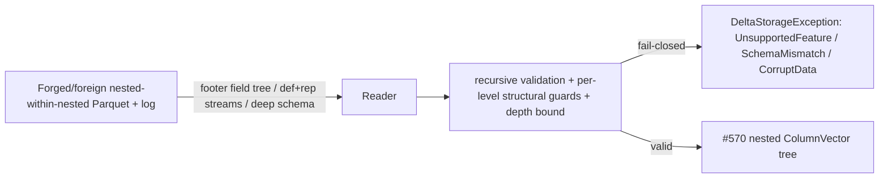

# Nested-within-nested Parquet support — recursive decode (585a) + depth&gt;1 widening (585b) + recursive WRITE (873)

> **873 addendum (WRITE — BUILD-READY off `origin/main` @ `ef35daf`).** §2.10 + §3.3 (and the 873 entries in
> §4–§9) are the build-ready design for the nested-within-nested **WRITE** residual,
> [#873](https://github.com/khaines/deltasharp/issues/873) <!-- issue-state:open -->. 585a made
> `array<struct>` / `map<*,array>` / `array<array>` / `struct<*,struct>` (and every mix, to arbitrary depth)
> **readable**; they are still **not writable** — the write path rejects a nested type WITHIN a nested type
> up front at `ParquetTypeMapping.cs:197`/`:241` and `NestedColumnShredder.cs:1532`. #873 lifts those rejects
> for **name/none column-mapping mode** by making the schema builder (`CreateNestedField`) and the shredder
> (`NestedColumnShredder`) **recurse** — building the nested repeated/optional group structure and the
> interleaved `(values, def, rep)` level streams at every depth. The write is the exact **inverse** of the
> §2.2/§2.4 585a decode, so a **write→read round-trip through 585a is the correctness oracle** (§3.3).
> **id-mode** nested-within-nested WRITE is out of scope — deferred to
> [#866](https://github.com/khaines/deltasharp/issues/866) <!-- issue-state:open --> (§2.10.8). This addendum
> is authored against the ACTUAL worktree code (every `ParquetTypeMapping.cs` / `NestedColumnShredder.cs`
> line-ref re-verified at `ef35daf`).

> **Status:** 585a **shipped** (PR #856); 585b **BUILD-READY** (#546 merged, PR #864 — this worktree off
> `2002540`); **873 (WRITE) BUILD-READY** (this addendum, off `origin/main` @ `ef35daf`). Issue
> [#585](https://github.com/khaines/deltasharp/issues/585) <!-- issue-state:closed -->
> was **size:XL** and the implement-work-item skill rejects XL, so this design splits it into two
> clearly-delineated, independently shippable increments:
>
> - **585a — recursive DECODE (buildable NOW, off `origin/main`).** Scope items 1, 3 (fail-closed parity),
>   4 (tests). Extends `NestedParquetColumnReader`'s rep/def reassembly to arbitrary nesting depth
>   (recursive container reconstruction into the [#570](https://github.com/khaines/deltasharp/issues/570) <!-- issue-state:closed -->
>   nested `ColumnVector`s), lifting the `EnsureReadSupported` / `ValidateShape` nested-within-nested reject
>   for READ. **Does NOT depend on #546.**
> - **585b — depth&gt;1 WIDENING (UNBLOCKED — [#546](https://github.com/khaines/deltasharp/issues/546) <!-- issue-state:closed -->
>   MERGED, PR #864).** Scope item 2. Extends #546's per-leaf widening + `fieldPath` emission
>   (`DeltaSchemaEnforcer`) + read-promotion (`NestedParquetColumnReader`) to leaves at depth &gt; 1 with the
>   correct nested `fieldPath` **chain** (`element`, `key`, `value`, … joined by `.`) per Delta PROTOCOL.md
>   "Type Change Metadata". #546 merged into `origin/main` (this worktree branches off `2002540`), so **585b
>   is now BUILD-READY** — §2.5 is a build-ready design reconciled against the ACTUAL merged #546 code, not a
>   forward-looking spec. Tracked as [#860](https://github.com/khaines/deltasharp/issues/860) <!-- issue-state:open -->
>   (585 auto-closed on 585a's merge; 585b needs its own tracking issue).
>
> **Rollout sequencing (§8):** 585a shipped (PR #856). 585b is buildable now that #546 is merged; it is
> feature-gated behind the existing `typeWidening` table feature (§8).
>
> **Issue:** [#585](https://github.com/khaines/deltasharp/issues/585) <!-- issue-state:closed --> (585a; 585
> auto-closed on merge) — 585b tracked as [#860](https://github.com/khaines/deltasharp/issues/860) <!-- issue-state:open -->,
> increment 3 follow-up to [#571](https://github.com/khaines/deltasharp/issues/571) <!-- issue-state:closed -->
> (single-level nested decode) and #546 (nested widening). Tracked from the #546 GO report (deferral 1).
> **Author:** delta-storage-format-engineer (orchestrated).
> **Reviewers:** delta-storage-format-engineer, dotnet-vectorized-columnar-compute-engineer,
> reliability-test-chaos-engineer, cloud-native-security-sme, cloud-native-site-reliability-engineer.
> **Last Updated:** 2026-08-27 (585b promoted to BUILD-READY, reconciled to merged #546 code).
> **Related:** #570 (nested `ColumnVector`s — the recursion target), #571/#584 (single-level nested decode
> — the reassembly 585a generalizes), #834/#842 (single-level nested **write** — the depth-2 fixture writer),
> [#676](https://github.com/khaines/deltasharp/issues/676) <!-- issue-state:closed --> (nested column mapping —
> the parallel nested surface), #546 (nested widening depth ≤ 1 — **585b's base, MERGED**),
> [#535](https://github.com/khaines/deltasharp/issues/535) <!-- issue-state:closed --> (type-widening
> read-promotion — the allowlist 585b reuses), #730 (nullability→repetition), #813 (required-nested-leaf null
> reject), [#839](https://github.com/khaines/deltasharp/issues/839) <!-- issue-state:closed --> (array/map
> id-mode nested — adjacent, out of scope; **fail-closed contract PRESERVED**).

---

## 1 · Overview

DeltaSharp **decodes single-level nested Parquet** — `struct<scalar…>`, `array<scalar>`,
`map<scalar,scalar>` — via `ParquetTypeMapping.EnsureReadSupported` and `NestedParquetColumnReader`
(#571/#584), reconstructing the raw Dremel repetition/definition levels into the immutable nested reference
vectors `StructColumnVector` / `ListColumnVector` / `MapColumnVector` (#570). Any **nested-within-nested**
shape — `array<struct>`, `struct<array>`, `struct<struct>`, `map<*,struct>`, `map<map>`, `array<array>`, … —
is rejected **fail-closed** as `UnsupportedFeature` at `EnsureReadSupported`
(`ParquetTypeMapping.cs:370`, via `EnsureScalarReadable` `:415`) and `NestedParquetColumnReader.ValidateShape`
(`:97`, via `ExpectScalarLeaf` `:1217` / `ResolveStructField` `:1113`).

Separately, type-widening promotion (#535 read-promote, #546 nested append-apply) applies only at container
**depth ≤ 1** — a top-level scalar column, or (once #546 lands) a direct scalar element/key/value of a
top-level container. A scalar leaf nested **inside** a nested-within-nested shape stays fail-closed on both
read-promotion and append-apply, because it would need a `fieldPath` in `delta.typeChanges` and the
machinery to emit and consume one does not exist yet.

This design lifts both restrictions, **decomposed** so the XL issue ships in two increments:

| Increment | Scope items | Depends on | Buildable |
|---|---|---|---|
| **585a — recursive DECODE** | 1 (recursive reassembly), 3 (fail-closed parity), 4 (decode tests) | #570/#571/#584 (**closed/merged**), #834/#842 write path for depth-2 fixtures | **Yes, now, off `origin/main`** |
| **585b — depth&gt;1 WIDENING** | 2 (per-leaf widening + nested `fieldPath` at depth &gt; 1) | **#546 (MERGED, PR #864)** | **Yes — BUILD-READY off `2002540`** |

**Why 585a is unblocked.** The recursive decode target — the #570 nested vectors — already represents
arbitrary depth: `ListColumnVector.Elements`, `MapColumnVector.Keys`/`Values`, and
`StructColumnVector.Child(i)` are each an arbitrary `ColumnVector`, so a list element child may itself be a
`StructColumnVector`, a struct child may be a `ListColumnVector`, and so on (the ctors validate only the
child *type* against the declared element/field type and the length invariants — §2.7). The decode side reads
raw Dremel levels (`ParquetRowGroupReader.ReadRawAsync<T>`), which already carry the **full** ancestor path
of every leaf. So 585a is a generalization of the existing **substrate** (vectors + raw-level reads), not a
new substrate — but note this is not "unchanged code" throughout: the struct/leaf-guard half
(`BuildStructNullMask`, `ValidateLeafStructuralLevels`) genuinely generalizes verbatim (already parameterized
by `structMaxDef`/`containerMaxDef`), whereas the **repeated-container offset/null reconstruction**
(`BuildRepeatedStructure`) is a real algorithm rewrite for any shape with ≥ 2 repeated ancestors
(`array<array>`, `map<map>`, `array<map>`, `map<array>`, …): its owner-cell boundary and element-count logic
are hard-wired to the top repeated level and mis-decode nested repeated levels (§2.2 `DecodeList`). The effort
and risk framing (§8) reflects that: 585a is a targeted rewrite of the repeated-container counter, not a pure
parameter-threading generalization.

**Why 585b is now UNBLOCKED (#546 MERGED, PR #864).** 585b extends #546's per-leaf widening + `fieldPath`
emission (`DeltaSchemaEnforcer`) and read-promotion (`NestedParquetColumnReader`) to depth &gt; 1. #546 —
now on `origin/main` (this worktree is off `2002540`) — delivered (a) the `List<NestedTypeChange>? nestedChanges`
accumulator threaded through `MergeType`'s array/map arms (via `MergeCollectionElement`) recording a
single-token `fieldPath`, and (b) the `promoteLeaf`-gated, **depth-agnostic** read-promotion arm
(`ValidateLeafPhysicalType`/`ReadScalarLeafAsync`). 585b is a **narrow gate-lift + fieldPath-chain
accumulation** over that machinery — three enforcer edits + four reader gate-lifts (§2.5), **not** a
re-implementation. *(Note: the earlier SPEC-ONLY framing described the base as an `allowWidenApply` boolean and
put read-promote in `ParquetFileReader.cs`; both were drifted — see the §2.5 spec-vs-code reconciliation.)*

**Requirements traceability:** EPIC-05 nested Parquet support (`storage-delta-architecture.md` §2.9).
**Scope boundary (explicit):** 585a lifts the nested-within-nested READ reject for the shapes the #570
vectors represent, up to a **recursion-depth bound** (§2.6, DoS guard). Nested-leaf **widening** at any depth
stays fail-closed under 585a and is enabled only by 585b (after #546). Column-mapping of nested-within-nested
(`nested.ids`, array/map id mode) remains out of scope — #676/#839.

---

## 2 · Logical Architecture

### 2.1 The Dremel invariant, generalized to arbitrary depth

Parquet stores each **leaf** column as a stream of triples `(value, def, rep)`. The two levels encode the
leaf's full ancestor path:

- **Repetition level** `rep[i]` — the deepest *repeated* ancestor (list/map) at which slot `i` is a **new
  occurrence**. `rep=0` opens a new top-level record; `rep=k` is a continuation at the `k`-th repeated
  ancestor from the root.
- **Definition level** `def[i]` — how many optional-or-repeated ancestors (up to and including the leaf's own
  optional level) are actually **present** at slot `i`. A `def` below an ancestor's level marks that ancestor
  (and everything under it) **absent**.

Parquet.Net 6.1.0 exposes, on **every** `Field` node (not only leaves), its own `MaxRepetitionLevel` and
`MaxDefinitionLevel`. The single-level reader already reads these off the container node
(`fileList.MaxRepetitionLevel`, `fileStruct.MaxDefinitionLevel`, …) and off each leaf. **These per-node max
levels are the thresholds the reassembly needs at *any* depth**, so a recursive walk keys each container's
reconstruction off *that container node's own* `MaxRepetitionLevel`/`MaxDefinitionLevel` (and its parent's
`MaxRepetitionLevel`) instead of the hard-wired `0`/`1` the single-level callers pass today. **This makes the
struct-side and leaf-guard reconstruction a clean recursion.** It does **not**, however, make the
repeated-container offset/null counting a pure recursion: `BuildRepeatedStructure`'s owner-cell boundary and
element counting are hard-wired to the top repeated level and must be **rewritten** to thread `parentMaxRep`
and gate the element count on `rep <= thisMaxRep` (§2.2 `DecodeList`). Reading the per-node levels off the
footer is necessary but not sufficient — the counting logic itself changes for ≥ 2 repeated ancestors.

### 2.2 585a — recursive decode (`DecodeContainer`)

The reader gains one recursive shredder-inverse, `DecodeNode(fileNode, requestedType, ownerCells, depth)`,
that dispatches on `requestedType`:

```
DecodeNode(fileNode, requestedType, ownerCells, depth):
  if depth > MaxNestedReadDepth: throw UnsupportedFeature   // §2.6 DoS bound, BEFORE any allocation/recursion
  match requestedType:
    scalar        -> DecodeLeaf(fileNode)                    // BASE CASE (unchanged single-leaf read)
    StructType s  -> DecodeStruct(fileNode as PqStructField, s, ownerCells, depth)
    ArrayType a   -> DecodeList  (fileNode as PqListField,   a, ownerCells, depth)
    MapType   m   -> DecodeMap   (fileNode as PqMapField,    m, ownerCells, depth)
```

`ownerCells` is the number of parent cells that reach this node position — `rowCount` at the top level, the
parent container's present-element count one level down. Each `DecodeNode` returns a `ColumnVector` whose
length is the number of cells it contributes to its parent (a struct child returns `parent.Length`; a list
element child returns the parent's total element count; a map value child returns the parent's total entry
count). This is exactly the length contract the #570 ctors enforce (§2.7).

**`DecodeStruct`** (generalizes the current `ReadStructAsync`, `:238`):
- `structMaxDef = fileStruct.MaxDefinitionLevel` (its **own** def level, not hard-wired).
- For each requested child, resolve the file child node by name (`ResolveStructField`, positional
  containment preserved), then **recurse**: `children[i] = DecodeNode(childNode, child.DataType, ownerCells,
  depth+1)`. The base case (a scalar child) is the existing `ReadScalarLeafAsync` path; a nested child
  descends.
- The struct's per-row null mask is `BuildStructNullMask(fieldDefs, structMaxDef, ownerCells, …)`
  (`:298`) — **already parameterized** by `structMaxDef`, so it needs no change. The `fieldDefs[i]` for a
  child that is *itself* a container is taken from that child's **driving leaf** (§2.2, driving-leaf rule):
  the first leaf in document order under the child, whose `def` stream (clamped at `structMaxDef`) reports
  the struct's presence at each of `ownerCells` slots. The cross-field parity guard (every child agrees, per
  row, on whether the struct is null) holds unchanged at each level.

**`DecodeList`** (generalizes `ReadListAsync`, `:360`):
- `listMaxDef = fileList.MaxDefinitionLevel`, `listMaxRep = fileList.MaxRepetitionLevel` (its **own** levels;
  `=1`/`=2`/… by depth). `emptyContainerDef = listMaxDef − 1`.
- Choose the element subtree's **driving leaf** (first leaf under `fileList.Item`), read its `(def, rep)`
  streams, and reconstruct this level's per-owner-cell offsets/nulls. **The single-level
  `BuildRepeatedStructure` (`:511`) DOES NOT generalize unchanged to a repeated container nested inside
  another repeated container** (`array<array>`, `map<map>`, `array<map>`, `map<array>`, or any array/map
  whose element/key/value is itself repeated — i.e. **≥ 2 repeated ancestors**). Two hard-wired assumptions
  in the released method are correct only at the top repeated level and are **wrong** at any nested repeated
  level (verified against `NestedParquetColumnReader.cs`):
  1. **Owner-cell boundary is hard-wired `if (rep[i] == 0)` (`:532`).** A new owner cell (parent row/element)
     at a nested level opens at `rep[i] <= parentMaxRep`, **not** `== 0` (`parentMaxRep = 0` only at the top).
     For `array<array<int>>` the inner list's owner cells are the outer list's *elements* (`parentMaxRep = 1`),
     so the inner reconstruction must open a new owner at `rep <= 1`. With the `rep == 0` boundary the inner
     walk folds all inner data into owner-row 0's continuation, and the terminal `if (row + 1 != rowCount)`
     check (`:594`) then throws `CorruptData` on **valid** depth-2 data.
  2. **Element counting is `if (d >= containerMaxDef) { elements++; }` (`:582`) with NO rep gate.** A present
     element at *this* level opens only when `rep[i] <= thisMaxRep` (a same-level-or-shallower occurrence);
     a slot with `rep[i] > thisMaxRep` is the business of a **deeper** repeated container and must be
     EXCLUDED from this level's count. For the outer level of `array<array<int>>` the ungated `d >= containerMaxDef`
     counts every present inner **leaf**, not each inner-**list** occurrence, so the outer offsets are wrong
     (they measure total inner leaves, not inner-list count).
- **Corrected reconstruction (a real algorithm change, not a re-parameterization).** Reconstruct this level
  keyed on the container node's own `(thisMaxRep = listMaxRep, thisElemDef = listMaxDef, emptyContainerDef =
  listMaxDef − 1)` **and its parent's** `parentMaxRep`:
  - **Owner-cell boundary:** a new owner cell opens at `rep[i] <= parentMaxRep` (top level `parentMaxRep = 0`
    ⇒ identical to today's `rep == 0`; depth-preserving by construction).
  - **Element occurrence at this level:** count `elements++` iff `rep[i] <= thisMaxRep && d >= thisElemDef`.
    Slots with `rep[i] > thisMaxRep` are skipped here (counted by the child recursion); slots with
    `d < thisElemDef` are the null/empty markers (three-way threshold below).
  - **Continuation legality (F2 guard, generalized):** a slot with `parentMaxRep < rep[i] <= thisMaxRep`
    continues *this* level's current owner cell (legal only when that cell opened as an element-bearing,
    non-empty/non-null container); a slot with `rep[i] > thisMaxRep` continues a *deeper* level and is not
    this level's concern; a slot with `rep[i] <= parentMaxRep` closes back to an ancestor. The empty/null
    phantom-continuation reject (`:570-579`) generalizes to this `(parentMaxRep, thisMaxRep)` window.
  This requires a **new signature** threading `parentMaxRep`/`thisMaxRep` (e.g.
  `BuildRepeatedStructure(def, rep, numValues, thisElemDef, thisMaxRep, parentMaxRep, ownerCells, offsets,
  nulls, …)`), or replacement by the single-pass emitter below — it is **not** callable unchanged.
- **Preferred: single-pass all-levels reconstruction (resolves Finding 4).** Rather than re-scan the driving
  leaf once per repeated level (the released per-level design is O(depth × numValues)), collect the ordered
  chain of repeated ancestors `R_1 … R_k` (outermost→innermost, each with its own
  `(repLevel_j, defLevel_j)` off the footer node) and emit **every** level's offsets/nulls in **one** walk of
  the driving leaf. For each slot `i` with `(d = def[i], r = rep[i])`, level `R_j` opens a new element iff
  `r <= repLevel_j`, and that element is **present** (contributes a child cell to `R_j`'s parent) iff
  additionally `d >= defLevel_j`; `d == defLevel_j − 1` is an empty container, `d < defLevel_j − 1` a null
  container (evaluated within the enclosing present-parent window). This yields all `k` offset arrays in
  O(numValues) and is the recommended shape for the rewrite.
- **Recurse into the element type** with `ownerCells = elemCount` (this level's present-element count):
  `elements = DecodeNode(fileList.Item, requested.ElementType, elemCount, depth+1)`. For
  `array<scalar>` this is the base leaf case (byte-identical to today); for `array<struct>` /
  `array<array>` / `array<map>` it descends, passing this list's `listMaxRep` down as the child's
  `parentMaxRep`.
- Assemble `new ListColumnVector(requested, elements, offsets, nulls)`; the ctor validates
  `offsets[^1] <= elements.Length` (`NestedValidity.CopyValidatedOffsets` — a dangling element tail is
  *allowed*, not required to be exact), so 585a keeps its own explicit `total == elements.Length` count
  reconciliation (mirroring the single-level `total != elements.Length` reject) rather than relying on the
  ctor for equality.

**`DecodeMap`** (generalizes `ReadMapAsync`, `:414`):
- `mapMaxDef = fileMap.MaxDefinitionLevel`. **The map key/value transposition + canonical-name guards run
  at every level** (§2.6): `EnsureCanonicalMapChildNames(fileMap, …)` (`:1098`) and
  `EnsureRequiredMapKey(fileMap, …)` (`:1077`) are called on **this** map node before its children are read.
- The **key** subtree's driving leaf drives the entry structure via the **corrected** reconstruction above
  (the `map<map>` / `map<array>` / `array<map>` cases carry ≥ 2 repeated ancestors, so the same
  `parentMaxRep`/`thisMaxRep` threading — or the single-pass emitter — is required; the released
  `BuildRepeatedStructure` mis-decodes an inner map exactly as it mis-decodes an inner list);
  the **value** subtree's driving leaf is checked for rep parity (`ValidateParallelRepetition`, `:838`) and
  entry-presence def parity (`ValidateParallelDefinition`, `:894`) against the key structure — those parity
  guards are unchanged, but now keyed off the map node's own `mapMaxDef`/`mapMaxRep` and its `parentMaxRep`.
- **Recurse into both child types** with `ownerCells = entryCount`:
  `keys = DecodeNode(fileMap.Key, requested.KeyType, entryCount, depth+1)`,
  `values = DecodeNode(fileMap.Value, requested.ValueType, entryCount, depth+1)`. A `map<*,struct>` /
  `map<map>` / `map<*,array>` descends on the value (or key) side.
- Assemble `new MapColumnVector(requested, keys, values, offsets, nulls)`.

**Max-def / max-rep per leaf at depth.** Every leaf's `(MaxDefinitionLevel, MaxRepetitionLevel)` is read
from the footer node — the recursion never hand-computes them. The **structural-level guard**
`ValidateLeafStructuralLevels` (`:1274`) already enforces, for a leaf under a container, that
`leaf.MaxRepetitionLevel == parentContainer.MaxRepetitionLevel` and `leaf.MaxDefinitionLevel ∈
[parentMaxDef, parentMaxDef+1]`. Today the single-level callers pass fixed `0`/`1`; 585a passes the
**immediate parent container node's own** `MaxRepetitionLevel`/`MaxDefinitionLevel`, so the guard generalizes
verbatim to any depth: a crafted footer whose descendant leaf declares levels inconsistent with its navigated
position (a phantom optional/repeated ancestor, a repeated primitive posing as struct rows) still fails
closed `CorruptData` **before** any reconstruction. The reconstruction remains a pure positional consequence
of levels that are schema-consistent, range-checked, length-aligned, and cross-leaf/cross-field-consistent at
**each** level.

**Null / empty-container handling at each level** is the existing three-way threshold, applied with the
current level's `containerMaxDef`:

| `def[i]` vs container level | meaning |
|---|---|
| `def < containerMaxDef − 1` | **null** container (absent) |
| `def == containerMaxDef − 1` (`emptyContainerDef`) | **empty** container (present, zero children) |
| `def ≥ containerMaxDef` | **present** container with ≥ 1 child cell (or, for a struct, a present row) |

A null *ancestor* legitimately suppresses all descendants (the descendant leaves carry `def` below the
ancestor's level, contribute no cells, and the recursion places them behind the ancestor's null/empty
window). This is the same null-list ≠ empty-list ≠ list-with-null-element distinction #571 preserves,
propagated recursively.

**Where the reject LIFTS.** Two families of call sites stop rejecting nested-within-nested and recurse
instead:
1. **Validation** — `ParquetTypeMapping.EnsureScalarReadable` (`:415`) becomes `EnsureNestedReadable`, which
   for an Array/Map/Struct interior recurses (into the element/key/value/field type) instead of throwing;
   and `NestedParquetColumnReader.ExpectScalarLeaf`'s nested-requested reject (`:1219-1233`) becomes a
   dispatch: a scalar requested type stays the base `ExpectScalarLeaf`; a nested requested type routes to a
   recursive `ValidateShape` on the child node with the child container's own levels.
2. **Decode** — `ReadScalarLeafAsync` is reached only for scalar leaves; a nested child routes back through
   `DecodeNode` (the recursion above).

**What STILL stays rejected under 585a (fail-closed parity, §2.6):**
- Every **scalar** leaf, at every depth, must be in the unchanged read allowlist — `void` and `decimal`
  precision &gt; 28 fail closed (`CreateScalarField` scalar validation, reused per leaf).
- A **zero-field struct** at any depth (no leaf to drive the row count) — the existing reject, applied
  recursively.
- A **non-canonical map** (`key_value` children not exactly named `key`/`value`, or a nullable key) at any
  depth — the transposition guard, applied recursively (§2.6).
- **Widening** of any nested leaf — under 585a, `ValidateLeafPhysicalType` (`:2286`) stays an **exact**
  physical-type match at every depth because `promoteLeaf` is gated to depth ≤ 1 (`ValidateChild:250`);
  **585b lifts that gate** to enable promotion at nested leaves (§2.5). *(Line ref reconciled: the
  merged code places `ValidateLeafPhysicalType` at `:2286`, not the earlier draft's `:1298`.)*
- Any schema nesting **deeper than the recursion-depth bound** `MaxNestedReadDepth` (§2.6) — fail closed
  `UnsupportedFeature` (never a stack-overflow crash).
- The #570 vectors represent every finite-depth `struct`/`array`/`map` tree of the enabled scalars (§2.7), so
  **no additional shape is rejected on representability grounds** under 585a. (The one shape the *write* path
  rejects — a non-nullable nested container — is a write-only concern; on read, nested-container nullability
  is advisory per #570, so a required nested container reads fine.)

### 2.3 Component boundaries (585a)

| Component | File | Change (585a) |
|---|---|---|
| `ParquetTypeMapping.EnsureReadSupported` | `ParquetTypeMapping.cs:370` | recurse the element/key/value/field validation instead of one level; retain the zero-field-struct reject at each level |
| `ParquetTypeMapping.EnsureScalarReadable` → `EnsureNestedReadable` | `ParquetTypeMapping.cs:415` | for an Array/Map/Struct interior, **recurse** (guarded by `MaxNestedReadDepth`) rather than throw `UnsupportedFeature`; scalar leaves still go through `CreateScalarField`'s unchanged allowlist |
| `NestedParquetColumnReader.ValidateShape` | `NestedParquetColumnReader.cs:97` | struct/array/map arms recurse into nested child types (passing the child node's own `MaxRep`/`MaxDef`); map arm runs the canonical-name + required-key guards at **every** level |
| `NestedParquetColumnReader.ReadAsync` / `DecodeNode` | `:198` | dispatch scalar → base leaf, nested → recurse (`DecodeStruct`/`DecodeList`/`DecodeMap`); thread `depth` and the `MaxNestedReadDepth` bound |
| `ReadStructAsync` / `ReadListAsync` / `ReadMapAsync` | `:238/:360/:414` | replace the per-child `ExpectScalarLeaf`/`ReadScalarLeafAsync` calls with `DecodeNode` at `depth+1`; key reconstruction off the **node's own** `MaxDef`/`MaxRep`; choose a per-subtree driving leaf |
| `ExpectScalarLeaf` → `ExpectChild` | `:1217` | scalar requested → unchanged `ExpectScalarLeaf`; nested requested → recurse into `ValidateShape`; the current nested-requested reject becomes the recursion entry, not a throw |
| `ValidateLeafStructuralLevels` | `:1274` | **unchanged code**, called with the immediate parent's `MaxRep`/`MaxDef` (already parameterized) — generalizes to any depth |
| `BuildStructNullMask` | `:298` | **unchanged code** (already parameterized by `structMaxDef`), called at each level with that level's threshold |
| `BuildRepeatedStructure` → single-pass repeated-level emitter | `:511` | **REWRITE (not unchanged)** for ≥ 2 repeated ancestors: owner-cell boundary generalizes from `rep == 0` (`:532`) to `rep <= parentMaxRep`; element count gains a `rep <= thisMaxRep` gate (`:582` currently ungated); new signature threads `parentMaxRep`/`thisMaxRep`, or replace with the single-pass all-levels emitter (§2.2). Top-level (`parentMaxRep = 0`, single repeated level) behavior is preserved byte-for-byte |
| `EnsureCanonicalMapChildNames` / `EnsureRequiredMapKey` | `:1098/:1077` | **unchanged code**, invoked on **every** map node (recursively), not only a top-level map |
| `NestedDecodeBudget` | `NestedParquetColumnReader.cs` | charge each level's transient structural arrays (offsets/nulls) as the recursion descends — the cumulative-bound property already holds per node; recursion sums naturally |
| `CollectLeafFields` | `:169` | already recurses the three shapes; extend to recurse nested-within-nested so the eager-decode ceiling still sums every descendant leaf's declared footprint before any allocation |

### 2.4 Data flow — decode `array<struct<a:int,b:string>>` and `array<array<int>>` (585a)

The `array<struct<…>>` sequence below has only **one** repeated ancestor (the outer list); the struct is not
repeated, so it does **not** exercise the ≥ 2-repeated-ancestor path where the released
`BuildRepeatedStructure` mis-decodes. It is retained as the struct-recursion illustration; the
`array<array<int>>` level-stream trace that follows is the **defect-exercising** case.

```mermaid
sequenceDiagram
  participant R as ParquetFileReader.ResolveFileFields
  participant V as NestedParquetColumnReader.ValidateShape
  participant D as DecodeNode (recursive)
  participant Vec as #570 nested vectors
  R->>V: requested array<struct<a:int,b:string>> vs file list node
  V->>V: array arm -> element is struct -> RECURSE ValidateShape(struct, elementNode, maxRep=1, maxDef=listMaxDef+1)
  V->>V: struct arm -> a:int, b:string -> ExpectScalarLeaf each (exact type + level guard)
  R->>D: DecodeNode(list, array<struct<...>>, ownerCells=rowCount, depth=0)
  D->>D: DecodeList: reconstruct outer offsets/nulls at (thisMaxRep=1, parentMaxRep=0, listMaxDef) -> offsets, nulls, elemCount
  D->>D: RECURSE DecodeNode(elementNode, struct<a,b>, ownerCells=elemCount, depth=1)
  D->>D: DecodeStruct: read leaf a (int) + leaf b (string) as elemCount cells; BuildStructNullMask at structMaxDef
  D->>Vec: StructColumnVector(elemCount) -> ListColumnVector(rowCount, elements=struct, offsets, nulls)
  D-->>R: ListColumnVector<StructColumnVector<int,string>>
```

**Worked level-stream trace — `array<array<int>>` (the rep≥2 case the struct example masks).** With the
Parquet 3-level LIST encoding, the optional/repeated ancestors from root to leaf are: outer group (opt),
outer `list` (rep), inner element group (opt), inner `list` (rep), leaf element (opt) — so the leaf's
`MaxDefinitionLevel = 5` and `MaxRepetitionLevel = 2`. The **outer** list node has `MaxRepetitionLevel = 1`,
`MaxDefinitionLevel = 2`; the **inner** list node has `MaxRepetitionLevel = 2`, `MaxDefinitionLevel = 4`.
Definition-level meanings: `d=0` outer null, `d=1` outer empty, `d=2` outer present + inner **null**,
`d=3` inner **empty**, `d=4` inner present + leaf slot but **value null**, `d=5` leaf value present. Consider
**4 rows** exercising the full four-way null taxonomy:

| row | logical value | classification |
|---|---|---|
| 0 | `null` (outer list absent) | **null outer** |
| 1 | `[]` (outer list present, empty) | **empty outer** |
| 2 | `[null, []]` (outer present; first inner = null, second inner = empty) | **outer-of-null/empty-inner** |
| 3 | `[[7, null], [9]]` (all present, an inner element null) | **present** |

The driving leaf emits one `(rep, def)` slot per null/empty container placeholder and one per present leaf
cell:

```
slot: r  d   meaning
row0: 0  0   outer NULL             (r<=parentMaxRep=0 opens owner 0; d<1 => outer null)
row1: 0  1   outer EMPTY            (opens owner 1; d==1 => outer present-but-empty, 0 inner lists)
row2: 0  2   inner #0 = NULL        (opens owner 2; d==2 => outer present, inner list #0 null)
      1  3   inner #1 = EMPTY       (r==1<=outerMaxRep, new outer element; d==3 => inner empty)
row3: 0  5   leaf 7                 (opens owner 3; outer present, inner #0 present, leaf value present)
      2  4   leaf NULL              (r==2 => deeper repeat: same inner #0, next leaf slot; d==4 => value null)
      1  5   leaf 9                 (r==1 => new outer element: inner #1; leaf value present)
```

**Outer level (`thisMaxRep = 1`, `parentMaxRep = 0`, `thisElemDef = 2`).** Owner cells open at `r <= 0`
(rows 0–3). An outer **element** (one inner-list occurrence) is counted iff `r <= 1 && d >= 2`:
- row0: no slot with `d ≥ 2` → 0 elements; owner-open `d = 0 < 1` ⇒ **null outer**.
- row1: owner-open `d = 1` ⇒ **empty outer**, 0 elements.
- row2: slots `(0,2)` and `(1,3)` both satisfy `r ≤ 1 && d ≥ 2` → **2** inner-list elements.
- row3: slots `(0,5)` and `(1,5)` satisfy `r ≤ 1 && d ≥ 2`; slot `(2,4)` has `r = 2 > 1` and is **excluded**
  (it is the inner level's business) → **2** inner-list elements.

So `outer offsets = [0, 0, 0, 2, 4]` — the outer boundaries count **inner-list occurrences**, not leaf cells,
and `elemCount = 4` present inner lists total. **Contrast the released code:** its ungated
`if (d >= containerMaxDef) elements++` at `containerMaxDef = 2` counts *every* slot with `d ≥ 2` — row2's 2
plus row3's `(0,5)`,`(2,4)`,`(1,5)` = **3** — giving `outer offsets = [0,0,0,2,5]` and `elemCount = 5`. It
then recurses expecting **5** inner-list owner cells when there are only **4**, and the count reconciliation
throws `CorruptData` on valid depth-2 data (or, absent that guard, mis-assigns leaves across inner lists).

**Inner level (`thisMaxRep = 2`, `parentMaxRep = 1`, `thisElemDef = 4`), over `ownerCells = 4` inner lists.**
Owner (inner-list) boundaries now open at `r <= 1` (**not** `r == 0` — the released `:532` boundary folds
everything into inner-list 0 and then throws `CorruptData` at `:594` because `row+1 (=1) != rowCount (=4)` on
valid data). A leaf **slot** is counted iff `r <= 2 && d >= 4`; the leaf's own `d` (5 vs 4) then distinguishes
value-present vs value-null within a present slot:
- inner list #0 (row2, slot `(0,2)`): owner-open `d = 2 < 3` ⇒ **null inner**, 0 leaf slots.
- inner list #1 (row2, slot `(1,3)`): owner-open `d = 3 == thisElemDef − 1` ⇒ **empty inner**, 0 leaf slots.
- inner list #2 (row3, slots `(0,5)`,`(2,4)`): both `r ≤ 2 && d ≥ 4` ⇒ **2** leaf slots; `(2,4)` `d = 4` is a
  **null value**, `(0,5)` `d = 5` present → values `[7, null]`.
- inner list #3 (row3, slot `(1,5)`): 1 leaf slot, value `9`.

So `inner offsets = [0, 0, 0, 2, 3]`, `inner nulls = [null, —, —, —]` (list #0 null, #1 empty), and the leaf
vector is `[7, null, 9]` with a per-leaf null mask marking index 1. The **four-way** distinction — null outer
(row0) / empty outer (row1) / outer-of-null-or-empty-inner (row2) / fully present with a null inner element
(row3) — is reconstructed exactly, and **only** the corrected `(parentMaxRep, thisMaxRep, thisElemDef)`
-parameterized (or single-pass) reconstruction yields it; the released `BuildRepeatedStructure` fails at
both levels.

### 2.5 585b — depth&gt;1 widening (BUILD-READY; [#546](https://github.com/khaines/deltasharp/issues/546) <!-- issue-state:closed --> MERGED)

> **585b is UNBLOCKED and BUILD-READY.** #546 merged (PR #864) into `origin/main` (this worktree is off
> `2002540`). This section is reconciled against the **actual merged #546 code** — the earlier SPEC-ONLY line
> references had drifted (see the **Spec-vs-code reconciliation** callout below). Tracked as
> [#860](https://github.com/khaines/deltasharp/issues/860) <!-- issue-state:open -->.

**What #546 actually delivered (the base 585b extends), reconciled to merged code.** #546 enables
type-widening at container **depth ≤ 1** via two halves:

- **Append-apply (`DeltaSchemaEnforcer.cs`).** The applied-widening plumbing is **not** a boolean
  `allowWidenApply` (the pre-#546 spec's name) — it is a `List<NestedTypeChange>? nestedChanges` **accumulator**
  threaded through `MergeType` (`:308`) into the array/map arms via `MergeCollectionElement` (`:413`). A
  `NestedTypeChange` (`:157`) is a `readonly record struct (string FieldPath, DataType From, DataType To)`.
  `MergeCollectionElement` applies a sanctioned same-family widening of a **direct** element/key/value scalar
  of a top-level container and records it with a **single** `fieldPath` token, but only under the
  `elementDepth <= 1` gate (`:437`); a **nested-within-nested** interior leaf recurses back through
  `MergeType(..., nestedChanges: null)` (`:433`), so any deeper change is **dropped** (fail-closed at the
  `elementDepth <= 1` scalar gate → `TypeWideningUnsupported`). `MergeField` (`:262`) drains `nestedChanges`
  into the enclosing field's metadata via `AppendTypeChange(existing, from, to, string? fieldPath)` (`:486`),
  which already emits `"fieldPath"` when non-null (`:494-496`). A struct field's own scalar widening is
  recorded on the `StructField` directly with `fieldPath: null` (`MergeField:295`).
- **Read-promote (`NestedParquetColumnReader.cs`, NOT `ParquetFileReader.cs`).** #546's nested read-promotion
  landed in the **nested** reader (the flat `ParquetFileReader` handles only top-level scalar columns).
  `ValidateLeafPhysicalType` (`:2286`) **already has** a `promoteLeaf`-gated widening-tolerant arm
  (`:2289-2292`), and `ReadScalarLeafAsync` (`:1129`) **already has** the per-leaf value-promotion logic
  (`:1138-1145`, delegating to `ReadPromotedLeafAsync`) — both reusing `TypeWidening.IsSanctionedWidening`
  (incl. the integral→decimal fit guard) exactly as the flat path does. Promotion is **gated by a composed
  `promoteLeaf`**: `allowTypeWideningPromotion && depth <= 1` on the validate side (`ValidateChild:250`) and
  `allowTypeWideningPromotion && depth == 0 && byFieldId is null` on the decode side (`DecodeStruct:521`,
  `DecodeList:716`, `DecodeMap:804`). Both encodings mean the same thing — *a leaf directly under a single
  top-level container* (validate `depth` is the child's own container depth, decode `depth` is the container's
  own depth; child-depth `≤ 1` ⇔ container-depth `== 0`).

> **⚠ Spec-vs-code reconciliation (drift the earlier SPEC-ONLY §2.5 got wrong — verified in this worktree).**
> | Earlier §2.5 / §10 claim | Actual merged #546 code |
> |---|---|
> | Read-promote lives in `ParquetFileReader.cs:1741/2089` | Nested read-promote lives in `NestedParquetColumnReader.cs` (`ValidateLeafPhysicalType:2286`, `ReadScalarLeafAsync:1129`, `ReadPromotedLeafAsync`); `ParquetFileReader` is the **flat** path only |
> | 585a keeps `ValidateLeafPhysicalType` EXACT; 585b must **add** a widening-tolerant arm | The widening-tolerant arm **already exists** (`:2289-2292`), `promoteLeaf`-gated and **depth-agnostic**. 585b does **not** add an arm — it only **lifts the gate** feeding `promoteLeaf` |
> | Applied-widening plumbing is a boolean `allowWidenApply` | It is a `List<NestedTypeChange>? nestedChanges` accumulator + single-token `fieldPath`; there is no `allowWidenApply` symbol |
> | `AppendTypeChange` "omits `fieldPath` entirely" and must gain a `fieldPath` param | `AppendTypeChange(…, string? fieldPath)` **already** emits `fieldPath`; `NestedTypeChange` already carries it. **No signature change is needed** — a chain like `element.element` is just a longer string |
> | `ValidateLeafPhysicalType:1298`, `MergeType:280`, `AppendTypeChange:388` | Drifted line refs → `:2286`, `:308`, `:486` (this worktree); the id-mode fail-closed contract (below) was not mentioned at all |

**What 585b adds — the delta over merged #546.** Because the widening *machinery* (allowlist, value
promotion, `fieldPath` emission, `NestedTypeChange`) already exists and is depth-agnostic, 585b is a **narrow
gate-lift + fieldPath-chain accumulation**, not new machinery:

1. **The `fieldPath` chain (Delta PROTOCOL.md "Type Change Metadata").** A `delta.typeChanges` entry for a
   collection-interior widening carries a `fieldPath` navigating from the enclosing `StructField` to the
   widened leaf using the fixed tokens **`element`** (array element), **`key`** (map key), **`value`** (map
   value), joined by `.`, **oldest-first / outermost-first**. Struct fields never appear in a `fieldPath` — a
   struct child re-enters `MergeField`, which starts a **fresh** `fieldPath` namespace and records the child's
   own change on the inner `StructField` (no path). The token table (verified against the merge trace below):

   | Column type | Widened leaf | `fieldPath` | Attached to |
   |---|---|---|---|
   | `array<array<int→long>>` | inner element | `element.element` | the array field |
   | `map<string, array<int→long>>` | value-array element | `value.element` | the map field |
   | `array<map<string, int→long>>` | element-map value | `element.value` | the array field |
   | `map<array<int→long>, string>` | key-array element (map **key** widened) | `key.element` | the map field |
   | `array<map<int→long, string>>` | element-map key (map **key** widened) | `element.key` | the array field |
   | `array<array<array<int→long>>>` (depth-3) | innermost element | `element.element.element` | the array field |
   | `map<string, array<array<int→long>>>` (depth-3) | inner-inner element | `value.element.element` | the map field |
   | `struct<xs: array<int→long>>` | `xs` element | `element` | the **`xs`** StructField |
   | `array<struct<a: int→long>>` | element-struct field `a` | *(none — `fieldPath: null`)* | the inner **`a`** StructField |

   > **Note (map-key chains).** Map **key** widening is sanctioned (mirroring #546's top-level
   > `Reconcile_MapKeyWidening`, `fieldPath="key"`), so `key`-prefixed chains are valid — but a `key.key` chain
   > (a map whose key is itself a map) is **unreachable**: DeltaSharp's `MapType` prohibits a map-typed key
   > (`SchemaValidationException: Map key type 'map' is not supported`). The constructible depth-2 map-key
   > chains are therefore `key.element` (`map<array<int→long>,string>`) and `element.key`
   > (`array<map<int→long,string>>`). **⚠ Writability caveat (873 §2.10.7 D5).** These two differ in physical
   > writability: `element.key` has a **scalar** map key (`int`, inside a nested map that is an array element)
   > — it is `REQUIRED` and **writable**, so it round-trips end-to-end. `key.element` has a **nested**
   > (array-typed) map key, which #873 proves is **NOT physically writable** — Parquet.Net emits the key node
   > OPTIONAL, which the 585a `EnsureRequiredMapKey` reader rejects, so no data file for `map<array<…>,…>` can
   > exist. Its 585b **append-apply** cell is therefore a **schema-merge-only** assertion (the enforcer records
   > `NestedTypeChange("key.element", …)` on the metadata — valid as pure merge logic); there is **no**
   > read-promote / data round-trip for it, and #713's footer-artifact tests must not attempt to author a
   > nested-map-key file. `element.key` is unaffected and remains fully exercised in §3.2.

2. **Allowlist + decimal-fit reuse (verbatim, NO new sanction).** The eligibility predicates are unchanged:
   `TypeWidening.IsSchemaEvolutionWidening` (`:174`, append-apply subset — same-family + `date→timestamp_ntz`)
   and `TypeWidening.IsSanctionedWidening` (`:53`, read-promote superset — adds cross-family #535), including
   the grow-only-decimal / integral→decimal fit guard. 585b changes only **where** widening applies (any
   depth) and the **fieldPath** emitted (a chain). A cross-family or non-fitting change at any depth still
   fails closed `TypeWideningUnsupported`; a truly-unrelated change still fails `IncompatibleType`.

**The fieldPath-chain accumulation algorithm (append half).** Thread an accumulated prefix through
`MergeType` and combine one token per array/map descent; the struct boundary resets it:

```
Combine(prefix, token) = prefix is null ? token : prefix + "." + token   // "." join, outermost-first

MergeField(tableField, writeField, depth):
    nestedChanges = []                                  // FRESH per StructField ⇒ struct children excluded from any ancestor chain
    merged = MergeType(tableField.DataType, writeField.DataType, depth,
                       fieldPathPrefix: null, nestedChanges)     // this field roots its OWN fieldPath namespace
    ...
    if scalar→scalar: AppendTypeChange(meta, from, merged, fieldPath: null)   // struct field's own change, no path
    else: foreach c in nestedChanges: AppendTypeChange(meta, c.From, c.To, c.FieldPath)

MergeType(table, write, depth, fieldPathPrefix, nestedChanges):
    case (Struct, Struct):  return MergeStruct(fieldDepth: depth+1)          // NO prefix propagation — struct resets (each child = fresh MergeField)
    case (Array,  Array):   elementPath = Combine(fieldPathPrefix, "element")
                            return MergeCollectionElement(elem, depth+1, fieldPath: elementPath, nestedChanges)
    case (Map,    Map):     keyPath   = Combine(fieldPathPrefix, "key")
                            valuePath = Combine(fieldPathPrefix, "value")
                            return MergeCollectionElement(key,   depth+1, fieldPath: keyPath,   nestedChanges) , …value…
    default (scalar/kind-mismatch): existing depth<=1 gate UNCHANGED (governs pure struct-nested scalars, see D9)

MergeCollectionElement(table, write, elementDepth, fieldPath, nestedChanges):
    if table.Equals(write): return table
    if nested-container(Struct|Array|Map):
        return MergeType(table, write, elementDepth,
                         fieldPathPrefix: fieldPath,        // 585b: was implicitly none — thread the accumulated chain as the new prefix
                         nestedChanges: nestedChanges)      // 585b: was `null` — thread the SAME accumulator (deep changes no longer dropped)
    if typeWideningEnabled && IsSchemaEvolutionWidening(table, write):     // 585b: dropped the `elementDepth <= 1 &&` cap
        nestedChanges?.Add(new NestedTypeChange(fieldPath, table, write))  // fieldPath is now the FULL chain
        return write
    if IsSanctionedWidening(table, write): throw TypeWideningUnsupported     // reused verbatim
    throw IncompatibleType                                                   // reused verbatim
```

Worked trace — `array<array<int→long>>`: `MergeField(depth=0)` → `MergeType(prefix=null)` → Array arm
`elementPath = "element"` → `MergeCollectionElement(fieldPath="element", elementDepth=1)` → nested container →
`MergeType(prefix="element")` → inner Array arm `elementPath = Combine("element","element") = "element.element"`
→ `MergeCollectionElement(fieldPath="element.element", elementDepth=2)` → scalar, gate lifted → records
`NestedTypeChange("element.element", int, long)`. `struct<xs: array<int→long>>`: the top struct routes through
`MergeStruct`→`MergeField(xs, prefix=null)`, so `xs`'s element chain restarts at `"element"` and attaches to
the **`xs`** StructField (the struct boundary excludes it from any outer chain). ✔ matches the table.

**Exact enforcer changes (`DeltaSchemaEnforcer.cs`) — three edits, no signature change to `AppendTypeChange`/`NestedTypeChange`:**

| # | Site | Change |
|---|---|---|
| E1 | `MergeType` (`:308`) + its call in `MergeField` (`:277`) | Add a `string? fieldPathPrefix` parameter (passed `null` at the `MergeField` call site). In the **Array** arm (`:342`) pass `fieldPath: Combine(prefix, "element")`; in the **Map** arm (`:348/:356`) pass `Combine(prefix, "key")`/`Combine(prefix, "value")`. **Struct** arm (`:333`) unchanged (resets via `MergeStruct`→`MergeField`). Default scalar arm (`:380`) `depth <= 1` gate **unchanged** (D9). |
| E2 | `MergeCollectionElement` nested-container branch (`:433`) | Change `MergeType(..., nestedChanges: null)` → `MergeType(..., fieldPathPrefix: fieldPath, nestedChanges: nestedChanges)` — thread the accumulated chain **and** the same accumulator (deep changes accumulate instead of being dropped). |
| E3 | `MergeCollectionElement` scalar apply gate (`:437`) | Lift `elementDepth <= 1 && typeWideningEnabled && IsSchemaEvolutionWidening(...)` → `typeWideningEnabled && IsSchemaEvolutionWidening(...)`. `elementDepth` stays a parameter (still forwarded as `MergeType`'s `depth` in E2). The recorded `NestedTypeChange` now carries the full chain string. `AppendTypeChange`/`NestedTypeChange`/`MergeField`'s drain loop are **unchanged**. |

**Exact reader changes (`NestedParquetColumnReader.cs`) — four one-token gate lifts; the widening arm + value promotion already exist:**

| # | Site | Change |
|---|---|---|
| R1 | `ValidateChild` (`:250`) | `promoteLeaf = allowTypeWideningPromotion && depth <= 1` → `promoteLeaf = allowTypeWideningPromotion` (drop `&& depth <= 1`). |
| R2 | `DecodeStruct` scalar child (`:521`) | `... && depth == 0 && byFieldId is null` → `... && byFieldId is null` (drop `&& depth == 0`). |
| R3 | `DecodeList` scalar element (`:716`) | drop `&& depth == 0` (keep `&& byFieldId is null`). |
| R4 | `DecodeMap` scalar key/value (`:804`) | drop `&& depth == 0` (keep `&& byFieldId is null`). |
| R5 | **Driving-leaf reads** in `DecodeStruct` (struct-presence probe), `DecodeList`, `DecodeMap` (key + value) | **Implementation-discovered gap.** These read a *discarded* driving leaf for its def/rep **structure only**, previously at `FirstScalarType(requested.X)` — the *requested* (now possibly **widened**) first-scalar type. Under 585b a widened deep leaf makes `requested` (e.g. `long`) differ from the narrow physical leaf (`int`), so a driving read at the requested wide type would **fault the raw typed decode**. Fix: read each driving leaf at its **own physical type** (`ParquetTypeMapping.ToDataType(drivingLeaf)`) with `promoteLeaf: false` — def/rep are type-agnostic, so structure is identical and no promotion/fault occurs. `FirstScalarType` is removed (its only callers were these driving reads). |

`ValidateLeafPhysicalType`'s widening arm (`:2289-2292`), `ReadScalarLeafAsync`'s value promotion
(`:1138-1145`), and `ReadPromotedLeafAsync` are **reused verbatim** — they are already `promoteLeaf`-gated and
depth-agnostic (the value path already threads the correct `presentFloor` for a nested element, `:728`). Once
`promoteLeaf` is `true` at a deep leaf, promotion Just Works: 585a rebuilds the structure, 585b relaxes the
per-leaf exact-match to the allowlist and inserts the **same** value promotion the depth≤1 path uses. The
**driving-leaf reads (R5)** are the one place the widened `requested` type leaks into a structural read, so they
must read at the physical type — the rest of the promotion machinery is untouched.

**PRESERVED — the id-mode fail-closed contract (do NOT wire id-mode nested-leaf promotion; #546 §9 O1 /
[#839](https://github.com/khaines/deltasharp/issues/839) <!-- issue-state:closed -->, out of 585b scope).**
The reader gate lifts R1–R4 keep the `&& byFieldId is null` conjunct, and every id-mode leaf site keeps
`promoteLeaf: false` hardcoded — unchanged by 585b:
- `ResolveStructFieldById` → `ValidateLeafPhysicalType(..., promoteLeaf: false)` (`:2031`); `DecodeStruct`'s
  id-mode branch reads with `promoteLeaf: false` (`:436`).
- id-mode array/map interior branches (`DecodeList:719`, `DecodeMap:834/:864`) and the up-front `…ById` interior
  validators (`ValidateListShapeById`-family `:2173`, `ValidateMapShapeById`-family `:2196/:2199`) all pass
  `promoteLeaf: false`.
- Deeper name-mode recursion already nulls `byFieldId` (`DecodeStruct:505`, `DecodeList:690`, `DecodeMap:901/:907`),
  so `&& byFieldId is null` is only decisive at the top-level entry: an id-mode column never promotes at any
  depth, a name-mode column now promotes at any depth. Id-mode nested-leaf widening remains a **deliberate
  fail-closed non-promotion**, tracked elsewhere — an id-mode narrow leaf under a widened schema fails closed
  `SchemaMismatch`, exactly as under #546.

**Recursion-depth bound interaction (585a `MaxNestedReadDepth = 64`, §2.6).** 585b adds **no** new bound and
**no** new recursion. Read-promotion is a per-leaf value decision taken *inside* the recursive decode that is
already bounded by `MaxNestedReadDepth` (checked at `ValidateNode`/`DecodeNode` entry, `:141`/`:335`), so a
leaf deeper than 64 fails closed `UnsupportedFeature` **before** any promotion is even considered. On the
append side the merge walks the same log/footer-capped schema trees (§2.6). The chain string grows one token
(`≤` `".value"`, 6 chars) per level, bounded by the same depth cap — no unbounded `fieldPath`.

**Fail-closed parity at every depth (unchanged from 585a + reused #546 allowlist).** Every unsanctioned change
stays fail-closed at every depth: cross-family on append (`IsSchemaEvolutionWidening` false → falls to
`IsSanctionedWidening` → `TypeWideningUnsupported`), non-fitting decimal (fit guard inside the predicate),
narrowing / cross-kind (`IncompatibleType`), and — critically — the **parity invariant**: the reader's
name-mode gate lift is **uniform (any leaf, any depth)** while the enforcer only auto-applies array/map
interior widenings, so **for a NAME-mode table reader coverage ⊇ enforcer coverage** — anything the enforcer
commits is name-mode read-promotable, so 585b never mints an unreadable name-mode table (the failure mode §6
calls out).

> **⚠ id-mode caveat (pre-existing #546, tracked in [#870](https://github.com/khaines/deltasharp/issues/870)).**
> The `reader ⊇ enforcer` invariant holds **only in name mode**. The enforcer receives only
> `SchemaEvolutionMode`, never `ColumnMappingMode`, so it auto-applies a nested-collection widening regardless
> of column-mapping mode — but an **id-mode** nested leaf is deliberately never read-promoted (`promoteLeaf:
> false`, #839/#546 §9 O1). On an id-mode table with `typeWidening` enabled, the enforcer can therefore commit
> a nested widening the id-mode reader fails closed on (an unreadable table for pre-widening files). This is
> **pre-existing #546 behavior at depth 1** and is **not introduced by 585b**: 585b extends only name-mode
> promotion to depth>1, and id-mode nested-within-nested shapes are rejected upstream (`UnsupportedFeature`),
> so no *new* unreadable-table surface is added. The proper write-side guard (enforcer must not apply a nested
> widening under id mode) is tracked in #870; 585b's read-side id-mode fail-closed is pinned by
> `IdMode_Depth1_NarrowScalarLeaf_WideRequest_GateOpen_FailsClosed_SchemaMismatch`.

**Cross-engine / protocol note (Delta PROTOCOL.md "Type Change Metadata").** The emitted `fieldPath` grammar —
`element` / `key` / `value` tokens joined by `.`, struct fields excluded (they carry their own per-field
`typeChanges`), outermost-first — is exactly Spark/Delta-Kernel's nested type-change path grammar, so a table
DeltaSharp evolves at depth &gt; 1 round-trips through the log JSON (`SchemaJson` serialize/parse) and reads
identically in Spark/Delta-Kernel. The end-to-end append test asserts the chain survives the log-JSON
round-trip (§3.2), and the tokens match the protocol verbatim — no DeltaSharp-private path syntax.

### 2.6 Fail-closed parity, the recursion-depth bound, and recursive guards (585a)

**Allowlist unchanged.** The scalar read allowlist is untouched: every leaf at every depth is validated by
the same `CreateScalarField` path (rejecting `void`, `decimal>28`, and unmapped physical types). No
nested-within-nested shape "unlocks" a new scalar. Nested-leaf **widening** is out of 585a (exact match
only); it is 585b's scope and stays fail-closed until #546 + 585b land.

**Recursion-depth bound (DoS guard).** The recursion walks two attacker-influenced trees — the requested type
(from the log `metaData.schemaString`) and the file field tree (from the footer). Both are already
depth-bounded upstream, and DeltaSharp's **write** path is capped too. The verified caps are:

| Cap | Value | Source | What it bounds |
|---|---|---|---|
| `SchemaJson.MaxDepth` | **64** JSON containers | `SchemaJson.cs:50` | log-parse of `metaData.schemaString`; a struct costs 3 JSON containers ⇒ ~**21 struct levels**, array/map cost 1 each ⇒ ~**64 array/map levels** |
| `ParquetTypeMapping.MaxFooterTypeDepth` | **64** type levels | `ParquetTypeMapping.cs:864` | footer type-tree walk on **read** (mirrors the write cap) |
| `DeltaWriteSchemaEligibility.MaxDepth` | **64** type levels | `DeltaWriteSchemaEligibility.cs:60` | **write** eligibility — the deepest schema DeltaSharp will commit |

The **decode recursion itself** must carry its own explicit bound so a maliciously deep schema cannot exhaust
the stack or drive a pathological allocation fan-out. 585a introduces `MaxNestedReadDepth`, set to **64**
(= the write cap `MaxFooterTypeDepth` / `DeltaWriteSchemaEligibility.MaxDepth`). **The read cap MUST be ≥ the
write cap:** a smaller read cap (e.g. the earlier proposal of 32) would create a **read-after-write parity
gap** — a schema DeltaSharp itself wrote at depth 33–64 would then be **rejected on read** — and, because 32
sits *below* the ~64 array/map levels `SchemaJson`/`MaxFooterTypeDepth` admit, it would be the **first-firing**
gate for array/map chains rather than a never-over-rejecting backstop. At **64** the read cap never
over-rejects a schema the write/log/footer caps admit; it fires only on schemas already at/over those caps
(and only, in practice, on struct-heavy trees `SchemaJson` would itself have rejected at ~21 levels). The
bound is checked at `DecodeNode`/`ValidateShape` entry **before** any per-level allocation or descent, so a
schema deeper than the bound fails closed `UnsupportedFeature` (a deterministic, typed rejection — never a
`StackOverflowException`, which would bypass the fail-closed contract). Because the requested type is walked
in validation *before* decode, an over-deep schema is rejected at shape resolution, before a single data page
is read.

**Map-transposition + canonical-name guards recursively.** Parquet.Net binds `key_value` children
**positionally** (`MapField.Assign`: first → `Key`, second → `Value`), so a `map<T,T>` with a required value
can silently transpose key/value past the type/level guards. 585a runs `EnsureCanonicalMapChildNames`
(Ordinal `key`/`value` assertion) **and** `EnsureRequiredMapKey` on **every** map node the recursion visits
— a `map<map<T,T>, …>` checks the outer map *and* the inner map. The list arm remains name-agnostic
(single-child lists have no transposition hazard, and a `list`/`element` name check would fail-close
legitimate legacy-shaped foreign lists — parity with #571's decision).

**Cross-leaf / cross-field structural agreement at each level.** The struct null-mask parity
(`BuildStructNullMask`), the list/map state-transition legality (`BuildRepeatedStructure`), the map rep/def
parity (`ValidateParallelRepetition`/`ValidateParallelDefinition`), and the leaf structural-level guard
(`ValidateLeafStructuralLevels`) all run at **every** recursion level against that level's thresholds. A
crafted def/rep stream that is self-consistent at one level but contradicts a deeper level fails closed
`CorruptData` at the level whose invariant it violates — no crafted stream silently mis-decodes to
wrong-but-plausible data at any depth.

### 2.7 Data / vector model — the #570 vectors already represent arbitrary depth

The recursion target needs no new type. The #570 nested vectors accept arbitrary `ColumnVector` children and
enforce exactly the invariants the recursion produces:

- `StructColumnVector(type, children, nulls)` — validates `children[i].Type.Equals(type[i].DataType)` and
  every child `Length == parent.Length` (`StructColumnVector.cs:85-127`). A child may be a
  `ListColumnVector`/`MapColumnVector`/`StructColumnVector`.
- `ListColumnVector(type, elements, offsets, nulls)` — validates `elements.Type.Equals(type.ElementType)`
  and `offsets` monotone (non-negative, non-decreasing) with `offsets[^1] <= elements.Length`
  (`ListColumnVector.cs:93` → `NestedValidity.CopyValidatedOffsets`, which throws only when
  `offsets[^1] > childLength` — a **dangling element tail is allowed**, equality is not required). `elements`
  may be nested.
- `MapColumnVector(type, keys, values, offsets, nulls)` — validates key/value types and parallel lengths
  (`MapColumnVector.cs:87+`). `keys`/`values` may be nested.

So `array<struct<…>>` → `ListColumnVector` whose `elements` is a `StructColumnVector`;
`map<string, array<long>>` → `MapColumnVector` whose `values` is a `ListColumnVector`; etc. The recursion's
per-node length contract (§2.2) is at least as strict as each ctor's length invariant (the list ctor bounds
`offsets[^1] <= elements.Length`, so 585a enforces its **own** explicit `total == elements.Length` equality
reconciliation — mirroring the single-level `total != elements.Length` reject — rather than relying on the
ctor's weaker `<=` bound). A residual mismatch therefore fails closed as a typed
`DeltaStorageException.CorruptData` at the 585a count reconciliation (the ctor's own `ArgumentException`
remains a defense-in-depth backstop for the monotonicity/over-length cases).

### 2.8 Dependencies

| Dependency | State | Role |
|---|---|---|
| #570 nested `ColumnVector`s (`Struct`/`List`/`Map`) | **CLOSED / merged** | recursion target — already represents arbitrary depth (§2.7) |
| #571/#584 single-level nested decode | **CLOSED / merged (PR #584)** | the reassembly 585a generalizes: `BuildStructNullMask` + the leaf structural-level guards are already parameterized and reused verbatim; the repeated-container counter (`BuildRepeatedStructure`) is **rewritten** for ≥ 2 repeated ancestors (§2.2) |
| #834/#842 single-level nested **write** | **merged (PR #842)** | writes depth-1 nested; **does not write depth-2**, so depth-2+ round-trip fixtures need a synthesized-footer harness (§3) |
| #546 nested widening (depth ≤ 1) | **CLOSED / merged (PR #864)** | **585b's base — now unblocked** — the `nestedChanges` accumulator + single-token `fieldPath` (`DeltaSchemaEnforcer`) and the `promoteLeaf`-gated widening arm (`NestedParquetColumnReader.ValidateLeafPhysicalType`/`ReadScalarLeafAsync`) 585b lifts to depth &gt; 1 |
| #535 type-widening read-promotion | **CLOSED** | the `IsSanctionedWidening` allowlist + decimal-fit guard 585b reuses unchanged |
| #676 nested column mapping | **CLOSED (PR #846)** | parallel nested surface; nested-within-nested column-mapping stays out of scope |
| #839 array/map id-mode nested | **CLOSED** | adjacent id-mode; 585b **preserves** the id-mode fail-closed non-promotion contract (§2.5, §9 O1) — not extended |

### 2.9 Tenant / storage-backend considerations

Pure read-path decode change; backend-independent. No new I/O — the recursion consumes the already-read raw
Dremel level streams and packed leaf values from the open row group. The eager-decode ceiling
(`NestedDecodeBudget` + `CollectLeafFields`) sums every descendant leaf's declared footprint **before** any
allocation, so a crafted deep/wide footer cannot drive an OOM regardless of backend (S3/ADLS/GCS/PVC) — the
guard is memory, not storage-consistency, bound. Nested columns remain outside the statistics/data-skipping
surface (unchanged), so no per-child stats are read or emitted at any depth.

### 2.10 nested-within-nested WRITE (873) — recursive shredder level construction

> **BUILD-READY off `origin/main` @ `ef35daf`.** This section is the WRITE inverse of §2.2 (585a decode)
> and §2.4 (the level-stream trace). Every line-ref below was re-verified in the worktree; where the #873
> issue's framing diverges from the actual code it is flagged **⚠ discrepancy** (collected in §2.10.9).

#### 2.10.1 The write is the inverse of the 585a decode — per-leaf recursive Dremel emission

Parquet stores each **leaf** column independently as a stream of `(value, def, rep)` triples (§2.1). Writing
a nested-within-nested column is therefore, per leaf, exactly the inverse of the §2.2 decode: where
`DecodeList`/`DecodeStruct`/`DecodeMap` reconstruct offsets/nulls **from** `(def, rep)`, the shredder emits
`(def, rep)` **from** the #570 nested `ColumnVector` tree. The read oracle is normative: **whatever the
shredder emits for a leaf must be the exact `(def, rep)` stream the 585a reader consumes to rebuild the
original vectors** — so §2.4's `array<array<int>>` 4-row trace is, read bottom-up, the level stream the
writer must produce for that fixture (§3.3 golden cell 9).

The current single-level shredder already writes one leaf at a time: `WriteStructAsync` loops the struct
children, `WriteListAsync`/`WriteMapAsync` emit the element / key+value leaves, each via
`WriteLeafAsync(leaf, def, rep, rowCount, valueSource)` →
`ParquetRowGroupWriter.WriteAllPartsAsync<T>(leaf, values, def, rep)` (`NestedColumnShredder.cs:1146`,
`:1374`). #873 keeps that one-leaf-at-a-time spine and generalizes the **level computation** and the
**value navigation** from a single container level to a **recursive walk of the full path** from the column
root down to each leaf. This mirrors the read side's per-leaf *driving-leaf* model (§2.2): each leaf is
striped independently, and struct / map fan-out (multiple leaves sharing ancestors) is driven by re-walking
the shared ancestor structure per leaf — exactly what the single-level code already does (`ComputeStructLevels`
re-derives the struct null mask for every child).

#### 2.10.2 The NORMATIVE level-increment model (all containers OPTIONAL, #730)

Every container DeltaSharp writes is **OPTIONAL** on the wire — Parquet.Net 6.1.0 exposes no public
`Field.IsNullable` setter for a group node, so the top-level reject `if (!field.Nullable)` at
`ParquetTypeMapping.cs:116` already refuses a declared-`REQUIRED` container. #873 extends that rule to **every
depth** (§2.10.7): a nested **container** (an array element / map value / struct child that is *itself*
array/map/struct) declared non-nullable is refused — writing it OPTIONAL would diverge from the committed
`schemaString` (#730). A non-nullable **scalar** leaf stays expressible where the encoding allows it (a
`REQUIRED` struct child / array element / map value leaf, and the always-`REQUIRED` map key).

Walking a path root→leaf, thread two quantities down the recursion:

- **`defBase`** — the definition level already contributed by the **present** optional/repeated ancestors
  *above* this node (top-level `defBase = 0`).
- **`entryRep`** — the repetition level to stamp on the **first** slot this subtree emits for the current
  parent occurrence; and **`parentRep`** — the deepest repeated ancestor level above this node (top-level
  `entryRep = 0`, `parentRep = 0`).

Per node kind the increments are (this is the write dual of §2.4's definition-level meanings):

| Path node | absent → one placeholder slot | present-but-empty → one slot | present occurrence → `defBase'` handed to child | rep of a *new* occurrence at this node |
|---|---|---|---|---|
| **Struct** (optional) | `def = defBase` (struct null) | — (a struct is never "empty") | `defBase + 1` | none — `entryRep` passes through unchanged |
| **List** (3-level LIST) | `def = defBase` (null list) | `def = defBase + 1` (empty list) | `defBase + 2` | `thisRep = parentRep + 1` |
| **Map** (3-level MAP) | `def = defBase` (null map) | `def = defBase + 1` (empty map) | `defBase + 2` | `thisRep = parentRep + 1` |
| **Leaf** — optional | `def = defBase` (leaf null) | — | present → `def = defBase + 1` | none |
| **Leaf** — required (map key; `REQUIRED` child/element/value) | *(impossible — §2.4a required-lane guard fires)* | — | present → `def = defBase` (no `+1`) | none |

The `+2` for a present list/map occurrence is the canonical 3-level encoding: the optional outer group
(`+1`, distinguishes null vs present container) then the repeated `list`/`key_value` group (`+1` and
`rep +1`, distinguishes empty vs element-bearing). `thisRep` becomes the child frame's `parentRep`; a leaf's
own `MaxRepetitionLevel` is the count of list/map ancestors on its path (a **pure-struct path emits no rep
stream** — `rep: null`, exactly as the current struct leaf write passes today).

**Self-check against the single-level tables.** For `array<scalar>` (nullable element) at `defBase = 0`:
null list `def 0`, empty list `def 1`, present-occurrence base `def 2` (= `containerMaxDef`), element present
`def 3` (= `leafMaxDef`), element null `def 2`. That is byte-identical to `ComputeListLevels` today
(`:614`). For `array<array<int>>` the model reproduces §2.4 exactly: outer list `{0,1,2}`, inner list rooted
at `defBase = 2` → `{2,3,4}`, leaf rooted at `defBase = 4` → `{4,5}`, `thisRep` 1 (outer) / 2 (inner). ✔

#### 2.10.3 The recursive level + value construction (`NestedColumnShredder`)

The single-level `ComputeStructLevels` (`:506`) / `ComputeListLevels` (`:614`) / `ComputeMapLevels` (`:754`)
each compute `(def[, rep])` for **one** container level with a **scalar** leaf, coupling the level table to
the leaf value emission. #873 factors this into a single recursive per-leaf emitter that follows the leaf's
**schema path** (the ordered container steps root→leaf) and, in one walk, produces the leaf's `def[]`, `rep[]`
(or `null`), and the ordered present-value enumeration:

```
// Emits (def, rep, valuePresence) for the leaf at the tail of `path`.
// FRAME STATE:
//   cells   : ordered { row, entryRep } this frame emits for
//             (top frame: one cell per logical row, entryRep = 0)
//   defBase : def contributed by present ancestors above this node
//   parentRep : deepest repeated ancestor level above this node (top = 0)
//
// DEPTH GUARD (§2.10.7): if the schema path length exceeds MaxNestedWriteDepth (= 64), fail closed
//   UnsupportedFeature BEFORE any allocation/descent — parity with MaxNestedReadDepth / the write caps.

EmitPath(node, vector, cells, defBase, parentRep):
  switch node.kind:

    STRUCT(childOrdinal on the path):                       // struct never repeats; entryRep passes through
      for cell in cells:
        v = ExpectStructVector(vector)
        if v.IsNull(cell.row):
          sink.slot(def = defBase, rep = cell.entryRep)                     // struct absent — one placeholder
        else:
          EmitPath(path.next, v.Child(childOrdinal),
                   [{ row = cell.row, entryRep = cell.entryRep }],
                   defBase + 1, parentRep)                                   // struct present

    LIST(element step):
      thisRep = parentRep + 1
      for cell in cells:
        v = ExpectListVector(vector); (start, len) = v.RawElementSpan(cell.row)
        if v.IsNull(cell.row):        sink.slot(def = defBase,     rep = cell.entryRep)   // null list
        elif len == 0:                sink.slot(def = defBase + 1, rep = cell.entryRep)   // empty list
        else:
          childCells = for e in 0..len:
                         { row = start + e, entryRep = (e == 0 ? cell.entryRep : thisRep) }
          EmitPath(path.next, v.Elements, childCells, defBase + 2, thisRep)

    MAP(key step | value step):
      thisRep = parentRep + 1
      for cell in cells:
        v = ExpectMapVector(vector); (start, len) = v.RawEntrySpan(cell.row)
        if v.IsNull(cell.row):        sink.slot(def = defBase,     rep = cell.entryRep)   // null map
        elif len == 0:                sink.slot(def = defBase + 1, rep = cell.entryRep)   // empty map
        else:
          childCells = for e in 0..len:
                         { row = start + e, entryRep = (e == 0 ? cell.entryRep : thisRep) }
          child = (key step ? v.Keys : v.Values)
          EmitPath(path.next, child, childCells, defBase + 2, thisRep)

    LEAF (optional):
      for cell in cells:
        if leafVector.IsNull(cell.row):
          sink.slot(def = defBase, rep = cell.entryRep)                     // leaf null (own optional absent)
        else:
          sink.emit(def = defBase + 1, rep = cell.entryRep, value = read(cell.row))

    LEAF (required — map key / REQUIRED child/element/value):
      for cell in cells:
        if leafVector.IsNull(cell.row):
          throw CorruptData(required-lane, §2.4a)                           // fires at ANY depth
        sink.emit(def = defBase, rep = cell.entryRep, value = read(cell.row))
```

**Two passes, unchanged control flow.** As today, the shredder runs the emitter **twice** per leaf: the
§2.9 N9 **pre-pass** (`ValidateColumnAsync` → `rowGroup: null`) computes `def[]`/`rep[]` and runs
`RunLevelGuard` with an independently-derived present-cell count **before** `ParquetWriter.CreateAsync`
publishes a byte; the **write pass** re-walks and streams values into the exactly-sized pooled leaf buffer.
The recursion changes only *how far* each walk descends; the pre-pass fail-closed-before-first-byte guarantee
(the whole point of `ValidateColumnAsync`) is preserved because the depth guard, the leaf allowlist, the
required-lane guards and the container-nullability reject all fire inside the pre-pass walk.

**The writer-side structural level guard MUST be rewritten (`NestedLevelGuard.Validate`, the write dual of
585a `BuildRepeatedStructure`).** `RunLevelGuard` (`NestedColumnShredder.cs:1165` pre-pass, `:1371` write
pass) → `NestedLevelGuard.Validate` (`NestedLevelGuard.cs:79`) is the independent self-check that turns a
shredder level-stream defect into a deterministic pre-write `CorruptData`. **In its shipped form it carries
the *same* single-repeated-level assumption 585a had to rewrite out of the reader's `BuildRepeatedStructure`
(§2.2):** it derives ONE container boundary from the leaf —
`containerMaxDef = leaf.MaxDefinitionLevel − (leaf optional ? 1 : 0)`,
`emptyContainerDef = containerMaxDef − 1` (`NestedLevelGuard.cs:178`/`:186`) — and treats **every** `rep > 0`
slot as a continuation of the leaf's *own innermost* repeated container, rejecting it as `CorruptData` when
`def <= emptyContainerDef` (`:126-131`). **At depth ≥ 2 that FALSE-REJECTS valid data:** a slot with
`0 < rep < maxRep` opens a **new occurrence at a *shallower* repeated ancestor** whose child container may
legitimately be null or empty (`def ≤ leaf.emptyContainerDef`). Concretely, the §2.10.4 golden stream
`(0,0)(0,1)(0,2)(1,3)(0,5)(2,4)(1,5)` for `array<array<int>>` (leaf `MaxDef 5`, so `containerMaxDef 4`,
`emptyContainerDef 3`) **rejects at slot `(1,3)`** — `rep 1 > 0` and `def 3 ≤ 3` — even though `(1,3)` is a
new *outer* element whose inner list is legitimately EMPTY. The same false-reject kills `array<struct<a:int>>`
with a null struct element at list position ≥ 1, and `map<string,array<long>>` with an empty inner value-list
at entry ≥ 1 — i.e. it kills happy-path §3.3 cells 1, 2, 4, 5, 7, 8, 9, golden 10, and the at-depth SUCCESS
cell 22.

#873 therefore **rewrites `NestedLevelGuard.Validate` as the writer-side dual of the reader's single-pass
repeated-level emitter (§2.2)** — thread the ordered chain of repeated ancestors `R_1 … R_k`
(outermost→innermost) off the **built footer node**, each with its own `(repLevel_j, presentDef_j, emptyDef_j
= presentDef_j − 1)`, and:

- **`rep == 0` opens a logical row** and `rowOpenings == rowCount` is **depth-invariant — KEEP unchanged**
  (`NestedLevelGuard.cs:107-112`, `:148-154`).
- **A `rep = r` (1 ≤ r ≤ maxRep) slot opens a new occurrence at ancestor `R_r`.** Its legality is checked
  against `R_r`'s **own** markers (computed independently per level, **not** the leaf's): the new occurrence
  must exist as an element of `R_r` (`def ≥ presentDef_r`) and its enclosing shallower ancestors
  `R_1 … R_{r−1}` must have opened present + element-bearing (track each level's current-occurrence opening
  def). A new occurrence at `R_r` whose *child* (`R_{r+1}` or the leaf) is null/empty — `def < presentDef_{r+1}`
  — is **LEGAL** and must NOT be rejected.
- **The "continuation past an empty/null marker" reject fires ONLY at `rep == maxRep`** (the leaf's innermost
  repeated container `R_k`): a *subsequent element of the same innermost container* requires that container
  present + non-empty (`def ≥ presentDef_k`, i.e. reject `def ≤ emptyDef_k`). This is the write dual of the
  reader's phantom-inner-element reject (§3.2 cell 19); the current guard's un-gated `def <= emptyContainerDef`
  check (`:126`) is exactly this reject with the `rep == maxRep` gate **missing** — the depth-≥2 bug.
- **The packed-present-value clause** (`present == valueCount`, `:164-168`) and the range checks are unchanged.

Re-running the guard on the golden stream under the rewrite: slot `(1,3)` has `rep 1 < maxRep 2` → checked
against `R_1`'s markers, a new outer element with an empty inner list (`def 3 ≥ presentDef_1 = 2`) → **PASS**;
slot `(2,4)` has `rep 2 == maxRep` → inner-continuation, `def 4 ≥ presentDef_2 = 4` → **PASS**; a genuine
phantom `(2,3)` (continue the innermost list past its own empty marker) → `def 3 ≤ emptyDef_2 = 3` →
**REJECT** (§3.3 cell 28). The single-level (`maxRep == 1`, one repeated ancestor) behaviour is **byte-identical**
to today — `rep == maxRep == 1` for every continuation, so the gate is always active exactly as before
(regression §3.3-21).

**`rep` presence per leaf.** A leaf whose path contains **no** list/map (pure-struct path) emits **no** rep
stream (`rep: null`) — `WriteLeafAsync` already accepts `ReadOnlyMemory<int>?`. A leaf with `k` list/map
ancestors emits a rep stream reaching `k` (= its `MaxRepetitionLevel`), which the reader's
`ValidateLeafStructuralLevels` (§2.2) validates against the footer node.

**Value navigation generalizes the `IValueSource` trio.** The present-cell enumerators
`StructValueSource`/`ListValueSource`/`MapValueSource` (`:896`/`:922`/`:956`) each navigate exactly one
level today. #873 replaces them with a **path-navigating** value source that descends the same path the
level emitter walks (skipping null/empty containers, yielding only present leaf cells in slot order). The
present-cell **count** it returns still feeds §2.3c's packed-values clause (derived from the vectors' null
masks, never from the level stream), so that clause keeps its teeth at every depth.

#### 2.10.4 Worked traces — the write reproduces §2.4 exactly

**`array<array<int>>`, the §2.4 4-row fixture** (`null` / `[]` / `[null, []]` / `[[7,null],[9]]`). The leaf
path is `[LIST(outer), LIST(inner), LEAF(int, optional)]`. Running `EmitPath` from the top frame
(`cells = {row0..row3, entryRep 0}`, `defBase 0`, `parentRep 0`):

| row | outer frame | inner frame (`defBase 2`, `parentRep 1`) | leaf frame (`defBase 4`, `parentRep 2`) | emitted `(rep, def, value)` |
|---|---|---|---|---|
| 0 | null → slot | — | — | `(0, 0, —)` |
| 1 | empty → slot | — | — | `(0, 1, —)` |
| 2 | 2 elems, entryRep 0/1 | inner#0 null → slot `(0,2)`; inner#1 empty → slot `(1,3)` | — | `(0, 2, —)`, `(1, 3, —)` |
| 3 | 2 elems, entryRep 0/1 | inner#0 = 2 elems (entryRep 0/2); inner#1 = 1 elem (entryRep 1) | 7 `(0,5)`, null `(2,4)`, 9 `(1,5)` | `(0, 5, 7)`, `(2, 4, —)`, `(1, 5, 9)` |

The emitted leaf stream is `(0,0) (0,1) (0,2) (1,3) (0,5) (2,4) (1,5)` — **identical**, slot-for-slot, to the
§2.4 driving-leaf trace the 585a reader consumes. §3.3 cell 9 asserts this byte-for-byte (the write→read
golden). Note the writer never emits the released reader's *defect* stream (`outer offsets [0,0,0,2,5]`): it
counts inner-**list** occurrences structurally, so the round-trip is exact.

**`map<string, array<long>>` — the key/value **decouple** (the case single-level `ComputeMapLevels` cannot
express).** Two leaves: `key` (path `[MAP-key, LEAF(string, required)]`) and `value.element` (path
`[MAP-value, LIST(element), LEAF(long, optional)]`).
- **key** stream reaches `def ∈ {0,1,2}`, `rep ∈ {0,1}` (`MaxRep 1`) — one slot per entry, key `REQUIRED` so
  present entry `def = mapPresentBase = 2` (no leaf `+1`). Matches the single-level key lane.
- **value.element** stream reaches `def ∈ {0..5}`, `rep ∈ {0,1,2}` (`MaxRep 2`) — the value-side list adds a
  repeated level the key side does not have, so the value leaf's stream is **longer** than the key leaf's.

This is the crux the single-level map path gets wrong: `WriteMapAsync` computes `keyDef/valueDef/keyRep/valueRep`
as **equal-length parallel arrays** (one slot per entry) and cross-checks them with `ValidateMapParallelLevels`
(`:1438`). For `map<*,nested>` the key and value leaf streams have **different lengths**, so that full-stream
parity check is structurally inapplicable (§2.10.5).

#### 2.10.5 Map key/value decoupling — the parity generalization

A 3-level map nests key and value in **one** repeated `key_value` group, so the read side validates that the
key and value driving leaves agree at the **entry** level (`ValidateParallelRepetition`/`Definition`, §2.2).
On the **write** side both leaf streams are generated from **one trusted `MapColumnVector`** — the same
`RawEntrySpan(row)` and the same per-entry `entryRep` — so entry-level agreement holds **by construction**.
#873 therefore:

- Computes the **map entry structure** (per-entry rep + null/empty/present classification) **once** per map
  node, and drives **both** the key subtree and the value subtree from it (they share the `MAP` frame, then
  diverge below it — §2.10.4).
- **Replaces** the single-level full-stream `ValidateMapParallelLevels` with an **entry-level** self-check
  for `map<*,nested>` (and `map<nested,*>`): assert the key-side and value-side walks agree on **entry
  count** and **entry-level rep** (the shared `MAP` frame), *not* on the full (unequal-length) leaf streams.
  For `map<scalar,scalar>` the streams are equal-length and the existing full-stream check is **retained
  unchanged** as the base case (regression §3.3-20).

This is a genuine algorithm change, not a reject lift: the single-level map lane **assumes** scalar key *and*
scalar value; `map<*,array>` / `map<map>` / `array<map>` break that assumption and require the decoupled
per-subtree emission above.

#### 2.10.6 The recursive Parquet schema construction (`ParquetTypeMapping.CreateNestedField`)

`CreateNestedField` (`:99`) builds the top-level group node; `CreateNestedLeaf` (`:232`, array element / map
key+value) and `CreateStructChildLeaf` (`:191`, struct child) build the interiors. Today both **reject** a
nested interior (`:197`, `:241`). #873 makes them **recurse**, building the canonical nested group structure
the 585a reader reconstructs:

- **Array interior that is a container** → a nested `PqListField` whose item is the recursively-built child
  group (repeated `list` group, canonical element name `element`), instead of `CreateNestedLeaf` throwing.
- **Map VALUE that is a container** → a nested `PqMapField`/`PqListField`/`PqStructField` under the
  `key_value` group, with canonical `key`/`value` child names.
- **Map KEY that is a container** (`map<array<…>,*>`, `map<struct<…>,*>`, `map<map<…>,*>`) → **FAILS CLOSED,
  at every depth** (§2.10.7). A Parquet map key must be **REQUIRED**, but Parquet.Net 6.1.0's
  `ListField`/`StructField`/`MapField` ctors emit **OPTIONAL** group nodes only (no required-nested-container),
  so a nested key node would carry `Key.MaxDefinitionLevel > Map.MaxDefinitionLevel` — which the shipped 585a
  reader `EnsureRequiredMapKey` (`NestedParquetColumnReader.cs:1742`) strictly rejects
  (`SchemaMismatch: "map key is nullable"`). Writing it would mint a **permanently-unreadable** file, so #873
  refuses it up front. A **scalar** map key (the normal case) is unaffected — it is already `REQUIRED`
  (`Key.MaxDef == Map.MaxDef`).
- **Struct child that is a container** → a nested `PqStructField`/`PqListField`/`PqMapField` (optional group),
  instead of `CreateStructChildLeaf` throwing.

Concretely, factor the leaf builders into one recursive `CreateNestedNode(type, nullable, canonicalName,
context, honorReferenceNullability, depth)` that dispatches: a **scalar** type routes to the existing
`CreateScalarField` (the leaf allowlist, unchanged — void / decimal&gt;28 / unmapped still reject at every
depth); a **container** type builds the nested `PqListField`/`PqMapField`/`PqStructField` and **recurses**
into its element/key/value/children — **except a container in a map-KEY position, which fails closed
(§2.10.7 nested-map-key reject) before construction**. The canonical child names the reader binds by
(`element`, `key`, `value`) are emitted at every level (585a `EnsureCanonicalMapChildNames` reads them back).
The depth guard (§2.10.7) is checked at each recursion entry. The `try/catch (ArgumentException)` wrapper
(`:167`) that maps Parquet.Net's raw ctor faults onto the typed contract stays in force at every level.

**Group-node max levels come off the structure, not a leaf.** The single-level shredder derives
`containerMaxDef`/`mapMaxDef` from a leaf via `NestedLevelGuard.ContainerMaxDefinitionLevel(leaf)` (`:575`,
`:687`). The recursion instead derives the `(def, rep)` increments **structurally** (§2.10.2), which is the
write dual of the read side keying each container off *its own node's* `MaxRepetitionLevel`/`MaxDefinitionLevel`
(§2.1). Parquet.Net stamps those per-node levels from the group structure the recursion builds, so the
written footer's per-node levels are exactly what `ValidateLeafStructuralLevels` and the `DecodeList`/`Map`/
`Struct` reconstructions expect (§2.2).

#### 2.10.7 Reject sites lifted; fail-closed parity; the write depth bound

**The three `#585` reject sites — which are lifted, for which shapes:**

| Site | Current reject | #873 |
|---|---|---|
| `ParquetTypeMapping.cs:197` `CreateStructChildLeaf` | struct child that is array/map/struct → `UnsupportedFeature` "nested type within a nested type (#585)" | **LIFTED** in name/none mode → recurse (`struct<*,struct>`, `struct<*,array>`, `struct<*,map>`, deeper). **Re-pointed to #866** when `idMode` (§2.10.8) |
| `ParquetTypeMapping.cs:241` `CreateNestedLeaf` | array element / map key+value that is array/map/struct → `UnsupportedFeature` "#585" | **LIFTED** in name/none mode → recurse (`array<struct>`, `array<array>`, `array<map>`, `map<*,struct>`, `map<*,array>`, `map<map>`, deeper) — **EXCEPT a container in a map-KEY position, which stays fail-closed** (see the nested-map-key row below). **Re-pointed to #866** when `idMode` |
| `NestedColumnShredder.cs:1532` `ExpectLeaf` | mapped Parquet field is a group, not a `DataField` → `UnsupportedFeature` "#585" | **LIFTED** → the shredder dispatches on the child field kind and **recurses** (`EmitPath`) instead of `ExpectLeaf`-then-throw. See ⚠ discrepancy §2.10.9-D1: this site is a *secondary* backstop today (unreachable because `CreateNestedField` rejects first) |

**Fail-closed parity — preserved at every depth** (the write door's existing guards, applied recursively):

| Guard | Site | At depth (873) |
|---|---|---|
| Leaf scalar allowlist (void / decimal&gt;28 / unmapped) | `CreateScalarField` | applied to **every** leaf at every depth (recursion routes each scalar through it unchanged) → `UnsupportedFeature` |
| Zero-field struct | `:151` | applied to a nested struct at any depth → `UnsupportedFeature` |
| **Nested map KEY** (a `map<array<…>,*>` / `map<struct<…>,*>` / `map<map<…>,*>` — the key is a container) | **new** — `CreateNestedField` MapType arm / `CreateNestedNode` key position (§2.10.6) | **FAILS CLOSED at every depth** — Parquet.Net emits every group node OPTIONAL, so a nested key would carry `Key.MaxDef > Map.MaxDef`, which the shipped 585a reader `EnsureRequiredMapKey` (`NestedParquetColumnReader.cs:1742`) rejects → the file would be **permanently unreadable**; refuse before construction → `UnsupportedFeature`. A **scalar** map key is unaffected (already `REQUIRED`). *(Distinct from #860's map-**typed**-key infeasibility, which `MapType` rejects at type construction; here the key is a constructible array/struct type but is not physically writable.)* |
| Non-nullable **container** (declared `REQUIRED` array element / map value / struct child that is itself a container) | new — parity with the top-level `:116` `!field.Nullable` reject | refused at every depth (Parquet emits containers OPTIONAL; writing `REQUIRED` diverges, #730) → `UnsupportedFeature` |
| Leaf repetition ↔ declared nullability (#730) | `EnsureLeafRepetition` `:1514` | asserted per leaf at every depth → `CorruptData` |
| Required-lane null (a `REQUIRED` leaf holds a null; a null map key) | `ComputeStructLevels`/`ListLevels`/`MapLevels` value guards | the `EmitPath` LEAF-required arm fires at every depth → `CorruptData` |
| **Structural level guard (REWRITTEN)** — `NestedLevelGuard.Validate` | `NestedColumnShredder.cs:1165`/`:1371` → `NestedLevelGuard.cs:79` | **rewritten as the write dual of 585a `BuildRepeatedStructure`** (§2.10.3): thread the ordered repeated-ancestor chain `R_1…R_k` (each with its own `presentDef_j`/`emptyDef_j` off the built footer node); gate the "continuation past an empty/null marker" reject to `rep == maxRep` (innermost); keep `rowOpenings == rowCount`. Un-rewritten it **false-rejects** valid depth-≥2 streams (the §2.10.4 golden `(1,3)` slot) as `CorruptData`; rewritten it still catches a genuine innermost phantom-continuation → `CorruptData` (§3.3 cell 28) |
| Foreign / mismatched vector | `IsForeignVectorFault`, `ExpectStructVector`/`List`/`Map` | the recursion's per-frame `ExpectXxxVector` + the single `IsForeignVectorFault` boundary cover every descendant navigation → `UnsupportedFeature` |

**The write recursion-depth bound.** The shredder recursion and the schema recursion both walk an
attacker-/generator-influenced type tree and must carry an explicit bound so a pathological schema fails
closed rather than overflowing the stack. #873 introduces **`MaxNestedWriteDepth = 64`**, checked at each
`EmitPath` / `CreateNestedNode` entry **before** any allocation or descent → `UnsupportedFeature` (never a
`StackOverflowException`). The value **64** is fixed for **read-after-write parity** with the caps that
already bound the write door and the read cap (all **64**, verified in the worktree):

| Cap | Value | Source |
|---|---|---|
| `DeltaWriteSchemaEligibility.MaxDepth` | **64** | `DeltaWriteSchemaEligibility.cs:60` — deepest schema DeltaSharp will commit (checked before `schemaString` exists) |
| `ParquetTypeMapping.MaxFooterTypeDepth` | **64** | `ParquetTypeMapping.cs:864` — footer type-tree walk on read |
| `MaxNestedReadDepth` (585a) | **64** | §2.6 — the decode recursion bound |
| `SchemaJson.MaxDepth` | **64** JSON containers | `SchemaJson.cs:50` — log-parse of `schemaString` |
| **`MaxNestedWriteDepth`** (873, new) | **64** | the shredder + schema recursion bound |

Because `EnsureCommittable` (`DeltaWriteSchemaEligibility`) already rejects a &gt;64 schema before the writer
runs, `MaxNestedWriteDepth` is a **true backstop** that fires only on schemas already at/over the commit cap;
setting it equal to (not below) the read/commit caps guarantees any nested-within-nested table #873 **writes**
is a schema 585a can **read** (no read-after-write parity gap). §3.3-21 is the at-bound SUCCESS companion.

**Slot-planning / budget recursion (⚠ §2.10.9-D4).** The row-group planner's `RowSlots`/`SlotsForRow`
(`:245`/`:263`) count **one slot per element/entry** — correct only for a single repeated level. For
nested-within-nested a row's leaf-slot contribution is the **recursive** sum over the path (an `array<array>`
row contributes Σ over its inner lists of `max(1, innerLen)` slots, plus null/empty placeholders). #873
generalizes the per-row slot count to the same recursive walk `EmitPath` performs (counting slots without
emitting values), so `PlanRowCount` (`:173`), `CountListSlots`/`CountMapSlots` (`:825`/`:843`) and the
`CheckSlotBound` addressable-ceiling guard (`:861`) remain exact at depth and a wide/deep nested column is
still split across row groups (never rented past the ceiling). The eager-slot ceiling is charged over **all
descendant leaves** before allocation, so a crafted deep/wide vector cannot amplify allocation beyond its
declared cells (§5).

#### 2.10.8 Column-mapping mode scope — name/none only; the #866 boundary

The 585a reader binds nested-within-nested **by physical name** (struct children by name, list by `element`,
map by canonical `key`/`value`). A **name-mode** and a **none-mode** physical file are both **field_id-free**
(name mode strips id metadata; none mode never had it). So #873 targets **name-mode + none-mode**: the
recursion emits a field_id-free nested group structure that the 585a name-binding reader round-trips (§3.3
is the oracle).

**id mode is out of scope — deferred to [#866](https://github.com/khaines/deltasharp/issues/866)
<!-- issue-state:open -->.** Single-level id-mode nested write (#676 struct-child `delta.columnMapping.id`;
#839 array/map interior `delta.columnMapping.nested.ids`) stamps interior `field_id`s **one level deep**. A
nested-within-nested id-mode file needs a **recursive** interior id-assignment + physical-name scheme (e.g.
`nested.ids` keyed by nested paths `element.element`, `value.element`, `struct-child.element`, …) **and** an
id-mode nested-within-nested **reader** that binds interiors by `field_id` at every depth — both are #866's
scope, not #873's. Therefore #873's boundary is explicit:

- When `idMode = ColumnMapping.TryGetId(field)` is **false** (name/none) → **lift** the reject, recurse
  (§2.10.6).
- When `idMode` is **true** *and* any node below the top container is itself a container
  (nested-within-nested) → **fail closed** at the write door with a reject **re-pointed to #866** (not #585):
  an unstamped or mis-stamped interior leaf would commit a permanently-unreadable file. Single-level id-mode
  write (struct-of-scalars, array/map-of-scalars) is **unchanged** (still supported via #676/#839).

This keeps #873 and #866 cleanly separated: #873 is the **name/none-mode** recursive encode (round-tripped by
the shipped 585a name-binding reader); #866 is the **id-mode** recursive encode **and** its matching id-mode
reader.

#### 2.10.9 Component boundaries, ⚠ discrepancies (issue framing vs actual code), residuals

- **D1 — the shredder reject at `:1532` is a *secondary* backstop, not a co-equal up-front gate.** The #873
  issue lists all three `#585` sites as up-front "rejects a nested type within a nested type up front."
  In the actual flow `ParquetFileWriter` calls `ParquetTypeMapping.CreateField` (schema) **before**
  `NestedColumnShredder.WriteColumnAsync` (`ParquetFileWriter.cs:120`, `:226`). `CreateNestedField` rejects
  nested-within-nested at **schema construction** (`:197`/`:241`) *before the shredder ever runs*, so the
  shredder's `ExpectLeaf` throw (`:1532`) is **unreachable today** — it fires only if a nested group field
  reaches the shredder, which the schema reject prevents. Lifting is therefore **ordered**: the schema
  builder must first produce nested **group** nodes (so `parquetStruct.Fields[i]` / `parquetList.Item` /
  `parquetMap.Value` become groups), *then* the shredder's `ExpectLeaf` becomes the real recursion
  dispatch point. Both must be lifted together; the schema builder is the first-firing gate.
- **D2 — `map<*,nested>` is not a reject-lift; it is an algorithm change.** The issue frames #873 as
  uniformly "lift the reject + recurse." For maps that is **not** sufficient: the single-level map lane
  (`ComputeMapLevels` + `ValidateMapParallelLevels`, `:754`/`:1438`) hard-assumes **equal-length** key/value
  streams (one slot per entry). `map<*,array>` / `map<map>` produce **unequal-length** key/value leaf streams
  and require the decoupled per-subtree emission + entry-level self-check (§2.10.5). Same for `array<map>` /
  `map<array>`.
- **D3 — the issue's named shapes are a *subset*; the recursion is the full closure.** The issue names
  `array<struct>` / `map<*,array>` / `array<array>` / `struct<*,struct>`. #873 handles the **entire**
  nested-within-nested closure uniformly: also `struct<*,array>`, `struct<*,map>`, `map<*,struct>`,
  `map<map>`, `array<map>`, `map<array>`, and every depth-3+ mix (`array<struct<array>>`,
  `map<*,struct<map>>`, …), bounded by `MaxNestedWriteDepth`.
- **D4 — planner slot counting must recurse** (§2.10.7): `RowSlots`/`SlotsForRow` are single-repeated-level;
  they undercount nested-within-nested rows and must generalize or the row-group split/ceiling guards drift.
- **D5 (BLOCKING, red-team) — a nested map KEY cannot be written readably; fail it closed.** `map<array<…>,*>`
  / `map<struct<…>,*>` / `map<map<…>,*>` (a map whose *key* is a container) is a **constructible** `MapType`,
  but Parquet.Net 6.1.0 emits every group node **OPTIONAL**, so the written key node carries
  `Key.MaxDef > Map.MaxDef` — which the shipped 585a reader `EnsureRequiredMapKey`
  (`NestedParquetColumnReader.cs:1742`) rejects (`SchemaMismatch: "map key is nullable"`). A written nested-key
  file is therefore **permanently unreadable**. #873's original §2.10.6 line "the map key stays REQUIRED" was
  **FALSE for a nested key** (and §2.10.7's #730 container-nullability reject omitted the map-key case);
  corrected to a dedicated **fail-closed at every depth** at `CreateNestedField`/`CreateNestedNode` (§2.10.6,
  §2.10.7 table). A **scalar** map key is unaffected. *(Distinct from #860's map-typed-key infeasibility,
  where `MapType` rejects a map-typed key at type construction — there the key is a map; here it is an
  array/struct, constructible but not writable.)*
- **D6 (BLOCKING, storage) — the writer-side structural level guard must be rewritten.** `NestedLevelGuard.Validate`
  (`NestedLevelGuard.cs:79`, invoked at `NestedColumnShredder.cs:1165`/`:1371`) carried the **same
  single-repeated-level assumption** 585a had to rewrite out of the reader's `BuildRepeatedStructure`
  (§2.2): it derives one container boundary from the leaf and treats every `rep > 0` slot as a continuation
  of the leaf's own innermost container (`def <= emptyContainerDef` reject, `:126`), which **false-rejects**
  valid depth-≥2 streams — the §2.10.4 golden `(1,3)` slot, `array<struct>` with a null struct element at
  position ≥ 1, `map<*,array>` with an empty inner value-list at entry ≥ 1 (killing §3.3 cells 1, 2, 4, 5,
  7, 8, 9, 10, 22). Rewritten as the write dual of `BuildRepeatedStructure` (§2.10.3): thread `R_1…R_k`, gate
  the continuation-past-empty reject to `rep == maxRep`, keep `rowOpenings == rowCount`. The single-level
  (`maxRep == 1`) behaviour is byte-identical (§3.3-21); a genuine innermost phantom-continuation still fails
  closed (§3.3 cell 28). **This guard is absent from the shipped design's change list — it is added here to
  both the §2.10.3 algorithm and the §2.10.7 fail-closed table.**
- **Residual — non-nullable nested containers stay refused (#730), at every depth.** `array<struct>` with
  `ContainsNull = false` (non-null struct elements), a non-null map value that is a container, or a
  `Nullable = false` struct child that is a container is **refused** — Parquet.Net emits every group OPTIONAL,
  so honoring `REQUIRED` is impossible without a footer↔log divergence. This is **parity with the existing
  top-level `!field.Nullable` reject** (`:116`), lifted to depth, and is an accepted fail-closed boundary
  (§9 O2), not a #873 regression. Non-nullable **scalar** leaves at depth remain expressible.
- **Composition with 585b widening.** #873 always writes the **exact** declared leaf physical type (widening
  is an append-time schema *merge*, not a write-time transform). A later widening append + 585b read-promote
  works because #873 produces a valid narrow nested-within-nested file that 585a/585b read (§3.3-24 pins the
  compose: write narrow via #873 → widen append → 585b read-promotes).

---

## 3 · Functional Test Scenarios

**Harness.** The single-level nested **writer** (#834/#842) writes only depth-1 shapes, so depth-2+
round-trip fixtures are authored two ways, mirroring the #571 increment-1 suite:
- **Synthesized-footer fixtures (primary).** Hand-authored Parquet via the low-level
  `ParquetSerializer`/`ParquetFileWriter` (Parquet.Net 6.1.0 `WriteAllPartsAsync<T>` with explicit
  def/rep streams) emit the exact nested-within-nested leaf streams for each depth-2/depth-3 shape, then
  read back through `ParquetFileReader.ReadAsync` → `DecodeNode`, asserting value + null-structure identity.
  This is the same explicit-level-stream differential #834 established for depth-1.
- **Crafted-stream unit fixtures (fail-closed).** `BuildStructNullMask` / `BuildRepeatedStructure` /
  `ValidateLeafStructuralLevels` are `internal`, so crafted def/rep streams that no released writer can
  author drive the recursive corruption guards directly at each level.

Every fail-closed cell asserts the **exact exception type**. Same-typed-sibling cells draw per-leaf values
from disjoint value domains so a positional mis-bind cannot pass on equal values.

### 3.1 · 585a — recursive decode (BUILDABLE NOW)

**Happy-path round-trip (depth 2, one per shape family)**
1. `ArrayOfStruct_RoundTrips` — `array<struct<a:int,b:string>>`: null list / empty list / list with a null
   struct element / list with a present struct with a null field — all distinguished.
2. `StructOfArray_RoundTrips` — `struct<xs:array<long>, name:string>`: null struct / present struct with
   null array / present struct with empty array / present array with a null element.
3. `StructOfStruct_RoundTrips` — `struct<inner:struct<a:int,b:long>, c:string>`: nested null-struct parity.
4. `MapOfStruct_RoundTrips` — `map<string, struct<a:int,b:long>>`: null map / empty map / entry with a null
   value-struct / present value-struct with a null field.
5. `ArrayOfArray_RoundTrips` — `array<array<int>>`: null outer / empty outer / outer with null inner / inner
   with null element (four-way null distinction across two repeated levels). **Explicitly asserts the outer
   offsets count inner-**list** occurrences, not inner leaf cells** (the §2.4 trace: `outer offsets =
   [0,0,0,2,4]`, not `[0,0,0,2,5]`) — the cell that fails against the released `BuildRepeatedStructure` and
   passes only under the corrected `(parentMaxRep, thisMaxRep, thisElemDef)` reconstruction.
6. `MapOfMap_RoundTrips` — `map<string, map<string,long>>`: recursive canonical `key`/`value` names on both
   map levels; entry with a null inner-map value.
7. `ArrayOfMap_RoundTrips` / `MapOfArray_RoundTrips` — mixed repeated nesting.

**Depth-3 (recursion, not special-casing)**
8. `ArrayOfStructOfArray_RoundTrips` — `array<struct<xs:array<int>>>`: three-level rep/def reassembly.
9. `MapOfStructOfMap_RoundTrips` — `map<string, struct<m:map<string,long>>>`.

**Value / temporal / decimal leaves at depth (allowlist parity per leaf)**
10. `NestedLeaves_AllScalarTypes_RoundTrip` — a depth-2 struct/array/map carrying date, timestamp,
    timestamp_ntz, decimal(≤28), binary, string, and each integral/float leaf; each leaf's exact physical
    type is validated recursively.

**Fail-closed cells (still-rejected shapes + corruption + the depth bound)** — each asserts the exact type:

| # | Scenario | Expected |
|---|---|---|
| 11 | `NestedLeaf_VoidType_FailsClosed` (`array<struct<x:void>>`) | `UnsupportedFeature` |
| 12 | `NestedLeaf_DecimalPrecision29_FailsClosed` (`map<string, struct<d:decimal(29,2)>>`) | `UnsupportedFeature` |
| 13 | `ZeroFieldStruct_AtDepth2_FailsClosed` (`array<struct<>>`) | `UnsupportedFeature` |
| 14 | `NonCanonicalMapChildNames_AtInnerMap_FailsClosed` (`map<string, map<…>>`, inner `key_value` mis-named) | `SchemaMismatch` |
| 15 | `MapWithNullableKey_AtDepth2_FailsClosed` | `SchemaMismatch` |
| 16 | `InnerMapKeyValueTransposed_WitnessDisjoint_FailsClosed` (`map<string, map<long,long>>`, required value, children swapped) | `SchemaMismatch` |
| 17 | `NestedLeaf_PhysicalTypeMismatch_AtDepth2_FailsClosed` (file leaf `int`, requested `string`) | `SchemaMismatch` |
| 18 | `CraftedDefStream_StructNullParityViolation_AtDepth2_FailsClosed` (a deep struct child claims present under a null parent) | `CorruptData` — **detected by no other oracle** (no released writer authors this def stream; the round-trip cells 1–10 cannot reach it — only the crafted `internal` `BuildStructNullMask` fixture exercises it) |
| 19 | `CraftedRepStream_PhantomInnerElement_FailsClosed` (`array<array<int>>`, continuation after an empty inner list) | `CorruptData` — **detected by no other oracle** (crafted `internal` repeated-level fixture only; released writers never emit a continuation past an empty-container marker) |
| 20 | `CraftedLeafLevels_OverNestedDescendant_FailsClosed` (`ValidateLeafStructuralLevels` at depth 2/3) | `CorruptData` — **detected by no other oracle** (crafted footer with descendant leaf max-levels inconsistent with its navigated position; unreachable via the write door) |
| 21 | `SchemaDeeperThanMaxNestedReadDepth_FailsClosed` (a synthesized `array<array<…>>` chain past depth 64) | `UnsupportedFeature`, **rejected at shape resolution before any page read** |
| 22 | `NestedWidening_AtDepth2_StaysFailClosed_Under585a` (`array<struct<x:int>>` file, `array<struct<x:long>>` requested) | `SchemaMismatch` — pins that widening is **not** enabled by 585a (585b's scope) |

**Regression / parity**
23. `SingleLevelNested_ByteIdentical_After585a` — the three depth-1 shapes decode byte-identically to
    pre-585a (the recursion's base case == the old single-level path).
24. `EagerDecodeCeiling_SumsAllDescendantLeaves` — a deep/wide footer is bounded before allocation
    (`CollectLeafFields` recursion).
25. `SchemaAtMaxNestedReadDepth_RoundTrips_Success` — the **at-bound (or bound−1) SUCCESS** companion to
    cell 21: a legitimate nested chain synthesized at depth == `MaxNestedReadDepth` (= 64, the max writable
    depth) **decodes successfully** (round-trips value + null structure), pinning that the depth cap does
    **not** over-reject a schema the write/log/footer caps admit (§2.6 read-after-write parity). Guards
    against a regression that lowers the read cap below the write cap and silently over-rejects deep
    writable schemas.

### 3.2 · 585b — depth&gt;1 widening (BUILD-READY; [#546](https://github.com/khaines/deltasharp/issues/546) <!-- issue-state:closed --> MERGED)

> These tests are **buildable now** (`[Pending("#546")]` is removed — #546 merged). They mirror the #546
> increment-2 append/read suites lifted to depth &gt; 1, and pin the discrepancy fixes (§2.5): the widening
> machinery is reused verbatim, only the gate lifts and the `fieldPath` **chain** are new.

**Harness (585b).** Two mechanisms, mirroring #546's end-to-end pattern and 585a's depth-2 fixture harness:
- **Append-apply / fieldPath cells** exercise the real write door two ways: (i) a unit assertion at
  `DeltaSchemaEnforcer` (mirrors `DeltaSchemaEnforcerTests`) that merging the narrow + wide schemas yields the
  widened merged schema **and** the enclosing field's `delta.typeChanges` carries the expected `fieldPath`
  chain; (ii) an **end-to-end** append via the real `DeltaSchemaEvolutionWriter` (mirrors
  `Append_WidenArrayElement_WhenFeatureEnabled_CommitsElementFieldPath_AndPromotesOnRead`,
  `DeltaSchemaEvolutionWriterTests.cs:620`) that commits, reloads the log, and asserts the `fieldPath` chain
  survives the `SchemaJson` serialize/parse round-trip — a genuine **write→read** through the writer/log even
  though the depth-2 **data** file is authored by the synthesized-footer harness (the nested writer #834/#842
  writes only depth-1; §3).
- **Read-promote cells** read a **hand-authored narrow depth-2 Parquet file** (synthesized-footer harness, the
  §3 primary) through `ParquetFileReader.ReadAsync` → `DecodeNode` with `allowTypeWideningPromotion: true`
  under a **wide** requested type, asserting each narrow leaf promotes into the wide vector with exact
  value/null-structure identity — the read-through-across-a-widen the flat path proves at
  `ParquetTypeWideningPromotionTests`, now per nested leaf.

**Append-apply + fieldPath-chain cells** (each asserts the merged schema **and** the exact `fieldPath`; the
end-to-end variants also assert log-JSON round-trip):
1. `Widen_ArrayOfArrayElement_IntToLong_AppendApplies_EmitsFieldPath_element_element`.
2. `Widen_MapValueArrayElement_IntToLong_EmitsFieldPath_value_element`.
3. `Widen_ArrayOfMapValue_IntToLong_EmitsFieldPath_element_value`.
4. `Widen_MapKeyArrayElement_IntToLong_EmitsFieldPath_key_element` (`map<array<int→long>,string>` — map **key**
   widened, `key.element`; **schema-merge-only** — the nested-array key is not physically writable per 873
   §2.10.7/D5, so this cell asserts ONLY the enforcer merge + `fieldPath` on metadata, with **no** data
   round-trip / read-promote) and `Widen_ArrayOfMapKey_IntToLong_EmitsFieldPath_element_key`
   (`array<map<int→long,string>>` — map **key** widened, `element.key`; **scalar** key → fully writable +
   read-promotable). Map-key widening at depth&gt;1 on both the outermost (`key.`) and innermost (`.key`)
   sides; `key.key` is not constructible (map-typed keys are rejected by `MapType`, see §2.5 note).
5. `Widen_ArrayOfArrayOfArrayElement_Depth3_EmitsFieldPath_element_element_element` — depth-3 chain (pins the
   accumulator, not a two-token special-case).
6. `Widen_StructChildArrayElement_EmitsElementFieldPath_OnChildStructField` — `struct<xs:array<int→long>>`:
   `fieldPath="element"` attached to the **`xs`** StructField (the struct boundary resets the chain).
7. `Widen_ArrayOfStructField_RecordsChildStructFieldTypeChange_NoFieldPath` — `array<struct<a:int→long>>`:
   the change lands on the inner **`a`** StructField with **no** `fieldPath` (struct children excluded).
8. `Widen_Depth2_CommitsAndReloads_FieldPathChainSurvivesLogJsonRoundTrip` — end-to-end via
   `DeltaSchemaEvolutionWriter`, reload + assert `element.element`.

**Read-promote cells** (hand-authored narrow depth-2/3 file, wide requested type, promotion on):
9. `ReadPromote_ArrayOfArray_NarrowIntElement_PromotesToLong_AtDepth2`.
10. `ReadPromote_MapValueArray_NarrowIntElement_PromotesToLong` (`value.element`).
11. `ReadPromote_StructChildArray_NarrowElement_PromotesToLong` (public-API-observable gate lift R1/R3).
12. `ReadPromote_Depth3_ArrayOfArrayOfArray_NarrowElement_Promotes` (composes with `MaxNestedReadDepth`).
13. `ReadPromote_NarrowNestedLeaf_NullAndEmptyStructure_Preserved_AcrossWiden` — promotion preserves the
    null-list / empty-list / null-element distinctions (585a structure + 585b value promotion compose).

**Fail-closed parity cells** (allowlist reused unchanged; each asserts the exact exception):

| # | Scenario | Expected |
|---|---|---|
| 14 | `Widen_CrossFamily_IntToDouble_AtDepth2_AppendFailsClosed` (`array<array<int→double>>`, feature ON) | `TypeWideningUnsupported` — cross-family is read-promotable but **not** schema-evolution-eligible at any depth |
| 15 | `Widen_DecimalGrowBeyondFit_AtDepth2_FailsClosed` (`map<string,array<decimal(10,2)→decimal(9,2)>>`) | `TypeWideningUnsupported` — fit guard inside `IsSchemaEvolutionWidening`, reused |
| 16 | `Widen_NarrowingOrCrossKind_AtDepth2_FailsClosed` (`array<array<long→int>>` / `array<array<int→string>>`) | `IncompatibleType` |
| 17 | `Widen_AtDepth2_FeatureDisabled_FailsClosed` (feature OFF) | `TypeWideningUnsupported` — no auto-apply without the `typeWidening` feature |
| 18 | `ReadPromote_IdModeNestedLeaf_AtDepth2_StaysFailClosed` (id-mode `array<array<int>>`, wide request) | `SchemaMismatch` — **PRESERVED** id-mode non-promotion (`byFieldId is null` conjunct; §2.5, §9 O1) |
| 19 | `ReadPromote_SchemaDeeperThanMaxNestedReadDepth_FailsClosed_BeforePromotion` (widen at depth &gt; 64) | `UnsupportedFeature` — depth bound fires at shape resolution, before any promotion |
| 20 | `ReadPromote_UnsanctionedPhysicalMismatch_AtDepth2_FailsClosed` (narrow leaf not in the allowlist) | `SchemaMismatch` — exact-match still required when the pair is not a sanctioned widening |

**Regression / parity**
21. `Widen_Depth1_ByteIdentical_After585b` — the #546 depth-1 append + read-promote cells
    (`element`/`key`/`value` single token, `array<int→long>` / `map<string,int→long>`) are byte/behaviour
    **unchanged** (the gate lift preserves `Combine(null, token) == token` and `depth<=1` still promotes).
22. `Widen_ReaderCoverageSupersetOfEnforcer_NoUnreadableTable` — property cell: for every shape the enforcer
    auto-applies (array/map interior at any depth), the reader promotes the corresponding narrow file; pins
    the reader ⊇ enforcer safety invariant (§2.5 fail-closed parity, §6 unreadable-table-minting mitigation).

**AC → test-cell oracle (deterministic; every #860 AC maps to at least one killing cell):**

| #860 Acceptance criterion | Killing cell(s) | Mechanism |
|---|---|---|
| AC1 — depth-2+ nested leaf **read-promotes** an older narrow file into the wide vector | 9, 10, 11, 12, 13 | read-through of a hand-authored narrow depth-2/3 file across a widen (gate lifts R1–R4) |
| AC2 — wider-typed append at depth &gt; 1 **applies**, emitting the correct nested `fieldPath` chain | 1, 2, 3, 4, 5, 6, 7, 8 | enforcer merge unit + end-to-end `DeltaSchemaEvolutionWriter` commit + log-JSON round-trip (E1–E3) |
| AC3 — allowlist + decimal-fit reused unchanged; every unsanctioned change at every depth stays fail-closed | 14, 15, 16, 17, 20; property 22 | `IsSchemaEvolutionWidening`/`IsSanctionedWidening` + fit guard reused verbatim; reader ⊇ enforcer |
| AC4 — tests mirror the #546 increment-2 suite for depth-2+ shapes (the former `[Pending]` cells) | 1–13, 21 | direct depth-2/3 lift of the #546 append/read suites; 21 pins depth-1 byte-identity |
| (implicit) id-mode fail-closed **preserved**; depth-bound composes | 18, 19 | `byFieldId is null` conjunct retained; `MaxNestedReadDepth` fires before promotion |

Same-typed-sibling nested leaves draw from **disjoint value domains** so a positional mis-bind cannot pass on
equal values (parity with §3.1). Cell 11 is the **public-API-observable** proof of the decode gate lift
(`struct<xs:array>` element promotes end-to-end); the pure struct-nested **scalar** decode gate (`:521`) stays
a defense-in-depth site shadowed by `ValidateShape` (§2.5, D9) and has no independent killing decode cell by
construction — its observable effect is the validate-side lift R1 (cell 11's up-front validation).

### 3.3 · 873 — recursive WRITE (write→read round-trip oracle)

> **Buildable now** off `origin/main` @ `ef35daf`. The oracle is a **write→read round-trip through 585a**:
> the shredder (§2.10) writes a real Parquet file via `ParquetFileWriter`, the 585a reader (§2.2) reads it
> back, and the test asserts value + null-structure identity. Because 585a is shipped, no synthesized-footer
> harness is needed for the happy path — #873's own writer authors the depth-2/3 files that 585a reads. The
> `internal` level-computation helpers (`EmitPath`/`ComputeXxxLevels`) also permit a **golden level-stream**
> assertion (the write is the byte-exact inverse of §2.4). Same-typed-sibling nested leaves draw from
> **disjoint value domains** so a positional mis-bind cannot pass on equal values (parity with §3.1/§3.2).

**Happy-path write→read round-trips (one per shape family; present / null / empty at *every* level):**
1. `Write_ArrayOfStruct_RoundTripsThrough585a` — `array<struct<a:int,b:string>>`: null list / empty list /
   list with a null struct element / present struct with a null field — all distinguished on read-back.
2. `Write_StructOfArray_RoundTrips` — `struct<xs:array<long>, name:string>`: null struct / present struct
   with null array / empty array / present array with a null element.
3. `Write_StructOfStruct_RoundTrips` — `struct<inner:struct<a:int,b:long>, c:string>`: nested null-struct
   parity across two optional struct levels (no rep stream — pure-struct path, `rep: null`).
4. `Write_MapOfStruct_RoundTrips` — `map<string, struct<a:int,b:long>>`: null map / empty map / entry with a
   null value-struct / present value-struct with a null field.
5. `Write_ArrayOfArray_RoundTrips` — `array<array<int>>`: the four-way null taxonomy over **two repeated
   levels** (null outer / empty outer / outer-of-null-or-empty-inner / present with a null inner element).
   **Asserts the emitted outer boundaries count inner-*list* occurrences, not inner leaf cells** (the §2.4 /
   §2.10.4 trace).
6. `Write_MapOfMap_RoundTrips` — `map<string, map<string,long>>`: canonical `key`/`value` names emitted at
   **both** map levels (585a reads them back); entry with a null inner-map value.
7. `Write_ArrayOfMap_RoundTrips` / `Write_MapOfArray_RoundTrips` — mixed repeated nesting; **exercises the
   key/value decouple** (§2.10.5): the value/element leaf stream is longer than the key/entry stream.

**Depth-3 (recursion, not special-casing):**
8. `Write_ArrayOfStructOfArray_RoundTrips` — `array<struct<xs:array<int>>>`: three-level def/rep emission.
9. `Write_MapOfStructOfMap_RoundTrips` — `map<string, struct<m:map<string,long>>>`.

**Golden level-stream (write is the exact inverse of §2.4) — one per repeated-shape family (M1 hardening):**
10. `Write_ArrayOfArray_EmitsExactDremelStream` — for the §2.4 4-row fixture, assert the emitted leaf
    `(rep, def)` slot stream equals `(0,0)(0,1)(0,2)(1,3)(0,5)(2,4)(1,5)` **byte-for-byte** (the §2.10.4
    table) via the `internal` `EmitPath` helper — the cell that fails if the outer level miscounts inner-list
    occurrences OR if the rewritten `NestedLevelGuard` (§2.10.3) false-rejects slot `(1,3)`.
10a. `Write_ArrayOfStruct_EmitsExactDremelStream` — **struct-nested golden** (M1): for `array<struct<a:int>>`
    over `null` / `[]` / `[null]` / `[{a:7},{a:null}]`, assert the leaf-`a` `(rep, def)` stream byte-for-byte
    (leaf `MaxDef 4`, `MaxRep 1`; struct-null element → `def 2`, present-null-field → `def 3`, present →
    `def 4`) — pins the struct-optional-group def increment (§2.10.2) and that the guard admits a
    struct-null element at list position ≥ 1.
10b. `Write_MapValueArray_EmitsExactDremelStream` — **map-nested golden** (M1): for `map<string,array<long>>`,
    assert BOTH the `key` stream (`MaxRep 1`, `def ∈ {0,1,2}`) AND the `value.element` stream (`MaxRep 2`,
    `def ∈ {0..5}`) byte-for-byte over an entry whose inner value-list is empty at entry ≥ 1 — pins the
    key/value **decouple** (§2.10.5, unequal-length streams) and that the guard admits the shallower-level
    empty value-list.

**Value / temporal / decimal leaves at depth (allowlist parity per leaf):**
11. `Write_NestedLeaves_AllScalarTypes_RoundTrip` — a depth-2 struct/array/map carrying date, timestamp,
    timestamp_ntz, decimal(≤28), binary, string, and each integral/float leaf; each leaf's physical type is
    written and read back exactly (`CreateScalarField` reused per leaf).

**Fail-closed cells (write door — each asserts the exact exception, all *before the first byte* via the N9
pre-pass `ValidateColumnAsync`):**

| # | Scenario | Expected |
|---|---|---|
| 12 | `Write_NestedLeaf_VoidType_FailsClosed` (`array<struct<x:void>>`) | `UnsupportedFeature` |
| 13 | `Write_NestedLeaf_DecimalPrecision29_FailsClosed` (`map<string, struct<d:decimal(29,2)>>`) | `UnsupportedFeature` |
| 14 | `Write_ZeroFieldStruct_AtDepth2_FailsClosed` (`array<struct<>>`) | `UnsupportedFeature` |
| 15 | `Write_NonNullableNestedContainer_AtDepth_FailsClosed` (`array<struct<…>>`, `ContainsNull=false`; and a non-null map-value struct) | `UnsupportedFeature` — #730 parity at depth (§2.10.7 residual) |
| 16 | `Write_RequiredNestedLeaf_HoldsNull_AtDepth_FailsClosed` (`array<struct<a:int NOT NULL>>` with a null `a`) | `CorruptData` — required-lane guard fires at depth |
| 17 | `Write_NullMapKey_AtDepth_FailsClosed` (`array<map<string,long>>` with a null inner-map key) / `Write_RequiredMapValueNull_AtDepth` | `CorruptData` |
| 18 | `Write_IdModeNestedWithinNested_FailsClosed_RepointedTo866` (id-mode `array<struct<…>>`) | `UnsupportedFeature`, message referencing **#866** (not #585) — id-mode boundary (§2.10.8) |
| 19 | `Write_SchemaDeeperThanMaxNestedWriteDepth_FailsClosed` (`array<array<…>>` chain past depth 64) | `UnsupportedFeature`, rejected **before any byte** (pre-pass depth guard) |
| 20 | `Write_ForeignNestedVector_FailsClosed` (a non-DeltaSharp managed vector at a nested level) | `UnsupportedFeature` (bounded KIND, no raw library text) |
| 27 | `Write_NestedMapKey_FailsClosed_AtEveryDepth` (`map<array<int>,string>`, `map<struct<a:int>,string>`, and a nested-key map buried at depth 2, e.g. `array<map<array<int>,string>>`) | `UnsupportedFeature` — **nested map KEY not physically writable** (§2.10.6/§2.10.7 D5): Parquet.Net emits the key node OPTIONAL, which the 585a `EnsureRequiredMapKey` rejects → the file would be permanently unreadable; refused at the write door. Asserts a **scalar**-key map (`map<string,array<int>>`) is unaffected (companion success). *Also add the synthesized-footer read cell `ReadPromote_NestedMapKey_Unreadable_FailsClosed`: a hand-authored file with an OPTIONAL nested key is rejected by 585a `EnsureRequiredMapKey` (`SchemaMismatch`) — the read-side proof that motivates the write reject.* |
| 28 | `Write_LevelGuard_InnermostPhantomContinuation_FailsClosed` (a crafted `internal` `EmitPath`/`NestedLevelGuard` fixture for `array<array<int>>` that continues the **innermost** list past its own empty marker, e.g. a slot `(rep 2, def 3)`) | `CorruptData` — the **rewritten** guard (§2.10.3) still catches a genuine innermost phantom-continuation (`rep == maxRep && def ≤ emptyDef_k`); the **write dual of §3.2 cell 19**. Companion positive: the §2.4 golden slot `(rep 1, def 3)` (new shallower occurrence, empty inner list) **passes** (cell 10). |

**Regression / parity:**
21. `Write_SingleLevelNested_ByteIdentical_After873` — the depth-1 write path
    (`struct<scalars>` / `array<scalar>` / `map<scalar,scalar>`) writes **byte-identically** to pre-873 (the
    recursion's base case == the old single-level `ComputeStructLevels`/`ListLevels`/`MapLevels` path);
    includes the `map<scalar,scalar>` full-stream `ValidateMapParallelLevels` base case (§2.10.5).
22. `Write_AtMaxNestedWriteDepth_RoundTrips_Success` — a legitimate nested chain at depth ==
    `MaxNestedWriteDepth` (= 64) **writes and reads back** (value + null structure), pinning that the write
    depth cap does **not** over-reject a schema `DeltaWriteSchemaEligibility` admits (read-after-write parity,
    §2.10.7). SUCCESS companion to cell 19.
23. `Write_NestedSlotBudget_SplitsAcrossRowGroups_AtDepth` — a deep/wide nested column whose recursive slot
    count exceeds one row group is **split** (not rented past the addressable ceiling), pinning the §2.10.7
    recursive `RowSlots`/`CheckSlotBound` generalization.

**Composition oracles (585a decode + 585b widening + footer reconciliation):**
24. `Write_ThenWidenAppend_585bReadPromotes` — write `array<array<int>>` via #873, widen-append to
    `array<array<long>>` (585b enforcer), then read-promote via 585b; asserts value promotion + null-structure
    preservation across the widen (writes narrow, reads wide — the three increments compose).
25. `Write_NestedWithinNested_FooterRowCountReconciles` — the post-write footer `NumRows` reconciliation
    (`ParquetFileWriter.cs` §2.4b) holds for a nested-within-nested column (a dropped/duplicated deep slot is
    caught by the row-count reconcile, not just the type door).

**Interop (cross-engine read oracle — the ONLY proof the physical names/annotations are canonical, not merely
self-consistent with our own reader):**
26. `Write_NestedWithinNested_ReadableBySparkAndDeltaRs` — a #873-written file is read back by **Apache Spark**
    and **delta-rs** to the original values. **REQUIRED (non-optional) gate for at least one array, one map,
    and one struct shape** — `array<struct<a:int,b:string>>`, `map<string,array<long>>`, and
    `struct<xs:array<int>,name:string>` — because the canonical 3-level LIST/MAP structure, the
    `element`/`key_value`/`key`/`value` child names, and the OPTIONAL/REQUIRED (repetition) annotations are
    an **external** contract that our own 585a reader (which we also authored) cannot independently prove; a
    self-consistent-but-non-canonical layout would round-trip through 585a yet be unreadable by Spark/delta-rs.
    Deeper mixes (depth-3, `map<map>`, `array<map>`) remain CI-gated follow-up. Unblocks #713's footer-artifact
    object-arm tests (currently helper-only).

**AC → killing-cell oracle (every #873 acceptance criterion maps to ≥ 1 cell):**

| #873 Acceptance criterion | Killing cell(s) | Mechanism |
|---|---|---|
| AC1 — writes a real Parquet file for `array<struct>` / `map<string,array>` / `array<array>` / `struct<struct>` (+ mixed) with correct nested def/rep | 1–9, 10, 10a, 10b | write→read round-trip + golden level-stream (array/struct/map) |
| AC2 — 585a reads the written file back to the original values (null/empty/present at every level) | 1–11, 24 | round-trip through the shipped 585a reader |
| AC3 — fail-closed parity preserved; recursion-depth bound honored on write | 12–20, 22, 23, 27, 28 | pre-pass write-door rejects (incl. nested-map-key 27 + rewritten level-guard phantom 28); at-bound success; slot-budget split |
| AC4 — the three `#585` reject references lifted for supported shapes, re-pointed for residual (id-mode) | 1–9 (lifted), 18 (#866 re-point), 27 (nested-map-key stays closed) | name/none-mode recurse; id-mode → #866; nested map key → fail-closed |
| AC5 — unblocks #713 recursive object-arm footer tests | 26 (REQUIRED array/map/struct interop), 25 | real writer authors the files #713 pinned helper-only; cross-engine canonical-layout proof |

---

## 4 · Performance

- **Workload:** per-column recursive decode of the requested nested tree — O(total leaf cells + total
  structural slots), the same asymptotic cost as single-level nesting; the recursion adds one stack frame per
  container node (≤ `MaxNestedReadDepth`), not per row.
- **Single-pass reconstruction (Columnar).** A naïve per-level reconstruction re-scans each repeated
  container's driving leaf once per repeated ancestor — **O(depth × numValues)** over the level streams. The
  design instead prescribes the **single-pass all-levels emitter** (§2.2 `DecodeList`): one walk of the
  driving leaf emits every repeated level's offsets/nulls (level `R_j` opens at `rep <= repLevel_j`, present
  at `def >= defLevel_j`), restoring **O(numValues)** level processing. This simultaneously fixes the
  repeated-within-repeated counting defect (Finding 1) and removes the per-level re-scan cost.
- **Targets:** depth-2 decode within the single-level decode noise floor per equivalent cell count; zero extra
  allocation per data row beyond the per-level structural arrays (offsets/nulls) the #570 vectors already
  require. Driving-leaf selection is O(children) per container, off the already-open footer.
- **Memory:** the `NestedDecodeBudget` charges every descendant leaf + every level's transient structural
  arrays before allocation, so peak transient memory is bounded by the (ceiling-checked) declared footprint —
  a deep schema cannot amplify allocation beyond its declared cells.
- **Regression gate:** a depth-2 `array<struct<…>>` and `map<string,struct<…>>` decode micro-benchmark stays
  within the nested-decode noise floor; the single-level and flat paths are byte- and perf-unchanged
  (§3.1-23).

**873 (WRITE).**
- **Workload:** per-leaf recursive Dremel emission — O(total leaf cells + total structural slots) per column,
  the same asymptotic cost as single-level nested write; the recursion adds one stack frame per container
  node on the leaf's path (≤ `MaxNestedWriteDepth`), not per row. Struct / map fan-out re-walks shared
  ancestors per leaf — identical to the single-level shredder's existing per-child re-walk, not a new cost
  class.
- **Two passes preserved:** the N9 pre-pass (`ValidateColumnAsync`) and the write pass each descend the
  recursion once; the pre-pass touches no value and rents no value buffer (`CountingVisitor`), so the
  fail-closed-before-first-byte guarantee costs one extra structural walk, unchanged from depth-1.
- **Memory:** the recursive slot-ceiling charge (§2.10.7) sums every descendant leaf's declared slot
  footprint before allocation; peak transient level-buffer memory is bounded by the (ceiling-checked)
  declared footprint, and a wide/deep column is split across row groups (`PlanRowCount`) rather than rented
  in one — a deep schema cannot amplify allocation beyond its declared cells.
- **Regression gate:** depth-1 nested write is **byte-identical** (§3.3-21); a depth-2 `array<struct>` /
  `map<string,array>` write micro-benchmark stays within the nested-write noise floor.

---

## 5 · Security

- **Data classification:** decoded nested values may carry table data; fail-closed messages echo only
  sanitized nested **paths** (`DiagnosticText.Sanitize`) and bounded type **kinds**
  (`DiagnosticText.DescribeType`), never raw foreign nested field names (a nested request could otherwise
  recurse `SimpleString` into every descendant name) and never decoded bytes — the existing #683/#686/#705
  message-hygiene discipline, applied at every recursion level.
- **Input validation (the crux):** the footer field tree and the log `schemaString` are attacker-influenced.
  Every single-level fail-closed invariant is applied **recursively** at each container level: the leaf
  allowlist (`void`/`decimal>28`/unmapped), the leaf structural-level guard (max-rep/max-def consistency —
  closing the "repeated primitive posing as struct rows" and "phantom optional ancestor" masquerades at any
  depth), the struct cross-field null parity, the list/map state-transition legality, the map rep/def
  parity, and the required-key + canonical-`key`/`value` name guards.
- **Recursion-depth DoS bound (`MaxNestedReadDepth`, §2.6):** a maliciously deep nested schema fails closed
  `UnsupportedFeature` at shape resolution, **before** any allocation, page read, or deep recursion — never a
  `StackOverflowException` (which would bypass the `DeltaStorageException` fail-closed contract). The bound is
  set to **64 = the write cap** (`MaxFooterTypeDepth` / `DeltaWriteSchemaEligibility.MaxDepth`) so it is
  **≥ every write/log/footer cap** and never over-rejects a schema DeltaSharp can write/admit (no
  read-after-write parity gap); it fires only on schemas already at/over those caps (§2.6).
- **Fail-closed over fallback:** an exact physical-type match at every nested leaf under 585a (no
  promotion — promotion is 585b, gated by the unchanged allowlist); a crafted level stream that is
  self-consistent at one level but violates a deeper invariant fails closed `CorruptData` at that level.
- **Supply-chain:** no new dependencies; reuses Parquet.Net 6.1.0 raw-level reads.

**873 (WRITE) — the write door is symmetric to the read door.**
- **Attacker/generator surface:** the declared write schema (from a caller-supplied `StructType`) and the
  source `ColumnVector` tree are the influenced inputs. Every write-door guard is applied **recursively** at
  each depth (§2.10.7): the leaf scalar allowlist (void / decimal&gt;28 / unmapped), the zero-field-struct
  reject, the non-nullable-container reject (#730 parity), the leaf-repetition↔nullability assertion, the
  required-lane null guards, and the foreign-vector boundary. All fire in the **N9 pre-pass** — *before*
  `ParquetWriter.CreateAsync` publishes a single byte — so a rejected column never leaves a partial file.
- **Recursion-depth DoS bound (`MaxNestedWriteDepth`, §2.10.7):** a maliciously deep declared schema fails
  closed `UnsupportedFeature` at the pre-pass, **before** any allocation or descent — never a
  `StackOverflowException`. Fixed to **64 = the read cap = the commit cap**, so no read-after-write parity
  gap: every table #873 writes is a schema 585a reads.
- **No id/field-id smuggling:** #873 is **name/none-mode only** (§2.10.8) — it emits a field_id-free physical
  file bound by physical name; an id-mode nested-within-nested schema fails closed (re-pointed to #866),
  so #873 mints no id-mode unreadable surface.
- **Diagnostic hygiene:** every reject echoes only the sanitized column label (`DiagnosticText.Sanitize`) and
  bounded type **kinds** (`DiagnosticText.DescribeType`) — never a foreign nested child name and never
  vector bytes — the existing #683/#686 discipline, applied at every recursion level.

---

## 6 · Threat Model



| STRIDE | Surface | Threat | Mitigation |
|---|---|---|---|
| **DoS** | maliciously deep nested schema | unbounded recursion → stack exhaustion / allocation fan-out | `MaxNestedReadDepth` bound checked before descent (§2.6); upstream `SchemaJson.MaxDepth`/footer caps; eager-decode ceiling sums all descendant leaves before allocation |
| **Tampering** | crafted def/rep at a **deep** level | phantom inner element / mis-classified present-vs-null at depth | `BuildRepeatedStructure` state-transition + `BuildStructNullMask` cross-field parity + `ValidateParallelRepetition/Definition`, run at **every** level against that level's thresholds → `CorruptData` |
| **Tampering** | descendant leaf declares wrong max levels | repeated primitive posing as struct rows / phantom optional ancestor at depth | `ValidateLeafStructuralLevels` at each level against the **immediate parent** node's `MaxRep`/`MaxDef` → `CorruptData` |
| **Tampering** | inner `map<T,T>` required value | Parquet.Net positional key/value bind → silent transposition at a **nested** map | recursive Ordinal `key`/`value` canonical-name guard (map-only) + required-key guard on **every** map node → `SchemaMismatch` |
| **Spoofing** | nested leaf physical type ≠ requested | wrong-typed value read at depth | recursive `ValidateLeafPhysicalType` → `SchemaMismatch` on an unsanctioned pair; a **sanctioned** narrower leaf promotes losslessly only when `promoteLeaf` is set (585b name-mode, any depth) via the **unchanged** `IsSanctionedWidening` allowlist + fit guard — id-mode never promotes |
| **Tampering** (585b) | forged `delta.typeChanges` / malformed `fieldPath` chain in a foreign log | a crafted `fieldPath` (unknown token, wrong depth, cross-family `fromType→toType`) drives a bogus read-promote or an unreadable table | `fieldPath` is **advisory metadata**, never a decode key — the reader promotes by comparing the **actual file physical type** to the requested schema through `IsSanctionedWidening`, so a forged `fieldPath` cannot force a non-sanctioned promotion; a non-sanctioned `fromType→toType` fails closed `SchemaMismatch`. On append the enforcer only ever **emits** the chain from its own merge, never trusts an inbound one |
| **Elevation** | unsupported scalar smuggled into a deep leaf | `void`/`decimal>28`/unmapped decodes | recursive scalar allowlist (`CreateScalarField`) at every leaf → `UnsupportedFeature` |
| **Info disclosure** | fail-closed message on a nested request | raw foreign nested names / fieldPath recursed into `SimpleString` | bounded `DescribeType` + sanitized paths at every level (#683/#686/#705); the emitted `fieldPath` is composed only from the fixed `element`/`key`/`value` tokens (no foreign name) |
| **DoS** (873 WRITE) | maliciously deep declared **write** schema / wide nested vector | unbounded shredder/schema recursion → stack exhaustion; slot fan-out → allocation blow-up | `MaxNestedWriteDepth` (= 64) checked at each `EmitPath`/`CreateNestedNode` entry before descent; upstream `DeltaWriteSchemaEligibility.MaxDepth`; recursive slot-ceiling charge over all descendant leaves + row-group split before allocation (§2.10.7) → `UnsupportedFeature` |
| **Tampering** (873 WRITE) | a source vector holding a null in a `REQUIRED` leaf / null map key at depth | a silently-mislabelled null commits a file the reader mis-reads as a null container | recursive required-lane guards (`EmitPath` LEAF-required arm) fire at every depth in the N9 pre-pass, before any byte → `CorruptData` |
| **Tampering** (873 WRITE) | a declared-`REQUIRED` nested **container** at depth | Parquet emits it OPTIONAL → footer↔log divergence (#730) at depth | recursive non-nullable-container reject (parity with the top-level `:116` reject) → `UnsupportedFeature` |
| **Elevation** (873 WRITE) | id-mode nested-within-nested schema | an unstamped interior leaf commits a permanently-unreadable file | #873 is name/none-mode only; id-mode nested-within-nested fails closed, re-pointed to #866 (§2.10.8) → `UnsupportedFeature` |
| **Tampering** (873 WRITE, D5) | a `map<array/struct/map<…>,*>` (nested map KEY) | Parquet.Net emits the key group OPTIONAL → `Key.MaxDef > Map.MaxDef` → a **permanently-unreadable** file (585a `EnsureRequiredMapKey` rejects it on every future read) | nested-map-key fail-closed at `CreateNestedField`/`CreateNestedNode` before construction (§2.10.6/§2.10.7) → `UnsupportedFeature`; a scalar map key is unaffected (already `REQUIRED`) |

**Residual (585a + 585b):** nested-leaf **widening** is now enabled by 585b under the **unchanged** allowlist
(`IsSanctionedWidening` read / `IsSchemaEvolutionWidening` append) at any name-mode depth; the residual is the
**reader ⊇ enforcer** over-permissiveness (the reader promotes some shapes the enforcer never commits — e.g.
pure struct-nested scalars, D9) which is **safe** (over-permissive read never corrupts, and cannot mint an
unreadable table since, **in name mode**, the enforcer commits a strict subset). **Unreadable-table-minting**
in **name mode** — the one failure mode where apply could outrun read-promote — is closed by that same
invariant (§2.5, §3.2-22). **In id mode** the invariant does NOT hold (the enforcer is column-mapping-mode-
agnostic while the id-mode reader never promotes): the enforcer can commit a nested widening the id-mode reader
fails closed on. This is **pre-existing #546 behavior at depth 1**, tracked in
[#870](https://github.com/khaines/deltasharp/issues/870) and **not introduced by 585b** (id-mode
nested-within-nested is rejected upstream, so 585b adds no new id-mode unreadable surface). Id-mode
nested-leaf widening stays **fail-closed on read** (PRESERVED, #839); the single-level residuals (advisory
nested nullability per #570; foreign legacy-shaped lists readable) propagate recursively.

---

## 7 · Observability

- **Logging:** fail-closed rejections surface via the sanitized `DeltaStorageException` path with the
  **sanitized nested path** (e.g. `orders.element.items.element`) identifying the offending level; no new
  happy-path log site.
- **Metrics:** none — decode is a read hot path; no new counters. The `NestedDecodeBudget` charge is the
  existing eager-decode-ceiling accounting, extended over descendants.
- **Correlation:** rejections surface under the existing table-path/version fields on the read activity.

**873 (WRITE).**
- **Logging:** write-door rejections surface via the same sanitized `DeltaStorageException` path with the
  sanitized column label + bounded type kind; no new happy-path log site (nested write is a hot path). The
  post-write footer `NumRows` reconciliation (§2.4b, generalized to nested-within-nested) is the existing
  correctness alarm — a slot/level defect that silently loses or duplicates a deep row surfaces there.
- **Metrics:** none new — nested write reuses the existing per-column budget accounting; the recursive
  slot-ceiling charge is the existing eager-ceiling logic extended over descendant leaves.

---

## 8 · Rollout &amp; Risk

**Sequencing (the decomposition, made operational):**

1. **585a ships now, off `origin/main`.** It depends only on #570/#571/#584 (closed/merged) and the
   #834/#842 write path for depth-2 fixtures. It removes a fail-closed gate for nested-within-nested
   **reads** and adds the recursion-depth bound. **Kill-switch:** a defect → reinstate the
   `EnsureReadSupported`/`ValidateShape` nested-within-nested reject (revert to single-level scope); data
   already written is unaffected (this is a read-decode change only). Existing single-level and flat reads
   are byte/behavior-unchanged (§3.1-23).
2. **585b is BUILD-READY now that [#546](https://github.com/khaines/deltasharp/issues/546) <!-- issue-state:closed -->
   is MERGED (PR #864).** 585b is a **narrow gate-lift + fieldPath-chain accumulation** over #546's already-merged
   machinery (the `nestedChanges` accumulator + single-token `fieldPath` on the enforcer; the
   `promoteLeaf`-gated, depth-agnostic widening arm on the reader) — **not** new widening machinery (§2.5).
   Three enforcer edits (E1–E3) + four reader gate-lifts (R1–R4); `AppendTypeChange`/`NestedTypeChange`/
   `ValidateLeafPhysicalType`/`ReadScalarLeafAsync` are reused unchanged. It enables append-apply + read-promotion
   at nested-within-nested leaves under the **unchanged** allowlist, emitting the nested `fieldPath` chain, and
   **preserves** the id-mode fail-closed non-promotion contract (§2.5). **Kill-switch:** widening is gated
   behind the existing `typeWidening` table-feature flag; a defect → disable the feature (nested leaves fall
   back to the 585a exact-match decode, which stays correct). The reader ⊇ enforcer coverage invariant (§2.5)
   guarantees no unreadable-table minting even under a partial rollout.

**Risk register:**
- (a) recursive mis-decode at depth → **wrong data** — mitigated by per-level structural guards run at every
  level (§2.6) + §3.1 crafted-stream cells (18–20) + the depth-2/3 round-trips (1–9).
- (a′) **repeated-within-repeated counting rewrite** → the repeated-container reconstruction is a **real
  algorithm change** (owner boundary `rep <= parentMaxRep`, element count gated `rep <= thisMaxRep`), **not**
  reusable-unchanged code, for `array<array>`/`map<map>`/`array<map>`/`map<array>` and any ≥ 2-repeated-ancestor
  shape (§2.2). Highest-effort/-risk item in 585a. Mitigated by the §2.4 worked-trace assertions (cell 5
  pins outer offsets = inner-list counts, not leaf counts), the depth-3 round-trips (8–9), and the
  single-level byte-identical regression (23) that pins the top-level (`parentMaxRep = 0`) path unchanged.
- (b) deep-schema DoS → stack/alloc exhaustion — `MaxNestedReadDepth` (= 64, the write cap) bound +
  eager-decode ceiling + §3.1-21.
- (b′) **read-after-write parity gap** → a read cap below the write cap over-rejects a schema DeltaSharp
  wrote — prevented by fixing `MaxNestedReadDepth = 64 ≥ MaxFooterTypeDepth`/`DeltaWriteSchemaEligibility.MaxDepth`
  (§2.6, D3); §3.1-25 at-bound SUCCESS cell guards against a regression.
- (c) recursive map transposition → key/value swap at a nested map — recursive canonical-name guard + §3.1-16.
- (d) accidental widening under 585a → silent promotion at a nested leaf — 585a keeps exact match; §3.1-22
  pins it fail-closed until 585b.
- (e) 585b apply/read **parity gap** → the enforcer commits a widening the reader cannot promote (unreadable
  table) — prevented **in name mode** by the **reader ⊇ enforcer** coverage invariant: the name-mode reader
  gate lift (R1–R4) is uniform (any leaf, any depth) while the enforcer auto-applies only array/map interior
  widenings, so everything committed is name-mode read-promotable (§2.5 fail-closed parity; §3.2-22). **In id
  mode the invariant does NOT hold** — the enforcer is column-mapping-mode-agnostic (`SchemaEvolutionMode`
  only) while the id-mode reader never promotes, so it can commit a nested widening the id-mode reader fails
  closed on. This is **pre-existing #546 (depth-1), tracked in #870**, and **not introduced by 585b** (id-mode
  nested-within-nested is rejected upstream). The write-side id-mode guard is #870's scope.
- (f) 585b built against the **drifted** SPEC-ONLY §2.5 line-refs → wrong edit sites / re-implemented existing
  machinery — prevented by the §2.5 spec-vs-code reconciliation table (read-promote is in
  `NestedParquetColumnReader.cs` not `ParquetFileReader.cs`; the widening arm already exists; the accumulator
  is `nestedChanges` not `allowWidenApply`) — verify every line-ref in the worktree before editing.
- (g) id-mode nested-leaf promotion accidentally wired → out-of-scope behaviour change (#839) — prevented by
  retaining the `&& byFieldId is null` conjunct in R2–R4 and the hardcoded `promoteLeaf: false` at every
  id-mode site (§2.5 PRESERVED contract; §3.2-18).

**873 (WRITE) sequencing.** 873 is **BUILD-READY now** off `origin/main` @ `ef35daf` — it depends only on the
shipped 585a **read** (the round-trip oracle) and the merged #834/#842 single-level **write** path it
generalizes. It lifts the three `#585` write rejects for **name/none-mode** nested-within-nested shapes and
adds `MaxNestedWriteDepth`. Ships **independently** of 585b (widening is orthogonal — §2.10.9). **Kill-switch:**
a defect → reinstate the `CreateNestedLeaf`/`CreateStructChildLeaf` schema rejects (`:197`/`:241`) and the
shredder `ExpectLeaf` reject (`:1532`) (revert to single-level write scope); tables already written are
unaffected on **read** (585a reads them regardless). Existing single-level and flat writes are
byte/behaviour-unchanged (§3.3-21).

**873 (WRITE) risk register:**
- (h) recursive mis-emit at depth → **wrong data on disk** — mitigated by the write→read round-trip oracle
  through the shipped 585a reader (§3.3-1…9), the golden level-stream cell (§3.3-10, the byte-exact inverse of
  §2.4), and the depth-1 byte-identical regression (§3.3-21).
- (h′) **`map<*,nested>` key/value decouple** → the single-level equal-length parity assumption breaks
  (§2.10.9-D2); a naïve reject-lift would mis-pair or throw on valid data. Mitigated by the decoupled
  per-subtree emission + entry-level self-check (§2.10.5) and cells §3.3-7 (mixed) / §3.3-4/6 (map value/inner
  map).
- (i) deep-schema / wide-vector DoS on write → stack/alloc exhaustion — `MaxNestedWriteDepth` (= 64) + the
  recursive slot-ceiling + row-group split (§2.10.7); §3.3-19 (reject) / §3.3-22 (at-bound success) /
  §3.3-23 (split).
- (i′) **read-after-write parity gap** → a write cap **above** the read cap would mint an unreadable table —
  prevented by fixing `MaxNestedWriteDepth = MaxNestedReadDepth = DeltaWriteSchemaEligibility.MaxDepth = 64`
  (§2.10.7); §3.3-22 guards against a regression.
- (j) planner slot undercount at depth → a row group rented past the ceiling / a lost-or-duplicated deep row
  — mitigated by the recursive `RowSlots` generalization (§2.10.7, D4) + the footer `NumRows` reconciliation
  (§3.3-25).
- (k) id-mode nested-within-nested accidentally written unstamped → permanently-unreadable file — prevented by
  the explicit id-mode fail-closed re-pointed to #866 (§2.10.8); §3.3-18.
- (l) non-nullable nested container silently written OPTIONAL → footer↔log divergence (#730) — prevented by
  the recursive non-nullable-container reject (§2.10.7 residual); §3.3-15.
- (m) **BLOCKING (D5) — nested map KEY written as an OPTIONAL group → permanently-unreadable file** (the 585a
  `EnsureRequiredMapKey` rejects `Key.MaxDef > Map.MaxDef`). Prevented by the dedicated nested-map-key
  fail-closed at `CreateNestedField`/`CreateNestedNode` (§2.10.6/§2.10.7); §3.3-27 (write reject +
  synthesized-footer read reject). A scalar key is unaffected.
- (n) **BLOCKING (D6) — the un-rewritten `NestedLevelGuard.Validate` false-rejects valid depth-≥2 streams**
  as `CorruptData` (the golden `(1,3)` slot; struct-null element at list pos ≥ 1; empty inner value-list at
  entry ≥ 1), killing happy-path cells 1/2/4/5/7/8/9/10/22. Prevented by rewriting the guard as the write dual
  of `BuildRepeatedStructure` (§2.10.3): gate the continuation-past-empty reject to `rep == maxRep`, thread
  `R_1…R_k`. §3.3-10/10a/10b (golden streams pass) + §3.3-28 (genuine innermost phantom still caught) +
  §3.3-21 (single-level byte-identical).

**Launch checklist (873 WRITE):** schema-builder recursion (`CreateNestedField`/`CreateNestedNode`, **incl.
nested-map-key fail-close**) + shredder recursion (`EmitPath` + decoupled map key/value + recursive slot count
+ **rewritten `NestedLevelGuard.Validate`**) + the three `#585` reject lifts (`:197`/`:241`/`:1532`) +
`MaxNestedWriteDepth`; write→read round-trip suite (§3.3-1…11) green on both TFMs; the three golden
level-stream cells (§3.3-10/10a/10b — array/struct/map) green; the depth-1 byte-identical regression
(§3.3-21) green; the at-bound success (§3.3-22) + slot-split (§3.3-23) green; the nested-map-key fail-close
(§3.3-27) + the rewritten-guard phantom-continuation (§3.3-28) green; the REQUIRED array/map/struct
cross-engine interop (§3.3-26) green; the id-mode #866 re-point cell (§3.3-18) green; the 585b compose cell
(§3.3-24) green; `dotnet format`; determinism ban; DCO; RFL PASS; **every
`ParquetTypeMapping.cs`/`NestedColumnShredder.cs`/`NestedLevelGuard.cs` line-ref re-verified against the
worktree** before editing (the schema builder is the first-firing gate — §2.10.9-D1).

**Launch checklist (585a):** unit + integration (§3.1) green on both TFMs; `dotnet format`; determinism ban;
DCO; RFL PASS; the single-level byte-identical regression (§3.1-23) green. *(585a shipped, PR #856.)*

**Launch checklist (585b):** enforcer edits E1–E3 + reader gate-lifts R1–R4 only (no change to
`AppendTypeChange`/`NestedTypeChange`/`ValidateLeafPhysicalType`/`ReadScalarLeafAsync`); unit + integration
(§3.2) green on both TFMs; the depth-1 byte-identical regression (§3.2-21) green; the reader ⊇ enforcer
property (§3.2-22) green; the id-mode fail-closed cell (§3.2-18) green; `dotnet format`; determinism ban; DCO;
RFL PASS; **every §2.5/§10 line-ref re-verified against the worktree** (the SPEC-ONLY refs had drifted).

---

## 9 · Open Questions & Decisions

1. **Decomposition — RESOLVED.** #585 is size:XL (implement-work-item rejects XL); split into **585a
   (recursive decode, buildable now, off `origin/main`)** and **585b (depth&gt;1 widening, deferred until
   #546 merges)**. 585a covers scope items 1/3/4; 585b covers item 2.
2. **Recursion structure — RESOLVED: `DecodeNode` recursion (§2.2).** A single recursive dispatcher keys each
   container's reconstruction off **that container node's own** `MaxRepetitionLevel`/`MaxDefinitionLevel`
   (Parquet.Net exposes them on every node). `BuildStructNullMask` / `ValidateLeafStructuralLevels` are
   reused already-parameterized; **the repeated-container offset/null counter is REWRITTEN** — the released
   `BuildRepeatedStructure`'s hard-wired `rep == 0` owner boundary (`:532`) and ungated `d >= containerMaxDef`
   element count (`:582`) mis-decode any shape with ≥ 2 repeated ancestors (`array<array>`, `map<map>`,
   `array<map>`, `map<array>`, …). The rewrite threads `parentMaxRep`/`thisMaxRep` (owner boundary
   `rep <= parentMaxRep`; element count gated `rep <= thisMaxRep && d >= thisElemDef`) — preferably as a
   single-pass all-levels emitter (§2.2, also resolves the Columnar per-level re-scan cost). Driving-leaf per
   repeated subtree; cross-leaf structural agreement validated at each level. This is a substantive algorithm
   change, **not** "unchanged code."
3. **Recursion-depth bound value — RESOLVED (D3): `MaxNestedReadDepth = 64` (= the write cap).** The verified
   upstream caps (§2.6/§5) are: the **write** caps `ParquetTypeMapping.MaxFooterTypeDepth = 64`
   (`ParquetTypeMapping.cs:864`) and `DeltaWriteSchemaEligibility.MaxDepth = 64`
   (`DeltaWriteSchemaEligibility.cs:60`); and the log-parse serialization cap `SchemaJson.MaxDepth = 64` JSON
   containers (`SchemaJson.cs:50`) which admits ~21 struct levels (3 JSON containers/struct) but ~64
   array/map levels (1 container each). The read cap **must be ≥ the write cap** so a schema DeltaSharp can
   write/admit never over-rejects on read (no read-after-write parity gap). The earlier proposal of **32**
   was **wrong**: 32 < 64 write cap ⇒ a DeltaSharp-written depth-33–64 array/map schema would be rejected on
   read, and 32 is *below* the ~64 array/map levels `SchemaJson` admits so it would be the first-firing gate
   for array/map chains (not a never-firing backstop). Setting it to 64 makes it a true backstop that fires
   only on schemas already at/over the write/log caps. Mechanism unchanged: fail closed typed
   `UnsupportedFeature` checked at `DecodeNode`/`ValidateShape` entry before any allocation/descent — never a
   `StackOverflowException`.
4. **585b `fieldPath` chain — RESOLVED & BUILD-READY (§2.5): `element`/`key`/`value` tokens joined by `.`**,
   struct children excluded (they carry their own `StructField` `typeChanges`), outermost-first — per Delta
   PROTOCOL.md "Type Change Metadata". Built by threading a `string? fieldPathPrefix` through `MergeType` and
   combining one token per array/map descent (enforcer edit E1); the struct boundary resets the chain because
   each `StructField` re-enters `MergeField` with a fresh accumulator. No `AppendTypeChange`/`NestedTypeChange`
   signature change — the existing `string? fieldPath` field already carries an arbitrary chain string.
5. **585b allowlist — RESOLVED & BUILD-READY: reuse `IsSanctionedWidening` (read) / `IsSchemaEvolutionWidening`
   (append) + the decimal-fit guard unchanged.** 585b changes only *where* widening applies (any depth) and the
   *fieldPath* emitted (a chain), never *what* is sanctioned. Verified: both predicates are already invoked by
   the merged #546 code the gate lifts reuse.
6. **Depth-2 write fixtures — RESOLVED: synthesized-footer harness (§3).** The #834/#842 writer writes only
   depth-1; depth-2+ round-trip fixtures use `ParquetSerializer`/`ParquetFileWriter` explicit-level writes,
   the same differential harness #834 established, plus `internal` crafted-stream unit fixtures for the
   corruption guards. 585b read-promote cells reuse this to author narrow depth-2/3 files (§3.2).
7. **585b dependency — RESOLVED: UNBLOCKED, #546 MERGED (PR #864).** 585b is a narrow gate-lift +
   fieldPath-chain accumulation over #546's merged machinery, not new machinery: enforcer edits E1–E3 +
   reader gate-lifts R1–R4 (§2.5). Buildable now off `origin/main` (`2002540`).
8. **Spec-vs-code drift — RESOLVED (§2.5 reconciliation table).** The earlier SPEC-ONLY §2.5/§10 line-refs
   were verified against the merged code and corrected: (a) nested read-promote lives in
   `NestedParquetColumnReader.cs`, **not** `ParquetFileReader.cs`; (b) `ValidateLeafPhysicalType`'s
   widening-tolerant arm **already exists** and is depth-agnostic — 585b lifts the gate, it does **not** add
   an arm; (c) the applied-widening plumbing is a `List<NestedTypeChange>? nestedChanges` accumulator +
   single-token `fieldPath`, **not** a boolean `allowWidenApply`; (d) `AppendTypeChange(…, string? fieldPath)`
   already emits `fieldPath` — no signature change. Every builder MUST re-verify §2.5/§10 line-refs in the
   worktree before editing.
9. **Pure struct-nested SCALAR apply gate — RESOLVED (D9): LEAVE `MergeType` default-arm `depth <= 1`
   UNCHANGED.** 585b lifts only the `MergeCollectionElement` `elementDepth <= 1` gate (array/map interiors —
   the fieldPath-chain cases). A pure struct-nested scalar (e.g. `struct<struct<a:int→long>>`) has **no**
   `fieldPath` (struct children carry their own `StructField` `typeChanges`) and is out of 585b's fieldPath
   scope, so its append-apply stays fail-closed. The reader's name-mode gate lift (R1) is uniform, so the
   reader **will** promote such a leaf — a **safe over-permissive read** (reader ⊇ enforcer): the enforcer
   never commits it, so the shape only arises via external migration, where the reader tolerating it is
   defense-in-depth, never unreadable-table minting. Deep pure-struct-scalar append-apply is a separate,
   distinctly-tracked concern.

**873 (WRITE) decisions:**

10. **Write recursion structure — RESOLVED (§2.10.3): per-leaf `EmitPath` recursion, the byte-exact inverse
    of 585a decode.** Keep the current one-leaf-at-a-time write spine (`WriteLeafAsync` →
    `WriteAllPartsAsync<T>`) and generalize the level computation + value navigation to a recursive walk of
    the leaf's full schema path, threading `(defBase, entryRep, parentRep)` per the §2.10.2 increment model.
    Struct/map fan-out re-walks shared ancestors per leaf (identical to the current per-child re-walk). The
    §2.4 `array<array<int>>` trace, read bottom-up, is the level stream the writer must emit — the write→read
    round-trip through the shipped 585a reader is the oracle (§3.3).
11. **Write depth bound — RESOLVED (§2.10.7): `MaxNestedWriteDepth = 64` = read cap = commit cap.** Checked at
    each `EmitPath`/`CreateNestedNode` entry before descent → `UnsupportedFeature`, never a
    `StackOverflowException`. Equal (not below) the read/commit caps guarantees read-after-write parity (every
    table #873 writes is a schema 585a reads).
12. **Column-mapping mode scope — RESOLVED (§2.10.8): name/none-mode ONLY; id-mode deferred to #866.** A
    name/none-mode nested-within-nested file is field_id-free and round-trips via the 585a name-binding
    reader. Id-mode nested-within-nested (recursive interior `field_id`/physical-name assignment + an id-mode
    reader) is [#866](https://github.com/khaines/deltasharp/issues/866) <!-- issue-state:open -->'s scope;
    #873 fails it closed at the write door, re-pointed to #866. Single-level id-mode write (#676/#839) is
    unchanged.
13. **`map<*,nested>` — RESOLVED (§2.10.5): decouple key/value emission.** The single-level equal-length
    key/value parity assumption (`ComputeMapLevels`/`ValidateMapParallelLevels`) does **not** hold when the
    value (or key) side is itself a container. Compute the map entry structure once, drive both subtrees from
    it, and replace the full-stream parity check with an **entry-level** self-check for nested maps; retain
    the full-stream check unchanged for `map<scalar,scalar>`.
14. **Reject-site lift ordering — RESOLVED (§2.10.9-D1): the schema builder is the first-firing gate.**
    `CreateNestedField` (`:197`/`:241`) rejects at schema construction *before* the shredder runs, so the
    shredder `ExpectLeaf` reject (`:1532`) is an unreachable backstop today. Lift the schema builder first (so
    nested group nodes reach the shredder), then make the shredder recurse. Both lifted together.
15. **Non-nullable nested container — RESOLVED (§2.10.7 residual, D-open): stays refused (#730) at every
    depth.** Parquet.Net emits every group OPTIONAL; a declared-`REQUIRED` nested container cannot be honored
    without a footer↔log divergence. Parity with the existing top-level `!field.Nullable` reject. **Open
    follow-up:** if Parquet.Net later exposes a group-node repetition setter, this reject (top-level and
    nested) can be lifted together — tracked with the existing #730 residual, not #873.
16. **Interop coverage depth — RESOLVED (round-2 M1, §3.3-26).** The write→read oracle through our *own* 585a
    reader cannot prove the physical layout is **canonical** (a self-consistent-but-non-canonical layout would
    round-trip through 585a yet fail Spark/delta-rs). The cross-engine interop cell is therefore **REQUIRED
    (non-optional)** for at least one **array**, one **map**, and one **struct** shape
    (`array<struct<…>>`, `map<string,array<…>>`, `struct<xs:array<…>>`) — proving the canonical 3-level
    LIST/MAP structure, the `element`/`key_value`/`key`/`value` names, and the OPTIONAL/REQUIRED annotations.
    Deeper mixes (depth-3, `map<map>`, `array<map>`) remain CI-gated follow-up.
17. **Nested map KEY — RESOLVED (round-2 BLOCKING/D5, §2.10.6/§2.10.7): FAIL CLOSED at every depth.** A
    `map<array<…>,*>` / `map<struct<…>,*>` / `map<map<…>,*>` is a constructible `MapType`, but Parquet.Net
    6.1.0 emits every group node OPTIONAL, so a nested key would carry `Key.MaxDef > Map.MaxDef`, which the
    shipped 585a `EnsureRequiredMapKey` (`NestedParquetColumnReader.cs:1742`) rejects — the file would be
    permanently unreadable. #873 refuses it at `CreateNestedField`/`CreateNestedNode` before construction (a
    scalar map key is unaffected — already `REQUIRED`). The original §2.10.6 "the map key stays REQUIRED" was
    corrected; §2.5/§3.2's `key.element` (`map<array<…>,…>`) widening cell is downgraded to **schema-merge-only**
    (no data round-trip); `element.key` (scalar key) is unaffected. **Follow-up:** `DeltaWriteSchemaEligibility`
    could reject a nested-map-key schema up-front so the column is never committed (currently the write-door
    reject fires on the first data write) — a hardening follow-up, out of #873's data-path scope.
18. **Writer-side structural level guard — RESOLVED (round-2 BLOCKING/D6, §2.10.3): REWRITE `NestedLevelGuard.Validate`
    as the write dual of `BuildRepeatedStructure`.** The shipped guard carried the single-repeated-level
    assumption 585a had to rewrite out of the reader (`def <= emptyContainerDef` for every `rep > 0`), which
    **false-rejects** valid depth-≥2 streams (the §2.10.4 golden `(1,3)`; struct-null element / empty inner
    value-list at position ≥ 1). Rewrite: thread the ordered repeated-ancestor chain `R_1…R_k` off the built
    footer node (each with its own `presentDef_j`/`emptyDef_j`); gate the "continuation past an empty/null
    marker" reject to `rep == maxRep` (innermost `R_k`); police a shallower `rep = r < maxRep` slot against
    `R_r`'s own markers (a new shallower occurrence whose child is null/empty is LEGAL); keep
    `rowOpenings == rowCount` (depth-invariant). Single-level (`maxRep == 1`) behaviour is byte-identical
    (§3.3-21); a genuine innermost phantom-continuation still fails closed (§3.3-28). Added to the §2.10.3
    algorithm AND the §2.10.7 fail-closed table.

---

## 10 · References

- Issue [#585](https://github.com/khaines/deltasharp/issues/585) <!-- issue-state:closed --> (this design —
  585a shipped, auto-closed on merge); 585b tracked as
  [#860](https://github.com/khaines/deltasharp/issues/860) <!-- issue-state:open -->. Follows
  [#571](https://github.com/khaines/deltasharp/issues/571) <!-- issue-state:closed --> (single-level decode)
  and [#546](https://github.com/khaines/deltasharp/issues/546) <!-- issue-state:closed --> (nested widening
  depth ≤ 1 — **585b's base, now MERGED, PR #864**).
- Recursion target: [#570](https://github.com/khaines/deltasharp/issues/570) <!-- issue-state:closed -->
  nested `ColumnVector`s. Allowlist reuse: [#535](https://github.com/khaines/deltasharp/issues/535) <!-- issue-state:closed -->
  type-widening read-promotion. Parallel nested surface:
  [#676](https://github.com/khaines/deltasharp/issues/676) <!-- issue-state:closed --> nested column mapping;
  adjacent [#839](https://github.com/khaines/deltasharp/issues/839) <!-- issue-state:closed -->
  (array/map id-mode nested — 585b **preserves** its fail-closed non-promotion contract).
- `docs/engineering/design/storage-delta-architecture.md` §2.9. Companion designs:
  `docs/engineering/design/nested-parquet-write.md` (#834, the depth-1 write path + level-stream tables),
  `docs/engineering/design/nested-column-mapping.md` (#676, the nested `StructField` model).
- Code anchors — `src/DeltaSharp.Storage/Parquet/ParquetTypeMapping.cs`: `EnsureReadSupported` (`:370`),
  `EnsureScalarReadable` → `EnsureNestedReadable` (`:415`), `CreateNestedField`/`CreateNestedLeaf` (`:99+`),
  nested-within-nested reject (`:194`, `:236`), scalar allowlist (`CreateScalarField`).
  `src/DeltaSharp.Storage/Parquet/NestedParquetColumnReader.cs`: `ValidateShape` (`:97`), `ReadAsync` (`:198`),
  `ReadStructAsync` (`:238`), `BuildStructNullMask` (`:298`), `ReadListAsync` (`:360`), `ReadMapAsync` (`:414`),
  `BuildRepeatedStructure` (`:511`), `ExpectScalarLeaf` (`:1217`), `ResolveStructField` (`:1113`),
  `IsDirectLeafChild` (`:1183`), `ValidateLeafStructuralLevels` (`:1274`),
  `EnsureRequiredMapKey` (`:1077`), `EnsureCanonicalMapChildNames` (`:1098`), `CollectLeafFields` (`:169`).
  **585b reader extension points (this worktree, `2002540` — RE-VERIFY before editing):** the name-mode
  promote gate at `ValidateChild` (`:250`, R1) and `DecodeStruct`/`DecodeList`/`DecodeMap` (`:521`/`:716`/`:804`,
  R2–R4) — lift the `depth <= 1` / `depth == 0` cap (keep `&& byFieldId is null`). Reused **verbatim** (do NOT
  edit): the widening arm `ValidateLeafPhysicalType` (`:2286`, arm `:2289-2292`), value promotion
  `ReadScalarLeafAsync` (`:1129`, `:1138-1145`) → `ReadPromotedLeafAsync`. PRESERVED id-mode `promoteLeaf: false`:
  `ResolveStructFieldById` (`:2031`), `DecodeStruct` id-branch (`:436`), interior id-branches
  (`:719`/`:834`/`:864`), `…ById` validators (`:2173`/`:2196`/`:2199`).
  `src/DeltaSharp.Storage/Delta/DeltaSchemaEnforcer.cs` — **585b enforcer extension points (RE-VERIFY):**
  `MergeType` (`:308`, array arm `:342` / map arms `:348`/`:356`) — add `string? fieldPathPrefix`, combine the
  `element`/`key`/`value` token (E1); `MergeCollectionElement` (`:413`) — thread `nestedChanges` + the chain
  through the nested-container recursion (`:433`, E2) and lift the `elementDepth <= 1` scalar gate (`:437`, E3);
  `MergeField` drain loop (`:295-302`), `AppendTypeChange` (`:486`), `NestedTypeChange` record (`:157`) —
  **unchanged**. Default-arm scalar gate `depth <= 1` (`:380`) — **unchanged** (D9).
  `src/DeltaSharp.Storage/Delta/TypeWidening.cs`: `IsSanctionedWidening` (`:53`),
  `IsSchemaEvolutionWidening` (`:174`) — the reused allowlist.
  `src/DeltaSharp.Engine/Columnar/`: `StructColumnVector.cs` (`:85`), `ListColumnVector.cs` (`:80`),
  `MapColumnVector.cs` (`:87`), `NestedValidity.cs` — the recursion target ctors + length invariants.
  `src/DeltaSharp.Abstractions/SchemaJson.cs`: `MaxDepth = 64` (`:50`) — the upstream JSON depth cap.
- Delta PROTOCOL.md "Type Change Metadata" — the `fieldPath` `element`/`key`/`value` token grammar (585b).
- **873 (WRITE) code anchors (worktree `ef35daf` — RE-VERIFY before editing):**
  `src/DeltaSharp.Storage/Parquet/ParquetTypeMapping.cs`: `CreateField` (`:88`), `CreateNestedField`
  (`:99`, top-level container-nullability reject `:116`, **new nested-map-KEY reject** in the MapType arm),
  `CreateStructChildLeaf` (`:191`, **#585 reject to LIFT/recurse `:197`**), `CreateNestedLeaf` (`:232`,
  **#585 reject to LIFT/recurse `:241`**), zero-field struct reject (`:151`), `ArgumentException` wrapper
  (`:167`), `CreateScalarField` (`:338`, the per-leaf allowlist reused verbatim at every depth),
  `MaxFooterTypeDepth = 64` (`:864`), id-mode helpers `ResolveArrayElementId`/`ResolveMapInteriorIds`
  (name/none path returns `null`; id-mode nested-within-nested → #866).
  `src/DeltaSharp.Storage/Parquet/NestedColumnShredder.cs`: `WriteColumnAsync`/`ValidateColumnAsync` (`:272`/
  `:293`), `ShredAsync` dispatch (`:302`), `WriteStructAsync` (`:369`) + `ComputeStructLevels` (`:506`),
  `WriteListAsync` (`:560`) + `ComputeListLevels` (`:614`), `WriteMapAsync` (`:670`) + `ComputeMapLevels`
  (`:754`) + `ValidateMapParallelLevels` (`:1438`, **replace with entry-level check for `map<*,nested>`**),
  `WriteLeafAsync` (`:1146`) → `WriteAllPartsAsync<T>` (`:1359`), the `IValueSource` trio
  `StructValueSource`/`ListValueSource`/`MapValueSource` (`:896`/`:922`/`:956`, **generalize to path-navigating**),
  `PlanRowCount`/`RowSlots`/`SlotsForRow` (`:173`/`:245`/`:263`, **recurse for depth**),
  `CountListSlots`/`CountMapSlots`/`CheckSlotBound` (`:825`/`:843`/`:861`), `EnsureLeafRepetition` (`:1514`),
  `RunLevelGuard` (`:1165`/`:1371`) → **`NestedLevelGuard.Validate` (`NestedLevelGuard.cs:79`, REWRITE — the
  write dual of `BuildRepeatedStructure`, §2.10.3; markers `ContainerMaxDefinitionLevel:178` /
  `EmptyContainerDefinitionLevel:186`, un-gated continuation reject `:126`)**,
  **shredder #585 reject to LIFT** `ExpectLeaf` (`:1529-1533`, secondary backstop — §2.10.9-D1),
  `IsForeignVectorFault` (`:361`), `NestedLevelGuard.ContainerMaxDefinitionLevel` (`:412`/`:575`/`:687`).
  `src/DeltaSharp.Storage/Parquet/NestedParquetColumnReader.cs`: `EnsureRequiredMapKey` (`:1742`) — the shipped
  required-map-key invariant the nested-map-KEY write reject protects (§2.10.6).
  `src/DeltaSharp.Storage/Parquet/ParquetFileWriter.cs`: the write orchestration — `CreateField` per column
  (`:120`), nested `WriteColumnAsync` dispatch (`:226`), N9 pre-pass `ValidateColumnAsync` (`:344`), and the
  §2.4b post-write footer `NumRows` reconciliation (generalizes to nested-within-nested).
  `src/DeltaSharp.Storage/Delta/DeltaWriteSchemaEligibility.cs`: `MaxDepth = 64` (`:60`) — the commit-time
  depth cap `MaxNestedWriteDepth` mirrors.
  Companion: `docs/engineering/design/nested-parquet-write.md` (#834/#842 single-level write — the depth-1
  level tables §2.3 #873 generalizes; §2.6 "Fail-closed boundary → #585" is the reject #873 lifts).
  Issue [#873](https://github.com/khaines/deltasharp/issues/873) <!-- issue-state:open --> (this addendum);
  boundary [#866](https://github.com/khaines/deltasharp/issues/866) <!-- issue-state:open --> (id-mode
  nested-within-nested column mapping); unblocks
  [#713](https://github.com/khaines/deltasharp/issues/713) <!-- issue-state:closed --> (footer artifact
  object-arm tests). 585a decode PR #856 (the round-trip oracle); single-level write
  [#841](https://github.com/khaines/deltasharp/issues/841) <!-- issue-state:closed -->.
