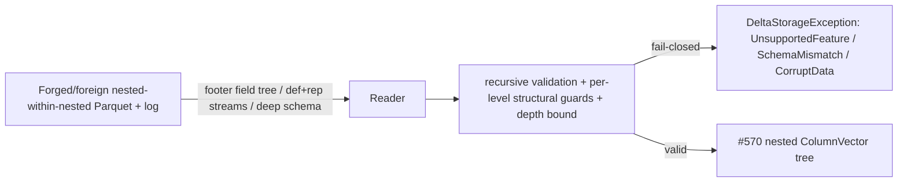

# Nested-within-nested Parquet support — recursive decode (585a) + depth&gt;1 widening (585b)

> **Status:** Draft — **decomposed into two sub-increments.** Issue
> [#585](https://github.com/khaines/deltasharp/issues/585) <!-- issue-state:open --> is **size:XL** and the
> implement-work-item skill rejects XL, so this design splits it into two clearly-delineated, independently
> shippable increments:
>
> - **585a — recursive DECODE (buildable NOW, off `origin/main`).** Scope items 1, 3 (fail-closed parity),
>   4 (tests). Extends `NestedParquetColumnReader`'s rep/def reassembly to arbitrary nesting depth
>   (recursive container reconstruction into the [#570](https://github.com/khaines/deltasharp/issues/570) <!-- issue-state:closed -->
>   nested `ColumnVector`s), lifting the `EnsureReadSupported` / `ValidateShape` nested-within-nested reject
>   for READ. **Does NOT depend on #546.**
> - **585b — depth&gt;1 WIDENING (BLOCKED on the still-OPEN [#546](https://github.com/khaines/deltasharp/issues/546) <!-- issue-state:open -->).**
>   Scope item 2. Extends #546's per-leaf widening + `fieldPath` emission (`DeltaSchemaEnforcer`) to leaves
>   at depth &gt; 1 with the correct nested `fieldPath` chain (`element`, `key`, `value`, …) per Delta
>   PROTOCOL.md "Type Change Metadata". **#546 (nested array-element/map key-value widening at depth ≤ 1) is
>   OPEN**, so **585b is deferred until #546 merges** — this design specifies it as the *next* increment
>   **without implementing it**.
>
> **Rollout sequencing (§8):** 585a ships now, off `origin/main`; 585b lands after #546 merges. The design
> covers both; only 585a is buildable today.
>
> **Issue:** [#585](https://github.com/khaines/deltasharp/issues/585) <!-- issue-state:open --> — increment 3
> follow-up to [#571](https://github.com/khaines/deltasharp/issues/571) <!-- issue-state:closed --> (single-level
> nested decode) and #546 (nested widening). Tracked from the #546 GO report (deferral 1).
> **Author:** delta-storage-format-engineer (orchestrated).
> **Reviewers:** delta-storage-format-engineer, dotnet-vectorized-columnar-compute-engineer,
> reliability-test-chaos-engineer, cloud-native-security-sme, cloud-native-site-reliability-engineer.
> **Last Updated:** 2026-08-21.
> **Related:** #570 (nested `ColumnVector`s — the recursion target), #571/#584 (single-level nested decode
> — the reassembly 585a generalizes), #834/#842 (single-level nested **write** — the depth-2 fixture writer),
> [#676](https://github.com/khaines/deltasharp/issues/676) <!-- issue-state:open --> (nested column mapping —
> the parallel nested surface), #546 (nested widening depth ≤ 1 — **585b's blocking dependency**),
> [#535](https://github.com/khaines/deltasharp/issues/535) <!-- issue-state:closed --> (type-widening
> read-promotion — the allowlist 585b reuses), #730 (nullability→repetition), #813 (required-nested-leaf null
> reject), [#839](https://github.com/khaines/deltasharp/issues/839) <!-- issue-state:open --> (array/map
> id-mode nested — adjacent, out of scope).

---

## 1 · Overview

DeltaSharp **decodes single-level nested Parquet** — `struct<scalar…>`, `array<scalar>`,
`map<scalar,scalar>` — via `ParquetTypeMapping.EnsureReadSupported` and `NestedParquetColumnReader`
(#571/#584), reconstructing the raw Dremel repetition/definition levels into the immutable nested reference
vectors `StructColumnVector` / `ListColumnVector` / `MapColumnVector` (#570). Any **nested-within-nested**
shape — `array<struct>`, `struct<array>`, `struct<struct>`, `map<*,struct>`, `map<map>`, `array<array>`, … —
is rejected **fail-closed** as `UnsupportedFeature` at `EnsureReadSupported`
(`ParquetTypeMapping.cs:370`, via `EnsureScalarReadable` `:415`) and `NestedParquetColumnReader.ValidateShape`
(`:97`, via `ExpectScalarLeaf` `:1217` / `ResolveStructField` `:1113`).

Separately, type-widening promotion (#535 read-promote, #546 nested append-apply) applies only at container
**depth ≤ 1** — a top-level scalar column, or (once #546 lands) a direct scalar element/key/value of a
top-level container. A scalar leaf nested **inside** a nested-within-nested shape stays fail-closed on both
read-promotion and append-apply, because it would need a `fieldPath` in `delta.typeChanges` and the
machinery to emit and consume one does not exist yet.

This design lifts both restrictions, **decomposed** so the XL issue ships in two increments:

| Increment | Scope items | Depends on | Buildable |
|---|---|---|---|
| **585a — recursive DECODE** | 1 (recursive reassembly), 3 (fail-closed parity), 4 (decode tests) | #570/#571/#584 (**closed/merged**), #834/#842 write path for depth-2 fixtures | **Yes, now, off `origin/main`** |
| **585b — depth&gt;1 WIDENING** | 2 (per-leaf widening + nested `fieldPath` at depth &gt; 1) | **#546 (OPEN)** | **No — deferred until #546 merges** |

**Why 585a is unblocked.** The recursive decode target — the #570 nested vectors — already represents
arbitrary depth: `ListColumnVector.Elements`, `MapColumnVector.Keys`/`Values`, and
`StructColumnVector.Child(i)` are each an arbitrary `ColumnVector`, so a list element child may itself be a
`StructColumnVector`, a struct child may be a `ListColumnVector`, and so on (the ctors validate only the
child *type* against the declared element/field type and the length invariants — §2.7). The decode side reads
raw Dremel levels (`ParquetRowGroupReader.ReadRawAsync<T>`), which already carry the **full** ancestor path
of every leaf. So 585a is a generalization of the existing **substrate** (vectors + raw-level reads), not a
new substrate — but note this is not "unchanged code" throughout: the struct/leaf-guard half
(`BuildStructNullMask`, `ValidateLeafStructuralLevels`) genuinely generalizes verbatim (already parameterized
by `structMaxDef`/`containerMaxDef`), whereas the **repeated-container offset/null reconstruction**
(`BuildRepeatedStructure`) is a real algorithm rewrite for any shape with ≥ 2 repeated ancestors
(`array<array>`, `map<map>`, `array<map>`, `map<array>`, …): its owner-cell boundary and element-count logic
are hard-wired to the top repeated level and mis-decode nested repeated levels (§2.2 `DecodeList`). The effort
and risk framing (§8) reflects that: 585a is a targeted rewrite of the repeated-container counter, not a pure
parameter-threading generalization.

**Why 585b is blocked.** 585b extends #546's per-leaf widening + `fieldPath` emission (`DeltaSchemaEnforcer`,
`TypeWidening`) to depth &gt; 1. #546 is the increment that (a) threads `allowWidenApply` through the
array/map arms of `MergeType`, and (b) teaches `AppendTypeChange` to emit a `fieldPath` for a
collection-interior widening. That machinery does not exist on `origin/main` today (`MergeType` passes
`allowWidenApply: false` into every array/map arm — `DeltaSchemaEnforcer.cs:306/318/324`; `AppendTypeChange`
omits `fieldPath` entirely — `:391-393`). 585b has nothing to extend until #546 merges. **This design
specifies 585b (§2.5) so the next increment is well-defined, but does not design it as buildable now.**

**Requirements traceability:** EPIC-05 nested Parquet support (`storage-delta-architecture.md` §2.9).
**Scope boundary (explicit):** 585a lifts the nested-within-nested READ reject for the shapes the #570
vectors represent, up to a **recursion-depth bound** (§2.6, DoS guard). Nested-leaf **widening** at any depth
stays fail-closed under 585a and is enabled only by 585b (after #546). Column-mapping of nested-within-nested
(`nested.ids`, array/map id mode) remains out of scope — #676/#839.

---

## 2 · Logical Architecture

### 2.1 The Dremel invariant, generalized to arbitrary depth

Parquet stores each **leaf** column as a stream of triples `(value, def, rep)`. The two levels encode the
leaf's full ancestor path:

- **Repetition level** `rep[i]` — the deepest *repeated* ancestor (list/map) at which slot `i` is a **new
  occurrence**. `rep=0` opens a new top-level record; `rep=k` is a continuation at the `k`-th repeated
  ancestor from the root.
- **Definition level** `def[i]` — how many optional-or-repeated ancestors (up to and including the leaf's own
  optional level) are actually **present** at slot `i`. A `def` below an ancestor's level marks that ancestor
  (and everything under it) **absent**.

Parquet.Net 6.1.0 exposes, on **every** `Field` node (not only leaves), its own `MaxRepetitionLevel` and
`MaxDefinitionLevel`. The single-level reader already reads these off the container node
(`fileList.MaxRepetitionLevel`, `fileStruct.MaxDefinitionLevel`, …) and off each leaf. **These per-node max
levels are the thresholds the reassembly needs at *any* depth**, so a recursive walk keys each container's
reconstruction off *that container node's own* `MaxRepetitionLevel`/`MaxDefinitionLevel` (and its parent's
`MaxRepetitionLevel`) instead of the hard-wired `0`/`1` the single-level callers pass today. **This makes the
struct-side and leaf-guard reconstruction a clean recursion.** It does **not**, however, make the
repeated-container offset/null counting a pure recursion: `BuildRepeatedStructure`'s owner-cell boundary and
element counting are hard-wired to the top repeated level and must be **rewritten** to thread `parentMaxRep`
and gate the element count on `rep <= thisMaxRep` (§2.2 `DecodeList`). Reading the per-node levels off the
footer is necessary but not sufficient — the counting logic itself changes for ≥ 2 repeated ancestors.

### 2.2 585a — recursive decode (`DecodeContainer`)

The reader gains one recursive shredder-inverse, `DecodeNode(fileNode, requestedType, ownerCells, depth)`,
that dispatches on `requestedType`:

```
DecodeNode(fileNode, requestedType, ownerCells, depth):
  if depth > MaxNestedReadDepth: throw UnsupportedFeature   // §2.6 DoS bound, BEFORE any allocation/recursion
  match requestedType:
    scalar        -> DecodeLeaf(fileNode)                    // BASE CASE (unchanged single-leaf read)
    StructType s  -> DecodeStruct(fileNode as PqStructField, s, ownerCells, depth)
    ArrayType a   -> DecodeList  (fileNode as PqListField,   a, ownerCells, depth)
    MapType   m   -> DecodeMap   (fileNode as PqMapField,    m, ownerCells, depth)
```

`ownerCells` is the number of parent cells that reach this node position — `rowCount` at the top level, the
parent container's present-element count one level down. Each `DecodeNode` returns a `ColumnVector` whose
length is the number of cells it contributes to its parent (a struct child returns `parent.Length`; a list
element child returns the parent's total element count; a map value child returns the parent's total entry
count). This is exactly the length contract the #570 ctors enforce (§2.7).

**`DecodeStruct`** (generalizes the current `ReadStructAsync`, `:238`):
- `structMaxDef = fileStruct.MaxDefinitionLevel` (its **own** def level, not hard-wired).
- For each requested child, resolve the file child node by name (`ResolveStructField`, positional
  containment preserved), then **recurse**: `children[i] = DecodeNode(childNode, child.DataType, ownerCells,
  depth+1)`. The base case (a scalar child) is the existing `ReadScalarLeafAsync` path; a nested child
  descends.
- The struct's per-row null mask is `BuildStructNullMask(fieldDefs, structMaxDef, ownerCells, …)`
  (`:298`) — **already parameterized** by `structMaxDef`, so it needs no change. The `fieldDefs[i]` for a
  child that is *itself* a container is taken from that child's **driving leaf** (§2.2, driving-leaf rule):
  the first leaf in document order under the child, whose `def` stream (clamped at `structMaxDef`) reports
  the struct's presence at each of `ownerCells` slots. The cross-field parity guard (every child agrees, per
  row, on whether the struct is null) holds unchanged at each level.

**`DecodeList`** (generalizes `ReadListAsync`, `:360`):
- `listMaxDef = fileList.MaxDefinitionLevel`, `listMaxRep = fileList.MaxRepetitionLevel` (its **own** levels;
  `=1`/`=2`/… by depth). `emptyContainerDef = listMaxDef − 1`.
- Choose the element subtree's **driving leaf** (first leaf under `fileList.Item`), read its `(def, rep)`
  streams, and reconstruct this level's per-owner-cell offsets/nulls. **The single-level
  `BuildRepeatedStructure` (`:511`) DOES NOT generalize unchanged to a repeated container nested inside
  another repeated container** (`array<array>`, `map<map>`, `array<map>`, `map<array>`, or any array/map
  whose element/key/value is itself repeated — i.e. **≥ 2 repeated ancestors**). Two hard-wired assumptions
  in the released method are correct only at the top repeated level and are **wrong** at any nested repeated
  level (verified against `NestedParquetColumnReader.cs`):
  1. **Owner-cell boundary is hard-wired `if (rep[i] == 0)` (`:532`).** A new owner cell (parent row/element)
     at a nested level opens at `rep[i] <= parentMaxRep`, **not** `== 0` (`parentMaxRep = 0` only at the top).
     For `array<array<int>>` the inner list's owner cells are the outer list's *elements* (`parentMaxRep = 1`),
     so the inner reconstruction must open a new owner at `rep <= 1`. With the `rep == 0` boundary the inner
     walk folds all inner data into owner-row 0's continuation, and the terminal `if (row + 1 != rowCount)`
     check (`:594`) then throws `CorruptData` on **valid** depth-2 data.
  2. **Element counting is `if (d >= containerMaxDef) { elements++; }` (`:582`) with NO rep gate.** A present
     element at *this* level opens only when `rep[i] <= thisMaxRep` (a same-level-or-shallower occurrence);
     a slot with `rep[i] > thisMaxRep` is the business of a **deeper** repeated container and must be
     EXCLUDED from this level's count. For the outer level of `array<array<int>>` the ungated `d >= containerMaxDef`
     counts every present inner **leaf**, not each inner-**list** occurrence, so the outer offsets are wrong
     (they measure total inner leaves, not inner-list count).
- **Corrected reconstruction (a real algorithm change, not a re-parameterization).** Reconstruct this level
  keyed on the container node's own `(thisMaxRep = listMaxRep, thisElemDef = listMaxDef, emptyContainerDef =
  listMaxDef − 1)` **and its parent's** `parentMaxRep`:
  - **Owner-cell boundary:** a new owner cell opens at `rep[i] <= parentMaxRep` (top level `parentMaxRep = 0`
    ⇒ identical to today's `rep == 0`; depth-preserving by construction).
  - **Element occurrence at this level:** count `elements++` iff `rep[i] <= thisMaxRep && d >= thisElemDef`.
    Slots with `rep[i] > thisMaxRep` are skipped here (counted by the child recursion); slots with
    `d < thisElemDef` are the null/empty markers (three-way threshold below).
  - **Continuation legality (F2 guard, generalized):** a slot with `parentMaxRep < rep[i] <= thisMaxRep`
    continues *this* level's current owner cell (legal only when that cell opened as an element-bearing,
    non-empty/non-null container); a slot with `rep[i] > thisMaxRep` continues a *deeper* level and is not
    this level's concern; a slot with `rep[i] <= parentMaxRep` closes back to an ancestor. The empty/null
    phantom-continuation reject (`:570-579`) generalizes to this `(parentMaxRep, thisMaxRep)` window.
  This requires a **new signature** threading `parentMaxRep`/`thisMaxRep` (e.g.
  `BuildRepeatedStructure(def, rep, numValues, thisElemDef, thisMaxRep, parentMaxRep, ownerCells, offsets,
  nulls, …)`), or replacement by the single-pass emitter below — it is **not** callable unchanged.
- **Preferred: single-pass all-levels reconstruction (resolves Finding 4).** Rather than re-scan the driving
  leaf once per repeated level (the released per-level design is O(depth × numValues)), collect the ordered
  chain of repeated ancestors `R_1 … R_k` (outermost→innermost, each with its own
  `(repLevel_j, defLevel_j)` off the footer node) and emit **every** level's offsets/nulls in **one** walk of
  the driving leaf. For each slot `i` with `(d = def[i], r = rep[i])`, level `R_j` opens a new element iff
  `r <= repLevel_j`, and that element is **present** (contributes a child cell to `R_j`'s parent) iff
  additionally `d >= defLevel_j`; `d == defLevel_j − 1` is an empty container, `d < defLevel_j − 1` a null
  container (evaluated within the enclosing present-parent window). This yields all `k` offset arrays in
  O(numValues) and is the recommended shape for the rewrite.
- **Recurse into the element type** with `ownerCells = elemCount` (this level's present-element count):
  `elements = DecodeNode(fileList.Item, requested.ElementType, elemCount, depth+1)`. For
  `array<scalar>` this is the base leaf case (byte-identical to today); for `array<struct>` /
  `array<array>` / `array<map>` it descends, passing this list's `listMaxRep` down as the child's
  `parentMaxRep`.
- Assemble `new ListColumnVector(requested, elements, offsets, nulls)`; the ctor validates
  `offsets[^1] <= elements.Length` (`NestedValidity.CopyValidatedOffsets` — a dangling element tail is
  *allowed*, not required to be exact), so 585a keeps its own explicit `total == elements.Length` count
  reconciliation (mirroring the single-level `total != elements.Length` reject) rather than relying on the
  ctor for equality.

**`DecodeMap`** (generalizes `ReadMapAsync`, `:414`):
- `mapMaxDef = fileMap.MaxDefinitionLevel`. **The map key/value transposition + canonical-name guards run
  at every level** (§2.6): `EnsureCanonicalMapChildNames(fileMap, …)` (`:1098`) and
  `EnsureRequiredMapKey(fileMap, …)` (`:1077`) are called on **this** map node before its children are read.
- The **key** subtree's driving leaf drives the entry structure via the **corrected** reconstruction above
  (the `map<map>` / `map<array>` / `array<map>` cases carry ≥ 2 repeated ancestors, so the same
  `parentMaxRep`/`thisMaxRep` threading — or the single-pass emitter — is required; the released
  `BuildRepeatedStructure` mis-decodes an inner map exactly as it mis-decodes an inner list);
  the **value** subtree's driving leaf is checked for rep parity (`ValidateParallelRepetition`, `:838`) and
  entry-presence def parity (`ValidateParallelDefinition`, `:894`) against the key structure — those parity
  guards are unchanged, but now keyed off the map node's own `mapMaxDef`/`mapMaxRep` and its `parentMaxRep`.
- **Recurse into both child types** with `ownerCells = entryCount`:
  `keys = DecodeNode(fileMap.Key, requested.KeyType, entryCount, depth+1)`,
  `values = DecodeNode(fileMap.Value, requested.ValueType, entryCount, depth+1)`. A `map<*,struct>` /
  `map<map>` / `map<*,array>` descends on the value (or key) side.
- Assemble `new MapColumnVector(requested, keys, values, offsets, nulls)`.

**Max-def / max-rep per leaf at depth.** Every leaf's `(MaxDefinitionLevel, MaxRepetitionLevel)` is read
from the footer node — the recursion never hand-computes them. The **structural-level guard**
`ValidateLeafStructuralLevels` (`:1274`) already enforces, for a leaf under a container, that
`leaf.MaxRepetitionLevel == parentContainer.MaxRepetitionLevel` and `leaf.MaxDefinitionLevel ∈
[parentMaxDef, parentMaxDef+1]`. Today the single-level callers pass fixed `0`/`1`; 585a passes the
**immediate parent container node's own** `MaxRepetitionLevel`/`MaxDefinitionLevel`, so the guard generalizes
verbatim to any depth: a crafted footer whose descendant leaf declares levels inconsistent with its navigated
position (a phantom optional/repeated ancestor, a repeated primitive posing as struct rows) still fails
closed `CorruptData` **before** any reconstruction. The reconstruction remains a pure positional consequence
of levels that are schema-consistent, range-checked, length-aligned, and cross-leaf/cross-field-consistent at
**each** level.

**Null / empty-container handling at each level** is the existing three-way threshold, applied with the
current level's `containerMaxDef`:

| `def[i]` vs container level | meaning |
|---|---|
| `def < containerMaxDef − 1` | **null** container (absent) |
| `def == containerMaxDef − 1` (`emptyContainerDef`) | **empty** container (present, zero children) |
| `def ≥ containerMaxDef` | **present** container with ≥ 1 child cell (or, for a struct, a present row) |

A null *ancestor* legitimately suppresses all descendants (the descendant leaves carry `def` below the
ancestor's level, contribute no cells, and the recursion places them behind the ancestor's null/empty
window). This is the same null-list ≠ empty-list ≠ list-with-null-element distinction #571 preserves,
propagated recursively.

**Where the reject LIFTS.** Two families of call sites stop rejecting nested-within-nested and recurse
instead:
1. **Validation** — `ParquetTypeMapping.EnsureScalarReadable` (`:415`) becomes `EnsureNestedReadable`, which
   for an Array/Map/Struct interior recurses (into the element/key/value/field type) instead of throwing;
   and `NestedParquetColumnReader.ExpectScalarLeaf`'s nested-requested reject (`:1219-1233`) becomes a
   dispatch: a scalar requested type stays the base `ExpectScalarLeaf`; a nested requested type routes to a
   recursive `ValidateShape` on the child node with the child container's own levels.
2. **Decode** — `ReadScalarLeafAsync` is reached only for scalar leaves; a nested child routes back through
   `DecodeNode` (the recursion above).

**What STILL stays rejected under 585a (fail-closed parity, §2.6):**
- Every **scalar** leaf, at every depth, must be in the unchanged read allowlist — `void` and `decimal`
  precision &gt; 28 fail closed (`CreateScalarField` scalar validation, reused per leaf).
- A **zero-field struct** at any depth (no leaf to drive the row count) — the existing reject, applied
  recursively.
- A **non-canonical map** (`key_value` children not exactly named `key`/`value`, or a nullable key) at any
  depth — the transposition guard, applied recursively (§2.6).
- **Widening** of any nested leaf — `ValidateLeafPhysicalType` (`:1298`) stays an **exact** physical-type
  match at every depth (no promotion). Enabling promotion at nested leaves is **585b** (§2.5).
- Any schema nesting **deeper than the recursion-depth bound** `MaxNestedReadDepth` (§2.6) — fail closed
  `UnsupportedFeature` (never a stack-overflow crash).
- The #570 vectors represent every finite-depth `struct`/`array`/`map` tree of the enabled scalars (§2.7), so
  **no additional shape is rejected on representability grounds** under 585a. (The one shape the *write* path
  rejects — a non-nullable nested container — is a write-only concern; on read, nested-container nullability
  is advisory per #570, so a required nested container reads fine.)

### 2.3 Component boundaries (585a)

| Component | File | Change (585a) |
|---|---|---|
| `ParquetTypeMapping.EnsureReadSupported` | `ParquetTypeMapping.cs:370` | recurse the element/key/value/field validation instead of one level; retain the zero-field-struct reject at each level |
| `ParquetTypeMapping.EnsureScalarReadable` → `EnsureNestedReadable` | `ParquetTypeMapping.cs:415` | for an Array/Map/Struct interior, **recurse** (guarded by `MaxNestedReadDepth`) rather than throw `UnsupportedFeature`; scalar leaves still go through `CreateScalarField`'s unchanged allowlist |
| `NestedParquetColumnReader.ValidateShape` | `NestedParquetColumnReader.cs:97` | struct/array/map arms recurse into nested child types (passing the child node's own `MaxRep`/`MaxDef`); map arm runs the canonical-name + required-key guards at **every** level |
| `NestedParquetColumnReader.ReadAsync` / `DecodeNode` | `:198` | dispatch scalar → base leaf, nested → recurse (`DecodeStruct`/`DecodeList`/`DecodeMap`); thread `depth` and the `MaxNestedReadDepth` bound |
| `ReadStructAsync` / `ReadListAsync` / `ReadMapAsync` | `:238/:360/:414` | replace the per-child `ExpectScalarLeaf`/`ReadScalarLeafAsync` calls with `DecodeNode` at `depth+1`; key reconstruction off the **node's own** `MaxDef`/`MaxRep`; choose a per-subtree driving leaf |
| `ExpectScalarLeaf` → `ExpectChild` | `:1217` | scalar requested → unchanged `ExpectScalarLeaf`; nested requested → recurse into `ValidateShape`; the current nested-requested reject becomes the recursion entry, not a throw |
| `ValidateLeafStructuralLevels` | `:1274` | **unchanged code**, called with the immediate parent's `MaxRep`/`MaxDef` (already parameterized) — generalizes to any depth |
| `BuildStructNullMask` | `:298` | **unchanged code** (already parameterized by `structMaxDef`), called at each level with that level's threshold |
| `BuildRepeatedStructure` → single-pass repeated-level emitter | `:511` | **REWRITE (not unchanged)** for ≥ 2 repeated ancestors: owner-cell boundary generalizes from `rep == 0` (`:532`) to `rep <= parentMaxRep`; element count gains a `rep <= thisMaxRep` gate (`:582` currently ungated); new signature threads `parentMaxRep`/`thisMaxRep`, or replace with the single-pass all-levels emitter (§2.2). Top-level (`parentMaxRep = 0`, single repeated level) behavior is preserved byte-for-byte |
| `EnsureCanonicalMapChildNames` / `EnsureRequiredMapKey` | `:1098/:1077` | **unchanged code**, invoked on **every** map node (recursively), not only a top-level map |
| `NestedDecodeBudget` | `NestedParquetColumnReader.cs` | charge each level's transient structural arrays (offsets/nulls) as the recursion descends — the cumulative-bound property already holds per node; recursion sums naturally |
| `CollectLeafFields` | `:169` | already recurses the three shapes; extend to recurse nested-within-nested so the eager-decode ceiling still sums every descendant leaf's declared footprint before any allocation |

### 2.4 Data flow — decode `array<struct<a:int,b:string>>` and `array<array<int>>` (585a)

The `array<struct<…>>` sequence below has only **one** repeated ancestor (the outer list); the struct is not
repeated, so it does **not** exercise the ≥ 2-repeated-ancestor path where the released
`BuildRepeatedStructure` mis-decodes. It is retained as the struct-recursion illustration; the
`array<array<int>>` level-stream trace that follows is the **defect-exercising** case.

```mermaid
sequenceDiagram
  participant R as ParquetFileReader.ResolveFileFields
  participant V as NestedParquetColumnReader.ValidateShape
  participant D as DecodeNode (recursive)
  participant Vec as #570 nested vectors
  R->>V: requested array<struct<a:int,b:string>> vs file list node
  V->>V: array arm -> element is struct -> RECURSE ValidateShape(struct, elementNode, maxRep=1, maxDef=listMaxDef+1)
  V->>V: struct arm -> a:int, b:string -> ExpectScalarLeaf each (exact type + level guard)
  R->>D: DecodeNode(list, array<struct<...>>, ownerCells=rowCount, depth=0)
  D->>D: DecodeList: reconstruct outer offsets/nulls at (thisMaxRep=1, parentMaxRep=0, listMaxDef) -> offsets, nulls, elemCount
  D->>D: RECURSE DecodeNode(elementNode, struct<a,b>, ownerCells=elemCount, depth=1)
  D->>D: DecodeStruct: read leaf a (int) + leaf b (string) as elemCount cells; BuildStructNullMask at structMaxDef
  D->>Vec: StructColumnVector(elemCount) -> ListColumnVector(rowCount, elements=struct, offsets, nulls)
  D-->>R: ListColumnVector<StructColumnVector<int,string>>
```

**Worked level-stream trace — `array<array<int>>` (the rep≥2 case the struct example masks).** With the
Parquet 3-level LIST encoding, the optional/repeated ancestors from root to leaf are: outer group (opt),
outer `list` (rep), inner element group (opt), inner `list` (rep), leaf element (opt) — so the leaf's
`MaxDefinitionLevel = 5` and `MaxRepetitionLevel = 2`. The **outer** list node has `MaxRepetitionLevel = 1`,
`MaxDefinitionLevel = 2`; the **inner** list node has `MaxRepetitionLevel = 2`, `MaxDefinitionLevel = 4`.
Definition-level meanings: `d=0` outer null, `d=1` outer empty, `d=2` outer present + inner **null**,
`d=3` inner **empty**, `d=4` inner present + leaf slot but **value null**, `d=5` leaf value present. Consider
**4 rows** exercising the full four-way null taxonomy:

| row | logical value | classification |
|---|---|---|
| 0 | `null` (outer list absent) | **null outer** |
| 1 | `[]` (outer list present, empty) | **empty outer** |
| 2 | `[null, []]` (outer present; first inner = null, second inner = empty) | **outer-of-null/empty-inner** |
| 3 | `[[7, null], [9]]` (all present, an inner element null) | **present** |

The driving leaf emits one `(rep, def)` slot per null/empty container placeholder and one per present leaf
cell:

```
slot: r  d   meaning
row0: 0  0   outer NULL             (r<=parentMaxRep=0 opens owner 0; d<1 => outer null)
row1: 0  1   outer EMPTY            (opens owner 1; d==1 => outer present-but-empty, 0 inner lists)
row2: 0  2   inner #0 = NULL        (opens owner 2; d==2 => outer present, inner list #0 null)
      1  3   inner #1 = EMPTY       (r==1<=outerMaxRep, new outer element; d==3 => inner empty)
row3: 0  5   leaf 7                 (opens owner 3; outer present, inner #0 present, leaf value present)
      2  4   leaf NULL              (r==2 => deeper repeat: same inner #0, next leaf slot; d==4 => value null)
      1  5   leaf 9                 (r==1 => new outer element: inner #1; leaf value present)
```

**Outer level (`thisMaxRep = 1`, `parentMaxRep = 0`, `thisElemDef = 2`).** Owner cells open at `r <= 0`
(rows 0–3). An outer **element** (one inner-list occurrence) is counted iff `r <= 1 && d >= 2`:
- row0: no slot with `d ≥ 2` → 0 elements; owner-open `d = 0 < 1` ⇒ **null outer**.
- row1: owner-open `d = 1` ⇒ **empty outer**, 0 elements.
- row2: slots `(0,2)` and `(1,3)` both satisfy `r ≤ 1 && d ≥ 2` → **2** inner-list elements.
- row3: slots `(0,5)` and `(1,5)` satisfy `r ≤ 1 && d ≥ 2`; slot `(2,4)` has `r = 2 > 1` and is **excluded**
  (it is the inner level's business) → **2** inner-list elements.

So `outer offsets = [0, 0, 0, 2, 4]` — the outer boundaries count **inner-list occurrences**, not leaf cells,
and `elemCount = 4` present inner lists total. **Contrast the released code:** its ungated
`if (d >= containerMaxDef) elements++` at `containerMaxDef = 2` counts *every* slot with `d ≥ 2` — row2's 2
plus row3's `(0,5)`,`(2,4)`,`(1,5)` = **3** — giving `outer offsets = [0,0,0,2,5]` and `elemCount = 5`. It
then recurses expecting **5** inner-list owner cells when there are only **4**, and the count reconciliation
throws `CorruptData` on valid depth-2 data (or, absent that guard, mis-assigns leaves across inner lists).

**Inner level (`thisMaxRep = 2`, `parentMaxRep = 1`, `thisElemDef = 4`), over `ownerCells = 4` inner lists.**
Owner (inner-list) boundaries now open at `r <= 1` (**not** `r == 0` — the released `:532` boundary folds
everything into inner-list 0 and then throws `CorruptData` at `:594` because `row+1 (=1) != rowCount (=4)` on
valid data). A leaf **slot** is counted iff `r <= 2 && d >= 4`; the leaf's own `d` (5 vs 4) then distinguishes
value-present vs value-null within a present slot:
- inner list #0 (row2, slot `(0,2)`): owner-open `d = 2 < 3` ⇒ **null inner**, 0 leaf slots.
- inner list #1 (row2, slot `(1,3)`): owner-open `d = 3 == thisElemDef − 1` ⇒ **empty inner**, 0 leaf slots.
- inner list #2 (row3, slots `(0,5)`,`(2,4)`): both `r ≤ 2 && d ≥ 4` ⇒ **2** leaf slots; `(2,4)` `d = 4` is a
  **null value**, `(0,5)` `d = 5` present → values `[7, null]`.
- inner list #3 (row3, slot `(1,5)`): 1 leaf slot, value `9`.

So `inner offsets = [0, 0, 0, 2, 3]`, `inner nulls = [null, —, —, —]` (list #0 null, #1 empty), and the leaf
vector is `[7, null, 9]` with a per-leaf null mask marking index 1. The **four-way** distinction — null outer
(row0) / empty outer (row1) / outer-of-null-or-empty-inner (row2) / fully present with a null inner element
(row3) — is reconstructed exactly, and **only** the corrected `(parentMaxRep, thisMaxRep, thisElemDef)`
-parameterized (or single-pass) reconstruction yields it; the released `BuildRepeatedStructure` fails at
both levels.

### 2.5 585b — depth&gt;1 widening (SPEC ONLY; deferred until #546 merges)

> **585b is BLOCKED on [#546](https://github.com/khaines/deltasharp/issues/546) <!-- issue-state:open -->
> and is NOT buildable now.** This section specifies the *next* increment so the boundary is well-defined; it
> is intentionally not a build-ready design.

**What #546 delivers (the base 585b extends).** #546 enables type-widening at container **depth ≤ 1**:
- **Append-apply.** `DeltaSchemaEnforcer.MergeType` (`:280+`) threads `allowWidenApply` into the array/map
  arms so a sanctioned same-family widening of a **direct** element/key/value scalar of a top-level
  container evolves the table schema, and `AppendTypeChange` (`:388+`) emits a `delta.typeChanges` entry
  **with a `fieldPath`** naming the collection interior (today it omits `fieldPath` and applies only to a
  `StructField`'s own scalar type — `:391-393`).
- **Read-promote.** The scan path promotes a physically-narrower nested leaf to the requested wider type at
  depth ≤ 1, reusing `TypeWidening.IsSanctionedWidening` + the decimal-fit guard
  (`ParquetFileReader.cs:1741/2089`).

**What 585b adds.** Extend both to **leaves at depth &gt; 1**:
1. **Nested `fieldPath` chain (Delta PROTOCOL.md "Type Change Metadata").** A `delta.typeChanges` entry for a
   collection-interior widening carries a `fieldPath` that navigates from the enclosing `StructField` to the
   widened leaf using the fixed tokens **`element`** (array element), **`key`** (map key), **`value`** (map
   value), joined by `.`, oldest change first. Struct fields do **not** appear in `fieldPath` — a struct
   child gets its **own** `delta.typeChanges` on its `StructField` (no path). Examples:

   | Column type | Widened leaf | `fieldPath` |
   |---|---|---|
   | `array<array<int→long>>` | inner element | `element.element` |
   | `map<string, array<int→long>>` | array value's element | `value.element` |
   | `array<map<string, int→long>>` | map element's value | `element.value` |
   | `map<map<int→long, string>, string>` | key-map's key | `key.key` |
   | `struct<xs: array<int→long>>` | `xs` element | `element` **on the `xs` StructField's typeChanges** |

   585b builds the `fieldPath` by accumulating the `element`/`key`/`value` token at each array/map arm of the
   recursive `MergeType` descent, and emits it via a `fieldPath`-aware `AppendTypeChange` (the #546 signature
   extension — a `string? fieldPath` parameter — extended to a **chain**, not a single token).
2. **Allowlist + decimal-fit reuse (unchanged).** 585b changes only **where** widening applies (deeper
   leaves) and the **fieldPath** emitted. The eligibility predicates are reused verbatim:
   `TypeWidening.IsSchemaEvolutionWidening` (append-apply subset) and `TypeWidening.IsSanctionedWidening`
   (read-promote superset) — `TypeWidening.cs:174/53` — including the grow-only-decimal fit guard. No new
   widening is sanctioned; a cross-family or non-fitting change at any depth still fails closed
   `TypeWideningUnsupported`.
3. **Read-promote at nested leaves.** `ValidateLeafPhysicalType` (`NestedParquetColumnReader.cs:1298`), which
   585a keeps **exact**, gains a widening-tolerant arm mirroring the flat `IsSanctionedWidening` gate, so a
   physically-narrower nested-within-nested leaf promotes to the requested wider type during recursive
   decode. **585a decode + 585b promotion compose cleanly:** 585a reconstructs the nested structure with
   exact-typed leaves; 585b relaxes the per-leaf type match to the allowlist and inserts the same value
   promotion the flat path uses.

**The dependency edge.** 585b's append-apply half **cannot be built until #546 lands** because it extends
#546's `allowWidenApply` plumbing and `fieldPath`-aware `AppendTypeChange`; on `origin/main` those don't
exist (`MergeType` passes `allowWidenApply: false` into every array/map arm, `AppendTypeChange` emits no
`fieldPath`). Attempting 585b first would mean re-implementing #546 inside 585b — a scope merge the
decomposition exists to avoid. **585b is therefore sequenced strictly after #546 (§8).**

### 2.6 Fail-closed parity, the recursion-depth bound, and recursive guards (585a)

**Allowlist unchanged.** The scalar read allowlist is untouched: every leaf at every depth is validated by
the same `CreateScalarField` path (rejecting `void`, `decimal>28`, and unmapped physical types). No
nested-within-nested shape "unlocks" a new scalar. Nested-leaf **widening** is out of 585a (exact match
only); it is 585b's scope and stays fail-closed until #546 + 585b land.

**Recursion-depth bound (DoS guard).** The recursion walks two attacker-influenced trees — the requested type
(from the log `metaData.schemaString`) and the file field tree (from the footer). Both are already
depth-bounded upstream, and DeltaSharp's **write** path is capped too. The verified caps are:

| Cap | Value | Source | What it bounds |
|---|---|---|---|
| `SchemaJson.MaxDepth` | **64** JSON containers | `SchemaJson.cs:50` | log-parse of `metaData.schemaString`; a struct costs 3 JSON containers ⇒ ~**21 struct levels**, array/map cost 1 each ⇒ ~**64 array/map levels** |
| `ParquetTypeMapping.MaxFooterTypeDepth` | **64** type levels | `ParquetTypeMapping.cs:765` | footer type-tree walk on **read** (mirrors the write cap) |
| `DeltaWriteSchemaEligibility.MaxDepth` | **64** type levels | `DeltaWriteSchemaEligibility.cs:60` | **write** eligibility — the deepest schema DeltaSharp will commit |

The **decode recursion itself** must carry its own explicit bound so a maliciously deep schema cannot exhaust
the stack or drive a pathological allocation fan-out. 585a introduces `MaxNestedReadDepth`, set to **64**
(= the write cap `MaxFooterTypeDepth` / `DeltaWriteSchemaEligibility.MaxDepth`). **The read cap MUST be ≥ the
write cap:** a smaller read cap (e.g. the earlier proposal of 32) would create a **read-after-write parity
gap** — a schema DeltaSharp itself wrote at depth 33–64 would then be **rejected on read** — and, because 32
sits *below* the ~64 array/map levels `SchemaJson`/`MaxFooterTypeDepth` admit, it would be the **first-firing**
gate for array/map chains rather than a never-over-rejecting backstop. At **64** the read cap never
over-rejects a schema the write/log/footer caps admit; it fires only on schemas already at/over those caps
(and only, in practice, on struct-heavy trees `SchemaJson` would itself have rejected at ~21 levels). The
bound is checked at `DecodeNode`/`ValidateShape` entry **before** any per-level allocation or descent, so a
schema deeper than the bound fails closed `UnsupportedFeature` (a deterministic, typed rejection — never a
`StackOverflowException`, which would bypass the fail-closed contract). Because the requested type is walked
in validation *before* decode, an over-deep schema is rejected at shape resolution, before a single data page
is read.

**Map-transposition + canonical-name guards recursively.** Parquet.Net binds `key_value` children
**positionally** (`MapField.Assign`: first → `Key`, second → `Value`), so a `map<T,T>` with a required value
can silently transpose key/value past the type/level guards. 585a runs `EnsureCanonicalMapChildNames`
(Ordinal `key`/`value` assertion) **and** `EnsureRequiredMapKey` on **every** map node the recursion visits
— a `map<map<T,T>, …>` checks the outer map *and* the inner map. The list arm remains name-agnostic
(single-child lists have no transposition hazard, and a `list`/`element` name check would fail-close
legitimate legacy-shaped foreign lists — parity with #571's decision).

**Cross-leaf / cross-field structural agreement at each level.** The struct null-mask parity
(`BuildStructNullMask`), the list/map state-transition legality (`BuildRepeatedStructure`), the map rep/def
parity (`ValidateParallelRepetition`/`ValidateParallelDefinition`), and the leaf structural-level guard
(`ValidateLeafStructuralLevels`) all run at **every** recursion level against that level's thresholds. A
crafted def/rep stream that is self-consistent at one level but contradicts a deeper level fails closed
`CorruptData` at the level whose invariant it violates — no crafted stream silently mis-decodes to
wrong-but-plausible data at any depth.

### 2.7 Data / vector model — the #570 vectors already represent arbitrary depth

The recursion target needs no new type. The #570 nested vectors accept arbitrary `ColumnVector` children and
enforce exactly the invariants the recursion produces:

- `StructColumnVector(type, children, nulls)` — validates `children[i].Type.Equals(type[i].DataType)` and
  every child `Length == parent.Length` (`StructColumnVector.cs:85-127`). A child may be a
  `ListColumnVector`/`MapColumnVector`/`StructColumnVector`.
- `ListColumnVector(type, elements, offsets, nulls)` — validates `elements.Type.Equals(type.ElementType)`
  and `offsets` monotone (non-negative, non-decreasing) with `offsets[^1] <= elements.Length`
  (`ListColumnVector.cs:93` → `NestedValidity.CopyValidatedOffsets`, which throws only when
  `offsets[^1] > childLength` — a **dangling element tail is allowed**, equality is not required). `elements`
  may be nested.
- `MapColumnVector(type, keys, values, offsets, nulls)` — validates key/value types and parallel lengths
  (`MapColumnVector.cs:87+`). `keys`/`values` may be nested.

So `array<struct<…>>` → `ListColumnVector` whose `elements` is a `StructColumnVector`;
`map<string, array<long>>` → `MapColumnVector` whose `values` is a `ListColumnVector`; etc. The recursion's
per-node length contract (§2.2) is at least as strict as each ctor's length invariant (the list ctor bounds
`offsets[^1] <= elements.Length`, so 585a enforces its **own** explicit `total == elements.Length` equality
reconciliation — mirroring the single-level `total != elements.Length` reject — rather than relying on the
ctor's weaker `<=` bound). A residual mismatch therefore fails closed as a typed
`DeltaStorageException.CorruptData` at the 585a count reconciliation (the ctor's own `ArgumentException`
remains a defense-in-depth backstop for the monotonicity/over-length cases).

### 2.8 Dependencies

| Dependency | State | Role |
|---|---|---|
| #570 nested `ColumnVector`s (`Struct`/`List`/`Map`) | **CLOSED / merged** | recursion target — already represents arbitrary depth (§2.7) |
| #571/#584 single-level nested decode | **CLOSED / merged (PR #584)** | the reassembly 585a generalizes: `BuildStructNullMask` + the leaf structural-level guards are already parameterized and reused verbatim; the repeated-container counter (`BuildRepeatedStructure`) is **rewritten** for ≥ 2 repeated ancestors (§2.2) |
| #834/#842 single-level nested **write** | **merged (PR #842)** | writes depth-1 nested; **does not write depth-2**, so depth-2+ round-trip fixtures need a synthesized-footer harness (§3) |
| #546 nested widening (depth ≤ 1) | **OPEN** | **585b's blocking dependency** — the `allowWidenApply` + `fieldPath` machinery 585b extends |
| #535 type-widening read-promotion | **CLOSED** | the `IsSanctionedWidening` allowlist + decimal-fit guard 585b reuses unchanged |
| #676 nested column mapping | **OPEN (feature landed via PR #846; tracking issue open)** | parallel nested surface; nested-within-nested column-mapping stays out of scope |
| #839 array/map id-mode nested | **OPEN** | adjacent id-mode deferral; not in 585a/585b scope |

### 2.9 Tenant / storage-backend considerations

Pure read-path decode change; backend-independent. No new I/O — the recursion consumes the already-read raw
Dremel level streams and packed leaf values from the open row group. The eager-decode ceiling
(`NestedDecodeBudget` + `CollectLeafFields`) sums every descendant leaf's declared footprint **before** any
allocation, so a crafted deep/wide footer cannot drive an OOM regardless of backend (S3/ADLS/GCS/PVC) — the
guard is memory, not storage-consistency, bound. Nested columns remain outside the statistics/data-skipping
surface (unchanged), so no per-child stats are read or emitted at any depth.

---

## 3 · Functional Test Scenarios

**Harness.** The single-level nested **writer** (#834/#842) writes only depth-1 shapes, so depth-2+
round-trip fixtures are authored two ways, mirroring the #571 increment-1 suite:
- **Synthesized-footer fixtures (primary).** Hand-authored Parquet via the low-level
  `ParquetSerializer`/`ParquetFileWriter` (Parquet.Net 6.1.0 `WriteAllPartsAsync<T>` with explicit
  def/rep streams) emit the exact nested-within-nested leaf streams for each depth-2/depth-3 shape, then
  read back through `ParquetFileReader.ReadAsync` → `DecodeNode`, asserting value + null-structure identity.
  This is the same explicit-level-stream differential #834 established for depth-1.
- **Crafted-stream unit fixtures (fail-closed).** `BuildStructNullMask` / `BuildRepeatedStructure` /
  `ValidateLeafStructuralLevels` are `internal`, so crafted def/rep streams that no released writer can
  author drive the recursive corruption guards directly at each level.

Every fail-closed cell asserts the **exact exception type**. Same-typed-sibling cells draw per-leaf values
from disjoint value domains so a positional mis-bind cannot pass on equal values.

### 3.1 · 585a — recursive decode (BUILDABLE NOW)

**Happy-path round-trip (depth 2, one per shape family)**
1. `ArrayOfStruct_RoundTrips` — `array<struct<a:int,b:string>>`: null list / empty list / list with a null
   struct element / list with a present struct with a null field — all distinguished.
2. `StructOfArray_RoundTrips` — `struct<xs:array<long>, name:string>`: null struct / present struct with
   null array / present struct with empty array / present array with a null element.
3. `StructOfStruct_RoundTrips` — `struct<inner:struct<a:int,b:long>, c:string>`: nested null-struct parity.
4. `MapOfStruct_RoundTrips` — `map<string, struct<a:int,b:long>>`: null map / empty map / entry with a null
   value-struct / present value-struct with a null field.
5. `ArrayOfArray_RoundTrips` — `array<array<int>>`: null outer / empty outer / outer with null inner / inner
   with null element (four-way null distinction across two repeated levels). **Explicitly asserts the outer
   offsets count inner-**list** occurrences, not inner leaf cells** (the §2.4 trace: `outer offsets =
   [0,0,0,2,4]`, not `[0,0,0,2,5]`) — the cell that fails against the released `BuildRepeatedStructure` and
   passes only under the corrected `(parentMaxRep, thisMaxRep, thisElemDef)` reconstruction.
6. `MapOfMap_RoundTrips` — `map<string, map<string,long>>`: recursive canonical `key`/`value` names on both
   map levels; entry with a null inner-map value.
7. `ArrayOfMap_RoundTrips` / `MapOfArray_RoundTrips` — mixed repeated nesting.

**Depth-3 (recursion, not special-casing)**
8. `ArrayOfStructOfArray_RoundTrips` — `array<struct<xs:array<int>>>`: three-level rep/def reassembly.
9. `MapOfStructOfMap_RoundTrips` — `map<string, struct<m:map<string,long>>>`.

**Value / temporal / decimal leaves at depth (allowlist parity per leaf)**
10. `NestedLeaves_AllScalarTypes_RoundTrip` — a depth-2 struct/array/map carrying date, timestamp,
    timestamp_ntz, decimal(≤28), binary, string, and each integral/float leaf; each leaf's exact physical
    type is validated recursively.

**Fail-closed cells (still-rejected shapes + corruption + the depth bound)** — each asserts the exact type:

| # | Scenario | Expected |
|---|---|---|
| 11 | `NestedLeaf_VoidType_FailsClosed` (`array<struct<x:void>>`) | `UnsupportedFeature` |
| 12 | `NestedLeaf_DecimalPrecision29_FailsClosed` (`map<string, struct<d:decimal(29,2)>>`) | `UnsupportedFeature` |
| 13 | `ZeroFieldStruct_AtDepth2_FailsClosed` (`array<struct<>>`) | `UnsupportedFeature` |
| 14 | `NonCanonicalMapChildNames_AtInnerMap_FailsClosed` (`map<string, map<…>>`, inner `key_value` mis-named) | `SchemaMismatch` |
| 15 | `MapWithNullableKey_AtDepth2_FailsClosed` | `SchemaMismatch` |
| 16 | `InnerMapKeyValueTransposed_WitnessDisjoint_FailsClosed` (`map<string, map<long,long>>`, required value, children swapped) | `SchemaMismatch` |
| 17 | `NestedLeaf_PhysicalTypeMismatch_AtDepth2_FailsClosed` (file leaf `int`, requested `string`) | `SchemaMismatch` |
| 18 | `CraftedDefStream_StructNullParityViolation_AtDepth2_FailsClosed` (a deep struct child claims present under a null parent) | `CorruptData` — **detected by no other oracle** (no released writer authors this def stream; the round-trip cells 1–10 cannot reach it — only the crafted `internal` `BuildStructNullMask` fixture exercises it) |
| 19 | `CraftedRepStream_PhantomInnerElement_FailsClosed` (`array<array<int>>`, continuation after an empty inner list) | `CorruptData` — **detected by no other oracle** (crafted `internal` repeated-level fixture only; released writers never emit a continuation past an empty-container marker) |
| 20 | `CraftedLeafLevels_OverNestedDescendant_FailsClosed` (`ValidateLeafStructuralLevels` at depth 2/3) | `CorruptData` — **detected by no other oracle** (crafted footer with descendant leaf max-levels inconsistent with its navigated position; unreachable via the write door) |
| 21 | `SchemaDeeperThanMaxNestedReadDepth_FailsClosed` (a synthesized `array<array<…>>` chain past depth 64) | `UnsupportedFeature`, **rejected at shape resolution before any page read** |
| 22 | `NestedWidening_AtDepth2_StaysFailClosed_Under585a` (`array<struct<x:int>>` file, `array<struct<x:long>>` requested) | `SchemaMismatch` — pins that widening is **not** enabled by 585a (585b's scope) |

**Regression / parity**
23. `SingleLevelNested_ByteIdentical_After585a` — the three depth-1 shapes decode byte-identically to
    pre-585a (the recursion's base case == the old single-level path).
24. `EagerDecodeCeiling_SumsAllDescendantLeaves` — a deep/wide footer is bounded before allocation
    (`CollectLeafFields` recursion).
25. `SchemaAtMaxNestedReadDepth_RoundTrips_Success` — the **at-bound (or bound−1) SUCCESS** companion to
    cell 21: a legitimate nested chain synthesized at depth == `MaxNestedReadDepth` (= 64, the max writable
    depth) **decodes successfully** (round-trips value + null structure), pinning that the depth cap does
    **not** over-reject a schema the write/log/footer caps admit (§2.6 read-after-write parity). Guards
    against a regression that lowers the read cap below the write cap and silently over-rejects deep
    writable schemas.

### 3.2 · 585b — depth&gt;1 widening (SPECIFIED, PENDING #546)

> These tests are **specified but marked `[Pending("#546")]`** — they are not authored until #546 merges and
> 585b lands. They mirror the #546 increment-2 append/read suites, lifted to depth &gt; 1.

- `Widen_ArrayOfArrayElement_IntToLong_AppendApplies_EmitsFieldPath_element_element`.
- `Widen_MapValueArrayElement_IntToLong_EmitsFieldPath_value_element`.
- `Widen_ArrayOfMapValue_IntToLong_EmitsFieldPath_element_value`.
- `Widen_StructChildArrayElement_EmitsElementFieldPath_OnChildStructField`.
- `ReadPromote_NarrowNestedLeaf_AtDepth2_PromotesToRequestedWiderType`.
- `Widen_CrossFamily_AtDepth2_FailsClosed_TypeWideningUnsupported` (allowlist unchanged).
- `Widen_DecimalGrowBeyondFit_AtDepth2_FailsClosed` (decimal-fit guard reused).
- `TypeChanges_FieldPathChain_MatchesProtocolTokens` (`element`/`key`/`value`, struct children excluded).

---

## 4 · Performance

- **Workload:** per-column recursive decode of the requested nested tree — O(total leaf cells + total
  structural slots), the same asymptotic cost as single-level nesting; the recursion adds one stack frame per
  container node (≤ `MaxNestedReadDepth`), not per row.
- **Single-pass reconstruction (Columnar).** A naïve per-level reconstruction re-scans each repeated
  container's driving leaf once per repeated ancestor — **O(depth × numValues)** over the level streams. The
  design instead prescribes the **single-pass all-levels emitter** (§2.2 `DecodeList`): one walk of the
  driving leaf emits every repeated level's offsets/nulls (level `R_j` opens at `rep <= repLevel_j`, present
  at `def >= defLevel_j`), restoring **O(numValues)** level processing. This simultaneously fixes the
  repeated-within-repeated counting defect (Finding 1) and removes the per-level re-scan cost.
- **Targets:** depth-2 decode within the single-level decode noise floor per equivalent cell count; zero extra
  allocation per data row beyond the per-level structural arrays (offsets/nulls) the #570 vectors already
  require. Driving-leaf selection is O(children) per container, off the already-open footer.
- **Memory:** the `NestedDecodeBudget` charges every descendant leaf + every level's transient structural
  arrays before allocation, so peak transient memory is bounded by the (ceiling-checked) declared footprint —
  a deep schema cannot amplify allocation beyond its declared cells.
- **Regression gate:** a depth-2 `array<struct<…>>` and `map<string,struct<…>>` decode micro-benchmark stays
  within the nested-decode noise floor; the single-level and flat paths are byte- and perf-unchanged
  (§3.1-23).

---

## 5 · Security

- **Data classification:** decoded nested values may carry table data; fail-closed messages echo only
  sanitized nested **paths** (`DiagnosticText.Sanitize`) and bounded type **kinds**
  (`DiagnosticText.DescribeType`), never raw foreign nested field names (a nested request could otherwise
  recurse `SimpleString` into every descendant name) and never decoded bytes — the existing #683/#686/#705
  message-hygiene discipline, applied at every recursion level.
- **Input validation (the crux):** the footer field tree and the log `schemaString` are attacker-influenced.
  Every single-level fail-closed invariant is applied **recursively** at each container level: the leaf
  allowlist (`void`/`decimal>28`/unmapped), the leaf structural-level guard (max-rep/max-def consistency —
  closing the "repeated primitive posing as struct rows" and "phantom optional ancestor" masquerades at any
  depth), the struct cross-field null parity, the list/map state-transition legality, the map rep/def
  parity, and the required-key + canonical-`key`/`value` name guards.
- **Recursion-depth DoS bound (`MaxNestedReadDepth`, §2.6):** a maliciously deep nested schema fails closed
  `UnsupportedFeature` at shape resolution, **before** any allocation, page read, or deep recursion — never a
  `StackOverflowException` (which would bypass the `DeltaStorageException` fail-closed contract). The bound is
  set to **64 = the write cap** (`MaxFooterTypeDepth` / `DeltaWriteSchemaEligibility.MaxDepth`) so it is
  **≥ every write/log/footer cap** and never over-rejects a schema DeltaSharp can write/admit (no
  read-after-write parity gap); it fires only on schemas already at/over those caps (§2.6).
- **Fail-closed over fallback:** an exact physical-type match at every nested leaf under 585a (no
  promotion — promotion is 585b, gated by the unchanged allowlist); a crafted level stream that is
  self-consistent at one level but violates a deeper invariant fails closed `CorruptData` at that level.
- **Supply-chain:** no new dependencies; reuses Parquet.Net 6.1.0 raw-level reads.

---

## 6 · Threat Model



| STRIDE | Surface | Threat | Mitigation |
|---|---|---|---|
| **DoS** | maliciously deep nested schema | unbounded recursion → stack exhaustion / allocation fan-out | `MaxNestedReadDepth` bound checked before descent (§2.6); upstream `SchemaJson.MaxDepth`/footer caps; eager-decode ceiling sums all descendant leaves before allocation |
| **Tampering** | crafted def/rep at a **deep** level | phantom inner element / mis-classified present-vs-null at depth | `BuildRepeatedStructure` state-transition + `BuildStructNullMask` cross-field parity + `ValidateParallelRepetition/Definition`, run at **every** level against that level's thresholds → `CorruptData` |
| **Tampering** | descendant leaf declares wrong max levels | repeated primitive posing as struct rows / phantom optional ancestor at depth | `ValidateLeafStructuralLevels` at each level against the **immediate parent** node's `MaxRep`/`MaxDef` → `CorruptData` |
| **Tampering** | inner `map<T,T>` required value | Parquet.Net positional key/value bind → silent transposition at a **nested** map | recursive Ordinal `key`/`value` canonical-name guard (map-only) + required-key guard on **every** map node → `SchemaMismatch` |
| **Spoofing** | nested leaf physical type ≠ requested | wrong-typed value read at depth | recursive exact-match `ValidateLeafPhysicalType` (585a) → `SchemaMismatch`; promotion only via the unchanged allowlist (585b) |
| **Elevation** | unsupported scalar smuggled into a deep leaf | `void`/`decimal>28`/unmapped decodes | recursive scalar allowlist (`CreateScalarField`) at every leaf → `UnsupportedFeature` |
| **Info disclosure** | fail-closed message on a nested request | raw foreign nested names recursed into `SimpleString` | bounded `DescribeType` + sanitized paths at every level (#683/#686/#705) |

**Residual:** nested-leaf **widening** is out of 585a (exact match), enabled only by 585b under the unchanged
allowlist — so no widening residual exists until 585b lands. The single-level residuals (advisory nested
nullability per #570; foreign legacy-shaped lists readable) are unchanged and propagate recursively. Column
mapping of nested-within-nested (`nested.ids`, array/map id mode) stays out of scope (#676/#839), fail-closed.

---

## 7 · Observability

- **Logging:** fail-closed rejections surface via the sanitized `DeltaStorageException` path with the
  **sanitized nested path** (e.g. `orders.element.items.element`) identifying the offending level; no new
  happy-path log site.
- **Metrics:** none — decode is a read hot path; no new counters. The `NestedDecodeBudget` charge is the
  existing eager-decode-ceiling accounting, extended over descendants.
- **Correlation:** rejections surface under the existing table-path/version fields on the read activity.

---

## 8 · Rollout & Risk

**Sequencing (the decomposition, made operational):**

1. **585a ships now, off `origin/main`.** It depends only on #570/#571/#584 (closed/merged) and the
   #834/#842 write path for depth-2 fixtures. It removes a fail-closed gate for nested-within-nested
   **reads** and adds the recursion-depth bound. **Kill-switch:** a defect → reinstate the
   `EnsureReadSupported`/`ValidateShape` nested-within-nested reject (revert to single-level scope); data
   already written is unaffected (this is a read-decode change only). Existing single-level and flat reads
   are byte/behavior-unchanged (§3.1-23).
2. **585b lands after [#546](https://github.com/khaines/deltasharp/issues/546) <!-- issue-state:open -->
   merges.** 585b extends #546's `allowWidenApply` + `fieldPath`-aware `AppendTypeChange` to depth &gt; 1;
   it cannot be built until that machinery exists on `main`. When #546 merges, 585b is the next increment:
   it enables append-apply widening + read-promotion at nested-within-nested leaves under the **unchanged**
   allowlist, emitting the nested `fieldPath` chain (§2.5). **Kill-switch:** widening is gated behind the
   existing `typeWidening` table-feature flag; a defect → disable the feature (nested leaves fall back to the
   585a exact-match decode, which stays correct).

**Risk register:**
- (a) recursive mis-decode at depth → **wrong data** — mitigated by per-level structural guards run at every
  level (§2.6) + §3.1 crafted-stream cells (18–20) + the depth-2/3 round-trips (1–9).
- (a′) **repeated-within-repeated counting rewrite** → the repeated-container reconstruction is a **real
  algorithm change** (owner boundary `rep <= parentMaxRep`, element count gated `rep <= thisMaxRep`), **not**
  reusable-unchanged code, for `array<array>`/`map<map>`/`array<map>`/`map<array>` and any ≥ 2-repeated-ancestor
  shape (§2.2). Highest-effort/-risk item in 585a. Mitigated by the §2.4 worked-trace assertions (cell 5
  pins outer offsets = inner-list counts, not leaf counts), the depth-3 round-trips (8–9), and the
  single-level byte-identical regression (23) that pins the top-level (`parentMaxRep = 0`) path unchanged.
- (b) deep-schema DoS → stack/alloc exhaustion — `MaxNestedReadDepth` (= 64, the write cap) bound +
  eager-decode ceiling + §3.1-21.
- (b′) **read-after-write parity gap** → a read cap below the write cap over-rejects a schema DeltaSharp
  wrote — prevented by fixing `MaxNestedReadDepth = 64 ≥ MaxFooterTypeDepth`/`DeltaWriteSchemaEligibility.MaxDepth`
  (§2.6, D3); §3.1-25 at-bound SUCCESS cell guards against a regression.
- (c) recursive map transposition → key/value swap at a nested map — recursive canonical-name guard + §3.1-16.
- (d) accidental widening under 585a → silent promotion at a nested leaf — 585a keeps exact match; §3.1-22
  pins it fail-closed until 585b.
- (e) 585b built before #546 → scope merge / duplicated widening machinery — **prevented by sequencing**:
  585b is not started until #546 merges (§2.5 dependency edge).

**Launch checklist (585a):** unit + integration (§3.1) green on both TFMs; `dotnet format`; determinism ban;
DCO; RFL PASS; **#546 verified OPEN and 585b's `[Pending("#546")]` tests present but skipped**; the
single-level byte-identical regression (§3.1-23) green.

---

## 9 · Open Questions & Decisions

1. **Decomposition — RESOLVED.** #585 is size:XL (implement-work-item rejects XL); split into **585a
   (recursive decode, buildable now, off `origin/main`)** and **585b (depth&gt;1 widening, deferred until
   #546 merges)**. 585a covers scope items 1/3/4; 585b covers item 2.
2. **Recursion structure — RESOLVED: `DecodeNode` recursion (§2.2).** A single recursive dispatcher keys each
   container's reconstruction off **that container node's own** `MaxRepetitionLevel`/`MaxDefinitionLevel`
   (Parquet.Net exposes them on every node). `BuildStructNullMask` / `ValidateLeafStructuralLevels` are
   reused already-parameterized; **the repeated-container offset/null counter is REWRITTEN** — the released
   `BuildRepeatedStructure`'s hard-wired `rep == 0` owner boundary (`:532`) and ungated `d >= containerMaxDef`
   element count (`:582`) mis-decode any shape with ≥ 2 repeated ancestors (`array<array>`, `map<map>`,
   `array<map>`, `map<array>`, …). The rewrite threads `parentMaxRep`/`thisMaxRep` (owner boundary
   `rep <= parentMaxRep`; element count gated `rep <= thisMaxRep && d >= thisElemDef`) — preferably as a
   single-pass all-levels emitter (§2.2, also resolves the Columnar per-level re-scan cost). Driving-leaf per
   repeated subtree; cross-leaf structural agreement validated at each level. This is a substantive algorithm
   change, **not** "unchanged code."
3. **Recursion-depth bound value — RESOLVED (D3): `MaxNestedReadDepth = 64` (= the write cap).** The verified
   upstream caps (§2.6/§5) are: the **write** caps `ParquetTypeMapping.MaxFooterTypeDepth = 64`
   (`ParquetTypeMapping.cs:765`) and `DeltaWriteSchemaEligibility.MaxDepth = 64`
   (`DeltaWriteSchemaEligibility.cs:60`); and the log-parse serialization cap `SchemaJson.MaxDepth = 64` JSON
   containers (`SchemaJson.cs:50`) which admits ~21 struct levels (3 JSON containers/struct) but ~64
   array/map levels (1 container each). The read cap **must be ≥ the write cap** so a schema DeltaSharp can
   write/admit never over-rejects on read (no read-after-write parity gap). The earlier proposal of **32**
   was **wrong**: 32 < 64 write cap ⇒ a DeltaSharp-written depth-33–64 array/map schema would be rejected on
   read, and 32 is *below* the ~64 array/map levels `SchemaJson` admits so it would be the first-firing gate
   for array/map chains (not a never-firing backstop). Setting it to 64 makes it a true backstop that fires
   only on schemas already at/over the write/log caps. Mechanism unchanged: fail closed typed
   `UnsupportedFeature` checked at `DecodeNode`/`ValidateShape` entry before any allocation/descent — never a
   `StackOverflowException`.
4. **585b `fieldPath` chain — RESOLVED (spec, §2.5): `element`/`key`/`value` tokens joined by `.`**, struct
   children excluded (they carry their own `StructField` `typeChanges`), oldest-first — per Delta PROTOCOL.md
   "Type Change Metadata". Implementation deferred to 585b (post-#546).
5. **585b allowlist — RESOLVED (spec): reuse `IsSanctionedWidening` (read) / `IsSchemaEvolutionWidening`
   (append) + the decimal-fit guard unchanged.** 585b changes only *where* widening applies and the
   *fieldPath* emitted, never *what* is sanctioned.
6. **Depth-2 write fixtures — RESOLVED: synthesized-footer harness (§3).** The #834/#842 writer writes only
   depth-1; depth-2+ round-trip fixtures use `ParquetSerializer`/`ParquetFileWriter` explicit-level writes,
   the same differential harness #834 established, plus `internal` crafted-stream unit fixtures for the
   corruption guards.
7. **585b dependency — RESOLVED: BLOCKED on #546 (open).** 585b extends #546's `allowWidenApply` +
   `fieldPath`-aware `AppendTypeChange`; not buildable until #546 lands (§2.5, §8). Sequenced strictly after.

---

## 10 · References

- Issue [#585](https://github.com/khaines/deltasharp/issues/585) <!-- issue-state:open --> (this design);
  follows [#571](https://github.com/khaines/deltasharp/issues/571) <!-- issue-state:closed --> (single-level
  decode) and [#546](https://github.com/khaines/deltasharp/issues/546) <!-- issue-state:open --> (nested
  widening depth ≤ 1 — **585b's blocking dependency**).
- Recursion target: [#570](https://github.com/khaines/deltasharp/issues/570) <!-- issue-state:closed -->
  nested `ColumnVector`s. Allowlist reuse: [#535](https://github.com/khaines/deltasharp/issues/535) <!-- issue-state:closed -->
  type-widening read-promotion. Parallel nested surface:
  [#676](https://github.com/khaines/deltasharp/issues/676) <!-- issue-state:open --> nested column mapping;
  adjacent deferral [#839](https://github.com/khaines/deltasharp/issues/839) <!-- issue-state:open -->
  (array/map id-mode nested).
- `docs/engineering/design/storage-delta-architecture.md` §2.9. Companion designs:
  `docs/engineering/design/nested-parquet-write.md` (#834, the depth-1 write path + level-stream tables),
  `docs/engineering/design/nested-column-mapping.md` (#676, the nested `StructField` model).
- Code anchors — `src/DeltaSharp.Storage/Parquet/ParquetTypeMapping.cs`: `EnsureReadSupported` (`:370`),
  `EnsureScalarReadable` → `EnsureNestedReadable` (`:415`), `CreateNestedField`/`CreateNestedLeaf` (`:99+`),
  nested-within-nested reject (`:194`, `:236`), scalar allowlist (`CreateScalarField`).
  `src/DeltaSharp.Storage/Parquet/NestedParquetColumnReader.cs`: `ValidateShape` (`:97`), `ReadAsync` (`:198`),
  `ReadStructAsync` (`:238`), `BuildStructNullMask` (`:298`), `ReadListAsync` (`:360`), `ReadMapAsync` (`:414`),
  `BuildRepeatedStructure` (`:511`), `ExpectScalarLeaf` (`:1217`), `ResolveStructField` (`:1113`),
  `IsDirectLeafChild` (`:1183`), `ValidateLeafStructuralLevels` (`:1274`), `ValidateLeafPhysicalType` (`:1298`),
  `EnsureRequiredMapKey` (`:1077`), `EnsureCanonicalMapChildNames` (`:1098`), `CollectLeafFields` (`:169`).
  `src/DeltaSharp.Storage/Delta/DeltaSchemaEnforcer.cs`: `MergeType` array/map arms (`:294-322`),
  `AppendTypeChange` `fieldPath` omission (`:388-393`) — the 585b extension points.
  `src/DeltaSharp.Storage/Delta/TypeWidening.cs`: `IsSanctionedWidening` (`:53`),
  `IsSchemaEvolutionWidening` (`:174`) — the reused allowlist.
  `src/DeltaSharp.Engine/Columnar/`: `StructColumnVector.cs` (`:85`), `ListColumnVector.cs` (`:80`),
  `MapColumnVector.cs` (`:87`), `NestedValidity.cs` — the recursion target ctors + length invariants.
  `src/DeltaSharp.Abstractions/SchemaJson.cs`: `MaxDepth = 64` (`:50`) — the upstream JSON depth cap.
- Delta PROTOCOL.md "Type Change Metadata" — the `fieldPath` `element`/`key`/`value` token grammar (585b).
