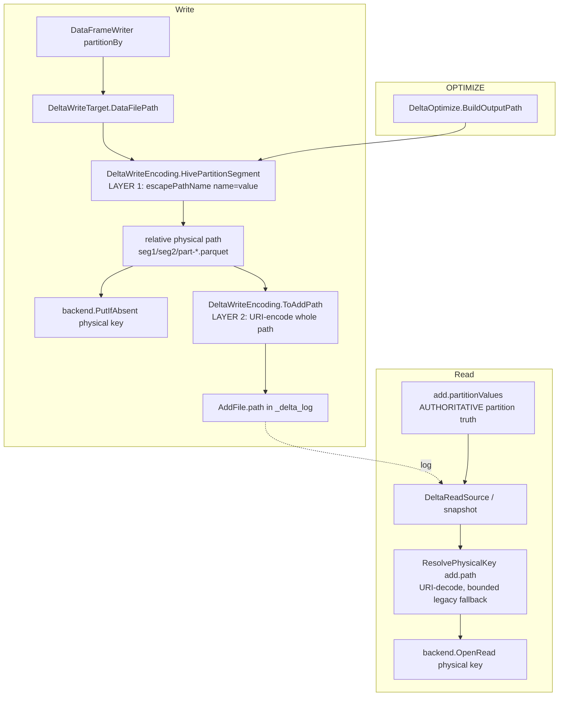
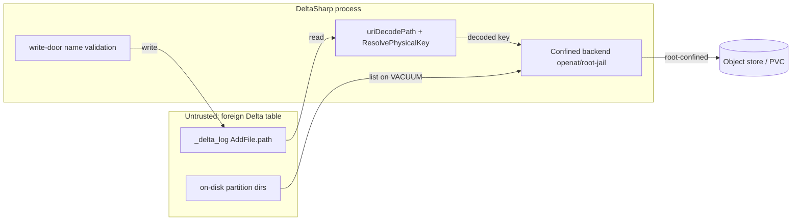

# Partition path encoding — Spark/delta-rs interop (two-layer `escapePathName` + URI-encoded `add.path`)

> **Status:** Draft
> **Issues:** [#806](https://github.com/khaines/deltasharp/issues/806) — Delta partition NAME/VALUE encoding: Spark/delta-rs interop round-trip (two-layer physical-segment + URI-encoded add.path); [#708](https://github.com/khaines/deltasharp/issues/708) — partition column names written raw while values are percent-encoded (origin)
> **Author:** design-doc skill (orchestrated)
> **Reviewers:** cloud-native-distributed-systems-architect, delta-storage-format-engineer, reliability-test-chaos-engineer, cloud-native-security-sme, cloud-native-site-reliability-engineer, performance-benchmarking-engineer
> **Last Updated:** 2026-08-30
> **Related:** PR #797 (the #708 scope-correction that percent-encoded both NAME and value with `Uri.EscapeDataString` — directory-injection hardening retained, but not Spark-parity), #696 (message-hygiene recognizer that must stay fixed regardless), OrphanCleanup encoding-robust protection (#489 lineage)

---

## 1 · Overview

DeltaSharp composes a Hive-style partition directory segment as
`Uri.EscapeDataString(name) + "=" + Uri.EscapeDataString(value)` and stores the resulting relative path
**verbatim** in `add.path` — it neither URI-encodes the whole path on write nor URI-decodes it on read
(`DeltaWriteEncoding.HivePartitionSegment`, `DeltaWriteTarget.DataFilePath`, `DeltaReadSource` opens
`add.Path` directly). This is a **known, documented deviation** from two independent contracts:

1. **On-disk layout** does not match Apache Spark / delta-rs. Spark composes the directory with
   `ExternalCatalogUtils.escapePathName` — a Hive-derived 128-entry ASCII bitset that escapes only
   `0x01–0x1F`, `" # % ' * / : = ? \`, `DEL`, `{ [ ] ^` (and, on Windows, `space < > | `) and **passes
   non-ASCII and space (non-Windows) through unescaped**. `Uri.EscapeDataString` uses the RFC-3986
   *unreserved* alphabet: it escapes space (`%20`), all non-ASCII (`%C3%A9`), and a different reserved
   set. So DeltaSharp and Spark produce **different directory names** for any partition NAME or VALUE
   outside the ASCII-unreserved set.
2. **`add.path`** is, per the Delta protocol, a **URI-encoded** relative path (RFC 2396): `country=US/…`
   is stored as `country%3DUS/…` and must be URI-**decoded** to recover the object key. DeltaSharp treats
   `add.path` as a literal object key on both write and read.

**Consequence:** a DeltaSharp table whose partition names/values contain characters outside the
RFC-3986 unreserved set is **not round-trippable with Spark/delta-rs** — the directory Spark expects and
the `add.path` Spark writes both differ from what DeltaSharp emits, and a Spark-written table's
URI-encoded `add.path` is mis-resolved by DeltaSharp's literal-key read.

This design specifies the **correct two-layer scheme** (#806) and a **fail-closed, backward-compatible
migration** for the DeltaSharp tables already written in the two legacy layouts (pre-#797 raw-name, and
#797 `Uri.EscapeDataString`-both):

- **Layer 1 — physical directory segment (on disk):** `escapePathName(name) = "=" = escapePathName(value)`,
  matching Spark/delta-rs byte-for-byte.
- **Layer 2 — `add.path` (in the log):** URI-encode the full relative path per the Delta protocol.
- **Read:** URI-**decode** `add.path` to recover the physical object key, with a bounded, fail-closed
  resolution that still reads the legacy literal-key layouts.

**Requirements traceability:** #806 acceptance (§3.7) — differential Spark/delta-rs parity across the
ASCII-reserved and non-ASCII sets; mixed legacy+new migration coverage; an encoded-segment length budget.
Carries forward #708's original "measured, not assumed" criterion, which PR #797 did **not** satisfy.

**Non-goals.** Changing partition-value *semantics* (partition truth is and remains `add.partitionValues`,
never parsed from the path); introducing a new Delta protocol reader/writer feature; changing deletion-vector
or `_change_data` path composition (they do not use partition directories — §2.5); re-opening the #696
message-hygiene fix (it must stay fixed regardless — `add.path` is foreign input forever). The directory-
**injection** hardening PR #797 shipped (a hostile name containing `/` or `=` cannot fabricate segments) is
**retained** — `escapePathName` escapes `/` and `=`, so injection safety is preserved by construction.

---

## 2 · Logical architecture

### 2.1 Where the encoding sits



Both the write door (`DeltaWriteTarget`) and OPTIMIZE (`DeltaOptimize.BuildOutputPath`) already funnel
through the single `HivePartitionSegment` helper, so a change there keeps freshly-written and compacted
files in the **same** on-disk layout by construction. This design adds a symmetric `ToAddPath`/`FromAddPath`
pair for layer 2 and threads the read-side decode through the object-key resolution.

### 2.2 The two-layer scheme (the crux)

Let `name` and `value` be the *logical* partition column name (its physical name in `name`/`id` column
mapping) and the string partition value (`null` → the `__HIVE_DEFAULT_PARTITION__` sentinel).

**Layer 1 — physical segment (identical to Spark `ExternalCatalogUtils.escapePathName`):**

```
seg(name, value) = escapePathName(name) + "=" + escapePathName(value)      // value=null → escapePathName(name)+"="+"__HIVE_DEFAULT_PARTITION__"
```

`escapePathName(s)` escapes exactly the Hive/Spark `charToEscape` bitset — `0x01–0x1F`, `" # % ' * / : = ? \`,
`0x7F`, `{ [ ] ^` (and, only when running on Windows, `space < > |`) — as uppercase `%XX`, and **passes every
other code point through unescaped, including all non-ASCII and (on non-Windows) the space**. This is the
on-disk directory name; it is what Spark and delta-rs write and expect.

> **Portability note.** Spark's set is Windows-conditional (`Shell.WINDOWS`). For a **portable, engine-stable**
> on-disk layout DeltaSharp must pick one alphabet regardless of host OS — otherwise a table written on Linux
> and compacted on Windows would diverge. Decision **D1 (§9):** adopt the **non-Windows** Spark alphabet on all
> hosts (space and `< > |` pass through), because (a) it is what Spark-on-Linux and delta-rs emit — the dominant
> lake producers — and (b) the confined backend never interprets `< > |` as shell metacharacters. The Windows
> local backend must therefore accept these in a component name (they are legal on the object-store key space and
> on POSIX; the Windows *local* filesystem is the only place `< > |` are illegal, handled as a backend concern —
> see §2.6 length/again §8 risk).

**Layer 2 — `add.path` (Delta protocol URI-encoded path):**

```
add.path = uriEncodePath( seg1 + "/" + seg2 + "/" + … + "part-<token>.parquet" )
```

`uriEncodePath` percent-encodes the path per the Delta protocol URI rule (the protocol cites **RFC 2396**;
the encoder alphabet is **subordinate to the O1 goldens** below — DeltaSharp conforms to the exact bytes real
Spark/delta-rs emit via `Path.toUri`, not to an independent RFC-3986 derivation) while preserving the `/`
separators. **Measured against Apache Spark 3.5 + delta-rs 1.6 (O1 now closed):** this is Java's `URI.toString`
path-quoting applied on top of layer 1 — it percent-encodes only **URI-illegal ASCII** (space→`%20`, and a
layer-1 `%XX` has its `%`→`%25`, e.g. value `a/b` → layer-1 `col=a%2Fb` → `add.path` `col=a%252Fb/…`; also
`< > { } | ` `` ` ``→their `%XX`) and **keeps literal** the structural `=` separator, the `/` separators, the
pchar/sub-delims (`: @ & + $ , ; ! ~ * ' ( ) -`) **and all non-ASCII** (Spark stores `URI.toString`, not
`toASCIIString`, so `région` stays `région`). So `country=US/f` ⇒ `country=US/f` (the `=` is **not** encoded).
> **delta-rs on-disk divergence (residual).** delta-rs additionally percent-escapes space and non-ASCII in the
> **on-disk** directory (`region=na%20me`, `region=r%C3%A9gion`) and hence in its `add.path`; Apache Spark and
> DeltaSharp keep them literal on disk. DeltaSharp follows **Spark** (design D1), so a delta-rs-written table is
> **read-compatible** (the resolver decodes its `add.path` to the correct key) but **not byte-identical** on
> disk. Documented as an accepted interop residual; see §3.2 (the DS→ref golden asserts parity vs **Spark**).

**Read — recover the physical object key:**

```
physicalKey = uriDecodePath(add.path)            // protocol-correct: exact inverse of layer 2
```

For a two-layer (or Spark/delta-rs-written) table this yields the real on-disk key. For **legacy DeltaSharp
tables** `add.path` was stored *literally* (no layer 2), and a literal legacy path can itself contain `%XX`
(from `Uri.EscapeDataString` on the value), so `uriDecodePath` would **corrupt** it (`col=a%2Fb` → `col=a/b`,
splitting a directory). The read therefore resolves through a **bounded, fail-closed candidate set** — §2.4.

### 2.3 Read resolution & data flow

The resolver is **decoded-first** (the go-forward L2 format is the common case for new tables), centralized
into a single `ResolvePhysicalKey(add.path)` that **every** data-file open site calls (§2.5):

```mermaid
sequenceDiagram
    participant Site as Any data-file open site<br/>(scan / DELETE / OPTIMIZE-input / CDF-data)
    participant Res as ResolvePhysicalKey
    participant BE as Storage backend (root-jailed)
    Site->>Res: add.path (from AddFile/RemoveFile)
    Res->>Res: k_dec = uriDecodePath(add.path)   (bounded, pre-decode length cap)
    alt k_dec == k_lit (no %-encoding: legacy-raw & ASCII-unreserved non-partitioned)
        Res->>BE: OpenRead(k_lit)  (one open, zero extra probe)
    else k_dec != k_lit
        Res->>BE: OpenRead(k_dec)   [protocol-correct: L2 / Spark / delta-rs]
        alt k_dec opens
            BE-->>Res: stream
        else not-found (legacy L0/L1 literal-% layout)
            Res->>BE: OpenRead(k_lit)   (fallback; +1 open only on the legacy miss)
        end
    end
    Note over Res,BE: neither candidate resolvable → bounded DeltaStorageException (fail closed, as today)
    Note over Res,BE: confinement (root-jail, .. normalization) enforced on the DECODED key
    Note over Site: partition VALUES always from add.partitionValues (never from the path)
```

**Cost (corrected — see §4).** `k_dec` is computed unconditionally but is a no-op string when `add.path`
carries no `%`. There is **no** `exists()` probe: the resolver **opens `k_dec` and, only on a not-found, falls
back to opening `k_lit`**. So an **L2 (go-forward) file opens in one round-trip**; a legacy L0/L1 file whose
`add.path` contains a `%` pays **+1 open only on the first (decoded) miss**; a non-partitioned or
ASCII-unreserved-non-partitioned file (`k_dec==k_lit`) is one open, unchanged. (Earlier drafts claimed the
go-forward format hits the zero-extra-probe path only rarely — corrected by the O1 measurement: layer-2 keeps
the `=` separator and all unreserved/sub-delim/non-ASCII **literal**, so an L2 partition file has `k_dec≠k_lit`
**only when the value contains a URI-illegal char** (space, `%`, `< > { } | ` `` ` ``); a plain-ASCII partition
value like `region=US` round-trips with `k_dec==k_lit` in one open. §4 and O2 are re-scoped accordingly.)

**Untrusted both-exist tie-break (adversarial — §6 T-Poison).** On a **foreign, attacker-authored** table a
file may be planted at *both* `k_dec` and `k_lit`. Decoded-first is the protocol-correct interpretation, so the
resolver serves `k_dec`; the blast radius is bounded and **fail-safe**: (a) both keys are confined under the
single table root (a single tenant — no cross-tenant crossing); (b) partition **truth** is `add.partitionValues`,
not the served bytes, so query *partitioning* cannot be poisoned; (c) the opened object is parsed as Parquet
against the committed schema and fails closed on mismatch. The design **mandates** an integrity cross-check where
one is cheaply available (the AddFile's `size`/`stats` vs the opened file) and records the residual in §6. This
is a read-only, in-root, single-tenant residual — not an isolation break.

Partition **truth** is untouched: `add.partitionValues` remains authoritative (`DeltaReadSource` const/null-fills
partition columns from it), so a directory-encoding change cannot change query results.

### 2.4 Migration & backward compatibility (three on-disk layouts)

| Layout | Producer | On-disk dir example (`value="a/b"`, name `"my col"`) | `add.path` stored | Correct read key |
|---|---|---|---|---|
| **L0 raw-name** | DeltaSharp pre-#797 (#708 origin) | `my col=a%2Fb` (name raw, value `EscapeDataString`) | literal `my col=a%2Fb/…` | literal |
| **L1 escape-both** | DeltaSharp #797 (current) | `my%20col=a%2Fb` (both `EscapeDataString`) | literal `my%20col=a%2Fb/…` | literal |
| **L2 two-layer** | this design / Spark | `my col=a%2Fb` (`escapePathName`; space passes through) | URI-encoded `my%20col=a%252Fb/…` (`=` literal, Spark parity) | `uriDecodePath` |

Key observations that make the bounded resolver (§2.3) correct and fail-closed:

- The file physically exists at **exactly one** object key. `{k_lit, k_dec}` always contains it: L0/L1 at
  `k_lit`, L2 at `k_dec`. For **well-formed producers** the two candidates never point at *different real
  files*, because (a) each write emits a unique `part-<token>.parquet` filename, and (b) both `escapePathName`
  and `Uri.EscapeDataString` escape `/`, so a physical segment never contains an un-escaped separator — an
  L1 file's `k_dec` (which would re-introduce a `/`) cannot coincide with any legitimate L2 physical key.
  Resolution is therefore unambiguous for conforming tables. (A **foreign/adversarial** table that plants a
  file at *both* keys is handled by the decoded-first tie-break + integrity cross-check — §2.3, §6 T-Poison —
  and is a read-only, in-root, single-tenant residual.)
- For a non-partitioned table and the ASCII-unreserved-name/value case `k_dec == k_lit` — one open, no
  behavior change. (Note: a **go-forward L2 partitioned** file has `k_dec≠k_lit` only when the partition value
  contains a URI-illegal char (space, `%`, …); a plain-ASCII value round-trips at `k_dec==k_lit` — §2.3/§4.)
- **Commit-time conflict detection & tombstones are canonicalization-safe:** `RemoveFile`/conflict comparison
  use the **verbatim** stored `add.path` string (never recomposed across versions — e.g. `DeltaOptimize`'s
  `ToRemove` copies `input.Path` as-is), so string comparison stays encoding-consistent even in a mixed
  L1/L2 table.
- **`__HIVE_DEFAULT_PARTITION__` collision (E2):** on disk a `null` value and a literal value
  `"__HIVE_DEFAULT_PARTITION__"` map to the **same** directory (none of those chars is escaped). This collision
  is **unavoidable and matches Spark's own behaviour**; DeltaSharp stays correct because partition truth is
  `add.partitionValues` (authoritative), which distinguishes them — asserted by E2.
- **OrphanCleanup / VACUUM are already encoding-robust** (`MatchesEncodingRobust`, protected set
  `{raw} ∪ {UnescapeDataString(raw)}`). This design extends the *same* tolerance to the two-layer form; the
  union can only over-protect, never over-delete (a data-loss-safe direction) — re-verified in §3.
- **Pre-GA context (D3, §9):** DeltaSharp is M1 scaffolding; L0/L1 tables are unlikely to exist outside CI
  fixtures. The bounded resolver is retained anyway (cheap, fail-closed, satisfies #806's explicit
  mixed-layout migration criterion) rather than assuming no legacy tables exist.

### 2.5 Component boundaries & call sites

| Component | File (current) | Change |
|---|---|---|
| Layer-1 segment | `DeltaWriteEncoding.HivePartitionSegment` (`DeltaWriteEncoding.cs:103-150`) | swap `Uri.EscapeDataString` → `escapePathName`; add `EscapePathName`/`UnescapePathName` helpers |
| Layer-2 encode | new `DeltaWriteEncoding.ToAddPath(relativePath)` | URI-encode the assembled relative path |
| Write door | `DeltaWriteTarget.DataFilePath` (`DeltaWriteTarget.cs:862-891`) | compose physical key (L1) for `PutIfAbsent`; store `ToAddPath(...)` in `AddFile.path` |
| OPTIMIZE | `DeltaOptimize.BuildOutputPath` (`DeltaOptimize.cs:778-801`) | identical L1+L2 as the write door (lockstep — same helper) |
| Log writer | `DeltaLogActionWriter.cs:142` | unchanged (writes `add.Path` verbatim — now already layer-2 encoded) |
| **Read resolve (centralized)** | **every data-file open site** must route through one `ResolvePhysicalKey` (§2.3): `DeltaReadSource` (`:328`, `:380`), **`DeltaDelete` (`:521`)**, **`DeltaOptimize` input read (`:670`)**, **`ChangeFeedReader` add/remove data reads (`:1176`, `:1208`)** | a **single** enforcement point for both the decode+fallback and the §5 confinement-on-decoded-key check |
| Orphan/VACUUM | `OrphanCleanup.MatchesEncodingRobust` (`:204-269`) | extend encoding-robust union to the two-layer form |
| Validation | `ColumnMapping.FindUnsafePathSegmentReason` (`:229-305`), `MaxPathSegmentNameBytes` (`:207`) | keep injection rejects; add encoded-length budget (§2.6) |

> **Centralization is load-bearing (Storage-review HIGH).** `add.path`/`input.Path` is opened by **four**
> partition-directory-resident data-file sites, not just the scan path: the scan (`DeltaReadSource`), DELETE
> (reads the file it rewrites — `DeltaDelete.cs:521`), OPTIMIZE (reads its compaction **inputs** —
> `DeltaOptimize.cs:670`; the §2.5 OPTIMIZE-write row above only covers `BuildOutputPath`), and CDF (reads the
> partitioned add/remove data files behind change records — `ChangeFeedReader.cs:1176/1208`). If only the scan
> is routed through the resolver, **DELETE / OPTIMIZE / CDF fail-closed on exactly the L2 tables Inc-B creates**
> (any partition name/value outside the ASCII-unreserved set) — broken functionality (fail-closed, so no data
> loss, but a correctness regression). Inc-A therefore wires the resolver into **all four** sites (one shared
> helper), and §3 adds read-side L2/mixed scenarios for DELETE, OPTIMIZE-input, and CDF-data (§3.3 M5–M7). DV
> sidecar and CDF-*composition* paths remain out of scope (they don't resolve partition dirs).

**Out of scope by construction — do not compose partition dirs:** deletion-vector sidecars
(`DeletionVectorDescriptor` — random-prefix + Z85 UUID + `.bin`) and CDF *composition* (`ChangeDataWriter` —
flat `_change_data/cdc-<token>.parquet`). They carry their own relative-key contracts and their
`PartitionValues` come from the action/model, not path parsing. VACUUM's path *matching* for these must remain
encoding-robust (§3.2) but their composition is unchanged.

### 2.6 Validation, injection safety & the encoded-length budget

- **Injection safety is preserved.** `escapePathName` escapes `/`, `\`, `=`, `:`, and control chars, so a
  hostile name/value can neither create nor escape a directory segment. The existing write-door rejects in
  `FindUnsafePathSegmentReason` (`/ \ = :`, controls, line/para separators, format/bidi, unpaired surrogate,
  whitespace-only, `.`/`..`, >128 UTF-8 bytes) remain as **defense in depth** (a rejected name never even
  reaches encoding).
- **Encoded-length budget (the #806 length concern).** Today `MaxPathSegmentNameBytes=128` bounds the **raw**
  name (checked at `ColumnMapping.cs:297`); it does **not** bound the encoded value. Under the *old*
  `Uri.EscapeDataString` scheme a non-ASCII byte tripled (`é`→`%C3%A9`), so a 128-byte all-non-ASCII name →
  ~384 chars, breaching a filesystem `NAME_MAX` (ext4/PVC = 255). **Adopting `escapePathName` removes the
  non-ASCII blow-up entirely** (non-ASCII passes through: 128 raw bytes → 128 on-disk bytes) — so, under the new
  scheme, the residual expansion is **not** non-ASCII but **escape-heavy ASCII**: each escaped char
  (`/ = % : " ' * ? \ { [ ] ^`, controls) becomes **3 bytes**, so a value of e.g. 90 `%`/`/` chars → ~270 on-disk
  bytes. The design adds an explicit **encoded-segment length assertion** on the *composed layer-1 segment*
  (`escapePathName(name)+"="+escapePathName(value)`, byte count) against a conservative component budget,
  failing **closed** at the write door (pre-commit, orphan-Parquet-only) with a bounded `DeltaStorageException`
  — never a late `ENAMETOOLONG` at `PutIfAbsent`.
  - **Oracle correctness (Quality-review F2):** the E3 length cell (§3.4) MUST use an **escape-expanding ASCII**
    input (e.g. a value of N `%` or `/` chars sized to breach the *encoded* component budget) and assert the
    reject fires **because of the encoded expansion** — an all-non-ASCII input no longer expands under
    `escapePathName` and would make the oracle vacuous.
  - This preserves the "fails closed today (staging → bounded exception, object-store-immaterial)" property #806
    calls out.

### 2.7 Increment decomposition (fail-closed by construction)

The write and read halves are coupled: a two-layer-written table is unreadable by DeltaSharp without the
read decode, and a naive decode corrupts legacy tables. To keep every intermediate `main` state
**fail-closed and shippable** (the #866 model), decompose XL → three increments:

1. **Inc-A (read resolver, backward-compatible; ships first).** Introduce the centralized decoded-first
   `ResolvePhysicalKey` (§2.3, §2.5) wired into **all four** data-file open sites (`DeltaReadSource`,
   `DeltaDelete`, `DeltaOptimize` input, `ChangeFeedReader`). It is a **no-op for every current table**
   (`k_dec==k_lit` → one open; legacy `%`-bearing paths open `k_dec`, miss, fall back to `k_lit`), pre-positions
   read for layer-2 writes, and applies the §5 confinement-on-decoded-key check uniformly. No write change yet,
   so no new on-disk layout is produced — purely additive, fail-closed (neither candidate → today's bounded
   not-found error). Its own tests: (a) a synthetic layer-2 `add.path` fixture resolves; legacy L0/L1 fixtures
   still resolve; (b) **an I/O-equivalence oracle for the `k_dec==k_lit` path — exactly one `OpenRead`, zero
   fallback — proving the claimed no-op** (a regression that added a probe or changed the fail-closed error must
   turn this red — Quality-review F4).
2. **Inc-B (write two-layer + OPTIMIZE lockstep).** Switch `HivePartitionSegment` to `escapePathName` and
   store `ToAddPath(...)` in `AddFile.path`; `DeltaOptimize.BuildOutputPath` rides the same helper. Add the
   §2.6 length assertion. After Inc-A, a two-layer table's decoded `add.path` resolves correctly — the pair
   round-trips within DeltaSharp. Guarded: until Inc-A is on `main`, Inc-B is not merged.
3. **Inc-C (interop parity + migration + robustness).** Differential Spark/delta-rs golden fixtures
   (§3.2); mixed-layout migration tests (§3.3); OrphanCleanup/VACUUM/DV/CDF path-matching re-verification;
   the length-budget cell. This is the increment that discharges #806's "measured, not assumed" criterion.

---

## 3 · Functional test scenarios & correctness oracles

### 3.1 Happy path (round-trip within DeltaSharp)

- **H1** — Write a table partitioned by a name containing a **space** and a **quote** (`my col`, `o'brien`)
  and values across the reserved+non-ASCII sets; read it back through DeltaSharp; assert every row and its
  partition columns reconstruct exactly (partition truth from `add.partitionValues`). Directly discharges
  #708 AC "written and read back correctly by DeltaSharp".
- **H2** — On-disk layout assertion: the physical directory equals `escapePathName(name)=escapePathName(value)`
  byte-for-byte (space and non-ASCII pass through; `/ = : "` escaped as `%2F %3D %3A %22`).
- **H3** — `add.path` assertion: equals the Java-URI/RFC-2396 quoting of the physical relative path measured
  from Spark (space→`%20`, layer-1 `%2F`→`%252F`; the structural `=`, the `/` separators, and non-ASCII stay
  **literal** — e.g. `region=café/f` ⇒ `region=café/f`, `region=a%2Fb/f` ⇒ `region=a%252Fb/f`).

### 3.2 Differential parity vs Spark & delta-rs (the #806 core oracle — "measured, not assumed")

> **STATUS (Inc-C): captured & green.** The reference fixtures are checked in under
> `tests/DeltaSharp.Storage.Tests/Fixtures/PartitionEncodingGoldens/` (real **Spark 3.5 / delta-rs 1.6**,
> pinned generators + `SHA256SUMS` + a provenance README enforcing *never regenerated from DeltaSharp*),
> and consumed by `PartitionEncodingGoldenDifferentialTests` (DS→ref byte-parity over the full 30-value
> matrix + both ref→DS reads). Measured detail beyond the original assumption: **delta-rs escapes a broader
> on-disk set than Spark** — not only space and non-ASCII but also some sub-delims (e.g. `&` → `region=amp%26r`)
> — whereas Spark/DeltaSharp keep them literal. DeltaSharp follows Spark (D1); the residual test asserts
> DeltaSharp == Spark everywhere and characterises (does not require byte-equality with) delta-rs.

A **golden differential** test: for a matrix of partition names/values spanning
{ASCII-unreserved, ASCII-reserved (`" # % ' * / : = ? \ { [ ] ^ space`), control-adjacent (rejected — asserted
rejected), non-ASCII (`région`, `名前`, emoji), `null`→sentinel}, compare DeltaSharp's `(physical dir, add.path)`
against **reference fixtures emitted by real Spark and delta-rs** (checked-in goldens produced out-of-band, the
same OR-a/OR-b pattern as #520/#646). Two directions:

- **DS→ref:** DeltaSharp's directory and `add.path` equal the reference **Spark** bytes (delta-rs's broader
  on-disk escaping is a documented residual, not a parity target — DeltaSharp follows Spark, D1).
- **ref→DS:** a Spark/delta-rs-written `_delta_log` + files fixture is **read** by DeltaSharp and returns the
  correct rows/partition values (closes the read half — the more urgent gap per #708). Covered for both a
  Spark-shaped (literal-space `region=na me`) and a delta-rs-shaped (escaped-space `region=na%20me`) layout.

> **Fixture provenance is an Inc-C acceptance gate (Quality-review F3 — promoted out of O4).** A golden is only
> a "measurement" if it is **provably not producible by DeltaSharp** (else the differential is a tautology). The
> reference fixtures MUST: be emitted by **real Spark and delta-rs** (a regeneration script that shells out to a
> pinned engine version, recorded in-repo — the #520/#646 harness), carry the **engine name + version** and a
> **checksum/attestation**, and be governed by an explicit **"never regenerated from DeltaSharp output"** rule in
> the fixture README. This provenance guarantee is a launch-checklist item for Inc-C, not a deferred pointer.

> **Open item O1 (§9) — MEASURED & CLOSED (Inc-B).** The exact `add.path` encoding was captured from real
> Apache Spark 3.5 (Delta 3.2) and delta-rs 1.6. Finding: the reference add.path is **Java `URI.toString`
> path-quoting** of the on-disk relative path — it percent-encodes only URI-illegal ASCII (space→`%20`, a
> layer-1 `%`→`%25`, and `< > { } | ` `` ` ``) and keeps the structural `=`, the `/` separators, the
> pchar/sub-delims and **all non-ASCII literal**. DeltaSharp's `ToAddPath` was corrected to match Spark
> byte-for-byte (the earlier assumed `=`→`%3D` / non-ASCII→UTF-8-triplet rule was wrong). The full provenance
> matrix + differential goldens land in Inc-C (§3.2).

### 3.3 Migration / mixed-layout (bounded resolver)

- **M1** — L0 (raw-name) fixture: read succeeds via `k_lit`; `k_dec≠k_lit` path not needed (or falls back).
- **M2** — L1 (`EscapeDataString`-both, #797) fixture with a value containing `/` (on-disk `%2F`): assert the
  resolver reads via `k_lit` and does **not** corrupt via `k_dec` (the data-loss trap — a naive decode-always
  would open the wrong/nonexistent key). This is the red-team's headline migration trap.
- **M3** — L2 fixture: read via `k_dec`.
- **M4** — Mixed table: a single table containing files from L1 (pre-existing) and L2 (appended after upgrade);
  a full scan reads **all** rows. (Exercises the resolver per-file.)
- **M5** — **DELETE reads an L2/mixed table** (`DeltaDelete` opens the file it rewrites): assert DELETE on a
  partitioned L2 table succeeds (resolver routes `DeltaDelete.cs:521`), and on a mixed L1+L2 table rewrites the
  correct rows. Without the centralized resolver this fail-closes — the Storage-review HIGH regression cell.
- **M6** — **OPTIMIZE compacts an L2/mixed table** (`DeltaOptimize` opens its **inputs**): assert compaction
  reads L2 input files (`DeltaOptimize.cs:670`) and lands the output in the same L2 layout (ties to E5).
- **M7** — **CDF reads partitioned add/remove data files on an L2 table** (`ChangeFeedReader.cs:1176/1208`):
  assert change records over a partitioned L2 table return correct rows/partition values.
- **M8** — **Adversarial both-exist (§2.3 / §6 T-Poison):** a foreign table plants a file at *both* `k_dec` and
  `k_lit`; assert the resolver serves `k_dec` (decoded-first), stays in-root (confinement), does not poison
  partition values (truth from `add.partitionValues`), and — where `size`/`stats` are present — the integrity
  cross-check fails closed on mismatch. Proves the "impossible collision" claim is correctly narrowed to
  conforming producers and the adversarial case is bounded, not silently trusted.

### 3.4 Edge cases & fail-closed

- **E1** — value `null` → `__HIVE_DEFAULT_PARTITION__` sentinel on disk (unescaped), partition value reads back
  as `null`.
- **E2** — value that *is* the literal string `__HIVE_DEFAULT_PARTITION__` vs a real null (must stay distinct —
  Spark parity gap guard).
- **E3** — encoded-length breach (§2.6): an **escape-expanding ASCII** name/value (e.g. a value of N `%`/`/`
  chars, each → 3 on-disk bytes) sized so the *composed encoded* layer-1 segment exceeds the component budget
  → bounded `DeltaStorageException` at the write door, **pre-commit**, no orphan directory, no `ENAMETOOLONG`.
  The input MUST be escape-expanding ASCII, **not** all-non-ASCII (which no longer expands under `escapePathName`
  and would make the oracle vacuous — Quality-review F2).
- **E4** — injection: a name/value containing `/` or `=` cannot fabricate or escape a segment (escaped to
  `%2F`/`%3D`); write-door validation still rejects a *column* name containing `/ = :` (defense in depth).
- **E5** — OPTIMIZE: a compacted file lands in the **same** two-layer directory and its `add.path` is layer-2
  encoded identically to a fresh write (write-vs-OPTIMIZE prefix equivalence, extending the existing test).

### 3.5 Deterministic correctness oracles

- **OrphanCleanup safety oracle:** over a table with any mix of L0/L1/L2 files, the encoding-robust protected
  set is a **superset** of every live file's real key — asserted by construction (union of raw+decoded on both
  sides), so VACUUM can never reclaim a live file. Split oracle: identical over conforming layouts, over-protects
  (never under-protects) over forged/ambiguous literal-`%` keys.
- **VACUUM lists a real Spark-written non-ASCII directory (Quality-review F7 — promoted to a named cell):** over
  a `région=…`/`名前=…` fixture emitted by real Spark, assert every live file is protected (listing key ↔ log
  path matched through the encoding-robust union), not an asserted-by-construction claim.
- **Round-trip inverse:** `uriDecodePath(ToAddPath(p)) == p` for all composed physical paths `p` (property test
  over the character matrix) — layer-2 is a total inverse. This proves *self-consistency* only; **parity** is on
  §3.2 goldens (a wrong-but-self-consistent alphabet passes the inverse but fails the golden — correctly split).
- **Concurrent OPTIMIZE vs. reader (Quality-review F6):** while OPTIMIZE rewrites an L1 input to an L2 output (both
  physical files transiently coexist), a concurrent resolver-driven read returns a consistent snapshot. Snapshot
  isolation + the escapePathName-never-emits-`/` non-collision invariant (§2.4) cover correctness; assert it, or
  explicitly hand off to the concurrent-writer suite that owns commit isolation.

### 3.6 Determinism & host-stability

Encoding is pure; the file-name token is the only nondeterministic input and is factored out (as today). No
wall-clock, no map-ordering dependence (partition columns iterate in schema order).

- **Host-determinism oracle (Quality-review F5):** a parameterized cell asserts `escapePathName(x)` produces
  **byte-identical** output on Windows and Linux CI (D1 — the non-Windows alphabet is used on all hosts), so a
  table written on one host and compacted on another cannot diverge.
- **Windows-local `< > | space` cell:** reading a Spark-written partition dir containing `<`/`>`/`|`/space on the
  **Windows local** backend either reads correctly or fails **closed** with a bounded backend error (D1 punts
  Windows-local illegality to the backend) — asserted, not assumed.

### 3.7 Acceptance-criteria mapping

| Source AC | Scenario(s) |
|---|---|
| #806 — differential Spark/delta-rs parity across ASCII-reserved & non-ASCII | §3.2 (DS→ref, ref→DS) + provenance gate |
| #806 — migration/compat for mixed legacy + new layouts | §3.3 (M1–M8), §3.5 |
| #806 — read compat across DELETE / OPTIMIZE-input / CDF-data on L2/mixed | §3.3 M5–M7 (Storage-review HIGH) |
| #806 — encoded-segment length budget (encoded-expansion gap; fails closed) | §2.6, §3.4 E3 (escape-expanding ASCII) |
| #708 — behaviour of Spark/delta-rs on hostile-but-legal names **measured** | §3.2 (goldens + provenance are the measurement) |
| #708 — decision among {deviating / conventional / ambiguous} with rationale | §9 D2 (we ARE deviating → adopt escapePathName + URI add.path) |
| #708 — round-trip: name with space + quote written & read back | §3.1 H1 |
| #708 — write-format change preserves read compat; OPTIMIZE/CDF/DV re-verified | §3.3 M5–M7, §3.5, §2.5 |
| resolver adversarial both-exist / host-stability / concurrency | §3.3 M8, §3.6, §3.5 |

---

## 4 · Performance

- **Workload profile.** Encoding runs once per written file (write + OPTIMIZE) and once per file resolved on
  read/scan. Volume = number of `AddFile`s per commit / per scan, not per row.
- **Encode cost.** `escapePathName` is a single pass with a fast "no-escape" early-out (identical shape to
  Spark's); strictly cheaper than `Uri.EscapeDataString` on the common no-escape path. Negligible vs Parquet
  I/O.
- **Read-resolution cost (corrected — Architect-review Finding 1).** The resolver is **open-first, not
  probe-first** (§2.3): it opens `k_dec` and, only on a not-found, opens `k_lit`. Accounting per file:
  - **Non-partitioned tables & ASCII-unreserved-name/value legacy files** (`k_dec==k_lit`): **one** open,
    identical to today.
  - **Go-forward L2 partitioned files** (`k_dec≠k_lit` — because layer-2 always encodes the `=` separator to
    `%3D`, so *every* L2 partition segment differs): **one** open of `k_dec` (the correct key). No extra
    round-trip in the steady state.
  - **Legacy L0/L1 partitioned files whose `add.path` carries a `%`:** `k_dec` misses, then `k_lit` opens —
    **+1 open only on the legacy miss**.
  - Earlier drafts wrongly put the go-forward format on the "zero-extra-probe" path. Corrected: the extra cost
    lands on **legacy** `%`-bearing files (a one-time cost that disappears as tables are rewritten), **not** on
    new tables.
  - **O2 (§9) is a legacy-cost optimization, not a go-forward requirement** (the decoded-first open already makes
    L2 one round-trip). A per-table encoding hint could still skip the legacy fallback; deferred behind a
    partitioned-scan benchmark on a **legacy** table.
- **Allocation budget.** Encoding allocates a bounded `StringBuilder` per segment (as today). No per-row
  allocation. Resolution allocates at most one extra decoded string per encoded file.
- **Regression gate.** A partitioned-scan micro-benchmark (many small partition dirs) asserts no
  >X% wall-clock/allocation regression vs baseline. Because the go-forward L2 read is one open (§4 above),
  the gate is measured on **two** baselines: (a) a **new L2 table** vs the pre-change ASCII baseline (must be
  ~0 — the corrected steady-state cost); (b) a **legacy `%`-bearing table** vs pre-change (bounds the one-time
  decoded-miss→literal fallback cost). This avoids the earlier draft's mistake of scoping the gate only to the
  ASCII-unreserved case.

---

## 5 · Security

- **Data classification.** `add.path` and partition directory names are **restricted foreign input on read**
  (a Delta table may be attacker-authored) and DeltaSharp-authored on write. Partition **values** may carry
  PII/tenant data — they appear in the directory name and `add.path`, so any diagnostic that references a path
  must render it through **`DiagnosticText.DescribePath`** (which drops the value-bearing terminal segment),
  **never** bare `DiagnosticText.Sanitize` — `Sanitize` leaves an email/PII value verbatim (it is neither a
  control char nor over-cap) and `Uri.UnescapeDataString` would recover it, re-opening the #696 leak (see §7).
- **Input validation.** Write-door validation (`FindUnsafePathSegmentReason`) rejects column names that could
  restructure the path; `escapePathName` neutralizes `/ = : \` in **values** so a hostile value cannot fabricate
  or escape a directory. The bounded backend (`LocalFileSystemBackend` `LexicallyConfine`/`Resolve` —
  `Path.GetFullPath` collapses `..`, `StartsWith(_rootWithSeparator)` gate, POSIX `openat`+`O_NOFOLLOW`) enforces
  that a resolved key stays under the table root — a decode that produced a `..` or absolute key is rejected at
  the backend (verified against source; §6 T-Escape).
- **Read decode is a new attack surface.** `uriDecodePath(add.path)` runs on **foreign** input. It must:
  (a) never yield a key that escapes the table root (path-traversal via `%2e%2e%2f` → `../`) — confinement is
  applied to the **decoded** key; (b) be bounded — `Uri.UnescapeDataString` is single-pass O(n) (no quadratic
  blow-up), but the true residual is **memory ∝ input length**, so the resolver adds an explicit **pre-decode
  length cap on the foreign `add.path`** (a bounded `DeltaStorageException` above the cap) rather than leaning on
  the write-door `MaxPathSegmentNameBytes` (which does **not** bound a foreign read path) — Security-review;
  (c) fail **closed** (malformed/over-long → bounded exception, never an unbounded allocation or an
  out-of-confinement open).
- **Tenant isolation.** Unchanged: partition truth is `add.partitionValues`; no cross-tenant path inference is
  introduced. The decode is per-file and stateless. Note the confined backend stops **root escape** but not
  **in-root cross-area** reads (a decoded key could point at `_delta_log/…` / a DV `.bin` / `_change_data/…`
  under the same single-tenant root — §6 T-InRoot; low residual: single tenant, parsed as Parquet, fails closed).
- **Supply chain.** No new dependency — `escapePathName`/URI codec are in-repo (a small, audited port of the
  Hive/Spark bitset).

---

## 6 · Threat model



| STRIDE | Threat | Surface | Mitigation | Residual |
|---|---|---|---|---|
| **T**amper / **E**oP (T-Escape) | `add.path` = `..%2f..%2fetc%2fpasswd` decodes to a traversal key | read decode | Confinement on the **decoded** key (`Path.GetFullPath` collapses `..`, `StartsWith(_rootWithSeparator)` gate, POSIX `openat`+`O_NOFOLLOW`), verified against `LocalFileSystemBackend.LexicallyConfine`/`Resolve` | Backend root-jail is the enforcement point — existing confinement tests extended to the decoded key (§3) |
| **T**amper (T-InRoot) | Decoded key stays in-root but points at `_delta_log/…`, a DV `.bin`, or `_change_data/…` | read decode | In-root only (single tenant); opened as Parquet against the committed schema → fails closed on parse; partition truth from `partitionValues` | **Low, accepted:** read-only, single-tenant, no cross-boundary crossing; recorded here explicitly |
| **T**amper (T-Poison) | Foreign table plants a file at **both** `k_dec` and `k_lit`; decoded-first serves attacker bytes for a legit AddFile | read resolve | Decoded-first is protocol-correct; blast radius bounded (in-root, single tenant); integrity cross-check vs `AddFile.size`/`stats` where present; partition truth from `partitionValues` | **Low, accepted:** read-only in-root; tested by §3.3 M8 |
| **D**oS | Adversarial `add.path` with pathological `%` / over-long input | read decode | Single-pass `uriDecodePath` (O(n)); **explicit pre-decode length cap on the foreign `add.path`** → fail-closed bounded exception (does **not** rely on the write-door `MaxPathSegmentNameBytes`, which is a write-only bound) | Bounded by the new read-side length cap (§5) |
| **I**njection | Hostile partition **value** fabricates a directory (`v="../x"` or `v="a=b/c"`) | write compose | `escapePathName` escapes `/ = \ :` in the value; name rejected by write-door validation | None (injection-hardening from #797 retained + strengthened) |
| **I**nfo disclosure | Raw partition **value** (PII) leaks into a fault/log message via a raw-key-shaped path | diagnostics | #696 recognizer stays fixed; **`DiagnosticText.DescribePath`** (drops the value-bearing terminal segment) on any path echoed — **not** bare `Sanitize` (which would leave the value verbatim); `escapePathName` also stops us *generating* the raw-key shape (#708 §2) | Foreign tables still contain raw shapes — `DescribePath` handles forever |
| **S**poofing (data-loss) | Ambiguous legacy-`%` key mis-resolved so VACUUM reclaims a live file | orphan/VACUUM | Encoding-robust union {raw ∪ decoded} over-protects; decoded-first resolver reads the real key; partition truth from `partitionValues` | Over-protection (a leaked orphan) is the safe failure direction |
| **T**amper (T-Norm) | Unicode NFC/NFD (or homoglyph) makes two byte-distinct passthrough non-ASCII values collide to one on-disk key on a normalizing FS (macOS) | write / on-disk | `PutIfAbsent` fails closed on the collision; partition truth from `partitionValues` | **Accepted interop residual** (not disclosure); recorded in §8 risk register |

---

## 7 · Observability

- **Metrics.**
  - `deltasharp.delta.partition_path.resolve_fallback` (counter, dim: `layout=literal|decoded`) — increments when
    the resolver used the non-primary candidate; a spike on `decoded` is expected post-upgrade, a spike on
    `literal` for a supposedly-migrated table is a signal.
  - `deltasharp.delta.partition_path.length_reject` (counter) — write-door encoded-length rejections (§2.6).
- **Logging.** Any log line that must reference a partition path routes through **`DiagnosticText.DescribePath`**
  (drops the value-bearing terminal segment; tenant-safe) — **never** bare `Sanitize`, which leaves a PII value
  verbatim (an email is neither a control char nor over-cap and `UnescapeDataString` recovers it — the #696 leak).
  A resolution fail-close logs the **`DescribePath`-rendered** `add.path` shape + the candidate-set outcome
  (which keys were tried), never the decoded value.
- **Tracing.** The read-resolution decision is a cheap attribute (`partition_path.layout`) on the existing
  file-open span; no new span.
- **Correlation.** Reuses table path/version + `add.path` (sanitized) already carried on storage spans.

---

## 8 · Rollout & risk

- **Rollout (increment order §2.7):** Inc-A (read resolver, no-op for all current tables) → Inc-B (two-layer
  write + OPTIMIZE) → Inc-C (parity/migration/robustness). Each is an independent PR to the RFL bar; `main` is
  fail-closed and shippable after each.
- **Pre-GA context.** DeltaSharp is M1 scaffolding — no external production tables. The migration path exists to
  satisfy #806 and to keep CI fixtures/round-trips valid, not to protect at-scale existing data. This lowers the
  blast radius of the write-format change but does **not** waive the read-compat tests.
- **Rollback.** Inc-B is the only on-disk-format change. Rollback = revert Inc-B; Inc-A's resolver still reads any
  L2 tables already written (forward-safe), and L0/L1 remain readable throughout. No `_delta_log` schema change,
  no protocol feature — nothing to un-commit.
- **Risk register.**
  - *R1 — `%`-double-encoding wrong (O1).* Mitigation: golden differential fixtures are the oracle; Inc-C blocks
    on ref→DS and DS→ref parity. **High-value, must-measure.**
  - *R2 — naive decode corrupts L1 tables (M2 trap).* Mitigation: bounded resolver, literal candidate retained;
    red-team M2 cell.
  - *R3 — Windows alphabet divergence (D1).* Mitigation: single non-Windows alphabet on all hosts; Windows local
    backend accepts `space < > |` in a key or rejects at its own layer with a bounded error.
  - *R4 — read-decode traversal (T-Escape).* Mitigation: confinement on the decoded key; existing root-jail tests
    extended.
  - *R5 — legacy decoded-miss→literal fallback cost on partitioned scans.* Mitigation: go-forward L2 reads are
    one open (decoded-first); extra cost only on legacy `%`-bearing files and disappears as tables are rewritten;
    O2 hint deferred behind a legacy-table benchmark.
  - *R6 — Unicode NFC/NFD on-disk collision (T-Norm).* Mitigation: `PutIfAbsent` fails closed; partition truth
    from `partitionValues`. **Accepted interop residual** on normalizing filesystems (macOS).
  - *R7 — golden fixture provenance / self-fulfilling fixture.* Mitigation: fixtures emitted by real Spark/delta-rs,
    version-pinned, checksum'd, never regenerated from DeltaSharp — an Inc-C acceptance gate (§3.2), not a deferred
    pointer.
- **Launch checklist:** differential parity green (Spark + delta-rs, both directions) **with attested non-DeltaSharp
  fixture provenance**; mixed-layout migration green incl. **DELETE / OPTIMIZE-input / CDF-data reads on L2/mixed**
  (§3.3 M5–M7); adversarial both-exist (M8) green; OrphanCleanup/VACUUM/DV/CDF path-matching re-verified; VACUUM
  lists a real Spark non-ASCII dir (§3.5); encoded-length fail-closed on **escape-expanding ASCII** (E3);
  confinement-on-decoded-key + read-side `add.path` length cap verified; host-determinism + Windows-local cells
  green (§3.6); partitioned-scan benchmark (new L2 + legacy) within gate; `dotnet format`/build/test green.

---

## 9 · Open questions & decisions

- **D1 — on-disk alphabet is host-stable (non-Windows Spark set).** *Decided:* use the non-Windows
  `escapePathName` alphabet on every host (space/`<>|` pass through) for an engine-stable, Spark-on-Linux/delta-rs-
  matching layout. Windows *local* filesystem illegality of `< > |` is a backend concern (accept on object
  stores/POSIX; bounded backend error on Windows-local if it ever matters). *Confirm with reviewers.*
- **D2 — we ARE deviating; adopt the two-layer fix.** *Decided (answers #708's three-way choice):* current
  behavior is a genuine protocol/interop deviation (both layers), not merely a robustness gap → adopt
  `escapePathName` physical + URI-encoded `add.path` + read decode. Recorded on #708/#806.
- **D3 — decoded-first bounded resolver (adopted) vs a per-table encoding marker.** *Decided:* a bounded,
  centralized **decoded-first** `ResolvePhysicalKey` (open `k_dec`; on not-found, fall back to `k_lit`) wired
  into **all four** data-file open sites (§2.5). No protocol surface, fail-closed, one open for the go-forward
  L2 format, extra cost only on the legacy decoded-miss (§4), and it mirrors OrphanCleanup's existing encoding
  tolerance. *Alternative (O2):* a `_delta_log` config hint to skip the legacy fallback — deferred behind a
  legacy-table benchmark. *Confirm the adopted resolver + the untrusted both-exist tie-break (§2.3 T-Poison).*
- **O5 — foreign `add.path` read-side length cap.** A concrete pre-decode byte cap for the DoS residual (§5/§6
  T-DoS) must be chosen (independent of the write-door `MaxPathSegmentNameBytes`). *Open: pick the value in Inc-A.*
- **O6 — stale code comment (follow-up, not this design).** `DeltaWriteEncoding.cs`'s XML comment cites the
  literal-open sites as `DeltaReadSource.cs:310,362`; the actual sites are `:328,:380`. Tracked as a code
  follow-up in **#894** (does not affect this doc).
- **O1 — exact `add.path` encoding — MEASURED & CLOSED (Inc-B).** Captured from real Spark 3.5 + delta-rs 1.6:
  the reference add.path is Java `URI.toString` path-quoting — layer-1 `%`→`%25` and URI-illegal ASCII
  (space→`%20`, `< > { } | ` `` ` ``) are encoded, while the `=` separator, `/` separators, pchar/sub-delims,
  and **all non-ASCII** stay literal. `ToAddPath` corrected to match Spark byte-for-byte (the assumed
  `=`→`%3D` / non-ASCII→triplet rule was wrong). delta-rs diverges on-disk (escapes space/non-ASCII) →
  read-compatible-but-not-byte-identical residual; DeltaSharp matches Spark (D1). Provenance goldens: Inc-C.
- **O3 — do we ever need to *parse* a directory name?** Currently no (partition truth = `partitionValues`).
  Confirm no read path infers partition values from the path (survey found none) so the encoding is a pure
  locator. *Believed closed; reviewer confirm.*
- **O4 — coordinate with #520/#646 golden infrastructure.** The Spark/delta-rs fixture mechanism should reuse the
  same reference-engine-emitted `_delta_log` harness those issues introduce. *Sequence Inc-C after / alongside.*
  Note the **provenance guarantee** itself is no longer deferred here — it is an Inc-C acceptance gate (§3.2, R7).

---

## 10 · References

- Issues: [#806](https://github.com/khaines/deltasharp/issues/806), [#708](https://github.com/khaines/deltasharp/issues/708); related [#696](https://github.com/khaines/deltasharp/issues/696), PR #797, [#520](https://github.com/khaines/deltasharp/issues/520), [#646](https://github.com/khaines/deltasharp/issues/646).
- Delta protocol — `add`/`remove` `path` is a URI-encoded (RFC 2396) relative path, decoded to the data-file path: <https://github.com/delta-io/delta/blob/master/PROTOCOL.md>.
- Apache Spark `ExternalCatalogUtils.escapePathName` / `unescapePathName` (Hive-derived `charToEscape` bitset; non-ASCII & non-Windows space passthrough): <https://github.com/apache/spark/blob/master/sql/catalyst/src/main/scala/org/apache/spark/sql/catalyst/catalog/ExternalCatalogUtils.scala>; SPARK-7847.
- Current code: `DeltaWriteEncoding.HivePartitionSegment` (`src/DeltaSharp.Storage/Writing/DeltaWriteEncoding.cs:103-150`), `DeltaWriteTarget.DataFilePath` (`.../Writing/DeltaWriteTarget.cs:862-891`), `DeltaOptimize.BuildOutputPath` (`.../Delta/DeltaOptimize.cs:778-801`), `DeltaReadSource` (`.../Reading/DeltaReadSource.cs:328,380`), `DeltaLogActionWriter.cs:142`, `ColumnMapping.FindUnsafePathSegmentReason` + `MaxPathSegmentNameBytes` (`.../Delta/ColumnMapping.cs:192-316,1637-1671`), `OrphanCleanup.MatchesEncodingRobust` (`.../Delta/OrphanCleanup.cs:130-269`), `LocalFileSystemBackend` (`.../Backends/LocalFileSystemBackend.cs`).
- Design conventions: `docs/engineering/design/README.md`; storage exemplars `storage-delta-architecture.md`, `vacuum-cdc-scan-skip.md`, `nested-within-nested-column-mapping.md`.
- Checklists (intended references): 17 (Delta storage format), 05/14 (security/tenant isolation), 04/04b/21 (testing/integration/distributed correctness), 08/22 (performance/regression gates), 09a/09b (logging/metrics).
