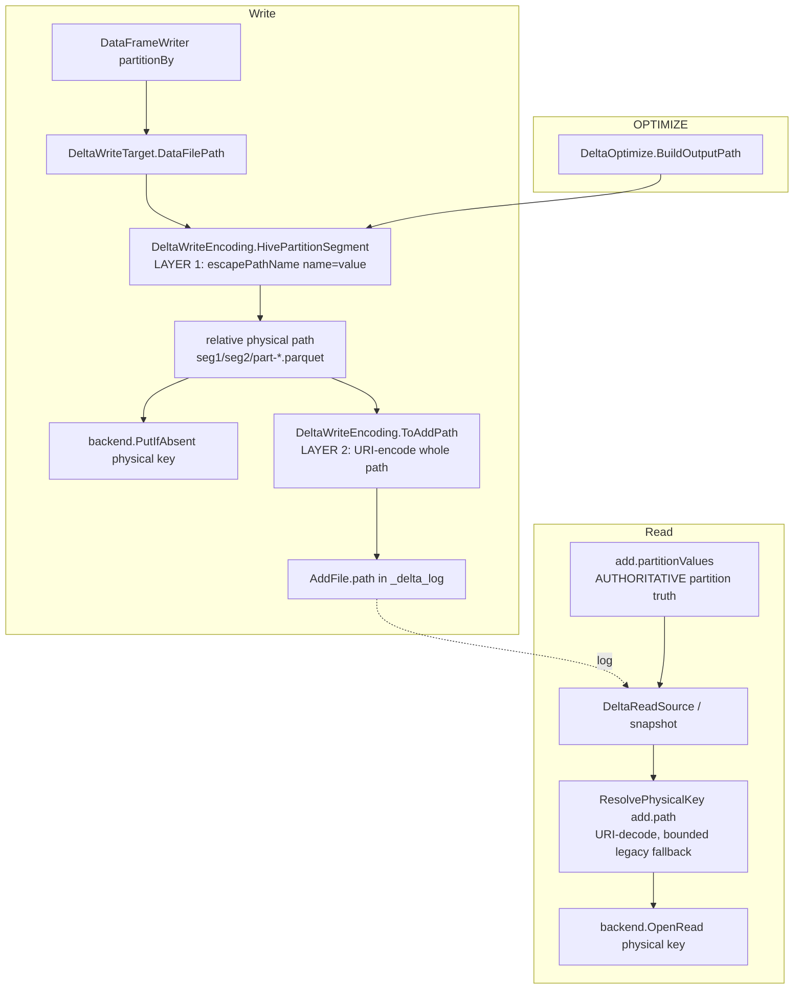
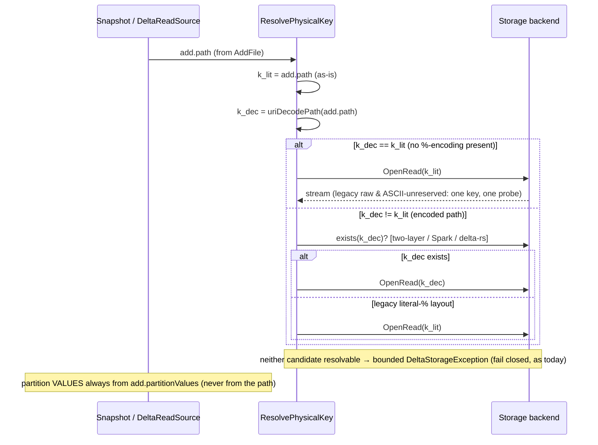
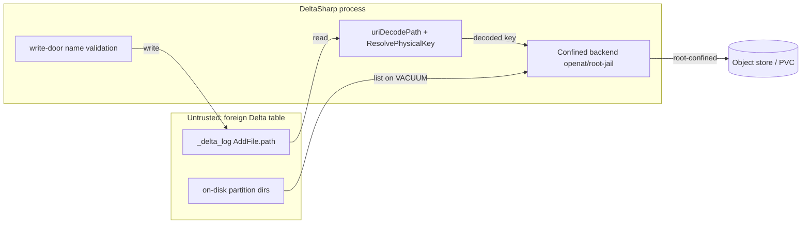

# Partition path encoding — Spark/delta-rs interop (two-layer `escapePathName` + URI-encoded `add.path`)

> **Status:** Draft
> **Issues:** [#806](https://github.com/khaines/deltasharp/issues/806) — Delta partition NAME/VALUE encoding: Spark/delta-rs interop round-trip (two-layer physical-segment + URI-encoded add.path); [#708](https://github.com/khaines/deltasharp/issues/708) — partition column names written raw while values are percent-encoded (origin)
> **Author:** design-doc skill (orchestrated)
> **Reviewers:** cloud-native-distributed-systems-architect, delta-storage-format-engineer, reliability-test-chaos-engineer, cloud-native-security-sme, cloud-native-site-reliability-engineer, performance-benchmarking-engineer
> **Last Updated:** 2026-08-30
> **Related:** PR #797 (the #708 scope-correction that percent-encoded both NAME and value with `Uri.EscapeDataString` — directory-injection hardening retained, but not Spark-parity), #696 (message-hygiene recognizer that must stay fixed regardless), OrphanCleanup encoding-robust protection (#489 lineage)

---

## 1 · Overview

DeltaSharp composes a Hive-style partition directory segment as
`Uri.EscapeDataString(name) + "=" + Uri.EscapeDataString(value)` and stores the resulting relative path
**verbatim** in `add.path` — it neither URI-encodes the whole path on write nor URI-decodes it on read
(`DeltaWriteEncoding.HivePartitionSegment`, `DeltaWriteTarget.DataFilePath`, `DeltaReadSource` opens
`add.Path` directly). This is a **known, documented deviation** from two independent contracts:

1. **On-disk layout** does not match Apache Spark / delta-rs. Spark composes the directory with
   `ExternalCatalogUtils.escapePathName` — a Hive-derived 128-entry ASCII bitset that escapes only
   `0x01–0x1F`, `" # % ' * / : = ? \`, `DEL`, `{ [ ] ^` (and, on Windows, `space < > | `) and **passes
   non-ASCII and space (non-Windows) through unescaped**. `Uri.EscapeDataString` uses the RFC-3986
   *unreserved* alphabet: it escapes space (`%20`), all non-ASCII (`%C3%A9`), and a different reserved
   set. So DeltaSharp and Spark produce **different directory names** for any partition NAME or VALUE
   outside the ASCII-unreserved set.
2. **`add.path`** is, per the Delta protocol, a **URI-encoded** relative path (RFC 2396): `country=US/…`
   is stored as `country%3DUS/…` and must be URI-**decoded** to recover the object key. DeltaSharp treats
   `add.path` as a literal object key on both write and read.

**Consequence:** a DeltaSharp table whose partition names/values contain characters outside the
RFC-3986 unreserved set is **not round-trippable with Spark/delta-rs** — the directory Spark expects and
the `add.path` Spark writes both differ from what DeltaSharp emits, and a Spark-written table's
URI-encoded `add.path` is mis-resolved by DeltaSharp's literal-key read.

This design specifies the **correct two-layer scheme** (#806) and a **fail-closed, backward-compatible
migration** for the DeltaSharp tables already written in the two legacy layouts (pre-#797 raw-name, and
#797 `Uri.EscapeDataString`-both):

- **Layer 1 — physical directory segment (on disk):** `escapePathName(name) = "=" = escapePathName(value)`,
  matching Spark/delta-rs byte-for-byte.
- **Layer 2 — `add.path` (in the log):** URI-encode the full relative path per the Delta protocol.
- **Read:** URI-**decode** `add.path` to recover the physical object key, with a bounded, fail-closed
  resolution that still reads the legacy literal-key layouts.

**Requirements traceability:** #806 acceptance (§3.7) — differential Spark/delta-rs parity across the
ASCII-reserved and non-ASCII sets; mixed legacy+new migration coverage; an encoded-segment length budget.
Carries forward #708's original "measured, not assumed" criterion, which PR #797 did **not** satisfy.

**Non-goals.** Changing partition-value *semantics* (partition truth is and remains `add.partitionValues`,
never parsed from the path); introducing a new Delta protocol reader/writer feature; changing deletion-vector
or `_change_data` path composition (they do not use partition directories — §2.5); re-opening the #696
message-hygiene fix (it must stay fixed regardless — `add.path` is foreign input forever). The directory-
**injection** hardening PR #797 shipped (a hostile name containing `/` or `=` cannot fabricate segments) is
**retained** — `escapePathName` escapes `/` and `=`, so injection safety is preserved by construction.

---

## 2 · Logical architecture

### 2.1 Where the encoding sits



Both the write door (`DeltaWriteTarget`) and OPTIMIZE (`DeltaOptimize.BuildOutputPath`) already funnel
through the single `HivePartitionSegment` helper, so a change there keeps freshly-written and compacted
files in the **same** on-disk layout by construction. This design adds a symmetric `ToAddPath`/`FromAddPath`
pair for layer 2 and threads the read-side decode through the object-key resolution.

### 2.2 The two-layer scheme (the crux)

Let `name` and `value` be the *logical* partition column name (its physical name in `name`/`id` column
mapping) and the string partition value (`null` → the `__HIVE_DEFAULT_PARTITION__` sentinel).

**Layer 1 — physical segment (identical to Spark `ExternalCatalogUtils.escapePathName`):**

```
seg(name, value) = escapePathName(name) + "=" + escapePathName(value)      // value=null → escapePathName(name)+"="+"__HIVE_DEFAULT_PARTITION__"
```

`escapePathName(s)` escapes exactly the Hive/Spark `charToEscape` bitset — `0x01–0x1F`, `" # % ' * / : = ? \`,
`0x7F`, `{ [ ] ^` (and, only when running on Windows, `space < > |`) — as uppercase `%XX`, and **passes every
other code point through unescaped, including all non-ASCII and (on non-Windows) the space**. This is the
on-disk directory name; it is what Spark and delta-rs write and expect.

> **Portability note.** Spark's set is Windows-conditional (`Shell.WINDOWS`). For a **portable, engine-stable**
> on-disk layout DeltaSharp must pick one alphabet regardless of host OS — otherwise a table written on Linux
> and compacted on Windows would diverge. Decision **D1 (§9):** adopt the **non-Windows** Spark alphabet on all
> hosts (space and `< > |` pass through), because (a) it is what Spark-on-Linux and delta-rs emit — the dominant
> lake producers — and (b) the confined backend never interprets `< > |` as shell metacharacters. The Windows
> local backend must therefore accept these in a component name (they are legal on the object-store key space and
> on POSIX; the Windows *local* filesystem is the only place `< > |` are illegal, handled as a backend concern —
> see §2.6 length/again §8 risk).

**Layer 2 — `add.path` (Delta protocol URI-encoded path):**

```
add.path = uriEncodePath( seg1 + "/" + seg2 + "/" + … + "part-<token>.parquet" )
```

`uriEncodePath` percent-encodes each path *segment's* octets per RFC 3986 while preserving the `/`
separators. Crucially this is applied **on top of** layer 1, so a layer-1 `%XX` has its `%` re-encoded to
`%25` (e.g. value `a/b` → layer-1 segment `col=a%2Fb` → `add.path` `col%3Da%252Fb/…`), the literal separator
`=` becomes `%3D`, a passthrough space becomes `%20`, and a passthrough non-ASCII octet becomes its UTF-8
`%`-triplets. This is exactly the Delta protocol rule (`country=US/f` ⇒ `country%3DUS/f`).

**Read — recover the physical object key:**

```
physicalKey = uriDecodePath(add.path)            // protocol-correct: exact inverse of layer 2
```

For a two-layer (or Spark/delta-rs-written) table this yields the real on-disk key. For **legacy DeltaSharp
tables** `add.path` was stored *literally* (no layer 2), and a literal legacy path can itself contain `%XX`
(from `Uri.EscapeDataString` on the value), so `uriDecodePath` would **corrupt** it (`col=a%2Fb` → `col=a/b`,
splitting a directory). The read therefore resolves through a **bounded, fail-closed candidate set** — §2.4.

### 2.3 Read resolution & data flow



The candidate set is **at most two** keys and is only consulted when `add.path` actually contains a `%`
(the overwhelmingly common case — ASCII-unreserved names/values, and all legacy raw tables — decodes to
itself, so exactly one key and one probe, preserving today's cost). Partition **truth** is untouched:
`add.partitionValues` remains authoritative (`DeltaReadSource` const/null-fills partition columns from it),
so a directory-encoding change cannot change query results.

### 2.4 Migration & backward compatibility (three on-disk layouts)

| Layout | Producer | On-disk dir example (`value="a/b"`, name `"my col"`) | `add.path` stored | Correct read key |
|---|---|---|---|---|
| **L0 raw-name** | DeltaSharp pre-#797 (#708 origin) | `my col=a%2Fb` (name raw, value `EscapeDataString`) | literal `my col=a%2Fb/…` | literal |
| **L1 escape-both** | DeltaSharp #797 (current) | `my%20col=a%2Fb` (both `EscapeDataString`) | literal `my%20col=a%2Fb/…` | literal |
| **L2 two-layer** | this design / Spark / delta-rs | `my col=a%2Fb` (`escapePathName`; space passes through) | URI-encoded `my%20col%3Da%252Fb/…` | `uriDecodePath` |

Key observations that make the bounded resolver (§2.3) correct and fail-closed:

- The file physically exists at **exactly one** object key. `{k_lit, k_dec}` always contains it: L0/L1 at
  `k_lit`, L2 at `k_dec`. The two candidates never collide on a real file (a single `AddFile` maps to one
  file), so resolution is unambiguous.
- For the ASCII-unreserved happy path (and all non-partitioned tables) `k_dec == k_lit` — no extra probe,
  no behavior change.
- **OrphanCleanup / VACUUM are already encoding-robust** (`MatchesEncodingRobust`, protected set
  `{raw} ∪ {UnescapeDataString(raw)}`). This design extends the *same* tolerance to the two-layer form; the
  union can only over-protect, never over-delete (a data-loss-safe direction) — re-verified in §3.
- **Pre-GA context (D3, §9):** DeltaSharp is M1 scaffolding; L0/L1 tables are unlikely to exist outside CI
  fixtures. The bounded resolver is retained anyway (cheap, fail-closed, satisfies #806's explicit
  mixed-layout migration criterion) rather than assuming no legacy tables exist.

### 2.5 Component boundaries & call sites

| Component | File (current) | Change |
|---|---|---|
| Layer-1 segment | `DeltaWriteEncoding.HivePartitionSegment` (`DeltaWriteEncoding.cs:103-150`) | swap `Uri.EscapeDataString` → `escapePathName`; add `EscapePathName`/`UnescapePathName` helpers |
| Layer-2 encode | new `DeltaWriteEncoding.ToAddPath(relativePath)` | URI-encode the assembled relative path |
| Write door | `DeltaWriteTarget.DataFilePath` (`DeltaWriteTarget.cs:862-891`) | compose physical key (L1) for `PutIfAbsent`; store `ToAddPath(...)` in `AddFile.path` |
| OPTIMIZE | `DeltaOptimize.BuildOutputPath` (`DeltaOptimize.cs:778-801`) | identical L1+L2 as the write door (lockstep — same helper) |
| Log writer | `DeltaLogActionWriter.cs:142` | unchanged (writes `add.Path` verbatim — now already layer-2 encoded) |
| Read resolve | `DeltaReadSource` (`:328`, `:380`) + snapshot/scan key resolution | route `add.Path` through `ResolvePhysicalKey` (§2.3) before `OpenRead` |
| Orphan/VACUUM | `OrphanCleanup.MatchesEncodingRobust` (`:204-269`) | extend encoding-robust union to the two-layer form |
| Validation | `ColumnMapping.FindUnsafePathSegmentReason` (`:229-305`), `MaxPathSegmentNameBytes` (`:207`) | keep injection rejects; add encoded-length budget (§2.6) |

**Out of scope by construction — do not compose partition dirs:** deletion-vector sidecars
(`DeletionVectorDescriptor` — random-prefix + Z85 UUID + `.bin`) and CDF (`ChangeDataWriter` — flat
`_change_data/cdc-<token>.parquet`). They carry their own relative-key contracts and their `PartitionValues`
come from the action/model, not path parsing. VACUUM's path *matching* for these must remain encoding-robust
(§3.2) but their composition is unchanged.

### 2.6 Validation, injection safety & the encoded-length budget

- **Injection safety is preserved.** `escapePathName` escapes `/`, `\`, `=`, `:`, and control chars, so a
  hostile name/value can neither create nor escape a directory segment. The existing write-door rejects in
  `FindUnsafePathSegmentReason` (`/ \ = :`, controls, line/para separators, format/bidi, unpaired surrogate,
  whitespace-only, `.`/`..`, >128 UTF-8 bytes) remain as **defense in depth** (a rejected name never even
  reaches encoding).
- **Encoded-length budget (the #806 length concern).** Today `MaxPathSegmentNameBytes=128` bounds the **raw**
  name, but `Uri.EscapeDataString` can triple a non-ASCII byte (`é`→`%C3%A9`), so a 128-byte all-non-ASCII name
  → ~384 chars, which can breach a filesystem `NAME_MAX` (ext4/PVC = 255). **Adopting `escapePathName` largely
  resolves this by construction** (non-ASCII passes through: 128 raw bytes → 128 on-disk bytes). The design still
  adds an explicit **encoded-segment length assertion** on the *composed layer-1 segment* (`escapePathName(name)`
  `+"="+` worst-case-encoded value budget) against a conservative component budget, failing **closed** at the
  write door (pre-commit, orphan-Parquet-only) with a bounded `DeltaStorageException` — never a late
  `ENAMETOOLONG` at `PutIfAbsent`. This preserves the "fails closed today (staging → bounded exception,
  object-store-immaterial)" property #806 calls out.

### 2.7 Increment decomposition (fail-closed by construction)

The write and read halves are coupled: a two-layer-written table is unreadable by DeltaSharp without the
read decode, and a naive decode corrupts legacy tables. To keep every intermediate `main` state
**fail-closed and shippable** (the #866 model), decompose XL → three increments:

1. **Inc-A (read resolver, backward-compatible; ships first).** Introduce `ResolvePhysicalKey` (§2.3): a
   bounded `{k_lit, k_dec}` resolver that is a **no-op for every current table** (`k_dec==k_lit`, or
   `k_lit` exists) and pre-positions read for layer-2 writes. No write change yet, so no new on-disk layout
   is produced — purely additive, fail-closed (neither candidate → today's bounded not-found error). Its own
   test: a synthetic layer-2 `add.path` fixture resolves to the right key; legacy L0/L1 fixtures still resolve.
2. **Inc-B (write two-layer + OPTIMIZE lockstep).** Switch `HivePartitionSegment` to `escapePathName` and
   store `ToAddPath(...)` in `AddFile.path`; `DeltaOptimize.BuildOutputPath` rides the same helper. Add the
   §2.6 length assertion. After Inc-A, a two-layer table's decoded `add.path` resolves correctly — the pair
   round-trips within DeltaSharp. Guarded: until Inc-A is on `main`, Inc-B is not merged.
3. **Inc-C (interop parity + migration + robustness).** Differential Spark/delta-rs golden fixtures
   (§3.2); mixed-layout migration tests (§3.3); OrphanCleanup/VACUUM/DV/CDF path-matching re-verification;
   the length-budget cell. This is the increment that discharges #806's "measured, not assumed" criterion.

---

## 3 · Functional test scenarios & correctness oracles

### 3.1 Happy path (round-trip within DeltaSharp)

- **H1** — Write a table partitioned by a name containing a **space** and a **quote** (`my col`, `o'brien`)
  and values across the reserved+non-ASCII sets; read it back through DeltaSharp; assert every row and its
  partition columns reconstruct exactly (partition truth from `add.partitionValues`). Directly discharges
  #708 AC "written and read back correctly by DeltaSharp".
- **H2** — On-disk layout assertion: the physical directory equals `escapePathName(name)=escapePathName(value)`
  byte-for-byte (space and non-ASCII pass through; `/ = : "` escaped as `%2F %3D %3A %22`).
- **H3** — `add.path` assertion: equals `uriDecodePath⁻¹` of the physical relative path (`=`→`%3D`,
  space→`%20`, layer-1 `%2F`→`%252F`, non-ASCII→UTF-8 `%`-triplets).

### 3.2 Differential parity vs Spark & delta-rs (the #806 core oracle — "measured, not assumed")

A **golden differential** test: for a matrix of partition names/values spanning
{ASCII-unreserved, ASCII-reserved (`" # % ' * / : = ? \ { [ ] ^ space`), control-adjacent (rejected — asserted
rejected), non-ASCII (`région`, `名前`, emoji), `null`→sentinel}, compare DeltaSharp's `(physical dir, add.path)`
against **reference fixtures emitted by real Spark and delta-rs** (checked-in goldens produced out-of-band, the
same OR-a/OR-b pattern as #520/#646). Two directions:

- **DS→ref:** DeltaSharp's directory and `add.path` equal the reference bytes.
- **ref→DS:** a Spark/delta-rs-written `_delta_log` + files fixture is **read** by DeltaSharp and returns the
  correct rows/partition values (closes the read half — the more urgent gap per #708).

> **Open item O1 (§9):** the exact `%`-double-encoding of a layer-1 `%XX` inside `add.path` (`%2F`→`%252F`)
> must be **verified against** the reference goldens, not assumed — Hadoop `Path`/`SparkPath` URI handling is
> the authority. The differential fixture is the oracle; the implementation conforms to it.

### 3.3 Migration / mixed-layout (bounded resolver)

- **M1** — L0 (raw-name) fixture: read succeeds via `k_lit`; `k_dec≠k_lit` path not needed (or falls back).
- **M2** — L1 (`EscapeDataString`-both, #797) fixture with a value containing `/` (on-disk `%2F`): assert the
  resolver reads via `k_lit` and does **not** corrupt via `k_dec` (the data-loss trap — a naive decode-always
  would open the wrong/nonexistent key). This is the red-team's headline migration trap.
- **M3** — L2 fixture: read via `k_dec`.
- **M4** — Mixed table: a single table containing files from L1 (pre-existing) and L2 (appended after upgrade);
  a full scan reads **all** rows. (Exercises the resolver per-file.)

### 3.4 Edge cases & fail-closed

- **E1** — value `null` → `__HIVE_DEFAULT_PARTITION__` sentinel on disk (unescaped), partition value reads back
  as `null`.
- **E2** — value that *is* the literal string `__HIVE_DEFAULT_PARTITION__` vs a real null (must stay distinct —
  Spark parity gap guard).
- **E3** — encoded-length breach (§2.6): a name/value whose composed segment would exceed the component budget
  → bounded `DeltaStorageException` at the write door, **pre-commit**, no orphan directory, no `ENAMETOOLONG`.
- **E4** — injection: a name/value containing `/` or `=` cannot fabricate or escape a segment (escaped to
  `%2F`/`%3D`); write-door validation still rejects a *column* name containing `/ = :` (defense in depth).
- **E5** — OPTIMIZE: a compacted file lands in the **same** two-layer directory and its `add.path` is layer-2
  encoded identically to a fresh write (write-vs-OPTIMIZE prefix equivalence, extending the existing test).

### 3.5 Deterministic correctness oracles

- **OrphanCleanup safety oracle:** over a table with any mix of L0/L1/L2 files, the encoding-robust protected
  set is a **superset** of every live file's real key — asserted by construction (union of raw+decoded on both
  sides), so VACUUM can never reclaim a live file. Split oracle: identical over conforming layouts, over-protects
  (never under-protects) over forged/ambiguous literal-`%` keys.
- **Round-trip inverse:** `uriDecodePath(ToAddPath(p)) == p` for all composed physical paths `p` (property test
  over the character matrix) — layer-2 is a total inverse.

### 3.6 Determinism

Encoding is pure and host-stable under D1 (non-Windows alphabet on all hosts); the file-name token is the only
nondeterministic input and is factored out (as today). No wall-clock, no map-ordering dependence (partition
columns iterate in schema order).

### 3.7 Acceptance-criteria mapping

| Source AC | Scenario(s) |
|---|---|
| #806 — differential Spark/delta-rs parity across ASCII-reserved & non-ASCII | §3.2 (DS→ref, ref→DS) |
| #806 — migration/compat for mixed legacy + new layouts | §3.3 (M1–M4), §3.5 |
| #806 — encoded-segment length budget (raw-vs-encoded gap; fails closed) | §2.6, §3.4 E3 |
| #708 — behaviour of Spark/delta-rs on hostile-but-legal names **measured** | §3.2 (goldens are the measurement) |
| #708 — decision among {deviating / conventional / ambiguous} with rationale | §9 D2 (we ARE deviating → adopt escapePathName + URI add.path) |
| #708 — round-trip: name with space + quote written & read back | §3.1 H1 |
| #708 — write-format change preserves read compat; OPTIMIZE/CDF/DV re-verified | §3.3, §3.5, §2.5 |

---

## 4 · Performance

- **Workload profile.** Encoding runs once per written file (write + OPTIMIZE) and once per file resolved on
  read/scan. Volume = number of `AddFile`s per commit / per scan, not per row.
- **Encode cost.** `escapePathName` is a single pass with a fast "no-escape" early-out (identical shape to
  Spark's); strictly cheaper than `Uri.EscapeDataString` on the common no-escape path. Negligible vs Parquet
  I/O.
- **Read-resolution cost (the only new hot-path cost).** For `k_dec==k_lit` (ASCII-unreserved names/values and
  **all** legacy raw tables) there is **one** key and **zero** extra probes — identical to today. Only files
  whose `add.path` contains a `%` **and** whose `k_dec≠k_lit` incur at most **one** extra existence probe
  (a `HEAD` on object stores) to disambiguate L1-literal from L2-decoded. Budget: **≤1 extra metadata probe
  per encoded-partition file on first open**; zero for the dominant case.
  - **Optimization O2 (§9):** resolve-order and an optional per-table encoding hint (a `_delta_log` config, or
    inferring from the protocol/writer that produced the commit) can drop the probe to zero for two-layer
    tables; deferred unless the probe shows up in a partitioned-scan benchmark.
- **Allocation budget.** Encoding allocates a bounded `StringBuilder` per segment (as today). No per-row
  allocation. Resolution allocates at most one extra decoded string per encoded file.
- **Regression gate.** A partitioned-scan micro-benchmark (many small partition dirs) asserts no
  >X% wall-clock/allocation regression vs the pre-change baseline for the ASCII-unreserved case (must be ~0).

---

## 5 · Security

- **Data classification.** `add.path` and partition directory names are **restricted foreign input on read**
  (a Delta table may be attacker-authored) and DeltaSharp-authored on write. Partition **values** may carry
  PII/tenant data — they appear in the directory name and `add.path`, so diagnostics must never echo a raw
  value (see §7 / #696).
- **Input validation.** Write-door validation (`FindUnsafePathSegmentReason`) rejects column names that could
  restructure the path; `escapePathName` neutralizes `/ = : \` in **values** so a hostile value cannot fabricate
  or escape a directory. The bounded backend (`LocalFileSystemBackend` openat/confinement) enforces that a
  resolved key stays under the table root — a decode that produced a `..` or absolute key is rejected at the
  backend (**must be re-verified for the decode path** — §6 T-Escape).
- **Read decode is a new attack surface.** `uriDecodePath(add.path)` runs on **foreign** input. It must:
  (a) never yield a key that escapes the table root (path-traversal via `%2e%2e%2f` → `../`); (b) be bounded
  (no quadratic blow-up on adversarial `%`); (c) fail **closed** (a malformed/over-long decode → bounded
  `DeltaStorageException`, never an unbounded allocation or an out-of-confinement open). The confinement check
  must apply to the **decoded** key, not the pre-decode literal.
- **Tenant isolation.** Unchanged: partition truth is `add.partitionValues`; no cross-tenant path inference is
  introduced. The decode is per-file and stateless.
- **Supply chain.** No new dependency — `escapePathName`/URI codec are in-repo (a small, audited port of the
  Hive/Spark bitset).

---

## 6 · Threat model



| STRIDE | Threat | Surface | Mitigation | Residual |
|---|---|---|---|---|
| **T**amper / **E**oP | `add.path` = `..%2f..%2fetc%2fpasswd` decodes to a traversal key | read decode | Confinement check on the **decoded** key at the backend (root-jail); decode is single-pass, not recursive | Backend openat is the enforcement point — covered by existing confinement tests, extended to the decoded key (§3) |
| **D**oS | Adversarial `add.path` with pathological `%` sequences | read decode | Bounded, single-pass `uriDecodePath` (O(n)); over-long segment → fail-closed bounded exception | Bounded by existing per-path length limits |
| **I**njection | Hostile partition **value** fabricates a directory (`v="../x"` or `v="a=b/c"`) | write compose | `escapePathName` escapes `/ = \ :` in the value; name rejected by write-door validation | None (injection-hardening from #797 retained + strengthened) |
| **I**nfo disclosure | Raw partition **value** (PII) leaks into a fault/log message via a raw-key-shaped path | diagnostics | #696 recognizer stays fixed; `DiagnosticText.Sanitize` on any path echoed; **`escapePathName` also stops us *generating* the raw-key shape** (the #708 §2 concern) | Foreign tables still contain raw shapes — `Redact` handles forever |
| **S**poofing (data-loss) | Ambiguous legacy-`%` key mis-resolved so VACUUM reclaims a live file | orphan/VACUUM | Encoding-robust union {raw ∪ decoded} over-protects; bounded resolver reads the real key; partition truth from `partitionValues` | Over-protection (a leaked orphan) is the safe failure direction |

---

## 7 · Observability

- **Metrics.**
  - `deltasharp.delta.partition_path.resolve_fallback` (counter, dim: `layout=literal|decoded`) — increments when
    the resolver used the non-primary candidate; a spike on `decoded` is expected post-upgrade, a spike on
    `literal` for a supposedly-migrated table is a signal.
  - `deltasharp.delta.partition_path.length_reject` (counter) — write-door encoded-length rejections (§2.6).
- **Logging.** Any log line that must reference a partition path routes through `DiagnosticText.Sanitize`
  (tenant-safe; never a raw value). A resolution fail-close logs the **sanitized** `add.path` shape + the
  candidate-set outcome (which keys were probed), never the decoded PII.
- **Tracing.** The read-resolution decision is a cheap attribute (`partition_path.layout`) on the existing
  file-open span; no new span.
- **Correlation.** Reuses table path/version + `add.path` (sanitized) already carried on storage spans.

---

## 8 · Rollout & risk

- **Rollout (increment order §2.7):** Inc-A (read resolver, no-op for all current tables) → Inc-B (two-layer
  write + OPTIMIZE) → Inc-C (parity/migration/robustness). Each is an independent PR to the RFL bar; `main` is
  fail-closed and shippable after each.
- **Pre-GA context.** DeltaSharp is M1 scaffolding — no external production tables. The migration path exists to
  satisfy #806 and to keep CI fixtures/round-trips valid, not to protect at-scale existing data. This lowers the
  blast radius of the write-format change but does **not** waive the read-compat tests.
- **Rollback.** Inc-B is the only on-disk-format change. Rollback = revert Inc-B; Inc-A's resolver still reads any
  L2 tables already written (forward-safe), and L0/L1 remain readable throughout. No `_delta_log` schema change,
  no protocol feature — nothing to un-commit.
- **Risk register.**
  - *R1 — `%`-double-encoding wrong (O1).* Mitigation: golden differential fixtures are the oracle; Inc-C blocks
    on ref→DS and DS→ref parity. **High-value, must-measure.**
  - *R2 — naive decode corrupts L1 tables (M2 trap).* Mitigation: bounded resolver, literal candidate retained;
    red-team M2 cell.
  - *R3 — Windows alphabet divergence (D1).* Mitigation: single non-Windows alphabet on all hosts; Windows local
    backend accepts `space < > |` in a key or rejects at its own layer with a bounded error.
  - *R4 — read-decode traversal (T-Escape).* Mitigation: confinement on the decoded key; existing root-jail tests
    extended.
  - *R5 — probe cost on partitioned scans.* Mitigation: zero for the common case; O2 hint deferred behind a
    benchmark.
- **Launch checklist:** differential parity green (Spark + delta-rs, both directions); mixed-layout migration
  green; OrphanCleanup/VACUUM/DV/CDF path-matching re-verified; length-budget fail-closed; confinement-on-decoded
  key verified; partitioned-scan benchmark within gate; `dotnet format`/build/test green.

---

## 9 · Open questions & decisions

- **D1 — on-disk alphabet is host-stable (non-Windows Spark set).** *Decided:* use the non-Windows
  `escapePathName` alphabet on every host (space/`<>|` pass through) for an engine-stable, Spark-on-Linux/delta-rs-
  matching layout. Windows *local* filesystem illegality of `< > |` is a backend concern (accept on object
  stores/POSIX; bounded backend error on Windows-local if it ever matters). *Confirm with reviewers.*
- **D2 — we ARE deviating; adopt the two-layer fix.** *Decided (answers #708's three-way choice):* current
  behavior is a genuine protocol/interop deviation (both layers), not merely a robustness gap → adopt
  `escapePathName` physical + URI-encoded `add.path` + read decode. Recorded on #708/#806.
- **D3 — bounded resolve-by-existence vs a per-table encoding marker.** *Recommended:* bounded `{k_lit, k_dec}`
  resolver (no protocol surface, fail-closed, ≤1 extra probe only for encoded files, mirrors OrphanCleanup's
  existing tolerance). *Alternative (O2):* a `_delta_log` config hint to skip the probe. *Open:* accept the
  recommendation, or gate the hint on a benchmark showing probe cost matters.
- **O1 — exact `%`-double-encoding in `add.path` must be measured, not assumed.** The layer-1 `%XX`→`%25XX`
  and separator `=`→`%3D` behavior is specified per RFC/protocol but the **reference goldens (Spark, delta-rs)
  are the authority** — Inc-C conforms DeltaSharp to them. *Open until the goldens are captured.*
- **O3 — do we ever need to *parse* a directory name?** Currently no (partition truth = `partitionValues`).
  Confirm no read path infers partition values from the path (survey found none) so the encoding is a pure
  locator. *Believed closed; reviewer confirm.*
- **O4 — coordinate with #520/#646 golden infrastructure.** The Spark/delta-rs fixture mechanism should be the
  same reference-engine-emitted `_delta_log` harness those issues introduce. *Sequence Inc-C after / alongside.*

---

## 10 · References

- Issues: [#806](https://github.com/khaines/deltasharp/issues/806), [#708](https://github.com/khaines/deltasharp/issues/708); related [#696](https://github.com/khaines/deltasharp/issues/696), PR #797, [#520](https://github.com/khaines/deltasharp/issues/520), [#646](https://github.com/khaines/deltasharp/issues/646).
- Delta protocol — `add`/`remove` `path` is a URI-encoded (RFC 2396) relative path, decoded to the data-file path: <https://github.com/delta-io/delta/blob/master/PROTOCOL.md>.
- Apache Spark `ExternalCatalogUtils.escapePathName` / `unescapePathName` (Hive-derived `charToEscape` bitset; non-ASCII & non-Windows space passthrough): <https://github.com/apache/spark/blob/master/sql/catalyst/src/main/scala/org/apache/spark/sql/catalyst/catalog/ExternalCatalogUtils.scala>; SPARK-7847.
- Current code: `DeltaWriteEncoding.HivePartitionSegment` (`src/DeltaSharp.Storage/Writing/DeltaWriteEncoding.cs:103-150`), `DeltaWriteTarget.DataFilePath` (`.../Writing/DeltaWriteTarget.cs:862-891`), `DeltaOptimize.BuildOutputPath` (`.../Delta/DeltaOptimize.cs:778-801`), `DeltaReadSource` (`.../Reading/DeltaReadSource.cs:328,380`), `DeltaLogActionWriter.cs:142`, `ColumnMapping.FindUnsafePathSegmentReason` + `MaxPathSegmentNameBytes` (`.../Delta/ColumnMapping.cs:192-316,1637-1671`), `OrphanCleanup.MatchesEncodingRobust` (`.../Delta/OrphanCleanup.cs:130-269`), `LocalFileSystemBackend` (`.../Backends/LocalFileSystemBackend.cs`).
- Design conventions: `docs/engineering/design/README.md`; storage exemplars `storage-delta-architecture.md`, `vacuum-cdc-scan-skip.md`, `nested-within-nested-column-mapping.md`.
- Checklists (intended references): 17 (Delta storage format), 05/14 (security/tenant isolation), 04/04b/21 (testing/integration/distributed correctness), 08/22 (performance/regression gates), 09a/09b (logging/metrics).
