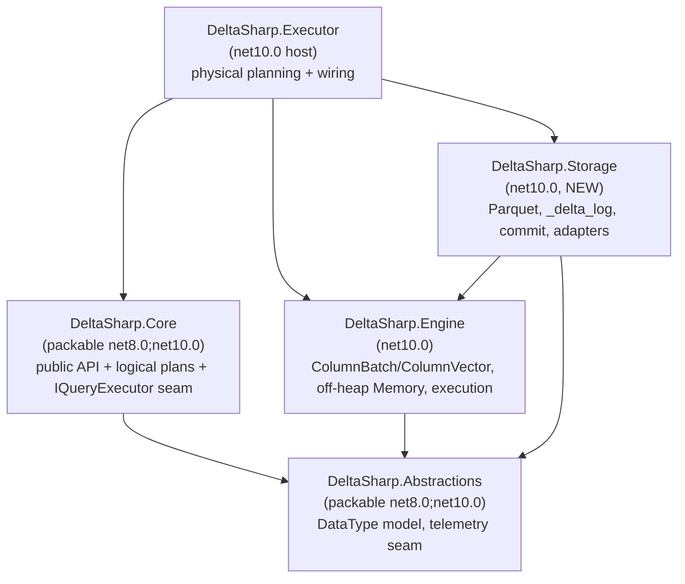
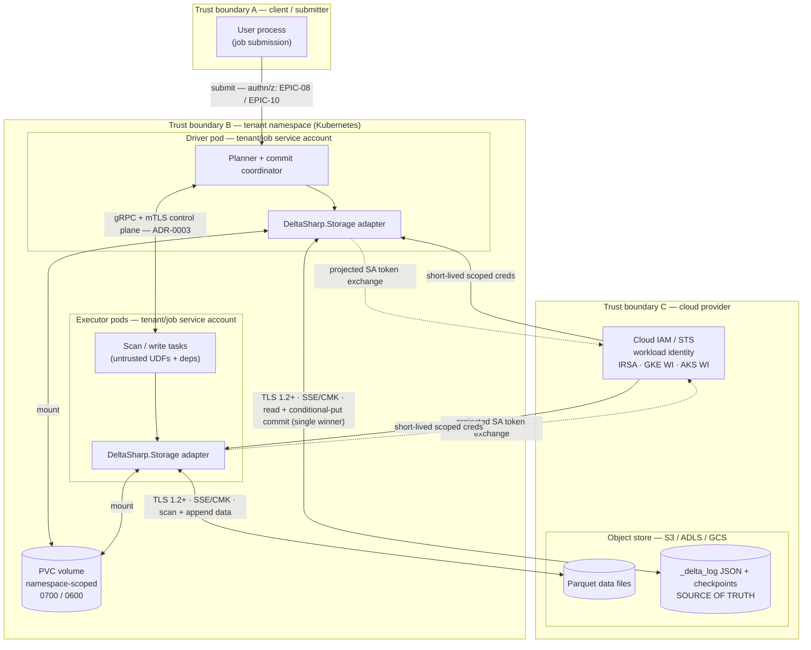

# EPIC-05 — Delta & Parquet storage architecture

> **Status:** living document (design). Created with **EPIC-05: Delta & Parquet Storage**
> ([epic #6](https://github.com/khaines/deltasharp/issues/6); features #46–#51, stories #180–#197) as
> the **epic-level architecture** for DeltaSharp's third pillar — a native Delta Lake storage layer in
> .NET. It is the design-doc-first artifact the epic's story lanes build against. Grounded in
> [ADR-0011](../../adr/0011-delta-protocol-scope.md) (the Delta protocol **scope contract** — v1 targets
> a broad feature set), [ADR-0002](../../adr/0002-columnar-batch-format.md) (`ColumnBatch`/`ColumnVector`,
> "Arrow at the edges"), [ADR-0013](../../adr/0013-memory-model.md) (off-heap allocator + unified memory
> manager + spill), [ADR-0014](../../adr/0014-target-framework-aot.md) (TFM/packability policy),
> [ADR-0016](../../adr/0016-shared-logical-type-model-abstractions.md) (the `Core`↔`Engine`
> `Abstractions` seam), and [ADR-0006](../../adr/0006-scheduler-aqe-cbo.md) (write-time statistics feed
> CBO/AQE). It mirrors and extends the read door ([read-door.md](read-door.md)) and write door
> ([write-door.md](write-door.md)) seams and the `IQueryExecutor` inversion. It maps every feature/story
> back to the delta-storage ([17](../checklists/17-delta-storage-format-checklist.md)) and
> distributed-correctness ([21](../checklists/21-distributed-correctness-checklist.md)) checklists.
> Update it whenever the storage assembly split, the commit protocol, the adapter contract, or the
> ADR-0011 feature phasing changes.

---

## 1 · Overview

### 1.1 What this is

EPIC-05 replaces DeltaSharp's inert storage skeleton with a **real native Delta Lake storage layer**:
Parquet I/O that materialises into the engine's columnar batches, a `_delta_log` transaction protocol
(JSON actions, checkpoints, snapshot reconstruction), an ACID write/commit protocol with optimistic
concurrency, time travel, schema enforcement/evolution, column mapping, the advanced Delta writer
features (deletion vectors, Change Data Feed, liquid clustering, row tracking, V2 checkpoints) gated by
protocol-version negotiation, table maintenance (`OPTIMIZE`, `VACUUM`, write-time statistics), all over
a **pluggable object-store + Kubernetes-PVC storage abstraction**.

It is the **third pillar** named in the copilot instructions — *native Delta tables* — and the epic that
turns the read/write doors from "records the intent, then fails with a deterministic *EPIC-05 owns this*
diagnostic" into working table I/O. It is also where DeltaSharp's ACID and consistency claims must be
**proven, not asserted** (§3): the transaction log — never a directory listing — is the source of truth
for table state.

### 1.2 Why it matters

- **Spark parity (pillar 1).** Delta is the storage substrate Spark users expect: `spark.read.format("delta")`,
  time travel (`versionAsOf`/`timestampAsOf`), `SaveMode`, `MERGE`/deletes via deletion vectors, `OPTIMIZE`,
  `VACUUM`. Matching Delta's on-disk protocol lets a table written by DeltaSharp be read by other Delta
  engines and vice-versa — a release promise, gated by protocol-version negotiation.
- **Native Delta (pillar 2).** This is a first-class implementation of the Delta protocol in .NET, not an
  adapter around an external engine. Correctness is determined by the `_delta_log`.
- **Kubernetes-native (pillar 3).** The storage abstraction spans cloud object stores (S3/ADLS/GCS) **and**
  Kubernetes PersistentVolumes so a job targets either without code changes; the commit protocol is
  designed for object-store semantics (conditional-create, no atomic directory rename) with PVC as a
  specialisation, not a different correctness model.

### 1.3 Requirements traceability

| Source | Scope |
| --- | --- |
| [ADR-0011](../../adr/0011-delta-protocol-scope.md) | The **scope contract**: v1 baseline (protocol/metaData/add/remove/txn actions, checkpoints, time travel, schema enforcement/evolution, `OPTIMIZE`/compaction, `VACUUM`) **plus** advanced writer features (deletion vectors, column mapping, CDF, liquid clustering, row tracking) with V2 checkpoints; reader/writer protocol-version negotiation gates capabilities. |
| Epic #6 → FEAT #46–#51 → STORY #180–#197 | The pre-planned work breakdown (§2.8 phasing). |
| Checklists [17](../checklists/17-delta-storage-format-checklist.md), [21](../checklists/21-distributed-correctness-checklist.md) | The acceptance backbone — treated as design obligations, mapped in §3. |

---

## 2 · Logical architecture

### 2.1 The `DeltaSharp.Storage` assembly and where it sits

EPIC-05 introduces one new production assembly, reserved in the
[repository-layout intended assembly map](repository-layout.md): **`DeltaSharp.Storage`** — plane *data*,
responsibility *"Delta transaction log, Parquet, object-store / PVC backends."*

- **TFM / packability (ADR-0014, retro D1/D4).** `net10.0`, `IsPackable=false`, a **sibling to
  `DeltaSharp.Engine`**. Two independent placement constraints govern it, and the second **outlives** the
  planned net8 sunset: (1) *TFM* — a `net8.0` library cannot depend on a `net10.0`-only assembly (removed
  at the sunset); (2) *packability* — a **packable** library cannot reference a **non-packable** assembly
  on any TFM (**permanent**). `DeltaSharp.Core` stays packable, so it can **never** reference
  `DeltaSharp.Storage`; the two are wired at runtime, not compile time.
- **What lands where.** The **bulk of the epic is engine-internal** and lands in `DeltaSharp.Storage`
  (Parquet reader/writer, `_delta_log` actions, checkpoint reader, snapshot builder, commit protocol,
  optimistic concurrency, deletion vectors, CDF, compaction/vacuum, write-time stats, **and the
  S3/ADLS/GCS/PVC adapters**). Only a **small user-facing surface** touches the packable `Core`/
  `Abstractions` (§2.6): `SaveMode` (already in Core, [write-door.md](write-door.md)), the time-travel
  reader options (`versionAsOf`/`timestampAsOf`), the `mergeSchema`/schema-evolution mode, and a public
  `DeltaTable` handle.
- **Unsafe/AOT posture.** `DeltaSharp.Storage` stays trim/AOT-annotation-clean (ADR-0014) because it
  flows into the Executor NativeAOT image. `AllowUnsafeBlocks=true` is scoped project-local (as in
  `DeltaSharp.Engine.csproj`) but is **gated on a demonstrated `unsafe`-requiring decode kernel** — not
  inherited by analogy: much decode (`MemoryMarshal.Cast`, `Span<T>` slicing, `Vector<T>` loads over
  Engine's `NativeMemoryAllocator` buffers) needs no `unsafe`, and the flag widens the unsafe surface of
  an assembly that decodes **untrusted tenant bytes** (§4.3/§5.4), so its introduction carries a security
  review obligation. `BannedSymbols.txt` (`Reflection.Emit`/`Expression.Compile`) governs **DeltaSharp's
  own decode kernels only** — it cannot constrain a third-party codec. AOT-cleanliness of the chosen
  Parquet codec (Parquet.Net default, OQ-1) is therefore an **empirical property proven by the FEAT-05.1
  codec prototype** (a NativeAOT publish through the Executor `-warnaserror` path plus a runtime AOT decode
  smoke), made the **explicit codec-selection gate** — see §8.5.

**Internal layer map.** `DeltaSharp.Storage` is organised bottom-up as seven internal layers (namespaces
under `DeltaSharp.Storage.*`); protocol/feature negotiation (§2.14) is cross-cutting and gates layers L3–L7.

| Layer | Namespace | Responsibility | Stories |
| --- | --- | --- | --- |
| L1 Storage adapters | `Storage.Backends` | Async range GET, multipart/streaming PUT, LIST, DELETE, and the atomic put-if-absent commit primitive; S3/ADLS/GCS/PVC. Engine-internal, **no public SPI** (§2.13). | #182 |
| L2 Parquet I/O | `Storage.Parquet` | Vectorized reader → `MutableColumnVector`; writer (row groups/pages/footer/statistics). | #180, #181 |
| L3 Action model | `Storage.Delta.Actions` | Typed `protocol`/`metaData`/`add`/`remove`/`txn` (+ phased `deletionVector`/CDC/`domainMetadata`); reuses the engine's `SchemaJson` for `schemaString`. | #183 |
| L4 Log & checkpoint | `Storage.Delta.Log` | `LogStore` over `_delta_log`, checkpoint Parquet reader/writer (classic + V2), replay. | #184 |
| L5 Snapshot | `Storage.Delta.Snapshot` | Immutable snapshot reconstruction + snapshot-isolation planning API. | #185 |
| L6 Commit / OCC | `Storage.Delta.Commit` | Append-then-commit, optimistic concurrency, conflict detection, retry classification, `txn` idempotency, orphan cleanup. | #186–#188 |
| L7 Maintenance | `Storage.Delta.Maintenance` | OPTIMIZE/compaction, VACUUM, checkpointing, log cleanup, write-time statistics/data-skipping. | #195–#197 |
| ⟂ Features | `Storage.Delta.Features` | Reader/writer protocol-version + table-feature negotiation and capability gating (cross-cutting, §2.14). | all |

**Dependency direction (no cycles).**



The critical rule: **`DeltaSharp.Storage` references `DeltaSharp.Engine`** (to decode Parquet *into*
`ColumnBatch`/`ColumnVector` and to allocate decode buffers from the off-heap
`UnifiedMemoryManager` — ADR-0002/0013), and **`DeltaSharp.Engine` must never reference
`DeltaSharp.Storage`** (Engine stays an independent sibling — no cycle). The engine's scan operator does
**not** call Storage directly; instead the **Executor** owns the wiring (below), exactly as it does today
for in-memory relations.

### 2.2 How storage plugs into the existing seams (no Engine→Storage edge)

The read/write doors already installed the forward-compatible seams; EPIC-05 fills them in:

- **Scan-in seam.** `UnresolvedFileRelation` (`src/DeltaSharp.Core/Plans/Logical/UnresolvedFileRelation.cs`)
  is a pure descriptor (format, path, options, optional user schema). Today the analyzer's
  `ResolveRelations` throws a deterministic `AnalysisException(UnsupportedDataSource)` naming EPIC-05
  ([read-door.md](read-door.md) §"Parquet scan node"). EPIC-05 makes `ResolveRelations` **resolve** the
  node — reading the Delta snapshot (or inferring a Parquet schema) — into a resolved relation, and the
  `PhysicalPlanner` lowers it to a scan whose batches come from a Storage-backed source that implements
  the `IScanSource` shape (`src/DeltaSharp.Executor/Physical/ScanSource.cs` — `TryGetBatches → IReadOnlyList<ColumnBatch>`).
  Concretely, the physical leaf is a `ScanPlan` whose lazy constructor takes a
  `Func<CancellationToken, IReadOnlyList<ColumnBatch>>` thunk run on first `Execute`
  (`src/DeltaSharp.Executor/Physical/PhysicalPlan.cs`, the `ScanPlan` lazy ctor) — the Executor supplies a Storage-backed
  `ColumnBatch` producer, the exact shape the in-memory `IScanSource` uses today.
  Because the Executor references both Engine and Storage, the Parquet/Delta scan source lives on the
  **Executor↔Storage** edge; the engine's `ScanOperator` still only binds to `ColumnBatch`.
  > **Streaming evolution.** The M1 `IScanSource.TryGetBatches` returns a materialised
  > `IReadOnlyList<ColumnBatch>`; a real Parquet scan of a large file must stream. EPIC-05 introduces a
  > **lazy/streaming scan-source** variant (batch-at-a-time, honouring the `IBatchStream` batch-ownership
  > invariant from [execution-boundaries.md](execution-boundaries.md) / #420) rather than materialising
  > whole files. This is an additive seam, not a rewrite of the existing one.
- **Write-out seam.** The write door's `ILocalSink.Commit(schema, rows)` is explicitly an *M1 in-memory
  convenience*, **not** the storage sink; [write-door.md](write-door.md) already names the EPIC-05
  replacement — a **batched/columnar transactional sink** `Begin → WriteBatch(ColumnBatch) → Commit/Abort`
  (issue [#443](https://github.com/khaines/deltasharp/issues/443)). EPIC-05 implements that sink in
  `DeltaSharp.Storage` and wires it through the Executor's `ILocalSinkFactory`. `Commit` maps to the
  Delta commit protocol (§2.5): write Parquet data files, then atomically publish the log entry.
- **Execution inversion.** Nothing about this widens the public surface: `IQueryExecutor`
  (`src/DeltaSharp.Core/Execution/IQueryExecutor.cs`, `internal`) remains the sole crossing from lazy
  Core plans into eager execution; the Executor's `LocalQueryExecutor` gains Storage-backed scan sources
  and the columnar sink. A pure-Core program still calls `DeltaSharpExecutor.Enable()` to register the
  backend ([read-door.md](read-door.md) §"Executor bootstrap").

### 2.3 Component boundaries

| Component (in `DeltaSharp.Storage` unless noted) | Responsibility | Must not |
| --- | --- | --- |
| Parquet reader | Decode row-groups/pages → `MutableColumnVector`/`ColumnBatch` via off-heap buffers; expose projection + predicate-pushdown + stats | Materialise operator-facing Arrow types (ADR-0002: Arrow only at the edge); produce partial rows on corruption |
| Parquet writer | Encode `ColumnBatch` → Parquet with row-group/page sizing + footer stats | Emit stats that are not semantically valid for the physical type |
| `_delta_log` action model | Typed `protocol`/`metaData`/`add`/`remove`/`txn` (+ phased actions) parse/validate/serialize | Trust directory listing as active-file truth |
| Log replay / checkpoint / snapshot | Reconstruct an immutable `Snapshot` from newest checkpoint ≤ V then JSON replay | Derive state from listing; include version N+1 actions in a snapshot pinned at N |
| Commit protocol / OCC | Append-then-commit; atomic publish via conditional-create; conflict detection + retry; idempotency; orphan cleanup | Publish data files as active before the log commit; weaken conflict detection |
| Table features / protocol negotiation | Gate advanced capabilities on reader/writer protocol versions; fail closed on unsupported | Silently read/write an unsupported feature |
| Maintenance | `OPTIMIZE`/compaction, `VACUUM`/retention, write-time statistics | Delete a file any retained snapshot or active reader needs |
| Storage adapters (S3/ADLS/GCS/PVC) | Async range reads, multipart/streaming writes, list/delete, **conditional-put** commit primitive | Assume atomic directory rename; guess durability from executor-local state |
| Executor wiring (`DeltaSharp.Executor`) | Resolve `UnresolvedFileRelation` → Storage scan source; route columnar sink | Put storage logic in the engine's operators |
| Public handles (`DeltaSharp.Core`/`Abstractions`) | `SaveMode`, time-travel/`mergeSchema` options, `DeltaTable` | Reference Engine/Storage; carry reflection/AOT-unsafe code |

### 2.4 Data flow — read (snapshot → scan)

```mermaid
sequenceDiagram
  participant U as User (Core API)
  participant An as Analyzer (Core)
  participant Ex as Executor (LocalQueryExecutor)
  participant St as DeltaSharp.Storage
  participant Ad as Storage adapter (S3/PVC)
  U->>An: read.format("delta").load(path) → UnresolvedFileRelation; action
  An->>St: ResolveRelations: load Snapshot(path, versionAsOf?/timestampAsOf?)
  St->>Ad: GET _delta_log (list, checkpoint, JSON commits)
  Ad-->>St: log bytes
  St-->>An: immutable Snapshot (schema, protocol, active files, stats)
  An-->>Ex: resolved plan (scan over active files, pruned by predicate/stats)
  Ex->>St: open streaming scan source (file/row-group splits)
  St->>Ad: async range reads (Parquet row-groups)
  Ad-->>St: column-chunk bytes
  St-->>Ex: ColumnBatch stream (decoded into off-heap ColumnVectors)
  Ex-->>U: Rows (snapshot-isolated for the whole action)
```

### 2.5 Data flow — write (append-then-commit)

```mermaid
sequenceDiagram
  participant U as User (Core API)
  participant Ex as Executor
  participant St as DeltaSharp.Storage (commit protocol)
  participant Ad as Storage adapter
  U->>Ex: df.write.format("delta").mode(...).save(path) → WriteToSource; action
  Ex->>St: Begin(txn over Snapshot@readVersion)
  loop each ColumnBatch
    Ex->>St: WriteBatch(ColumnBatch)
    St->>Ad: multipart/streaming PUT Parquet data file (+ collect stats)
  end
  Ex->>St: Commit()
  St->>St: build add/remove/metaData actions; detect conflicts vs commits (readVersion, current]
  St->>Ad: conditional-create _delta_log/000...(N+1).json  (put-if-absent)
  alt precondition failed (someone committed N+1)
    Ad-->>St: 412 / conflict
    St->>St: re-resolve snapshot, re-check conflict class, retry or fail-precisely
  else success
    Ad-->>St: committed
    St-->>Ex: version N+1 (durable, atomic)
  end
```

The **commit file publication is the atomic boundary** — the exact analogue of the write door's
"materialize-then-commit is atomic" rule ([write-door.md](write-door.md)): a mid-write fault leaves
orphan data files (never active) but no partial log; an acknowledged commit is durable.

### 2.6 Public (packable) API surface — kept minimal

Only user-facing types cross into `DeltaSharp.Core`/`DeltaSharp.Abstractions` (must compile on `net8.0`
until the sunset, stay reflection-free and trim/AOT-annotation-clean, and hold **no** Engine/Storage
reference):

- `SaveMode` — already in Core (`Append`/`Overwrite`/`ErrorIfExists`/`Ignore`, [write-door.md](write-door.md)).
- **Time-travel reader options** — `versionAsOf` (long) and `timestampAsOf` (string/instant), recorded onto
  the reader like the existing allow-listed Parquet options ([read-door.md](read-door.md) §"Reader-option
  diagnostics"); honoured by Storage at snapshot load.
- **Schema-evolution option** — `mergeSchema` (bool) and an overwrite-schema toggle, recorded on the writer.
- **`DeltaTable` handle** — a small public entry point (Spark/Delta parity: `DeltaTable.forPath`) exposing
  `history()`, `vacuum()`, `optimize()`, `detail()` as **actions** (eager). Because Core is packable and
  cannot reference `net10.0`-only Storage, table-management actions drive Storage through the **same
  dependency-inversion pattern as `IQueryExecutor`**: Core defines an *internal* contract (an
  `IDeltaTableService`, sibling to `DeltaSharp.Execution.IQueryExecutor`), the `net10.0` Executor lane
  implements it against `DeltaSharp.Storage`, and it is registered at runtime via a
  `SparkSession.RegisterQueryExecutorFactory`-style hook reachable through
  `InternalsVisibleTo("DeltaSharp.Executor")`. The handle is a thin façade; no storage API leaks, and the
  `PublicAPI.*.txt` baseline grows only by the handful of user-facing types above.

There is **no public storage-adapter SPI in v1** (settled below): DeltaSharp ships the S3/ADLS/GCS/PVC
adapters and users select them via URI scheme + options (`s3://`, `abfss://`, `gs://`, `file://`/PVC path),
Spark-style. Promoting the adapter to a public BYO-backend SPI is a separate, later decision.

### 2.7 Dependencies (third-party)

`DeltaSharp.Storage` takes DeltaSharp's **first production third-party dependencies beyond `Apache.Arrow`**.
Candidates (finalised in FEAT-05.1): a Parquet codec path and compression codecs (Snappy, Zstd, Gzip,
LZ4, Brotli — Parquet-standard). [ADR-0002](../../adr/0002-columnar-batch-format.md) already **anticipates
`Parquet.Net`** ("back `ColumnVector` with Arrow C# initially to get Parquet.Net bridging") — so
`Parquet.Net` is the **default** unless the FEAT-05.1 prototype shows an unacceptable allocation/AOT
profile, in which case an Arrow-native or minimal in-house vectorized reader is the fallback (OQ-1).
Whatever is chosen:

- Versions are CPM-managed (`Directory.Packages.props`) with transitive pinning.
- `DeltaSharp.Storage` gains a **`packages.lock.json`** on its first third-party `PackageReference`
  (repository-layout "Adding a new project" step 6); the **Engine lock-file drift**
  ([#468](https://github.com/khaines/deltasharp/issues/468)) is settled **consistently** in the same
  change: the trim/AOT analyzers make the SDK inject an implicit, SDK-patch-tied
  `Microsoft.NET.ILLink.Tasks`, so for both lock-file projects its version is pinned via an explicit
  `PackageReference` + `VersionOverride` name-gated in `Directory.Build.props` (avoiding the NU1004
  locked-restore drift; Executor is excluded — real NativeAOT, no lock file).
- `DeltaSharp.Storage`'s `AssemblyName` is registered in **`tools/coverage/coverage-config.json`
  `expectedAssemblies`** (production assemblies only — no `.Tests`), and **both `DeltaSharp.Storage` and
  `DeltaSharp.Storage.Tests` in `tools/security/sca-policy.json` `expectedProjects`** (which enumerates
  *every* solution project — it already lists the `*.Tests` and the sample), the moment they land, or the
  coverage/SCA gates fail closed (per the drift-guard config `expectedAssembliesNotes`/`expectedProjects`
  comments). A solution-added `bench/` project (§4.5) would likewise need an `expectedProjects` entry.
  This matches the §8.5 governance-gate table.

### 2.8 Tenant / storage-backend considerations

- **Storage-backend abstraction is one contract, two correctness-equivalent backends.** Object stores
  (S3/ADLS/GCS) are the *hard case*: conditional-create for commit atomicity, no atomic directory rename,
  high per-op latency, eventual listing, partial-upload/retry ambiguity. PVC is a *specialisation* (POSIX
  rename may exist) but must use the **same** append-then-commit + conditional-publish model — never a
  second, weaker path. The commit code **names which backend guarantee made the commit atomic** and
  rejects an adapter that cannot provide it (checklist-17).
- **Tenant isolation** rides on the storage identity (§5): path scoping + per-tenant credential scoping;
  no cross-tenant listing; and — a storage-specific subtlety — `_delta_log` add-action **statistics
  (min/max) are literal data values**, so they inherit the data's classification and must be redacted from
  logs/EXPLAIN (§5, ties to [#455](https://github.com/khaines/deltasharp/issues/455)).

*(Deep internals — Parquet, `_delta_log`, commit protocol, time-travel/schema/column-mapping, and the
adapter primitive matrix — continue in §2.9–§2.14 below.)*

---

### 2.9 Parquet I/O internals

The Parquet layer targets a **native vectorized decode straight into `MutableColumnVector`**, using the off-heap memory manager for decode buffers ([ADR-0002](../../adr/0002-columnar-batch-format.md), [ADR-0013](../../adr/0013-memory-model.md)). Per ADR-0002's "Arrow-first" sequencing, an interim path may bridge Parquet→Arrow→`ArrowColumnReader.WrapColumn` (`ArrowColumnReader.cs`, "Arrow at the edges") to reach a working reader fast, then swap in the native decoder for hot columns; the specification below is the destination.

#### 2.9.1 Reader

**Footer & magic validation.** A Parquet file begins and ends with the 4-byte magic `PAR1`; the trailing magic is preceded by a 4-byte little-endian `FileMetaData` length. The reader (a) range-GETs the tail (§2.13) to read the length + trailing magic, (b) range-GETs and Thrift-decodes `FileMetaData`, (c) validates the leading magic on first data access. A truncated file, bad magic, unpar?seable footer, or a row-group/column-chunk offset outside the file **fails deterministically** and never yields partial rows (checklist *Parquet correctness* bullets 1 and 7). ⇒ handoff note: quarantine-on-corrupt is only offered where an API explicitly opts in.

**Row-group & page decode.** For each row group and each *projected* column chunk, the reader seeks to `dictionary_page_offset`/`data_page_offset`, reads each page header (Thrift), decompresses the page body with the codec named in `ColumnMetaData.codec`, and decodes. Both **DataPageV1** and **DataPageV2** headers are supported (V2 carries uncompressed `definition_levels_byte_length`/`repetition_levels_byte_length` and an `is_compressed` flag for the value bytes only).

**Encodings** (checklist *Parquet correctness* bullet 3) map onto hot-path writes into `MutableColumnVector.AppendValue<T>`/`AppendBytes` (`MutableColumnVector.cs`):

| Parquet encoding | Use | Decode target |
|---|---|---|
| `PLAIN` | fixed & variable width | `AppendValue<T>` / `AppendBytes` |
| `RLE_DICTIONARY` / `PLAIN_DICTIONARY` | dictionary indices | PLAIN dictionary page → RLE/bit-packed index → gather |
| `RLE` | booleans, def/rep levels | hybrid RLE/bit-packed run decode |
| `BIT_PACKED` | legacy levels | decode; treat as deprecated |
| `DELTA_BINARY_PACKED` | sorted ints | delta decode into `int`/`long` span |
| `DELTA_LENGTH_BYTE_ARRAY`, `DELTA_BYTE_ARRAY` | strings | length/prefix delta → `AppendBytes` |

**Compression:** `UNCOMPRESSED`, `SNAPPY` (Spark default), `GZIP`, `ZSTD`, `LZ4_RAW`. Each page decompresses into a decode buffer **reserved before allocation**: reserve bytes from `UnifiedMemoryManager` execution pool via a per-scan `TaskMemoryManager` (`UnifiedMemoryManager.cs`), then allocate from `NativeMemoryAllocator` (requests >4 KiB take 64-byte-aligned off-heap memory; ≤4 KiB take pooled scratch — `NativeMemoryAllocator.cs`). Memory pressure yields a spill or a deterministic `MemoryBudgetExceededException`, never `OutOfMemoryException` (ADR-0013).

**Null/def-levels → validity bitmaps.** For an optional or nested column, definition levels (RLE/bit-packed, bit width `⌈log2(maxDef+1)⌉`) are decoded first; a row is null when its def level < max. Nulls are written via `AppendNull`, and the column's packed **LSB-first** validity bitmap is assembled to satisfy `ColumnVector.TryGetValidity(out Validity)` (`ColumnVector.cs`), so downstream kernels get the bulk validity fast-path; a no-null column yields `Validity.AllValid` with no synthetic buffer. Repetition levels drive nested assembly (array/map/struct) and are **phased** with the corresponding `ColumnVector` nested support.

**Spark-compatible physical semantics** (checklist *Parquet correctness* bullet 3):
- **Decimal:** Parquet `DECIMAL` over `INT32` (≤9 digits), `INT64` (≤18), or `FIXED_LEN_BYTE_ARRAY`/`BYTE_ARRAY` (unscaled two's-complement, **big-endian**). Materialize to DeltaSharp's compact-`long` decimal when precision ≤ 18, else `Int128`. Two decode requirements the mirrored `ArrowColumnReader.MaterializeDecimal` does **not** fully cover and that this reader must add: (1) the **over-precision fail-closed guard must run on *both* paths** — `MaterializeDecimal` gates its guard on `type.IsCompact`, leaving the `Int128` (>18-digit) FLBA/BYTE_ARRAY path unchecked; (2) a variable-length FLBA/BYTE_ARRAY of length `L < 16` must be **sign-extended from its MSB** before big-endian widening to `Int128` (else negative decimals decode wrong). Note the endianness difference from Arrow decimal128 (little-endian): the Parquet decoder reads big-endian. A differential oracle (§3.3.2/§3.3.6) must cover negative values and boundary FLBA lengths.
- **Timestamp:** Spark writes `TIMESTAMP` as `INT64` micros with `isAdjustedToUTC=true` (instant). DeltaSharp stores timestamp as epoch-micros `long` (`ColumnVector.GetValues<long>()`), a direct copy. Legacy `INT96` (Julian-day nanos) and `TIMESTAMP_MILLIS` are rebased per the `int96RebaseMode`/`datetimeRebaseMode` reader options already recorded on the plan ([read-door.md](read-door.md) §"Reader-option diagnostics").
- **String:** `BYTE_ARRAY` UTF-8 → `GetBytes` returns raw UTF-8 with no transcoding (`ColumnVector.cs`, "UTF-8 for `StringType`").

**Predicate pushdown & projection contracts** (checklist *Parquet correctness* bullets 5–6; *Statistics* bullet 4):
- *Projection pruning:* only requested leaf-column chunks are read; the footer schema maps the requested `StructType` (leaf field ids) to column-chunk ordinals. Nested projection is phased.
- *Row-group skipping:* a row group is skipped when its column-chunk `Statistics` (`min_value`/`max_value`/`null_count`) prove the predicate cannot match.
- *Page skipping:* when `ColumnIndex`/`OffsetIndex` (PageIndex) are present near the footer, individual pages are skipped.
- **Contract:** these are *hints only*. The residual predicate is still evaluated by the query engine; indexes never drop a row unless the residual remains correct (checklist bullet 5). Split-planning, statistics semantics, and residual evaluation are a **handoff to `query-execution-engine-engineer`**.

#### 2.9.2 Writer

- **Row-group sizing:** target ≈128 MiB uncompressed (Spark `parquet.block.size`), bounded by the memory reservation and the Delta target file size; flush a row group when the running byte estimate crosses the target so scans get few, large row groups.
- **Page sizing:** ≈1 MiB data pages (`parquet.page.size`); dictionary-page fallback threshold ≈1 MiB (`parquet.dictionary.page.size`) — disable the dictionary (fall back to `PLAIN`) for a column once its dictionary exceeds the threshold (checklist *Parquet correctness* bullet 2).
- **Encodings:** `RLE_DICTIONARY` by default with `PLAIN` fallback; `RLE` for booleans and def/rep levels; `DELTA_BINARY_PACKED` optional for monotonic integer columns.
- **Compression:** `SNAPPY` default (`ZSTD` optional for cold data). <!-- TBD: default codec (SNAPPY vs ZSTD) pending the FinOps/benchmarking trade-off. -->
- **Footer metadata + column statistics** (checklist *Parquet correctness* bullet 6; *Statistics* bullets 1–2): write `FileMetaData` with the full schema (logical types + field ids for column mapping, §2.12.3), per-column-chunk `Statistics` (`min_value`/`max_value`/`null_count`, and `distinct_count` **only when actually computed**), and `key_value_metadata` carrying the Spark/Delta schema string (`SchemaJson.ToJson`, `SchemaJson.cs`) and writer version. Statistics are written **only when semantically valid** for the physical type and collation (checklist *Statistics* bullet, *Parquet correctness* bullet 4): omit string min/max under non-binary collation, canonicalize float `NaN`/`-0.0`, and truncate long binary/UTF-8 min/max with a documented tie-break (max rounded up so pruning stays sound). Delta **`add.stats`** (§2.10.1) is a *separate* truncation horizon from these Parquet footer stats: only the first `delta.dataSkippingNumIndexedCols` columns (default 32) are indexed and long string min/max are prefix-truncated (`delta.dataSkippingStatsColumns`/prefix length) — both horizons must use the same min-down/max-up tie-break so data-skipping stays sound.

#### 2.9.3 Checklist-17 coverage map

| Checklist §Parquet/§Statistics bullet | Covered by |
|---|---|
| Validate footer magic/schema/chunks/pages/encodings/compression | §2.9.1 footer + row-group/page decode |
| Deterministic sizing for scan/memory/pushdown | §2.9.2 row-group/page sizing |
| Dictionary/RLE/delta/plain/nested preserve Spark null/decimal/timestamp/string | §2.9.1 encodings + physical semantics |
| Stats only when valid for type/collation | §2.9.2 footer statistics |
| Page/row-group index = pruning hints only | §2.9.1 pushdown contract |
| Footer preserves Spark schema/logical types/writer version | §2.9.2 footer `key_value_metadata` |
| Corrupt/truncated fail deterministically | §2.9.1 footer validation |
| Writers collect count/size/min/max/null while in memory | §2.9.2 statistics; feeds §2.12/§2.14 add-action stats |

---

### 2.10 Delta transaction log

#### 2.10.1 Explicit action model

DeltaSharp models each `_delta_log` action explicitly (checklist *Delta log protocol* bullet 1):

- **`protocol`** — `minReaderVersion`, `minWriterVersion`, and (reader v3 / writer v7 "table features") `readerFeatures[]`, `writerFeatures[]`. Gates every read/write (§2.10.5).
- **`metaData`** — `id`, `name`, `description`, `format{provider, options}`, **`schemaString`** (the Spark schema JSON — the same representation Delta stores in the log, which `SchemaJson.cs` already round-trips for the *schema shape*), `partitionColumns[]`, `configuration{}`, `createdTime`. **Field-metadata caveat (hard prerequisite for FEAT-05.4/05.5):** column-mapping ids (`delta.columnMapping.id`) and identity/generated-column metadata (`delta.identity.start`/`.step`, `allowExplicitInsert`) are stored by Delta as **JSON numbers/booleans**, but `SchemaJson` today accepts **string-valued** field metadata only (`SchemaJson.cs`: `ReadMetadata` throws `SchemaValidationException` on a non-string value; `WriteMetadata` emits `WriteString`). Reusing it as-is would **fail to read** a column-mapped/identity table written by Spark/delta-rs, and if worked around by stringifying would **write** `"delta.columnMapping.id":"5"` (quoted) that other Delta engines reject — an interop break. `FieldMetadata`/`SchemaJson` must be extended to **typed** JSON metadata values before column mapping lands (§2.12.3, §9.1 D-6, §9.2 OQ-11). `SchemaJson` is also `internal` to `DeltaSharp.Engine`, so `DeltaSharp.Storage` needs an Engine `InternalsVisibleTo` grant **or** `SchemaJson` relocates to `DeltaSharp.Abstractions` (it serializes only Abstractions types) — settled in §9.1 D-6.
- **`add`** — `path`, `partitionValues{}`, `size`, `modificationTime`, `dataChange`, `stats` (JSON: `numRecords`, `minValues`, `maxValues`, `nullCount`, `tightBounds`), `tags{}` (checklist *Delta log protocol* bullet 4).
- **`remove`** — `path`, `deletionTimestamp`, `dataChange`, `extendedFileMetadata`, `partitionValues`, `size`, and — when `extendedFileMetadata=true` — `stats`/`tags` (needed for checkpoint round-trip fidelity and DV-era removes) (checklist bullet 5; preserved for time travel + VACUUM).
- **`txn`** — `appId`, `version`, `lastUpdated` (idempotency, §2.11).
- **Phased** — `deletionVector` descriptors on `add`/`remove`, CDC (`cdc` actions / `_change_data`), `domainMetadata`, `sidecar`/`checkpointMetadata` (§2.14). Modeled as optional fields/actions gated by table features so a v1 baseline table never emits them.

`commitInfo` is written as optional provenance.

#### 2.10.2 JSON commit files

Each version *N* is one object `_delta_log/<N-zero-padded-to-20-digits>.json` (e.g. `00000000000000000007.json`), **newline-delimited**, one action per line. Publication of this single object is the atomic commit step (§2.11). Version numbering is contiguous from `0`.

#### 2.10.3 Checkpoint Parquet layout (incl. V2)

- **Classic checkpoint:** `<N>.checkpoint.parquet` — one row per surviving action (`add`/`remove`/`metaData`/`protocol`/`txn`) with the action struct as columns. Optional multi-part: `<N>.checkpoint.<p-of-10>.<numParts-of-10>.parquet`.
- **`_last_checkpoint`:** a small JSON hint `{version, size, parts?, sizeInBytes?, checksum?}`. Treated as a **hint, not truth** — if missing/stale/corrupt, fall back to listing `_delta_log` for the newest `*.checkpoint.parquet` ≤ target (checklist anti-pattern: never silently read a corrupt checkpoint).
- **V2 checkpoints (protocol-gated):** a UUID-named top file (`<N>.checkpoint.<uuid>.{json|parquet}`) plus a `checkpointMetadata` action and `sidecar` actions referencing files under `_delta_log/_sidecars/`. Accepted **only** when the `v2Checkpoint` reader/writer feature is present (checklist *Delta log protocol* bullet 8).

Checkpoints must round-trip **all** active actions needed to reconstruct the same snapshot as JSON replay (checklist bullet 7).

#### 2.10.4 Snapshot reconstruction

The reconstruction algorithm for a requested version *V* (default = latest):

1. Resolve a checkpoint hint from `_last_checkpoint` (validated).
2. Select the **latest checkpoint at version C ≤ V** (falling back to a log listing if the hint is unusable).
3. Load checkpoint actions into the initial state (active `add` set keyed by `path`, `protocol`, `metaData`, `txn` map).
4. Replay JSON commits `(C, V]` **in ascending version order**, applying: `add` → insert into active set; `remove` → tombstone/delete from active set; `metaData`/`protocol` → replace; `txn` → update `appId → version`.
5. Produce an **immutable** `Snapshot`.

The active file set is **derived from committed log versions + checkpoints, never from a directory listing** (checklist *Delta log protocol* bullet 3; anti-pattern #1). Replay depth, checkpoint age, and action counts are surfaced as metrics with bounded memory (checklist *Snapshot* bullet 6).

#### 2.10.5 Snapshot-isolation API and protocol negotiation

The immutable `Snapshot` exposes, for scan planning: `Version`, `Schema` (`StructType`), `Protocol`, `Metadata`, active `AddFile`s (with `partitionValues` + parsed `stats`), `Tombstones` (`RemoveFile`s), and aggregate statistics — all read-only (checklist *Snapshot* bullet 5). A read pinned to version *N* is served entirely from that snapshot and **cannot** observe actions from *N+1* (checklist *ACID* bullet 6). This immutable snapshot is the **handoff contract to `query-execution-engine-engineer`** (file pruning, split planning, statistics semantics, isolation boundary).

**Protocol-version negotiation gating:** before a read, verify `minReaderVersion` and `readerFeatures ⊆` DeltaSharp-supported; before a write, verify `minWriterVersion` and `writerFeatures`. Any unsupported feature **fails closed with a precise protocol error naming the feature** (checklist *Delta log protocol* bullet 2; anti-pattern: never silently read an unsupported table feature). Negotiation is introduced at FEAT-05.2 (read) / 05.3 (write), not bolted on later (§2.14).

---

### 2.11 ACID commit protocol

#### 2.11.1 Append-data-files-then-commit

1. **Stage data files.** Write Parquet to **stable, unique, never-renamed** paths (UUID file names) under the table/partition directories (§2.13 multipart write). These objects are durable but **not active table state** — active membership comes only from a committed `add` (checklist *ACID* bullet 1; anti-pattern #2).
2. **Build the action set.** `add` for each staged file (with write-time `stats`, §2.9.2/§2.14), `remove` for replaced files, plus `metaData`/`protocol`/`txn` as needed.
3. **Publish atomically.** Conditional-create `_delta_log/<N>.json` where `N = readSnapshot.version + 1`, using the backend put-if-absent primitive (§2.13). Exactly one writer wins version *N* (checklist *ACID* bullet 2).

#### 2.11.2 Optimistic concurrency + conflict matrix

If the conditional-create loses (versions `(R, M]` were committed since our read snapshot *R*), read the winning commits, classify against Delta's `ConflictChecker` model, and either **rebase** our actions onto `M+1` and retry, or **abort** with a precise exception. Delta conflict detection is **asymmetric and read-scope-driven**: it keys the *loser's* read predicate / read-file-set against each *winner's* `add`/`remove` set. The load-bearing case is the **blind append** (`isBlindAppend` — a txn with an **empty read set**, e.g. a streaming or plain `append`): it registers no read predicate, so it conflicts **only** with a concurrent metadata/protocol change — never with a concurrent append, overwrite, delete, or compaction. Cells below are the *loser's* outcome; a conditional cell conflicts **only** when the loser's read scope overlaps the winner's changed files/partitions/predicate. Abort reasons use Delta's exact exception types: `ConcurrentAppendException` (a winner `add` lands in our read/overwrite scope), `ConcurrentDeleteReadException` (a winner `remove` deleted a file we read), `ConcurrentDeleteDeleteException` (both remove the same file, and the loser has an **empty read set**), `MetadataChangedException`, `ProtocolChangedException`, `ConcurrentTransactionException` (concurrent same-`appId` `txn`). The exception type is **winner-driven**: the Metadata and Protocol columns name what the *winner* changed (any loser conflicts with a concurrent metadata/protocol change), so `MetadataChanged`/`ProtocolChanged` reflect the winner's action, not the loser's op.

| Loser op ↓ / Winner → | Append | Overwrite | Metadata / schema | Partition overwrite (*P*) | Delete (by pred) | Compaction (`dataChange=false`) | Protocol upgrade |
|---|---|---|---|---|---|---|---|
| **Blind append** (empty read set) | ✅ | ✅ | ❌ `MetadataChanged` | ✅ | ✅ | ✅ | ❌ `ProtocolChanged` |
| **Overwrite / Partition overwrite (*P*)** | `ConcurrentAppend` iff a winner `add ∈ P` (else ✅ for a disjoint partition overwrite) | ❌ conflict (both replace) | ❌ `MetadataChanged` | ❌ iff partitions overlap | `ConcurrentDeleteRead` iff the delete removed a file we read; **`ConcurrentDeleteDelete` iff a *blind* overwrite (empty read set) removes the same file the winner delete removed**; else ✅ | conflict iff compaction rewrote files in *P* | ❌ `ProtocolChanged` |
| **Delete (by pred) / non-blind append** | `ConcurrentAppend` iff an appended file matches our predicate; else ✅ | `ConcurrentDeleteRead` iff overwrite removed a file we read | ❌ `MetadataChanged` | conflict iff *P* overlaps our predicate | `ConcurrentDeleteRead` iff the winner removed a file our predicate read — a predicate `DELETE` registers readFiles so **read-precedence** applies (`DeleteDelete` is reserved for empty-read-set removers — e.g. the Compaction row or a *blind* overwrite); else ✅ | `ConcurrentDeleteRead` iff compaction removed a file we target | ❌ `ProtocolChanged` |
| **Compaction (OPTIMIZE)** | ✅ (a concurrent append creates **new** files that can never be in our remove/read set) | ❌ conflict | ❌ `MetadataChanged` | conflict iff *P* overlaps compacted files | `ConcurrentDeleteDelete` iff a delete removed a file we compacted | ❌ conflict (both rewrote) | ❌ `ProtocolChanged` |
| **Schema evolution / metadata** | ❌ conflict¹ | ❌ conflict¹ | ❌ `MetadataChanged` | ❌ conflict¹ | ❌ conflict¹ | ❌ conflict¹ | ❌ `ProtocolChanged` |
| **Protocol upgrade** | ❌ conflict¹ | ❌ conflict¹ | ❌ `MetadataChanged` | ❌ conflict¹ | ❌ conflict¹ | ❌ conflict¹ | ❌ `ProtocolChanged` |

✅ = rebase-and-retry, no logical conflict; a conditional cell conflicts **only** on scope overlap (named exception shown); ❌ = always conflict. This covers concurrent metadata/protocol changes, partition overwrites, deletes, compaction, schema evolution, and read predicates (checklist *ACID* bullet 4). Two deliberate points: (1) **compaction never conflicts with a concurrent append** — the append's new files can't be among the files compaction removed/read, so the earlier "else `ConcurrentDelete`" branch was unreachable and is dropped; (2) the **blind append** empty-read-set fast path is where DeltaSharp matches Delta's optimisation rather than being over-conservative — a non-blind append (one that read a predicate, e.g. `MERGE`) is classified via the Delete row. `dataChange=false` compaction is what lets OPTIMIZE run concurrently with appends (checklist *Maintenance* bullet 1). Where DeltaSharp intends to be **stricter** than Delta on any cell, the divergence is stated inline so a reader never infers different Delta semantics.

> **¹ Metadata/protocol loser rows (5–6).** A schema/metadata change or protocol upgrade, *as the loser*, takes the table **exclusively** in DeltaSharp — a deliberate **stricter-than-Delta** posture (Delta may rebase a pure metadata change over a disjoint append), so those cells always abort (`conflict¹`). The **named** exception still follows Delta's winner-driven model: the cell shows `MetadataChanged` where the *winner* changed metadata and `ProtocolChanged` where the winner changed the protocol; the generic `conflict¹` cells are where the winner changed neither (a data write) yet DeltaSharp still aborts the metadata/protocol loser.

#### 2.11.3 Retry classification

Every commit attempt resolves to exactly one class (checklist *ACID* bullet 3):

| Class | Trigger | Action |
|---|---|---|
| **Definite conflict** | put-if-absent rejected (object exists / `If-None-Match` 412) | run §2.11.2 conflict detection → rebase-retry or abort |
| **Ambiguous success** | commit PUT ack lost (timeout after write) | **re-GET `<N>.json`**; if it is *our* commit (match an embedded `txnId`/`commitInfo` nonce or full action-set equality) → success; else treat as conflict |
| **Transient storage failure** | 429/500/503/timeout on staging or non-commit calls | exponential backoff + jitter, bounded retries |
| **Non-retryable protocol failure** | unsupported feature, schema-enforcement rejection, illegal conflict | fail closed, no retry |

#### 2.11.4 Idempotency via `txn`

A streaming/micro-batch writer records `txn{appId, version}`. Before committing it checks the latest snapshot's `txn` map: if `snapshot.txn[appId] ≥ version` the batch already committed → **skip** (no duplicate rows). This makes retries and micro-batch commits idempotent (checklist *ACID* bullet 5) and yields `ConcurrentTransactionException` on a genuine concurrent same-`appId` commit.

The skip is enforced at **two** points (STORY-05.3.2 AC1): **up-front** against the read snapshot's `txn` map (a retry that re-reads a fresh snapshot), and on the **conflict path** against the winners of a lost race — folding each winning `txn` into an appId → **max** committed version and skipping if it covers this commit's `txn`. The conflict-path skip is an **intentional divergence** from stock Delta, which fails *any* same-`appId` conflict loud with `ConcurrentTransactionException`: a winner that is this appId's **own** prior landed attempt (a lost-ack or stale-snapshot retry — the exact case a `txn` idempotency key exists to absorb) is treated as proof the batch already committed and skipped, whereas a **non-covering** same-`appId` winner (a genuine concurrent writer at a *lower* version) does not match and still fails loud. Idempotency for the atomic batch is **all-or-nothing**: a commit normally carries a single `txn`, and the skip fires only when **every** `txn` in the commit is already covered. A **partial** overlap — some of the commit's transactions already committed and some not — is **failed closed** with `PartialTransactionException` rather than skipped (which would silently drop the uncommitted transactions and their data) or committed (which would double-apply the covered ones). This turns "don't bundle unrelated/non-monotonic transactions under one commit" from a caller-beware caveat into a safe-by-construction guarantee; the single-`txn` streaming path never reaches it.

#### 2.11.5 Orphan-file cleanup

Files staged but never committed (crash before commit, or a lost commit later rebased away) are **orphans**: not referenced by any committed `add`, therefore invisible to readers (the log is truth). They are never treated as committed data (checklist *ACID* bullet 8; anti-pattern #2). Reclamation is VACUUM's job (§2.14 / checklist *Maintenance*), governed by retention and stale-reader safety — never an eager delete on the commit path.

The selection contract (STORY-05.3.2 AC2/AC4) is **fail-safe**: a candidate is deletable only when it is *all* of (a) not active, (b) not a retention-protected tombstone — removed at/after the cutoff, **or with an unknown deletion time** (a null `deletionTimestamp` is treated as `+∞`, i.e. always protected), and (c) not itself modified at/after the cutoff (boundary is inclusive — `mtime == cutoff` is protected as possibly in-flight). Any boundary or unknown-provenance case is retained, never deleted.

Under speculative execution the commit coordinator publishes **exactly one attempt's output per task** (STORY-05.3.2 AC3): staged outputs are tagged with producing task/attempt, and only the **highest-attempt** file set per task is committed. This is a deterministic, order-independent pure rule over the candidate set — a **divergence** from Spark's `OutputCommitCoordinator` (first-committer-wins via a coordinator round-trip); both guarantee one-output-per-task, but the pure rule replays cleanly into a single atomic Delta commit.

#### 2.11.6 Crash-point behavior

| Crash point | State | Recovery |
|---|---|---|
| After staging upload, **before** commit | data files durable but inactive (orphans) | no visible effect; retry commit or leave for VACUUM; no corruption |
| **During** commit (put-if-absent in flight, ack lost) | ambiguous | re-GET `<N>.json`, match nonce → success or retry (§2.11.3) — exactly-once via §2.11.4 |
| After commit, **before** ack | commit durable + visible | a blind retry re-issues put-if-absent on `<N>.json` → rejected → re-GET shows our commit → success (idempotent) |
| During checkpoint | checkpoint is derivable, non-authoritative | checkpoint write is idempotent/restartable; readers fall back to JSON replay (§2.10.4) |
| During VACUUM | only retention-expired, unreferenced files targeted | idempotent restart; never deletes a retained-snapshot or in-progress-reader file (§2.14) |

Acknowledged commits remain durable across driver restart, executor loss, storage retry, and checkpoint compaction (checklist *ACID* bullet 7). These crash points anchor the **failure-mode catalog** handed to `cloud-native-site-reliability-engineer`.

---

### 2.12 Time travel, schema enforcement/evolution, column mapping

#### 2.12.1 Time travel

- **Version (`versionAsOf N`):** reconstruct the snapshot at exactly *N* — latest checkpoint ≤ *N*, then replay `(checkpoint, N]` (§2.10.4). A missing or log-cleaned *N* reports a clear retention-gap error (checklist *Snapshot* bullet 2).
- **Timestamp (`timestampAsOf T`):** resolve to a **deterministic** version = the latest commit whose commit timestamp ≤ *T*. Commit timestamp source is the `<N>.json` object modification time (or `commitInfo.timestamp`), with Delta's monotonicity adjustment (a commit is forced strictly later than its predecessor) and a **documented UTC/clock assumption** (checklist *Snapshot* bullet 3). Out-of-range *T* (before v0 / after latest) errors clearly.
- **Retention / log-cleanup safety:** log cleanup (`delta.logRetentionDuration`, default 30 days) may remove old `<N>.json`/checkpoints but **must retain** everything required by configured time-travel retention and by any active reader, and must keep a checkpoint at/older than the retention floor so replay stays possible (checklist *Snapshot* bullet 4; *Maintenance* bullets 3–5). Log cleanup and VACUUM are independent retention horizons and both are enforced before deletion.

#### 2.12.2 Schema enforcement & evolution

Implemented by `DeltaSchemaEnforcer` (a pure, deterministic, side-effect-free rule engine over Abstractions
`StructType`) wired into `DeltaTableWriter` (STORY-05.4.2 / #190). The writer exposes schema-aware overloads
that take the **incoming write schema** and a `SchemaEvolutionMode`, keeping the prior signatures working
(they delegate with `writeSchema = readSnapshot.Schema` and `SchemaEvolutionMode.None`, a no-op enforcement):

```csharp
Task<DeltaCommitResult> AppendAsync(
    Snapshot readSnapshot, StructType writeSchema, IReadOnlyList<StagedDataFile> files,
    SchemaEvolutionMode evolutionMode = SchemaEvolutionMode.None, CancellationToken ct = default);

Task<DeltaCommitResult> OverwriteAsync(
    Snapshot readSnapshot, StructType writeSchema, IReadOnlyList<StagedDataFile> files,
    PartitionOverwriteMode partitionMode = PartitionOverwriteMode.Static,
    SchemaEvolutionMode evolutionMode = SchemaEvolutionMode.None, CancellationToken ct = default);
```

`SchemaEvolutionMode` is a `[Flags]` enum: `None` (strict), `AddNewColumns` (Spark `mergeSchema`), `WidenTypes`,
and `MergeSchema = AddNewColumns | WidenTypes`.

**Enforcement (reject before commit — HP-09, AC1).** `DeltaSchemaEnforcer.Reconcile(tableSchema, writeSchema,
mode)` runs at the **top** of every enforcing write, **before** any `add`/`metaData` action is built or committed
(mirroring the fail-closed `ValidatePartitionCoverage` guard). An incompatible write throws
`DeltaSchemaMismatchException` — carrying a classified `Kind` and the dotted column `Path` — so **no** staged file
becomes active and the table is left completely unchanged. `Reconcile` returns `null` when the write is
compatible and needs no schema change (the writer commits adds only), or the **merged** schema when `mode`
permitted an additive change.

**Deterministic compatibility rules (AC3).** Fields are matched **by name, case-sensitively / ordinally**
(matching `StructType`'s ordinal lookup), so column reordering is *not* a change and `Id` ≠ `id` are distinct
columns. The rules are total and applied recursively to nested `struct` fields, `array` elements, and `map`
keys/values:

| Dimension | Rule |
|---|---|
| Type equality | Equal types are accepted unchanged. |
| Type widening | Accepted **only** under `WidenTypes`, from the permitted lossless set: integral `byte→short→int→long`, `float→double`, `date→timestamp`, and `decimal(p,s)→decimal(p',s')` iff `s'≥s ∧ (p'−s')≥(p−s)` (scale and integer-digit range both grow). Every other type change — narrowing, a shrinking decimal, or an unrelated type — is **always** rejected (`IncompatibleType`); Delta never silently downcasts. A permitted widening attempted **without** `WidenTypes` is rejected distinctly (`TypeWideningNotEnabled`) so the message can say "safe, just enable it". |
| Nullability | The table's nullability is **authoritative and never changed by a write**. Writing a non-null value into a nullable column is fine; writing a nullable value into a required column (or relaxing a required column to nullable) is **always** rejected (`NullabilityViolation`). `array.containsNull` / `map.valueContainsNull` follow the same rule. |
| Presence (table column omitted) | Accepted only if the column is nullable (new rows carry `null`); omitting a **required** column is rejected (`MissingRequiredColumn`). |
| Presence (new write column) | Rejected (`NewColumnNotAllowed`) unless `AddNewColumns` is enabled, and then only if the column is **nullable** (`NewColumnMustBeNullable` otherwise, since existing rows have no value for it). New columns are **appended** after the existing (table-ordered) columns; recurses into new nested `struct` fields. |
| Partition columns | Cannot be changed by evolution (requires rewrite); adding *data* columns is allowed. |

**Atomic evolution (HP-09, AC2).** When `Reconcile` returns a merged schema, the writer builds a new `metaData`
action (`readSnapshot.Metadata with { SchemaString = SchemaJson.ToJson(merged) }`, preserving id/format/partition
columns/configuration) and **prepends it to the same action list** as the data adds (and removes, for an
overwrite), committed in a **single** `DeltaCommitter.CommitAsync` call — so the metadata change and file changes
publish as **one version**, never a torn intermediate state.

**Stale-schema conflict (AC4).** A schema change is carried in `metaData`, and `DeltaConflictChecker` treats **any**
concurrent `metaData` as a hard conflict: (1) a winner's schema change aborts **every** concurrent loser — both an
evolution write *and* a plain append validated against the now-stale schema — with `MetadataChangedException`; and
(2) an evolution write (which emits `metaData`) requires exclusive access, so it also aborts against a concurrent
data-only append. Either way a stale-schema write must **refresh** onto the latest snapshot and retry. The table
schema is thus effectively part of the write's read dependency; no stale-schema write can slip through.

**Deferred (out of scope for #190 — file tracking issues):**
- **`typeWidening` table feature (§2.14).** Widening here changes the *logical* schema atomically but does **not**
  yet register Delta's `typeWidening` writer/reader feature or the per-field widening metadata that lets *other*
  engines read pre-widening Parquet files back at the widened type. Cross-engine read-back of a widened column is
  therefore not yet guaranteed; widening is gated by the `WidenTypes` writer option, not the protocol feature.
- **Integral→floating widening** (`int→double`, `long→double`, `long→float`) is deliberately **excluded** from the
  permitted set (a conservative subset) to avoid the lossy `long→double` mantissa trap; these reject as
  `IncompatibleType`. Revisit once per-field widening metadata records the source type.
- **Automatic `required → nullable` relaxation** is **not** performed — the table's declared nullability is
  preserved as-is. A deliberate nullability change is a separate `ALTER TABLE`-style metadata operation.
- **Case-insensitive name resolution** (Spark's default) is a higher-layer name-resolution concern, not a
  storage-layer type-compatibility rule; the enforcer is intentionally case-sensitive/ordinal.
- **Column mapping / typed field metadata** (§2.12.3): field metadata is carried through unchanged; typed
  (numeric/bool) metadata values remain blocked on the `SchemaJson`/`FieldMetadata` extension (§9.1 D-6).

#### 2.12.3 Column mapping (id / name mode)

Column mapping gives **stable column identity** for rename/drop without rewriting data (checklist *Schema* bullet 3):

- Modes: `none` (default), `id` (physical Parquet **field-id**), `name` (physical UUID name). Set via `delta.columnMapping.mode` in `metaData.configuration`.
- Each `StructField` carries `delta.columnMapping.id` (a **JSON integer**) and `delta.columnMapping.physicalName` (string) in its field metadata. **`SchemaJson` cannot round-trip this today** — it accepts string-valued metadata only (`SchemaJson.cs`: `ReadMetadata` throws `SchemaValidationException` on a non-string value; `WriteMetadata` emits `WriteString`), so extending `FieldMetadata`/`SchemaJson` to **typed** (number/bool/nested) metadata values is a **hard prerequisite** of this feature (§2.10.1, §9.1 D-6), proven by a golden-log oracle (§3.3.3 OR-b) fixture carrying a column-mapped **and** identity-column table with numeric field metadata written by a reference engine. Parquet is read/written **by field-id** (id mode; §2.9), so a logical **rename** only rewrites the `metaData` schema, not the files; a **drop** removes the field from the logical schema while the physical column remains unreferenced in existing files.
- **Gated** by the `columnMapping` reader **and** writer feature. A reader lacking the feature must **fail closed** — never fall back to positional reads that would silently mis-associate columns (checklist *Schema* bullet 3; anti-pattern: no silent misread).

---

### 2.13 Object-store & PVC adapter (engine-internal, #182)

#### 2.13.1 Internal adapter contract shape

The adapter is an **internal** interface in `DeltaSharp.Storage.Backends` (e.g. `IStorageBackend`), engine-visible only — **no public plug-in SPI in v1**. Users select a backend by **URI scheme + options** (Spark-style): `s3://…`, `abfss://…` (ADLS Gen2), `gs://…` (GCS), `file://…`/PVC mount path. Shape (all async, `CancellationToken`-carrying):

| Method | Purpose |
|---|---|
| `ReadRangeAsync(path, offset, length, ct)` | GET with byte ranges — Parquet footer + selective row-group/page reads (§2.9.1). |
| `OpenWriteAsync(path, ct)` → streaming/multipart writer | staged data-file upload; large files via multipart, buffered pages streamed. |
| `ListAsync(prefix, ct)` | discover checkpoints, VACUUM candidates — **never** used for active-file truth. |
| `DeleteAsync(path, ct)` | VACUUM, log cleanup, orphan reclamation. |
| **`PutIfAbsentAsync(path, bytes, ct)`** | **the atomic-commit primitive** — conditional-create / put-if-absent that makes `_delta_log/<N>.json` commits atomic (§2.11). |
| `HeadAsync(path, ct)` | existence/size/etag/mtime (timestamp time travel, idempotent-retry probes). |

The commit path **names which backend guarantee made it atomic and rejects any adapter that cannot provide put-if-absent** (checklist *Storage-backend* bullet 4).

#### 2.13.2 Backend primitive matrix

| Primitive | S3 | ADLS Gen2 (HNS) | GCS | PVC (POSIX) |
|---|---|---|---|---|
| Range GET | `GetObject` `Range` | read w/ range | `getObject` range | `pread`/`FileStream` seek |
| Multipart/streaming write | Multipart Upload (`UploadPart`→`Complete`) | append + flush / block blobs | resumable upload | write to temp + `fsync` |
| List | `ListObjectsV2` (now strongly consistent) | List Paths | list objects | `readdir` |
| Delete | `DeleteObject(s)` | Delete Path | delete object | `unlink` |
| **Atomic commit primitive** | **`PutObject` + `If-None-Match: *`** (S3 conditional writes, GA Nov 2024) | **`If-None-Match: *`** on blob **or** atomic path rename (HNS) | **`x-goog-if-generation-match: 0`** precondition | **`open(O_CREAT\|O_EXCL)`** or atomic **`rename()`** |
| Atomic directory rename | ❌ (copy+delete, non-atomic) | ✅ (hierarchical namespace) | ❌ | ✅ (same filesystem) |

**Correctness model:** commit atomicity depends on a **single-object put-if-absent**, *not* on atomic directory rename. Object stores lack atomic rename; DeltaSharp never uses rename for commit. **PVC POSIX `rename()`/`O_EXCL` is a specialization that satisfies the same model, not a different one** (checklist *Storage-backend* bullet 2; anti-pattern: "assuming object stores support POSIX atomic rename because PVCs often do").
<!-- TBD: fallback for S3-compatible endpoints predating conditional writes (pre-2024 / some third-party S3): an external commit coordinator (DynamoDB-style put-if-absent) may be required. Native S3 If-None-Match is the v1 target; the coordinator fallback is out of scope unless a supported endpoint lacks conditional writes. -->

#### 2.13.3 Failure handling

- **Partial upload:** an incomplete multipart data file is never referenced by a committed `add` → invisible orphan → VACUUM (§2.11.5). A partial commit is impossible: put-if-absent on `<N>.json` is a single object that either lands atomically or does not (checklist *Storage-backend* bullet 3).
- **Eventual/lagging listing:** LIST is never active-file truth (log is truth). VACUUM uses a **safety window** (retention + buffer) so a just-written file a stale LIST missed is never deleted (checklist *Maintenance* bullet 5; *Snapshot* bullet 4).
- **Throttling (429/503):** exponential backoff + jitter, bounded retries; classified *transient* (§2.11.3).
- **Ambiguous commit PUT:** resolved by re-GET of `<N>.json` (§2.11.3/§2.11.6), not a blind retry.

Fault injection for partial uploads, eventual listing, throttling, and retry-after is a **collaboration with `reliability-test-chaos-engineer`** (checklist *Storage-backend* bullet 3). Credential/IAM handling per backend is a **collaboration with `cloud-native-security-sme`** (out of scope here). Note the shuffle/object-store distinction from [ADR-0004](../../adr/0004-shuffle-architecture.md): dynamic shuffle location resolution is **not** reused as Delta log truth (checklist *Storage-backend* bullet 5).

---

### 2.14 Feature phasing & protocol negotiation (ADR-0011)

[ADR-0011](../../adr/0011-delta-protocol-scope.md) commits v1 to a **broad** feature set. Delivery is phased in the handoff order, with protocol-version negotiation **threaded from FEAT-05.2/05.3 onward** — not bolted on at the advanced phase.

| Phase | Feature (issue) | Stories | Protocol posture | Delivers |
|---|---|---|---|---|
| **P1** | FEAT-05.1 Parquet r/w + adapter (#46) | #180 reader, #181 writer, #182 adapter | none yet (raw Parquet, no `_delta_log`) | vectorized Parquet ↔ `ColumnBatch` (§2.9); S3/ADLS/GCS/PVC backends (§2.13) |
| **P2** | FEAT-05.2 log read / snapshot (#47) | #183 JSON actions, #184 checkpoint/snapshot, #185 snapshot-isolation API | **reader negotiation introduced** — read `protocol`, gate `readerFeatures`, fail closed on unsupported (§2.10.5) | read Delta tables; immutable snapshots (§2.10) |
| **P3** | FEAT-05.3 commit / ACID (#48) | #186 commit+OCC, #187 idempotent `txn`+orphan cleanup, #188 ACID append/overwrite | **writer negotiation** — check `minWriterVersion`/`writerFeatures` before commit; write `protocol` action | ACID writes (§2.11) |
| **P4** | FEAT-05.4 time-travel / schema / column-mapping (#49) | #189 time travel, #190 schema enf/evo, #191 column mapping | **first reader+writer *feature* gate**: `columnMapping` (§2.12.3); `typeWidening` for widening | history + safe evolution (§2.12) |
| **P5** | FEAT-05.6 maintenance + write-time stats (#51) | #195 OPTIMIZE, #196 VACUUM, #197 write-time stats/data-skipping | `dataChange=false` compaction semantics (§2.11.2); stats feed CBO/AQE ([ADR-0006](../../adr/0006-scheduler-aqe-cbo.md)) | table upkeep + CBO statistics **early** |
| **P6** | FEAT-05.5 advanced (#50) | #192 deletion vectors, #193 CDF, #194 liquid clustering / row tracking / V2 checkpoints | each = an explicit reader/writer **feature flag**, negotiated, **fail-closed** | merge-on-read deletes/updates, CDF, clustering |

**Why 05.6 before 05.5.** Write-time statistics/data-skipping (#197) feed the CBO/AQE contracts ([ADR-0006](../../adr/0006-scheduler-aqe-cbo.md)) and the query engine needs them early; OPTIMIZE/VACUUM stabilize the table before advanced features add on-read complexity. The advanced features (05.5) raise reader/writer requirements and reduce cross-engine interop, so they are protocol-gated and land last.

#### VACUUM & retention safety (#196, STORY-05.6.2)

VACUUM reclaims data files no longer referenced by the table and older than a retention window, and is the reclamation half of the orphan-cleanup contract (§2.11.5). `DeltaVacuum` (`src/DeltaSharp.Storage/Delta/DeltaVacuum.cs`) never re-implements the deletion decision: it discovers candidates (list the table directory, exclude `_delta_log/**`, stamp each with its `LastModified` epoch-millis) and routes **every** candidate through `OrphanCleanup.SelectDeletable(snapshot, candidates, cutoff)`, whose output *is* the deletion-eligible set. The retention cutoff is `now − retention` (`now` from an injected `TimeProvider` for deterministic tests).

**Retention config (`RetentionPolicy`).** Two independent windows, both defaulting to Delta's 7-day (168 h) deleted-file retention:

- **Default retention** — applied when a caller does not name an explicit window.
- **Safety threshold** — the *minimum* retention VACUUM will honor. A request **below** the threshold is **rejected fail-closed** with `VacuumRetentionSafetyException` **before** the snapshot is loaded or any candidate is selected (AC2), unless the caller sets an explicit **unsafe override** (`unsafeOverride: true`), accepting the stale-reader/time-travel data-loss risk. A too-short retention is the highest-severity data-loss class (§3.6 oracle), so the guard rejects rather than trusting the caller.

**Dry-run & audit (AC1/AC3).** `VacuumAsync(retention, dryRun, unsafeOverride, ct)` returns a structured `VacuumResult` — the deletion-eligible paths, the paths actually deleted (empty for a dry-run), and a per-candidate **audit** (`VacuumAuditEntry{ path, decision, deleted }`) recording *why* each file was kept or deleted (`deletable` / `active` / `retention_protected_tombstone` / `recently_staged`). The same decisions are emitted as bounded `DeltaVacuumLog` audit logs (EventIds 4100–4199) and a `deltasharp.delta.vacuum.*` metric family (see [observability-conventions](observability-conventions.md)); a candidate path is audit-log evidence only, never a metric tag.

**Fail-safe under listing lag / concurrent readers (AC3).** A stale `LIST` that omits a just-written file yields no candidate for it — VACUUM never deletes what it does not see. A file modified within the window (`mtime >= cutoff`, inclusive), a tombstone removed within the window (or with an unknown deletion time ⇒ `+∞`), and any active file are all retained by the contract, so a lagging/torn view can only ever keep *more*, never delete more.

**Idempotent retry (AC4).** Deletes go through `IStorageBackend.DeleteAsync`, which treats a missing object as a no-op success, so a VACUUM retry after a crash mid-delete re-issues deletes for already-gone files without error and a subsequent run converges to nothing left to reclaim.


**Advanced-feature gating and "unsupported fails closed"** (checklist *Schema/advanced* bullets 4–8; *Delta log protocol* bullet 2). Before any read/write, negotiation compares the table's `readerFeatures`/`writerFeatures` against DeltaSharp's implemented set; any gap throws a precise protocol error naming the feature and never proceeds (anti-pattern: "silently reading … unsupported table features"):

| Advanced feature (issue) | Reader/writer feature flag | Fail-closed behavior |
|---|---|---|
| Deletion vectors (#192) | `deletionVectors` (reader+writer) | An unsupported reader **must not** ignore a DV (would return deleted rows) → fail closed; unsupported writer must not merge-on-read. |
| Change Data Feed (#193) | `changeDataFeed` (writer; `delta.enableChangeDataFeed`) | Unsupported CDF **read** fails closed; the base table stays readable. |
| Liquid clustering (#194) | `clustering` (writer; `domainMetadata`) | Optimization only — a reader without it reads correctly; clustering is **never** a correctness shortcut (checklist *Schema/advanced* bullet 6). |
| Row tracking (#194) | `rowTracking` (reader+writer; `baseRowId`/`defaultRowCommitVersion`) | Unsupported writer must not drop tracking ids; row-id-dependent reads fail closed if unsupported (checklist bullet 7). |
| V2 checkpoints (#194) | `v2Checkpoint` (reader+writer) | Unsupported reader must not parse a V2 checkpoint — fall back to a classic checkpoint/JSON replay or fail closed (§2.10.3; checklist *Delta log protocol* bullet 8). |

Every table feature ships with compatibility tests against golden Delta logs **and** an unsupported-feature fail-closed test (checklist *Schema/advanced* bullet 8) — a **collaboration with `reliability-test-chaos-engineer`** on golden-fixture and fault oracles.

---

## 3 · Functional test scenarios & correctness-under-fault

> **Proof, not assertion.** For `DeltaSharp.Storage`, ACID and snapshot isolation are not adjectives — they are mechanically checkable predicates over `_delta_log` and Parquet bytes. This section is the proof plan. Its governing rule, taken directly from the distributed-correctness checklist's red-flag list, is *"Treating chaos tests as passed because no process crashed while row correctness was not checked"* is a **Critical** anti-pattern [21 §Anti-patterns]. Every scenario below therefore names (1) a mechanical oracle, (2) a captured seed/fixture, and (3) a reproduction command **before** any fault is injected. A chaos or race test with no oracle is rejected in review; a scenario whose oracle cannot classify a history is marked *insufficient coverage*, never green [persona: "Fail closed on oracle uncertainty"].

### 3.0 Conventions, harness, and test taxonomy

**Placement & scope** (per `testing-conventions.md`, `04a`, `04b`). Unit-speed correctness and *deterministic simulation* live in `tests/DeltaSharp.Storage.Tests` (`net10.0`, in-memory deterministic doubles, no real clock/network/object store — checklist `04a`). Cross-boundary work that needs real emulators, PVCs, or a kind cluster lives in `tests/DeltaSharp.Storage.IntegrationTests` tagged `[Trait("Category","Integration")]` and bounded by the documented **900 s** integration budget (checklist `04b`). Deterministic simulation is deliberately *unit-tier*: it must execute thousands of commit interleavings per CI cycle without a container [persona rule 5], so live Kubernetes executor-pod chaos and real S3/ADLS/GCS emulators are the integration/handoff tier, not a substitute for the simulator.

**Seed & reproduction contract** (per `test-harness-conventions.md`). Every randomized/generated test draws from `DeltaSharp.TestSupport.SeededRandom.Create(output)` (base seed `TestSeed.Default = 0x0DE17A5D`, overridable via `DELTASHARP_TEST_SEED`), which *always* emits the reproduction line on the failing test's output:

```text
[deltasharp-seed] scope=<Scope> baseSeed=<BaseSeed> effectiveSeed=<Seed> | reproduce: DELTASHARP_TEST_SEED=<BaseSeed> dotnet test --filter "FullyQualifiedName~<Scope>"
```

`[Theory]` rows and fuzz cases pass an explicit **filter-safe** `scope` (identifier-like) so each case has an independent stream and an unambiguous replay filter.

**Reproduction bundle.** Each randomized case records the tuple mandated by [21 §Correctness oracles: *"Randomized plan tests capture seed, schema, data, partitioning, backend, storage trace, and expected output"*]: `{ seed, schema, data, plan/partition-spec, backend fault-schedule + backend trace, crash point, writer interleaving, expected state }`. This bundle *is* the minimized regression artifact when a case fails.

**Backend matrix.** Every logical scenario runs against three backends behind one storage-adapter contract — the in-memory deterministic adapter (for simulation), a PVC/local-filesystem adapter, and an object-store emulator — and **backend-specific failure semantics are asserted separately** [persona rule 11; 17 §Storage-backend semantics]. The active file set is *always* derived from the log, never from directory listing [17 §Anti-patterns: *"Treating directory listing as the list of active Delta files"*].

**API caveat.** `DeltaSharp.Storage` does not exist yet; this section pins **oracle contracts and test shapes**, not signatures. Concrete type/member names introduced by FEAT-05.x are marked `<!-- TBD -->` and must conform to the house patterns cited here (notably the probe-seam).

### 3.1 Happy-path scenarios

Even the happy path carries a mechanical oracle (round-trip equality or replay equivalence); "it returned rows" is never the pass condition.

| ID | Scenario | Oracle (mechanical pass condition) | Discharges |
|----|----------|-----------------------------------|-----------|
| HP-01 | Parquet round-trip: write `ColumnVector` batch → read back | `reader.decode(writer.encode(b)) ≡ b` on values **and** validity bitmap **and** row order, over seeded schemas (primitive/nullable/nested/dictionary) — oracle (a) | [17 §Parquet correctness]; 05.1.1 AC1, 05.1.2 AC1 |
| HP-02 | write → commit → read-back on a fresh table | Committed row multiset == input multiset; table version advances `0→1`; read-your-writes (INV I5) | [17 §Optimistic commits]; 05.3.3 AC1 |
| HP-03 | Snapshot reconstruction from JSON commits only (no checkpoint) | Reconstructed active-file set / metadata / protocol == model-derived state (oracle c) | [17 §Snapshot reconstruction]; 05.2.1 AC4 |
| HP-04 | Snapshot reconstruction from checkpoint + trailing JSON | **Replay equivalence**: checkpoint-derived snapshot ≡ full-JSON-replay snapshot (INV I7) | [17 §Delta log protocol: *"Checkpoints round-trip all active actions"*]; 05.2.2 AC1, AC3 |
| HP-05 | Time travel by version N | `snapshot(N)` == recorded golden state at N (oracle b) | [17 §…time travel]; 05.4.1 AC1 |
| HP-06 | Time travel by timestamp (injected clock) | Resolves to the deterministic version per Delta timestamp rule; resolved version reported to caller | [17 §…timestamp-based time travel]; 05.4.1 AC2 |
| HP-07 | Append mode | Post-state == pre-state active files ∪ new adds; prior actives stay active | 05.3.3 AC1 |
| HP-08 | Full overwrite | Old removes + new adds land in **one** atomic version; reader pinned pre-overwrite still sees old set (INV I4) | 05.3.3 AC2, AC4 |
| HP-09 | Schema evolution — accept (add nullable / widen type) | Metadata change is atomic with the file additions in one version; both pre- and post-evolution files remain readable | [17 §Schema … features]; 05.4.2 AC2 |
| HP-10 | Column-mapping rename read-through | Renamed column read via stable field id from unchanged physical Parquet (oracle a + b) | [17 §…column mapping]; 05.4.3 AC1 |

### 3.2 Edge / error scenarios

Contract: **fail deterministically, name the defect, publish no partial state, fail closed** [17 §Anti-patterns: *"Silently reading corrupt checkpoints, truncated logs, or unsupported table features"*].

| ID | Scenario | Oracle | Discharges |
|----|----------|--------|-----------|
| EE-01 | Truncated / bad-magic Parquet footer | Deterministic storage error naming the defect; **zero** rows produced — no partial success (INV I11) | [17 §Parquet correctness: *"Corrupt or truncated Parquet files fail deterministically and never produce partial successful rows"*]; 05.1.1 AC4 |
| EE-02 | Corrupt page / checksum mismatch mid-column | Failure surfaces **before** any row from the bad page is emitted; no torn `ColumnBatch` | [17 §Parquet correctness: *"…validate … checksums where present"*] |
| EE-03 | Malformed / duplicate-invalid / wrong-typed Delta JSON action | Typed parse **or** versioned Delta *protocol* error; never silent acceptance | [17 §Delta log protocol]; 05.2.1 AC2 |
| EE-04 | Gap in log versions (e.g. `…0006.json`, `…0008.json`, no `0007`) | Explicit missing-version error; replay never skips the gap and continues | [17 §Snapshot reconstruction]; 05.4.1 AC3 |
| EE-05 | Corrupt / partial checkpoint | **Fallback to JSON replay** and the resulting snapshot still ≡ pure-JSON replay (INV I7); or fail without inventing state — never a half-built snapshot | [17 §Snapshot reconstruction]; 05.2.2 AC2 |
| EE-06 | Unsupported reader/writer protocol feature | Fail closed **before** planning scans or publishing; error names the exact feature **and** required protocol version | [17 §Delta log protocol: *"unsupported table features fail closed with a precise protocol error"*]; 05.2.3 AC4, 05.5.3 AC4 |
| EE-07 | Schema-enforcement rejection (incompatible type / missing required col / bad nullability) | **No commit file created**; table version unchanged; actionable error (INV I2 vacuously — no version consumed) | [17 §Schema … features: *"rejects incompatible writes before files are committed"*]; 05.4.2 AC1 |
| EE-08 | Time travel to a version/timestamp older than retained logs | Retention-aware error; **never** silently returns current data | [17 §Snapshot reconstruction: *"reports missing versions or retention gaps clearly"*]; 05.4.1 AC3 |
| EE-09 | Column mapping requested without protocol support | Reject with an explicit protocol-upgrade requirement | 05.4.3 AC4 |
| EE-10 | CDF read over a disabled / out-of-range version window | Clear unsupported-range error | 05.5.2 AC3 |

### 3.3 Deterministic correctness oracles (the crux)

#### 3.3.1 Invariant catalogue (the safety properties every oracle checks)

> Per persona behavior *"Begin by writing or strengthening the invariant catalogue."* These are the falsifiable predicates; §3.4–§3.6 are machinery that tries to violate them.

| # | Invariant | Statement |
|---|-----------|-----------|
| I1 | Version monotonicity | Committed versions are contiguous `0,1,2,…`; exactly one commit object per version. |
| I2 | Single-winner | For a contended target version N, **at most one** writer's commit becomes visible; every loser gets a *precise, classified* conflict. |
| I3 | Atomic publication / no orphan activation | A data file is active **iff** a committed `add` references it and no later committed `remove` tombstones it; uncommitted/orphan files are **never** active. |
| I4 | Snapshot isolation | A read pinned at N never observes any action from a version `> N`. |
| I5 | Read-your-writes | After a writer's own commit at N is acknowledged, its reader at `≥ N` observes its rows. |
| I6 | Idempotent publication | A retry carrying the same `txn` (appId, version) does not duplicate rows or files. |
| I7 | Replay equivalence | Checkpoint-derived snapshot ≡ JSON-replay snapshot across active files, tombstones, metadata, protocol, and `txn`. |
| I8 | No illegal anomaly | No lost update, no dirty read, no duplicated committed row, no phantom active file. |
| I9 | Durability of acks | An acknowledged commit survives simulated driver restart, storage retry, and checkpoint/log compaction. |
| I10 | Retention safety | No file referenced by a retained snapshot or an in-progress acknowledged reader is ever deleted. |
| I11 | Parquet fidelity / fail-shut | `decode(encode(b)) ≡ b`; corrupt input yields a deterministic error, never partial rows. |
| I12 | Log-is-truth | Table state derives from committed log versions + checkpoints, never from a directory listing. |

#### 3.3.2 Oracle (a) — Parquet golden-file / cross-engine parity + reader↔writer differential

- **Golden fixtures (interop-in).** Byte-frozen `.parquet` files produced by reference engines (Spark/parquet-mr, delta-rs/pyarrow — exact producers/versions pinned in a manifest, gated on Open-Q resolution below) checked into `tests/DeltaSharp.Storage.Tests/fixtures/parquet/`, each with a sidecar recording producer+version+physical schema+expected `ColumnVector` (values/validity/order). DeltaSharp's reader must decode to the expected batch.
- **Interop-out.** DeltaSharp writer output must read back faithfully via DeltaSharp's own reader (unit) **and** via an external engine (integration) → true interop, not self-consistency.
- **Differential property.** For a seeded random batch `b` (varying type, null density, decimals, timestamps, nested rep/def levels, dictionary vs plain), assert `decode(encode(b)) ≡ b` (INV I11). Records `{seed, schema}`; failures shrink to the minimal column/row.
- **Golden update discipline:** regeneration goes through an explicit review path [04a §Assertions: *"Golden tests … have stable serialization and an explicit update review path"*].
- **Discharges:** [17 §Parquet correctness]; [21 §Correctness oracles: *"Fuzzing covers … Parquet metadata"*]; 05.1.1 AC1, 05.1.2 AC1.

#### 3.3.3 Oracle (b) — Golden `_delta_log` histories

Curated **and** generated `_delta_log` directories (JSON commits + V1/V2 checkpoints) each carrying a per-version expected-state manifest: active files, tombstones, metadata, protocol, latest version, and resolvable commit timestamps. Replay/checkpoint/time-travel results are asserted equal to the manifest. Cross-engine golden logs (written by other Delta engines) provide compatibility coverage. **Discharges:** [17 §Delta log protocol; §Snapshot reconstruction; *"Every table feature has compatibility tests against golden Delta logs and unsupported-feature failure tests"*]; 05.2.1 AC4, 05.2.2 AC1/AC3.

#### 3.3.4 Oracle (c) — Model-based state machine + replay equivalence

Define abstract model **M**: `state = (version, path→AddFile, tombstones, metadata, protocol, txnMap)`; commands `{ Append(adds), Overwrite(removes,adds), MetadataChange, Checkpoint, … }`. A seeded generator emits random *legal* command sequences; the harness applies each command to **both** M and the real table (over the deterministic backend), and after every step asserts `realSnapshot.activeFiles ≡ M.activeFiles` and, whenever a checkpoint exists, `JSON-replay ≡ checkpoint-derived` (INV I7). This is a stateful/linearizable property test — the Delta analogue of the existing `KernelParityTests` generator discipline. **Discharges:** [21 §Correctness oracles: *"model-based state machine … replay equivalence"*]; [17 §Delta log protocol]; 05.2.2 AC3, 05.3.3 AC1/AC2.

#### 3.3.5 Oracle (d) — Jepsen-style commit-history checker

The deterministic simulation (§3.4) records a **history**: an ordered log of operations `{ invoke, ok/fail/info }`. To mechanically classify the §2.11.2 conflict outcomes (which are read-scope-dependent), each record carries the full classification tuple mandated by [21 §Correctness oracles]: process id; op type (`read@v`, `commit target N`, `retry(txn)`); invoke/ok real-time bounds; **snapshot read version**; a **non-opaque action manifest** — **operation kind; read predicate / read-file-set (from which the oracle **computes** `isBlindAppend` ≡ read-file-set = ∅, rather than trusting any SUT-reported flag); write predicate; partition scope; per-`add`/`remove` `path` digest + `dataChange`; presence/details of any `metaData`/`protocol` action**; row keys/checksums; the **`txn (appId,version)`** and **commit nonce / action-set digest**; and the model's expected post-state. Crucially, the checker **derives** the expected conflict class from this manifest by *re-running the §2.11.2 rules* (winner action set × loser read scope, with `isBlindAppend` **recomputed** from the read-file-set) and asserts the observed outcome matches — the class **and** the blind-append flag are **computed** assertions, never trusted recorded oracle inputs (a SUT that mislabels a txn as blind must not be able to steer the oracle to expect success; a SUT-reported flag, if present, is cross-checked against the recomputed value, not trusted — either would be circular). A checker validates the history against the invariant catalogue: monotonicity (I1), single-winner (I2), snapshot isolation (I4 — a read that returned pinned@N must reflect no commit whose version `> N`), read-your-writes (I5), idempotent publication (I6), and absence of anomalies (I8: lost update / dirty read / duplicated committed rows). DeltaSharp Delta targets **snapshot isolation** (not full serializability) — the legal-history predicate encodes SI explicitly, and the checker marks *insufficient* (never *legal*) when any manifest field required to classify a cell (op kind, `dataChange`, metadata/protocol presence, read/partition scope — `isBlindAppend` is **derived** from the read-file-set, not a recorded field) is absent [persona rule 12]. Because histories come from the seeded simulator, each is byte-reproducible (no wall-clock nemesis required). **Discharges:** [21 §Correctness oracles: *"Jepsen-style histories check Delta version monotonicity, snapshot isolation, read-your-writes, idempotent publication, and illegal anomalies"* and *"Randomized plan tests capture seed, schema, data, partitioning, backend, storage trace, and expected output"*]; [17 §Optimistic commits]; 05.3.1 AC1.

#### 3.3.6 Oracle (e) — Interpreter-vs-fast-path parity for decode kernels

Modeled directly on the shipped `KernelParityTests` (#153): every Parquet decode kernel (dictionary, RLE/bit-pack, delta, plain, and nested rep/def-level assembly) has a **scalar reference**; any SIMD/unsafe fast path must be **bit-identical**. A single seeded generator varies encoding, null density, physical type, and page boundaries; the harness forces the scalar tier and every SIMD tier and asserts bit-identity — a hardware fast path can never change a decoded value. Where a compiled/codegen scan path exists it is diffed against the interpreter and gated on `RuntimeFeature.IsDynamicCodeSupported` [04a]. Runs in a `DisableParallelization` collection (mirroring `[Collection("KernelParity")]`) so forced-tier bodies stay deterministic. **Discharges:** [21 §Execution backend parity]; [17 §Parquet correctness: encodings preserve Spark-compatible null/decimal/timestamp/string semantics]; 05.1.1 AC3.

### 3.4 Deterministic simulation & fault injection

> **No fault is injected without a linked oracle from §3.3.** The pass condition is never "the process stayed up" — it is an invariant-catalogue predicate over the resulting log and rows [21 §Anti-patterns].

#### 3.4.1 Harness A — storage-adapter fault injection

`FaultInjectingStorageAdapter` (`<!-- TBD name -->`) decorates the deterministic backend and is driven by a **seeded fault schedule** keyed on `(seed, operation, target-path)` so it replays byte-for-byte. Injectable faults (each maps to a real object-store/PVC failure mode):

| Fault | Behavior injected | Oracle |
|-------|-------------------|--------|
| Partial upload | Object/multipart part appears truncated | Reader fails deterministically (I11); file never becomes active (I3) |
| Eventual / stale listing | `LIST` omits a just-`PUT` object, or still shows a deleted one | State derives from log, not listing (I12); VACUUM never treats log-referenced-but-unlisted as orphan (→ §3.6) |
| Throttling / retry-after | `503 SlowDown` + `Retry-After` | Bounded, idempotent retry; no duplicate committed rows (I6) |
| **Ambiguous PUT** | Adapter performs the durable write **then throws timeout** — the write *may* have succeeded | Recovery inspects the log and decides committed-vs-retryable; decision matches ground truth the harness holds (I3, I9) |
| Conditional-create race lost | `If-None-Match` / put-if-absent returns *precondition failed* | Loser observes a precise conflict; single-winner preserved (I2) |
| PVC ENOSPC / fsync fail / torn write | Local-filesystem durability faults | Surfaces correctly; leaves recoverable state (I9); no partial commit |

The adapter records an ordered **backend trace** into the reproduction bundle. **Discharges:** [17 §Storage-backend semantics: *"Partial uploads, eventual listing, throttling, and retry-after behavior are covered by fault-injection tests"*]; [21 §Delta and storage isolation: *"Object-store and PVC storage failures are surfaced through storage contracts rather than guessed from executor-local state"*]; 05.1.3 AC1/AC4, 05.3.1 AC4.

#### 3.4.2 Harness B — crash-point injection around the commit protocol

Named transition points (from the crash-safety enumeration) exposed as inert-in-production hooks (`internal volatile Action?`, fired at the transition — same shape as the probe-seam). Each crash point pairs with a durability/atomicity oracle:

| ID | Crash point | Oracle |
|----|-------------|--------|
| CP1 | After data-file upload, **before** commit attempt | Table version unchanged; orphan files present but inactive (I3) and reclaimable by cleanup — 05.1.2 AC4, 05.3.2 AC2 |
| CP2 | Mid-commit (commit `PUT` issued, ambiguous) | Exactly-once: version N either exists with this writer's rows or does not — never partial (I2, I3) — 05.3.1 AC4 |
| CP3 | After commit, **before** ack (driver dies) | On restart the commit is idempotently observable; retry with the same `txn` adds **no** duplicate version/rows (I5, I6) — 05.3.2 AC1 |
| CP4 | During checkpoint write (partial checkpoint) | Snapshot still reconstructs via JSON fallback and ≡ pre-checkpoint replay (I7) — ties to EE-05 |
| CP5 | During VACUUM (crash mid-delete) | No retained/active file deleted (I10); rerun idempotent — 05.6.2 AC4 (→ §3.6) |

**Discharges:** [17 §Optimistic commits: *"Tests include concurrent writers, crash points before/during/after commit, and ambiguous object-store responses"*; *"Acknowledged commits remain durable across driver restart, executor loss, storage retry, and checkpoint compaction"*]; [21 §Executor, pod, and driver recovery].

#### 3.4.3 Harness C — concurrent-writer OCC race via the probe-seam pattern (single-winner proof)

This is the deterministic driver for I2, delivered as **three layers** — and it is important not to overclaim what the in-process probe proves. Delta single-winner is a **post-publication history** property, not a state observable inside a lock window; the probe-seam proves only the in-process **critical-section premise**, the adapter race proves the backend single-winner, and the Jepsen checker (§3.3.5) proves visibility/no-anomaly over the committed history. The probe layer uses the house TOCTOU pattern from `SparkSessionConcurrencyTests` / `RuntimeConfig.StopRaceProbe` — not a probabilistic stress loop.

- **Seam.** The commit path exposes `internal volatile Action? CommitRaceProbe` (`<!-- TBD member name -->`), fired **inside the commit critical section, immediately before the conditional-create publication**, exactly as `RuntimeConfig.StopRaceProbe` fires *under `_gate`, immediately before the dictionary write*. It is a single volatile read (null → inert; no allocation, no call) in production.
- **Drive.** Two writer threads `W_A`, `W_B` target the same next version N on one table over the deterministic backend. The probe pauses `W_A` at the check→publish window (after target N is computed and conflicts validated, at the conditional-create) and, via a `SemaphoreSlim` handshake, releases `W_B` to attempt its own conditional-create for N.
- **Deterministic bounds (copied discipline).** `WindowHandshakeMs` (≈5000) bounds the cross-thread handshake; `JoinGuardMs` (≈20000, deliberately larger so a stuck handshake times out *first* and surfaces the precise assertion) bounds `Thread.Join`; the probe watch window is sub-second. Both are far larger than the oracle window so neither trips on the happy path — they exist only to convert a genuine regression into a **bounded, named FAILURE, never a CI hang**.
- **Fail-fast premise.** Assert `Volatile.Read(ref probeFired) == 1`: if the probe never fires (a future seam move, or the writer never reaching the window) the test is a *clean fail naming the cause*, never a silent pass and never a hang — identical to the shipped pattern.
- **Layer-1 oracle (critical-section premise only).** The probe test asserts the in-process commit coordinator **reaches and bounds** the check→publish window and serialises correctly — i.e. that `W_A` is deterministically paused at the pre-publication point and `W_B` is admitted to attempt its own conditional-create. This proves the *premise* (the race window exists and is driven deterministically); it does **not** by itself prove commit visibility or single-winner — those are history properties (Layers 2–3). The earlier "oracle observed strictly inside the in-lock window" framing is therefore **narrowed to the premise**, not the single-winner claim.
- **Layer-2 (backend precondition — put-if-absent atomicity).** The cross-process/backend guarantee rests on the adapter's `If-None-Match`/put-if-absent atomicity. A companion test races two **independent** adapter instances against the same commit key `00…N.json` (Harness A's *conditional-create-race-lost* fault) and asserts the backend admits **exactly one** winner and rejects the other with a precondition failure. This proves the **backend precondition** (the atomic primitive admits one winner) — **not** end-to-end Delta single-winner, which additionally requires the commit *coordinator* to actually *use* the primitive correctly (target-version computation, conflict rebase) and is established by Layer-3. A backend that cannot provide the primitive is rejected at commit time, not worked around [17 §Optimistic commits: *"rejects adapters that cannot provide it"*].
- **Layer-3 (post-history oracle — end-to-end Delta single-winner & no-anomaly).** After both writers finish, the **Jepsen-style checker (§3.3.5, oracle d)** validates the *committed history* and establishes **end-to-end Delta single-winner** (that the commit coordinator *used* the backend precondition correctly): exactly one writer's rows are the committed content of version N (I2), the loser either rebased onto N+1 with **no** duplication (I6) or aborted with the documented conflict class (§2.11.2), version monotonicity holds (I1), and no illegal anomaly appears (I8). This — not a lock-window observation and not the Layer-2 backend precondition alone — is where "exactly one winner, loser retries/fails precisely, no duplication" is asserted, over committed action digests/rows/conflict-class (§3.3.5's enriched history record).
- **Isolation.** Because the probe is installed on a shared type, these tests join a `DisableParallelization` collection (as `SparkSessionTestCollection` does for the process-wide session slots) and clear the seam in a `finally`.
- **Discharges:** [17 §Optimistic commits: *"exactly one … put-if-absent primitive"*, concurrent writers]; [21 §Delta and storage isolation: *"Concurrent Delta writers rely on optimistic commit, conflict detection, and idempotent retry … execution retries never weaken ACID"*]; 05.3.1 AC1/AC2/AC3.

### 3.5 Fuzzing

Structure-aware fuzzers with seed corpora and a shrinker; **every wrong result becomes a permanent regression test** seeded with the minimized input plus the `[deltasharp-seed]` reproduction line [21 §Correctness oracles: *"Wrong-result failures become permanent regression tests with minimized inputs and reproduction commands"*; persona rules 7–8]. Corpora live in `tests/DeltaSharp.Storage.Tests/fixtures/fuzz/`.

| ID | Target | Mutation strategy | Oracle |
|----|--------|-------------------|--------|
| FZ-01 | Parquet metadata & pages | Structure-aware byte mutation of valid golden files: footer magic, schema, column-chunk/page-header fields, wrong lengths, bad checksums, truncation | Never crash/AV; either decode correctly or fail with a deterministic storage error naming the defect; **never** emit partial rows (I11) |
| FZ-02 | Delta action JSON | Unknown fields, wrong types, missing-required, duplicate/contradictory `protocol`, future version, negative sizes | Typed parse **or** versioned protocol error; no silent acceptance (I12); 05.2.1 AC2 |
| FZ-03 | Schemas & partition specs | Random nested schemas + partition specs fed to enforcement/evolution | Accept/reject decision matches the documented compatibility model (differential vs oracle c); no data misread; 05.4.2 AC3 |
| FZ-04 | Commit interleavings | Random concurrent-writer op sequences × backend fault schedules into the deterministic simulator | The Jepsen checker (oracle d) is the property — any illegal history shrinks to a minimal interleaving |

**Discharges:** [21 §Correctness oracles: *"Fuzzing covers logical plans, physical plans, expressions, partition specs, shuffle schedules, connector options, Delta actions, and Parquet metadata"*]; [17 §Parquet correctness; §Delta log protocol].

### 3.6 VACUUM / retention-safety oracle

A property test over **random histories** (`SeededRandom`), because retention bugs are the highest-severity data-loss class:

1. Generate a table history (appends/overwrites/OPTIMIZE producing `add`+`remove` at varied commit timestamps under an injected clock), a retention window, and a set of *in-progress readers* pinned at random retained versions.
2. Compute the **protected set** = ⋃ active-files(snapshot v) over all retained v ∪ files referenced by in-progress pinned readers ∪ tombstones younger than retention.
3. Run VACUUM (dry-run **and** real) under the deterministic clock **and** the *stale-listing* fault (a just-written, log-referenced `add` not yet visible to `LIST`).

**Oracles.**
- **Safety (primary):** `deleted ∩ protected = ∅` — VACUUM never deletes a file referenced by any retained snapshot or in-progress reader (I10). A single counterexample is a Critical data-loss regression.
- Dry-run predicted set == actually-deleted set.
- Under stale listing, a log-referenced-but-unlisted file is **never** treated as an orphan (I12) — the classic corruption bug.
- Sub-threshold retention is rejected unless an explicit unsafe override is set; VACUUM rerun after partial deletion is idempotent (CP5).

**Discharges:** [17 §Maintenance and retention: *"Vacuum never deletes files referenced by any retained snapshot or by an in-progress acknowledged reader"*; *"backend-specific listing delays"*]; [21 §Anti-patterns: *"Deleting shuffle or Delta data while active attempts, retained snapshots, or retries may still need it"*]; 05.6.2 AC1/AC2/AC3/AC4.

### 3.7 Acceptance-criteria mapping (FEAT-05.x / stories #180–#197)

Legend: scenario IDs from §3.1 (`HP`), §3.2 (`EE`), oracles `OR-a…OR-e`, fault harnesses `FI-A/B/C` incl. crash points `CP1–CP5` and OCC race, fuzzers `FZ`, and `VS` (§3.6). "✎ TBD" flags an AC that cannot yet be fully mapped (see open questions).

| Story (#) | Key AC coverage | Proving oracles / scenarios | Checklist bullets |
|-----------|-----------------|-----------------------------|-------------------|
| **05.1.1** (#180) Parquet reader | AC1 golden decode; AC2 projection/row-group pruning; AC3 no per-row alloc; AC4 malformed→deterministic error | OR-a, OR-e, HP-01, EE-01/02, FZ-01 | 17 §Parquet correctness; 21 §Execution backend parity |
| **05.1.2** (#181) Parquet writer | AC1 standards-readable; AC2 row-group/size bounds; AC3 stats present/marked; AC4 crash→orphan inert | OR-a (interop-out), HP-01, FI-B/CP1 | 17 §Parquet correctness; §Optimistic commits |
| **05.1.3** (#182) Storage adapter | AC1 conditional-create; AC2 PVC durability; AC3 tenant/path scoping; AC4 ambiguous→idempotent/precise | FI-A (all faults, incl. ambiguous-PUT, cond-create-race), FI-C backend layer | 17 §Storage-backend semantics; 14 (tenant) |
| **05.2.1** (#183) JSON parser | AC1 field-preserving parse; AC2 malformed→versioned error; AC3 typed round-trip; AC4 golden replay order | OR-b, OR-c, EE-03/04, FZ-02 | 17 §Delta log protocol |
| **05.2.2** (#184) Checkpoint/snapshot | AC1 newest-checkpoint+replay; AC2 corrupt→safe fallback; AC3 V1/V2 ≡ JSON replay; AC4 replay metrics | OR-b, OR-c (I7), HP-04, EE-05, CP4 | 17 §Snapshot reconstruction |
| **05.2.3** (#185) Snapshot isolation API | AC1 stable membership under concurrent commit; AC2 candidate files ≠ correctness; AC3 pinned metadata/version; AC4 unsupported→deterministic | OR-c/d (I4), HP-08, EE-06, FI-C | 17 §Optimistic commits; 21 §Delta and storage isolation |
| **05.3.1** (#186) Commit/OCC | AC1 exactly-one-winner; AC2 conflict reject; AC3 append retry no-dup; AC4 ambiguous-ack resolve | **FI-C (probe-seam race)**, OR-d, FI-A ambiguous-PUT, FZ-04 | 17 §Optimistic commits; 21 §Delta and storage isolation |
| **05.3.2** (#187) Idempotency/orphans | AC1 same-txn retry no-dup; AC2 pre-commit files inactive; AC3 one output per attempt; AC4 cleanup excludes active/retained | FI-B/CP1/CP3 (I6), OR-c, VS | 17 §Optimistic commits; 21 §Executor…recovery |
| **05.3.3** (#188) Append/overwrite | AC1 append adds; AC2 atomic overwrite; AC3 dynamic-overwrite conflict; AC4 pinned reader stability | HP-07/08, OR-c/d, FI-C | 17 §Optimistic commits; 21 §Delta and storage isolation |
| **05.4.1** (#189) Time travel | AC1 by version; AC2 by timestamp; AC3 retention-gap error; AC4 later checkpoints don't mutate history | HP-05/06, EE-08, OR-b, CP4 | 17 §Snapshot reconstruction |
| **05.4.2** (#190) Schema enforce/evolve | AC1 reject-before-commit; AC2 atomic evolution; AC3 deterministic compat; AC4 stale-schema conflict | EE-07, HP-09, OR-c, FZ-03, FI-C | 17 §Schema … features |
| **05.4.3** (#191) Column mapping | AC1 rename read-through; AC2 metadata-drop history; AC3 consistent physical/logical; AC4 no-protocol→reject | HP-10, OR-a/b, EE-09 | 17 §Schema … features |
| **05.5.1** (#192) Deletion vectors | AC1 DV excludes rows; AC2 concurrent-DV conflict; AC3 no-protocol→fail/upgrade; AC4 time-travel visibility | OR-c (model+DV), FI-C, EE-06, HP-05 | 17 §Schema … features; 21 §Delta and storage isolation |
| **05.5.2** (#193) CDF | AC1 change types/versions; AC2 inclusive-range order; AC3 disabled→clear error; AC4 schema-evolution rules | OR-b/c (CDF model), EE-10, FZ-03 | 17 §Change Data Feed |
| **05.5.3** (#194) Clustering/row-tracking/V2 | AC1 clustering metadata preserved; AC2 stable row ids across time travel; AC3 V2 ≡ JSON replay; AC4 unsupported combos→exact feature+version | OR-b/c (I7), EE-06 | 17 §Schema … features; §Delta log protocol |
| **05.6.1** (#195) OPTIMIZE | AC1 row/checksum equivalence; AC2 concurrent-touch conflict; AC3 scoped compaction; AC4 failed→orphan ignored | OR-c (row-count/checksum), FI-C, CP1 | 17 §Maintenance and retention |
| **05.6.2** (#196) VACUUM | AC1 dry-run eligible set; AC2 sub-threshold reject; AC3 listing-lag/reader safety; AC4 retry idempotent | **VS** (all four), CP5 | 17 §Maintenance and retention |
| **05.6.3** (#197) Write-time statistics | AC1 stats in add actions; AC2 bounded/omitted rules; AC3 skipping ≠ correctness; AC4 freshness/absence tokens | OR-a (stats fidelity), OR-c, HP-02 | 17 §Statistics…; §Parquet correctness |

#### Unmapped ACs / open questions (flagged for the review council)

- **✎ TBD — cross-process single-winner on backends without native `If-None-Match`.** 05.1.3 AC1 and 05.3.1 AC1's *backend* layer (FI-C) can be fully proven only once EPIC-05 Open-Q1 (mandatory conditional-write primitives per S3/ADLS/GCS) is resolved; for backends lacking the primitive the oracle degrades to "commit rejected at adapter negotiation," which must be an explicit, tested contract, not a silent gap. `<!-- TBD: per-backend primitive matrix -->`
- **✎ TBD — golden protocol-version strings.** 05.5.3 AC4's *exact required protocol versions* (and the combined-feature minimums) depend on EPIC-05 Open-Q2; the fail-closed mechanism (EE-06) maps now, but the golden expected version numbers are pending. `<!-- TBD -->`
- **✎ TBD — retention threshold constant.** 05.6.2 AC2's default safety threshold depends on EPIC-05 Open-Q3; the VS safety oracle maps regardless, but the concrete threshold value is pending. `<!-- TBD -->`
- **✎ TBD — reference-engine interop pins.** OR-a/OR-b golden fixtures require pinning the external Delta/Parquet producers and versions (integration tier); until pinned, interop-in/out coverage is "self-consistent + planned cross-engine." `<!-- TBD -->`
- **✎ Coverage gaps to close (mapped in the §3.7 table but not yet asserted by the named oracle).** Several ACs are listed against an oracle that proves an *adjacent* property, not the AC itself; add the missing assertions rather than leaving the mapping optimistic: **#182 AC3** (tenant/table-root path scoping) needs explicit **negative** scoping tests (a log/user path escaping the table root or a co-tenant prefix is rejected fail-closed — ties to §5.5 and Security Finding LOG-E), not just FI-A fault coverage; **#180 AC2** (projection + row-group pruning) needs a **backend-trace assertion** that only the required column-chunks/row-groups were read (OR-a proves decode fidelity, not read-minimality); **#197 AC4** (stats freshness / version tokens / absence reasons) needs **API assertions** over the returned stats-freshness token and absence sentinel, which OR-a/OR-c do not exercise; **#196 AC3** (VACUUM audit output) needs **audit-record assertions** (candidate/deleted/skipped + retention rationale), which the §3.6 safety oracle does not currently check. Until added, these table cells are "scenario present, property not yet asserted." Happy-path Parquet/commit throughput hands to `performance-benchmarking-engineer`. Delta transaction-semantics and Parquet-layout *design* remain owned by `delta-storage-format-engineer`; this section verifies, it does not define, those contracts.

---

## 4 · Performance

> **Scope & seams.** This section specifies performance for `DeltaSharp.Storage` (`net10.0`, engine-internal, inheriting the trim/AOT + `BannedApiAnalyzers` posture set in `Directory.Build.props`). It covers the five storage hot paths: (1) vectorized Parquet **decode** into `ColumnVector` (ADR-0002), (2) Parquet **encode**/write with statistics, (3) `_delta_log` **snapshot reconstruction**, (4) ACID **commit latency**, and (5) **data-skipping** via statistics. Codec internals and file-format micro-benchmarks hand off to `delta-storage-format-engineer`; scan-operator integration to `query-execution-engine-engineer`; SLO baselines and cluster topology to `cloud-native-site-reliability-engineer` / `cloud-native-distributed-systems-architect`; cost/efficiency curves to `compute-storage-finops-engineer`; any parity or ACID-correctness finding to `reliability-test-chaos-engineer` (handled as correctness under checklist 21, never explained away as performance, per checklist 22 "Results and reporting").

> **No fabricated numbers.** Absolute figures are expressed as SLIs (shape-of-curve, structural bounds, and ratios to a measured noise floor). Every hardware-specific constant is marked `<!-- TBD: calibrate on ref hardware -->` and is set only after calibration on the pinned reference environment (§4.2.1).

### 4.1 Workload profile

Storage workloads are measured as distinct **families**, never averaged into one score (checklist 22, "Workload suites" / "segmented by workload family"). Mixing them hides the exact regressions the gates exist to catch.

| Family | Representative workload | Dominant cost | Primary SLIs |
| --- | --- | --- | --- |
| **Scan (decode)-heavy** | wide-schema scan (100s of columns) with projection to a few columns; nested-column projection (struct/list leaf extraction); full-column primitive scan | page/row-group decode, decompression, def/rep-level → validity | decode rows/s, MB/s, ns/row, allocated bytes/row |
| **Write (encode)-heavy** | append of large batches; overwrite; small-file bursts (many tiny files from skewed partitions) | column encode, dictionary/RLE build, compression, statistics collection, footer write, per-file object-store PUTs | encode rows/s, MB/s, bytes/row, object-store PUT count |
| **Metadata-heavy** | large-`_delta_log` snapshot replay (high commit count since last checkpoint; high active-file count); checkpoint Parquet replay; time-travel to old version | JSON parse + action replay + checkpoint Parquet decode; tombstone reconciliation | snapshot load time, replay depth, active-file count, peak replay memory |
| **Commit / concurrency-heavy** | single-writer commit; N concurrent writers contending for version *V+1*; idempotent retry; streaming micro-batch commits | object-store round-trips (conditional put-if-absent), conflict detection, retry backoff | commit latency p50/p95/p99/p99.9, round-trip count, conflict/retry rate |
| **Multi-tenant / noisy-neighbor** | scan-heavy neighbor vs shuffle-heavy neighbor sharing an executor, PVC, or object-store account; balanced vs bursty tenant mix | shared off-heap budget, shared PVC IOPS, shared object-store request quota | victim-tenant p99/p99.9 inflation, spill bytes, request throttle rate |

**Cross-cutting workload variables** held in the fixture matrix (checklist 22, "Parameter sets"): schema width; nesting depth; null density (extend the established `[0.0, 0.1, 0.5, 0.9]` grid from `KernelBenchmark.cs`); encoding (plain / dictionary / RLE-bit-packed); compression codec (uncompressed / snappy / zstd / gzip); row-group and page size; predicate selectivity (`[0.0, 0.1, 0.5, 0.9, 1.0]` from `SelectionBenchmark.cs`); **partition skew** (uniform vs one hot partition); **small-file burst** (file-count distribution); commit count and checkpoint interval; and dataset version (pinned).

**Stale-reader workload.** A reader pinned to snapshot *N* while writers advance to *N+k* is a first-class case: the immutable snapshot contract (STORY-05.2.3) must keep the pinned reader's planning cost and memory **independent of concurrent commits**, and the *refresh* cost must be incremental replay from *N→N+k*, not a full reload.

**Backend-latency profiles** are an explicit fixture axis — a decode-fast/commit-slow object store and a decode-slow/commit-fast PVC stress different paths:

| Backend | Per-op latency (order of magnitude) | Atomicity primitive | Throughput characteristic |
| --- | --- | --- | --- |
| Object store (S3 / ADLS / GCS) | tens of ms/op, high variance, request-quota-throttled | conditional create / put-if-absent single-winner (STORY-05.1.3, checklist 17) — **no atomic rename** | high aggregate bandwidth, high per-op latency, request-count-sensitive |
| Kubernetes PVC | sub-ms to low-ms/op | POSIX rename + fsync durability (STORY-05.1.3) | IOPS/bandwidth-bounded by the volume class |

`<!-- TBD: bind each "order of magnitude" to a measured latency distribution (p50/p99/p99.9 per op) from the pinned reference backends -->`

### 4.2 Latency, throughput, and resource targets (SLIs)

Targets are expressed as **structural bounds** (how a cost must scale) plus a **ratio to a measured floor**, not absolute constants.

| ID | SLI | Definition / how measured | Target (SLI expression) |
| --- | --- | --- | --- |
| DEC-1 | Primitive decode throughput | Plain-encoded fixed-width column → `ColumnVector` (value bytes + validity), rows/s and MB/s, steady state, warm cache | **Memory-bandwidth-bound, not CPU-bound.** ≥ a target fraction of single-core streaming `memcpy` bandwidth on ref HW; scales with SIMD width. `<!-- TBD: fraction + MB/s on ref HW -->` |
| DEC-2 | Encoded decode throughput | Dictionary / RLE-bit-packed decode → `ColumnVector`, ns/row across null-density × selectivity grid | CPU/SIMD-bound; ns/row within a small constant multiple of the scalar/SIMD floor measured by the in-assembly kernel harness (§4.5). `<!-- TBD: multiple + ns/row -->` |
| DEC-3 | Decompression throughput | Page decompress (snappy/zstd/gzip) MB/s, benchmarked **separately** from decode (checklist 08, "Scan, codec, and storage paths") | Codec-bound; report per codec. Codec-internal tuning → `delta-storage-format-engineer`. `<!-- TBD -->` |
| DEC-4 | Decode allocation rate | Managed bytes allocated per row on the steady-state decode loop, via `[MemoryDiagnoser]` | **≈ 0 managed bytes/row** on the hot loop (§4.3). Any non-zero steady-state per-row allocation is a gate failure. |
| ENC-1 | Encode throughput | `ColumnVector` batch → Parquet bytes (encode + stats), rows/s, MB/s | Bandwidth/CPU-bound; report per encoding + codec. `<!-- TBD -->` |
| ENC-2 | Encode allocation rate | Managed bytes/row on the steady-state encode loop, via `[MemoryDiagnoser]` | **Bounded and independent of row count** — dictionary/RLE and per-column stats (min/max) buffers reused across row groups; any per-row managed allocation (e.g. LINQ or per-value string min/max) is a failure (mirrors DEC-4 on the write path). `<!-- TBD -->` |
| SNAP-1 | Snapshot reconstruction time | Wall time to build a snapshot, reported with `replay depth`, `checkpoint version/age`, `active-file count` (STORY-05.2.2 AC4; checklist 17) | **O(commits since latest checkpoint) + O(active files in checkpoint)** — *not* O(total commit history). Checkpoint amortization bounds replay depth ≤ checkpoint interval. `<!-- TBD: ms per commit + ms per 1k active files -->` |
| SNAP-2 | Snapshot replay memory | Peak managed + off-heap bytes during replay | **Bounded** and roughly linear in active-file count (checklist 17, "bounded memory behavior"); no unbounded JSON/object accumulation (checklist 08). `<!-- TBD -->` |
| COMMIT-1 | Commit round-trip structure | Count of object-store round-trips per commit attempt | **O(1) in file count** — a commit that adds *F* files must not issue O(*F*) serialized commit-critical round-trips. Structural invariant, asserted directly. |
| COMMIT-2 | Commit latency | End-to-end commit latency under open-loop offered load, p50/p95/p99/p99.9 | Dominated by `round-trip count × backend RTT + bounded retry backoff`; p99.9 tracked as a function of backend RTT and contention. `<!-- TBD: per-backend distribution -->` |
| SKIP-1 | Data-skipping effectiveness | Fraction of files and row-groups pruned for a predicate at a given stats coverage; reported with `files skipped`, `row-groups skipped`, `bytes scanned`, `stats coverage`, `predicate residuals` (checklist 17) | **Efficiency SLI only.** Higher pruning at fixed correctness. Missing/truncated stats must degrade to scanning *more*, never to skipping required rows (checklist 17); residuals always re-evaluated (correctness owned by 17/21). `<!-- TBD -->` |
| SCALE-1 | Executor scaling | Aggregate scan throughput vs executor/core count | ~Linear until the object-store request/bandwidth or PVC-IOPS **knee**, then flat; identify and report the knee (checklist 22, "throughput-vs-latency curves"). `<!-- TBD: knee location per backend -->` |
| MAINT-1 | Maintenance request amplification | VACUUM/OPTIMIZE `LIST`/`HEAD`/`DELETE` request count + wall-time vs active-file/tombstone count | **LIST is O(directory size), paginated, bounded working set — never O(history) per-file re-listing**; no serial per-file `HEAD`/`DELETE` storm (object-store request amplification is usually the first limit hit, §4.4). Shares fixtures with the §3.6 stale-listing safety oracle. `<!-- TBD -->` |

**Per-stage latency budget (scan task).** The scan pipeline is decomposed and each stage gets a share of the task latency budget, so a regression is attributable to a stage rather than the whole scan: `footer/metadata read → row-group range I/O → page decompress → decode → def/rep→validity → deliver batch`. `<!-- TBD: budget split per stage on ref HW -->`

**Reporting rule.** Every latency SLI leads with **p50/p95/p99/p99.9 and end-to-end job time** (checklist 22, "Arrival-rate and latency methodology"); means are supplementary only. Tail outliers are linked to a trace/counter/storage/GC event before being called noise.

#### 4.2.1 Reference environment (held constant)

Comparisons are valid only like-for-like (checklist 22). The pinned fingerprint recorded on every result: **.NET SDK/runtime** (`global.json` pins SDK `10.0.100`, `net10.0`), **GC mode** (Server GC + heap hard limit + DATAS/container-aware settings for executor runs), **JIT vs NativeAOT** posture (ADR-0001/ADR-0014), CPU arch + SIMD width, OS image, Kubernetes version, node shape, storage class / object-store region, executor count, **cache state** (cold-start / cold-cache / warm-cache / steady-state — named explicitly), and DeltaSharp commit SHA.

#### 4.2.2 Noise budget

Before any comparison: repeated runs; **benchstat-style** nonparametric comparison with confidence intervals; a **measured noise floor** as the significance threshold (a delta inside the noise floor is *not* a regression); bounded/measured harness overhead so the generator and collector are never the bottleneck (checklist 22). Arrival-rate-sensitive families (COMMIT-2, concurrent writers, streaming micro-batch commits) use **open-loop offered load** — coordinated omission is treated as a defect and disqualifies the latency/capacity claim.

### 4.3 Memory & allocation budgets

The decode path allocates through the **off-heap unified memory manager** (ADR-0013), not the GC heap, and reserves **before** it allocates.

- **Reserve-before-allocate.** Every row-group/page decode reserves its decompressed + decoded footprint against the per-task `IExecutionMemory` / `TaskMemoryManager` budget (`src/DeltaSharp.Engine/Memory/UnifiedMemoryManager.cs`, `MemoryReservation.cs`) *before* touching a buffer — the same reserve-then-allocate discipline the interpreted operators use (`docs/engineering/design/operator-memory-reservations.md`). A refusal is a **deterministic** `MemoryBudgetExceededException` / `ExecutionMemoryException`, **never an `OutOfMemoryException`** and never a pod OOM (ADR-0013).
- **Off-heap decode buffers.** Decode targets are drawn from `NativeMemoryAllocator` — 64-byte-aligned `NativeMemory.AlignedAlloc`, GC-invisible, LOH/gen-2-pause-free, SIMD-aligned (ADR-0013, ADR-0002). Fully-overwritten decode targets use `AllocateUninitialized` (the reader writes every byte); validity buffers that may keep default bits use the zeroed `Allocate`.
- **Zero/low managed-heap allocation on the hot loop (SLI DEC-4).** No per-value boxing, no LINQ, no per-row object model, no `params`/closure/iterator allocation in the page-decode loop (checklist 08, "Allocation discipline"). Decode is **`Span<T>`-based** end to end. `MutableColumnVector` backing buffers are **reused** across batches via `Clear()` (retains capacity), so a scan of many row groups reaches steady state with ~0 managed bytes/row.
- **Dictionary peeling.** Dictionary-encoded columns stay as `(dictionary, codes)` and kernels operate on the codes (Velox-style peeling referenced in ADR-0001), materializing full values only when a consumer cannot peel — this avoids exploding a small dictionary into *N* wide materialized values and is a major allocation and bandwidth saver on wide/low-cardinality columns.
- **Bounded row-group buffering.** Buffering is bounded by the reservation ceiling; the reader does not hold the whole file resident. Decode output batches follow the engine's vectorized band (ADR-0001, ~1k–8k rows). `OutputBatchRows = 1024` is a *per-operator* aggregate-stream const (`InterpretedAggregateStream.cs`), **not** an engine-wide decode contract, and pinning decode at the band floor maximises per-batch dispatch/validity-assembly overhead on wide scans — so decode batch size is a **first-class swept fixture parameter** (`[1024, 4096, 8192]`, matching the kernel harnesses' `DefaultBatchSizes`) in DEC-1/DEC-2, and the chosen decode default is a calibrated, benchmarked decision, not a borrowed constant. Decode scaffolding stays `schema-width × chosen-cap`, bounded and known at plan time.
- **Spill, not fail, under pressure.** When a reservation cannot be met, the manager spills the requesting task's spillable reservations via `ISpillable` before rejecting (`src/DeltaSharp.Engine/Memory/SpillTrigger.cs`; `docs/engineering/design/operator-spill.md`), landing bytes through `ISpillStore` (`TempFileSpillStore` is the production default; `MemorySpillStore` for tests). Spill bytes are a first-class metric (checklist 22, "Allocation and GC budgets").
- **Decompression-bomb / huge-row-group guard (security).** A malicious or pathological file advertising a tiny compressed page that inflates to gigabytes, or an oversized row group, is stopped **primarily** by the explicit decompressed-size + decompression-ratio ceiling checked against declared-vs-produced bytes *during* streaming decode (§5.4 C-DECODE) — the **load-bearing** control, because an eager whole-page decompress or a native codec's off-book allocation can exhaust the pod in a single allocation *before* any reservation fires. The off-heap memory-reservation ceiling above is **defense-in-depth**, not the primary gate; the selected codec must route buffer allocation through the accounted memory manager (or be rejected under C-SCA). This is both a performance and a **security** control on shared/multi-tenant executors (checklist 05 security; checklist 14 tenant isolation) — critical because storage decodes untrusted tenant bytes.

**Off-heap accounting** (`NativeMemoryAllocator.Live*` counters, `FinalizedWithoutDispose` leak signal) counts against the executor budget and is reported as peak / retained / returned / leaked bytes (checklist 22).

### 4.4 Distributed scaling strategy

- **Split planning.** A scan is split into tasks at **one task per file, or per row-group range** for large files, so decode parallelism scales with executors/cores up to the backend knee (SCALE-1). Split granularity is a tuning knob on the throughput-vs-latency curve.
- **Column pruning + predicate pushdown** are the two levers that reduce **bytes scanned** — the dominant cost on object stores. Only required column chunks and eligible row groups are read (STORY-05.1.1 AC2); statistics prune files/row-groups (SKIP-1) *as an optimization*, with residual predicates always re-evaluated for correctness (checklist 17).
- **Snapshot built once on the driver, shipped to executors.** The immutable snapshot (STORY-05.2.3) is reconstructed **once** on the driver and shipped as the file/stats manifest to executor tasks — executors must **not** replay `_delta_log` per task (that would be O(tasks × commits) metadata cost and would also risk snapshot skew across tasks). This makes SNAP-1 a **once-per-query driver cost**, decoupled from executor fan-out.
- **Commit is a driver-side single-writer operation.** Optimistic-concurrency commit (conditional put-if-absent, STORY-05.3.1) is **not** parallelized across executors: executors upload data files (append-then-commit), the driver publishes the log version. This keeps COMMIT-1's round-trip count O(1) in file count and centralizes conflict detection.
- **Capacity model deliverables:** executor-count scaling curve with the saturation knee (SCALE-1), throughput-vs-latency curve per backend, and the per-stage latency budget (§4.2). Object-store **request amplification** (requests per scanned GB, per committed file set) is tracked because it, not bandwidth, is usually the first limit hit.

### 4.5 Benchmark methodology

The repo has **two** benchmark tiers, and the split is load-bearing for the AOT/lock-free posture.

1. **In-assembly, allocation-free kernel harnesses** (house style: `src/DeltaSharp.Engine/Columnar/KernelBenchmark.cs`, `SelectionBenchmark.cs`, `NullHelperBenchmark.cs`). These are deliberately **not** BenchmarkDotNet — BDN would add a package + lock-file dependency and dynamic-codegen machinery that fights the NativeAOT posture (ADR-0001/ADR-0014), and the engine/storage assemblies stay lock-free and AOT-clean. They build inputs and output buffers up front, warm up, then time a tight loop with `Stopwatch.GetTimestamp()` over a zero-allocation region; every `Result` is self-describing (batch size, null density, selectivity, active SIMD width). **New decode/encode kernel harnesses follow this pattern** (`ParquetDecodeBenchmark`, `ParquetEncodeBenchmark`) so they can run anywhere, including **forced-SIMD-tier** sweeps for parity (§4.7). Generators use **seeded xorshift**, never `System.Random` (banned by `BannedApiAnalyzers`).

2. **A dedicated, non-shipping BenchmarkDotNet project** (proposed `bench/DeltaSharp.Storage.Benchmarks`, not referenced *by* any `src/` assembly, so it cannot contaminate the AOT/lock-file posture). This satisfies checklist 08/22's explicit BenchmarkDotNet mandate where full statistical rigor and diagnosers are needed: `[MemoryDiagnoser]` for allocation SLIs (DEC-4), `[DisassemblyDiagnoser]` (or JIT/`Vector` evidence) for any SIMD/inlining/bounds-check-elimination claim, Release config, recorded runtime/GC/warm-up/iteration/launch/invocation counts, machine-readable export for trend storage, and dead-code-elimination guards. BenchmarkDotNet is **not yet referenced anywhere in the repo** — introducing it as an isolated bench project is a clean, reversible decision.

**Macro / integration benchmarks (deterministic, no cluster):**
- **Golden-table snapshot-replay** benchmarks over deterministic fixtures: tables at *N* commits × *M* active files, with and without checkpoints, measuring SNAP-1/SNAP-2 and asserting the O(commits-since-checkpoint) shape and reported `replay depth` / `checkpoint version` / `active-file count`.
- **Adapter-latency simulation.** A deterministic storage adapter injects per-op latency distributions modelling object-store (tens-of-ms, quota-throttled) vs PVC (sub-ms) profiles (§4.1), so COMMIT-1/COMMIT-2 and snapshot benchmarks run **in CI without a real backend**. Commit-contention runs are **open-loop** (offered commit-attempt rate), never closed-loop, so coordinated omission cannot understate the tail.
- **Representative fixtures** (seeded, versioned, reproduction commands stored — checklist 22, "Benchmark contract"): partition skew (uniform vs hot partition), wide schema (100s of columns), nested schema (struct/list projection), small-file burst, high null density, and each encoding × codec cell.

**Profiling plan (for surprising macro results — checklist 08).** Before optimizing, capture evidence with **EventPipe / `dotnet-trace`** (CPU + allocation-tick), **`dotnet-counters`** (GC pause, gen sizes, thread-pool queue, alloc rate), and **PerfView** (GC/JIT/stacks); attribute tail outliers to GC pauses, thread-pool starvation, spill I/O, or object-store throttling rather than guessing.

### 4.6 Regression gates

Gated storage metrics, mapped to checklist-22 cadences. All pre-merge/nightly gates are **deterministic and cluster-free**: seeded generators + adapter-latency simulation + in-process spill store, with the §4.2.1 fingerprint recorded so only like-for-like runs are compared — **with one deliberate exception**: victim **wall-clock** tail under shared CPU/thread-pool/PVC contention is a controlled reference-hardware nightly *trend*, not a firm cluster-free gate, because a seeded generator does not pin OS scheduling or PVC IOPS (the *isolation invariants* below — reservation fairness, spill attribution, quota fairness — **are** deterministic and firm-gated). Comparison is benchstat-style (repeated runs, CI/nonparametric, noise floor) with **change-point detection** across commits/runtime upgrades/dataset changes.

| Metric | Gate | Cadence | Fail condition |
| --- | --- | --- | --- |
| Decode throughput (DEC-1/2), encode throughput (ENC-1) | kernel harness + BDN | **pre-merge** (changed kernels), nightly (full grid) | regression beyond noise floor vs baseline |
| **Encode allocation/row (ENC-2)** | BDN `[MemoryDiagnoser]` | **pre-merge** | any steady-state per-row managed allocation on the encode loop (budget regression fails even if wall-clock is flat) |
| **Composite scan latency** (footer→I/O→decompress→decode→validity→deliver, incl. DEC-3) | golden-file scan, per-stage attribution | nightly | end-to-end scan regresses, **or** a per-stage budget (§4.2) regresses even if the aggregate is flat (closes the DEC-3-handoff and offsetting-stage seam) |
| **Maintenance request amplification (MAINT-1)** | adapter request-counter | **pre-merge** (shape: serial-per-file / O(history) detection on a small seeded VACUUM/OPTIMIZE fixture — same deterministic adapter-counter as COMMIT-1) + nightly (scaled request-vs-size sweep) | VACUUM/OPTIMIZE `LIST`/`HEAD`/`DELETE` count regresses to O(history) or serial-per-file |
| **Allocated bytes/row on decode (DEC-4)** | BDN `[MemoryDiagnoser]` | **pre-merge** | any steady-state per-row managed allocation; budget regression is a failure even if wall-clock is flat (checklist 22) |
| Snapshot replay time + shape (SNAP-1) | golden-table replay | **pre-merge** (smoke), nightly (scaled) | replay time regresses, or scaling deviates from O(commits-since-checkpoint) |
| **Commit object-store round-trip count (COMMIT-1)** | adapter-counted | **pre-merge** | round-trips become O(files) instead of O(1) |
| Commit latency p99/p99.9 (COMMIT-2) | open-loop, simulated backend | nightly | tail regression per backend |
| Data-skipping effectiveness (SKIP-1) | fixture predicates | nightly | pruning ratio drops at fixed stats coverage (efficiency only; correctness → 17/21) |
| Spill bytes, GC time/pauses, off-heap peak | counters + BDN | nightly (executor config) | budget regression |
| Multi-tenant **isolation invariants** — victim off-heap reservation never starved below its budget share; victim spill attributed to the aggressor; object-store request-quota fairness | deterministic sim (shared budget/quota accounting) | **pre-merge/nightly** (firm threshold) | reservation starved / spill mis-attributed / quota unfair |
| Multi-tenant **victim wall-clock tail** (p99/p99.9) | controlled reference-hardware | nightly **trend** (change-point; **not** a firm CI gate) | tail inflation beyond the stated measured noise floor |
| Full-scale + backend-matrix + cold-start (JIT warm-up / AOT) vs steady-state + capacity knee | macro suite | **release** | any gate metric or knee regresses |

Every gate failure emits **owner, metric, threshold, reproduction command, likely subsystem, and rollback-vs-investigate disposition** (checklist 22). Cold-start (JIT warm-up, AOT, connection-pool warm-up) is measured **separately** from steady state (checklist 08) so warm-up cost is never averaged into throughput. A gate regression that exposes wrong results / lost data / retry corruption is reclassified as **correctness** and handed to checklist 21 (`reliability-test-chaos-engineer`), not filed as performance.

Results feed a continuous dashboard (schema: `{workload_family, SLI_id, backend, cache_state, p50/p95/p99/p99.9, throughput, alloc_bytes_per_row, gc_ms, spill_bytes, object_store_requests, commit_it, fingerprint, commit_sha}`) with per-family trends and drift alerts.

### 4.7 Interpreter / codegen (and SIMD) parity note

Every decode kernel has a **scalar reference implementation that is the correctness ground truth**, and any SIMD/`unsafe` fast path must match it **bit-for-bit** — including null, overflow, NaN, and decimal-scale behavior (checklist 08, "Vectorization and codegen").

- **Tier forcing for reachable parity.** Fast paths are dispatched through the existing tier gates (`KernelTier` in `src/DeltaSharp.Engine/Columnar/KernelTier.cs`; `NullMaskTier` for validity) whose `Auto` value keeps the production `IsHardwareAccelerated` dispatch (and its AOT dead-code elimination of unsupported tiers), while the forcing values (`Scalar` / `Vector128` / `Vector256`) make each SIMD body **deterministically reachable and parity-tested even on hosts where `Auto` constant-folds it away** (e.g. the AVX2 path on an arm64 CI box). Decode kernels reuse this pattern — but `KernelTier`/`NullMaskTier` are `internal` to `DeltaSharp.Engine`, so the SIMD decode kernels are **co-located in Engine's `Columnar` namespace** alongside the other columnar kernels (rather than sited in Storage), keeping tier-forcing an intra-Engine concern and avoiding a second Engine→Storage visibility grant (cf. §9.1 D-6); Storage's Parquet layer drives them over `MutableColumnVector`.
- **Parity oracle.** The differential parity oracle (interpreter/scalar = ground truth; SIMD and any `CompiledBackend` expression tier must equal it) is owned by `reliability-test-chaos-engineer` plus the .NET compute seats (ADR-0001). A fast-path speedup that breaks parity is a **correctness defect** (checklist 21), not a performance trade-off.
- **Compiled backend scope.** Codec inner loops are always the interpreted/SIMD kernels; the optional `CompiledBackend` (ADR-0001, gated on `RuntimeFeature.IsDynamicCodeSupported`) affects only **residual-predicate / partition-value expression evaluation over already-decoded batches**. Where the compiled tier is available, benchmarks run **both** backends (checklist 22), with the interpreter as the baseline reference; under NativeAOT the compiled tier is elided and only the AOT-clean path is measured.

### 4.8 Open calibration items

`<!-- TBD: calibrate on ref hardware -->` — DEC-1 bandwidth fraction + MB/s; DEC-2 ns/row multiple; DEC-3 per-codec MB/s; ENC-1 throughput; SNAP-1 ms/commit and ms/1k-active-files; SNAP-2 memory curve; COMMIT-2 per-backend latency distributions; SKIP-1 baseline pruning ratios; SCALE-1 knee location per backend; per-stage scan latency budget split; and the measured noise floor per SLI. All are set only after a calibration run on the pinned reference environment (§4.2.1) and stored as versioned baselines with reproduction commands.

---

## 5 · Security

> Storage is the first EPIC-05 subsystem that holds cloud credentials, decodes **untrusted** table
> bytes, and mutates persisted table state, so it is where DeltaSharp's security posture becomes
> concrete. Controls are **deny-by-default and fail-closed**; each is named (`C-*`) in the control
> catalogue (§5.8) and referenced by the threat model (§6). Grounded in checklists
> [05](../checklists/05-security-checklist.md), [07](../checklists/07-privacy-checklist.md),
> [14](../checklists/14-tenant-isolation-checklist.md), and the existing redaction discipline
> (`SecretRedaction`, `observability-conventions.md`).

### 5.1 Data classification

Every storage artifact is classified; the surprising ones are the **metadata** artifacts, because Delta
statistics are literal data values.

| Artifact | Classification | Why |
| --- | --- | --- |
| Parquet **data files** | Confidential / may be **Restricted** (PII) | user table data |
| `_delta_log` **JSON actions** | Confidential | `add.stats` `minValues`/`maxValues` are **literal cell values**; partition values are data; paths may encode tenant/data identity |
| **Checkpoints** (Parquet) | Confidential | materialise the same actions/stats as the log |
| **Column statistics** (footer + `add.stats`) | Inherit the column's classification | min/max **are** data values — a Restricted column's min/max are Restricted |
| **Object-store paths / URIs** | Sensitive | may carry credentials (SAS `?sig=`, presigned signatures, `userinfo`) and reveal tenant boundaries |
| **Credentials / tokens** | Secret | S3/ADLS/GCS keys, SAS, bearer/STS tokens, connection strings |
| **Deletion vectors** | Confidential | encode which rows are deleted (row positions are data-adjacent) |

The classification drives two rules used everywhere below: (a) stats/data values are **never** rendered
into logs, metrics labels, `Explain`, or exceptions (§5.3, ties to [#455](https://github.com/khaines/deltasharp/issues/455));
(b) the `_delta_log` is treated as Confidential at rest and in transit (§5.6).

### 5.2 Identity & access model (C-IDENT)

DeltaSharp does **not** mint its own storage authorization — it uses the pod's **ambient/federated
workload identity** (IRSA on EKS, GKE Workload Identity, AKS Workload Identity) exchanged for
**short-lived, scoped** credentials via the cloud SDK default credential chain. No long-lived keys are
baked into images or written to `_delta_log`. Credential scope is **per-tenant/per-job and never
broadened** by the storage layer; the adapter inherits exactly the identity the pod was granted, so a
compromised pod's blast radius equals its credential scope (§6). PVC access is namespace/pod-scoped with
POSIX permissions (`0700`/`0600`). *Job submission* authN/authZ (who may run a job at all) is upstream
(EPIC-08 distributed runtime / EPIC-10 operator), out of storage scope.

### 5.3 Secret handling & redaction (C-REDACT)

Credentials reach the adapter only via environment/mounted secrets/workload-identity — **never** as a
plan value, a `_delta_log` field, or a rendered string. The existing centralized primitive
`SecretRedaction.RedactPath` (`src/DeltaSharp.Core/Plans/Logical/SecretRedaction.cs`) is the **single**
redactor for any path/URI that must appear in a human-readable message (it masks SAS `?sig=`, presigned
signatures, and `userinfo`); it is never re-implemented. Because `SecretRedaction` is `internal` to Core
(with `InternalsVisibleTo("DeltaSharp.Executor")`), **`DeltaSharp.Storage`/`DeltaSharp.Executor` reach it
via IVT** — the smallest reversible change — rather than promoting it to public API (decided when the
first storage log site lands; see §7.2). Option **values are never rendered** (keys only, mirroring
`UnresolvedFileRelation.SimpleString`), so `;`-delimited connection strings — which `RedactPath` does not
parse — are safe by never being rendered at all. Every new storage diagnostic path ships a redaction
unit test (checklist 09a).

### 5.4 Input validation, protocol & commit safety (C-DECODE, C-PROTO, C-COMMIT)

All Parquet/JSON/checkpoint bytes are **untrusted input**:

- **C-DECODE — bounded, validated decode.** All Parquet/JSON/checkpoint bytes — **and the
  deletion-vector bitmaps (RoaringBitmap) and V2-checkpoint sidecar files** (protocol-gated to P6,
  §2.14) — are untrusted-decode surfaces carrying both a DoS and an integrity vector (a poisoned DV
  silently un-/over-masks deleted rows). Enforce ceilings on decompressed size, decompression ratio,
  nesting depth, row-group/page/dictionary size, and action count; validate footer magic + checksums;
  restrict codecs to an **allowlist**; on any violation **fail closed** with a deterministic error and
  **no partial rows** (checklist 17 "Parquet correctness"; STORY-05.1.1 AC4). The **primary**
  decompression-bomb control is the explicit decompressed-size + ratio ceiling checked against
  declared-vs-produced bytes *during* streaming decode; the memory-reservation ceiling (§4.3) is
  **defense-in-depth**, not the load-bearing gate (a native/unmanaged codec's off-book allocation or an
  eager whole-page decompress can OOM in a single allocation before any reservation fires). The selected
  codec must therefore route buffer allocation through the **accounted** memory manager, or be rejected
  under C-SCA — tying the DoS control to the managed-library preference noted for PDX-E. A security
  control on shared/multi-tenant executors (checklists 05, 14).
- **C-PROTO — protocol negotiation fails closed.** Reader/writer protocol + table-feature negotiation
  (§2.14) validates support **before** any scan or publish; an unsupported feature errors precisely and
  never proceeds (checklist 17; ADR-0011).
- **C-COMMIT — atomic single-winner commit.** The conditional-put commit (§2.11) resolves concurrent and
  ambiguous commits deterministically (single winner; ambiguous-ack resolved by re-GET, not a guess);
  idempotent `txn` ids prevent duplicate publication; an adapter that cannot prove the atomic primitive
  is **rejected**, not worked around (checklist 17; STORY-05.3.1/05.3.2).

### 5.5 Tenant isolation, retention & audit (C-SCOPE, C-VACUUM, C-AUDIT)

- **C-SCOPE.** Paths are canonicalized and confined to the table root / tenant prefix; credential-bearing
  or path-traversal URIs are rejected (deny-by-default). **This confinement applies to every path resolved
  *from* the committed log — `add.path`, `remove.path`, deletion-vector / CDC / checkpoint-sidecar
  references — not only user-supplied URIs.** Delta permits absolute and relative paths in actions, so a
  forged or hostile-writer commit can embed an absolute URI (`s3://attacker-bucket/…`, a co-tenant prefix)
  or a `..` escape; following it would aim the pod's ambient identity at an unintended resource
  (cross-tenant read / confused-deputy) or read attacker-controlled bytes into query results (integrity
  poisoning). Every log-resolved path is therefore canonicalized and **rejected fail-closed at
  snapshot-reconstruction time** if it **escapes** the table root / tenant prefix — this is the
  control that closes the LOG-E threat (§6.3), which OCC single-winner and "snapshot from committed
  versions" do **not** address (a malicious `add.path` commits atomically and is otherwise trusted as
  truth). (Delta legitimately allows *in-prefix* absolute forms — e.g. a shallow-clone `add.path` or a
  DV `storageType='p'` — so the predicate is *canonicalize-then-confine-to-root*, not a blanket
  absolute-URI ban; an in-prefix absolute reference is allowed, an escaping one is rejected — the exact
  confinement rule is a functional decision owned by `delta-storage-format-engineer`.) Listing is
  authorized and **never** the source of active-file truth (the committed log is —
  checklist 17); no cross-tenant listing. Statistics in the log respect the data's classification (§5.1).
  (STORY-05.1.3 AC3; checklist 14.)
- **C-VACUUM.** Retention-safe deletion (§2.12 / §2.11): a safety threshold rejects sub-threshold
  retention unless an explicit unsafe override is set; dry-run; never delete a file referenced by a
  retained snapshot or in-progress reader; listing-lag safety window; legal-hold hooks (checklists 17, 07;
  STORY-05.6.2).
- **C-AUDIT.** Tenant-safe application-level audit records for commit/VACUUM/OPTIMIZE and denied access;
  authoritative non-repudiation ultimately relies on cloud-provider access logs (handoff to SRE).

### 5.6 Encryption in transit & at rest (C-TLS, C-SSE)

- **C-TLS.** TLS 1.2+ with certificate validation for all object-store and STS traffic; the
  driver↔executor control plane is gRPC + mTLS (ADR-0003); no plaintext, no implicit cluster-network
  trust.
- **C-SSE.** At-rest encryption via backend server-side encryption (SSE-S3/SSE-KMS, ADLS CMK, GCS CMEK)
  and PVC volume encryption — **operator-configured and never weakened** by DeltaSharp. Encryption
  *requirements* are owned by this SME; key-management *mechanics* are an operator/platform handoff.

### 5.7 Supply chain (C-SCA)

`DeltaSharp.Storage` takes DeltaSharp's first Parquet/compression third-party dependencies (§2.7). They
are CPM-pinned with a `packages.lock.json` (restored `--locked-mode`), the Engine lock-file drift (#468)
is settled consistently, and the assembly is registered in the **fail-closed** `sca-policy.json`
`expectedProjects` and `coverage-config.json` `expectedAssemblies` allowlists. NuGet audit keeps
HIGH/CRITICAL advisories build-breaking (`Directory.Build.props`); the SBOM must generate for the new
assembly (`supply-chain-security.md`).
<!-- The specific managed Parquet/compression library is not yet chosen (only `Apache.Arrow` 23.0.0 is
pinned in `Directory.Packages.props`). Selection **prefers a memory-safe managed implementation** over
native/unmanaged interop, to bound the decoder-RCE threat (E1, §6.3); a native codec must be justified and
tracked under C-SCA. -->

### 5.8 Control catalog (referenced by §6)

These are the named controls used above and in the threat model. Each is deny-by-default and fail-closed.

| ID | Control | Anchored in |
|---|---|---|
| **C-IDENT** | Ambient/federated workload identity via SDK default chain; short-lived scoped creds; no baked keys; per-tenant/job scope, never broadened | §5.2; 05 "Trust boundaries and identity"; 14 "Executor, credential, and runtime isolation" |
| **C-SCOPE** | Path canonicalization + table-root/tenant-prefix confinement of **user-supplied *and* log-resolved** paths (`add`/`remove`/DV/CDC/sidecar), fail-closed on absolute/`..` at snapshot reconstruction; authorized listing; snapshot from committed log, not directory listing | §5.5; 14 "Storage and shuffle isolation"; 17 "Delta log protocol"; STORY-05.1.3 AC3 |
| **C-REDACT** | `SecretRedaction.RedactPath` on every storage path/URI; option values never rendered (keys only); connection strings never rendered; stats/paths never telemetry labels | §5.3; `SecretRedaction.cs`; `UnresolvedFileRelation.cs`; `observability-conventions.md` "Redaction" |
| **C-DECODE** | Bounded/validated decode: size/ratio/depth/count ceilings, magic+checksum validation, codec allowlist, deterministic fail-closed | §5.4; 17 "Parquet correctness"; STORY-05.1.1 AC4 |
| **C-PROTO** | Reader/writer protocol + feature negotiation fail-closed; schema/protocol validated before publish | §5.4; ADR-0011; 17 "Delta log protocol"; STORY-05.3.1 AC2 |
| **C-COMMIT** | Conditional-put single-winner atomic commit; ambiguous-ack resolution; idempotent txn ids; bounded conflict-aware retry | §5.4; 17 "Optimistic commits and ACID"; STORY-05.3.1/05.3.2 |
| **C-TLS** | TLS 1.2+ with cert validation in transit; gRPC+mTLS control plane; no plaintext, no cluster-network trust | §5.6; ADR-0003; 05 "Zero-trust driver/executor transport" |
| **C-SSE** | At-rest encryption via backend SSE/CMK/CMEK + PVC encryption (operator-configured; not weakened by DeltaSharp) | §5.6; 05 "Authorization and storage access" |
| **C-VACUUM** | Retention safety threshold + dry-run + protected-file exclusion + listing-lag safety + legal-hold hooks + audit | §5.5; 17 "Maintenance and retention"; STORY-05.6.2 |
| **C-SCA** | CPM + lock-file pinning; SCA gate fail-closed (`expectedProjects`); coverage `expectedAssemblies`; NuGet audit HIGH/CRITICAL break build | §5.7; `supply-chain-security.md` |
| **C-AUDIT** | Tenant-safe app-level audit for commit/VACUUM/OPTIMIZE + denied access; authoritative non-repudiation = cloud access logs | §5.5; 17 "Maintenance and retention"; 05 "Observability, incident response" |

### 5.9 Incident readiness and disclosure (pointer)

Storage-relevant security events — `_delta_log` mutation, storage-access denial, repeated cross-tenant attempts, image/dependency-policy violations — are audit-logged (C-AUDIT; 05 "Observability, incident response"). Incident response "preserves evidence, rotates affected credentials, **verifies Delta table integrity**, and documents blast radius" (05). Vulnerability reports follow `SECURITY.md` (private GitHub Security Advisory; 3-business-day ack, 10-business-day assessment; coordinated disclosure). **Detection tooling, recovery runbooks, and production monitoring hand off to `cloud-native-site-reliability-engineer`.**

---

## 6 · Threat model

> Scope: the `DeltaSharp.Storage` trust boundaries — driver/executor pods, the storage adapter, object stores (S3/ADLS/GCS), PVCs, cloud IAM, and the `_delta_log`. Assumptions per operating posture: **compromised executors, leaked credentials, mis-scoped storage policy, and poisoned artifacts are all plausible.** Risk is calibrated by exploitability, blast radius, tenant impact, persistence, and recovery difficulty.

### 6.1 Trust-boundary diagram



**Boundary notes.** (A→B) job submission crosses into the tenant namespace and is authorized upstream (EPIC-08/EPIC-10, out of storage scope). (B) driver and executor pods are **mutually zero-trust** — control traffic is gRPC+mTLS (ADR-0003); executor pods run untrusted UDFs/dependencies (05 "User-provided … executor code are treated as untrusted"). (B→C) the adapter never holds a static key: it exchanges a projected SA token for **short-lived scoped credentials** at the cloud IAM boundary (C-IDENT). (C) the object store is the highest-value asset; the **`_delta_log` is the source of truth**, so its write authorization and commit atomicity are the crown-jewel controls. PVC sits **inside** boundary B (K8s/CSI/POSIX), a different threat model from the object store inside boundary C (IAM/prefix policy).

### 6.2 Threat actors and attack surfaces

| Actor | Capability assumed | Primary attack surface |
|---|---|---|
| **Malicious/compromised object-store contents** | Write access to the prefix (mis-scoped bucket policy, leaked writer creds, shared-prefix co-tenant) | Plants poisoned Parquet, forged `_delta_log` commits, poisoned checkpoints — every byte the adapter decodes |
| **Crafted Parquet/log (decoder exploit)** | Controls file bytes/metadata | Parquet reader, Delta JSON parser, checkpoint reader — decompression bombs, absurd sizes, deep nesting, bad offsets |
| **Co-tenant** | Legitimate identity in the same cluster/bucket | Path traversal / prefix bypass, cross-tenant listing, shared PVC, stats/telemetry leakage |
| **Compromised pod** | Code execution in a driver/executor pod (e.g. via untrusted UDF/dep) | Inherits the pod's **ambient identity** → whatever the workload identity is scoped to; blast radius = credential scope |
| **Transport MITM** | Network position between pod and store/STS | Read/modify data or credentials in flight; endpoint/DNS spoof; confused-deputy/SSRF |
| **Over-broad operator / authorized-but-hostile writer** | Legitimate writer creds or broad SA/bucket policy | `_delta_log` tampering, VACUUM abuse, retention/erasure evasion |

### 6.3 STRIDE analysis (threat → mitigation → residual)

STRIDE letters: **S**poofing · **T**ampering · **R**epudiation · **I**nfo-disclosure · **D**oS · **E**levation. IDs are prefixed by surface. Mitigations reference the §5.8 control catalog.

| ID | Surface · STRIDE | Threat | Mitigation | Residual risk |
|---|---|---|---|---|
| **OT-S** | Object-store transport/endpoints · S | Rogue endpoint/DNS/cert impersonates the store or STS → pod talks to attacker | C-TLS cert validation; C-IDENT — identity is a federated token→STS trust, not a self-asserted claim | Trust in node CA store + provider SDK; node compromise out of scope → **SRE / operator** |
| **OT-T/I** | Object-store transport · T,I | MITM reads/alters bytes or creds in flight; downgrade to plaintext | C-TLS integrity+confidentiality; C-SSE at rest; no plaintext accepted | Same node-trust dependency as OT-S |
| **LOG-T** | `_delta_log` tampering · T | Writer with prefix access forges/rewrites/reorders commits or tombstones live files → table corruption / rollback / hidden data (log = source of truth) | Object-store write authz scoped to workload identity (C-IDENT); C-COMMIT conditional-put single-winner so a forged concurrent version-N write **loses**; snapshot from committed versions not listing (17); C-PROTO validate before publish | An actor holding **legitimate** writer creds to the prefix can still tamper; **no per-commit cryptographic signature in v1** <!-- TBD: content/commit signing --> — detection = object-store versioning + access logs → **SRE / privacy** |
| **LOG-R** | `_delta_log` · R | Dispute over who committed/deleted what | C-AUDIT: tenant-safe `commitInfo` + maintenance audit records | Authoritative non-repudiation needs cloud server access logs → **SRE** |
| **LOG-E** | `_delta_log`-resolved path · E,I (confused deputy) | A forged/hostile-writer commit embeds an absolute or `..`-escaping `add.path`/`remove.path`/DV/sidecar reference → snapshot reconstruction follows the pod's ambient identity to a co-tenant/attacker resource (cross-tenant read) or reads attacker-controlled bytes into results (integrity poisoning). **Not** covered by LOG-T's OCC/`snapshot-from-committed-versions` (a malicious path commits atomically then is trusted as truth). | C-SCOPE extended to **every log-resolved path**: canonicalize-then-confine-to-root — reject an **escaping** absolute/`..` reference **fail-closed at snapshot-reconstruction** (an in-prefix absolute form, e.g. shallow-clone, is allowed) (§5.5) | An authorized writer can still reference an in-prefix path; content integrity of in-scope files still rests on write authz + C-SSE (as PDX-T) → **delta-storage / security** |
| **PDX-D** | Parquet decoder · D | Decompression bomb / huge row-group / absurd page-dict / deep nesting → OOM / CPU exhaustion of pod | **Primary:** explicit decompressed-size + ratio ceiling checked during streaming decode; codec allocation routed through the accounted memory manager (else rejected under C-SCA). **Defense-in-depth:** memory-reservation ceiling (§4.3). Plus bounded depth + codec allowlist + deterministic fail-closed (17; STORY-05.1.1 AC4) | Ceilings need tuning; a within-limit-but-costly file still costs — bounded by pod limits + per-query memory budget (`operator-spill.md` §7.1); an unmanaged codec bypassing the accounted manager is the residual PDX-E prefer-managed-lib driver → **operator / query-execution** |
| **PDX-E** | Parquet decoder · E | Memory-safety bug → RCE → abuse of pod's ambient identity | Managed/bounds-checked .NET; BannedSymbols (no `Reflection.Emit`/dynamic code, ADR-0014); least-privilege C-IDENT (blast radius = cred scope); NativeAOT minimal base | A native/unmanaged codec dep could reintroduce memory-unsafety → prefer managed lib <!-- TBD: codec choice -->; C-SCA limits known-CVE exposure |
| **PDX-T** | Parquet decoder · T | Crafted metadata (bad offsets, lying `stats`) yields wrong/dropped rows | C-DECODE offset/magic/checksum validation; statistics are **pruning hints only** — residual predicates always evaluated (17 "Statistics, skipping"; STORY-05.2.3 AC2) | Parquet CRC is not cryptographic / not always present → content integrity relies on write authz + C-SSE |
| **CMT-D1** | Commit-path DoS · D | Small-file flooding: many tiny commits/files → log bloat, replay blowup, listing-cost amplification | Bounded log replay + checkpoints (17; STORY-05.2.2); OPTIMIZE/compaction + small-file thresholds (17); per-tenant object-store request + PVC budgets (14 "Resource budgets") | Budget enforcement is partly EPIC-08/scheduler; in-budget pressure detection → **operator / SRE** |
| **CMT-D2** | Commit-path DoS · D | Checkpoint bomb: oversized/mis-sized checkpoint Parquet → OOM on load | C-DECODE applied to the checkpoint reader; corrupt/partial checkpoint → safe fallback or fail without inventing state (STORY-05.2.2 AC2) | As PDX-D |
| **CMT-T** | Commit-path race · T,D | Concurrent/ambiguous commits → duplicate or lost version (split-brain) | C-COMMIT conditional-put single-winner; ambiguous-ack → determine committed or precise unknown-state error (STORY-05.3.1 AC4); idempotent txn ids (STORY-05.3.2); adapters that cannot prove the atomic primitive are rejected (17) | Per-backend conditional-write primitive is an open question <!-- TBD: mandatory primitives per S3/ADLS/GCS (EPIC-05 open Q) --> → **delta-storage-format-engineer** |
| **CRD-I1** | Credential disclosure · I | SAS `?sig=` / presigned / `userinfo` / account-key surfaces in a rendered path, `Explain`, log, metric, or exception | C-REDACT: `RedactPath` on every path; option values never rendered (keys only); connection strings never rendered | `RedactPath` is best-effort textual; a novel credential query key outside its keyword set could slip in a *raw path* — options are safe by never-render; add redaction tests (09a) |
| **CRD-I2** | Stats disclosure · I | min/max stats disclose literal column values to another tenant or shared telemetry | Stats inherit classification, never a telemetry label/attribute; privacy-sensitive stats omitted/bounded (STORY-05.6.3 AC2); tenant-scoped read authz on the log | Stats in the log are visible to **any authorized log reader** (inherent to Delta) — the control is read authz + tenant scope, not hiding from authorized readers |
| **XT-I/E** | Co-tenant · I,E | Path traversal / prefix bypass / shared PVC to read, list, or write another tenant's files or stats | C-SCOPE canonicalization + table-root confinement + authorized listing (14; 05); per-tenant C-IDENT; PVC namespace/pod scope + POSIX perms | Shared-bucket deployments where cloud prefix policy is the only boundary — a mis-scoped bucket policy defeats app checks; correct cloud IAM is a **documented operator responsibility** (14 isolation assumptions) |
| **XT-E2** | Co-tenant · E (confused deputy / SSRF) | Raw URI aims the adapter's powerful identity at an unintended resource (other tenant prefix, metadata endpoint) | C-SCOPE reject credential-bearing/traversal URIs + confine to table root; deny-by-default | Raw-URI-vs-catalog-policy alignment lands with EPIC-06 <!-- TBD --> → **data-source-connectors / developer-experience-api** |
| **VAC-T/D** | VACUUM abuse · T,D | Malicious/misconfigured VACUUM (tiny retention or unsafe override) deletes files still needed by active readers / time travel / legal hold → **data loss** | C-VACUUM: retention safety threshold rejects sub-threshold retention unless explicit unsafe override (STORY-05.6.2 AC2); dry-run (AC1); never delete files referenced by a retained snapshot or in-progress reader + listing-lag safety (17; AC3); legal-hold hooks (07/17); C-AUDIT records | The unsafe override is a documented foot-gun — VACUUM execution must be gated by job authorization (EPIC-08/10); backups are last-resort recovery → **SRE / privacy** |
| **VAC-E** | Maintenance authz · E | Unauthorized principal triggers VACUUM/OPTIMIZE | Maintenance is a privileged action → job/action authorization (EPIC-08/10) + C-AUDIT | Authorization enforcement is EPIC-08/10 → **distributed-runtime / operator** |

### 6.4 Residual-risk summary and ownership handoffs

Ranked by blast radius / recovery difficulty; each item that is not fully owned by this storage layer names its handoff (per the SME role's routing rules):

1. **Authorized-writer `_delta_log`/data tampering + non-repudiation** (LOG-T, LOG-R, PDX-T). Highest persistence — corrupts the source of truth. v1 has **no per-commit cryptographic integrity** <!-- TBD: commit/content signing -->. Recovery/detection via object-store versioning + access logging + integrity verification → **`cloud-native-site-reliability-engineer`**.
2. **Node / cluster-admin compromise** (OT-S, PDX-E blast radius). Defeats CA-store trust and can impersonate any SA; out of storage scope → **SRE + `kubernetes-operator-controller-engineer`**; topology/mutual-trust design → **`cloud-native-distributed-systems-architect`**.
3. **Job/action + VACUUM authorization enforcement** (VAC-E, CMT-D1 budgets). Enforced in the distributed runtime/operator, not the storage adapter → **EPIC-08 / EPIC-10**.
4. **Raw-URI vs catalog-policy alignment** (XT-E2). Confined here by C-SCOPE but fully reconciled with catalog policy in EPIC-06 → **data-source-connectors** (developer-facing option/URI surface → **`developer-experience-api-engineer`**).
5. **Erasure / retention / time-travel of regulated data across history and backups** (VAC-T/D, CRD-I2, deletion vectors). Cross-cutting compliance obligation → **`privacy-compliance-grc-lead`**.
6. **Delta-log / Parquet / checkpoint internals correctness** (CMT-T per-backend primitive, C-PROTO gating, DV semantics) → **`delta-storage-format-engineer`**.
7. **Decode-ceiling tuning on the read hot path + stats-as-hint-not-correctness** (PDX-D, PDX-T) → **`query-execution-engine-engineer`**.

**Open items carried as `<!-- TBD -->`:** specific managed Parquet/compression library; per-backend mandatory conditional-write primitive (EPIC-05 open question); default retention windows balancing time-travel vs VACUUM safety vs cost (EPIC-05 open question); per-commit/content cryptographic signing; client-side/envelope encryption. Encryption *requirements* (C-TLS, C-SSE, CMK/CMEK scope) are owned by this SME; encryption *mechanics and key management* are an operator/platform handoff.

---

## 7 · Observability

> Storage is the first EPIC-05 subsystem that performs real object-store I/O and mutates persisted table state, so it is the first subsystem worth instrumenting for production. All signals below follow the house conventions in [`docs/engineering/design/observability-conventions.md`](observability-conventions.md) and reuse the canonical names in `src/DeltaSharp.Abstractions/Diagnostics/DeltaSharpTelemetry.cs` verbatim — no storage-local telemetry vocabulary is invented. Instrumentation is a **safe no-op until an exporter subscribes** (the same shape as the existing `ExecutionAudit` forwarders); the **export pipeline itself — OTLP/Prometheus/logfmt formatters and host bootstrap — is [#458](https://github.com/khaines/deltasharp/issues/458)** and is wired *after* the first end-to-end read path exists, with tenant-scrubbing of storage-derived identifiers ([#455](https://github.com/khaines/deltasharp/issues/455)) landing downstream of it. This section defines *what* Storage emits and *how it is named/redacted*; #458 defines *where it is shipped*.

### 7.1 SLIs the storage dashboards start from

Per the SRE operating rule, SLIs precede dashboards and alerts. These are the user-visible storage outcomes; numeric SLO targets, burn-rate windows, and histogram boundaries are **provisional pending benchmark baselines** (owned by `performance-benchmarking-engineer` per checklist 09b "histogram boundaries are chosen for DeltaSharp workloads" and checklist 22).

| SLI | Definition (from instruments in §7.3) | Lands with | SLO target |
| --- | --- | --- | --- |
| Commit success | `commit.count{outcome=success}` ÷ all terminal commit attempts (excluding retryable `conflict`/`contention` and caller-driven `cancelled`, which are expected/non-failures) | FEAT-05.3 | `<!-- TBD: needs baseline -->` |
| Commit latency | `delta.commit.duration{outcome=success}` p95/p99 | FEAT-05.3 | `<!-- TBD -->` |
| Snapshot open latency | `delta.snapshot.load.duration{outcome=success}` p95 | FEAT-05.2 | `<!-- TBD -->` |
| Read file-plan availability | file-plan requests that return a snapshot without a storage/protocol failure | FEAT-05.2 | `<!-- TBD -->` |
| Adapter availability | `1 − storage.io.duration{outcome∈(failure,timeout)}` ÷ all, per `backend` | FEAT-05.1 | `<!-- TBD -->` per backend |
| Data freshness / staleness | wall-time between latest committed `table.version` and reader snapshot version | FEAT-05.2 | **diagnostic exemplar only, not a burn-rate SLI** — recorded on the snapshot log/span (§7.3), *not* a labeled metric, so it cannot back an SLO until a bounded instrument exists (see §7.3 note); no standalone freshness alert (staleness surfaces via commit-latency) |

Success-only percentiles require the bounded `deltasharp.outcome` label on the duration histograms (§7.3), so a timeout or conflict cannot silently inflate/deflate the latency SLI (conventions, "Success-only SLIs need `deltasharp.outcome` on latency/throughput").

### 7.2 Structured logging

Storage logs through `Microsoft.Extensions.Logging` and typed `ILogger<T>`; categories are free from the namespace (`DeltaSharp.Storage.*`, `DeltaSharp.Delta.*`), so operators filter by category prefix with no bespoke registry (conventions, "Logger categories, event names, and EventIds"). Messages are `LoggerMessage`-source-generated structured templates (checklist 09a — allocation-free on hot paths; never `$"..."`/concatenation).

#### 7.2.1 Required correlation fields on every storage log line

Attach these through `ILogger.BeginScope` using the `DeltaSharpTelemetry` keys so the identical strings appear in logs, spans, and (where label-safe) metrics (checklist 09a — "Field names are stable across driver, executor, shuffle, storage, and operator logs").

| Field | `DeltaSharpTelemetry` key | Source | Redaction rule |
| --- | --- | --- | --- |
| Table identity | `deltasharp.table` | catalog-qualified name — **never a raw path** | tenant-scrub or omit when it reveals a tenant boundary/regulated dataset (checklist 09a; 14); see #455 |
| Snapshot/commit version | `deltasharp.table.version` | Delta log version | none needed (integer); never a metric label |
| Stage | `deltasharp.stage` | `scan`/`backend`/`materialize` from `QueryExecutionStage` | bounded enum |
| Task / attempt | `deltasharp.task.id`, `deltasharp.attempt` | distributed executor / OCC retry counter | opaque; correlation-only |
| Executor | `deltasharp.executor.id` | executor ordinal — **not** a pod UID | resolvable to pod via startup registration log + Resource |
| Tenant (when applicable) | *(pseudonymous id per 14)* | tenant router | approved pseudonymous/bucketed id only |
| Run/correlation | `deltasharp.job.id`, `deltasharp.correlation.id` | action boundary / ambient `Activity` | opaque; never user/tenant identity |
| Trace/span | `trace.id`/`span.id` | `Activity.Current` when tracing enabled | include only when an `Activity` is active (checklist 09c) |

**Table *path* handling (reconciling the request with house convention).** The house rule is that the raw, credential-bearing path is **never** a structured dimension, metric label, or span attribute — the logical `deltasharp.table` is the correlation identity. When a *physical* path or object key is genuinely required in a human-readable message (e.g., "orphan data file `{Path}` left by a failed commit", "adapter GET on `{Path}` returned 503"), it appears **only in the message template**, routed through the existing centralized primitive `SecretRedaction.RedactPath` (`src/DeltaSharp.Core/Plans/Logical/SecretRedaction.cs`) — never re-implemented (conventions, "Paths → `SecretRedaction.RedactPath`"). Because `SecretRedaction` is `internal` to `DeltaSharp.Core` and grants `InternalsVisibleTo("DeltaSharp.Executor")` today, **DeltaSharp.Storage must be added as an IVT grantee of Core** (smallest reversible change) — or `RedactPath` promoted via a reviewed PublicAPI change if Storage's redaction surface warrants it. `<!-- TBD: IVT grant vs PublicAPI promotion — decide when the first storage log site lands -->`

#### 7.2.2 Never logged — redaction by omission

Storage handles the highest-value leak vectors, so the "never rendered" rule is load-bearing here (checklists 09a, 05):

- **Credentials** — S3/ADLS/GCS keys, SAS `?sig=`/`&X-Amz-Signature=`, presigned signatures, bearer tokens, `AccountKey=…;`. `RedactPath` masks `?`/`&` query-string creds and `userinfo`, but **not** `;`-delimited connection strings — so ADLS/ADO connection strings and all option values are kept safe by **never rendering option values at all** (option **keys only**, per conventions), not by the redactor.
- **Row data & statistics values** — never log cell values, min/max/null-count *values* from Parquet footers or `add.stats`, or deletion-vector row positions. Log stats *coverage/shape* (e.g., "min/max present for 12/14 columns"), never the values themselves — they are user data and a materialization the lazy/eager boundary forbids outside an action (checklist 09a). This is the direct tie to #455: storage supplies the stats-derived and path-derived identifiers that must be scrubbed at the diagnostics→telemetry boundary.
- **Do not `Activity.RecordException(ex)` blindly** on a storage exception whose message embeds a table identifier or path; record a structural/redacted form (conventions redaction bullet; #455).

Every new storage diagnostic path ships a redaction unit test (checklist 09a — "Unit or integration tests verify redaction and important structured fields").

#### 7.2.3 EventIds and levels

Storage and the Delta log own reserved `EventId` range **4000–4999** (conventions registry). Proposed stable `EventId.Name`s (PascalCase, for alert triage/support search):

| Level | Example events (4000–4999) |
| --- | --- |
| `Information` (lifecycle) | `DeltaCommitCompleted`, `DeltaCommitCanceled` (caller-driven, not a failure), `SnapshotReconstructed`, `CheckpointWritten`, `VacuumCompleted`, `TableProtocolNegotiated` |
| `Warning` (degraded-but-recoverable) | `DeltaCommitConflict` (+`attempt`), `StorageAdapterThrottled`, `CheckpointLagging`, `SmallFileThresholdExceeded` |
| `Error` (needs remediation) | `DeltaCommitFailed`, `CorruptCheckpointRejected`, `UnsupportedProtocolFeature` (fail-closed), `StorageAdapterUnrecoverable` |
| `Critical` (integrity/durability) | `VacuumSafetyViolationBlocked`, `CommitAtomicityPrimitiveUnavailable` (backend named) |

Domain outcomes are logged *as such*, not as unhandled runtime errors: a Delta OCC conflict is `Warning`/`deltasharp.outcome=conflict`, not an `Error` (checklist 09a — "Delta conflicts … not logged as unhandled runtime errors"; conventions note the `conflict` outcome arrives with the Delta log). Exceptions are logged **once** at the boundary that owns remediation (the commit/adapter seam), then propagated without duplicate stack spam.

### 7.3 Metrics

Two `Meter`s, named per convention and versioned to the owning assembly: **`DeltaSharp.Storage`** (adapter + Parquet I/O) and **`DeltaSharp.Delta`** (log/commit/snapshot/maintenance). Instruments are created **once** per component and reused (checklist 09b). Renaming an instrument or changing its unit/tag set is a breaking change requiring dashboard/alert migration notes.

**New bounded labels this epic mints** (documented in conventions as "not yet minted"; each is added to `DeltaSharpTelemetry` **and** its mutation test in the *same PR* as the instrument that first emits it — the fail-closed registry rule). The first storage-metrics PR also updates `observability-conventions.md`'s label registry to enumerate the labels minted here — `backend`, `direction`, `error.type`, and **`conflict.class`** (the last is *not* in the conventions' current "not-yet-minted" list), noting the conventions' `protocol` label stays event-only via `TableProtocolNegotiated` — so the registry stays the single source of truth:

| Key | Values | Notes |
| --- | --- | --- |
| `deltasharp.backend` | `s3`, `adls`, `gcs`, `pvc` | bounded; adapter identity |
| `deltasharp.direction` | `read`, `write` | storage-I/O direction |
| `deltasharp.conflict.class` | `metadata_changed`, `protocol_changed`, `concurrent_append`, `concurrent_delete_read`, `concurrent_delete_delete`, `concurrent_transaction`, `concurrent_write` | bounded; sub-classifies `outcome=conflict` |
| `error.type` | adopted OpenTelemetry key: `throttle`, `timeout`, `precondition_failed`, `not_found`, `auth`, `other` | sanitized adapter error class |
| `deltasharp.component` += `storage`, `delta`; `deltasharp.operation` += `get`/`put`/`list`/`head`/`delete`/`conditional_put`, `commit`/`snapshot`/`checkpoint`/`vacuum`/`optimize` | — | extending the closed component/operation sets is a governance event, like adding an assembly |

**Instrument families** (UCUM units: `s` seconds, `By` bytes, `{…}` annotated counts — never bare plurals):

| Instrument | Type | Unit | Bounded labels | Requested signal → story |
| --- | --- | --- | --- | --- |
| `deltasharp.delta.commit.duration` | Histogram | `s` | `outcome` | commit latency → 05.3 |
| `deltasharp.delta.commit.count` | Counter | `{commit}` | `outcome` | commit throughput/success → 05.3 |
| `deltasharp.delta.commit.attempts` | Histogram | `{attempt}` | `outcome` | OCC retry depth per commit → 05.3 |
| `deltasharp.delta.commit.conflicts` | Counter | `{conflict}` | `conflict.class` | retries/conflicts by conflict class → 05.3 |
| `deltasharp.delta.commit.transient_retries` | Counter | `{retry}` | — | transient storage-failure retries within a commit (degradation signal) → 05.3 |
| `deltasharp.delta.snapshot.load.duration` | Histogram | `s` | `outcome` | snapshot reconstruction time → 05.2 |
| `deltasharp.delta.snapshot.replay.depth` | Histogram | `{commit}` | — | JSON-replay depth past checkpoint → 05.2 |
| `deltasharp.delta.snapshot.active_files` | Histogram | `{file}` | — | active-file count **as a distribution** → 05.2 |
| `deltasharp.delta.snapshot.small_files` | Histogram | `{file}` | — | small-file count **as a distribution** → 05.2/05.6 |
| `deltasharp.delta.checkpoint.age` | Histogram | `{commit}` | — | checkpoint age (versions since last checkpoint) → 05.2 |
| `deltasharp.delta.checkpoint.duration` | Histogram | `s` | `outcome` | checkpoint write duration → 05.2 |
| `deltasharp.delta.checkpoint.size` | Histogram | `By` | — | checkpoint size → 05.2 |
| `deltasharp.parquet.scan.bytes` | Counter | `By` | `backend` | Parquet bytes scanned (post-pruning column chunks) → 05.1 |
| `deltasharp.parquet.files.read` / `.skipped` | Counter | `{file}` | `backend` | data-skipping effectiveness → 05.1/05.6 |
| `deltasharp.parquet.rowgroups.read` / `.skipped` | Counter | `{row_group}` | — | data-skipping effectiveness → 05.1/05.6 |
| `deltasharp.storage.io.duration` | Histogram | `s` | `backend`, `operation`, `outcome` | adapter op latency per backend → 05.1 |
| `deltasharp.storage.io.bytes` | Counter | `By` | `backend`, `direction` | raw transfer volume → 05.1 |
| `deltasharp.storage.io.errors` | Counter | `{operation}` | `backend`, `operation`, `error.type` | error/throttle rate per backend → 05.1 |
| `deltasharp.storage.io.inflight` | UpDownCounter | `{operation}` | `backend` | adapter saturation (USE) → 05.1 |
| `deltasharp.delta.vacuum.candidates` / `.deleted` / `.skipped` | Counter | `{file}` | `outcome` | VACUUM candidates/deleted/skipped → 05.6 |
| `deltasharp.delta.dv.read.overhead.duration` | Histogram | `s` | — | deletion-vector read overhead → **05.5 (protocol-gated; emitted only when DV support is negotiated)** |

This satisfies checklist 17 explicitly — "Metrics report files skipped, row groups skipped, bytes scanned, stats coverage, and predicate residuals" and "Large-log replay has … metrics for replay depth, checkpoint age, and action counts" — and checklist 09b's Delta and storage-I/O SLI rows.

**Cardinality guardrails (the review council will check these):**

- **`table` and `table.version` are never metric labels.** They are unbounded over a table's history and would multiply time-series. Active-file / small-file counts are therefore recorded as **distributions (histograms)** across snapshot loads and post-maintenance commits — *not* as per-`table` labeled gauges. The exact per-table value lives on the `SnapshotReconstructed`/`VacuumCompleted` **log line** and the snapshot **span** (where `deltasharp.table`/`deltasharp.table.version` are permitted), and attaches to the histogram as an **exemplar** so a dashboard spike pivots to the offending table's trace (checklist 09b — "High-cardinality analysis uses logs, traces, exemplars, or sampling rather than metric labels").
- Instruments never allocate per row/row-group/tight-loop iteration; hot-path tag construction (a `backend` `ToString()`, a `TagList`, a `RedactPath` call) is guarded with `if (instrument.Enabled)` (conventions, "Safe no-ops"). Metric export failure must never block a commit, decode, or VACUUM (checklists 09b, 10).

### 7.4 Traces

`ActivitySource`s `DeltaSharp.Storage` and `DeltaSharp.Delta`, versioned to the assembly. Span names are stable, low-cardinality PascalCase `DeltaSharp.<Area>.<Op>`; variables go in bounded attributes, never the span name (checklist 09c). Attributes reuse the same `DeltaSharpTelemetry` keys as logs — and because spans tolerate per-run cardinality, they are the correct home for the correlation/exemplar-only keys (`job.id`, `task.id`, `executor.id`, `attempt`, `partition`, `table`, `table.version`).

**Read path** (driver plan → executor scan → adapter):

```text
DeltaSharp.Delta.SnapshotLoad      (table, table.version, replay.depth, checkpoint.version; status)
└─ DeltaSharp.Delta.FilePlan       (predicates→bounded, files.read/skipped, rowgroups.skipped — skipping is a hint, never correctness)
   └─ DeltaSharp.Storage.Read      (backend, operation=get, bytes; leaf toward the object store)
      └─ DeltaSharp.Parquet.Decode (sampled; per file-group, NOT per row/row-group — checklist 09c)
```

**Write path** (data-file upload → commit attempt → ack):

```text
DeltaSharp.Storage.Write           (backend, operation=put, direction=write, bytes) — append data files FIRST
└─ DeltaSharp.Delta.Commit         (table, table.version=N, outcome; span EVENT per OCC attempt with conflict.class)
   └─ DeltaSharp.Storage.ConditionalPut (backend, operation=conditional_put on 00…N.json — the single-winner ack)
```

Retries/conflicts are **span events** (`retry scheduled`, `conflict detected` + `conflict.class`) that retain the original operation context, not disconnected traces (checklist 09c — "Retries, failover … create child spans or span events that retain the original operation context"; checklist 21 — auditable "commit attempted, commit acknowledged"). Span status matches the domain result (`success`/`cancelled`/`timeout`/`conflict`/transient/permanent).

**Propagation boundaries.** Within a single process (the first driver-local read path) correlation is **ambient `Activity`** (the M1 rule). Across driver→executor, trace context propagates as **W3C Trace Context over the gRPC control plane and Arrow Flight data plane** (ADR-0003) once the distributed executor exists; async continuations/channels in the adapter must capture `ActivityContext` explicitly (conventions; checklist 09c). The **adapter→object-store hop is a leaf** — the S3/ADLS/GCS SDK call does not carry DeltaSharp's W3C context outward, so `DeltaSharp.Storage.Read/Write` is where the DeltaSharp trace ends and cloud-provider request IDs (captured as a bounded attribute, not a header injection) take over. Trace/AOT constraints: `ActivitySource`/`Activity` are AOT-safe and add a null-check when unsampled (conventions, "Safe no-ops"; ADR-0014).

### 7.5 Dashboards and alerting

Panels start from the §7.1 SLIs (checklist 09b — "Dashboard panels start from SLIs … Delta commit success, freshness …"), then drill into: commit outcome/conflict-class breakdown, snapshot replay-depth vs checkpoint-age, data-skipping ratio (`files.skipped ÷ files.read`), adapter latency/throttle heatmap per backend, and VACUUM audit counts. Every panel can pivot to correlated logs/traces via `job.id`/`table`/`trace.id` exemplars.

Alert rules (checklist 09b — each page-worthy alert maps to symptom, owner, severity, threshold, window, runbook; SLOs use multi-window burn-rate). Escalation targets use the handoff roster.

| Alert | Symptom / user impact | Signal | Trigger (window) | Severity | Escalate to | Runbook |
| --- | --- | --- | --- | --- | --- | --- |
| Commit-conflict storm | Writers livelock; write throughput collapses | **retry exhaustion** (`commit.count{outcome=contention}` after max attempts) + write-throughput burn; `commit.attempts` p95 as a diagnostic panel | retry-exhaustion rate over baseline **or** the **Commit-success / Commit-latency SLO burning** (§7.1) (`<!-- TBD -->`) | **SEV-2** (page) | `delta-storage-format-engineer` | `docs/runbooks/delta-commit-conflict-storm.md` `<!-- TBD -->` |
| Commit latency SLO breach | Slow writes; freshness lag | `commit.duration{outcome=success}` burn-rate | multi-window burn (2%/1h **and** 5%/6h) `<!-- TBD -->` | **SEV-2** (page) | `delta-storage-format-engineer` | `<!-- TBD -->` |
| Checkpoint lag / replay-depth runaway | Snapshot opens slow down; memory pressure on load | `checkpoint.age` and `snapshot.replay.depth` p95 | age or replay-depth over threshold, sustained (`<!-- TBD -->`) | **SEV-3** → SEV-2 if snapshot-load SLO also burning | `delta-storage-format-engineer` | `<!-- TBD -->` |
| Small-file explosion | Scan amplification; object-store request/cost blowup | `snapshot.small_files` distribution rising; `storage.io.errors{error.type=throttle}` co-moving | small-file share over threshold, trend (`<!-- TBD -->`) | **SEV-3** (ticket) | `delta-storage-format-engineer`; cost to `compute-storage-finops-engineer` | `<!-- TBD -->` |
| Adapter throttling / error-rate | Reads/writes fail or stall on a backend | `storage.io.errors` and `io.duration{outcome∈(timeout,failure)}` per `backend` | availability SLO burn per backend (`<!-- TBD -->`) | **SEV-2** (page) | `cloud-native-distributed-systems-architect`; if suspected abuse/credential issue, `cloud-native-security-sme` | `<!-- TBD -->` |
| VACUUM safety anomaly | **Potential data loss / broken time travel** | `VacuumSafetyViolationBlocked` event; `vacuum.deleted` spike; unsafe-retention override used | **any occurrence** (event-driven) | **SEV-1 / Critical** (page) | `delta-storage-format-engineer`; DR verification with `reliability-test-chaos-engineer` | `docs/runbooks/vacuum-safety-anomaly.md` `<!-- TBD -->` |
| Snapshot-replay-depth runaway (no checkpoints) | Table becomes un-openable within memory limits | `snapshot.replay.depth` p99 with `checkpoint.age` climbing (checkpointer stuck) | replay-depth over hard bound (`<!-- TBD -->`) | **SEV-2** (page) | `delta-storage-format-engineer` | `<!-- TBD -->` |

Alerts fire on symptoms (user impact) first; the `commit.conflicts`, `files.skipped`, and `checkpoint.age` counters are diagnostic panels that page only when they predict a burning SLI (checklist 09b — "Alerts avoid paging on purely diagnostic or ticket-only counters unless they predict user impact"). Data-integrity alerts (VACUUM) page on a single occurrence because their blast radius is irreversible.

> **`outcome=contention` vs `outcome=failure` (#479).** The commit-conflict-storm (livelock) alert keys on `commit.count{outcome=contention}` — retry-exhaustion under sustained concurrency, where the commit **provably did not land** and is safely retryable (§2.11.3). `outcome=failure` is reserved for the **hard-failure** terminal: a persistent/unclassified storage error, an unsupported writer protocol, or another non-transient exception that escaped the in-core terminals (a cancellation is a distinct, non-failure `outcome=cancelled`). Keeping the two separate stops a livelock from being read as a hard failure — and vice versa — on the dashboards.

---

## 8 · Rollout & risk

### 8.1 Rollout strategy — protocol-version negotiation is the safety gate

DeltaSharp is pre-1.0 with **no external consumers**, so there is no user-facing release to canary; storage lands **assembly-by-assembly behind the phased features** (FEAT-05.1 → 05.2 → 05.3 → 05.4 → 05.6 → **05.5 advanced last**), each change small and revertible per §8.2.

The real "feature flag" is **reader/writer protocol-version negotiation** (ADR-0011; checklist 17 — "Reader and writer protocol versions are negotiated before read/write, and unsupported table features fail closed with a precise protocol error"). This is the primary rollout-safety gate because it governs **interoperability with other Delta engines**, which is the actual production risk surface even without our own consumers:

- **Advanced writer features are OFF by default** — deletion vectors, column mapping, CDF, liquid clustering, row tracking (FEAT-05.5) — and are enabled **only when the table's `protocol` action declares support**. DeltaSharp never silently upgrades a table's protocol or writes a feature the table hasn't opted into.
- **An engine that lacks a feature FAILS CLOSED**, not open: reading a table whose `protocol` requires an unsupported reader feature returns a deterministic unsupported-protocol error naming the feature and required version (STORY-05.2.3 AC, STORY-05.5.3 AC), rather than misreading data. This is the anti-pattern checklist 17 forbids — "Silently reading corrupt checkpoints, truncated logs, or unsupported table features."
- **The "canary" for storage is cross-engine interop, not traffic**: golden `_delta_log` + Parquet round-trip fixtures read/written against reference engines (parquet-mr / Spark / delta-rs), plus the **object-store emulator harness ([#113](https://github.com/khaines/deltasharp/issues/113))** exercising conditional-put and listing-lag behavior. These are the compatibility checks that must pass before each feature flips on.

### 8.2 Rollback plan and metadata-safety guarantees

**Code rollback is trivial** — nothing is published, so rollback is a **per-PR revert**; the phased assembly boundaries keep each revert small. **The real concern is DATA/METADATA safety**: a defective writer must never corrupt a `_delta_log` or leave a table unreadable by another Delta engine, because that damage *survives* a code revert.

**Write metadata-safety guarantees** (checklist 17 "Optimistic commits and ACID"; checklist 21 "Delta and storage isolation"):

1. **Append-then-commit publication.** Data files are uploaded first; they become active table state **only** when the log commit publishes (checklist 17 — "uncommitted data files never become active table state"). A crashed writer leaves inert orphan Parquet, never phantom rows (STORY-05.1.2 AC, STORY-05.3.2 AC).
2. **Atomic commit via single-winner primitive.** Version `N` is published by a **conditional create / put-if-absent** on `…/_delta_log/000…N.json`; exactly one writer wins, the loser sees a retryable conflict (STORY-05.3.1 AC). **No partial log** — a commit is one atomic object, never a partially-written JSON.
3. **The commit names the guarantee it relied on.** Checklist 17 — "Commit code names which backend guarantee made the commit atomic and rejects adapters that cannot provide it." An adapter that cannot offer the primitive **fails closed** (§8.3) rather than committing unsafely.

**Rollback triggers → expected recovery:**

| Trigger | Expected recovery |
| --- | --- |
| Writer produced malformed/incompatible `_delta_log` action | Revert writer PR; **no live table to repair** in test/dev; interop suite + emulator harness (#113) reproduce and gate re-land. Golden-log regression added (checklist 21 — "Wrong-result failures become permanent regression tests"). |
| Orphan data files after failed commit | No action needed for correctness (files inactive); retention-safe VACUUM (05.6) reclaims them. |
| Ambiguous commit ack (backend uncertainty) | Recovery inspects the log to decide committed vs not, or returns a precise unknown-state error — never a guess (STORY-05.3.1 AC; checklist 17 — distinguish "ambiguous success, definite conflict, transient failure"). |
| Data actually written to a shared table proves incompatible | Escalate to `delta-storage-format-engineer` + `reliability-test-chaos-engineer` for DR verification (version validation, partial-write cleanup) before any further writes. |

### 8.3 Risk register

| # | Risk | Likelihood / impact | Mitigation | Detection | Owner |
| --- | --- | --- | --- | --- | --- |
| R1 | **Object-store consistency assumptions wrong** (conditional-put / listing semantics differ across S3, ADLS, GCS) | Med / High (silent commit loss or double-winner) | Never derive state from directory listing (checklist 17); require put-if-absent per backend; fault-injection for eventual listing, throttling, partial upload (STORY-05.1.3 AC); emulator harness #113 | `commit.conflicts` anomalies; interop suite; Jepsen-style monotonicity checks (checklist 21) | `delta-storage-format-engineer` |
| R2 | **Parquet incompatible with other engines** (encoding/logical-type/footer drift) | Med / High (tables unreadable elsewhere) | Golden round-trip vs parquet-mr/Spark/delta-rs; footer/logical-type conformance tests (checklist 17 "Parquet correctness") | Interop CI; corrupt/truncated files fail deterministically (STORY-05.1.1 AC) | `delta-storage-format-engineer` |
| R3 | **Commit-atomicity primitive unavailable on a backend** (e.g., an S3-compatible store without `If-None-Match`; plain PVC lacking atomic-rename/`fsync` durability) | Med / High | **FAIL CLOSED and name the backend** (`CommitAtomicityPrimitiveUnavailable`, checklist 17) — reject the adapter rather than commit unsafely; document required primitives per backend (STORY-05.1.3 AC) | Startup/first-commit rejection; adapter conformance tests | `delta-storage-format-engineer` + `cloud-native-distributed-systems-architect` |
| R4 | **Metadata scaling** (huge log / deep replay) | Med / Med (slow or OOM snapshot opens) | Checkpoint-assisted replay; bounded-memory replay; replay-depth/checkpoint-age metrics + alerts (§7.5; checklist 17) | `snapshot.replay.depth`, `checkpoint.age` alerts | `delta-storage-format-engineer` |
| R5 | **Small-file amplification** | High / Med (scan + request/cost blowup) | OPTIMIZE/compaction with thresholds for count/size/skew/request-amplification (checklist 17); small-file metric + alert | `snapshot.small_files` distribution; throttle co-movement | `delta-storage-format-engineer`; cost to `compute-storage-finops-engineer` |
| R6 | **VACUUM deletes still-referenced files** (retention/stale-reader/listing-lag error) | Low / **Critical (data loss, broken time travel)** | Retention safety threshold + explicit unsafe override; dry-run; stale-reader protection; listing-lag awareness; audit records for candidate/deleted/skipped (checklist 17; STORY-05.6.2 AC) | `VacuumSafetyViolationBlocked` SEV-1 (§7.5); DR rehearsal with `reliability-test-chaos-engineer` | `delta-storage-format-engineer` + `privacy-compliance-grc-lead` |
| R7 | **net8 packable-surface sunset interaction** | Low / Low | `DeltaSharp.Storage` is **net10-only, engine-internal, `IsPackable=false`** (mirroring `DeltaSharp.Engine` per ADR-0014), so it never enters the `net8.0;net10.0` packable surface (Core/Abstractions) and is decoupled from any future net8 sunset decision | Package-validation gate in `pack.yml` (informational) would catch any accidental packable/TFM regression | `dotnet-library-platform-engineer` |
| R8 | **Storage-derived identifiers leak tenant data into telemetry** (paths/stats/table names on spans/exceptions) | Med / High | Scrub at the diagnostics→telemetry boundary; `RedactPath` for paths; never render stats/row/option values (§7.2.2); audited by **#455** downstream of #458 | Redaction tests on every storage diagnostic path (checklist 09a) | `cloud-native-site-reliability-engineer` + `cloud-native-security-sme` |
| R9 | **Driver commit-orchestration / snapshot-ship failure** (the snapshot is driver-built and *shipped* to executors, OQ-3; commit is a driver-side single-writer op, §2.4/§2.5) — a snapshot-ship failure stalls reads; a driver crash between conditional-put issue and ack leaves an ambiguous commit. Distinct from R4's *scaling/OOM* framing. | Med / Med-High | Correctness half mitigated by §8.2 re-GET reconciliation + idempotent `txn`; availability half by snapshot-ship retry/rebuild and bounded driver restart. Topology/HA is not solved in EPIC-05. | `snapshot.load` failure rate + `storage.io.inflight` saturation (both real instruments, §7.3); ambiguous acks resolve **terminally** (§2.11.3/§8.2) so they surface as commit retry-exhaustion / `commit.attempts`, not a separate counter | topology/HA → `cloud-native-distributed-systems-architect` (EPIC-08); detection/runbook → SRE |

### 8.4 Dependency sequencing

- **Story order:** FEAT-05.1 (Parquet + adapter contract, incl. **#182** STORY-05.1.3) → 05.2 (log read / snapshot) → 05.3 (commit / ACID) → 05.4 (time-travel / schema / column mapping) → 05.6 (maintenance + statistics) → **05.5 advanced, protocol-gated, last**.
- **Object-store emulator harness (#113)** is pulled in **after #182 lands and the first read/write path exists** — it validates conditional-put, listing lag, throttling, and partial upload against the adapter contract, so it cannot precede the contract it tests.
- **Telemetry export (#458)** is wired **after the first end-to-end read path** exists (there must be real storage I/O worth exporting), and **#455** (audit exception/EXPLAIN identifier scrubbing against storage-derived identifiers) follows #458, since it scrubs the identifiers the export pipeline would otherwise ship.

### 8.5 Governance gates that must stay green as Storage lands

| Gate (workflow / job) | Action required for `DeltaSharp.Storage` |
| --- | --- |
| `build-test-format` (`ci.yml`, **required**) | Build + test + `dotnet format` clean; CI restores `--locked-mode` (see lock-file row) |
| `dco.yml` (**required**) | Signed-off commits |
| `coverage` (`ci.yml`) | **Register `DeltaSharp.Storage` in `tools/coverage/coverage-config.json` `expectedAssemblies`** — the allowlist is **fail-closed and symmetric**: absent → gate fails; unexpected → gate fails. Adding it is a deliberate governance event (like the PublicAPI baseline). Threshold `minimumLineCoverage` (87.0) is monotonic-non-decreasing. |
| `sca` (`security.yml`) | **Register `DeltaSharp.Storage` *and* `DeltaSharp.Storage.Tests` in `tools/security/sca-policy.json` `expectedProjects`** — the fail-closed allowlist enumerates **every solution project** (it already lists `*.Tests` + the sample), so a missing project name fails CI. `failOnSeverity: high`. If the proposed non-shipping `bench/DeltaSharp.Storage.Benchmarks` (§4.5) is ever added to `DeltaSharp.sln`, it too must be added here **and** enters SBOM/SCA scope (it pulls BenchmarkDotNet). |
| `secret-scan` (`security.yml`) | Stays green — no fixtures/connection strings committed; emulator/test credentials are placeholders (checklist 13). |
| `sbom` (`security.yml`) | CycloneDX SBOM must generate for the new assembly and its first third-party deps. |
| **Lock files** | Add **`DeltaSharp.Storage/packages.lock.json`** on the **first third-party dependency** (a Parquet impl and/or object-store SDKs) so `--locked-mode` restores stay reproducible. **Settle the Engine lock-file drift ([#468](https://github.com/khaines/deltasharp/issues/468)) consistently** — done in this PR: `DeltaSharp.Engine` (`Apache.Arrow`) and `DeltaSharp.Storage` (`Parquet.Net`) both carry a committed `packages.lock.json` (`RestorePackagesWithLockFile`), and the analyzer-injected SDK-patch-tied `Microsoft.NET.ILLink.Tasks` — the #468 root cause — is pinned via a name-gated `VersionOverride` (`Directory.Build.props`) so locked-mode restore is drift-free across SDK patches. The governance docs (`repository-layout.md` step 6, `quality-gates.md`, `native-aot.md`, `packaging.md`) were corrected to match reality (analyzers DO inject `ILLink.Tasks`; §9.1 D-5). |
| `aot.yml` (NativeAOT publish) | **Keep green if Storage becomes reachable from `DeltaSharp.Executor`** (it will — the executor reads/writes tables). DeltaSharp's **own** decode kernels use no dynamic code (`Reflection.Emit`/`Expression.Compile` banned per ADR-0001/`BannedSymbols.txt` — but that analyzer governs first-party source only, **not** a third-party codec). AOT-cleanliness of the chosen Parquet codec is therefore an **empirical gate, not a policy**: the FEAT-05.1 codec-selection prototype must pass `dotnet publish src/DeltaSharp.Executor -p:PublishAot=true -warnaserror` **and** a runtime AOT decode smoke — this is the first codec task and the go/no-go for OQ-1, since a reflection-heavy codec surfaces `IL2xxx`/`IL3xxx` at publish (ADR-0014; checklist 10). |
| `pack.yml` (informational, **not required**) | No change expected — Storage is non-packable; this gate confirms it never leaks into the packable net8.0 surface (R7). |

### 8.6 Launch checklist

Each phased feature is "done" only when its checklist obligations are green (per the story `Definition of done` blocks and the phase's exit criteria):

- [ ] **17 — Delta Storage Format (CRITICAL):** protocol negotiated before read/write; snapshot from committed versions/checkpoints (never listing); append-then-commit atomicity with named backend guarantee; conflict detection covers metadata/protocol/overwrite/delete/compaction/schema; VACUUM retention-safe with audit records; Parquet footer/encoding conformance; data-skipping is a hint, never correctness.
- [ ] **21 — Distributed Correctness (CRITICAL):** snapshot isolation for the life of an action; concurrent-writer OCC + idempotent retry; task retries never double-publish committed rows; ambiguous-state handling; correctness oracles (differential vs reference engines, Jepsen-style version-monotonicity/read-your-writes), with crash-point and ambiguous-ack tests.
- [ ] **05 — Security (CRITICAL):** object-store paths authorized through the storage abstraction (tenant/table/prefix/operation); `_delta_log` treated as sensitive; credentials never in logs/plans/EXPLAIN/metrics/traces/commitInfo; path-traversal/credential-URI rejection; SBOM/SCA on new deps.
- [ ] **09a / 09b / 09c — Observability:** required correlation fields on every storage log (§7.2.1); redaction-by-omission tests (§7.2.2); bounded metric labels only, per-table counts as distributions/exemplars (§7.3); read/write span trees with W3C propagation and export deferred to #458 (§7.4); each page-worthy alert has symptom/severity/owner/threshold/window/runbook (§7.5). **Runbook gate:** an alert may not be promoted to *page-worthy* until its runbook file exists under `docs/runbooks/` (that directory does not exist yet) — SEV-1/SEV-2 pages (esp. VACUUM-safety) must never ship runbook-less.
- [ ] **10 — Runtime Environment:** Storage is `net10.0`, AOT-clean, no dynamic code; adapter buffers/queues respect cgroup memory limits; `ResourceExhausted`/cancellation fail jobs without corrupting commits; graceful drain preserves Delta commit safety.

> Handoff notes: Delta transaction/commit-consistency and table-recovery *rules* are owned by `delta-storage-format-engineer`; fault-domain/backend-topology decisions (R3) by `cloud-native-distributed-systems-architect`; deterministic crash/chaos coverage and DR rehearsal by `reliability-test-chaos-engineer`; the SLO thresholds/histogram boundaries marked `<!-- TBD -->` by `performance-benchmarking-engineer`. This section owns the reliability framing, telemetry vocabulary, rollout-safety gates, and runbook/alert structure.

---

## 9 · Open questions & decisions

### 9.1 Settled decisions (this design)

- **D-1 · One new `DeltaSharp.Storage` assembly, engine-internal (`net10.0`, non-packable).** The heavy
  storage/Delta/Parquet/adapter code lands here; it references Engine + Abstractions; Engine never
  references it (§2.1). *Rationale:* robust to the net8 sunset (packability constraint is permanent);
  keeps the packable surface minimal. *Alternative rejected:* splitting Parquet and Delta into two
  assemblies now — premature; one cohesive data-plane assembly is simpler and can be split later along the
  same layer boundaries.
- **D-2 · The object-store/PVC adapter is engine-internal for v1 — no public SPI.** DeltaSharp ships
  S3/ADLS/GCS/PVC and users configure via URI/options (§2.6). *Rationale (settled @khaines 2026-07-05,
  retro D4):* minimises the packable/net8 footprint; a BYO-backend SPI would need a packable,
  net8-compiling contract assembly. *Consequence:* the adapter interface stays `internal`/engine-visible;
  promoting it later is a separate decision (OQ-5).
- **D-3 · Broad ADR-0011 scope, phased with protocol-version negotiation threaded from FEAT-05.2 onward.**
  Baseline first; advanced writer features last and **protocol-gated**; write-time statistics pulled
  early (feeds CBO/AQE, ADR-0006). Full phasing in §8. *Rationale:* interoperability is a release promise —
  a table must be read correctly by other Delta engines or fail with a precise protocol error.
- **D-4 · Storage plugs into the existing `IScanSource`/columnar-sink seams via the Executor; the engine
  gets no Storage dependency.** A streaming scan-source and the `#443` columnar sink are the two additive
  seams (§2.2).
- **D-5 · Settle the Engine lock-file drift (#468), register the new assembly in both fail-closed gates,
  and activate its `CODEOWNERS` rule in the same change that adds Storage's first third-party dep**
  (§2.7). A `/src/DeltaSharp.Storage/**` `CODEOWNERS` line (`persona:delta-storage-format-engineer`) was
  added when the assembly landed. The #468 change-set **also corrected the governance docs it exposed**:
  `repository-layout.md` step 6 **previously called** Core/Engine "SDK-only" (which was false for Engine,
  which references `Apache.Arrow` — the drift's root cause), and the Engine `.csproj`'s "lock the
  Apache.Arrow boundary" comment **is now backed by** `RestorePackagesWithLockFile` — both reconciled when
  Engine's `packages.lock.json` **landed** (this PR). The #468 root cause is the analyzer-injected,
  SDK-patch-tied `Microsoft.NET.ILLink.Tasks`, pinned to a fixed version via a name-gated `VersionOverride`.
- **D-6 · `SchemaJson` gains typed field metadata and moves to `DeltaSharp.Abstractions`.** The Delta
  `metaData.schemaString` round-trip (§2.10.1) needs `FieldMetadata`/`SchemaJson` extended from
  **string-only** to **typed** JSON metadata values (numbers/booleans/nested) before column mapping and
  identity/generated columns land (FEAT-05.4/05.5): today's string-only serializer *cannot read* a
  column-mapped or identity table written by Spark/delta-rs (`delta.columnMapping.id` is a JSON integer),
  which would silently break the cross-engine interop that is Delta's whole point (§2.12.3). Because
  `SchemaJson` is `internal` to `DeltaSharp.Engine` yet operates only on `DeltaSharp.Abstractions`
  `DataType`/`StructType`, it is **relocated to `DeltaSharp.Abstractions`** (cleaner than an Engine→Storage
  `InternalsVisibleTo` grant; puts the serializer where its inputs live, and lets both Engine and Storage
  use it). Proven by a numeric-metadata golden-log oracle (§3.3.3 OR-b). *Owner:*
  `delta-storage-format-engineer` + `dotnet-vectorized-columnar-compute-engineer` (type model).

### 9.2 Open questions (for the council / follow-up)

- **OQ-1 · Parquet codec strategy** — `Parquet.Net` (ADR-0002 default), reuse Arrow's Parquet, or build a
  minimal vectorized reader? Trade-off: control/allocation-profile/AOT-safety vs. time-to-first-scan.
  Prototype in FEAT-05.1 and record the decision as an ADR delta if it constrains the columnar bridge.
  *(Also OQ in §4.)*
- **OQ-2 · Deletion-vector & CDF on-disk exact formats** — match Delta's `.bin` deletion-vector format and
  `_change_data` layout precisely; confirm against golden tables before claiming compatibility (§3).
- **OQ-3 · Snapshot construction locality** — is the snapshot always built on the driver and shipped to
  executors (avoiding per-task replay), or can executors reconstruct? Default: driver-built, shipped (§4).
- **OQ-4 · Which advanced features need a new ADR** — deletion vectors / CDF / clustering may warrant their
  own ADRs beyond ADR-0011's scope statement; capture ADR deltas if the on-disk contract is non-obvious.
- **OQ-5 · Public storage SPI timing** — revisit D-2 if BYO-backend demand appears (would require a
  packable contract assembly until the sunset).
- **OQ-6 · `information_schema` / catalog binding** — Delta table binding + `information_schema` are
  **EPIC-06** (ADR-0005); EPIC-05 exposes the `Snapshot`/table primitives the catalog will bind. Confirm
  the seam stays clean.
- **OQ-7 · Backend conditional-write primitive matrix & fallback** — pin the mandatory put-if-absent
  primitive per S3/ADLS/GCS/PVC (§2.13.2) and decide the fallback for **S3-compatible endpoints predating
  conditional writes** (pre-2024 / some third-party S3): reject at adapter negotiation, or an external
  commit coordinator (DynamoDB-style)? Native S3 `If-None-Match` is the v1 target; the coordinator is
  out of scope unless a supported endpoint lacks the primitive. *(Raised by §3.7, §2.13, §6.3 CMT-T.)*
- **OQ-8 · Reference-engine interop pins & exact protocol-version strings** — pin the external
  Delta/Parquet producers+versions for golden fixtures (parquet-mr/Spark/delta-rs) and the exact required
  reader/writer protocol versions + combined-feature minimums per advanced feature (§2.14). Until pinned,
  interop coverage is "self-consistent + planned cross-engine" and §3.7's protocol-version goldens are TBD.
- **OQ-9 · Default retention windows** — the VACUUM/`logRetentionDuration` defaults balancing time-travel,
  VACUUM safety, and cost (§2.12, §6.3 VAC-T/D). The safety oracle (§3.6) maps regardless; the concrete
  threshold constant is pending.
- **OQ-10 · Columnar sink interface placement** — declare the `Begin/WriteBatch/Commit/Abort` sink type
  in the Executor seam (mirroring today's Executor-owned `ILocalSink`/`IScanSource`) or in
  `DeltaSharp.Storage`? Leaning Executor-declared + Storage-implemented; either satisfies the no-cycle
  rule since only the Executor drives it (#443).
- **OQ-11 · Generated & identity columns phasing** — [ADR-0011](../../adr/0011-delta-protocol-scope.md)
  scopes **generated columns** and **identity columns** into v1, but §2.14's P1–P6 table names neither.
  Add them to the phasing (or explicitly defer with rationale); each needs a reader/writer feature-flag +
  fail-closed row, and identity columns carry the **typed-field-metadata prerequisite** (D-6, §2.10.1).
  *(Raised by the delta-storage seat.)*

---

## 10 · References

- **ADRs:** [0011 Delta protocol scope](../../adr/0011-delta-protocol-scope.md) (scope contract);
  [0002 columnar batch format](../../adr/0002-columnar-batch-format.md);
  [0013 memory model](../../adr/0013-memory-model.md);
  [0014 target-framework / AOT](../../adr/0014-target-framework-aot.md);
  [0016 shared logical type model](../../adr/0016-shared-logical-type-model-abstractions.md);
  [0006 scheduler/AQE/CBO](../../adr/0006-scheduler-aqe-cbo.md);
  [0005 catalog/metastore](../../adr/0005-catalog-metastore.md) (EPIC-06 seam);
  [0004 shuffle](../../adr/0004-shuffle-architecture.md) (object-store fallback tier reuse);
  [0001 execution strategy](../../adr/0001-execution-strategy.md).
- **Design docs:** [read-door.md](read-door.md), [write-door.md](write-door.md),
  [execution-boundaries.md](execution-boundaries.md), [physical-planning.md](physical-planning.md),
  [engine-architecture.md](engine-architecture.md), [repository-layout.md](repository-layout.md),
  [arrow-backed-vector.md](arrow-backed-vector.md), [memory-model.md](memory-model.md),
  [supply-chain-security.md](supply-chain-security.md), [observability-conventions.md](observability-conventions.md).
- **Checklists:** [17 Delta storage format](../checklists/17-delta-storage-format-checklist.md),
  [21 distributed correctness](../checklists/21-distributed-correctness-checklist.md),
  [19 data-source connectors](../checklists/19-data-source-connectors-checklist.md),
  [05 security](../checklists/05-security-checklist.md), [07 privacy](../checklists/07-privacy-checklist.md),
  [14 tenant isolation](../checklists/14-tenant-isolation-checklist.md),
  [08 performance](../checklists/08-performance-checklist.md),
  [22 benchmark regression gates](../checklists/22-benchmark-regression-gates-checklist.md),
  [09a logging](../checklists/09a-logging-checklist.md), [09b metrics](../checklists/09b-metrics-checklist.md),
  [09c tracing](../checklists/09c-distributed-tracing-checklist.md).
- **Issues:** epic [#6](https://github.com/khaines/deltasharp/issues/6); features #46–#51; stories
  #180–#197; [#443](https://github.com/khaines/deltasharp/issues/443) (columnar sink contract);
  [#468](https://github.com/khaines/deltasharp/issues/468) (Engine lock-file drift);
  [#113](https://github.com/khaines/deltasharp/issues/113) (object-store emulator harness);
  [#458](https://github.com/khaines/deltasharp/issues/458) / [#455](https://github.com/khaines/deltasharp/issues/455) (telemetry export + audit scrubbing).
- **External specs:** Delta Lake transaction-log protocol; Apache Parquet format specification.
