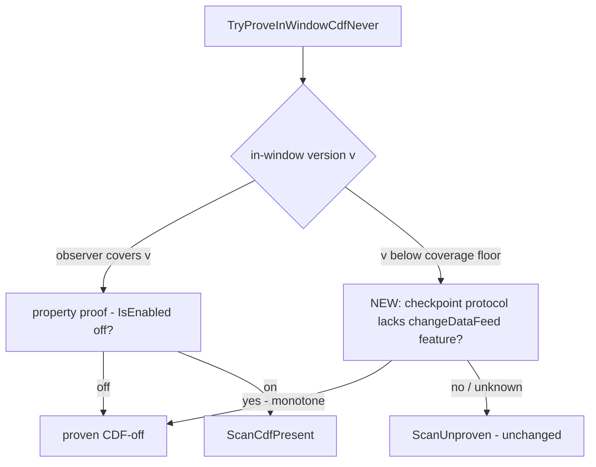

# VACUUM cdc-scan skip: prove CDF-off below the checkpoint (widen the #809 envelope)

> **Status:** Draft
> **Issue:** [#817](https://github.com/khaines/deltasharp/issues/817) — perf(vacuum): extend #712 observer
> coverage below the checkpoint to widen the #809 cdc-scan-skip benefit envelope
> **Author:** design-doc skill (orchestrated)
> **Reviewers:** delta-storage-format-engineer, cloud-native-distributed-systems-architect,
> reliability-test-chaos-engineer, cloud-native-security-sme, cloud-native-site-reliability-engineer,
> performance-benchmarking-engineer
> **Last Updated:** 2026-08-17
> **Related:** #809/#816 (log-derived cdc-scan skip), #712 (`ReplayedMetadataLog` bounded observer),
> #489/#640 (single-listing cdc protection), #641 item 2/3 (scan cost telemetry + safe skip),
> `docs/engineering/design/vacuum-cdc-scan-skip.md` (§9-Q4 — this follow-up).

---

## 1 · Overview

#809 elides VACUUM's in-window `cdc` scan when the retained **log** proves Change Data Feed was inactive
at both boundaries of every in-window commit (`DeltaVacuum.TryProveInWindowCdfNever`). The proof consults
`ReplayedMetadataLog`, whose coverage is exactly `[CoveredFromInclusive, CoveredToExclusive)` — the versions
the snapshot reconstruction actually replayed. On a **checkpoint-seeded deep-retention** table (the #641
item-2 telemetry target), the in-window range (bounded by `delta.logRetentionDuration`) extends **below the
checkpoint the replay seeded from**; those below-floor in-window commits are un-proven, so
`TryProveInWindowCdfNever` returns `ScanUnproven` and VACUUM scans every in-window commit JSON — precisely
the cost #809 wanted to elide, on exactly the tables where it is largest.

This design widens the skip envelope to those tables with a **sound, log-derived, fail-closed** proof:
when the checkpoint's baked **protocol** never carried the `changeDataFeed` **writer feature**, Delta's
**monotonic table-features** guarantee means CDF was *never active at or below the checkpoint*, so **no
`cdc` file could ever have been produced below the checkpoint** — the below-floor in-window commits are
provably CDF-off **without re-reading their JSONs**. Every other case (the feature ever present) is
**unchanged**: un-provable below the floor → scan.

**Non-goals / preserved invariants:** no change to the fail-closed posture, the single-listing invariant
(#489), or the correctness reference (the scan). This only turns some of today's `ScanUnproven` outcomes
into `Skip` when a sound monotonic proof exists; it can never turn a `Skip` into a wrong skip.

---

## 2 · Logical Architecture

### 2.1 The soundness crux — table-features monotonicity

A produced `cdc` action requires `ChangeDataFeedFeature.IsActive` = the **`changeDataFeed` writer feature
in the protocol** AND the `delta.enableChangeDataFeed` property. #809's in-coverage proof uses the
property-only `IsEnabled` (a conservative superset: property-off ⇒ no cdc). Below the coverage floor the
per-commit property history is unavailable, so #809 cannot use the property test there.

The **writer feature**, however, is **monotonic**: Delta table features are add-only — once
`changeDataFeed` is listed in the protocol it is never silently removed (a drop requires an explicit,
auditable protocol downgrade — see §9-Q1). Therefore:

> **If the checkpoint's baked protocol does not list the `changeDataFeed` writer feature, then CDF was
> never *active* at any version ≤ the checkpoint, so no `cdc`/`_change_data/` file was ever produced there.
> Every in-window commit at or below the checkpoint is provably CDF-off.**

This is a *stronger, sound* proof than the property test, and it needs only the checkpoint's baked
protocol — already reconstructed, no extra I/O.

### 2.2 Where it plugs in



The below-floor branch is added to `TryProveInWindowCdfNever`: when
`observer.TryGetProvenPrevailing(v, …)` returns false because `v < CoveredFromInclusive` (below the floor,
**not** the `#712` inert case), consult a new `observer`-carried fact — **the baked protocol at the
reconstruction floor lacked the `changeDataFeed` writer feature** — and, if so, treat `v` as proven
CDF-off. If the feature was present (CDF was enabled at some point ≤ checkpoint), or the observer is inert
(#712), or coverage is unavailable for any other reason, the outcome is **unchanged** (`ScanUnproven` /
`ScanUnprovenInert`).

### 2.3 Component boundaries

| Component | Change |
|---|---|
| `ReplayedMetadataLog` | expose a sealed, corroborated fact: `FloorProtocolLacksChangeDataFeed` (or a `TryProveBelowFloorCdfNever(version)` that encapsulates the monotone rule), derived from the **baked protocol at `CoveredFromInclusive − 1`** (the reconstruction seed). Fail-closed if the seed protocol is unknown/unsealed. |
| `DeltaVacuum.TryProveInWindowCdfNever` | on the below-floor branch, consult the new fact instead of returning `ScanUnproven` immediately; only the below-floor property-unavailable case changes. |
| `DeltaLog` reconstruction | ensure the observer is seeded with the baked **protocol** (not just metadata) at the floor so the fact is available; today it seeds prevailing metadata lineage — extend to protocol if not already carried. |

### 2.4 Data flow

```mermaid
sequenceDiagram
  participant V as DeltaVacuum
  participant O as ReplayedMetadataLog (sealed)
  V->>O: TryGetProvenPrevailing(v below floor) -> false (below coverage)
  V->>O: FloorProtocolLacksChangeDataFeed?
  O-->>V: true (baked protocol has no changeDataFeed feature) -> monotone: never active below
  V->>V: treat v as CDF-off; continue; Skip if all in-window proven
```

### 2.5 Why this cannot cause a wrong skip

- **Monotone add-only features:** `changeDataFeed` absent at the checkpoint ⇒ absent at every version below
  it (a feature present below would still be present at the checkpoint). So "absent at floor" is a sound
  witness for "never active below the floor."
- **`IsActive` requires the feature:** a `cdc` file requires the writer feature; no feature ⇒ no cdc file
  ⇒ nothing to protect. The proof is a superset of the property proof (even stronger).
- **Fail-closed everywhere else:** feature present, unknown seed protocol, unsealed/inert observer, or a
  corroboration failure → the existing scan reasons, unchanged. The scan remains the correctness reference.

---

## 3 · Functional Test Scenarios

Oracle: the widened predicate returns `Skip` **iff** it is sound; on any table where a `cdc` file exists
(or could exist) below the checkpoint, it returns a scan reason and VACUUM protects it (never deletes it).

1. **Widened Skip (the win):** checkpoint-seeded deep-retention table, CDF **never enabled** (protocol
   never carried `changeDataFeed`), in-window range extends below the checkpoint → `Skip` (was
   `ScanUnproven`); no in-window commit JSON below the floor is read; no `_change_data/` candidate deleted.
2. **Fail-closed — CDF enabled below the checkpoint then disabled before it:** protocol carries
   `changeDataFeed` at the checkpoint (feature is monotone) → below-floor proof declines → **scan**; a
   below-floor `cdc` file is protected. **The central safety scenario.**
3. **Fail-closed — CDF active *at* a below-floor in-window commit:** a `cdc` file exists below the floor →
   the feature is present at the checkpoint → scan → the file is in the protected set (not deleted).
4. **Boundary parity with #809:** an in-window commit **within** coverage still uses the property proof
   (unchanged); mixing covered + below-floor commits yields `Skip` only when **both** halves prove off.
5. **#712 inert observer** below-floor → `ScanUnprovenInert` (unchanged; the new fact is not consulted when
   inert).
6. **Seal-degrade / unknown seed protocol** → `ScanSealDegraded` / scan (fail-closed), unchanged.
7. **Telemetry:** a widened skip emits the `#809` skipped counter + EventId 4109 (not the scan histograms);
   `provenInWindowCommits` counts the below-floor commits it proved.
8. **Kill-switch:** with `cdcScanSkipEnabled` OFF, behavior is byte-for-byte today's unconditional scan.

The #816/#809 model-replay + tamper oracles extend: a **forged** checkpoint protocol that drops
`changeDataFeed` while a below-floor commit produced a `cdc` file must **fail closed** (the tamper surface —
see §6).

---

## 4 · Performance

- **Win:** eliminates O(in-window-below-floor) commit-JSON GETs on the exact tables where the scan is most
  expensive (deep `logRetentionDuration`), for the common never-enabled-CDF table. The proof is O(1) over
  the already-reconstructed baked protocol — no extra I/O.
- **No regression:** the added below-floor branch is a couple of comparisons per below-floor version; on
  tables that don't qualify it degrades to the same scan as today.
- **Gate:** a benchmark on a checkpoint-seeded deep-retention non-CDF table shows the scan GET count drop to
  zero for the below-floor range; a CDF-enabled table shows the scan unchanged.

---

## 5 · Security

- **Data-safety crux:** this optimization sits on a **data-loss-critical** path — a wrong skip deletes a
  live `_change_data/` file. The proof must be **sound** (monotone feature witness) and **fail-closed** on
  every uncertainty. The property proof is already conservative; the feature proof is a strict superset.
- **Attacker-influenced input:** the checkpoint protocol/metadata are attacker-influenceable (a forged
  table). A forged checkpoint that **omits** `changeDataFeed` while below-floor `cdc` files exist would, if
  trusted naively, cause a wrong skip. Mitigation: the below-floor proof is only ever a *superset* of the
  scan's protection **iff** the monotonicity assumption holds; §6 pins the forged-downgrade threat and the
  corroboration that backstops it (the observer's seal-time lineage cross-check, reused).

---

## 6 · Threat Model

| STRIDE | Surface | Threat | Mitigation |
|---|---|---|---|
| **Tampering** | forged checkpoint protocol | drop `changeDataFeed` from the baked protocol while a below-floor `cdc` file exists → wrong skip → data loss | the below-floor witness requires the **sealed, corroborated** floor protocol; a lineage that cannot be accounted for → `ScanSealDegraded` (fail-closed). Extend the #816 tamper oracle: forged protocol-drop with a live below-floor cdc file → scan. |
| **Spoofing** | property vs feature | rely on the property (mutable) below floor | use the **feature** (monotone), never the property, below the floor. |
| **DoS** | none new | — | O(1) proof; no new I/O. |

**Residual:** a store that lets a writer both forge a downgraded checkpoint protocol AND retain a
below-floor cdc file is the same catastrophic forgery class the #809/#640 red-team already treats as
fail-closed via seal-degrade; no new residual beyond that.

---

## 7 · Observability

- Reuse #809's telemetry: a widened skip increments `deltasharp.delta.vacuum.cdc_scan.skipped` (EventId
  4109) with `provenInWindowCommits` now including the below-floor commits proved. No new instrument.
- The distinct `CdcScanDecision` reasons (`ScanUnproven` vs the new proven path) remain visible so an
  operator can see the envelope widened.

---

## 8 · Rollout & Risk

- Behind the existing `cdcScanSkipEnabled` kill-switch (default OFF; #818 handles promotion). This change
  only enlarges the set of `Skip` outcomes when the kill-switch is on.
- **Risk:** an unsound below-floor proof → wrong skip → data loss. Mitigated by the monotone-feature
  argument (§2.5), fail-closed defaults, the §3.2/§3.3 safety scenarios, and the §6 tamper oracle. The
  scan remains the correctness reference; #818's shadow stage will additionally validate the widened
  predicate against the authoritative scan before default-on.
- **Kill-switch:** OFF = today's unconditional scan, unchanged.

---

## 9 · Open Questions & Decisions

1. **Is `changeDataFeed` truly non-removable in this build's protocol model?** The soundness rests on
   monotone add-only writer features. Confirm DeltaSharp's protocol reconstruction never drops a writer
   feature (or, if a downgrade path exists, that the below-floor proof declines when a downgrade is
   observed). **This is the load-bearing assumption — must be pinned before PASS.** (Route to
   `delta-storage-format-engineer`.)
2. **Does the reconstruction seed the observer with the baked *protocol* (not just metadata) at the
   floor?** If not, extend the seed. Decide the minimal carrier (a single bool
   `FloorProtocolLacksChangeDataFeed` vs the full protocol).
3. **Property-vs-feature parity in-coverage:** should the in-coverage path *also* short-circuit on
   feature-absent for uniformity? Proposed: keep #809's in-coverage property proof unchanged; only add the
   below-floor feature branch.

---

## 10 · References

- Issue [#817](https://github.com/khaines/deltasharp/issues/817); design `docs/engineering/design/vacuum-cdc-scan-skip.md` §9-Q4.
- Code anchors: `DeltaVacuum.TryProveInWindowCdfNever` / `CdcScanDecision` (`src/DeltaSharp.Storage/Delta/DeltaVacuum.cs`);
  `ReplayedMetadataLog` coverage `[CoveredFromInclusive, CoveredToExclusive)` + `_lineageAtWindowStart` +
  `Seal` (`src/DeltaSharp.Storage/Delta/ReplayedMetadataLog.cs`); `ChangeDataFeedFeature.IsActive`/`IsEnabled`.
- Related: #809/#816 (skip), #712 (observer), #489/#640 (single-listing), #641 (telemetry/safe-skip).
