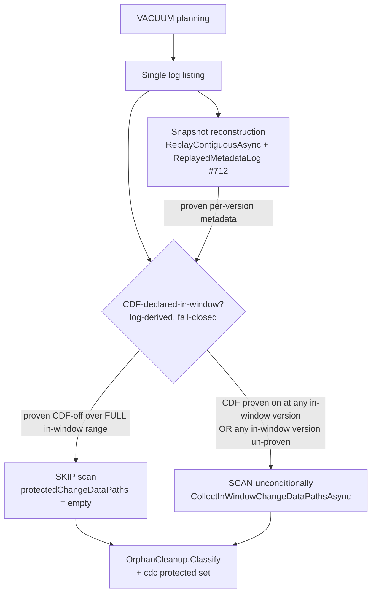
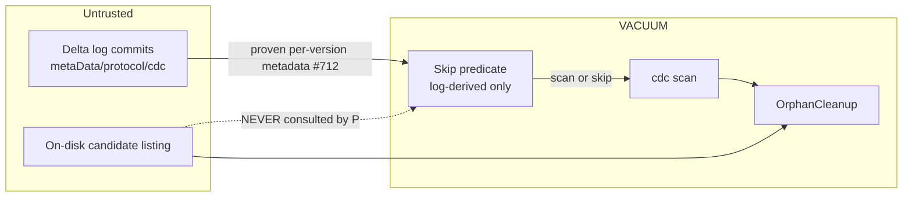

# VACUUM in-window CDC-scan skip (log-derived, fail-closed)

> **Status:** Draft
> **Issue:** [#809](https://github.com/khaines/deltasharp/issues/809) — perf(vacuum): safe log-derived skip of the in-window cdc scan when CDF was never declared (#641 item 3)
> **Author:** design-doc skill (orchestrated)
> **Reviewers:** cloud-native-distributed-systems-architect, cloud-native-security-sme, cloud-native-site-reliability-engineer, performance-benchmarking-engineer, delta-storage-format-engineer, reliability-test-chaos-engineer
> **Last Updated:** 2026-08-14
> **Related:** #641 (items 1/2/4 delivered in #640/#800), #489 (cdc protection), #712 (`ReplayedMetadataLog` bounded pre-range gate), PR #640 R3 red-team (safety constraint)

---

## 1 · Overview

VACUUM must not reclaim a Change-Data-Feed (`_change_data/`) file that is still referenced by a retained,
in-window `cdc` action. Because a `cdc` action is ignored by snapshot replay (INV C1) and is not carried in
checkpoints, the loaded snapshot cannot know cdc paths; VACUUM therefore performs an **in-window cdc scan** —
reading **every** in-window commit JSON (bounded by `delta.logRetentionDuration`) to collect
`AddCdcFileAction` paths into an additional protected set passed to `OrphanCleanup` (#489). That scan's cost
grows with retention depth (now observable via the #641 item-2 telemetry: `deltasharp.delta.vacuum.cdc_scan.commits`
/ `.duration`).

When the retained protocol/metadata history **never declared Change Data Feed over the full in-window range**,
no `cdc` action can exist in-window, so the scan is provably unnecessary. This design adds a **safe, log-derived,
fail-closed skip** of the in-window cdc scan for that case. It is a **pure cost optimization** layered over an
already fail-closed, single-listing, tail-guarded scan; scanning unconditionally remains the correctness
reference.

**Requirements traceability:** #809 acceptance criteria (§3.5). Honors the PR #640 R3 red-team **hard safety
constraint** (§5): the skip predicate is derived **solely from the log**, never from the candidate listing and
never from the current-snapshot enablement flag.

**Non-goals:** changing the protection set of any CDF-bearing table; changing the scan itself; skipping based
on candidate paths or the snapshot's current CDF flag; reclaiming cdc files referenced by commits aged past
log retention (already correctly reclaimable).

---

## 2 · Logical architecture

### 2.1 Where the skip sits

### 2.2 The predicate (the crux)

The scan is skipped **iff the log PROVES that Change Data Feed was disabled at every in-window commit
version**. "Proves" and "in-window" are both computed from the log the snapshot was built on:

- **In-window version range.** The set of commit versions whose commit-file mtime is `>= logRetentionCutoff`
  (the same `logRetentionCutoffMillis` the scan uses), taken from the **single** `logListing` the snapshot
  reconstruction already used — so the skip decision can never diverge from, or be staler than, the listing
  the protection set would have been built on.
- **Per-version proven metadata.** The snapshot reconstruction already reports every replayed commit to a
  `ReplayedMetadataLog` (#712). For a version `v`, `TryGetProvenObservation(v)` returns the metadata **proven
  from the log** at `v`, or reports it **un-proven** when `v` is outside the observer's contiguous coverage
  `[CoveredFromInclusive, CoveredToExclusive)` or when the observer went **inert** past
  `MaxRetainedObservations` (4096) — a fail-closed, defence-in-depth `!HasCoverage` guard.
- **CDF-declared at `v`.** The proven metadata's `configuration["delta.enableChangeDataFeed"] == "true"`
  (case-insensitive per Delta), evaluated on the **prevailing** metadata at `v` (so a version that inherits an
  earlier enablement is correctly treated as CDF-on even if it carries no `metaData` of its own).

Decision:

| Condition over the FULL in-window version range | Action |
|---|---|
| Every in-window version is **proven CDF-off** | **SKIP** (empty cdc protected set) |
| Any in-window version is **proven CDF-on** | SCAN (a cdc file may exist) |
| Any in-window version is **un-proven** (outside coverage / observer inert) | **SCAN (fail-closed)** |

The third row is the safety keystone: if the log cannot *prove* the full in-window range was CDF-off, we do
not guess — we scan. This makes the skip a strict refinement: it only ever elides work the log has already
proven redundant.

### 2.3 Why this is safe where a cheaper predicate is not

A `cdc` file exists in-window only if CDF was enabled **at the version that wrote it**. The predicate is
therefore evaluated per-version over the whole in-window range — so it correctly handles **enable-then-disable
within the window** (the version where CDF was on is proven-on → SCAN), which the current-snapshot flag would
miss. It never consults candidate paths, so it cannot be defeated by a double-encoded / non-canonical cdc path
(`_change_data%252F…`) that `OrphanCleanup` would protect but a prefix predicate would skip (→ data loss). See
§6 for the full STRIDE analysis.

### 2.4 Coverage & cost model

`ReplayedMetadataLog` is populated **for free** during the snapshot reconstruction that VACUUM already
performs; the skip check adds **no I/O** — it is `O(in-window versions)` in-memory metadata lookups. When the
in-window range falls **within** the observer's coverage (e.g. a full-JSON-replay reconstruction, or a
retention window at/above the reconstruction's replay start) and CDF was never enabled, the skip elides the
`O(in-window commits)` commit-JSON re-read entirely. When the window extends **below** the observer's coverage,
or the observer went inert (deep post-checkpoint histories `> 4096` commits, #712), the predicate is un-proven
and VACUUM scans — always safe, never a regression beyond today's behavior.

### 2.5 Component boundaries

| Component | Responsibility | Change |
|---|---|---|
| `DeltaVacuum` | Orchestrate protection; call the skip predicate; scan or skip | Add the gated skip around `CollectInWindowChangeDataPathsAsync` |
| `DeltaLog` / `ReplayedMetadataLog` (#712) | Provide proven per-version metadata over the reconstruction | Expose the observer (or a thin `CdfDeclaredInWindow(logListing, cutoff)` query) to VACUUM |
| `OrphanCleanup` | Consume the cdc protected set | **Unchanged** (empty set on skip is identical to "no in-window cdc") |
| Telemetry (#641 item 2) | `cdc_scan.commits`/`.duration`, `VacuumCdcScanCompleted` | Emit a **skipped** signal (§7) so a skip is observable, not silent |

### 2.6 API surface

Internal only. A new internal query (name TBD, e.g. `DeltaLog.TryProveNoCdfInWindow(LogListing, long cutoffMillis, out int provenVersions)`) returns a tri-state: **proven-none** (skip), **proven-some / un-proven** (scan). No public API change.

---

## 3 · Functional test scenarios & correctness oracles

### 3.1 Happy path
- **Never-CDF, window within coverage → SKIP.** A table that never enabled CDF, reconstructed so the observer
  covers the in-window range: assert `CollectInWindowChangeDataPathsAsync` is **not** called (spy/telemetry),
  the deletion set equals the unconditional-scan baseline, and the skipped signal is emitted.

### 3.2 Safety edge cases (must scan)
- **Enable-then-disable within window → SCAN + protection preserved (AC-1).** CDF enabled at `vₐ`, a delete at
  `vₐ` writes a cdc file, CDF disabled at `v_b > vₐ`, both in-window: assert the scan runs and the cdc file is
  protected (co-extensive with unconditional scan).
- **Un-proven in-window version → SCAN (fail-closed).** Window extends below `CoveredFromInclusive`, or the
  observer is inert (`> 4096` commits, #712): assert the scan runs even though the *snapshot* flag is CDF-off.
- **Double-encoded / non-canonical cdc candidate → never deleted (AC-2).** A `cdc` action with a
  `_change_data%252F…` / non-`_change_data/` path in-window: assert the candidate is protected whether or not
  the scan is skipped — i.e. the skip only fires when the log proves *no* in-window cdc, so this table's
  in-window versions are proven-on (or un-proven) → scan → protected.

### 3.3 Coverage-neutrality (AC-5)
- **Differential oracle:** for a corpus of CDF-bearing tables (enabled throughout, enabled-late, toggled,
  deep-retention), the protected `_change_data/` set and the final deletion set are **identical** with the skip
  enabled vs. a forced-unconditional-scan control. Pin as a property test.

### 3.4 Determinism
- The predicate is a pure function of the log listing + proven metadata (no wall-clock, no candidate listing);
  same inputs → same decision. No timing/flakiness.

### 3.5 Acceptance-criteria mapping

| #809 AC | Scenario |
|---|---|
| Skip gated solely on log-derived protocol history over the full in-window range | §2.2 predicate; §3.2 un-proven→scan |
| Enabled-then-disabled within window is still scanned | §3.2 (AC-1) |
| Double-encoded/non-canonical cdc candidate never deleted | §3.2 (AC-2) |
| Measured scan-cost reduction on deep-retention never-CDF table | §4 benchmark; §3.1 |
| No change to protected `_change_data/` paths on any CDF-bearing table | §3.3 (AC-5) differential oracle |

---

## 4 · Performance

- **Workload profile.** VACUUM on a deep-`logRetentionDuration` table. Today: `O(in-window commits)` commit-JSON
  reads to build the (often empty) cdc protection set.
- **Target.** For a never-CDF table whose in-window range is within observer coverage: **zero** commit-JSON
  reads for cdc protection (the scan is elided), reducing `cdc_scan.commits` to 0 and `cdc_scan.duration` to
  ~0. The predicate itself is `O(in-window versions)` dictionary lookups against already-resident observations
  — no allocation beyond the version enumeration, no I/O.
- **No regression.** When the predicate is un-proven, cost equals today's scan plus one `O(in-window versions)`
  in-memory pass (negligible vs. commit-JSON I/O).
- **Benchmark methodology.** BenchmarkDotNet / harness VACUUM over synthetic tables at retention depths (e.g.
  1k/4k/16k in-window commits), never-CDF vs. CDF-bearing, measuring `cdc_scan.commits`/`.duration` and total
  VACUUM wall-clock. **Regression gate:** never-CDF-in-coverage VACUUM must show `cdc_scan.commits == 0`;
  CDF-bearing VACUUM cost unchanged within noise.
- **Memory.** The 4096-entry `ReplayedMetadataLog` cap (#712) bounds observation retention; the predicate adds
  no retained state.

---

## 5 · Security

- **Data classification.** cdc `_change_data/` files contain **tenant row data** (Restricted). Erroneously
  reclaiming one is **irreversible data loss** — the highest-severity failure mode for this component.
- **Input validation.** The predicate consumes only the log the snapshot was built on (proven metadata +
  commit-file mtimes from the single listing). It **never** reads or trusts the candidate listing, and **never**
  reads the current-snapshot enablement flag — the two unsafe sources the PR #640 R3 red-team called out.
- **Fail-closed default.** Any uncertainty (un-proven version, inert observer, absent coverage) resolves to
  **scan**. The optimization can only ever elide work the log has proven redundant; it can never enlarge the
  reclaimable set beyond the unconditional scan.
- **Tenant isolation / secrets.** No new object-store credentials, paths, or cross-tenant surface; the change is
  a control-flow gate inside an existing single-tenant VACUUM operation. No message emits a candidate path.

---

## 6 · Threat model

**Trust boundary:** the skip predicate trusts **only** the reconstruction's proven metadata lineage
(`ReplayedMetadataLog`), which is itself derived from — and fail-closed against — the log. The candidate listing
is explicitly outside the predicate's trust boundary.

| STRIDE | Threat | Mitigation | Residual |
|---|---|---|---|
| **Tampering / Info-disclosure→Data-loss** | A crafted cdc path (double-encoded, non-`_change_data/`) is protected-if-scanned but skipped by a naive prefix predicate → deleted | Predicate is **not** path-based; it gates on proven CDF-off over the full in-window range. Such a table has an in-window CDF-on (or un-proven) version → scan → protected | None (predicate is co-extensive-or-conservative by construction) |
| **Spoofing (stale enablement)** | CDF enabled-then-disabled; snapshot flag reads off | Per-version proven metadata over the full range catches the on-version → scan | None |
| **Elevation (coverage gap)** | Window extends below observer coverage; sub-coverage enable is invisible | Un-proven → fail-closed **scan** | None (conservative) |
| **DoS (observer inert)** | `> 4096` in-window commits make the observer inert (#712) | Inert → un-proven → scan (today's behavior); no worse than status quo | Accepted (deep histories still scan; the #712 bound is intentional) |
| **Repudiation** | A skip is silent; an operator cannot audit why the scan was elided | Emit a distinct **skipped** telemetry signal + log (§7) recording the proven-none decision | None |

---

## 7 · Observability

- **Metrics.** Reuse the #641 item-2 instruments. On skip, emit `cdc_scan.commits = 0` with a bounded
  `skipped=true` (or a distinct `deltasharp.delta.vacuum.cdc_scan.skipped` counter) so a skip is
  **distinguishable** from a zero-commit scan, and `duration ≈ 0`.
- **Logs.** A distinct Information log (e.g. `DeltaVacuumCdcScanSkipped`, new EventId in the 41xx VACUUM range)
  rendering only the bounded proven-version count and the in-window range size — no paths, no tenant tokens
  (mirrors the existing VACUUM log-site hygiene / `StorageLogSiteSignatures` roster).
- **Correlation.** Stamp the same vacuum `activity`/operation scope the scan telemetry uses, so a skip and a
  scan sit on the same VACUUM trace.
- **Dashboards / alerting.** No new alert; the existing `cdc_scan.duration` panel simply shows 0 on skipped
  runs. An unexpectedly *high* scan cost on a known-never-CDF table (i.e. skip not firing due to coverage) is a
  tuning signal, not an incident.

---

## 8 · Rollout & risk

- **Rollout.** Pure internal optimization; no CRD/operator/API change. Ship behind the existing VACUUM path.
- **Feature gate (optional).** A config/kill-switch to force unconditional scan (revert to today's behavior)
  de-risks the first release and gives an operator an escape hatch; the unconditional scan remains the
  correctness reference.
- **Rollback.** Trivially revertible (the gate falls back to the always-correct scan). No data/metadata
  migration; no persisted state changes.
- **Risk register.** Top risk = a predicate bug that skips when it should scan (data loss). Mitigations: the
  differential coverage-neutrality oracle (§3.3) run in CI over a table corpus; fail-closed default; and the
  kill-switch. Severity is why this is a design-doc-first, threat-modeled change despite being "optional."
- **Launch checklist.** Coverage-neutrality property test green over the corpus; enable-then-disable and
  un-proven→scan tests green; benchmark shows `cdc_scan.commits == 0` on never-CDF-in-coverage; skipped
  telemetry/log wired and roster-registered; VACUUM log-site hygiene guard passes.

---

## 9 · Open questions & decisions

1. **Plumbing.** Does VACUUM already hold the snapshot's `ReplayedMetadataLog`, or should `DeltaLog` expose a
   dedicated `TryProveNoCdfInWindow(logListing, cutoffMillis)` query (preferred — keeps the coverage/fail-closed
   logic in one place next to #712)?
2. **In-window boundary alignment.** Confirm the scan's in-window commit set is derived from the same
   `logListing` + `logRetentionCutoffMillis`, so the predicate's version range is *identical* to the scan's
   (any drift must fail-closed to scan).
3. **`protocol` writer-feature signal.** Should the predicate also treat a `changeDataFeed` writer feature in a
   proven `protocol` action as "CDF declared" (belt-and-suspenders alongside the metadata flag), or is the
   `delta.enableChangeDataFeed` configuration flag authoritative for cdc-file production in DeltaSharp today?
   (Resolve against the write door's actual cdc-emission gate.)
4. **Measured benefit scope.** The saving materializes when the in-window range is within observer coverage.
   Quantify how often real deep-retention never-CDF tables satisfy that (checkpoint cadence vs. retention), and
   whether extending coverage is worthwhile (out of scope here; noted for a follow-up).

---

## 10 · References

- Issue [#809](https://github.com/khaines/deltasharp/issues/809); [#641](https://github.com/khaines/deltasharp/issues/641) item 3; [#489](https://github.com/khaines/deltasharp/issues/489); [#712](https://github.com/khaines/deltasharp/issues/712).
- `src/DeltaSharp.Storage/Delta/DeltaVacuum.cs` (in-window cdc scan + the in-source #641-item-3 rationale).
- `src/DeltaSharp.Storage/Delta/ReplayedMetadataLog.cs` (bounded, fail-closed proven-metadata observer, #712).
- `src/DeltaSharp.Storage/Delta/OrphanCleanup.cs` (cdc protected-set consumption; encoding-robust matching #490).
- `docs/engineering/design/storage-delta-architecture.md` (§2 VACUUM / cdc protection), `change-data-feed.md`, `observability-conventions.md`.
- PR #640 R3 red-team (hard safety constraint); #800 (Stage E: #641 items 2 & 4).
