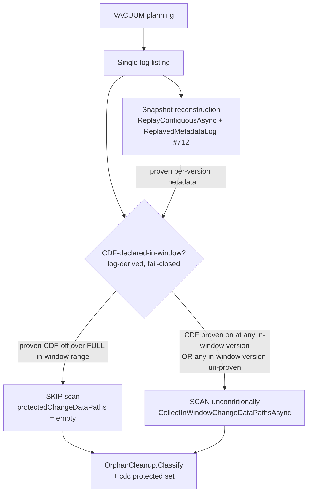
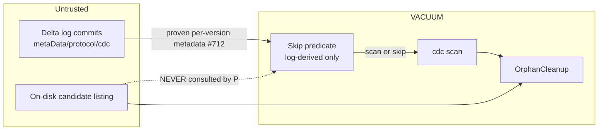

# VACUUM in-window CDC-scan skip (log-derived, fail-closed)

> **Status:** Draft
> **Issue:** [#809](https://github.com/khaines/deltasharp/issues/809) — perf(vacuum): safe log-derived skip of the in-window cdc scan when CDF was never declared (#641 item 3)
> **Author:** design-doc skill (orchestrated)
> **Reviewers:** cloud-native-distributed-systems-architect, cloud-native-security-sme, cloud-native-site-reliability-engineer, performance-benchmarking-engineer, delta-storage-format-engineer, reliability-test-chaos-engineer
> **Last Updated:** 2026-08-14
> **Related:** #641 (items 1/2/4 delivered in #640/#800), #489 (cdc protection), #712 (`ReplayedMetadataLog` bounded pre-range gate), PR #640 R3 red-team (safety constraint)

---

## 1 · Overview

VACUUM must not reclaim a Change-Data-Feed (`_change_data/`) file that is still referenced by a retained,
in-window `cdc` action. Because a `cdc` action is ignored by snapshot replay (INV C1) and is not carried in
checkpoints, the loaded snapshot cannot know cdc paths; VACUUM therefore performs an **in-window cdc scan** —
reading **every** in-window commit JSON (bounded by `delta.logRetentionDuration`) to collect
`AddCdcFileAction` paths into an additional protected set passed to `OrphanCleanup` (#489). That scan's cost
grows with retention depth (now observable via the #641 item-2 telemetry: `deltasharp.delta.vacuum.cdc_scan.commits`
/ `.duration`).

When the retained protocol/metadata history **never declared Change Data Feed over the full in-window range**,
no `cdc` action can exist in-window, so the scan is provably unnecessary. This design adds a **safe, log-derived,
fail-closed skip** of the in-window cdc scan for that case. It is a **pure cost optimization** layered over an
already fail-closed, single-listing, tail-guarded scan; the unconditional scan **remains the correctness
reference for spec-conforming logs** — and, because the skip degrades to that scan on every uncertainty
(un-proven coverage, inert observer, seal failure), it can never enlarge the reclaimable set beyond it.

**Requirements traceability:** #809 acceptance criteria (§3.5). Honors the PR #640 R3 red-team **hard safety
constraint** (§5): the skip predicate is derived **solely from the log**, never from the candidate listing and
never from the current-snapshot enablement flag.

**Non-goals:** changing the protection set of any CDF-bearing table; changing the scan itself; skipping based
on candidate paths or the snapshot's current CDF flag; reclaiming cdc files referenced by commits aged past
log retention (already correctly reclaimable).

---

## 2 · Logical architecture

### 2.1 Where the skip sits

### 2.2 The predicate (the crux)

The scan is skipped **iff the log PROVES that Change Data Feed was inactive across every in-window commit —
at *both* boundaries of each commit and over the whole in-window version set**. Three subtleties, each a
data-loss trap if mishandled, shape the exact predicate (all surfaced by the design red-team + storage review
and pinned as required tests in §3):

**(a) In-window version set — use the scan's EXACT complement, keyed on the scan's OWN cutoff.** The scan
(`CollectInWindowChangeDataPathsAsync`) reads commit `v` unless `v`'s mtime is *known* AND `< cutoff`, where
`cutoff` is the **`logRetentionCutoffMillis`** derived from `delta.logRetentionDuration` (`DeltaVacuum.cs` —
NOT the vacuum-retention `cutoffMillis` used for the orphan-classify decision; the two are distinct and a
predicate keyed on the wrong one silently shifts the in-window set). A commit with an **unknown/missing
timestamp is treated as in-window** (documented fail-safe — a stale listing that drops a timestamp must not
drop protection). The predicate therefore iterates the **identical set** — same `logListing`, same
`logRetentionCutoffMillis` — `{ v ∈ listing.Commits : NOT (mtime(v) known AND mtime(v) < cutoff) }`, so
unknown-mtime commits are **in-window for the predicate too**. A `>= cutoff` phrasing (which *excludes*
unknown-mtime) would let a
version the scan protects fall outside the predicate → data loss. The predicate's set must be a
**superset-or-equal** of the scan's.

**(b) PREVAILING enablement — a DERIVE-prevailing accessor over a SPARSE observer, both boundaries.** CDF-active
is a *stateful* property: a version with no `metaData` inherits the prevailing state, and a single commit may
**transition** CDF while still carrying `cdc`. So a version `v` is treated as **CDF-declared** if CDF was active
in **either** its `prevailingBefore` **or** its `prevailingAfter` state — never the version's own carried
`metaData` (empty for an inheriting version → scoring a CDF-on inheritor off → data loss).

> **Critical implementation constraint (do NOT "just read the stored pair").** `ReplayedMetadataLog._recorded`
> is a **sparse** map: `Record` stores an `ObservedCommit` only when `metadata.Count > 0` OR the prevailing state
> changed. An **inheriting** version (no `metaData`, state unchanged) is **covered but has no stored pair** — the
> entire never-CDF happy path *and* the inherited-CDF-ON trap. An extension that surfaces the stored pair *only
> when present* would return empty for an inherited-CDF-ON version → `IsEnabled(empty)==false` → SKIP → data
> loss (the very trap this rule closes). The extension MUST therefore expose a **derive-prevailing** accessor
> that returns the prevailing metadata for **any covered version**, computed as the step function that starts at
> the proven lineage entering coverage (`_lineageAtWindowStart`) and changes only at recorded `metaData`
> boundaries (constant across runs of unrecorded versions).
>
> **Equivalent, cleaner reformulation (recommended).** SKIP iff **(i)** the state *entering the in-window low
> end* is CDF-off — the applied config of the last recorded `metaData` at/below `lo`, or `_lineageAtWindowStart`,
> with a null/absent prevailing treated as **off only when the low end is itself proven** (else un-proven →
> SCAN) — **AND (ii)** every recorded `metaData` in `[lo, hi]` has `IsEnabled` false at **both** its
> `prevailingBefore` and its applied config. This is co-extensive with the per-version "either boundary" rule on
> the transitioning-commit, inherited-on, and aged-out-enabler cases, and is safe **by construction** (not only
> by test) for the sparse/unrecorded population.

> **Why both-boundaries is COMPLETE (no hidden intra-commit transition).** A commit could in principle carry
> `metaData(on)` + `cdc` + `metaData(off)` — momentarily CDF-on with both boundaries reading off, which
> before/after alone would miss. This is **unreachable** in DeltaSharp: `DeltaLogActionReader.ParseCommit`
> **fail-closes on any commit with more than one `metaData` action** ("a commit must declare at most one"), and
> the snapshot reconstruction that populates the observer parses through that same guard — so a multi-`metaData`
> commit throws during the snapshot load, **before** VACUUM ever runs. With ≤1 `metaData` per commit, CDF
> changes **at most once** per commit, and `prevailingBefore`/`prevailingAfter` capture every state the commit
> was in. (The predicate additionally treats any commit whose proven observation is not single-metaData-clean
> as un-proven → SCAN, as a defence-in-depth belt against a future aggregation path that bypasses the per-commit
> guard, e.g. a log-compaction range — see §9 Q1.)

**(c) "Proven" over the FULL range — fail-closed on any gap.** For every in-window version, the prevailing
pair must be **proven from the log**. `ReplayedMetadataLog.TryGetProvenObservation` proves a version only inside
its contiguous coverage `[CoveredFromInclusive, CoveredToExclusive)` (and the observer is fail-closed inert
past `MaxRetainedObservations`, #712). The coverage is seeded from the reconstruction's replay floor (the
**latest checkpoint + 1**, see §2.4) plus the proven lineage *entering* coverage, so the prevailing state at
the window's low end must itself be proven. Any in-window version whose prevailing pair is **not proven**
(below coverage, or observer inert) makes the decision **un-proven → SCAN**.

**CDF-active, not the raw property flag.** The write door gates cdc production on
`ChangeDataFeedFeature.IsActive` = (`changeDataFeed` writer feature in `protocol.WriterFeatures`) **AND**
`delta.enableChangeDataFeed=true` (`ChangeDataFeedFeature.cs`). Since cdc-produced ⟹ `IsActive` ⟹
property==true, proving the **property** off is a *conservative superset* proof that no cdc was produced —
so the predicate reuses `ChangeDataFeedFeature.IsEnabled(config)` on the proven prevailing metadata
(property-only), which can only ever cause an *unnecessary* scan, never a wrong skip (§9 Q3 resolved). The
observer records only `MetadataAction`s (it discards `protocol` actions), so a writer-feature check is neither
available there nor needed given the direction-of-safety.

Decision:

| Condition over the FULL in-window version set (scan's exact complement) | Action |
|---|---|
| Every in-window version proves **CDF property off in BOTH `prevailingBefore` and `prevailingAfter`** | **SKIP** (empty cdc protected set) |
| Any in-window version proves the property **on at either boundary** | SCAN (a cdc file may exist) |
| Any in-window version's prevailing pair is **un-proven** (below coverage / observer inert / unknown-mtime not covered) | **SCAN (fail-closed)** |

The last two rows are the safety keystone: the skip only ever elides work the log has *proven* redundant at
both commit boundaries over the exact set the scan would read.

### 2.3 Why this is safe where a cheaper predicate is not

A `cdc` file exists in-window only if CDF was enabled **at the version that wrote it**. The predicate is
therefore evaluated per-version over the whole in-window range — so it correctly handles **enable-then-disable
within the window** (the version where CDF was on is proven-on → SCAN), which the current-snapshot flag would
miss. It never consults candidate paths, so it cannot be defeated by a double-encoded / non-canonical cdc path
(`_change_data%252F…`) that `OrphanCleanup` would protect but a prefix predicate would skip (→ data loss). See
§6 for the full STRIDE analysis.

### 2.4 Coverage, cost model & benefit envelope (honest)

`ReplayedMetadataLog` observes the reconstruction's **replayed** commits, which are seeded from the **latest
checkpoint + 1** (`replayStart = checkpointVersion + 1`). So the proven coverage is the **post-checkpoint tail**
`[latestCheckpoint+1, latest]`, extended downward only by the proven lineage entering it — **not** the whole
history. Consequences:

- **Benefit envelope (corrected).** The skip fires only when the **entire in-window set is within coverage** —
  i.e. (a) the reconstruction did a **full JSON replay** (no usable checkpoint ≤ target: checkpoint-less,
  small, or log-cleaned tables), or (b) the retention window sits **entirely above the latest checkpoint**
  (the scan was already cheap). For a **checkpoint-seeded deep-retention** table — precisely the case the #641
  item-2 telemetry flags as expensive — the in-window range extends far **below** the checkpoint seed, is
  un-proven, and VACUUM **scans**. The optimization therefore saves the in-window commit-JSON **re-read on
  full-replay reconstructions**; it does **not** shrink the scan on checkpoint-seeded deep-retention tables.
  §4's targets are stated against this real envelope, not the misleading "deep-retention" headline.
- **The limiter is the checkpoint seed floor, not the #712 inert cap.** A never-CDF, metadata-stable table
  records almost nothing in the observer (an entry is retained only when a `metaData` is present or lineage
  moves), so it essentially never goes inert regardless of commit count. The binding limit on coverage is the
  replay floor.
- **Zero added I/O.** When the observer is piggybacked on VACUUM's existing reconstruction (§2.5), the predicate
  is `O(in-window versions)` in-memory prevailing-pair lookups; on a proven skip it elides the
  `O(in-window commits)` JSON re-read. When un-proven, cost = today's scan + one in-memory pass (negligible).

### 2.5 Component boundaries & plumbing

VACUUM currently reconstructs via a code path that passes a **null** metadata observer (the observer is only
populated for the CDF read-door start-snapshot today). To use it, VACUUM must **piggyback an observer on its
existing reconstruction** — an overload that returns the **UNSEALED** `ReplayedMetadataLog` alongside the
snapshot — **never a second reconstruction** (which would re-pay the seed+replay cost and defeat the
optimization).

**Seal in the predicate, degrade to scan — preserving the "pure optimization" invariant.** Sealing an observer
runs `EnsureLineageIsAccountedFor`, which can throw `DeltaProtocolException` on an unaccountable lineage.
Sealing *inside the reconstruction overload* would turn a currently-succeeding VACUUM into a hard failure — a
new failure surface that would contradict §1/§8's "pure cost optimization / the scan remains the correctness
reference." So the reconstruction overload stays a **pure producer that returns the unsealed observer**
(byte-identical reconstruction, **zero** new failure surface), mirroring the existing CDF-door boundary
(reconstruct → seal in the *consumer*). VACUUM then performs `Seal()` + the skip query **inside its own
predicate step, wrapped in a `try/catch`** that maps a `DeltaProtocolException` (unsealed/unaccountable
lineage) to a **fail-closed SCAN** — not a thrown VACUUM. For VACUUM the correctness reference *is* the
observer-free scan, so degrading a lineage-accounting failure to scan is safe (unlike the CDF read door, where
failing to an error is correct). This eliminates the availability regression and keeps the optimization purely
optional (a kill-switch that reverts to the null-observer reconstruction bypasses seal entirely — §8).

| Component | Responsibility | Change |
|---|---|---|
| `DeltaVacuum` | Orchestrate protection; `Seal()` + skip predicate in a try/catch (→ fail-closed SCAN); scan or skip | Add the gated skip; consume the piggybacked **unsealed** observer |
| `DeltaLog` | Reconstruct the snapshot | Add an overload that returns the **unsealed** `ReplayedMetadataLog` from VACUUM's *existing* reconstruction (pure producer, no new throw) |
| `ReplayedMetadataLog` (#712) | Prove metadata | Add a **derive-prevailing accessor** (§2.2(b)) — the `_recorded` map is SPARSE (no entry for an inheriting version), so the accessor returns the prevailing state for **any covered version** as the step function seeded at `_lineageAtWindowStart` and advanced by recorded transitions — never a bare stored-pair lookup |
| `ChangeDataFeedFeature` | Enablement predicate | Reuse `IsEnabled(config)` (single-source with the write door) |
| `OrphanCleanup` | Consume the cdc protected set | **Unchanged** (empty set on skip is identical to "no in-window cdc") |
| Telemetry (#641 item 2) | scan cost + `VacuumCdcScanCompleted` | Emit a distinct **skipped** counter with a bounded scan-reason label (§7); do NOT pollute the scan histograms on skip |

### 2.6 API surface

Internal only. A `DeltaLog` reconstruction overload returning `(snapshot, unsealed ReplayedMetadataLog)`, plus a
skip query that returns a **tri-state** — `skip` (proven-none), `scan_cdf_present` (proven-on), or
`scan_unproven` (coverage gap / inert / seal-degraded). The tri-state is **preserved through to telemetry**
(§7 scan-reason label) — collapsing it to binary at the API would discard exactly the distinction an operator
needs to see *why* a scan was not elided (a coverage regression vs. genuinely-active CDF). No public API change.

---

## 3 · Functional test scenarios & correctness oracles

### 3.1 Happy path (skip fires, non-vacuously)
- **Never-CDF, window within coverage → SKIP.** A table that never enabled CDF, reconstructed so the observer
  covers the in-window range, **with actual reclaimable orphans present**: assert
  `CollectInWindowChangeDataPathsAsync` is **not** called (spy), the deletion set is **non-empty** and equals
  the unconditional-scan baseline (co-extensiveness proven on a non-empty set, not vacuously), and the
  `skipped` counter is emitted with reason `skip`.

### 3.2 Safety edge cases (must scan) — each a red-team/storage-review data-loss trap
- **Enable-then-disable across versions → SCAN + protection preserved (AC-1).** CDF on at `vₐ` (cdc file), off
  at `v_b > vₐ`, both in-window: scan runs; cdc file protected.
- **Transitioning commit → SCAN.** A single in-window commit `v` that carries a `metaData` toggling CDF **and**
  `AddCdcFileAction`s: because the predicate checks **both** `prevailingBefore` and `prevailingAfter`, `v` is
  scored CDF-on (on at one boundary) → scan → its cdc files protected. (Both the ON→OFF and OFF→ON transitions.)
- **Inherited CDF-on — TWO distinct paths (both must SCAN).** The derive-prevailing accessor has two code
  paths, pinned separately: **(i) enabled BEFORE coverage** (the `_lineageAtWindowStart` seed path) — CDF on at
  the checkpoint/replay floor, in-window versions carry no `metaData`; **(ii) enabled WITHIN coverage, earlier
  than an inheriting in-window version** (the carry-forward-from-recorded-transition path). Both must prove
  CDF-on at the inheriting version → scan. (A bare `_recorded.TryGetValue(v)` implementation would return empty
  for the inheritor → wrong skip; these two tests catch that regression by construction.)
- **Unknown/missing-mtime in-window commit → SCAN/protected.** A commit whose timestamp the listing lacks is
  in-window for **both** the scan and the predicate (same `logRetentionCutoffMillis`); if it carries cdc it is
  protected.
- **Un-proven in-window version → SCAN (fail-closed).** Window extends below coverage (checkpoint-seeded deep
  retention) or observer inert: scan even though the *snapshot* flag is CDF-off.
- **Seal-degraded → SCAN (never skip, never throw).** An observer whose lineage is unaccountable (`Seal()`
  throws `DeltaProtocolException`) → the predicate's try/catch degrades to **SCAN**; assert VACUUM succeeds via
  scan (no thrown VACUUM) and never skips.
- **Empty in-window set → SKIP ≡ forced-scan (both protect nothing).** Zero in-window commits: the vacuous
  all-off SKIP is proven equivalent to the forced-scan control (both yield an empty cdc protected set).
- **Candidate-invariance (AC-3, metamorphic) → decision unchanged.** Hold the log fixed; perturb the candidate
  listing (add/rename/double-encode candidate paths): assert the skip/scan **decision is invariant** — proving
  the predicate never consults the candidate listing.
- **Forged / non-conforming cdc-without-enablement → accepted residual (§6 / §9 Q3b).** Conforming
  toggled/inherited tables are co-extensive; the §3.3 forged entry **measures** the divergence (not asserted
  identical — see §3.3 split).
- **Double-encoded / non-canonical cdc candidate → never deleted (AC-2).** Such a table has an in-window
  CDF-on (or un-proven) version → scan → protected; the skip is path-agnostic.

### 3.3 Coverage-neutrality (AC-5) — SPLIT oracle (identical over conforming, measured over forged)
The differential oracle is **split by corpus class** so a conforming co-extensiveness assertion is never
weakened to accommodate the forged residual:

- **Conforming corpus → IDENTICAL (hard assert).** For CDF-bearing and never-CDF tables built only through the
  spec-conforming write door (enabled-throughout, enabled-late, toggled, inherited-on, deep-retention,
  unknown-mtime, single-commit-transition), the protected `_change_data/` set **and** the final deletion set
  are **byte-for-byte identical** with the skip enabled vs. a forced-unconditional-scan control. Pin as a
  property test over the whole conforming corpus.
- **Discriminating table (each row a distinct trap).** A table enumerating the exact predicate-sensitive
  shapes, each asserting the decision AND the deletion set:

  | Corpus row | In-window shape | Expected decision | Deletion-set assertion |
  |---|---|---|---|
  | never-CDF, covered, orphans present | all-off, proven | **SKIP** | == baseline, **non-empty** |
  | enabled-throughout | on, proven | SCAN | == baseline (cdc protected) |
  | toggled ON→OFF in-window | on at a boundary | SCAN | cdc protected |
  | inherited-on (before coverage) | seed-path on | SCAN | cdc protected |
  | inherited-on (within coverage) | carry-forward on | SCAN | cdc protected |
  | single-commit CDF-transition | both-boundary check | SCAN | cdc protected |
  | unknown-mtime in-window commit | in-window, un-proven mtime | SCAN | cdc protected |
  | below-coverage (deep-retention) | un-proven | SCAN (fail-closed) | == baseline |
  | seal-degraded lineage | Seal throws | SCAN (caught) | == baseline, VACUUM succeeds |
  | empty in-window set | no commits | SKIP ≡ forced-scan | both empty |

- **Forged cdc-without-enablement → MEASURED, not asserted-identical.** A hand-crafted log with an
  `AddCdcFileAction` at a version the metadata proves CDF-off: the test **records** the divergence (skip elides
  a path the forced scan protects) and asserts it matches the documented §6/§9-Q3b accepted residual — it does
  **not** assert co-extensiveness (which would be false, and papering over it would mask the residual).

### 3.4 Determinism
- The predicate is a pure function of the log listing + proven metadata (no wall-clock, no candidate listing);
  same inputs → same decision. No timing/flakiness.
- **Seeded clock + pinned cutoff.** Tests that exercise the in-window boundary inject a **fixed clock** and a
  **pinned `logRetentionCutoffMillis`** (derived, not `DateTime.UtcNow`) so mtime-vs-cutoff comparisons are
  deterministic and the "unknown-mtime is in-window" fail-safe is reproducible across runs/machines.

### 3.5 Acceptance-criteria mapping

| #809 AC | Scenario |
|---|---|
| Skip gated solely on log-derived protocol history over the full in-window range | §2.2 predicate; §3.2 un-proven→scan |
| Enabled-then-disabled within window is still scanned | §3.2 (AC-1) |
| Double-encoded/non-canonical cdc candidate never deleted | §3.2 (AC-2) |
| Measured scan-cost reduction on a full-replay / log-cleaned never-CDF table (NOT checkpoint-seeded deep-retention) | §4 benchmark; §3.1 |
| No change to protected `_change_data/` paths on any CDF-bearing table | §3.3 (AC-5) differential oracle |

---

## 4 · Performance

- **Workload profile.** VACUUM on a table; today the in-window cdc scan is `O(in-window commits)` commit-JSON
  reads. Cost is highest on **checkpoint-seeded deep-retention** tables (the #641 item-2 telemetry target).
- **Benefit envelope (corrected — see §2.4).** The skip fires only when the **whole in-window set is within
  observer coverage**: a **full-JSON-replay** reconstruction (checkpoint-less / small / log-cleaned tables) or
  a retention window entirely above the latest checkpoint. On those, a never-CDF table does **zero**
  commit-JSON reads for cdc protection (`cdc_scan.commits → 0`, `duration → ~0`). It does **not** fire on a
  checkpoint-seeded deep-retention table (the in-window range is below the replay floor → un-proven → scan);
  that case is unchanged.
- **Regression gate (scoped to the envelope).** For a never-CDF, **full-replay-reconstructed** table with the
  in-window set within coverage: `cdc_scan.commits == 0`. The gate is expressed over **total VACUUM wall-clock
  AND allocated bytes** (BenchmarkDotNet `MemoryDiagnoser`), not just the elided-commit count, so a skip that
  accidentally *adds* work (e.g. an extra reconstruction) is caught. Apply a **noise budget** and report
  **p50/p95/p99** (VACUUM is IO-bound and multi-tenant-noisy); the gate trips on a p95 regression outside the
  budget, not a single p99 spike. For every CDF-bearing or checkpoint-seeded table: cost unchanged within the
  noise budget, and the differential coverage-neutrality oracle (§3.3) green. **No** gate claiming a reduction
  on checkpoint-seeded deep-retention tables (the earlier draft's error).
- **Predicate cost.** `O(in-window versions)` in-memory prevailing-pair lookups; no allocation beyond the
  version enumeration; no I/O. When un-proven, cost = today's scan + one in-memory pass.
- **Benchmark (BenchmarkDotNet + `MemoryDiagnoser`).** Harness VACUUM over synthetic tables at retention depths,
  {full-replay vs. checkpoint-seeded} × {never-CDF vs. CDF-bearing}, measuring `cdc_scan.commits`/`.duration`,
  total wall-clock and allocated bytes at p50/p95/p99. Required cells: **(1)** null-observer reconstruction vs.
  **piggybacked-observer** reconstruction on the SAME table — proving the observer adds no measurable
  reconstruction cost (the piggyback claim); **(2)** straddle-checkpoint window (part above, part below the
  latest checkpoint) — proving the un-proven low end forces a scan, no wrong skip; **(3)** inert-at-scale — a
  table with `> MaxRetainedObservations` metadata-moving commits, proving the observer goes inert → scan
  without pathological cost. Assert the envelope above.

---

## 5 · Security

- **Data classification.** cdc `_change_data/` files contain **tenant row data** (Restricted). Erroneously
  reclaiming one is **irreversible data loss** — the highest-severity failure mode for this component.
- **Input validation.** The predicate consumes only the log the snapshot was built on (proven metadata +
  commit-file mtimes from the single listing). It **never** reads or trusts the candidate listing, and **never**
  reads the current-snapshot enablement flag — the two unsafe sources the PR #640 R3 red-team called out.
- **Fail-closed default.** Any uncertainty (un-proven version, inert observer, absent coverage) resolves to
  **scan**. The optimization can only ever elide work the log has proven redundant; it can never enlarge the
  reclaimable set beyond the unconditional scan.
- **Tenant isolation / secrets.** No new object-store credentials, paths, or cross-tenant surface; the change is
  a control-flow gate inside an existing single-tenant VACUUM operation. No message emits a candidate path.

---

## 6 · Threat model

**Trust boundary:** the skip predicate trusts **only** the reconstruction's proven metadata lineage
(`ReplayedMetadataLog`), which is itself derived from — and fail-closed against — the log. The candidate listing
is explicitly outside the predicate's trust boundary.

| STRIDE | Threat | Mitigation | Residual |
|---|---|---|---|
| **Tampering→Data-loss** | A crafted cdc path (double-encoded, non-`_change_data/`) protected-if-scanned but skipped by a path predicate → deleted | Predicate is **not** path-based; such a table has an in-window CDF-on/un-proven version → scan → protected | None |
| **Spoofing (stale/carried enablement)** | CDF enabled before window (inherited) or the snapshot flag reads off | Per-version **prevailing** pair (before AND after) over the full range catches inherited on | None — **contingent on §9 Q1** (the derive-prevailing step-function accessor; a bare sparse-map lookup reintroduces this as data loss) |
| **Transitioning commit** | One commit toggles CDF and writes cdc in the same version | Checking **both** `prevailingBefore` and `prevailingAfter` scores the version CDF-on → scan. **Complete** because `ParseCommit` fail-closes on >1 `metaData` per commit (a multi-`metaData` "hidden ON" commit throws during snapshot load, before VACUUM), so CDF changes ≤ once per commit; plus a defence-in-depth SCAN on any non-single-metaData-clean observation | None — **contingent on §9 Q1** |
| **In-window set skew** | Unknown-mtime commit protected by the scan but excluded by a `>= cutoff` predicate | Predicate uses the scan's **exact complement** `NOT(known AND mtime<cutoff)` keyed on the scan's **own** `logRetentionCutoffMillis` → superset-or-equal | None |
| **Elevation (coverage gap)** | In-window versions below the checkpoint-seed replay floor are invisible | Un-proven → fail-closed **scan** | None (conservative) |
| **Information disclosure (skip log/metric leak)** | A skip log/metric leaks a candidate/cdc path or tenant token | Log site is **value-type-only, path-free** (bounded proven-version count + in-window range size + bounded scan-reason label), roster-registered in `StorageLogSiteSignatures` | None |
| **DoS (observer inert)** | `>` `MaxRetainedObservations` retained metadata revisions make the observer inert (#712) | Inert → un-proven → scan; note the **binding** limit for never-CDF tables is the checkpoint seed floor, not the inert cap (a metadata-stable table records almost nothing) | Accepted |
| **Tampering (forged cdc-without-enablement)** | A non-conforming/forged log carries a `cdc` action while prevailing enablement is off; scan protects, skip infers-absent → deletes | `cdc ⟹ CDF-active` holds for any spec-conforming writer; only a forged/corrupt log diverges, and VACUUM's core delete decisions **already** trust log conformance (a forged `remove` mis-deletes regardless) — so the skip adds no trust beyond VACUUM's existing envelope. **Dependency-shift acknowledged:** the scan protects a forged path *structurally* (path-presence), whereas the skip protects it *semantically* (proven enablement) — a real, narrow trust-surface shift, backstopped by #712's `EnsureLineageIsAccountedFor` seal (an unaccountable/forged lineage fails the seal → try/catch → SCAN, §2.5). Differential oracle (§3.3) includes a forged corpus to measure it | **Accepted residual** (§9 Q3b); conservative "scan on any protocol anomaly" lever available if forged-log resistance is later elevated for VACUUM |
| **Repudiation** | A skip is silent | Distinct **skipped** telemetry + log (§7) recording the decision | None |

---

## 7 · Observability

- **Metrics — a DISTINCT counter, not a histogram tag.** Emit
  `deltasharp.delta.vacuum.cdc_scan.skipped` (a **counter**), tagged with a **bounded scan-reason label**
  `reason ∈ { proven_cdf_off, /* skip */ }` on the skip path and the scan path tagged
  `reason ∈ { cdf_present, unproven_coverage, unproven_inert, seal_degraded }` — a **closed, low-cardinality
  set** (never a path or version). Adding a `skipped=true` *tag to the existing `cdc_scan.duration` histogram*
  is explicitly rejected: it changes an existing metric's tag schema (a breaking dashboard/alert change) and
  pollutes latency aggregates with zero-cost rows. On skip, **do NOT record** the `cdc_scan.commits` /
  `.duration` scan histograms at all (a skip is not a zero-cost scan); the distinct counter carries the signal.
- **Logs.** A distinct Information log `DeltaVacuumCdcScanSkipped`, **EventId 4109** (next free in the 41xx
  VACUUM range — pinned to avoid the collision class that bit the Stage-E merge), at a **value-type-only,
  path-free** log site: it renders only the bounded proven-version count, the in-window range size, and the
  bounded scan-reason label — **no paths, no tenant tokens** — and is registered in
  `StorageLogSiteSignatures` so the log-site hygiene guard enforces the path-free shape.
- **Correlation.** Stamp the same vacuum `activity`/operation scope the scan telemetry uses, so a skip and a
  scan sit on the same VACUUM trace.
- **Dashboards / alerting.** No new alert; a new `cdc_scan.skipped` panel (by `reason`) makes skips and *why a
  scan was not elided* observable. A rising `unproven_coverage` rate on a fleet is a **coverage-regression**
  signal (the optimization silently stopped firing); `seal_degraded > 0` is a lineage-integrity signal worth a
  low-severity look. An unexpectedly *high* scan cost on a known-never-CDF table is a tuning signal, not an
  incident.

---

## 8 · Rollout & risk

- **Rollout — shadow → canary → default-on, kill-switch is NON-optional.** The change ships behind a
  **mandatory** config gate whose **default is unconditional scan (skip OFF)** — i.e. today's exact
  null-observer reconstruction path, byte-for-byte. This is not an optional nicety: it is the rollback
  mechanism and the shadow/canary control, so it is **required, tested, and default-off**, not "optional."
  Stages:
  1. **Shadow.** With skip OFF (scan authoritative), compute the skip decision **in the background** and emit
     the `cdc_scan.skipped` counter + a **wrong-skip alarm** whenever the shadow predicate would have skipped
     but the authoritative scan protected a non-empty cdc set. Zero wrong-skip alarms across the shadow corpus
     is the gate to canary. The shadow diff is the **only** trigger that can promote a wrong-skip to visibility
     before it can cause loss.
  2. **Canary.** Enable skip on a small, low-risk table population; watch `unproven_coverage`/`seal_degraded`
     and the wrong-skip alarm (now against the live decision) before fleet-wide default-on.
  3. **Default-on**, kill-switch retained indefinitely.
- **Force-scan control is test-required.** A test asserts the kill-switch (OFF) reverts to the null-observer
  reconstruction and produces a decision/deletion-set **identical** to pre-change VACUUM (the forced-scan
  control already used as the §3.3 oracle baseline) — so the escape hatch is proven, not assumed.
- **Rollback.** Flip the gate to OFF → the always-correct unconditional scan. No data/metadata migration; no
  persisted state changes; recovery time = one config round-trip.
- **Risk register.** Top risk = a predicate bug that skips when it should scan (**irreversible data loss**).
  Mitigations, in depth: the split differential coverage-neutrality oracle (§3.3) in CI; fail-closed default on
  every uncertainty; the seal→try/catch→scan degrade (§2.5); the **shadow wrong-skip alarm** as a pre-loss
  tripwire; and the default-off kill-switch. Severity is why this is a design-doc-first, threat-modeled change
  despite being "just an optimization."
- **Launch checklist.** Split coverage-neutrality oracle green (conforming identical + forged measured);
  inherited-on (both paths), transitioning, unknown-mtime, un-proven→scan, seal-degraded→scan, empty-window,
  candidate-invariance tests green; benchmark shows `cdc_scan.commits == 0` on never-CDF-in-coverage AND
  null-vs-piggybacked observer cost parity; distinct `skipped` counter + EventId 4109 path-free log wired and
  roster-registered; VACUUM log-site hygiene guard passes; kill-switch force-scan test green; shadow wrong-skip
  alarm wired.

---

## 9 · Open questions & decisions

1. **Plumbing & prevailing exposure (RESOLVED — direction set).** VACUUM's current reconstruction passes a
   **null** observer, so `ReplayedMetadataLog` is not populated for it today. Decision: add a `DeltaLog`
   reconstruction overload that **piggybacks** the observer on VACUUM's *existing* reconstruction and returns
   the **UNSEALED** observer (never a second reconstruction; sealing happens in the consumer — see Q5), and
   extend `ReplayedMetadataLog` with a **derive-prevailing accessor** (§2.2(b)): `_recorded` is a **sparse** map
   (entries only when a `metaData` is present or the state changed), so the accessor must return the prevailing
   CDF state for **any covered version** as the step function seeded at the proven `_lineageAtWindowStart` and
   changing only at recorded boundaries — **not** a bare "read the stored pair", which is empty for inheriting
   versions and would reintroduce the inheritor data-loss trap. Also treat any commit whose observation is not
   single-`metaData`-clean as un-proven → SCAN (defence-in-depth against a future aggregation/compaction path
   that bypasses the per-commit `≤1 metaData` guard).
2. **In-window set alignment (RESOLVED).** The predicate iterates the scan's **exact complement**
   `NOT(mtime known AND mtime < cutoff)` over the same `logListing`; unknown-mtime commits are in-window for the
   predicate (matching the scan's fail-safe). Pinned by the unknown-mtime test (§3.2).
3. **Enablement signal (RESOLVED — property-only).** Use `ChangeDataFeedFeature.IsEnabled(config)` on the proven
   prevailing metadata. Since cdc-produced ⟹ `IsActive` ⟹ property==true, proving the property off is a
   conservative superset proof (property-only can only cause an *unnecessary* scan, never a wrong skip). The
   observer discards `protocol` actions, so a writer-feature check is neither available there nor needed.
   **(3b) Forged cdc-without-enablement residual (RESOLVED — accept, within VACUUM's existing trust envelope).**
   The unconditional scan protects any cdc path regardless of metadata; the skip assumes
   `cdc ⟹ CDF-active-at-that-version`. That assumption holds for **any spec-conforming log** — a `cdc`/
   `AddCdcFileAction` is only emitted when CDF is active (DeltaSharp gates on `ChangeDataFeedFeature.IsActive`;
   Spark/delta-rs likewise). The only producer of cdc-without-enablement is a **forged/corrupt log**, and VACUUM's
   *core* delete decisions already trust log conformance — a forged log can mis-delete a live file via a forged
   `remove` or an omitted `add` regardless of this scan. So the skip introduces **no trust beyond VACUUM's
   existing envelope**; the scan's incidental extra conservatism on cdc paths is not a security property relied
   on elsewhere. **Decision: accept the residual**, documented in §6, and include a forged cdc-without-enablement
   table in the §3.3 differential corpus so the divergence is *measured* (not assumed). The conservative
   alternative (fall back to scanning whenever the proven history is not cleanly CDF-never) is recorded as an
   available lever should a future threat model elevate forged-log resistance for VACUUM specifically.
4. **Benefit scope (RESOLVED — honestly scoped).** The saving materializes on **full-replay** reconstructions
   (or windows above the checkpoint), **not** on checkpoint-seeded deep-retention tables (the in-window range is
   below the replay floor). Quantify how often real never-CDF tables reconstruct via full replay; extending
   observer coverage below the checkpoint (to widen the envelope) is out of scope here and noted for a follow-up.
5. **VACUUM failure surface (RESOLVED — seal in the consumer, fail-closed to SCAN).** Sealing an observer runs
   `EnsureLineageIsAccountedFor`, which can throw `DeltaProtocolException` on an unaccountable lineage. To avoid
   turning a currently-succeeding VACUUM into a hard failure (which would violate §1/§8's "pure optimization"
   invariant), the reconstruction overload returns the observer **UNSEALED** (a pure producer, zero new failure
   surface — byte-identical to today's reconstruction). VACUUM performs `Seal()` + the skip query **inside its
   own predicate step, wrapped in `try/catch`** that maps `DeltaProtocolException` → **fail-closed SCAN** (not a
   thrown VACUUM). Because the observer-free scan *is* VACUUM's correctness reference, degrading a
   lineage-accounting failure to a scan is safe (no data loss). This also serves as the forged-lineage backstop
   in §6. Pinned by the seal-degraded→SCAN test (§3.2); no availability regression versus today.

---

## 10 · References

- Issue [#809](https://github.com/khaines/deltasharp/issues/809); [#641](https://github.com/khaines/deltasharp/issues/641) item 3; [#489](https://github.com/khaines/deltasharp/issues/489); [#712](https://github.com/khaines/deltasharp/issues/712).
- `src/DeltaSharp.Storage/Delta/DeltaVacuum.cs` (in-window cdc scan + the in-source #641-item-3 rationale).
- `src/DeltaSharp.Storage/Delta/ReplayedMetadataLog.cs` (bounded, fail-closed proven-metadata observer, #712).
- `src/DeltaSharp.Storage/Delta/OrphanCleanup.cs` (cdc protected-set consumption; encoding-robust matching #490).
- `docs/engineering/design/storage-delta-architecture.md` (§2 VACUUM / cdc protection), `change-data-feed.md`, `observability-conventions.md`.
- PR #640 R3 red-team (hard safety constraint); #800 (Stage E: #641 items 2 & 4).
