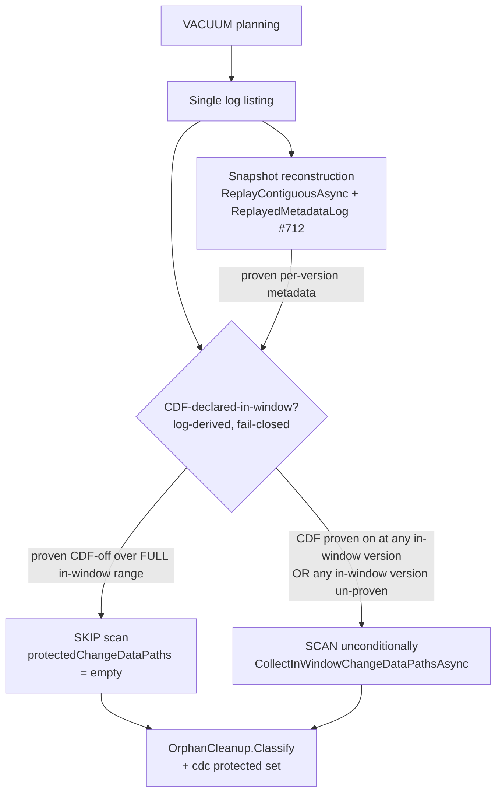
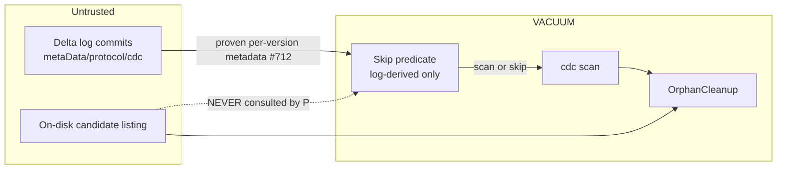

# VACUUM in-window CDC-scan skip (log-derived, fail-closed)

> **Status:** Draft
> **Issue:** [#809](https://github.com/khaines/deltasharp/issues/809) — perf(vacuum): safe log-derived skip of the in-window cdc scan when CDF was never declared (#641 item 3)
> **Author:** design-doc skill (orchestrated)
> **Reviewers:** cloud-native-distributed-systems-architect, cloud-native-security-sme, cloud-native-site-reliability-engineer, performance-benchmarking-engineer, delta-storage-format-engineer, reliability-test-chaos-engineer
> **Last Updated:** 2026-08-14
> **Related:** #641 (items 1/2/4 delivered in #640/#800), #489 (cdc protection), #712 (`ReplayedMetadataLog` bounded pre-range gate), PR #640 R3 red-team (safety constraint)

---

## 1 · Overview

VACUUM must not reclaim a Change-Data-Feed (`_change_data/`) file that is still referenced by a retained,
in-window `cdc` action. Because a `cdc` action is ignored by snapshot replay (INV C1) and is not carried in
checkpoints, the loaded snapshot cannot know cdc paths; VACUUM therefore performs an **in-window cdc scan** —
reading **every** in-window commit JSON (bounded by `delta.logRetentionDuration`) to collect
`AddCdcFileAction` paths into an additional protected set passed to `OrphanCleanup` (#489). That scan's cost
grows with retention depth (now observable via the #641 item-2 telemetry: `deltasharp.delta.vacuum.cdc_scan.commits`
/ `.duration`).

When the retained protocol/metadata history **never declared Change Data Feed over the full in-window range**,
no `cdc` action can exist in-window, so the scan is provably unnecessary. This design adds a **safe, log-derived,
fail-closed skip** of the in-window cdc scan for that case. It is a **pure cost optimization** layered over an
already fail-closed, single-listing, tail-guarded scan; scanning unconditionally remains the correctness
reference.

**Requirements traceability:** #809 acceptance criteria (§3.5). Honors the PR #640 R3 red-team **hard safety
constraint** (§5): the skip predicate is derived **solely from the log**, never from the candidate listing and
never from the current-snapshot enablement flag.

**Non-goals:** changing the protection set of any CDF-bearing table; changing the scan itself; skipping based
on candidate paths or the snapshot's current CDF flag; reclaiming cdc files referenced by commits aged past
log retention (already correctly reclaimable).

---

## 2 · Logical architecture

### 2.1 Where the skip sits

### 2.2 The predicate (the crux)

The scan is skipped **iff the log PROVES that Change Data Feed was inactive across every in-window commit —
at *both* boundaries of each commit and over the whole in-window version set**. Three subtleties, each a
data-loss trap if mishandled, shape the exact predicate (all surfaced by the design red-team + storage review
and pinned as required tests in §3):

**(a) In-window version set — use the scan's EXACT complement.** The scan
(`CollectInWindowChangeDataPathsAsync`) reads commit `v` unless `v`'s mtime is *known* AND `< cutoff`; a commit
with an **unknown/missing timestamp is treated as in-window** (documented fail-safe — a stale listing that
drops a timestamp must not drop protection). The predicate therefore iterates the **identical set**
`{ v ∈ listing.Commits : NOT (mtime(v) known AND mtime(v) < cutoff) }` — i.e. unknown-mtime commits are
**in-window for the predicate too**. A `>= cutoff` phrasing (which *excludes* unknown-mtime) would let a
version the scan protects fall outside the predicate → data loss. The predicate's set must be a
**superset-or-equal** of the scan's.

**(b) PREVAILING enablement at both boundaries — not the version's own `metaData`.** CDF-active is a *stateful*
property: a version with no `metaData` inherits the prevailing state. And a single commit may **transition**
CDF (a `metaData` disabling CDF) **while still carrying `cdc` files** produced under the pre-transition state
(or vice-versa). So a version `v` is treated as **CDF-declared** if CDF was active in **either** its
`prevailingBefore` **or** its `prevailingAfter` state. `ReplayedMetadataLog` already records both
(`ObservedCommit(metadata, prevailingBefore, prevailingAfter)`); the predicate consumes the prevailing pair,
**never** the version's own carried `metaData` (which is empty for an inheriting version and would score a
CDF-on inheritor as off → data loss). Where the observer exposes only the carried `metaData` today, a small
extension to surface the proven `prevailingBefore`/`prevailingAfter` is required (§9 Q1).

**(c) "Proven" over the FULL range — fail-closed on any gap.** For every in-window version, the prevailing
pair must be **proven from the log**. `ReplayedMetadataLog.TryGetProvenObservation` proves a version only inside
its contiguous coverage `[CoveredFromInclusive, CoveredToExclusive)` (and the observer is fail-closed inert
past `MaxRetainedObservations`, #712). The coverage is seeded from the reconstruction's replay floor (the
**latest checkpoint + 1**, see §2.4) plus the proven lineage *entering* coverage, so the prevailing state at
the window's low end must itself be proven. Any in-window version whose prevailing pair is **not proven**
(below coverage, or observer inert) makes the decision **un-proven → SCAN**.

**CDF-active, not the raw property flag.** The write door gates cdc production on
`ChangeDataFeedFeature.IsActive` = (`changeDataFeed` writer feature in `protocol.WriterFeatures`) **AND**
`delta.enableChangeDataFeed=true` (`ChangeDataFeedFeature.cs`). Since cdc-produced ⟹ `IsActive` ⟹
property==true, proving the **property** off is a *conservative superset* proof that no cdc was produced —
so the predicate reuses `ChangeDataFeedFeature.IsEnabled(config)` on the proven prevailing metadata
(property-only), which can only ever cause an *unnecessary* scan, never a wrong skip (§9 Q3 resolved). The
observer records only `MetadataAction`s (it discards `protocol` actions), so a writer-feature check is neither
available there nor needed given the direction-of-safety.

Decision:

| Condition over the FULL in-window version set (scan's exact complement) | Action |
|---|---|
| Every in-window version proves **CDF property off in BOTH `prevailingBefore` and `prevailingAfter`** | **SKIP** (empty cdc protected set) |
| Any in-window version proves the property **on at either boundary** | SCAN (a cdc file may exist) |
| Any in-window version's prevailing pair is **un-proven** (below coverage / observer inert / unknown-mtime not covered) | **SCAN (fail-closed)** |

The last two rows are the safety keystone: the skip only ever elides work the log has *proven* redundant at
both commit boundaries over the exact set the scan would read.

### 2.3 Why this is safe where a cheaper predicate is not

A `cdc` file exists in-window only if CDF was enabled **at the version that wrote it**. The predicate is
therefore evaluated per-version over the whole in-window range — so it correctly handles **enable-then-disable
within the window** (the version where CDF was on is proven-on → SCAN), which the current-snapshot flag would
miss. It never consults candidate paths, so it cannot be defeated by a double-encoded / non-canonical cdc path
(`_change_data%252F…`) that `OrphanCleanup` would protect but a prefix predicate would skip (→ data loss). See
§6 for the full STRIDE analysis.

### 2.4 Coverage, cost model & benefit envelope (honest)

`ReplayedMetadataLog` observes the reconstruction's **replayed** commits, which are seeded from the **latest
checkpoint + 1** (`replayStart = checkpointVersion + 1`). So the proven coverage is the **post-checkpoint tail**
`[latestCheckpoint+1, latest]`, extended downward only by the proven lineage entering it — **not** the whole
history. Consequences:

- **Benefit envelope (corrected).** The skip fires only when the **entire in-window set is within coverage** —
  i.e. (a) the reconstruction did a **full JSON replay** (no usable checkpoint ≤ target: checkpoint-less,
  small, or log-cleaned tables), or (b) the retention window sits **entirely above the latest checkpoint**
  (the scan was already cheap). For a **checkpoint-seeded deep-retention** table — precisely the case the #641
  item-2 telemetry flags as expensive — the in-window range extends far **below** the checkpoint seed, is
  un-proven, and VACUUM **scans**. The optimization therefore saves the in-window commit-JSON **re-read on
  full-replay reconstructions**; it does **not** shrink the scan on checkpoint-seeded deep-retention tables.
  §4's targets are stated against this real envelope, not the misleading "deep-retention" headline.
- **The limiter is the checkpoint seed floor, not the #712 inert cap.** A never-CDF, metadata-stable table
  records almost nothing in the observer (an entry is retained only when a `metaData` is present or lineage
  moves), so it essentially never goes inert regardless of commit count. The binding limit on coverage is the
  replay floor.
- **Zero added I/O.** When the observer is piggybacked on VACUUM's existing reconstruction (§2.5), the predicate
  is `O(in-window versions)` in-memory prevailing-pair lookups; on a proven skip it elides the
  `O(in-window commits)` JSON re-read. When un-proven, cost = today's scan + one in-memory pass (negligible).

### 2.5 Component boundaries & plumbing

VACUUM currently reconstructs via a code path that passes a **null** metadata observer (the observer is only
populated for the CDF read-door start-snapshot today). To use it, VACUUM must **piggyback an observer on its
existing reconstruction** — an overload that returns the sealed `ReplayedMetadataLog` alongside the snapshot —
**never a second reconstruction** (which would re-pay the seed+replay cost and defeat the optimization).
Sealing the observer also introduces a new fail-closed lineage check (`EnsureLineageIsAccountedFor` can throw
`DeltaProtocolException`), turning a currently-succeeding VACUUM into a fail-closed error on an unaccountable
lineage — safe (no data loss) but an availability change to call out (§8).

| Component | Responsibility | Change |
|---|---|---|
| `DeltaVacuum` | Orchestrate protection; call the skip predicate; scan or skip | Add the gated skip; consume the piggybacked observer |
| `DeltaLog` | Reconstruct the snapshot | Add an overload that returns the sealed `ReplayedMetadataLog` from VACUUM's *existing* reconstruction |
| `ReplayedMetadataLog` (#712) | Prove per-version metadata | Surface the proven `prevailingBefore`/`prevailingAfter` pair (it already records both) |
| `ChangeDataFeedFeature` | Enablement predicate | Reuse `IsEnabled(config)` for the property-only check (single-source with the write door) |
| `OrphanCleanup` | Consume the cdc protected set | **Unchanged** (empty set on skip is identical to "no in-window cdc") |
| Telemetry (#641 item 2) | scan cost + `VacuumCdcScanCompleted` | Emit a distinct **skipped** signal (§7) so a skip is observable, not silent |

### 2.6 API surface

Internal only. A `DeltaLog` reconstruction overload returning `(snapshot, ReplayedMetadataLog)`, plus a query
that returns a tri-state over the in-window set — **proven-none** (skip), **proven-some / un-proven** (scan).
No public API change.

---

## 3 · Functional test scenarios & correctness oracles

### 3.1 Happy path
- **Never-CDF, window within coverage → SKIP.** A table that never enabled CDF, reconstructed so the observer
  covers the in-window range: assert `CollectInWindowChangeDataPathsAsync` is **not** called (spy/telemetry),
  the deletion set equals the unconditional-scan baseline, and the skipped signal is emitted.

### 3.2 Safety edge cases (must scan) — each a red-team/storage-review data-loss trap
- **Enable-then-disable across versions → SCAN + protection preserved (AC-1).** CDF on at `vₐ` (cdc file), off
  at `v_b > vₐ`, both in-window: scan runs; cdc file protected.
- **Transitioning commit → SCAN.** A single in-window commit `v` that carries a `metaData` toggling CDF **and**
  `AddCdcFileAction`s: because the predicate checks **both** `prevailingBefore` and `prevailingAfter`, `v` is
  scored CDF-on (on at one boundary) → scan → its cdc files protected. (Both the ON→OFF and OFF→ON transitions.)
- **Inherited CDF-on (no `metaData` at the version) → SCAN.** CDF enabled before the window and still on;
  in-window versions carry no `metaData` of their own: the prevailing pair proves CDF-on → scan. (Guards the
  "carried-vs-prevailing" trap — a per-version-`metaData`-only predicate would wrongly skip.)
- **Unknown/missing-mtime in-window commit → SCAN/protected.** A commit whose timestamp the listing lacks is
  in-window for **both** the scan and the predicate; if it carries cdc it is protected. (Guards the in-window
  set-alignment trap.)
- **Un-proven in-window version → SCAN (fail-closed).** Window extends below coverage (checkpoint-seeded deep
  retention) or observer inert: scan even though the *snapshot* flag is CDF-off.
- **Forged / non-conforming cdc-without-enablement → SCAN vs SKIP divergence (residual).** The unconditional
  scan protects **any** `AddCdcFileAction.Path` regardless of metadata; the skip *infers* cdc-absence from
  proven enablement, so it assumes `cdc ⟹ CDF-active-at-that-version` (true for a DeltaSharp-written log). A
  test pins that a conforming toggled/inherited table is co-extensive; the forged case is an explicit residual
  (§6) — the differential oracle corpus (§3.3) MUST include a forged cdc-without-enablement table so this
  divergence is measured, and the decision (accept residual vs. keep scanning on any protocol anomaly) is
  made by evidence.
- **Double-encoded / non-canonical cdc candidate → never deleted (AC-2).** Such a table has an in-window
  CDF-on (or un-proven) version → scan → protected; the skip is path-agnostic.

### 3.3 Coverage-neutrality (AC-5)
- **Differential oracle:** for a corpus of CDF-bearing tables (enabled throughout, enabled-late, toggled,
  deep-retention), the protected `_change_data/` set and the final deletion set are **identical** with the skip
  enabled vs. a forced-unconditional-scan control. Pin as a property test.

### 3.4 Determinism
- The predicate is a pure function of the log listing + proven metadata (no wall-clock, no candidate listing);
  same inputs → same decision. No timing/flakiness.

### 3.5 Acceptance-criteria mapping

| #809 AC | Scenario |
|---|---|
| Skip gated solely on log-derived protocol history over the full in-window range | §2.2 predicate; §3.2 un-proven→scan |
| Enabled-then-disabled within window is still scanned | §3.2 (AC-1) |
| Double-encoded/non-canonical cdc candidate never deleted | §3.2 (AC-2) |
| Measured scan-cost reduction on deep-retention never-CDF table | §4 benchmark; §3.1 |
| No change to protected `_change_data/` paths on any CDF-bearing table | §3.3 (AC-5) differential oracle |

---

## 4 · Performance

- **Workload profile.** VACUUM on a table; today the in-window cdc scan is `O(in-window commits)` commit-JSON
  reads. Cost is highest on **checkpoint-seeded deep-retention** tables (the #641 item-2 telemetry target).
- **Benefit envelope (corrected — see §2.4).** The skip fires only when the **whole in-window set is within
  observer coverage**: a **full-JSON-replay** reconstruction (checkpoint-less / small / log-cleaned tables) or
  a retention window entirely above the latest checkpoint. On those, a never-CDF table does **zero**
  commit-JSON reads for cdc protection (`cdc_scan.commits → 0`, `duration → ~0`). It does **not** fire on a
  checkpoint-seeded deep-retention table (the in-window range is below the replay floor → un-proven → scan);
  that case is unchanged.
- **Regression gate (scoped to the envelope).** For a never-CDF, **full-replay-reconstructed** table with the
  in-window set within coverage: `cdc_scan.commits == 0`. For every CDF-bearing or checkpoint-seeded table:
  cost unchanged within noise, and the differential coverage-neutrality oracle (§3.3) green. **No** gate
  claiming a reduction on checkpoint-seeded deep-retention tables (the earlier draft's error).
- **Predicate cost.** `O(in-window versions)` in-memory prevailing-pair lookups; no allocation beyond the
  version enumeration; no I/O. When un-proven, cost = today's scan + one in-memory pass.
- **Benchmark.** Harness VACUUM over synthetic tables at retention depths, {full-replay vs. checkpoint-seeded}
  × {never-CDF vs. CDF-bearing}, measuring `cdc_scan.commits`/`.duration` and total wall-clock; assert the
  envelope above.

---

## 5 · Security

- **Data classification.** cdc `_change_data/` files contain **tenant row data** (Restricted). Erroneously
  reclaiming one is **irreversible data loss** — the highest-severity failure mode for this component.
- **Input validation.** The predicate consumes only the log the snapshot was built on (proven metadata +
  commit-file mtimes from the single listing). It **never** reads or trusts the candidate listing, and **never**
  reads the current-snapshot enablement flag — the two unsafe sources the PR #640 R3 red-team called out.
- **Fail-closed default.** Any uncertainty (un-proven version, inert observer, absent coverage) resolves to
  **scan**. The optimization can only ever elide work the log has proven redundant; it can never enlarge the
  reclaimable set beyond the unconditional scan.
- **Tenant isolation / secrets.** No new object-store credentials, paths, or cross-tenant surface; the change is
  a control-flow gate inside an existing single-tenant VACUUM operation. No message emits a candidate path.

---

## 6 · Threat model

**Trust boundary:** the skip predicate trusts **only** the reconstruction's proven metadata lineage
(`ReplayedMetadataLog`), which is itself derived from — and fail-closed against — the log. The candidate listing
is explicitly outside the predicate's trust boundary.

| STRIDE | Threat | Mitigation | Residual |
|---|---|---|---|
| **Tampering→Data-loss** | A crafted cdc path (double-encoded, non-`_change_data/`) protected-if-scanned but skipped by a path predicate → deleted | Predicate is **not** path-based; such a table has an in-window CDF-on/un-proven version → scan → protected | None |
| **Spoofing (stale/carried enablement)** | CDF enabled before window (inherited) or the snapshot flag reads off | Per-version **prevailing** pair (before AND after) over the full range catches inherited on | None |
| **Transitioning commit** | One commit toggles CDF and writes cdc in the same version | Checking **both** `prevailingBefore` and `prevailingAfter` scores the version CDF-on → scan | None |
| **In-window set skew** | Unknown-mtime commit protected by the scan but excluded by a `>= cutoff` predicate | Predicate uses the scan's **exact complement** `NOT(known AND mtime<cutoff)` → superset-or-equal | None |
| **Elevation (coverage gap)** | In-window versions below the checkpoint-seed replay floor are invisible | Un-proven → fail-closed **scan** | None (conservative) |
| **DoS (observer inert)** | `>` `MaxRetainedObservations` retained metadata revisions make the observer inert (#712) | Inert → un-proven → scan; note the **binding** limit for never-CDF tables is the checkpoint seed floor, not the inert cap (a metadata-stable table records almost nothing) | Accepted |
| **Tampering (forged cdc-without-enablement)** | A non-conforming/forged log carries a `cdc` action while prevailing enablement is off; scan protects, skip infers-absent → deletes | The skip assumes `cdc ⟹ CDF-active-at-that-version` (holds for a DeltaSharp-written log). Differential oracle (§3.3) includes a forged corpus; decision = accept residual OR keep scanning on any protocol anomaly | **Real residual** — must be adjudicated with evidence before ship (§9 Q3b) |
| **Repudiation** | A skip is silent | Distinct **skipped** telemetry + log (§7) recording the decision | None |

---

## 7 · Observability

- **Metrics.** Reuse the #641 item-2 instruments. On skip, emit `cdc_scan.commits = 0` with a bounded
  `skipped=true` (or a distinct `deltasharp.delta.vacuum.cdc_scan.skipped` counter) so a skip is
  **distinguishable** from a zero-commit scan, and `duration ≈ 0`.
- **Logs.** A distinct Information log (e.g. `DeltaVacuumCdcScanSkipped`, new EventId in the 41xx VACUUM range)
  rendering only the bounded proven-version count and the in-window range size — no paths, no tenant tokens
  (mirrors the existing VACUUM log-site hygiene / `StorageLogSiteSignatures` roster).
- **Correlation.** Stamp the same vacuum `activity`/operation scope the scan telemetry uses, so a skip and a
  scan sit on the same VACUUM trace.
- **Dashboards / alerting.** No new alert; the existing `cdc_scan.duration` panel simply shows 0 on skipped
  runs. An unexpectedly *high* scan cost on a known-never-CDF table (i.e. skip not firing due to coverage) is a
  tuning signal, not an incident.

---

## 8 · Rollout & risk

- **Rollout.** Pure internal optimization; no CRD/operator/API change. Ship behind the existing VACUUM path.
- **Feature gate (optional).** A config/kill-switch to force unconditional scan (revert to today's behavior)
  de-risks the first release and gives an operator an escape hatch; the unconditional scan remains the
  correctness reference.
- **Rollback.** Trivially revertible (the gate falls back to the always-correct scan). No data/metadata
  migration; no persisted state changes.
- **Risk register.** Top risk = a predicate bug that skips when it should scan (data loss). Mitigations: the
  differential coverage-neutrality oracle (§3.3) run in CI over a table corpus; fail-closed default; and the
  kill-switch. Severity is why this is a design-doc-first, threat-modeled change despite being "optional."
- **Launch checklist.** Coverage-neutrality property test green over the corpus; enable-then-disable and
  un-proven→scan tests green; benchmark shows `cdc_scan.commits == 0` on never-CDF-in-coverage; skipped
  telemetry/log wired and roster-registered; VACUUM log-site hygiene guard passes.

---

## 9 · Open questions & decisions

1. **Plumbing & prevailing exposure (RESOLVED — direction set).** VACUUM's current reconstruction passes a
   **null** observer, so `ReplayedMetadataLog` is not populated for it today. Decision: add a `DeltaLog`
   reconstruction overload that **piggybacks** the observer on VACUUM's *existing* reconstruction and returns
   the sealed observer (never a second reconstruction), and **extend `ReplayedMetadataLog` to surface the
   proven `prevailingBefore`/`prevailingAfter` pair** (it already records both) — the predicate needs prevailing
   state, not the version's carried `metaData`.
2. **In-window set alignment (RESOLVED).** The predicate iterates the scan's **exact complement**
   `NOT(mtime known AND mtime < cutoff)` over the same `logListing`; unknown-mtime commits are in-window for the
   predicate (matching the scan's fail-safe). Pinned by the unknown-mtime test (§3.2).
3. **Enablement signal (RESOLVED — property-only).** Use `ChangeDataFeedFeature.IsEnabled(config)` on the proven
   prevailing metadata. Since cdc-produced ⟹ `IsActive` ⟹ property==true, proving the property off is a
   conservative superset proof (property-only can only cause an *unnecessary* scan, never a wrong skip). The
   observer discards `protocol` actions, so a writer-feature check is neither available there nor needed.
   **(3b) Forged cdc-without-enablement residual (OPEN — must adjudicate before ship).** The unconditional scan
   protects any cdc path regardless of metadata; the skip assumes `cdc ⟹ CDF-active`. For a conforming
   DeltaSharp-written log this holds; a forged/foreign log could diverge (§6). Decide with the forged-corpus
   differential oracle: accept the residual (document it), or keep scanning whenever the proven protocol shows
   any anomaly.
4. **Benefit scope (RESOLVED — honestly scoped).** The saving materializes on **full-replay** reconstructions
   (or windows above the checkpoint), **not** on checkpoint-seeded deep-retention tables (the in-window range is
   below the replay floor). Quantify how often real never-CDF tables reconstruct via full replay; extending
   observer coverage below the checkpoint (to widen the envelope) is out of scope here and noted for a follow-up.
5. **New VACUUM failure surface.** Sealing a real observer runs `EnsureLineageIsAccountedFor`, which can throw
   `DeltaProtocolException` — a currently-succeeding VACUUM could fail closed on an unaccountable lineage. Safe
   (no data loss), but confirm the availability trade-off is acceptable and covered by a test.

---

## 10 · References

- Issue [#809](https://github.com/khaines/deltasharp/issues/809); [#641](https://github.com/khaines/deltasharp/issues/641) item 3; [#489](https://github.com/khaines/deltasharp/issues/489); [#712](https://github.com/khaines/deltasharp/issues/712).
- `src/DeltaSharp.Storage/Delta/DeltaVacuum.cs` (in-window cdc scan + the in-source #641-item-3 rationale).
- `src/DeltaSharp.Storage/Delta/ReplayedMetadataLog.cs` (bounded, fail-closed proven-metadata observer, #712).
- `src/DeltaSharp.Storage/Delta/OrphanCleanup.cs` (cdc protected-set consumption; encoding-robust matching #490).
- `docs/engineering/design/storage-delta-architecture.md` (§2 VACUUM / cdc protection), `change-data-feed.md`, `observability-conventions.md`.
- PR #640 R3 red-team (hard safety constraint); #800 (Stage E: #641 items 2 & 4).
