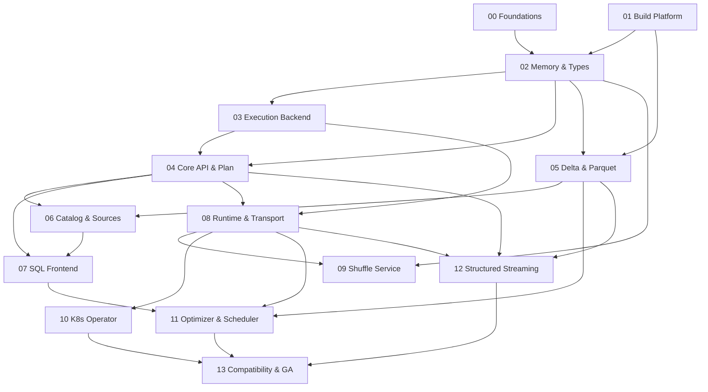

# DeltaSharp Workstream Plan (v1)

A **draft** workstream hierarchy that breaks the [Roadmap to v1](../../ROADMAP.md)
into executable work. It is the planning source that will be converted into GitHub
artifacts (milestones, epics, issues) later. It defers to the
[ADRs](../adr/README.md) and the [engine architecture overview](../engineering/design/engine-architecture.md);
where this plan and an ADR disagree, the ADR wins.

> **Status: draft.** Scope, sequencing, and breakdown will evolve. Estimates are
> relative (T-shirt sizes), not dates.

## Hierarchy

```
Epic  (= a roadmap-milestone-aligned objective with exit criteria)
└── Feature  (a shippable capability within an epic)
    └── Story  (a consumable, well-defined unit of work with verifiable acceptance criteria)
```

- **Epic** — a large objective tied to a roadmap milestone. Defines the
  **objective**, **scope (in/out)**, and **verifiable exit criteria**. Owns
  Features. ID: `EPIC-NN`.
- **Feature** — a coherent capability that delivers value within an Epic. Has an
  objective and **implementer persona(s)**. Owns Stories. ID: `FEAT-NN.M`.
- **Story** — a small, well-defined deliverable (typically scoped to a component or
  "object") with a clear statement, **verifiable acceptance criteria**, a
  definition of done (referencing the engineering checklists), dependencies, a
  size, and the **implementer persona(s)** required to do the work. ID:
  `STORY-NN.M.K`.

## Implementer persona assignment (required)

**Every Feature and Story names the agent persona(s) required to implement it**,
using exact slugs from the 25-role roster in
[`docs/persona/agents/README.md`](../persona/agents/README.md). Use a **Primary**
(owns delivery) and optional **Collaborators**. This makes the plan a work→agent
assignment map for later automation.

<details><summary>Valid persona slugs (25)</summary>

`product-manager`, `program-manager`, `cloud-native-distributed-systems-architect`,
`cloud-native-site-reliability-engineer`, `cloud-native-security-sme`,
`privacy-compliance-grc-lead`, `technical-writer`,
`developer-experience-api-engineer`, `delta-storage-format-engineer`,
`query-execution-engine-engineer`, `data-platform-connectors-engineer`,
`performance-benchmarking-engineer`, `reliability-test-chaos-engineer`,
`compute-storage-finops-engineer`, `dotnet-framework-runtime-engineer`,
`dotnet-runtime-performance-engineer`, `dotnet-vectorized-columnar-compute-engineer`,
`dotnet-distributed-execution-engineer`, `dotnet-library-platform-engineer`,
`catalog-metastore-engineer`, `sql-language-frontend-engineer`,
`structured-streaming-engine-engineer`, `kubernetes-operator-controller-engineer`,
`query-optimizer-scheduler-engineer`, `developer-relations-community-lead`.

</details>

## Acceptance-criteria conventions

- Criteria are **verifiable** (a reviewer can objectively confirm pass/fail).
  Prefer **Given / When / Then**, or a checklist of observable outcomes.
- Each Story's **Definition of Done** references the relevant
  [engineering checklists](../engineering/checklists/README.md) (e.g., `03a`, `04a`,
  `17`, `21`) and requires `dotnet build`, `dotnet test`, and
  `dotnet format --verify-no-changes` to pass with DCO-signed commits.
- Sizes are relative: **XS, S, M, L, XL**.

## GitHub mapping (for later artifact creation)

| Plan level | GitHub artifact | Labels |
|---|---|---|
| Roadmap milestone | **Milestone** | — |
| Epic | tracking **Issue** (sub-issues = Features) | `epic`, `milestone:Mn` |
| Feature | **Issue** (sub-issues = Stories) | `feature`, `epic:NN` |
| Story | **Issue** | `story`, `feature:NN.M`, `persona:<slug>`, `size:<S>` |

Persona slugs become `persona:<slug>` labels so work can be routed to the right
specialist agent.

## Epic index

| Epic | Title | Roadmap milestone | Primary persona(s) | Related ADRs | Depends on |
|---|---|---|---|---|---|
| [00](epics/EPIC-00-engineering-foundations.md) | Engineering Foundations (CI/CD, security & observability baseline, test infra) | M1 | `cloud-native-site-reliability-engineer`, `dotnet-library-platform-engineer`, `cloud-native-security-sme` | 0014, 0015 | — |
| [01](epics/EPIC-01-project-build-platform.md) | Project & Build Platform (solution, layout, multi-target, AOT, analyzers) | M1 | `dotnet-library-platform-engineer` | 0014, 0001 | — |
| [02](epics/EPIC-02-columnar-memory-type-system.md) | Columnar Memory & Type System | M1 | `dotnet-vectorized-columnar-compute-engineer`, `dotnet-runtime-performance-engineer` | 0002, 0013, 0008 | 01 |
| [03](epics/EPIC-03-vectorized-execution-backend.md) | Vectorized Execution Backend (+ optional codegen tier, parity oracle) | M1 | `dotnet-vectorized-columnar-compute-engineer`, `query-execution-engine-engineer` | 0001 | 02 |
| [04](epics/EPIC-04-core-api-logical-plan.md) | Core API & Logical Plan (SparkSession/DataFrame/Dataset; local execution) | M1 | `developer-experience-api-engineer`, `query-execution-engine-engineer` | 0008, 0001 | 02, 03 |
| [05](epics/EPIC-05-delta-parquet-storage.md) | Delta & Parquet Storage | M2 | `delta-storage-format-engineer` | 0011, 0002 | 01, 02 |
| [06](epics/EPIC-06-catalog-data-sources.md) | Catalog & Data Sources | M2 | `catalog-metastore-engineer`, `data-platform-connectors-engineer` | 0005 | 04, 05 |
| [07](epics/EPIC-07-sql-frontend.md) | SQL Frontend (ANTLR4, ANSI, analyzer/resolution) | M2 | `sql-language-frontend-engineer` | 0007 | 04, 06 |
| [08](epics/EPIC-08-distributed-runtime-transport.md) | Distributed Runtime & Transport | M3 | `dotnet-distributed-execution-engineer` | 0003, 0012 | 03, 04 |
| [09](epics/EPIC-09-native-remote-shuffle.md) | Native Remote Shuffle Service | M3 | `dotnet-distributed-execution-engineer`, `delta-storage-format-engineer` | 0004 | 02, 08 |
| [10](epics/EPIC-10-kubernetes-operator.md) | Kubernetes Operator & CRDs | M3 | `kubernetes-operator-controller-engineer` | 0009 | 08 |
| [11](epics/EPIC-11-optimizer-scheduler.md) | Query Optimizer, Statistics, AQE & Scheduler | M4 | `query-optimizer-scheduler-engineer` | 0006 | 05, 07, 08 |
| [12](epics/EPIC-12-structured-streaming.md) | Structured Streaming (micro-batch) | v1.0 | `structured-streaming-engine-engineer` | 0010 | 04, 05, 08 |
| [13](epics/EPIC-13-compatibility-hardening-ga.md) | Spark Compatibility, Hardening & GA Release | v1.0 | `performance-benchmarking-engineer`, `reliability-test-chaos-engineer`, `technical-writer`, `developer-relations-community-lead` | all | 01–12 |

## Dependency overview



## Status legend

`draft` · `ready` · `in-progress` · `done` · `blocked`. All items here are `draft`.
